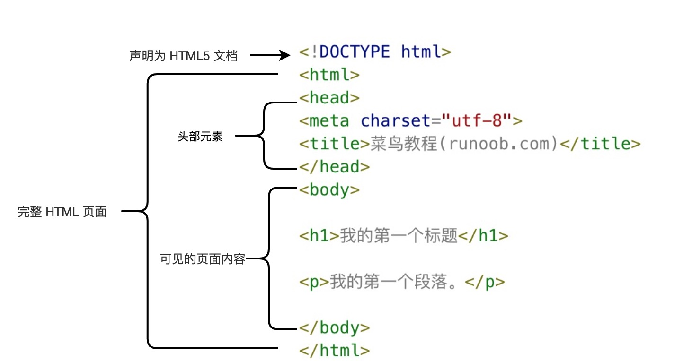
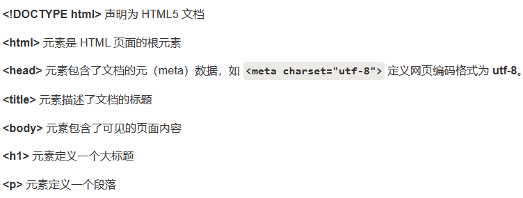
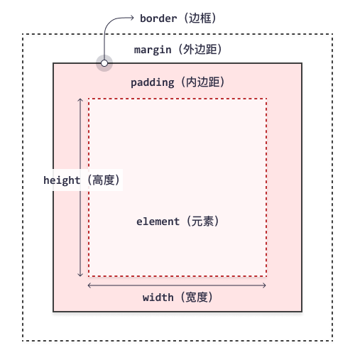

# HTML

#### 1、简介

​		超文本标记语言（英语：HyperText Markup Language，简称：HTML）是一种用于创建网页的标准标记语言。HTML 运行在浏览器上，由浏览器来解析。**基本格式**：




#### 2、DOCTYPE

​		DOCTYPE声明有助于浏览器中正确显示网页。声明是不区分大小写的，用来告知 Web 浏览器页面使用了哪种 HTML 版本。

> HTML5        -> \<!DOCTYPE html>
>
> HTML 4.01   -> \<!DOCTYPE HTML PUBLIC "-//W3C//DTD HTML 4.01 Transitional//EN""http://www.w3.org/TR/html4/loose.dtd">

#### 3、head

在 \<head>元素中你可以插入脚本（scripts）, 样式文件（CSS），及各种meta信息。可以添加在头部区域的元素标签为: \<title>, \<style>, \<meta>, \<link>, \<script>, \<noscript> 和 \<base>。

**title**：

​		标签定义了不同文档的标题。不仅可以显示文本，也可以在左侧显示logo等图片。显示时，要将\<link>标签放入\<head>里。

​	   `<title>这是一个带图片的标签</title>`

​      `<link rel="shortcut icon" href="图片url">`

**base**：

​		\<base> 标签描述了基本的默认链接地址`herf`或链接目标`target`，该标签作为HTML文档中所有的链接标签的默认链接

**link**：

​		\<link> 标签定义了文档与外部资源之间的关系。\<link> 标签通常用于链接到样式表

**style**：

​		\<style> 标签定义了HTML文档的样式文件引用地址

**meta**： 标签提供了元数据.元数据也不显示在页面上，但会被浏览器解析。META 元素通常用于指定网页的描述，关键词，文件的最后修改时间，作者，和其他元数据。

​		对于中文网页需要使用\<meta charset="utf-8"> 声明编码，否则会出现乱码。有些浏览器(如 360 浏览器)会设置 GBK 为默认编码，则你需要设置为 \<meta charset="gbk">。==对于仍出现网页乱码问题==，可能是 meta 标签设置的编码和网页文件保存时所使用的文档编码不相同造成的！

**script**：

​		\<script>标签用于加载脚本文件，如： JavaScript

#### 4、body

> 常用的标签属性：
>
> **class**：为html元素定义一个或多个类名（classname）(类名从样式文件引入)
>
> **id**：定义元素的唯一id
>
> **style**：规定元素的行内样式（inline style）
>
> **title**：描述了元素的额外信息 (作为工具条使用)

**h：**标题（Heading）是通过\<h1> - \<h6> 标签来定义的。

**p：**段落是通过标签 \<p> 来定义的。

- **br**：如果您希望在不产生一个新段落的情况下进行换行（新行），请使用 \<br/> 标签
- **b i**：\<b>("bold") 、\<strong>与 \<i>("italic")、\<em> 对输出的文本进行格式, 如：**粗体** or *斜体*
- **u**：带下划线的字
- **font**：规定文本的尺寸、字体和颜色：
- **em**：定义着重文字
- **small**：定义小号字
- **strong**：定义加重语气
- **sub**：定义上标字
- **sup**：定义下标字
- **ins**：定义插入字
- **del**：定义删除字
- **code**：定义计算机代码
- **kbd**：定义键盘码
- **var**：定义变量
- **pre**：定义预格式文本
- **abbr**：定义缩写 `The<abbr title="World Health Organization">WHO</abbr> was founded in 1948.`
- **address**：定义地址
- **bdo**：定义文字方向，`<bdo dir="rtl">该段落文字从右到左显示。</bdo>`
- **blockquote**：定义长的引用
- **q**：定义短的引用语
- **cite**：定义引用、引证
- **dfn**：定义一个定义项目
- **hr：**\<hr/>标签在 HTML 页面中创建水平线。

**a：**链接是通过标签 \<a> 来定义的。

> target属性值：
>
> - _blank：新窗口打开。
> - _parent：在父窗口中打开链接。（页面中使用框架才有用）
> - _self：默认，当前页面跳转。
> - _top：在当前窗体打开链接，并替换当前的整个窗体(框架页)。（突破了页面框架的限制）
> - 还有一个iframe的name属性值
>
> href：规定链接的目标 URL。可以跳转到本页面的指定位置：通过标识符

**img：**图像是通过标签 \ 来定义的.``

> - alt 属性用来为图像定义一串预备的可替换的文本。在浏览器无法载入图像时，替换文本属性告诉读者她们失去的信息。
> - height（高度） 与 width（宽度）属性用于设置图像的高度与宽度。

- map标签：定义图像地图
- area标签：定义图像地图中的可点击区域

```html
<map name="planetmap">
  <area shape="rect" coords="0,0,82,126" alt="Sun" href="sun.htm"> //"x1,y1,x2,y2
  <area shape="circle" coords="90,58,3" alt="Mercury" href="mercur.htm">//x1,y1,r
  <area shape="circle" coords="124,58,8" alt="Venus" href="venus.htm">
</map>
```

**table**：

​		每个表格均有若干行（由 `<tr>` 标签定义），每行被分割为若干单元格（由 `<td>` 标签（table data）定义）。

- **caption**：表格标题
- **th**：定义表格的表头
- **cal**：定义用于表格列的属性
- **thead**：定义表格的页眉
- **tfoot**：定义表格的页脚
- **tbody**：定义表格的主体

> table属性：
>
> - cellspacing="0"   单元格之间的间距
> - cellpadding=“4” 单元格内部填充
> - width="500"   表格的总宽度；height="100"   表格的总高度
> - align="right"   表格整体对齐方式    (参数有  left、center、right)
> - bgcolor="#fff"   表格整体的背景色
> - border="1"   表格边框的宽度
> - bordercolor="#fff"   表格边框的颜色
>
> tr属性：
>
> - bgcolor="#fff"    行的颜色
> - align="right"    行内文字的水平对齐方式    (参数有left、center、right)
> - valign="top"     行内文字的垂直对齐方式    (参数有top、middle、bottom)
>
> td、th属性：
>
> - width="500"    单元格的宽度，设置后对当前一列的单元格都有影响
> - height="100"   单元格的高度，设置后对当前一行的单元格都有影响
> - bgcolor="fff"  单元格的背景色
> - align="right"  单元格文字的水平对齐方式    (参数left、center、right)
> - rowspan="3"    合并垂直水平方向的单元格
> - colspan="3"    合并水平方向单元格
> - valign="top"   单元格文字的垂直对齐方式    (参数middle、bottom、top) 

**list**：

- **ul**：无序列表 内层子标签`<li>`

> ul属性：
>
> - type：显示类型A a i I 1（default）
> - start：从*开始

- **ol**：有序列表 内层子标签`<li>`

> ol属性：
>
> - type：disc（默认）、circle、square

- **dl**：自定义列表 每个自定义列表项以 `<dt>` 开始。每个自定义列表项的定义以 `<dd>` 开始。

**div**：

​		大多数 HTML 元素被定义为**块级元素**或**内联元素**。块级元素在浏览器显示时，通常会以新行来开始（和结束）。HTML `<div>` 元素是块级元素，它可用于组合其他 HTML 元素的容器。\<div> 元素没有特定的含义。

**span**：

​		HTML `<span>` 元素是内联元素，可用作文本的容器\<span> 元素也没有特定的含义。当与 CSS 一同使用时，\<span> 元素可用于为部分文本设置样式属性。

**from**：HTML 表单用于收集用户的输入信息。

> from属性：
>
> - method属性规定了表单的**提交方式**。
> - action：规定了提交地址；action="MAILTO:someone@example.com"该格式可以提交到邮箱
>
> 注意：所有的输入选项都必须指明name属性，否则该数据不会发送给服务器

- **label**：定义输入项名称，并与之点击关联
- **textarea**：定义一个文本输入域
- **fieldset**：定义了一组相关的表单元素，并使用外框包含起来
- **legend**：定义了 \<fieldset> 元素的标题，即外边框的标题
- **select**：下拉框，默认第一个option为首选，若在其他option中添加checked，则该选项为默认的。disabled：使此选项无法点击。
- **inptut**：输入框

> input-type的常用属性：
>
> - checkbox：复选框
> - radio：单选，同一组的单选按钮，name 取值一定要一致，当设置 checked="checked" 时，该选项被默认选中
> - submit：提交
> - button：按钮 该属性也可以是标签
> - hidden：隐藏
> - reset：定义重置按钮
> - password、text
>
> value：默认值
>
> placeholder：没有值时，默认显示的提示

**iframe**：通过使用框架，你可以在同一个浏览器窗口中显示不止一个页面。

> iframe属性：
>
> - height 和 width 属性用来定义iframe标签的高度与宽度。属性默认以像素为单位, 但是你可以指定其按比例显示 (如："80%")。
> - frameborder 属性用于定义iframe表示是否显示边框。
> - **name**：规定 \<iframe> 的名称。通过设置外部a标签的target属性可以控制iframe框架的页面
> - src：规定在 \<iframe> 中显示的文档的 URL。

#### 5、实体编码

> <\>:\&lt  \&gt;  ≤ ≥ \&le   \&ge;   &copy; \&copy; &reg; \&reg;     

#### 6、路径问题

| 路径                             | 描述                                         |
| -------------------------------- | -------------------------------------------- |
| \         | picture.jpg 位于与当前网页相同的文件夹中     |
| \  | picture.jpg 位于当前文件夹的 images 文件夹中 |
| \ | picture.jpg 当前站点根目录的 images 文件夹中 |
| \      | picture.jpg 位于当前文件夹的上一级文件夹中   |

#  CCS

#### 1、颜色表示方式

①16进制：\#FF0000

②rgb： rgb(255,0,0)

③rgba：在RGB 上扩展包括了 **“alpha”** 通道，运行对颜色值设置透明度。rgba(255,0,0,.5)

④名称：red

#### 2、引入CSS文件

​		当同一个 HTML 元素被不止一个样式定义时，会使用哪个样式呢（层叠次序）？一般而言，所有的样式会根据下面的规则层叠于一个新的虚拟样式表中，其中数字 4 拥有最高的优先权。**就近原则**

1. 浏览器默认设置 

2. 外部样式表 

   ```html
   <head>
      <link rel="stylesheet" type="text/css" href="mystyle.css">
   </head>
   ```

3. 内部样式表（位于 \<head> 标签内部） 

   ```html
   <head>
       <style type="text/css">
           body {background-color: red}
           p {margin-left: 20px}
       </style>
   </head>
   ```

4. 内联样式（在 HTML 元素内部）

   ```html
   <p style="color: red; margin-left: 20px">This is a paragraph</p>
   ```

#### 3、语法规则

1. CSS 规则由两个主要的部分构成：选择器，以及一条或多条声明。每条声明由一个属性和一个值组成。

```properties
selector {declaration1; declaration2; ... declarationN }
selector {property: value}
```

2. 继承问题

​		根据 CSS，子元素从父元素继承属性。但是它并不总是按此方式工作。如下：当前访问系统中存在其中字体之一，就使用该字体

```properties
body {
     font-family: Verdana, sans-serif;
     }
```

#### 4、简单选择器

1. 元素选择器

   元素选择器又称为类型选择器（type selector）。选择器通常将是某个 HTML 元素，比如 p、h1、em、a，甚至可以是 html 本身：

   ```properties
   html {color:black;}
   h1 {color:blue;}
   h2 {color:silver;}
   ```

2. 类选择器

   class可以有多个值，但是id只能有一个值

   ```html
   <head>
       <style type="text/css">
           .important {color:red;}
           p.important {color:red;}
           //选择器现在会匹配 class 属性包含 important 的所有 p 元素，
           //但是其他任何类型的元素都不匹配，不论是否有此 class 属性。
           .important.warning {background:silver;}//多类选择器
       </style>
   </head>
   
   <h1 class="important warning">
   	This heading is very important.
   </h1>
   
   <p class="important">
   	This paragraph is very important.
   </p>
   ```

3. 选择器分组

   将 h2 和 p 选择器放在规则左边，然后用逗号分隔，就定义了一个规则。其右边的样式（color:gray;）将应用到这两个选择器所引用的元素。

   ```properties
   h2, p {color:gray;}
   
   * {color:red;} //通配符选择器
   ```

4. id选择器

   ID 选择器前面有一个 # 号 - 也称为棋盘号或井号。请注意，类选择器和 ID  选择器可能是区分大小写的。

   ```html
   <head>
       <style type="text/css">
   		*#intro {font-weight:bold;}
           //同class 可以忽略*通配符选择器
           #intro {font-weight:bold;}
       </style>
   </head>
   ```

#### 5、组合器选择器

| 选择器                | 示例    | 示例描述                                   |
| :-------------------- | :------ | :----------------------------------------- |
| *element* *element*   | div p   | 选择 <div> 元素内的所有 <p> 元素。         |
| *element*>*element*   | div > p | 选择其父元素是 <div> 元素的所有 <p> 元素。 |
| *element*+*element*   | div + p | 选择所有紧随 <div> 元素之后的 <p> 元素。   |
| *element1*~*element2* | p ~ ul  | 选择前面有 <p> 元素的每个 <ul> 元素。      |

1. 后代选择器

   后代选择器（descendant selector）又称为包含选择器。后代选择器来创建一些规则，使这些规则在某些文档结构中起作用，而在另外一些结构中不起作用。

   ```html
   <head>
       <style type="text/css">
   		//如果希望只对 h1 元素中的 em 元素应用样式
           h1 em {color:red;}
       </style>
   </head>
   ```

2. 子元素选择器

   与后代选择器相比，子元素选择器（Child selectors）只能选择该元素的第一子代。

   ```html
   <head>
       <style type="text/css">
           //如果希望选择只作为 h1 元素子元素的 strong 元素(包含strong的所有子元素)
           h1 > strong {color:red;}
       </style>
   </head>
   
   //这个规则会把第一个 h1 下面的两个 strong 元素变为红色，但是第二个 h1 中的 strong 不受影响：
   <h1>This is <strong><div>very</div>good</strong> important.</h1>
   <h1>This is <em>really <strong>very</strong></em> important.</h1>
   ```

3. 相邻兄弟选择器

   相邻兄弟选择器（Adjacent sibling selector）可选择紧接在另一元素后的元素，==且二者有相同父元素==。

   ```html
   <head>
       <style type="text/css">
           //如果要增加紧接在 h1 元素后出现的段落的上边距
           h1 + p {margin-top:50px;}
       </style>
   </head>
   ```

4. 通用兄弟选择器

   通用兄弟选择器匹配属于指定元素的同级元素的所有元素。下面的例子选择属于 \<div> 元素的同级元素的所有 \<p> 元素：

   ```html
   <head>
       <style type="text/css">
           div ~ p {
             background-color: yellow;
           }
       </style>
   </head>
   ```

#### 6、属性选择器

如果希望选择有某个属性的元素，而不论属性值是什么，可以使用简单属性选择器。

| 选择器                | 例子                | 例子描述                                                |
| :-------------------- | :------------------ | :------------------------------------------------------ |
| *attribute*           | [target]            | 选择带有 target 属性的所有元素。                        |
| *attribute=value*     | [target=_blank]     | 选择带有 target="_blank" 属性的所有元素。               |
| *attribute~=value*    | [title~=flower]     | 选择带有包含 "flower" 一词的 title 属性的所有元素。     |
| *attribute*\|=*value* | [lang\|=en]         | 选择带有以 "en" 开头的 lang 属性的所有元素。            |
| *attribute^=value*    | a[href^="https"]    | 选择其 href 属性值以 "https" 开头的每个 <a> 元素。      |
| *attribute$=value*    | a[href$=".pdf"]     | 选择其 href 属性值以 ".pdf" 结尾的每个 <a> 元素。       |
| *attribute=value*     | a[href*="w3school"] | 选择其 href 属性值包含子串 "w3school" 的每个 <a> 元素。 |

```html
<head>
    <style type="text/css">
		//如果您希望把包含标题（title）的所有元素变为红色
		*[title] {color:red;}
		//与上面类似，可以只对有 href 属性的a（a 元素）应用样式
		a[href] {color:red;}
        //还可以根据多个属性进行选择，只需将属性选择器链接在一起即可。
        //例如，为了将同时有 href 和 title 属性的 HTML 超链接的文本设置为红色
		a[href][title] {color:red;}
        //选取所有带有 target="_blank" 属性的 <a> 元素：
        a[target="_blank"] { 
          	background-color: yellow;
        }
        //选取 title 属性包含 "flower" 单词的所有元素：
        [title~="flower"] {
          	border: 5px solid yellow;
        }
        //下例选取 class 属性以 "top" 开头的所有元素：
		//注意：值必须是完整或单独的单词，比如 class="top" 或者后跟连字符的，比如 class="top-text"。
        [class|="top"] {
         	background: yellow;
        }
        //下例选取 class 属性以 "top" 开头的所有元素：
        //提示：值不必是完整单词！
        [class^="top"] {
          	background: yellow;
        }
        //下例选取 class 属性以 "test" 结尾的所有元素：
        //提示：值不必是完整单词！
        [class$="test"] {
         	background: yellow;
        }
        //下例选取 class 属性包含 "te" 的所有元素：
        //提示：值不必是完整单词！
        [class*="te"] {
          	background: yellow;
        }
    </style>
</head>
```

#### 7、伪类选择器

伪类用于定义元素的特殊状态。例如，它可以用于：

- 设置鼠标悬停在元素上时的样式
- 为已访问和未访问链接设置不同的样式
- 设置元素获得焦点时的样式

```html
<head>
<style type="text/css">
    /* 未访问的链接 */
    a:link {
        color: #FF0000;
    }

    /* 已访问的链接 */
    a:visited {
    	color: #00FF00;
    }

    /* 鼠标悬停链接 */
    a:hover {
   		color: #FF00FF;
    }

    /* 已选择的链接 */
    a:active {
    	color: #0000FF;
    }
    /*简单的工具提示悬停*/
    p {
      display: none;
      background-color: yellow;
      padding: 20px;
    }

    div:hover p {
      display: block;
    }
    /*匹配首个 <p> 元素在下面的例子中，
    选择器匹配作为任何元素的第一个子元素的任何 <p> 元素：*/
    p:first-child {
      color: blue;
    }
</style>
```

> **注意：**`a:hover` 必须在 CSS 定义中的 `a:link` 和 `a:visited` 之后，才能生效！`a:active` 必须在 CSS 定义中的 `a:hover` 之后才能生效！伪类名称对大小写不敏感。(重点注意编写顺序)

| 选择器                                                       | 例子                  | 例子描述                                                     |
| :----------------------------------------------------------- | :-------------------- | :----------------------------------------------------------- |
| [:active](https://www.w3school.com.cn/cssref/selector_active.asp) | a:active              | 选择活动的链接。                                             |
| [:checked](https://www.w3school.com.cn/cssref/selector_checked.asp) | input:checked         | 选择每个被选中的 <input> 元素。                              |
| [:disabled](https://www.w3school.com.cn/cssref/selector_disabled.asp) | input:disabled        | 选择每个被禁用的 <input> 元素。                              |
| [:empty](https://www.w3school.com.cn/cssref/selector_empty.asp) | p:empty               | 选择没有子元素的每个 <p> 元素。                              |
| [:enabled](https://www.w3school.com.cn/cssref/selector_enabled.asp) | input:enabled         | 选择每个已启用的 <input> 元素。                              |
| [:first-child](https://www.w3school.com.cn/cssref/selector_first-child.asp) | p:first-child         | 选择作为其父的首个子元素的每个 <p> 元素。                    |
| [:first-of-type](https://www.w3school.com.cn/cssref/selector_first-of-type.asp) | p:first-of-type       | 选择作为其父的首个 <p> 元素的每个 <p> 元素。                 |
| [:focus](https://www.w3school.com.cn/cssref/selector_focus.asp) | input:focus           | 选择获得焦点的 <input> 元素。                                |
| [:hover](https://www.w3school.com.cn/cssref/selector_hover.asp) | a:hover               | 选择鼠标悬停其上的链接。                                     |
| [:in-range](https://www.w3school.com.cn/cssref/selector_in-range.asp) | input:in-range        | 选择具有指定范围内的值的 <input> 元素。                      |
| [:invalid](https://www.w3school.com.cn/cssref/selector_invalid.asp) | input:invalid         | 选择所有具有无效值的 <input> 元素。                          |
| [:lang(*language*)](https://www.w3school.com.cn/cssref/selector_lang.asp) | p:lang(it)            | 选择每个 lang 属性值以 "it" 开头的 <p> 元素。                |
| [:last-child](https://www.w3school.com.cn/cssref/selector_last-child.asp) | p:last-child          | 选择作为其父的最后一个子元素的每个 <p> 元素。                |
| [:last-of-type](https://www.w3school.com.cn/cssref/selector_last-of-type.asp) | p:last-of-type        | 选择作为其父的最后一个 <p> 元素的每个 <p> 元素。             |
| [:link](https://www.w3school.com.cn/cssref/selector_link.asp) | a:link                | 选择所有未被访问的链接。                                     |
| [:not(*selector*)](https://www.w3school.com.cn/cssref/selector_not.asp) | :not(p)               | 选择每个非 <p> 元素的元素。                                  |
| [:nth-child(*n*)](https://www.w3school.com.cn/cssref/selector_nth-child.asp) | p:nth-child(2)        | 选择作为其父的第二个子元素的每个 <p> 元素。                  |
| [:nth-last-child(*n*)](https://www.w3school.com.cn/cssref/selector_nth-last-child.asp) | p:nth-last-child(2)   | 选择作为父的第二个子元素的每个<p>元素，从最后一个子元素计数。 |
| [:nth-last-of-type(*n*)](https://www.w3school.com.cn/cssref/selector_nth-last-of-type.asp) | p:nth-last-of-type(2) | 选择作为父的第二个<p>元素的每个<p>元素，从最后一个子元素计数 |
| [:nth-of-type(*n*)](https://www.w3school.com.cn/cssref/selector_nth-of-type.asp) | p:nth-of-type(2)      | 选择作为其父的第二个 <p> 元素的每个 <p> 元素。               |
| [:only-of-type](https://www.w3school.com.cn/cssref/selector_only-of-type.asp) | p:only-of-type        | 选择作为其父的唯一 <p> 元素的每个 <p> 元素。                 |
| [:only-child](https://www.w3school.com.cn/cssref/selector_only-child.asp) | p:only-child          | 选择作为其父的唯一子元素的 <p> 元素。                        |
| [:optional](https://www.w3school.com.cn/cssref/selector_optional.asp) | input:optional        | 选择不带 "required" 属性的 <input> 元素。                    |
| [:out-of-range](https://www.w3school.com.cn/cssref/selector_out-of-range.asp) | input:out-of-range    | 选择值在指定范围之外的 <input> 元素。                        |
| [:read-only](https://www.w3school.com.cn/cssref/selector_read-only.asp) | input:read-only       | 选择指定了 "readonly" 属性的 <input> 元素。                  |
| [:read-write](https://www.w3school.com.cn/cssref/selector_read-write.asp) | input:read-write      | 选择不带 "readonly" 属性的 <input> 元素。                    |
| [:required](https://www.w3school.com.cn/cssref/selector_required.asp) | input:required        | 选择指定了 "required" 属性的 <input> 元素。                  |
| [:root](https://www.w3school.com.cn/cssref/selector_root.asp) | root                  | 选择元素的根元素。                                           |
| [:target](https://www.w3school.com.cn/cssref/selector_target.asp) | #news:target          | 选择当前活动的 #news 元素（单击包含该锚名称的 URL）。        |
| [:valid](https://www.w3school.com.cn/cssref/selector_valid.asp) | input:valid           | 选择所有具有有效值的 <input> 元素。                          |
| [:visited](https://www.w3school.com.cn/cssref/selector_visited.asp) | a:visited             | 选择所有已访问的链接。                                       |

#### 8、伪元素选择器

CSS 伪元素用于设置元素指定部分的样式。

例如，它可用于：

- 设置元素的首字母、首行的样式
- 在元素的内容之前或之后插入内容

| 选择器         | 例子            | 例子描述                      |
| :------------- | :-------------- | :---------------------------- |
| ::after        | p::after        | 在每个 <p> 元素之后插入内容。 |
| ::before       | p::before       | 在每个 <p> 元素之前插入内容。 |
| ::first-letter | p::first-letter | 选择每个 <p> 元素的首字母。   |
| ::first-line   | p::first-line   | 选择每个 <p> 元素的首行。     |
| ::selection    | p::selection    | :选择用户选择的元素部分。     |

> **::first-line**：
>
> `::first-line` 伪元素用于向文本的首行添加特殊样式。下面的例子为所有 \<p> 元素中的首行添加样式：
>
> ```css
> p::first-line {
>   color: #ff0000;
>   font-variant: small-caps;
> }
> ```
>
> **::first-line**：
>
> `::first-line` 伪元素用于向文本的首行添加特殊样式。下面的例子为所有\<p> 元素中的首行添加样式：
>
> ```css
> p::first-line {
>   color: #ff0000;
>   font-variant: small-caps;
> }
> ```
>
> **注意：**`::first-line` 伪元素只能应用于块级元素。以下属性适用于 `::first-line` 伪元素：
>
> - 字体属性、颜色属性、背景属性
> - word-spacing、letter-spacing、text-decoration、vertical-align、text-transform、line-height、clear
>
> **::first-letter**：
>
> `::first-letter` 伪元素用于向文本的首字母添加特殊样式。下面的例子设置所有 \<p> 元素中文本的首字母格式
>
> ```css
> p::first-letter {
>   color: #ff0000;
>   font-size: xx-large;
> }
> ```
>
> **::before**：::before 伪元素可用于在元素内容之前插入一些内容。下面的例子在每个 \<h1> 元素的内容之前插入一幅图像：
>
> ```css
> h1::before {
>   content: url(smiley.gif);
> }
> ```
>
> **::after**：`::after` 伪元素可用于在元素内容之后插入一些内容。下面的例子在每个 \<h1> 元素的内容之后插入一幅图像：
>
> ```css
> h1::after {
>   content: url(smiley.gif);
> }
> ```
>
> **::selection**：`::selection` 伪元素匹配用户选择的元素部分。以下 CSS 属性可以应用于 `::selection`：
>
> ```css
> color
> background
> cursor
> outline
> /*下例使所选文本在黄色背景上显示为红色：*/
> ::selection {
>   color: red; 
>   background: yellow;
> }
> ```

#### 8、盒子模型

CSS 框模型实质上是一个包围每个 HTML 元素的框。它包括：外边距、边框、内边距以及实际的内容。下图展示了框模型：



> 元素的总宽度应该这样计算：
>
> 元素总宽度 = 宽度 + 左内边距 + 右内边距 + 左边框 + 右边框 + 左外边距 + 右外边距
>
> 元素的总高度应该这样计算：
>
> 元素总高度 = 高度 + 上内边距 + 下内边距 + 上边框 + 下边框 + 上外边距 + 下外边距
>
> <div> 元素的总宽度将是 350px：
>
> ```css
> div {
>   width: 320px;
>   padding: 10px;
>   border: 5px solid gray;
>   margin: 0; 
> }
> ```

#### 9、定位

​		`position` 属性规定应用于元素的定位方法的类型（static、relative、fixed、absolute 或 sticky）。元素其实是使用 top、bottom、left 和 right 属性定位的。但是，**除非首先**设置了 position 属性，否则这些属性将不起作用。根据不同的 position 值，它们的工作方式也不同。

**static**：

> ​		HTML 元素默认情况下的定位方式为 static（静态）。
>
> ​		静态定位的元素不受 top、bottom、left 和 right 属性的影响。position: static; 的元素不会以任何特殊方式定位；它始终根据页面的正常流进行定位：
>
> ```css
> div.static {
>   position: static;
>   border: 3px solid #73AD21;
> }
> ```

**relative**：

> ​		`position: relative;` 的元素相对于其正常位置进行定位。
>
> ​		设置相对定位的元素的 top、right、bottom 和 left 属性将导致其偏离其正常位置进行调整。不会对其余内容进行调整来适应元素留下的任何空间。所以一般是配合float、margin、padding使用，会将剩余空间交出来。
>
> ```css
> div.relative {
>   position: relative;
>   left: 30px;
>   border: 3px solid #73AD21;
> }
> ```

**fixed：**

> ​		`position: fixed;` 的元素是相对于视口定位的，这意味着即使滚动页面，它也始终位于同一位置。 top、right、bottom 和 left 属性用于定位此元素。
>
> ​		固定定位的元素不会在页面中通常应放置的位置上留出空隙。请注意页面右下角的这个固定元素。这是所用的 CSS：
>
> ```css
> div.fixed {
>   position: fixed;
>   bottom: 0;
>   right: 0;
>   width: 300px;
>   border: 3px solid #73AD21;
> }
> ```

**absolute：**

> ​		`position: absolute;` 的元素相对于最近的定位祖先元素进行定位（而不是相对于视口定位，如 fixed）。然而，如果绝对定位的元素没有祖先，它将使用文档主体（body），并随页面滚动一起移动。一般与left、top等一起使用
>
> ​		**注意：**“被定位的”元素是其位置除 `static` 以外的任何元素。
>
> ```css
> div.relative {
>   position: relative;
>   width: 400px;
>   height: 200px;
>   border: 3px solid #73AD21;
> } 
> 
> div.absolute {
>   position: absolute;
>   top: 80px;
>   right: 0;
>   width: 200px;
>   height: 100px;
>   border: 3px solid #73AD21;
> }
> ```

**sticky：**

> ​		`position: sticky;` 的元素根据用户的滚动位置进行定位。sticky元素根据滚动位置在相对（`relative`）和固定（`fixed`）之间切换。起先它会被相对定位，直到在视口中遇到给定的偏移位置为止 - 然后将其“粘贴”在适当的位置（比如 position:fixed）。
>
> ```css
> div.sticky {
>   position: -webkit-sticky; /* Safari */
>   position: sticky;
>   top: 0;
>   background-color: green;
>   border: 2px solid #4CAF50;
> }
> ```

**重叠元素**：

> ​		在对元素进行定位时，它们可以与其他元素重叠。`z-index` 属性指定元素的堆栈顺序（哪个元素应放置在其他元素的前面或后面）。
>
> 元素可以设置正或负的堆叠顺序：
>
> ```css
> img {
>   position: absolute;
>   left: 0px;
>   top: 0px;
>   z-index: -1;
> }
> ```

# JavaScript

1、引入JavaStrip

