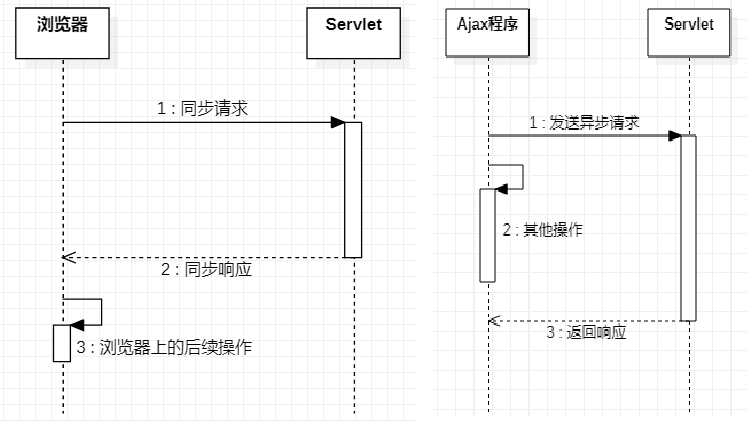

## 第一章 JavaScript

[语法和数据类型 - JavaScript | MDN (mozilla.org)](https://developer.mozilla.org/zh-CN/docs/Web/JavaScript/Guide/Grammar_and_Types)

#### 1、JavaScript的起源

​		在<span style="color:red;font-weight:bold;">1995</span>年时，由<span style="color:red;font-weight:bold;">Netscape</span>公司的<span style="color:red;font-weight:bold;">Brendan Eich</span>，在网景导航者浏览器上首次设计实现而成。Netscape在最初将其脚本语言命名为LiveScript，因为Netscape与Sun合作，网景公司管理层希望蹭Java的热度，因此取名为JavaScript。JavaScript总共分成三部分: ECMAScript(基本语法)、BOM(浏览器对象模型)、DOM(文档对象模型)

#### 2、JavaScript的特性

- 脚本语言

​		JavaScript是一种解释型的脚本语言。不同于C、C++、Java等语言先编译后执行,	JavaScript不会产生编译出来的字节码文件，而是在程序的运行过程中对源文件逐行进行解释。

- 基于对象

​		JavaScript是一种基于对象的脚本语言，它不仅可以创建对象，也能使用现有的对象。但是面向对象的三大特性：『封装』、『继承』、『多态』中，JavaScript能够实现封装，可以模拟继承，不支持多态，所以它不是一门面向对象的编程语言。

- <span style="color:red;font-weight:bold;">弱类型</span>

​		JavaScript中也有明确的数据类型，但是声明一个变量后它可以接收任何类型的数据，并且会在程序执行过程中根据上下文自动转换类型。

- 事件驱动

​		JavaScript是一种采用事件驱动的脚本语言，它不需要经过Web服务器就可以对用户的输入做出响应。

- <span style="color:red;font-weight:bold;">跨平台性</span>

​		JavaScript脚本语言不依赖于操作系统，仅需要浏览器的支持。因此一个JavaScript脚本在编写后可以带到任意机器上使用，前提是机器上的浏览器支持JavaScript脚本语言。目前JavaScript已被大多数的浏览器所支持。

#### 3、入门程序

**功能效果图**


**代码实现**

```html
<!DOCTYPE html>
<html lang="en">
<head>
    <meta charset="UTF-8">
    <title>JS的入门程序</title>
</head>
<body>
    <!-- 在HTML代码中定义一个按钮 -->
    <button type="button" id="helloBtn">SayHello</button>
    <!--
        目标: 点击按钮的时候弹出一个警告框
    -->
    <script type="text/javascript">
        //1. 通过js代码获取到按钮对象
        //document代表当前HTML文档
        var btn = document.getElementById("helloBtn");

        //2. 给获取到的btn对象绑定点击事件
        btn.onclick = function () {
            //弹出警告框
            alert("hello world")
        }
    </script>
</body>
</html>
```

#### 4、JavaScript的基本语法

##### 4.1 JavaScript的引入方式

###### 4.1.1 内部脚本方式

- JavaScript代码要写在script标签内
- script标签可以写在文档内的任意位置
- 为了能够方便查询或操作HTML标签（元素）script标签可以写在body标签后面

在我们的入门程序中使用的就是内部脚本方式引入的JavaScript

###### 4.1.2 外部脚本方式

在script标签内通过src属性指定外部xxx.js文件的路径即可。但是要注意以下两点：

- 引用外部JavaScript文件的script标签里面不能写JavaScript代码
- script标签不能写成单标签

引入方式如下：

```html
<!DOCTYPE html>
<html lang="en">
<head>
    <meta charset="UTF-8">
    <title>JS的引入方式</title>
    <!--
        建议在head中引入外部的js文件
    -->
    <script src="../js/outer.js"></script>
</head>
<body>

    <!--
        第一种引入方式: 内部引入方式，在HTML文档内部，通过script标签去编写js代码
    -->
    <!--
        第二种引入方式: 外部引入方式，在当前项目中创建一个js文件，然后在需要引入的HTML里面使用script标签引入
        一个script标签要么负责编写内部的js代码，要么负责引入外部的js文件
    -->
    <script type="text/javascript">
        //调用外部js文件中的方法
        showMessage()
        alert("hello world")
    </script>
</body>
</html>
```

##### 4.2 声明和使用变量

###### 4.2.1 JavaScript数据类型

- 基本数据类型

  - 数值型number：不区分整数、小数

  - 字符串string：<span style="color:red;font-weight:bold;">不区分字符、字符串</span>；<span style="color:red;font-weight:bold;">单引号、双引号意思一样。</span>

  - 布尔型boolean：true、false

    > 其他类型和布尔类型的自动转换：
    >
    > - true：非零的数值，非空字符串，非空对象
    > - false：零，空字符串，null，undefined 
    >
    > 例如："false"放在if判断中
    >
    > ```js
    > // "false"是一个非空字符串，直接放在if判断中会被当作『真』处理
    > if("false"){
    > 	alert("true");
    > }else{
    > 	alert("false");
    > }
    > ```

- 引用类型

  - 所有new出来的对象
  - 用[]声明的数组
  - 用{}声明的对象

###### 4.2.2 变量

- 关键字：var，其实ECMAScript6之后建议使用let

- 数据类型：JavaScript变量是弱类型的，可以接收任意类型的数据

- 标识符：严格区分大小写

- 变量使用规则

  - 如果使用了一个没有声明的变量，那么会在运行时报错：Uncaught ReferenceError: b is not defined

  - 如果声明一个变量没有初始化，那么这个变量的值就是：<span style="color:red;font-weight:bold;">undefined</span>

##### 4.3 函数(重点)

###### 4.3.1 内置函数

内置函数就是JavaScript中内置好的函数，我们可以直接使用

* 弹出警告框alert

```javascript
alert("警告框内容");
```

* 弹出确认框confirm

```javascript
var result = confirm("确定要删除吗？");
if(result) {
    // 执行删除
}
```

用户点击『确定』返回true，点击『取消』返回false

```javascript
var result = confirm("老板，你真的不加个钟吗？");
if(result) {
	console.log("老板点了确定，表示要加钟");
}else{
	console.log("老板点了确定，表示不加钟");
}
```

* 在控制台打印日志

```javascript
console.log("日志内容");
```


###### 4.3.2 声明函数

​		声明函数就是使用者自己定义一个函数，它有两种写法:

```javascript
//写法1：
function sum(a, b) {
    return a+b;
}
//写法2：
var total = function() {
    return a+b;
};
```

> ​		用法二：声明一个函数，相当于创建了一个『函数对象』，将这个对象的『引用』赋值给变量total。如果不给这个对象赋值，我们可以将其作为匿名函数使用。

###### 4.3.3 调用函数

​		JavaScript中函数本身就是一种对象，函数名就是这个<span style="color:red;font-weight:bold;">『对象』</span>的<span style="color:red;font-weight:bold;">『引用』</span>。而调用函数的格式是：<span style="color:red;font-weight:bold;">函数引用()</span>。

```javascript
function sum(a, b) {
    return a+b;
}

var result = sum(2, 3);
console.log("result="+result);
```

或：

```javascript
var total = function() {
    return a+b;
}

var totalResult = total(3,6);
console.log("totalResult="+totalResult);
```

##### 4.4 对象(重点)

​		JavaScript中没有<span style="color:red;font-weight:bold;">『类』</span>的概念，对于系统内置的对象可以直接==创建使用==。

###### 4.4.1 使用new关键字创建对象

```javascript
// 创建对象
var obj01 = new Object();

// 给对象设置属性和属性值
obj01.stuName = "tom";
obj01.stuAge = 20;
obj01.stuSubject = "java";

// 在控制台输出对象
console.log(obj01);
```

###### 4.4.2 使用{}创建对象(常用)

```javascript
// 创建对象
var obj02 = {
    "soldierName":"john",
    "soldierAge":35,
    "soldierWeapon":"gun"
};

// 在控制台输出对象
console.log(obj02);
```

###### 4.4.3 给对象设置函数属性

```javascript
// 创建对象
var obj01 = new Object();

// 给对象设置属性和属性值
obj01.stuName = "tom";
obj01.stuAge = 20;
obj01.stuSubject = "java";

obj01.study = function() {
	console.log(this.stuName + " is studying");
};

// 在控制台输出对象
console.log(obj01);
// 调用函数
obj01.study();
```

或者

```javascript
// 创建对象
var obj02 = {
	"soldierName":"john",
	"soldierAge":35,
	"soldierWeapon":"gun",
	"soldierShoot":function(){
		console.log(this.soldierName + " is using " + this.soldierWeapon);
	}
};

// 在控制台输出对象
console.log(obj02);
// 调用函数
obj02.soldierShoot();
```

###### 4.4.4 this关键字

this关键字只有两种情况：

- 在函数外面：this关键字指向window对象（代表当前浏览器窗口）
- 在函数里面：this关键字指向调用函数的对象

```javascript
// 直接打印this
console.log(this);

// 函数中的this
// 1.声明函数
function getName() {
	console.log(this.name);
}

// 2.创建对象
var obj01 = {
	"name":"tom",
	"getName":getName
};
var obj02 = {
	"name":"jerry",
	"getName":getName
};

// 3.调用函数
obj01.getName();
obj02.getName();
```

##### 4.5 数组(重点)

###### 4.5.1 使用new关键字创建数组

```javascript
// 1.创建数组对象
var arr01 = new Array();

// 2.压入数据
arr01.push("apple");
arr01.push("orange");
arr01.push("banana");
arr01.push("grape");

// 3.遍历数组
for (var i = 0; i < arr01.length; i++) {
	console.log(arr01[i]);
}

// 4.数组元素反序
arr01.reverse();
for (var i = 0; i < arr01.length; i++) {
	console.log(arr01[i]);
}

// 5.数组元素拼接成字符串
var arrStr = arr01.join(",");
console.log(arrStr);

// 6.字符串拆分成数组
var arr02 = arrStr.split(",");
for (var i = 0; i < arr02.length; i++) {
	console.log(arr02[i]);
}

// 7.弹出数组中最后一个元素
var ele = arr01.pop();
console.log(ele);
```

###### 4.5.2 使用[]创建数组(常用)

```javascript
// 8.使用[]创建数组
var arr03 = ["cat","dog","tiger"];
console.log(arr03);
```

##### 4.6 JSON(最重点)

###### 4.6.1 简介

​		JSON 指的是 JavaScript 对象表示法（**J**ava**S**cript **O**bject **N**otation），轻量级的文本数据交换格式。JSON 比 XML 更小、更快，具有自我描述性，更易理解和解析。JSON 文本格式在语法上与创建 JavaScript 对象的代码相同。由于这种相似性，无需解析器，JavaScript 程序能够使用内建的 `eval()`函数，用 JSON 数据来生成原生的 JavaScript 对象。

###### 4.6.2 与XML的异同

| 相同                                                         | 不同                                                         |
| ------------------------------------------------------------ | ------------------------------------------------------------ |
| （1）JSON 和 XML 文本数据都是 "自我描述" ，都易于理解<br />（2）JSON 和 XML 数据都是有层次的结构<br />（3）JSON 和 XML 数据可以被大多数编程语言使用 | （1）JSON 不需要结束标签，且更加简短<br />（2）读写的速度更快，使用 JavaScript eval() 解析成js对象<br />（3）可以使用数组不使用保留字 |

> **最大的不同是**：XML 需要使用 XML 解析器来解析，JSON 可以使用标准的 JavaScript 函数来解析。

###### 4.6.3 语法

**基本语法**：

- 数据格式 : key 和 value 中使用冒号 **:** 分割
  - 数字（整数或浮点数）
  - 字符串（在双引号中）
  - 逻辑值（true 或 false）
  - 数组（在中括号中）
  - 对象（在大括号中）
  - null
- 数据由逗号 , 分隔
- 使用斜杆 \\ 来转义字符
- 大括号 {} 保存对象
- 中括号 [] 保存数组，数组可以包含多个对象

**两种结构**

​		Json数据有两种存在形式：Json对象(操作数据)、Json字符串(传输数据)；其中，Json对象又分为{键值对对象}和[数组对象]。

- 对象：大括号 {} 保存的对象是一个无序的名称 : 值对集合。一个对象以左括号 { 开始， 右括号 } 结束。名称 : 值对使用逗号 , 分隔。

  ```json
  {key1 : value1, key2 : value2, ... keyN : valueN }
  
  var person = {
      "name":"张三疯",
      "age":189,
      "address":"武当山",
      "wife":{
          "name":"小花",
          "age":18,
          "address":"武当山下的小村庄"
      },
      "sons":[
          {
              "name":"奥巴马",
              "age":1,
              "address":"武当山"
          },
          {
              "name":"奥拉夫",
              "age":2,
              "address":"少林寺"
          }
      ]
  }
  
  alert(typeof(person)) //object  所以json就是一个对象
  ```

- 数组：中括号 [] 保存的数组是值的有序集合。一个数组以左中括号 [ 开始， 右中括号 ] 结束，值之间使用逗号 , 分隔。值可以是双引号括起来的字符串、数值(number)、true、false、 null、对象（object）或者数组（array），它们是可以嵌套。

  ```json
  [
      { key1 : value1-1 , key2:value1-2 }, 
      { key1 : value2-1 , key2:value2-2 }, 
      { key1 : value3-1 , key2:value3-2 }, 
      ...
      { key1 : valueN-1 , key2:valueN-2 }, 
  ]
  ```

###### 4.6.4 JSON对象和JSON字符串互转

- JSON.parse(text[, reviver]): 将一个 JSON 字符串转换为 JavaScript 对象。

  - **reviver:** 可选，一个转换结果的函数， 将为对象的每个成员调用此函数。
  - JSON 不能存储 Date 对象。如果你需要存储 Date 对象，需要将其转换为字符串然后转换为 Date 对象。

  ```json
  jsonObj = JSON.parse(jsonStr);
  console.log(jsonObj); // {stuName: "tom", stuAge: 20}
  ```

- JSON.stringify(value[, replacer[, space]]): 将 JavaScript 值转换为 JSON 字符串。

  - **replacer**：可选。用于转换结果的函数或数组
  - **space**：可选，文本添加缩进、空格和换行符
  - 会将所有日期转换为字符串。JSON.stringify() 会删除 JavaScript 对象的函数，包括 key 和 value

  ```json
  var jsonObj = {"stuName":"tom","stuAge":20};
  var jsonStr = JSON.stringify(jsonObj);
  
  console.log(typeof jsonObj); // object
  console.log(typeof jsonStr); // string
  ```

- eval(text)：可解析 JSON 文本，然后生成 JavaScript 对象

  ```json
  var txt = '{ "sites" : [' +
  '{ "name":"菜鸟教程" , "url":"www.runoob.com" },' +
  '{ "name":"google" , "url":"www.google.com" },' +
  '{ "name":"微博" , "url":"www.weibo.com" } ]}';
   
  var obj = eval ("(" + txt + ")");
  ```

###### 4.6.5 JSON 在 java 中的使用

引入依赖：

```xml
<dependency>
    <groupId>com.google.code.gson</groupId>
    <artifactId>gson</artifactId>
    <version>2.10.1</version>
</dependency>
```

- javaBean 和 json 的互传

​		要把复杂的 json 字符串转换成为 java 对象。需要继承 TypeToken 类。并把返回的类型当成 TypeToken 的泛型注入，实际开发<span style="color:red;font-weight:bold;">采用匿名类</span>。

```java
 static class PersonType extends TypeToken> { }
```

```JAVA
// 创建 Gson 对象实例
Gson gson = new Gson();
// toJson 方法可以把 java 对象转换成为 json 字符串
String personJsonString = gson.toJson(person);
System.out.println(personJsonString);
// fromJson 把 json 字符串转换回 Java 对象
// 第一个参数是 json 字符串
// 第二个参数是转换回去的 Java 对象类型
Person person1 = gson.fromJson(personJsonString, Person.class);
```

- List 和 json 的互转

```java
List<Person> personList = new ArrayList<>();
personList.add(new Person(1, "xiaoyu"));
personList.add(new Person(2, "dayu"));
Gson gson = new Gson();
// 把 List 转换为 json 字符串
String personListJsonString = gson.toJson(personList);
//把 json 字符串 转换为 List
List<Person> list = gson.fromJson(personListJsonString, new PersonListType().getType());
Person person = list.get(0);
```

- map 和 json 的互转

```java
Map<Integer,Person> personMap = new HashMap<>();
personMap.put(1, new Person(1, "xiaoyu"));
personMap.put(2, new Person(2, "dayu"));
Gson gson = new Gson();
// 把 map 集合转换成为 json 字符串
String personMapJsonString = gson.toJson(personMap);
System.out.println(personMapJsonString);
// 把 json 数组转换成为 map 对象
// Map<Integer,Person> personMap2 = gson.fromJson(personMapJsonString, newPersonMapType().getType());
// 我们也可以使用匿名内部类
Map<Integer,Person> personMap2 = gson.fromJson(personMapJsonString, 
                                               new TypeToken<HashMap<Integer,Person>>(){}.getType());
Person p = personMap2.get(1);
```


#### 5、JavaScript的DOM(最重点)

##### 5.1 DOM的概念

​		DOM是<span style="color:red;font-weight:bold;">D</span>ocument <span style="color:red;font-weight:bold;">O</span>bject  <span style="color:red;font-weight:bold;">M</span>odel的缩写，意思是<span style="color:red;font-weight:bold;">『文档对象模型』</span>——将HTML文档抽象成模型，再封装成对象方便用程序操作。

##### 5.2 DOM树的概念

​		浏览器把HTML文档从服务器上下载下来之后就开始按照<span style="color:red;font-weight:bold;">『从上到下』</span>的顺序<span style="color:red;font-weight:bold;">『读取HTML标签』</span>。每一个标签都会被封装成一个<span style="color:red;font-weight:bold;">『对象』</span>。而第一个读取到的肯定是根标签html，然后是它的子标签head，再然后是head标签里的子标签……所以从html标签开始，整个文档中的所有标签都会根据它们之间的<span style="color:red;font-weight:bold;">『父子关系』</span>被放到一个<span style="color:red;font-weight:bold;">『树形结构』</span>的对象中。


​		这个包含了所有标签对象的整个树形结构对象就是JavaScript中的一个<span style="color:red;font-weight:bold;">可以直接使用的内置对象</span>：<span style="color:red;font-weight:bold;">document</span>。例如，下面的标签结构，会被解析为：


##### 5.3 节点类型

​		整个文档中的一切都可以看做Node根节点。各个具体组成部分的具体类型可以看做Node类型的子类。

| 组成部分         | 节点类型 | 具体类型 |
| ---------------- | -------- | -------- |
| 整个文档         | 文档节点 | Document |
| HTML标签         | 元素节点 | Element  |
| HTML标签内的文本 | 文本节点 | Text     |
| HTML标签内的属性 | 属性节点 | Attr     |
| 注释             | 注释节点 | Comment  |

##### 5.4 节点查找

​		由于实际开发时基本上都是使用JavaScript的各种框架来操作，而框架中的操作方式和我们现在看到的原生操作完全不同。

###### 5.4.1 文档范围内查询元素节点

| 功能               | API                                     | 返回值           |
| ------------------ | --------------------------------------- | ---------------- |
| 根据id值查询       | document.getElementById(“id值”)         | 一个具体的元素节 |
| 根据标签名查询     | document.getElementsByTagName(“标签名”) | 元素节点数组     |
| 根据name属性值查询 | document.getElementsByName(“name值”)    | 元素节点数组     |
| 根据类名查询       | document.getElementsByClassName("类名") | 元素节点数组     |

###### 5.4.2 在具体元素节点范围内查找子节点

| 功能               | API                                                        | 返回值         |
| ------------------ | ---------------------------------------------------------- | -------------- |
| 查找子标签         | element.children                                           | 返回子标签数组 |
| 查找第一个子标签   | element.firstElementChild<br />【W3C考虑换行，IE≤8不考虑】 | 标签对象       |
| 查找最后一个子标签 | element.lastElementChild<br />【W3C考虑换行，IE≤8不考虑】  | 节点对象       |

###### 5.4.3 查找指定元素节点的父节点

| 功能                     | API                   | 返回值   |
| ------------------------ | --------------------- | -------- |
| 查找指定元素节点的父标签 | element.parentElement | 标签对象 |

###### 5.4.4 查找指定元素节点的兄弟节点

| 功能               | API                                                          | 返回值   |
| ------------------ | ------------------------------------------------------------ | -------- |
| 查找前一个兄弟标签 | node.previousElementSibling<br />【W3C考虑换行，IE≤8不考虑】 | 标签对象 |
| 查找后一个兄弟标签 | node.nextElementSibling<br />【W3C考虑换行，IE≤8不考虑】     | 标签对象 |

###### 5.4.5 根据选择器查找标签

| 功能                   | API                                 | 返回值   |
| ---------------------- | ----------------------------------- | -------- |
| 根据选择器查找一个标签 | document.querySelector("选择器")    | 标签对象 |
| 根据选择器查找多个标签 | document.querySelectorAll("选择器") | 标签数组 |

```html
<!DOCTYPE html>
<html lang="en">
    <head>
        <meta charset="UTF-8">
        <title>DOM查找节点</title>
    </head>
    <body>
        <input type="text" id="username">
        <input type="text" class="c1">
        <input type="text" class="c1">
        <div>
            <div></div>
            <div></div>
        </div>
        <script>
            //根据id查询标签
            var elementById = document.getElementById("username");
            //console.log(elementById)
            //根据类名查询标签
            var elementsByClassName = document.getElementsByClassName("c1");
            //console.log(elementsByClassName)
            //根据标签名查询标签
            var elementsByTagName = document.getElementsByTagName("input");
            //console.log(elementsByTagName)

            //查找子节点: 查找body的所有子标签,要注意文本也属于子节点
            /*var childNodes = document.getElementsByTagName("body")[0].childNodes;
        console.log(childNodes)*/

            //查找子标签: children
            var children = document.getElementsByTagName("body")[0].children;
            //console.log(children)

            //查找id为username的标签的父节点
            var parentNode = document.getElementById("username").parentNode;
            //console.log(parentNode)

            //查找id为username的标签的前一个兄弟标签
            var previousElementSibling = document.getElementById("username").previousElementSibling;
            //console.log(previousElementSibling)

            //查找id为username的标签的后一个兄弟标签
            var nextElementSibling = document.getElementById("username").nextElementSibling;
            //console.log(nextElementSibling)


            //根据选择器查找标签:document.querySelector("选择器")根据选择器查找一个标签, document.querySelectorAll("选择器")根据选择器查找多个标签
            //什么是选择器: 用于查找标签的一些表达式，其中最基本的三种选择器是:ID选择器、类选择器、标签选择器
            //选择器参考jQuery的文档
            //查找id为username的标签，使用的是id选择器
            var ipt1 = document.querySelector("#username");

            //console.log(ipt1)
            //查找body内的所有后代div，用的是层级选择器
            var ipts = document.querySelectorAll("body div");

            //查找id为username的标签的后面第一个兄弟
            var i1 = document.querySelector("#username+input");

            //查找id为username的标签的后面的所有兄弟
            var i2 = document.querySelectorAll("#username~input");

            console.log(i2)
        </script>
    </body>
</html>
```

##### 5.5 增删改查

###### 5.5.1 属性操作

| 需求       | 操作方式                   |
| ---------- | -------------------------- |
| 读取属性值 | 元素对象.属性名            |
| 修改属性值 | 元素对象.属性名=新的属性值 |

###### 5.5.2 标签体的操作

| 需求                         | 操作方式          |
| ---------------------------- | ----------------- |
| 获取或者设置标签体的文本内容 | element.innerText |
| 获取或者设置标签体的内容     | element.innerHTML |

```html
<!DOCTYPE html>
<html lang="en">
    <head>
        <meta charset="UTF-8">
        <title>操作标签的属性和文本</title>
    </head>
    <body>
        <input type="text" id="username" name="username" />
        <div id="d1">
            <h1>你好世界</h1>
        </div>
        <script>
            //目标: 获取id为username的输入框的value
            //1. 找到要操作的标签
            var ipt = document.getElementById("username");

            //2. 设置标签的value属性值
            ipt.value = "张三"

            //3. 获取标签的value属性的值
            var value = ipt.value;
            console.log(value)

            //获取id为d1的div中的文本内容
            //获取标签的文本: element.innerText,获取文本的时候会将左右两端的空格去掉
            var innerText = document.getElementById("d1").innerText;
            console.log(innerText)

            //获取标签体的内容: element.innerHTML,获取标签体的内容
            var innerHTML = document.getElementById("d1").innerHTML;
            console.log(innerHTML)

            //设置标签体的内容:建议使用innerHTML，如果是使用innerText的话它会将标签当做普通文本处理
            document.getElementById("d1").innerHTML = "<h1>hello world</h1>"
        </script>
    </body>
</html>
```

###### 5.5.3 DOM增删改操作

| API                                      | 功能                                       |
| ---------------------------------------- | ------------------------------------------ |
| document.createElement(“标签名”)         | 创建元素节点并返回，但不会自动添加到文档中 |
| document.createTextNode(“文本值”)        | 创建文本节点并返回，但不会自动添加到文档中 |
| element.appendChild(ele)                 | 将ele添加到element所有子节点后面           |
| parentEle.insertBefore(newEle,targetEle) | 将newEle插入到targetEle前面                |
| parentEle.replaceChild(newEle, oldEle)   | 用新节点替换原有的旧子节点                 |
| element.remove()                         | 删除某个标签                               |
| element.innerHTML                        | 读写HTML代码                               |

```html
<!DOCTYPE html>
<html lang="en">
    <head>
        <meta charset="UTF-8">
        <title>创建和删除标签</title>
    </head>
    <body>
        <ul id="city">
            <li id="bj">北京</li>
            <li id="sh">上海</li>
            <li id="sz">深圳</li>
            <li id="gz">广州</li>
        </ul>
        <script>
            //目标1: 在城市列表的最后添加一个子标签 <li id="cs">长沙</li>
            //1. 创建一个li标签  <li></li>
            var liElement = document.createElement("li");
            //2. 给创建的li标签设置id属性和文本 <li id="cs">长沙</li>
            liElement.id = "cs"
            liElement.innerText = "长沙"
            //3. 将创建的li标签添加到城市列表中（ul）
            var cityUl = document.getElementById("city");

            //父.appendChild(子)将子标签添加到父标签的最后面
            //cityUl.appendChild(liElement)

            //目标2:在城市列表的深圳之前添加一个子标签 <li id="cs">长沙</li>
            //获取到深圳这个标签
            var szElement = document.getElementById("sz");
            //父.insertBefore(新标签,参照标签)
            //cityUl.insertBefore(liElement,szElement)

            //目标3: 在城市列表中添加一个子标签替换深圳 <li id="cs">长沙</li>
            //父.replaceChild(新标签,被替换的标签)
            //cityUl.replaceChild(liElement,szElement)

            //目标4: 在城市列表中删除深圳
            //szElement.remove()

            //目标5: 清除城市列表中的所有城市,保留城市列表标签ul
            cityUl.innerHTML = ""
        </script>
    </body>
</html>
```

#### 6、JavaScript的事件驱动(很重要)

##### 6.1 事件的概念

* HTML 事件是发生在 HTML 元素上的“事情”， 是浏览器或用户做的某些事情
* 事件通常与函数配合使用，这样就可以通过发生的事件来驱动函数执行。

##### 6.2 常见事件

| 属性        | 此事件发生在何时...                  |
| ----------- | ------------------------------------ |
| onclick     | 当用户点击某个对象时调用的事件句柄。 |
| ondblclick  | 当用户双击某个对象时调用的事件句柄。 |
| onchange    | 域的内容被改变。                     |
| onblur      | 元素失去焦点。                       |
| onfocus     | 元素获得焦点。                       |
| onload      | 一张页面或一幅图像完成加载。         |
| onsubmit    | 确认按钮被点击；表单被提交。         |
| onkeydown   | 某个键盘按键被按下。                 |
| onkeypress  | 某个键盘按键被按住。                 |
| onkeyup     | 某个键盘按键被松开。                 |
| onmousedown | 鼠标按钮被按下。                     |
| onmouseup   | 鼠标按键被松开。                     |
| onmouseout  | 鼠标从某元素移开。                   |
| omouseover  | 鼠标移到某元素之上。                 |
| onmousemove | 鼠标被移动。                         |

##### 6.3 事件绑定的方式

###### 6.3.1 普通函数方式

说白了设置标签的属性

```html
<标签 属性="js代码，调用函数"></标签>
```

###### 6.3.2 匿名函数方式

```html
<script>
    标签对象.事件属性 = function(){
        //执行一段代码
    }
</script>
```

##### 6.4 事件的使用介绍

+ 点击事件

  需求: 没点击一次按钮 弹出hello...

```js
<input type="button" value="按钮" onclick="fn1()">

    <input type="button" value="另一个按钮" id="btn">
        <script>
        //当点击的时候要调用的函数
        function fn1() {
        alert("我被点击了...")
    }

//给另外一个按钮，绑定点击事件:
//1.先根据id获取标签
let btn = document.getElementById("btn");
//2. 设置btn的onclick属性(绑定事件)
//绑定命名函数
//btn.onclick = fn1

//绑定匿名函数
btn.onclick = function () {
    console.log("点击了另外一个按钮")
}
</script>
```

+ 获得焦点(onfocus)和失去焦点(onblur)

  需求:给输入框设置获得和失去焦点

```js
var ipt = document.getElementById("ipt");

//绑定获取焦点事件
ipt.onfocus = function () {
    console.log("获取焦点了...")
}

//绑定失去焦点事件
ipt.onblur = function () {
    console.log("失去焦点了...")
}
```

+ 内容改变(onchange)

  需求: 给select设置内容改变事件

```javascript
<body>
    <!--内容改变(onchange)-->
    <select onchange="changeCity(this)">
        <option value="bj">北京</option>
        <option value="sh">上海</option>
        <option value="sz">深圳</option>
    </select>

</body>
<script>
    function changeCity(obj) {
        console.log("城市改变了"+obj.value);
    }
</script>
```

+ 键盘相关的, 键盘按下(onkeydown)  键盘抬起(onkeyup)

```java
//给输入框绑定键盘按键按下和抬起事件
ipt.onkeydown = function () {
    //当按键按下的时候，数据并没有到达输入框
    //输出输入框里面的内容
    //console.log(ipt.value)
}

ipt.onkeyup = function () {
    //输出输入框的内容:当键盘按键抬起的时候，数据已经到达了输入框
    console.log(ipt.value)
}
```

+ 鼠标相关的, 鼠标在xx之上(onmouseover ), 鼠标按下(onmousedown),鼠标离开(onmouseout)

````java
//给输入框绑定鼠标移入事件
ipt.onmouseover = function () {
    console.log("鼠标移入了...")
}
//给输入框绑定鼠标移出事件
ipt.onmouseout = function () {
    console.log("鼠标移出了...")
}
````


##### 6.5 综合案例

**需求**


**代码实现**

```html
<!DOCTYPE html>
<html lang="en">
    <head>
        <meta charset="UTF-8">
        <title>综合案例</title>
        <style>
            table,tr,td,th{
                border: 1px solid black;
                width: 500px;
                text-align: center;
                margin: auto;
            }

            div{
                text-align: center;
            }
        </style>
    </head>
    <body>
        <table cellspacing="0" id="tb">
            <tr>
                <th>序号</th>
                <th>用户名</th>
                <th>性别</th>
                <th>操作</th>
            </tr>
            <tr>
                <td>1</td>
                <td>张三</td>
                <td>男</td>
                <td>
                    <button onclick="deletePerson(this)">删除</button>
                </td>
            </tr>
            <tr>
                <td>2</td>
                <td>李四</td>
                <td>女</td>
                <td>
                    <button onclick="deletePerson(this)">删除</button>
                </td>
            </tr>
            <tr>
                <td>3</td>
                <td>王五</td>
                <td>男</td>
                <td>
                    <button onclick="deletePerson(this)">删除</button>
                </td>
            </tr>
        </table>
        <div>
            <form action="#">
                序号<input type="text" name="num" id="num"><br/>
                用户<input type="text" name="username" id="username"/><br/>
                性别<input type="text" name="gender" id="gender"/><br/>
                <input type="button" value="添加用户" onclick="addPerson()"/>
            </form>
        </div>
        <script>
            //目标1:点击删除按钮，删除当前行
            //给所有按钮绑定点击事件
            function deletePerson(obj) {
                //此时obj就是你点击的那个按钮
                //我们要删除的就是obj的爷爷
                obj.parentElement.parentElement.remove()
            }

            function addPerson() {
                //添加用户
                //1. 获取序号、用户名、性别
                var numElement = document.getElementById("num");
                var num = numElement.value;

                var usernameElement = document.getElementById("username");
                var username = usernameElement.value;

                var genderElement = document.getElementById("gender");
                var gender = genderElement.value;

                //2. 将获取到的序号、用户名、性别添加到td中，td放到tr中，tr添加到table中
                //2.1 创建一行  <tr></tr>
                var trElement = document.createElement("tr");
                //2.2 往tr中添加标签体内容
                trElement.innerHTML = "<td>"+num+"</td>\n" +
                    "            <td>"+username+"</td>\n" +
                    "            <td>"+gender+"</td>\n" +
                    "            <td>\n" +
                    "                <button onclick=\"deletePerson(this)\">删除</button>\n" +
                    "            </td>"
                //2.3 将tr添加到表格中
                var tb = document.getElementById("tb");
                tb.appendChild(trElement)

                //3. 清空序号、用户名、性别
                numElement.value = ""
                usernameElement.value = ""
                genderElement.value = ""
            }
        </script>
    </body>
</html>
```

#### 7、ajax请求

##### 7.1 概念

​		Asynchronous Javascript And XML（异步 JavaScript 和 XML），是指一种创建交互式网页应用的网页开发技术。 ajax 是一种浏览器通过 js <span style="color:red;font-weight:bold;">异步发起请求</span>（在等待服务器响应时执行其他脚本，当响应就绪时处理响应），<span style="color:red;font-weight:bold;">局部更新页面</span>的技术。这意味着可以在不重新加载整个网页的情况下，对网页的某部分进行更新，且浏览器地址栏不变化。

​		同/异步：同步多个操作 <span style="color:red;font-weight:bold;">按顺序执行</span>，是 <span style="color:red;font-weight:bold;">串行</span>的，前面的操作没有完成，后面的操作就必须 <span style="color:red;font-weight:bold;">等待</span>。异步多个操作相继开始 <span style="color:red;font-weight:bold;">并发执行</span>，即使开始的先后顺序不同，但是由于它们各自是在自己 <span style="color:red;font-weight:bold;">独立的进程或线程中</span>完成，所以互不干扰 <span style="color:red;font-weight:bold;">不用等待</span>。




##### 7.2 原生ajax

​		浏览器内建的 XMLHttpRequest 对象（从 web 服务器请求数据），Ajax 是一个令人误导的名称。Ajax 应用程序可能使用 XML 来传输数据，但将数据作为纯文本或 JSON 文本传输也同样常见。


- XMLHttpRequest 对象方法

| 方法                                | 描述                                                         |
| :---------------------------------- | :----------------------------------------------------------- |
| new XMLHttpRequest()                | 创建新的 XMLHttpRequest 对象                                 |
| abort()                             | 取消当前请求                                                 |
| getAllResponseHeaders()             | 返回头部信息                                                 |
| getResponseHeader()                 | 返回特定的头部信息                                           |
| open(method, url, async, user, psw) | 规定请求method：请求类型 GET 或 POST<br />url：请求位置<br />async：true（异步）或 false<br />             为false，则不要`onreadystatechange`函数 ，方法放 send()后面即可<br />user：可选，用户名称<br />psw：可选，密码 |
| send()                              | 将请求发送到服务器，用于 GET 请求                            |
| send(string)                        | 将请求发送到服务器，用于 POST 请求                           |
| setRequestHeader()                  | 向要发送的报头添加标签/值对                                  |

- XMLHttpRequest 对象属性

| 属性               | 描述                                                         |
| :----------------- | :----------------------------------------------------------- |
| onreadystatechange | 定义当 readyState 属性发生变化时被调用的函数                 |
| readyState         | 保存 XMLHttpRequest 的状态。<br />0：请求未初始化，还没有调用send()方法<br />1：服务器连接已建立，已调用send()方法，正在发送请求<br />2：请求已收到，send()方法执行完成，已经接收到全部响应内容<br />3：正在解析响应内容<br />4：响应内容解析完成，可在客户端调用 |
| responseText       | 以字符串返回响应数据                                         |
| responseXML        | 以 XML 数据返回响应数据                                      |
| status             | 常用返回请求的状态号<br />200: "OK"<br />403: "Forbidden"<br />404: "Not Found" |
| statusText         | 返回状态文本（比如 "OK" 或 "Not Found"）                     |

###### 7.2.1 创建XMLHttpRequest

```javascript
//为了应对所有浏览器，包括 IE5 和 IE6，请检查浏览器是否支持 XMLHttpRequest 对象。
//如果支持，创建 XMLHttpRequest 对象，如果不支持，则创建 ActiveX 对象：
var xmlhttp;
if (window.XMLHttpRequest) {// code for IE7+, Firefox, Chrome, Opera, Safari
    xmlhttp=new XMLHttpRequest();
}
else {// code for IE6, IE5
    xmlhttp=new ActiveXObject("Microsoft.XMLHTTP");
}

```

###### 7.2.2 GET/POST

```javascript
1.get
//注释：GET 方法可能返回缓存数据
//为了避免这种情况，请向 URL 添加一个唯一的 ID：
xmlhttp.open("GET","demo_get.asp?t=" + Math.random(),true);
xmlhttp.send();

2.post
//如果需要像 HTML 表单那样 POST 数据，
//要使用 setRequestHeader() 来添加 HTTP 头。
//然后在 send() 方法中规定您希望发送的数据：

xmlhttp.open("POST","ajax_test.asp",true);
xmlhttp.setRequestHeader("Content-type","application/x-www-form-urlencoded");
xmlhttp.send("fname=Bill&lname=Gates");
```

###### 7.2.3 演示

```javascript
function loadDoc() {
    var xhttp = new XMLHttpRequest();
    xhttp.onreadystatechange = function() {
        if (this.readyState == 4 && this.status == 200) {
            document.getElementById("demo").innerHTML =
            this.responseText;
       }
    };
    xhttp.open("GET", "ajax_info.txt", true);
    xhttp.send(); 
} 
```

##### 7.3 jQuery的ajax

###### 7.3.1 $.ajax

​		通过 HTTP 请求加载远程数据。

```javascript
/*参数:
url 表示请求的地址
type 表示请求的类型 GET 或 POST 请求
data 表示发送给服务器的数据,格式有两种：
        name=value&name=value
        {key:value} 自动转为上面k=v&k=v...
success 请求成功，响应的回调函数
dataType 响应的数据类型,常用的数据类型有：
        text 表示纯文本
        xml 表示 xml 数据
        json 表示 json 对象
*/
$("#ajaxBtn").click(function(){
    $.ajax({
            url:"http://localhost:8080/16_json_ajax_i18n/ajaxServlet",
            // data:"action=jQueryAjax",
            data:{action:"jQueryAjax"},
            type:"GET",
            success:function (data) {
                // alert("服务器返回的数据是：" + data);
                // var jsonObj = JSON.parse(data);
                $("#msg").html("编号：" + data.id + " , 姓名：" + data.name);
            },
            dataType : "json"
        });
});
```

###### 7.3.2 $.get和\$.post

​		$.get() 、post()方法通过 HTTP GET/POST 请求从服务器上请求数据。

```javascript
/*
$.get 方法和$.post 方法
    url 请求的 url 地址
    data 发送的数据
    callback 成功的回调函数
    type 返回的数据类型
*/
// ajax--get 请求
$.get("http://localhost:8080/16_json_ajax_i18n/ajaxServlet",
      "action=jQueryGet",
      function (data) {
    		$("#msg").html(" get 编号：" + data.id + " , 姓名：" + data.name);},
      "json");
// ajax--post 请求
$.post("http://localhost:8080/16_json_ajax_i18n/ajaxServlet",
       "action=jQueryPost",
       function (data){
    		$("#msg").html(" post 编号：" + data.id + " , 姓名：" + data.name);},
       "json");
```

###### 7.3.3 $.getJSON

​		通过 HTTP GET 请求载入 JSON 数据。

```javascript
/*
	url 请求的 url 地址 
	data 发送给服务器的数据 
	callback 成功的回调函数
*/
$.getJSON("http://localhost:8080/16_json_ajax_i18n/ajaxServlet",
          "action=jQueryGetJSON",
          function(data) {
    		$("#msg").html(" getJSON 编号：" + data.id + " , 姓名：" + data.name);
		 });
```

###### 7.3.4 serialize()

```javascript
// serialize()可以把表单中所有表单项的内容都获取到，并以 name=value&name=value 的形式进行拼接
$.getJSON("http://localhost:8080/16_json_ajax_i18n/ajaxServlet",
          "action=jQuerySerialize&" + $("#form01").serialize(),
          function (data) {
			$("#msg").html(" Serialize 编号：" + data.id + " , 姓名：" + data.name);
		 });
```

###### 7.3.5 验证用户名是否存在

```javascript
$("#username").blur(function () {
    //1 获取用户名
    var username = this.value;
    $.getJSON("http://localhost:8080/book/userServlet",
              "action=ajaxExistsUsername&username=" + username,
  			 function(data) {
        		if (data.existsUsername) {
            			$("span.errorMsg").text("用户名已存在！");
        		} else {
            			$("span.errorMsg").text("用户名可用！");
        		}
    });
});
```

##### 7.4 axios的ajax

​		官方提供的script标签引入方式为：

```html
<!--在前端页面引入开发环境-->
<script type="text/javascript" src="/demo/static/vue.js"></script>
<script type="text/javascript" src="/demo/static/axios.min.js"></script>
```

###### 7.4.1 常用方法和基本用法

```javascript
axios#request(config)
axios#get(url[, config])
axios#delete(url[, config])
axios#head(url[, config])
axios#options(url[, config])
axios#post(url[, data[, config]])
axios#put(url[, data[, config]])
axios#patch(url[, data[, config]])
axios#getUri([config])
```

与vue整合使用：

```javascript
new Vue({
    "el":"#app",
    "data":{},
    "methods":{
        "commonParam":function () {
            axios({
                "method":"post",
                "url":"/demo/AjaxServlet?method=commonParam",
                "params":{
                    "userName":"tom",
                    "userPwd":"123456"
                }
            }).then(function (response) {
                console.log(response);
            }).catch(function (error) {
                console.log(error);
            });
        }
    }
});

//java响应json
//设置响应体的内容类型
response.setContentType("application/json;charset=UTF-8");
response.getWriter().write(json);
```

###### 7.4.2 请求配置

​		这些是创建请求时可以用的配置选项。只有 `url` 是必需的。如果没有指定 `method`，请求将默认使用 `GET` 方法。

```javascript
{
  // `url` 是用于请求的服务器 URL
  url: '/user',

  // `method` 是创建请求时使用的方法
  method: 'get', // 默认值

  // `baseURL` 将自动加在 `url` 前面，除非 `url` 是一个绝对 URL。
  // 它可以通过设置一个 `baseURL` 便于为 axios 实例的方法传递相对 URL
  baseURL: 'https://some-domain.com/api/',

  // `transformRequest` 允许在向服务器发送前，修改请求数据
  // 它只能用于 'PUT', 'POST' 和 'PATCH' 这几个请求方法
  // 数组中最后一个函数必须返回一个字符串， 一个Buffer实例，ArrayBuffer，FormData，或 Stream
  // 你可以修改请求头。
  transformRequest: [function (data, headers) {
    // 对发送的 data 进行任意转换处理

    return data;
  }],

  // `transformResponse` 在传递给 then/catch 前，允许修改响应数据
  transformResponse: [function (data) {
    // 对接收的 data 进行任意转换处理

    return data;
  }],

  // 自定义请求头
  headers: {'X-Requested-With': 'XMLHttpRequest'},

  // `params` 是与请求一起发送的 URL 参数
  // 必须是一个简单对象或 URLSearchParams 对象
  params: {
    ID: 12345
  },

  // `paramsSerializer`是可选方法，主要用于序列化`params`
  // (e.g. https://www.npmjs.com/package/qs, http://api.jquery.com/jquery.param/)
  paramsSerializer: function (params) {
    return Qs.stringify(params, {arrayFormat: 'brackets'})
  },

  // `data` 是作为请求体被发送的数据
  // 仅适用 'PUT', 'POST', 'DELETE 和 'PATCH' 请求方法
  // 在没有设置 `transformRequest` 时，则必须是以下类型之一:
  // - string, plain object, ArrayBuffer, ArrayBufferView, URLSearchParams
  // - 浏览器专属: FormData, File, Blob
  // - Node 专属: Stream, Buffer
  data: {
    firstName: 'Fred'
  },
  
  // 发送请求体数据的可选语法
  // 请求方式 post
  // 只有 value 会被发送，key 则不会
  data: 'Country=Brasil&City=Belo Horizonte',

  // `timeout` 指定请求超时的毫秒数。
  // 如果请求时间超过 `timeout` 的值，则请求会被中断
  timeout: 1000, // 默认值是 `0` (永不超时)

  // `withCredentials` 表示跨域请求时是否需要使用凭证
  withCredentials: false, // default

  // `adapter` 允许自定义处理请求，这使测试更加容易。
  // 返回一个 promise 并提供一个有效的响应 （参见 lib/adapters/README.md）。
  adapter: function (config) {
    /* ... */
  },

  // `auth` HTTP Basic Auth
  auth: {
    username: 'janedoe',
    password: 's00pers3cret'
  },

  // `responseType` 表示浏览器将要响应的数据类型
  // 选项包括: 'arraybuffer', 'document', 'json', 'text', 'stream'
  // 浏览器专属：'blob'
  responseType: 'json', // 默认值

  // `responseEncoding` 表示用于解码响应的编码 (Node.js 专属)
  // 注意：忽略 `responseType` 的值为 'stream'，或者是客户端请求
  // Note: Ignored for `responseType` of 'stream' or client-side requests
  responseEncoding: 'utf8', // 默认值

  // `xsrfCookieName` 是 xsrf token 的值，被用作 cookie 的名称
  xsrfCookieName: 'XSRF-TOKEN', // 默认值

  // `xsrfHeaderName` 是带有 xsrf token 值的http 请求头名称
  xsrfHeaderName: 'X-XSRF-TOKEN', // 默认值

  // `onUploadProgress` 允许为上传处理进度事件
  // 浏览器专属
  onUploadProgress: function (progressEvent) {
    // 处理原生进度事件
  },

  // `onDownloadProgress` 允许为下载处理进度事件
  // 浏览器专属
  onDownloadProgress: function (progressEvent) {
    // 处理原生进度事件
  },

  // `maxContentLength` 定义了node.js中允许的HTTP响应内容的最大字节数
  maxContentLength: 2000,

  // `maxBodyLength`（仅Node）定义允许的http请求内容的最大字节数
  maxBodyLength: 2000,

  // `validateStatus` 定义了对于给定的 HTTP状态码是 resolve 还是 reject promise。
  // 如果 `validateStatus` 返回 `true` (或者设置为 `null` 或 `undefined`)，
  // 则promise 将会 resolved，否则是 rejected。
  validateStatus: function (status) {
    return status >= 200 && status < 300; // 默认值
  },

  // `maxRedirects` 定义了在node.js中要遵循的最大重定向数。
  // 如果设置为0，则不会进行重定向
  maxRedirects: 5, // 默认值

  // `socketPath` 定义了在node.js中使用的UNIX套接字。
  // e.g. '/var/run/docker.sock' 发送请求到 docker 守护进程。
  // 只能指定 `socketPath` 或 `proxy` 。
  // 若都指定，这使用 `socketPath` 。
  socketPath: null, // default

  // `httpAgent` and `httpsAgent` define a custom agent to be used when performing http
  // and https requests, respectively, in node.js. This allows options to be added like
  // `keepAlive` that are not enabled by default.
  httpAgent: new http.Agent({ keepAlive: true }),
  httpsAgent: new https.Agent({ keepAlive: true }),

  // `proxy` 定义了代理服务器的主机名，端口和协议。
  // 您可以使用常规的`http_proxy` 和 `https_proxy` 环境变量。
  // 使用 `false` 可以禁用代理功能，同时环境变量也会被忽略。
  // `auth`表示应使用HTTP Basic auth连接到代理，并且提供凭据。
  // 这将设置一个 `Proxy-Authorization` 请求头，它会覆盖 `headers` 中已存在的自定义 `Proxy-Authorization` 请求头。
  // 如果代理服务器使用 HTTPS，则必须设置 protocol 为`https`
  proxy: {
    protocol: 'https',
    host: '127.0.0.1',
    port: 9000,
    auth: {
      username: 'mikeymike',
      password: 'rapunz3l'
    }
  },

  // see https://axios-http.com/zh/docs/cancellation
  cancelToken: new CancelToken(function (cancel) {
  }),

  // `decompress` indicates whether or not the response body should be decompressed 
  // automatically. If set to `true` will also remove the 'content-encoding' header 
  // from the responses objects of all decompressed responses
  // - Node only (XHR cannot turn off decompression)
  decompress: true // 默认值

}
```

###### 7.4.3 配置修改及其优先级

- 全局 axios 默认值

```js
axios.defaults.baseURL = 'https://api.example.com';
axios.defaults.headers.common['Authorization'] = AUTH_TOKEN;
axios.defaults.headers.post['Content-Type'] = 'application/x-www-form-urlencoded';
```

- 自定义实例默认值

```js
// 创建实例时配置默认值
const instance = axios.create({
  baseURL: 'https://api.example.com'
});

// 创建实例后修改默认值
instance.defaults.headers.common['Authorization'] = AUTH_TOKEN;
```

优先级：就近原则，后面的优先级要高于前面的。如下：

```javascript
// 使用库提供的默认配置创建实例
// 此时超时配置的默认值是 `0`
const instance = axios.create();

// 重写库的超时默认值
// 现在，所有使用此实例的请求都将等待2.5秒，然后才会超时
instance.defaults.timeout = 2500;

// 重写此请求的超时时间，因为该请求需要很长时间
instance.get('/longRequest', {
  timeout: 5000
});
```

###### 7.4.4 响应结构

一个请求的响应包含以下信息。

```javascript
{
  // `data` 由服务器提供的响应
  data: {},

  // `status` 来自服务器响应的 HTTP 状态码
  status: 200,

  // `statusText` 来自服务器响应的 HTTP 状态信息
  statusText: 'OK',

  // `headers` 是服务器响应头
  // 所有的 header 名称都是小写，而且可以使用方括号语法访问
  // 例如: `response.headers['content-type']`
  headers: {},

  // `config` 是 `axios` 请求的配置信息
  config: {},

  // `request` 是生成此响应的请求
  // 在node.js中它是最后一个ClientRequest实例 (in redirects)，
  // 在浏览器中则是 XMLHttpRequest 实例
  request: {}
}
```

当使用 `then` 时，您将接收如下响应:

```js
axios.get('/user/12345')
  .then(function (response) {
    console.log(response.data);
    console.log(response.status);
    console.log(response.statusText);
    console.log(response.headers);
    console.log(response.config);
  });
```

###### 7.4.5 错误处理

```javascript
axios.get('/user/12345')
  .catch(function (error) {
    if (error.response) {
      // 请求成功发出且服务器也响应了状态码，但状态代码超出了 2xx 的范围
      console.log(error.response.data);
      console.log(error.response.status);
      console.log(error.response.headers);
    } else if (error.request) {
      // 请求已经成功发起，但没有收到响应
      // `error.request` 在浏览器中是 XMLHttpRequest 的实例，
      // 而在node.js中是 http.ClientRequest 的实例
      console.log(error.request);
    } else {
      // 发送请求时出了点问题
      console.log('Error', error.message);
    }
    console.log(error.config);
  });

//使用 validateStatus 配置选项，可以自定义抛出错误的 HTTP code。
axios.get('/user/12345', {
  validateStatus: function (status) {
    return status < 500; // 处理状态码小于500的情况
  }
})
```

## 第二章 正则表达式

#### 1、概念

​		正则表达式是对字符串操作的一种逻辑公式，就是用事先定义好的一些特定字符、及这些特定字符的组合，组成一个“规则字符串”，这个“规则字符串”用来表达对字符串的一种过滤逻辑。用我们自己的话来说: **正则表达式用来校验字符串是否满足文本公式**。

#### 2、用途

- 模式验证: 检测某个字符串是否符合规则，例如检测手机号、身份证号等等是否符合规范

  ```javascript
  //校验字符串中是否包含'o'字母。注意：这里是使用正则表达式对象来调用方法。
  
  // 创建一个最简单的正则表达式对象
  var reg = /o/;
  
  // 创建一个字符串对象作为目标字符串
  var str = 'Hello World!';
  
  // 调用正则表达式对象的test()方法验证目标字符串是否满足我们指定的这个模式，返回结果true
  console.log("字符串中是否包含'o'="+reg.test(str));
  ```

- 匹配读取:  将目标字符串中满足规则的部分**读取**出来，例如将整段文本中的邮箱地址读取出来

  ```javascript
  //匹配读取: 读取一个字符串中的所有'l'字母
  // g表示全文查找,如果不使用g那么就只能查找到第一个匹配的内容
  //1. 编写一个正则表达式
  var reg2 = /l/g
  //2. 使用正则表达式去读取字符串
  var arr = str.match(reg2);
  console.log(arr)
  ```

- 匹配替换:  将目标字符串中满足标准的部分**替换**为其他字符串,例如将整段文本中的"hello"替换成"haha"

  ```javascript
  var newStr = str.replace(reg,'@');
  // 只有第一个o被替换了，说明我们这个正则表达式只能匹配第一个满足的字符串
  console.log("str.replace(reg)="+newStr);//Hell@ World!
  // 原字符串并没有变化，只是返回了一个新字符串
  console.log("str="+str);//str=Hello World!
  ```

#### 3、语法

##### 3.1 创建正则表达式对象

* 对象形式：`var reg = new RegExp("正则表达式","匹配模式")`当正则表达式中有"/"那么就使用这种

  ```javascript
   gim可以混合使用，而且不区分先后顺序：
  
   var reg = /abc/gim;
  
   var reg = new RegExp("abc","gim");
  ```

* 直接量形式：`var reg = /正则表达式/`一般使用这种声明方式 

##### 3.2 正则表达式的匹配模式

###### 3.2.1 全文查找

如果不使用g对正则表达式对象进行修饰，则使用正则表达式进行查找时，仅返回第一个匹配；使用g后，返回所有匹配。

```javascript
// 目标字符串
var targetStr = 'Hello World!';

// 没有使用全局匹配的正则表达式
var reg = /[A-Z]/;
// 获取全部匹配
var resultArr = targetStr.match(reg);
// 数组长度为1
console.log("resultArr.length="+resultArr.length);

// 遍历数组，发现只能得到'H'
for(var i = 0; i < resultArr.length; i++){
    console.log("resultArr["+i+"]="+resultArr[i]);
}
```

对比代码：

```javascript
// 目标字符串
var targetStr = 'Hello World!';

// 使用了全局匹配的正则表达式
var reg = /[A-Z]/g;
// 获取全部匹配
var resultArr = targetStr.match(reg);
// 数组长度为2
console.log("resultArr.length="+resultArr.length);

// 遍历数组，发现可以获取到“H”和“W”
for(var i = 0; i < resultArr.length; i++){
    console.log("resultArr["+i+"]="+resultArr[i]);
}
```

###### 3.2.2 忽略大小写

```javascript
//目标字符串
var targetStr = 'Hello WORLD!';

//没有使用忽略大小写的正则表达式
var reg = /o/g;
//获取全部匹配
var resultArr = targetStr.match(reg);
//数组长度为1
console.log("resultArr.length="+resultArr.length);
//遍历数组，仅得到'o'
for(var i = 0; i < resultArr.length; i++){
    console.log("resultArr["+i+"]="+resultArr[i]);
}
```

对比代码：

```javascript
//目标字符串
var targetStr = 'Hello WORLD!';

//使用了忽略大小写的正则表达式
var reg = /o/gi;
//获取全部匹配
var resultArr = targetStr.match(reg);
//数组长度为2
console.log("resultArr.length="+resultArr.length);
//遍历数组，得到'o'和'O'
for(var i = 0; i < resultArr.length; i++){
    console.log("resultArr["+i+"]="+resultArr[i]);
}
```

###### 3.2.3 多行查找

不使用多行查找模式，目标字符串中不管有没有换行符都会被当作一行。

```javascript
//目标字符串1
var targetStr01 = 'Hello\nWorld!';
//目标字符串2
var targetStr02 = 'Hello';

//匹配以'Hello'结尾的正则表达式，没有使用多行匹配
var reg = /Hello$/;
console.log(reg.test(targetStr01));//false

console.log(reg.test(targetStr02));//true
```

对比代码：

```javascript
//目标字符串1
var targetStr01 = 'Hello\nWorld!';
//目标字符串2
var targetStr02 = 'Hello';

//匹配以'Hello'结尾的正则表达式，使用了多行匹配
var reg = /Hello$/m;
console.log(reg.test(targetStr01));//true

console.log(reg.test(targetStr02));//true
```

> 
>
> ```javascript
> 
> ```

##### 3.3 元字符

 在正则表达式中被赋予特殊含义的字符，不能被直接当做普通字符使用。如果要匹配元字符本身，需要对元字符进行转义，转义的方式是在元字符前面加上“\”，例如：\^ 

###### 3.3.1 常用的元字符

| 代码 | 说明                                                         |
| ---- | ------------------------------------------------------------ |
| .    | 匹配除换行字符以外的任意字符。                               |
| \w   | 匹配字母或数字或下划线等价于[a-zA-Z0-9_]                     |
| \W   | 匹配任何非单词字符。等价于\[^A-Za-z0-9_]                     |
| \s   | 匹配任意的空白符，包括空格、制表符、换页符等等。等价于[\f\n\r\t\v]。 |
| \S   | 匹配任何非空白字符。等价于\[^\f\n\r\t\v]。                   |
| \d   | 匹配数字。等价于[0-9]。                                      |
| \D   | 匹配一个非数字字符。等价于\[^0-9]                            |
| \b   | 匹配单词的开始或结束                                         |
| ^    | 匹配字符串的开始，但在[]中使用表示取反                       |
| $    | 匹配字符串的结束                                             |

###### 3.3.2 举例

```javascript
var str = 'one two three four';
// 匹配全部空格
var reg = /\s/g;
// 将空格替换为@
var newStr = str.replace(reg,'@'); // one@two@three@four
console.log("newStr="+newStr);
```

```javascript
var str = '今年是2014年';
// 匹配至少一个数字
var reg = /\d+/g;
str = str.replace(reg,'abcd');
console.log('str='+str); // 今年是abcd年
```

```javascript
var str01 = 'I love Java';
var str02 = 'Java love me';
// 匹配以Java开头
var reg = /^Java/g;
console.log('reg.test(str01)='+reg.test(str01)); // flase
console.log("<br />");
console.log('reg.test(str02)='+reg.test(str02)); // true
```

```javascript
var str01 = 'I love Java';
var str02 = 'Java love me';
// 匹配以Java结尾
var reg = /Java$/g;
console.log('reg.test(str01)='+reg.test(str01)); // true
console.log("<br />");
console.log('reg.test(str02)='+reg.test(str02)); // flase
```

##### 3.4 字符集合

| 语法格式    | 示例                                                         | 说明                                               |
| ----------- | ------------------------------------------------------------ | -------------------------------------------------- |
| [字符列表]  | 正则表达式：[abc] 含义：目标字符串包含abc中的任何一个字符 目标字符串：plain 是否匹配：是 原因：plain中的“a”在列表“abc”中 | 目标字符串中任何一个字符出现在字符列表中就算匹配。 |
| [^字符列表] | [^abc] 含义：目标字符串包含abc以外的任何一个字符 目标字符串：plain 是否匹配：是 原因：plain中包含“p”、“l”、“i”、“n” | 匹配字符列表中未包含的任意字符。                   |
| [字符范围]  | 正则表达式：[a-z] 含义：所有小写英文字符组成的字符列表 正则表达式：[A-Z] 含义：所有大写英文字符组成的字符列表 | 匹配指定范围内的任意字符。                         |

```javascript
var str01 = 'Hello World';
var str02 = 'I am Tom';
//匹配abc中的任何一个
var reg = /[abc]/g;
console.log('reg.test(str01)='+reg.test(str01));//flase
console.log('reg.test(str02)='+reg.test(str02));//true
```

##### 3.5 出现次数

| 代码  | 说明           |
| ----- | -------------- |
| *     | 出现零次或多次 |
| +     | 出现一次或多次 |
| ?     | 出现零次或一次 |
| {n}   | 出现n次        |
| {n,}  | 出现n次或多次  |
| {n,m} | 出现n到m次     |

```javascript
console.log("/[a]{3}/.test('aa')="+/[a]{3}/g.test('aa')); // flase
console.log("/[a]{3}/.test('aaa')="+/[a]{3}/g.test('aaa')); // true
console.log("/[a]{3}/.test('aaaa')="+/[a]{3}/g.test('aaaa')); // true
```

##### 3.6 或者

使用符号：|

```javascript
// 目标字符串
var str01 = 'Hello World!';
var str02 = 'I love Java';
// 匹配'World'或'Java'
var reg = /World|Java/g;
console.log("str01.match(reg)[0]="+str01.match(reg)[0]);//World
console.log("str02.match(reg)[0]="+str02.match(reg)[0]);//Java
```

#### 4、常用正则表达式

| 需求     | 正则表达式                                            |
| -------- | ----------------------------------------------------- |
| 用户名   | /^\[a-zA-Z\_][a-zA-Z_\-0-9]{5,9}$/                    |
| 密码     | /^[a-zA-Z0-9_\-\@\#\&\*]{6,12}$/                      |
| 前后空格 | /^\s+\|\s+$/g                                         |
| 电子邮箱 | /^[a-zA-Z0-9_\.-]+@([a-zA-Z0-9-]+[\.]{1})+[a-zA-Z]+$/ |

# 第三章 Vue

#### 1、概述

​		一款用于构建用户界面的 JavaScript 框架。它基于标准 HTML、CSS 和 JavaScript 构建，并提供了一套声明式的、组件化的编程模型，帮助你高效地开发用户界面。

```vue
import { createApp } from 'vue'

createApp({
  data() {
    return {
      count: 0
    }
  }
}).mount('#app')

<div id="app">
  <button @click="count++">
    Count is: {{ count }}
  </button>
</div>
```

上面的示例展示了 Vue 的两个核心功能：

- **声明式渲染**：基于标准 HTML 拓展的模板语法，可以声明式地描述最终输出的 HTML 和 JavaScript 状态之间的关系。
- **响应性**：会自动跟踪 JavaScript 状态并在其发生变化时响应式地更新 DOM。

#### 2、引入vue

​		借助 script 标签直接通过 CDN 来使用 Vue：

```html
<script src="https://unpkg.com/vue@3/dist/vue.global.js" type="text/javascript" charset="utf-8"></script>
```

    1) {{}} - 相当于innerText
    2) v-bind:attr 绑定属性值。例如，v-bind:value - 绑定value值
       简写：    :value
    3) v-model 双向绑定
       v-model:value   , 简写  v-model
    4) v-if , v-else , v-show
       v-if和v-else之间不能有其他的节点
       v-show是通过样式表display来控制节点是否显示
    5) v-for 迭代
       v-for={fruit in fruitList}
    6) v-on 绑定事件
    7) 其他：
       - trim:去除首尾空格 , split() , join()
       - watch表示侦听属性
       - 生命周期
