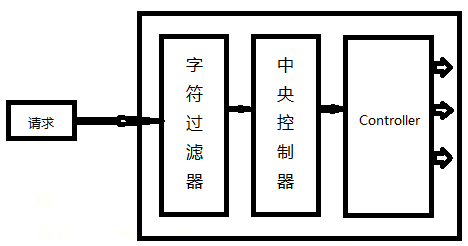

#### 1、BS/CS优劣势

​			**客户端-服务器**，即Client-Server(C/S)结构。C/S结构通常采取两层结构。服务器负责数据的管理，客户端负责完成与用户的交互任务。

- **优点**：C/S结构的优点是能充分发挥客户端PC的处理能力，很多工作可以在客户端处理后再提交给服务器。对应的优点就是客户端响应速度快。
- **缺点**：维护成本高，发生一次升级，则所有客户端的程序都需要改变。

​			**浏览器-服务器**，即B/S架构模式，是随着Internet技术的兴起，对C/S架构的一种变化或者改进的架构。

- **优点**：通过一定的权限控制实现多客户访问的目的，交互性较强，客户端不需要安装，维护成本低
- **缺点**：在速度和安全性上需要花费巨大的设计成本


#### 2、Xml文件

​		XML包含三个部分：XML声明 ， 而且声明这一行代码必须在XML文件的第一行、DTD 文档类型定义、XML正文

**节点**：文档节点、文本节点、元素节点、属性节点、注释节点


> xml文件，具有文本区域 CDATA 区 （快捷键：TAB键自动填充标签）

**xml解析**：		

​		早期 JDK 为我们提供了两种 xml 解析技术 DOM 和 Sax 简介（已经过时，但我们需要知道这两种技术），由于 dom4j 它不是 sun 公司的技术，而属于第三方公司的技术，我们需要使用 dom4j 就需要到 dom4j 官网下载 dom4j 的 jar。

==dom4j 编程步骤==： 

```java
@Test
public void readXML() throws DocumentException {
    // 第一步，通过创建 SAXReader 对象。来读取 xml 文件，获取 Document 对象
    SAXReader reader = new SAXReader();
    Document document = reader.read("src/books.xml");
    // 第二步，通过 Document 对象。拿到 XML 的根元素对象
    Element root = document.getRootElement();
    // 打印测试
    // Element.asXML() 它将当前元素转换成为 String 对象
    // System.out.println( root.asXML() );
    // 第三步，通过根元素对象。获取所有的 book 标签对象
    // Element.elements(标签名)它可以拿到当前元素下的指定的子元素的集合
    List<Element> books = root.elements("book");
    // 第四步，遍历每个 book 标签对象。然后获取到 book 标签对象内的每一个元素，
    for (Element book : books) {
        // 测试
        // System.out.println(book.asXML());
        // 拿到 book 下面的 name 元素对象
        Element nameElement = book.element("name");
        // 拿到 book 下面的 price 元素对象
        Element priceElement = book.element("price");
        // 拿到 book 下面的 author 元素对象
        Element authorElement = book.element("author");
        // 再通过 getText() 方法拿到起始标签和结束标签之间的文本内容
        System.out.println("书名" + nameElement.getText() + " , 价格:"
        + priceElement.getText() + ", 作者：" + authorElement.getText());
    }
}
```

**实现ioc**：

```xml
<?xml version="1.0" encoding="utf-8"?>
<beans>
    <bean id="fruitDAO" class="com.atguigu.fruit.dao.impl.FruitDAOImpl"/>
    <bean id="fruitService" class="com.atguigu.fruit.service.impl.FruitServiceImpl">
        <!-- property标签用来表示属性；name表示属性名；ref表示引用其他bean的id值-->
        <property name="fruitDAO" ref="fruitDAO"/>
    </bean>
    <bean id="fruit" class="com.atguigu.fruit.controllers.FruitController">
        <property name="fruitService" ref="fruitService"/>
    </bean>
</beans>
```

```java
//链式依赖变成了网状依赖，那个网的中心点就是这个容器。降低了其他之间之间的耦合。
public class ClassPathXmlApplicationContext implements BeanFactory {

    private Map<String, Object> beanMap = new HashMap<>();
    private String path = "applicationContext.xml";

    public ClassPathXmlApplicationContext() {
        this("applicationContext.xml");
    }

    public ClassPathXmlApplicationContext(String path) {
        if (StringUtil.isEmpty(path)) {
            throw new RuntimeException("IOC容器的配置文件没有指定...");
        }
        try {
            InputStream inputStream = getClass().getClassLoader().getResourceAsStream(path);
            //1.创建DocumentBuilderFactory
            DocumentBuilderFactory documentBuilderFactory = DocumentBuilderFactory.newInstance();
            //2.创建DocumentBuilder对象
            DocumentBuilder documentBuilder = documentBuilderFactory.newDocumentBuilder();
            //3.创建Document对象
            Document document = documentBuilder.parse(inputStream);

            //4.获取所有的bean节点
            NodeList beanNodeList = document.getElementsByTagName("bean");
            for (int i = 0; i < beanNodeList.getLength(); i++) {
                Node beanNode = beanNodeList.item(i);
                if (beanNode.getNodeType() == Node.ELEMENT_NODE) {
                    Element beanElement = (Element) beanNode;
                    String beanId = beanElement.getAttribute("id");
                    String className = beanElement.getAttribute("class");
                    Class beanClass = Class.forName(className);
                    //创建bean实例
                    Object beanObj = beanClass.newInstance();
                    //将bean实例对象保存到map容器中
                    beanMap.put(beanId, beanObj);
                    //到目前为止，此处需要注意的是，bean和bean之间的依赖关系还没有设置
                }
            }
            //5.组装bean之间的依赖关系
            for (int i = 0; i < beanNodeList.getLength(); i++) {
                Node beanNode = beanNodeList.item(i);
                if (beanNode.getNodeType() == Node.ELEMENT_NODE) {
                    Element beanElement = (Element) beanNode;
                    String beanId = beanElement.getAttribute("id");
                    NodeList beanChildNodeList = beanElement.getChildNodes();
                    for (int j = 0; j < beanChildNodeList.getLength(); j++) {
                        Node beanChildNode = beanChildNodeList.item(j);
                        if (beanChildNode.getNodeType() == Node.ELEMENT_NODE && "property".equals(beanChildNode.getNodeName())) {
                            Element propertyElement = (Element) beanChildNode;
                            String propertyName = propertyElement.getAttribute("name");
                            String propertyRef = propertyElement.getAttribute("ref");
                            //1) 找到propertyRef对应的实例
                            Object refObj = beanMap.get(propertyRef);
                            //2) 将refObj设置到当前bean对应的实例的property属性上去
                            Object beanObj = beanMap.get(beanId);
                            Class beanClazz = beanObj.getClass();
                            Field propertyField = beanClazz.getDeclaredField(propertyName);
                            propertyField.setAccessible(true);
                            propertyField.set(beanObj, refObj);
                        }
                    }
                }
            }
        } catch (Exception e) {
            e.printStackTrace();
        }
    }

    @Override
    public Object getBean(String id) {
        return beanMap.get(id);
    }
}
```


#### 3、Tomcat

**启动方式**：在bin目录，调用`catalina run`启动或者直接双击`startup.bat`，关闭同理

**文件介绍**：直接解压安装即可，需要检查是否配置了JAVA_HOME，其解压后文件目录作用：

- bin 专门用来存放服务器的可执行程序 
- conf 专门用来存放服务器的配置文件 
- lib 专门用来存放服务器的 jar 包 
- logs 专门用来存放服务器运行时输出的日记信息 
- temp 专门用来存放运行时产生的临时数据 
- webapps 专门用来存放部署的 Web 工程。 
- work 是 Tomcat 工作时的目录，用来存放 Tomcat 运行时 jsp 翻译为 Servlet 的源码，和 Session 钝化的目录。

##### 3.1 配置文件

- 修改默认端口号：server.xml

  ```xml
  <Connector port="8080" URIEncoding="UTF-8" protocol="HTTP/1.1"
                 connectionTimeout="20000"
                 redirectPort="8443" />
  默认为8080 可以修改为80或其他，尽量不要两千以内，因为一般都被操作系统占用了
  ```

- 修改欢迎页面：web.xml（tomcat的或自己的web.xml）

  http://ip:port/工程名/  没有资源名，默认访问 index.html 欢迎页面
  
  http://ip:port/  没有工程名的时候，默认访问的是 root 工程
  
  ```xml
  //按顺序依次寻找，直到找到
  <welcome-file-list>
      <welcome-file>index.html</welcome-file>
      <welcome-file>index.htm</welcome-file>
      <welcome-file>index.jsp</welcome-file>
  </welcome-file-list>
  ```

- 修改错误页面（tomcat的或自己的web.xml）

  ```xml
  <!--error-page 标签配置，服务器出错之后，自动跳转的页面-->
  <error-page>
      <!--error-code 是错误类型-->
      <error-code>500</error-code>
      <!--location 标签表示。要跳转去的页面路径-->
      <location>/error.html</location>
  </error-page>
  ```

##### 3.2 部署方式

- 方式一：直接将项目拷贝到webapps中

- 方式二：找到 Tomcat 下的 conf 目录\Catalina\localhost\ 下，创建如下的配置文件tomcat_demo.xml

  ```xml
  <!--
  	Context 表示一个工程上下文  
  	path 表示工程的访问路径:/abc
  	docBase 表示你的工程目录在哪里
  -->
  //访问这个工程的路径如下:http://ip:port/abc/ 就表示访问 E:\book
  <Context path="/demo" docBase="E:\IdeaProjects\JavaWeb2023\tomcat_demo\target\tomcat_demo" />
  ```


#### 4、Web工程新建

- 新建普通工程

  

- 配置Artifacts实现部署包的方式，在main文件夹新建webapp文件和WEB-INF文件夹，并在module中配置Web项目

  > Artifacts：是maven中的一个概念，表示某个module要如何打包，例如war exploded（解压类型）、war（Archive选项）、jar、ear等等这种打包形式；

  

- 在facets中完成web.xml文件的配置


- **目录介绍**

  ```java
  项目名
  ----src
  ----resource
  ----webapp             存放web资源的目录
  -------WEB-INF         服务器保护目录，浏览器无法直接访问
  ----------lib          存放第三方jar包
  ----------web.xml      整个web工程配置部署的描述文件，这里面可以配置很多组件：servlet、filter、listener、sesssion超时....
  -------inedx.html
  ```


#### 5、Servlet

> ​		项目中需要引入javax下的servlet-api包，引入才能方便调用，注意servlet版本3.0前后
>
> ```xml
> <dependency>
>        <groupId>javax.servlet</groupId>
>        <artifactId>javax.servlet-api</artifactId>
>        <version>4.0.1</version>
>        <scope>provided</scope>
> </dependency>
> ```

##### 5.1 介绍


​		Servlet 是 JavaEE 规范（接口）之一。也是 JavaWeb 三大组件Servlet 程序、Filter 过滤器、Listener 监听器之一。 运行在服务器上的一个 java 小程序，它可以接收客户端发送过来的请求，并响应数据给客户端。

##### 5.2 生命周期

> 1）生命周期：tomcat负责对**注册的servlet**的生命周期管理，对应Servlet中的三个方法：init()、service()、destory()
>
> **注意：**这三个方法都是tomcat负责调用，当servlet**未注册**的时候，==包括但不限于上面的方法==都不会被调用。
>
> 2）默认情况下：
>
> - 第一次接收请求时，这个Servlet会进行实例化(调用无参构造器)、初始化(调用init())、然后服务(调用service())
> - 从第二次请求开始，每一次都是服务
> - 当容器关闭时，其中的所有的servlet实例会被销毁，调用destroy()方法
>
> 3）初始化时机：
>
> - 默认情况下，第一次请求时，tomcat才会去实例化初始化，然后再服务。
>
>     - 提高系统的启动速度 。 
>     - 第一次请求时，耗时较长。
>
> - 设置Servlet的初始化时机。
>
>     - 默认是第一次接收请求时，实例化，初始化
>     - 可以通过\<load-on-startup>来设置servlet启动的先后顺序，load-on-startup 元素取值规则如下：
>          1. 它的取值必须是一个整数；
>          2. 当值小于 0 或者没有指定时，则表示容器在该 Servlet 被首次请求时才会被加载；
>          3. 当值大于 0 或等于 0 时，表示容器在启动时就加载并初始化该 Servlet，取值越小，优先级越高；
>          4. 当取值相同时，容器就会自行选择顺序进行加载。
>
>     - @WebServlet 注解的 loadOnStartup 属性与 web.xml 中的 load-on-startup 元素相对应，取值的规则和含义相同。
>
>     ```xml
>     <servlet>
>         <servlet-name>demoServlet</servlet-name>
>         <servlet-class>com.xmj.DemoServlet</servlet-class>
>         <load-on-startup>1</load-on-startup>
>     </servlet>
>     ```
>
> 4）servlet单实例 
>
> - Servlet实例tomcat只会创建一个，所有的请求都是这个实例去响应。所以线程不安全的
> - 当一个线程需要根据这个实例中的某个成员变量值去做逻辑判断。但是在中间某个时机，另一个线程改变了这个成员变量的值，从而导致第一个线程的执行路径发生了变化。所以：①不要去修改成员变量的值 ②不要去根据成员变量的值做一些逻辑判断

##### 5.3 使用演示

> 常见错误 1：**url-pattern 中配置的路径没有以斜杠打头**。
>
> 常见错误 2：servlet-name 配置的值不存在：
>
> 常见错误 3：servlet-class 标签的全类名配置错误
>
> **注意：**servlet3.0开始，支持注解方式注册`@WebServlet("/index")`

- 编写一个类去实现 Servlet 接口 / 继承 HttpServlet 类：一般在实际项目开发中，都是使用继承 `HttpServlet` 类的方式去实现 Servlet 程序。

  下面的IDEA自动生成Servlet方式，会帮助我们自动继承HttpServlet，并配置web.xml映射

   

- 实现 service 方法 / 重写 doGet等方法，处理请求，并响应数据

  ```java
  public class HelloServlet implements Servlet {    
      /**    
      * service 方法是专门用来处理请求和响应的    
      * @param servletRequest    
      * @param servletResponse    
      * @throws ServletException    
      * @throws IOException    
      */
      @Overridepublic void service(ServletRequest servletRequest, ServletResponse servletResponse) throws
          ServletException, IOException {        
          System.out.println("Hello Servlet 被访问了");    
                                                                                                                                       }
      public void init(ServletConfig config).....
  }
  ```

- 到 web.xml 中去配置 servlet 程序的访问地址

  ```xml
  <?xml version="1.0" encoding="UTF-8"?>
  <web-app xmlns="http://xmlns.jcp.org/xml/ns/javaee"
          xmlns:xsi="http://www.w3.org/2001/XMLSchema-instance"
          xsi:schemaLocation="http://xmlns.jcp.org/xml/ns/javaee
          http://xmlns.jcp.org/xml/ns/javaee/web-app_4_0.xsd"
          version="4.0">
      <!-- servlet 标签给 Tomcat 配置 Servlet 程序 -->
      <servlet>
      	<!--servlet-name 标签 Servlet 程序起一个别名（一般是类名） -->
     		<servlet-name>HelloServlet</servlet-name>
      	<!--servlet-class 是 Servlet 程序的全类名-->
      	<servlet-class>com.atguigu.servlet.HelloServlet</servlet-class>
      </servlet>
      <!--servlet-mapping 标签给 servlet 程序配置访问地址-->
      <servlet-mapping>
     		<!--servlet-name 标签的作用是告诉服务器，我当前配置的地址给哪个 Servlet 程序使用-->
      	<servlet-name>HelloServlet</servlet-name>
          <!--url-pattern 标签配置访问地址 <br/>
          	/ 斜杠在服务器解析的时候，表示地址为：http://ip:port/工程路径 <br/>
          	/hello 表示地址为：http://ip:port/工程路径/hello <br/>
          -->
      	<url-pattern>/hello</url-pattern>
      </servlet-mapping>
  </web-app>
  ```

**工作流程**：

- 用户发请求，action=add，通过ip定位服务器，通过端口定位tomcat，通过工程路径定位项目，通过资源路径定位Servlet程序
- 找和servlet-mapping中servlet-name一致的servlet，执行service方法或（基于HttpServlet实现的类的doPost等方法）

##### 5.4 继承体系


> - 继承关系： HttpServlet -> GenericServlet -> Servlet
> - Servlet中的核心方法： init() , service() , destroy() 
> - 服务方法： 当有请求过来时，service方法会自动响应（其实是tomcat容器调用的）需要根据需要实现HttpServlet中的do...方法，否则会默认调用HttpServlet中这些do方法默认都是405的实现风格（默认会报405错误）。

###### 5.4.1 ServletConfig

​		Servlet 程序的配置信息类。 Servlet、ServletConfig都是由 Tomcat 负责创建。主要是用于加载servlet的初始化参数，在一个web应用可以存在多个ServletConfig对象（一个Servlet对应一个ServletConfig对象）。创建时机： 在创建完servlet对象之后，在调用init方法之前创建。

​		在Servlet中，定义了`void init(ServletConfig config)`，在GenericServlet中重写`void init(ServletConfig config)`并在赋值后调用`void init()`（好处：一般重写init(ServletConfig config)，还需要调用super.init(config)来初始化超类的ServletConfig 属性，==否则servletConfig属性将丢失==)，HttpServlet直接继承父类的init。

> 三大作用：
>
> 1. 获取`<servlet-name>HelloServlet</servlet-name>`定义的Servlet名称
>
> 2. 获取初始化参数` init-param`，只对配置了\<init-param>的相应servlet可用。
>
> 3. 获取 ServletContext 对象
>
>    ```java
>    @Override
>    public void init() throws ServletException {
>        ServletConfig servletConfig = super.getServletConfig();
>        // 1、可以获取 Servlet 程序的别名 servlet-name 的值
>        System.out.println("HelloServlet 程序的别名是:" + servletConfig.getServletName());
>        // 2、获取初始化参数 init-param
>        System.out.println("初始化参数 username 的值是;" + servletConfig.getInitParameter("username"));
>        /*  
>            //其中getInitParameterNames()方法获取所有初始化参数名组成的Enumeration对象
>            Enumeration initParameterNames = servletConfig.getInitParameterNames();
>            if (initParameterNames.hasMoreElements()){
>                Object o = initParameterNames.nextElement();
>                System.out.println(o);
>            }
>        */
>        // 3、获取 ServletContext 对象
>        System.out.println(servletConfig.getServletContext());
>    }
>    ```
>
>    ①xml配置init-param
>    
>    ```xml
>    <servlet>
>        <!--servlet-name 标签 Servlet 程序起一个别名（一般是类名） -->
>        <servlet-name>HelloServlet</servlet-name>
>        <!--servlet-class 是 Servlet 程序的全类名-->
>        <servlet-class>com.atguigu.servlet.HelloServlet</servlet-class>
>        <!--init-param 是初始化参数-->
>        <init-param>
>            <!--是参数名-->
>            <param-name>url</param-name>
>            <!--是参数值-->
>            <param-value>jdbc:mysql://localhost:3306/test</param-value>
>        </init-param>
>    </servlet>
>    ```
>    
>    ②注解配置init-param
>    
>    ```java
>    @WebServlet(urlPatterns = {"/demo01"} ,
>    initParams = {
>        @WebInitParam(name="hello",value="world"),
>        @WebInitParam(name="uname",value="jim")
>    })
>    ```
>    
>    

###### 5.4.2 ServletContext

​		ServletContext 叫做Servlet的上下文对象，也可以叫域对象。表示一个当前的web应用环境。一个web应用中只有一个ServletContext对象。

**获取**：

1）在实现类中获取

- 通过 GenericServlet 提供的 getServletContext() 获取

```java
ServletContext servletContext = getServletContext();
```

- 通过 ServletConfig、FilterConfig提供的 getServletContext() 获取

```java
ServletContext servletContext = getServletConfig().getServletContext();
ServletContext servletContext = filterConfig.getServletContext();
```

- 通过HttpServletRequest获取

```java
ServletContext servletContext1 = req.getServletContext();
```

- 通过HttpSession获取

```java
ServletContext servletContext = req.getSession().getServletContext();
```

2）在 Spring 容器中获取

​		在 WEB 环境下，启动 tomcat 会创建 ServletContext 对象，然后 Spring 会把这个对象注入到 Spring 容器中，只需要通过注解去取

```java
@Autowired
private ServletContext servletContext;
```

**五大作用**：

> 1、获取 web.xml 中配置的上下文参数（Web应用级别） `context-param`
>
> 2、获取当前的工程路径（也可以理解是项目名），格式: /工程路径 
>
> 3、根据相对路径获取服务器上资源的绝对路径、输入字节流
>
> 4、像 Map 一样存取数据   setAttribute()	getAttribute()  removeAttribute();
>
> 5、还可以获取转发对象RequestDispatcher getRequestDispatcher(path)  完成转发，当然也可以通过req完成。
>
> ```java
> protected void doGet(HttpServletRequest req, HttpServletResponse resp) throws ServletException, IOException {
>      //1、获取 web.xml 中配置的上下文参数 context - param
>      ServletContext context = getServletConfig().getServletContext();
>      String username = context.getInitParameter("username");
>      System.out.println("context-param 参数 username 的值是:" + username);
>      // 2、获取当前的工程路径，格式: /工程路径
>      System.out.println("当前工程路径:" + context.getContextPath());
>      // 3、根据相对路径获取服务器上资源的绝对路径，比如/指的就是项目路径，也就是webapp映射目录
>      System.out.println("工程部署的路径是:" + context.getRealPath("/"));
>      // 3、资源的输入字节流
>      getServletContext().getResourceAsStream(path)
>      //4、存储数据
>      System.out.println("保存之前: Context1 获取 key1 的值是:"+ context.getAttribute("key1"));//null
>      context.setAttribute("key1", "123");
>      System.out.println("Context1 中获取域数据 key1 的值是:"+ context.getAttribute("key1"));//123
>      //5、转发
>      context.getRequestDispatcher("/").forward(req,resp);
> }
> ```

###### 5.4.3 HttpServletRequest

​		只要有请求进入 Tomcat 服务器，Tomcat 服务器就会把请求过来的 HTTP 协议信息解析好封装到 Request 对象中。 然后传递到 service 方法（doGet 和 doPost）中给我们使用。我们可以通过 HttpServletRequest 对象，获取到所有请求的信息。

```java
//HttpServletRequest 类的常用方法
getRequestURI() 获取请求的资源路径  （/工程/资源）
getRequestURL() 获取请求的统一资源定位符（绝对路径）
getRemoteHost() 获取客户端的 ip 地址
getHeader(name)    根据name获取请求头
getParameter(name) 根据name获取请求的参数
getParameterValues(name) 根据name获取请求的参数（多个同名值的时候使用）
getMethod() 获取请求的方式 GET 或 POST
g/setAttribute(key, value);  获取/设置req域数据
getRequestDispatcher() 获取请求转发对象
getCookies();返回一个数组，其中包含客户端与此请求一起发送的所有Cookie对象。如果没有发送cookie，则此方法返回null。
getSession();获取HttpSession会话，没有就创建一个
getSession(boolean create);true与上面一致，false若为空，则返回null
    
getServletPath();获取请求的URL中调用servlet的部分。以“/”字符开始，包括servlet名称或servlet的路径，但不包括任何额外的路径信息或查询字符串。
....
```

###### 5.4.4 HttpServletResponse

​		HttpServletResponse 类和 HttpServletRequest 类一样。每次请求进来，Tomcat 服务器都会创建一个 Response 对象传 递给 Servlet 程序去使用。HttpServletRequest 表示请求过来的信息，HttpServletResponse 表示所有响应的信息， 我们如果需要设置返回给客户端的信息，都可以通过 HttpServletResponse 对象来进行设置。

> **两个响应流**：通过response获取，两个流同时只能使用一个，否则就会报错。
>
> - 字节流 getOutputStream(); 常用于下载（传递二进制数据） 
> - 字符流 getWriter(); 常用于回传字符串（常用） 

##### 5.5 设置编码

- 表单数据乱码

在server.xml第71行的Connector标签中增加URIEncoding属性：

```xml
<Connector port="8080" protocol="HTTP/1.1"
		   connectionTimeout="20000"
		   redirectPort="8443" 
		   URIEncoding="UTF-8"
		   />
```

```java
public void doPost(HttpServletRequest request, HttpServletResponse response) throws ServletException, IOException {
    
    //get方式目前不需要设置编码（基于tomcat8），之前的处理方式如下：
        String fname = request.getParameter("fname");
        //1.将字符串打散成字节数组
        byte[] bytes = fname.getBytes("ISO-8859-1");
        //2.将字节数组按照设定的编码重新组装成字符串
        fname = new String(bytes,"UTF-8");
    	//username = new String(username.getBytes("iso-8859-1"), "UTF-8");

    //post方式需要设置编码，特别注意：不能在设置字符集之前获取请求参数！
        request.setCharacterEncoding("UTF-8");//若在获取参数后设置，所有的获取的参数都是乱码
}
```

- 响应乱码

​		一定要在获取流对象之前调用才有效，即response.getWriter()不能出现在设置字符集操作的前面。

```java
public void do...(HttpServletRequest request, HttpServletResponse response) throws ServletException, IOException {
        解决响应中文乱码方案一（不推荐使用）：
            // 设置服务器字符集为 UTF-8
            resp.setCharacterEncoding("UTF-8");
            // 通过响应头，设置浏览器也使用 UTF-8 字符集
            resp.setHeader("Content-Type", "text/html; charset=UTF-8");
        解决响应中文乱码方案二（推荐）：
            // 它会同时设置服务器和客户端都使用 UTF-8 字符集，还设置了响应头
            resp.setContentType("text/html; charset=UTF-8");
}
```

##### 5.6 路径问题

###### 5.6.1 / 解析准则

|      路径类型      |                           解析方式                           |
| :----------------: | :----------------------------------------------------------: |
| 由浏览器解析的路径 |    开头斜杠代表服务器根目录<br />比如：\<a href="/h...">     |
| 由服务器解析的路径 | 开头斜杠代表Web应用根目录<br />比如：\<url-pattern>/<...、servletContext.getRealPath(“/”)、request.getRequestDispatcher(“/”); |

**特殊情况：** response.sendRediect(“/”); 把斜杠发送给浏览器解析。得到 http://ip:port/


###### 5.6.2 相、绝对路径

相对路径是： 

- . 表示当前目录 .. 表示上一级目录 
- 资源名 表示当前目录/资源名

绝对路径：http://ip:port/工程路径/资源路径

>在实际开发中，路径都使用绝对路径，而不简单的使用相对路径。 
>
>- 绝对路径 
>
>- base+相对
>
>```html
><head>
>	<meta charset="UTF-8">
>   <title>Title</title>
>   <!--
>		base 标签设置页面相对路径工作时参照的地址：
>            通常会在href属性结尾处加上/，以表示基本URL是一个目录。
>            例如，如果基本URL是https://www.example.com/directory/，
>            那么所有相对URL都将相对于directory目录进行解析。
>   -->
>   <!--
>		所有相对路径默认会参照浏览器中的地址进行跳转，所以最好设置base标签，始终以base为参照
>	-->
>   <base href="http://localhost:8080/07_servlet/a/b/">
></head>
><body>
>   这是 a 下的 b 下的 c.html 页面<br/>
>   <a href="../../index.html">跳回首页</a><br/>
></body>
>```

###### 5.6.2 路径匹配规则

- 精确匹配：urlPatterns是个无通配符的精确字符串，/api/*/demo有且仅能匹配`/api/*/demo`这个请求路径
- 路径匹配：pattern规则：以`/`开头，且以`/*`结尾。如：`urlPatterns = {"/api/*", "/*"}`
- 后缀名匹配：patten规则：以`*.`开头（注意是开头，所以`/api/*.jsp`这么写是非法的）。如：`urlPatterns = {"*.jsp", "*.*"}`
  - 该模式以`*.`开头，后面的均是常量，即使是`*`也是常量。比如`*.*`匹配的后缀必须是`.*`而不能是其它。
- 缺省匹配：pattern规则：固定值`/`。

> tips：
>
> - 关于pathInfo：pathInfo只有当Servlet是**路径匹配**时，才有值。其它情况永远为null。匹配路径为/*，servletPat获取的值为“”，即为空字符串，而pathinfo则显示更多。
> - Servlet四种匹配方式顺序按范围从小到大排序为：**精确匹配 > 路径匹配 > 后缀名匹配 > 缺省匹配**。

###### 5.6.3 /与/*

- 相同点：绝大部分场景下具有相同的表现：**匹配所有**。

- 不同点：就是由于它们的相同点（如此相似），所以才让我们难以区分。

  - 关于`/`：

    - servlet中特殊的匹配模式（用在Filter中无效），

    - 因为是缺省匹配代表匹配所有路径，所以只可能存在一个实例（若存在多个就覆盖）

    - 优先级最低（兜底），这是和/*的最大区别。它不会覆盖任何其它的url-pattern，只会覆盖Servlet容器（如Tomcat）内建的DefaultServlet

      ```xml
      <servlet-mapping>
          <servlet-name>default</servlet-name>
          <url-pattern>/</url-pattern>
      </servlet-mapping>
      ```

    - 至于`/`为什么不拦截以.jsp结尾的请求而`/*`不匹配，是因为Servlet容器（如Tomcat）内置有专门匹配.jsp这种请求的Servlet处理器，而**后缀名匹配优先级高于缺省匹配**，所以`.jsp`结尾的请求不会被DispatcherServlet所“截胡”而是交给了JspServlet处理。

      ```xml
      <servlet>
          <servlet-name>jsp</servlet-name>
          <servlet-class>org.apache.jasper.servlet.JspServlet</servlet-class>
          <init-param>
              <param-name>fork</param-name>
              <param-value>false</param-value>
          </init-param>
          <init-param>
              <param-name>xpoweredBy</param-name>
              <param-value>false</param-value>
          </init-param>
          <load-on-startup>3</load-on-startup>
      </servlet>
      <!-- The mappings for the JSP servlet -->
      <servlet-mapping>
          <servlet-name>jsp</servlet-name>
          <url-pattern>*.jsp</url-pattern>
          <url-pattern>*.jspx</url-pattern>
      </servlet-mapping>
      ```

  - 关于`/*`：

    - 属于4中匹配模式中的**路径匹配**，可用于Servlet和Filter
    - 优先级很高（仅次于精确匹配）。所以它会覆盖所有的**后缀名匹配**，从而很容易引起404问题，所以这种模式的“伤害性”是非常强的，一般有且仅用在Filter上。

##### 5.7 请求转发和重定向

| 转发                                 | 重定向                               |
| :----------------------------------- | :----------------------------------- |
| **一次请求**                         | **两次请求**                         |
| 浏览器地址栏显示的是第一个资源的地址 | 浏览器地址栏显示的是第二个资源的地址 |
| 全程使用的是同一个request对象        | 全程使用的是不同的request对象        |
| 在服务器端完成                       | 在浏览器端完成                       |
| 目标资源地址由服务器解析             | 目标资源地址由浏览器解析             |
| 目标资源可以在WEB-INF目录下          | 目标资源不能在WEB-INF目录下          |
| 目标资源仅限于本应用内部             | 目标资源可以是外部资源               |

1）服务器内部转发 : request.getRequestDispatcher("...").forward(request,response);

  - 对于客户端而言只有一次请求响应的过程，内部处理过程对客户端隐藏

  - 地址栏没有变化

  - Servlet程序共享Request域中的数据

  - 可以通过转发获取WEB-INF中的保护数据，getRequestDispatcher**路径必须以`/`打头**

  - 不可访问工程以外的路径，而且为了防止浏览器直接访问servlet2，可以设置通过条件。

  

  ```java
  public class Servlet1 extends HttpServlet {
      @Override
      protected void doGet(HttpServletRequest req, HttpServletResponse resp) throws ServletException,
      	IOException {
              // 获取请求的参数（办事的材料）查看
              String username = req.getParameter("username");
              System.out.println("在 Servlet1（柜台 1）中查看参数（材料）：" + username);
              // 给材料 盖一个章，并传递到 Servlet2（柜台 2）去查看
              req.setAttribute("key1","柜台 1 的章");
              // 问路：Servlet2（柜台 2）怎么走
              //请求转发必须要以斜杠打头，/ 斜杠表示地址为：http://ip:port/工程名/ , 映射到 IDEA 代码的 web 目录
              RequestDispatcher requestDispatcher = req.getRequestDispatcher("/servlet2");
              // RequestDispatcher requestDispatcher = req.getRequestDispatcher("http://www.baidu.com");
              // 走向 Sevlet2（柜台 2）
              requestDispatcher.forward(req,resp);
      }
  }
  public class Servlet2 extends HttpServlet {
      @Override
      protected void doGet(HttpServletRequest req, HttpServletResponse resp) throws ServletException,
          IOException {
              // 获取请求的参数（办事的材料）查看
              String username = req.getParameter("username");
              System.out.println("在 Servlet2（柜台 2）中查看参数（材料）：" + username);
              // 查看 柜台 1 是否有盖章
              Object key1 = req.getAttribute("key1");
              System.out.println("柜台 1 是否有章：" + key1);
              // 处理自己的业务
              System.out.println("Servlet2 处理自己的业务 ");
      }
  }
  ```

2）客户端重定向： response.sendRedirect("....");

​		在请求的处理过程中，Servlet完成了自己的任务，然后以一个**响应**的方式告诉浏览器：“要完成这个任务还需要你另外**再访问下一个资源**”。

  - 两次请求响应的过程。客户端知道请求URL有变化

  - 地址栏有变化

    ```java
    //请求重定向的第一种方案：
    // 设置响应状态码 302 ，表示重定向，（已搬迁）
        resp.setStatus(302);
        // 设置响应头，说明 新的地址在哪里
        resp.setHeader("Location", "http://localhost:8080");
    //请求重定向的第二种方案（推荐使用）：
        resp.sendRedirect("http://localhost:8080")
    ```

##### 5.8 Cookie和Session

###### 5.8.1 Cookie

​		由浏览器保存且键值对都是String，然后发送回服务器。cookie 的值可以唯一地标识客户端，因此  cookie 常用于会话管理。 一个 cookie 拥有一个名称、一个值和一些可选属性，比如注释、路径和域限定符、最大生存时间和版本号。一些 Web 浏览器在处理可选属性方面存在  bug，因此有节制地使用这些属性可提高 servlet 的互操作性。 

​		servlet 通过使用 [`HttpServletResponse#addCookie`](http://doc.java.sun.com/DocWeb/api/javax.servlet.http.HttpServletResponse#addCookie)  方法将 cookie 发送到浏览器，该方法将字段添加到 HTTP 响应头，以便一次一个地将 cookie 发送到浏览器。浏览器应该支持每台 Web 服务器有  20 个 cookie，总共有 300 个 cookie，并且可能将每个 cookie 的大小限定为` 4KB`。

**创、获、修Cookie**：

```java
protected void doPost(HttpServletRequest req, HttpServletResponse resp) throws ServletException, IOException {
    req.setCharacterEncoding("utf-8");
    //创建 Cookie 对象
    Cookie cookie = new Cookie("username", "root");
    //通知客户端保存 Cookie
    //响应报文的响应头会包含：Set-Cookie:username=root
    resp.addCookie(cookie);
    //获取Cookies
    //只有这种获取方式，所以一般封装一个findCookie方法，来获取指定的Cookie
    Cookie[] cookies = req.getCookies();
    //修改Cookie，只需要与要修改的Cookie的name属性保持一致
    Cookie cookie1 = new Cookie("username", "peteroyu");
    //或调用setValue方法
    cookie.setValue("peteroyu");
    resp.addCookie(....);
}
```

**生命周期控制**：

​		相关Cookie后面会带有一个属性：==Expires=过期时间==

>  setMaxAge() 
>
> - 正数，表示在指定的秒数后过期 
> - 负数，表示浏览器一关，Cookie 就会被删除（默认值是-1） 
> - 零，表示马上删除 Cookie 
> - 值不应包含空格、方括号、圆括号、等号、逗号、双引号、斜杠、问号、@ 符号、冒号和分号。空值在所有浏览器上的行为不一定相同。 如果使用二进制值，则可能需要使用 BASE64 编码。 

**有效路径**：

​		对浏览器来说，访问互联网资源时不能每次都把所有Cookie带上。浏览器会使用Cookie的`domain`（域名）和`path`（路径）属性值来和当前访问的地址进行比较，从而决定是否携带这个Cookie。

```java
//setPath方法
cookie.setPath(req.getContextPath()+"/abc"); 
/*
    cookieA path=/工程名
    cookieB path=/工程名/abc
    请求地址如下：
        http://ip:port/工程名/a.html
            cookieA发送；cookieB不发送
        http://ip/port/工程名/abc/a.html
            cookieA、cookieB发送
*/
cookie.setDomain(".bilibili.com");
//可以访问该Cookie的域名。如果设置为“.google.com”，
//则所有以“google.com”结尾的域名都可以访问该Cookie。注意第一个字符必须为“.”。
```

###### 5.8.2 Session

​		HTTP是无状态的，服务器无法判断两次请求是同一个客户端发过来的，而通过会话跟踪技术可解决无状态。 Session 就是会话，`HttpSession`是Session 的接口。每个客户端都有自己的一个 Session 会话，可以维护一个客户端和服务器之间关联。Session 会话中，我们经常用来保存用户登录之后的信息。

**获取、创建Session**：


​		服务器首次调用getSession，服务器会检查当前请求是否携带JSESSIONID的Cookie，服务器尝试通过SessonID获取session，获取不到，则创建新的，且每次创建都会创建一个cookie且为`SESSIONID=....`并响应给浏览器。

```java
request.getSession() -> 获取当前的会话，没有则创建一个新的会话
request.getSession(true) -> 效果和不带参数相同
request.getSession(false) -> 获取当前会话，没有则返回null，不会创建新的
    
//判断是否为首次获取
session.isNew();
//获取sessionID
session.getId();
```

**Session域数据**：

​		session保存作用域是和具体的某一个session对应的

```java
session.setAttribute("username","root");
session.getAttribute("username");
session.removeAttribute("username");
```

**生命周期**：

​		本质上是指客户端两次请求的最大超时时长，设置 Session 的超时时间（以秒为单位），超过指定的时长，Session 就会被销毁。负数表示永不超时（极少使用）。

```java
public void setMaxInactiveInterval(int interval) 
public int getMaxInactiveInterval()获取 Session 的超时时间 
public void invalidate() 让当前 Session 会话马上超时无效。 
```

> ​		Session 默认的超时时间长为 30 分钟。 因为在 Tomcat 服务器的配置文件 web.xml中默认有以下的配置。当然可以在项目中`web.xml`设定自定义时长。
>
> ```xml
> <session-config>
> 	<session-timeout>30</session-timeout>
> </session-config>
> ```

##### 5.9、Listener 监听器

​		专门用于对其他对象身上发生的事件或状态改变进行监听和相应处理的对象，当被监视的对象发生情况时，立即采取相应的行动。 **Servlet监听器**：Servlet规范中定义的一种特殊类，它用于监听Web应用程序中的ServletContext，HttpSession 和HttpServletRequest等域对象的创建与销毁事件，以及监听这些域对象中的属性发生修改的事件。

**配置方式**：

```java
//xml配置方式
<listener>
    <listener-class>com.xmj.FilterDemo</listener-class>
</listener>
//注解配置方式
@WebListener
```

###### 5.9.1 ServletContextListener

​		作用：监听ServletContext对象的创建与销毁，ServletContextEvent对象代表从ServletContext对象身上捕获到的事件，通过这个事件对象我们可以获取到ServletContext对象。

> 比如：ioc容器应该在tomcat容器初始化之后，就应该完成初始化并放入servletContext，以提高响应速度。

```java
@WebListener
public class DemoListener  implements ServletContextListener {
    @Override
    public void contextInitialized(ServletContextEvent sce) {
        //获取servletContext
        ServletContext servletContext = sce.getServletContext();
        //返回事件最初发生的对象，这里就是servletContext
        //org.apache.catalina.core.ApplicationContextFacade
        Object source = sce.getSource();
    }...
}
```

###### 5.9.2 HttpSessionListener

​		作用：监听HttpSession对象的创建与销毁，HttpSessionEvent对象代表从HttpSession对象身上捕获到的事件，通过这个事件对象我们可以获取到触发事件的HttpSession对象。

```java
@Override
public void sessionCreated(HttpSessionEvent se) {
    //这两个方法都可以获取到session
    HttpSession session = se.getSession();
    Object source = se.getSource();
}...
```

###### 5.9.3 ServletRequestListener

​		作用：监听ServletRequest对象的创建与销毁，ServletRequestEvent对象代表从HttpServletRequest对象身上捕获到的事件，通过这个事件对象我们可以获取到触发事件的HttpServletRequest对象。另外还有一个方法可以获取到当前Web应用的ServletContext对象。

```java
@Override
public void requestInitialized(ServletRequestEvent sre) {
    //可以获取servletContext、servletRequest对象
    ServletContext servletContext = sre.getServletContext();
    ServletRequest servletRequest = sre.getServletRequest();
    //获取事件最初发生的对象，这里是servletContext
    Object source = sre.getSource();
}...
```

###### 5.9.4 ServletContextAttributeListener

​		作用：监听ServletContext中属性的创建、修改和销毁，ServletContextAttributeEvent对象代表属性变化事件。

> **getValue：**
>
> ​		如果属性被添加(或绑定)，则这是属性的值。如果该属性已被删除(或未绑定)，则此值为已删除属性的值。如果属性被替换，则这是该属性的旧值。

```java
@Override
public void attributeAdded(ServletContextAttributeEvent event) {
    //获取servletContext
    ServletContext servletContext = event.getServletContext();
    //获取事件最初发生的对象，这里是servletContext
    Object source = event.getSource();
    //获取到添加的属性名
    String name = event.getName();
    //获取到添加的属性值
    Object value = event.getValue();
}...
```

###### 5.9.5 HttpSessionAttributeListener

​		作用：监听HttpSession中属性的创建、修改和销毁

```java
@Override
public void attributeAdded(HttpSessionBindingEvent event) {
    //获取session
    HttpSession session = event.getSession();
    //获取事件最初发生的对象，这里是session
    Object source = event.getSource();
    //获取添加的属性值和属性名
    String name = event.getName();
    Object value = event.getValue();
}....
```

###### 5.9.6 ServletRequestAttributeListener

​		作用：监听某个对象在Session域中的创建与移除

```java
@Override
public void attributeAdded(ServletRequestAttributeEvent srae) {
    //获取servletContext、servletRequest
    ServletContext servletContext = srae.getServletContext();
    ServletRequest servletRequest = srae.getServletRequest();
    //获取事件最初发生的对象，这里是servletContext
    Object source = srae.getSource();
    //获取添加的属性值和属性名
    String name = srae.getName();
    Object value = srae.getValue();
}...
```

###### 5.9.7 HttpSessionBindingListener

​		作用：监听对象在与会话绑定或解除绑定，即监听某个对象在Session域中的创建与移除。

```java
@Override
public void valueBound(HttpSessionBindingEvent event) {
    //获取session
    HttpSession session = event.getSession();
    //获取事件最初发生的对象，这里是
    Object source = event.getSource();
    //获取添加的属性值和属性名
    String name = event.getName();
    Object value = event.getValue();
}...
```

###### 5.9.8 HttpSessionActivationListener

​		作用：监听某个对象在Session中的序列化与反序列化。

```java
@Override
public void valueBound(HttpSessionBindingEvent event) {
    //获取session
    HttpSession session = event.getSession();
    //获取事件最初发生的对象
    Object source = event.getSource();
    //获取属性与会话绑定或从会话解绑定时使用的名称
    String name = event.getName();
    //已添加、删除或替换的属性的值
    Object value = event.getValue();
}...
```

##### 5.10、Filter过滤器

​		Filter 过滤器它的作用是：**拦截**请求，**过滤**响应。拦截请求常见的应用场景有： ①权限检查 ②日记操作 ③事务管理 ……等等

**配置方式**：

```java
//xml
<filter>
    <filter-name>filterDemo</filter-name>
    <filter-class>com.xmj.FilterDemo</filter-class>
</filter>
<filter-mapping>
    <filter-name>filterDemo</filter-name>
    <url-pattern>/abc</url-pattern>
</filter-mapping>
//注解方式
@WebFilter(urlPatterns = {"/demo/filter"},initParams={
                @WebInitParam(name = "username",value = "root"),
                @WebInitParam(name = "password",value = "root")})
```


###### 5.10.1 过滤器的三要素

- 拦截：明确它要拦截的请求目标。

- 过滤：对拦截目标请求，进行预处理。

- 放行：让请求继续去访问它原本要访问的资源。

###### 5.10.2 生命周期

​		Filter 的生命周期包含几个方法： 无参构造器、`init(filterConfig)` 、`doFilter(req,resp,FilterChain)`、`destroy()`。过滤器会在servlet容器被初始化之后就初始化和实例化，之后每次拦截到请求，就会执行doFilter，停止 web 工程的时候，就会执行destroy 。

> 如果给servlet类设置上`loadOnStartup`属性，servlet类会和过滤器在同一阶段初始化，但是会==在过滤器初始化完毕之后==。
>
> **加载顺序：**ListenerContext -> Filter -> Servlet

###### 5.10.3 FilterConfig

​		Filter 过滤器的配置文件类。 Tomcat 每次创建 Filter 的时候，也会同时创建一个 FilterConfig 类，这里包含了 Filter 配置文件的配置，主要作用就是获取 filter 过滤器的配置内容。

```java
@WebFilter(urlPatterns = {"/demo/filter"},initParams={
                @WebInitParam(name = "username",value = "root"),
                @WebInitParam(name = "password",value = "root")})
public class FilterDemo implements Filter {
    @Override
    public void init(FilterConfig filterConfig) throws ServletException {
        //拦截器的全类名com.xmj.FilterDemo
        String filterName = filterConfig.getFilterName();
        //过滤器初始化参数
        String username = filterConfig.getInitParameter("username");
        //过滤器初始化参数的参数名
        Enumeration<String> parameterNames = filterConfig.getInitParameterNames();
        //上下文对象
        ServletContext servletContext = filterConfig.getServletContext();
    }
    ...
}
```

###### 5.10.4 FilterChain

​		FilterChain 就是过滤器链，多个Filter过滤器执行特点：所有filter和目标资源默认都==执行在一个线程中==；使用同一个request、response对象。FilterChain.doChain()负责执行下一个过滤器或目标资源。

> **执行顺序**：xml配置：会按照配置的顺序执行；注解配置：按照全类名的先后顺序，比如Filter01> Filter02


###### 5.10.5 字符编码过滤器



```java
@WebFilter(urlPatterns = {"/*"},initParams = {@WebInitParam(name = "encoding",value = "UTF-8")})
public class CharacterEncodingFilter implements Filter {
    
    private String encoding = "UTF-8";
    
    @Override
    public void init(FilterConfig filterConfig) throws ServletException {
        String encodingStr = filterConfig.getInitParameter("encoding");
        if (encodingStr != null && encoding != ""){
            encoding = encodingStr;
        }
    }

    @Override
    public void doFilter(ServletRequest request, ServletResponse response, FilterChain chain) throws IOException, 			ServletException {
        //设置request字符编码
        request.setCharacterEncoding(encoding);
        chain.doFilter(request,response);
    }

    @Override
    public void destroy() {
        Filter.super.destroy();
    }
}
```

###### 5.10.6 事务管理

​		事务管理不应该以DAO的单精度为单位，而应一业务层service的方法为单位。这里通过与ThreadLocal组合完成事务的管理：

**ThreadLocal**：

​		ThreadLocal 的作用，它可以解决多线程的数据安全问题。 ThreadLocal 它可以给当前线程关联一个数据（可以是普通变量，可以是对象，也可以是数组，集合）

> ThreadLocal 的特点： 
>
> - 每个ThreadLocal 只能为当前线程关联**一个数据**（key 为当前线程threadlocal），==要为当前线程关联多个数据，就需要使用多个 ThreadLocal 对象实例。==
>
>   ```java
>   public void set(T value) {
>       Thread t = Thread.currentThread();//获取当前线程
>       ThreadLocalMap map = getMap(t);//每一个线程都维护一个容器map：ThreadLocalMap
>       if (map != null) {
>           map.set(this, value);//key为threadLocal
>       } else {
>           createMap(t, value);//懒加载
>       }
>   }
>   ```
>
> - 每个 ThreadLocal 对象实例定义的时候，一般都是 static 类型 
>
> - ThreadLocal 中保存数据，在线程销毁后。会由 JVM 虚拟自动释放。

**配合ThreadLocal完成事务**：

​		如何确保所有的操作都在一个事务中呢，就要保证所有的操作都使用同一个Connection对象，所以这里采用ThreadLocal保存一个和当前线程关联的Connection。

```java
public class JDBCUtils {
    private static final String username = "root";
    private static final String password = "root";
    private static final String driver = "...";
    private static final String url = "....";

    private static ThreadLocal<Connection> connectionThreadLocal = new ThreadLocal<>();

    private static Connection createConnection() {
        try {
            //加载驱动
            Class<?> aClass = Class.forName(driver);
            //2.通过驱动管理器获取连接对象
            return DriverManager.getConnection(url, username, password);
        } catch (ClassNotFoundException | SQLException e) {
            throw new RuntimeException(e);
        }
    }

    public static Connection getConnection() {
        //从ThreadLocal中尝试获取
        Connection connection = connectionThreadLocal.get();
        if (connection == null) {
            connection = createConnection();
            //保存到threadlocal中
            connectionThreadLocal.set(connection);
        }
        return connection;
    }

    public static void closeConn() throws SQLException {
        Connection conn = connectionThreadLocal.get();
        if (conn == null) {
            return;
        }
        if (!conn.isClosed()) {
            conn.close();
            connectionThreadLocal.set(null);
        }
    }
}
```

```java
public class TransactionManager {

    //开启事务
    public static void beginTrans() throws SQLException {
        ConnUtil.getConn().setAutoCommit(false);
    }

    //提交事务
    public static void commit() throws SQLException {
        Connection conn = ConnUtil.getConn();
        conn.commit();
        ConnUtil.closeConn();
    }

    //回滚事务
    public static void rollback() throws SQLException {
        Connection conn = ConnUtil.getConn();
        conn.rollback();
        ConnUtil.closeConn();
    }
}
```

**拦截器部分注意**：所有的dao、jdbc等底层的try-catch都需要去除，将异常抛给filter处理，也可以用try-catch处理然后手动抛出一个异常。

```java
@Override
public void doFilter(ServletRequest servletRequest, ServletResponse servletResponse, FilterChain filterChain) throws IOException, ServletException {
    try{
        TransactionManager.beginTrans();
        System.out.println("开启事务....");
        filterChain.doFilter(servletRequest, servletResponse);
        TransactionManager.commit();
        System.out.println("提交事务...");
    }catch (Exception e){
        e.printStackTrace();
        try {
            TransactionManager.rollback();
            System.out.println("回滚事务....");
        } catch (SQLException ex) {
            ex.printStackTrace();
        }
    }
}
```


#### 6、HTTP

​		HTTP：**H**yper **T**ext **T**ransfer **P**rotocol超文本传输协议。HTTP最大的作用就是确定了请求和响应数据的格式。浏览器发送给服务器的数据：请求报文；服务器返回给浏览器的数据：响应报文。

> ​		HTTPS 协议是 HyperText Transfer Protocol Secure（超文本传输安全协议）的缩写，是一种通过计算机网络进行安全通信的传输协议。HTTPS 经由 HTTP 进行通信，但利用 SSL/TLS 来加密数据包，HTTPS 开发的主要目的，是提供对网站服务器的身份认证，保护交换资料的隐私与完整性。HTTP 的 URL 是由` http:// `起始与默认使用端口 **80**，而 HTTPS 的 URL 则是由` https:// `起始与默认使用端口**443**。

##### 6.1 请求报文

​		客户端发送一个HTTP请求到服务器的请求消息包括以下格式：请求行（request line）、请求头部（header）、空行和请求主体（form data：POST、query String：Get、request payload：json）四个部分组成，下图给出了请求报文的一般格式。


**八种请求方式（HTTP1.1：）**：

> - **GET**：从服务器端获取数据
>
>   `form method=get、a、link 引入css、Script 引入 js、img、iframe 引入 html、在浏览器地址栏`
>
> - **POST**：将数据保存到服务器端，插入新数据
>
>   `form method=post、ajax`
>
> - **PUT**：命令服务器对数据执行更新
>
> - **DELETE**：命令服务器删除数据
>
> - HEAD、CONNECT、OPTIONS、TRACE

**常用的请求头**：

> - Accept: 表示客户端可以接收的数据类型
> - Accpet-Languege: 表示客户端可以接收的语言类型
> - User-Agent: 表示客户端浏览器的信息
> - Host： 表示请求时的服务器 ip 和端口号
> - Content-Type：get请求请求体认为是null，所以get请求头是不携带Content-Type

##### 6.2 响应报文

​		HTTP响应也由四个部分组成，分别是：状态行、消息报头、空行和响应体（响应正文）。


##### 6.3 状态码

​		HTTP 状态码由三个十进制数字组成，第一个十进制数字定义了状态码的类型。响应分为五类：信息响应(100–199)，成功响应(200–299)，重定向(300–399)，客户端错误(400–499)和服务器错误 (500–599)：

| 分类 | 分类描述                                       |
| :--- | :--------------------------------------------- |
| 1**  | 信息，服务器收到请求，需要请求者继续执行操作   |
| 2**  | 成功，操作被成功接收并处理                     |
| 3**  | 重定向，需要进一步的操作以完成请求             |
| 4**  | 客户端错误，请求包含语法错误或无法完成请求     |
| 5**  | 服务器错误，服务器在处理请求的过程中发生了错误 |

**常用状态码**：

- 200 - 请求成功
- 301 - 资源（网页等）被永久转移到其它URL
- 404 - 请求的资源（网页等）不存在
- 500 - 内部服务器错误

##### 6.4 content-type

​		表示后面的文档属于什么MIME类型。Servlet默认为text/plain，但通常需要显式地指定为text/html。由于经常要设置Content-Type，因此HttpServletResponse提供了一个专用的方法setContentType。

> ​		MIME (Multipurpose Internet Mail Extensions)多功能 Internet 邮件扩充服务。MIME 类型的格式是“大类型/小类型”，并与某一种文件的扩展名相对应。[常见的 MIME 类型](https://www.runoob.com/http/http-content-type.html)

语法格式：`Content-Type: text/html; charset=utf-8     Content-Type: multipart/form-data; boundary=something`

> - application/x-www-form-urlencoded
>
>   表示提交的数据格式是：name=value&name=value，然后对其进行url编码，就是把非英文内容转换为：%xx%xx
>
> - multipart/form-data
>
>   表示以多段的形式提交数据给服务器（以流的形式提交，用于上传)


#### 9、Thymeleaf视图

​		JSP、Freemarker、Velocity等等，它们有一个共同的名字：**服务器端模板技术**。Thymeleaf 在有网络和**无网络**的环境下皆可运行，即它可以让美工在浏览器查看页面的静态效果，也可以让程序员在服务器查看带数据的动态页面效果。这是由于它支持 html 原型，然后在 html 标签里增加额外的属性来达到模板+数据的展示方式。

> springboot直接引入：
>
> ```xml
> 　　<dependency>
>       <groupId>org.springframework.boot</groupId>
>       <artifactId>spring-boot-starter-thymeleaf</artifactId>
>     </dependency>
> ```
>
> 非springboot项目使用如下依赖：
>
> ```xml
> <dependency>
>     <groupId>org.thymeleaf</groupId>
>     <artifactId>thymeleaf</artifactId>
>     <version>2.1.4</version>
> </dependency>
> ```

##### 9.1 物理、逻辑视图		

​		在Servlet中，将请求转发到一个HTML页面文件时，使用的完整的转发路径就是**物理视图**。**逻辑视图**就是我们要跳转的html页面名。逻辑视图前的路径部分我们称之为**视图前缀**，路径结尾的部分我们称之为**视图后缀**。物理视图=视图前缀+逻辑视图+视图后缀。

| 视图前缀     | 逻辑视图      | 视图后缀 | 物理视图                       |
| ------------ | ------------- | -------- | ------------------------------ |
| /pages/user/ | login         | .html    | /pages/user/login.html         |
| /pages/user/ | login_success | .html    | /pages/user/login_success.html |

##### 9.2 viewServlet基类

​		现给web.xml中配置上下文参数：

```xml
<!-- 在上下文参数中配置视图前缀和视图后缀 -->
<context-param>
    <param-name>view-prefix</param-name>
    <param-value>/WEB-INF/view/</param-value>
</context-param>
<context-param>
    <param-name>view-suffix</param-name>
    <param-value>.html</param-value>
</context-param>
```

​		完成视图解析模板引擎的创建，之后只需要继承该类即可完成视图解析：

```java
public class ViewBaseServlet extends HttpServlet {
	
    private TemplateEngine templateEngine;

    @Override
    public void init() throws ServletException {

        // 1.获取ServletContext对象
        ServletContext servletContext = this.getServletContext();
        // 2.创建Thymeleaf解析器对象
        ServletContextTemplateResolver templateResolver = new ServletContextTemplateResolver(servletContext);
        // 3.给解析器对象设置参数
        // ①HTML是默认模式，明确设置是为了代码更容易理解
        templateResolver.setTemplateMode(TemplateMode.HTML);
        // ②设置前缀
        String viewPrefix = servletContext.getInitParameter("view-prefix");
        templateResolver.setPrefix(viewPrefix);
        // ③设置后缀
        String viewSuffix = servletContext.getInitParameter("view-suffix");
        templateResolver.setSuffix(viewSuffix);
        // ④设置缓存过期时间（毫秒）
        templateResolver.setCacheTTLMs(60000L);
        // ⑤设置是否缓存
        templateResolver.setCacheable(true);
        // ⑥设置服务器端编码方式
        templateResolver.setCharacterEncoding("utf-8");
        // 4.创建模板引擎对象
        templateEngine = new TemplateEngine();
        // 5.给模板引擎对象设置模板解析器
        templateEngine.setTemplateResolver(templateResolver);

    }

    protected void processTemplate(String templateName, HttpServletRequest req, HttpServletResponse resp) throws IOException {
        // 1.设置响应体内容类型和字符集
        resp.setContentType("text/html;charset=UTF-8");
        // 2.创建WebContext对象
        WebContext webContext = new WebContext(req, resp, getServletContext());
        // 3.处理模板数据
        templateEngine.process(templateName, webContext, resp.getWriter());
    }
}
```

##### 9.3 基础语法

```html
<!DOCTYPE html>
<!-- 在html标签内加入Thymeleaf名称空间的声明 -->
<html lang="en" xmlns:th="http://www.thymeleaf.org">
<head>
    <meta charset="UTF-8">
    <title>Title</title>
</head>
<body>
    <!-- 在p标签的基础上，使用Thymeleaf的表达式，解析了一个URL地址 -->
    <p th:text="@{'/aaa/bbb/ccc'}">Thymeleaf将在这里显示一个解析出来的URL地址</p>
</body>
</html>
```

##### 9.4 标签语法

###### 9.4.1 变量表达式${}

​		在Thymeleaf中，\${属性}中的属性一般来自于Model或request域。此外，Thymeleaf还提供了几个内置变量，如param、session、application，分别可以访问

- （session、application、请求）域参数、初始化参数、param请求参数

  > 获取域属性值：初始化参数和域对象的值获取方式不同
  >
  > ```html
  > <p th:text="${username}">获取请求域中的username属性值</p>
  > <p th:text="${session.username}">获取会话域中的username属性值</p>
  > <p th:text="${application.username}">获取应用域中的username属性值</p>
  > ```
  >
  > 获取初始化参数：
  >
  > ```xml
  > <!--获取上下文的初始化参数-->
  > <p th:text="${#servletContext.getInitParameter('appName')}">App Name</p>
  > ```
  >
  > 获取请求参数：
  >
  > ```html
  > //一个名字一个值
  > <p th:text="${param.username}">这里替换为请求参数的值</p>
  > //一个名字多个值
  > <p th:text="${param.team}">这里会显示成多个值，比如[German,France]</p>
  > //可以类似数组操作。获取指定位置的值
  > <p th:text="${param.team[0]}">这里替换为请求参数的值</p>
  > <p th:text="${param.team[1]}">这里替换为请求参数的值</p>
  > ```

- 获取对象的属性和方法，使用内置的基本对象、工具对象

  ```C
  //一、获取自定义对象的属性和方法
  //简单属性是从Model中获取的，也可以使用th:object属性来指定一个表单对象，或者使用th:with属性来创建一个局部变量
  //也可以是request域中的属性
  //比如获取 person 对象的 lastName 属性，表达式形式如下：
  ${person.lastName}
  //二、使用内置的基本对象，获取内置对象的属性，调用内置对象的方法。 Thymeleaf 中常用的内置基本对象如下：
  #ctx：模板引擎的全局上下文对象；
  #vars ：上下文变量；
  #locale：在全局上下文中维护的java.util.Locale对象；
  #request：表示HttpServletRequest对象，只在Web环境下使用；
  #response：表示HttpServletResponse对象，只在Web环境下使用；
  #session：表示HttpSession对象，只在Web环境下使用；
  #servletContext：表示ServletContext对象，只在Web环境下使用。
  //通过以下 2 种形式，都可以获取到 session 对象中的 map 属性：
  ${#session.getAttribute('map')}
  ${session.map}
  //三、使用内置的工具对象
  //除了能使用内置的基本对象外，变量表达式还可以使用一些内置的工具对象。
  //源码在org.thymeleaf.expression中
  #strings：字符串工具对象，常用方法有：
      equals、equalsIgnoreCase、length、trim、toUpperCase、
      toLowerCase、indexOf、substring、replace、
      startsWith、endsWith，contains 和 containsIgnoreCase 等；
  #numbers：数字工具对象，常用的方法有：formatDecimal 等；
  #bools：布尔工具对象，常用的方法有：isTrue 和 isFalse 等；
  #arrays：数组工具对象，常用的方法有：toArray、length、isEmpty、contains 和 containsAll 等；
  #lists/sets：List/Set 集合工具对象，常用的方法有：toList、size、isEmpty、contains、containsAll 和 sort 等；
  #maps：Map 集合工具对象，常用的方法有：size、isEmpty、containsKey 和 containsValue 等；
  #dates：日期工具对象，常用的方法有：format、year、month、hour 和 createNow 等。
  //使用内置工具对象 strings 的 equals 方法，来判断字符串与对象的某个属性是否相等，代码如下。
  ${#strings.equals('xmj',name)}
  ```

###### 9.4.2 选择变量表达式\*{...}

​      选择变量表达式与变量表达式功能基本一致，只是在变量表达式的基础上增加了与 th:object 的配合使用。当使用 th:object 存储一个对象后，我们可以在其后代中使用选择变量表达式（\*{...}）获取该对象中的属性，其中，“*”即代表该对象。

```html
<div th:object="${session.user}" >
    <p th:text="*{fisrtName}">firstname</p>
</div>
<!--th:object 用于存储一个临时变量，该变量只在该标签及其后代中有效-->
```

###### 9.4.3 链接表达式@{...}

​       不管是静态资源的引用，还是 form 表单的请求，凡是链接都可以用链接表达式 （@{...}）。@{}的作用是**在字符串前附加『上下文路径』**，链接表达式的形式结构如下：

- 无参请求：`@{/xxx}`
- 有参请求：`@{/xxx(k1=${v1},k2='v2')}`

```html
<!--使用链接表达式引入 css 样式表-->
<link href="asserts/css/signin.css" th:href="@{/asserts/css/signin.css}" rel="stylesheet">
```

###### 9.4.4 国际化表达式th:text

​		消息表达式一般用于国际化的场景。结构如下：`th:text="#{msg}"`

###### 9.4.5 片段引用表达式

​		片段引用表达式用于在模板页面中引用其他的模板片段，该表达式支持以下2种语法结构：

```c
推荐：~{templatename::fragmentname}
支持：~{templatename::#id}
//templatename：模版名，Thymeleaf 会根据模版名解析完整路径：/resources/templates/templatename.html，要注意文件的路径。
//fragmentname：片段名，Thymeleaf 通过 th:fragment 声明定义代码块，即：th:fragment="fragmentname"
//id：HTML 的 id 选择器，使用时要在前面加上 # 号，不支持 class 选择器。
```

###### 9.4.6 th属性

​		Thymeleaf 还提供了大量的 th 属性，这些属性可以直接在 HTML 标签中使用，其中常用 th 属性及其示例如下表。

| 属性          | 描述                                                         | 示例                                                         |
| ------------- | ------------------------------------------------------------ | ------------------------------------------------------------ |
| th:html属性   | 比如：替换 HTML 的 id 属性                                   | `<input  id="html-id"  th:id="thymeleaf-id"/>`               |
| th:text       | 文本替换，转义特殊字符，全部看作字面量                       | `<h1 th:text="hello，bianchengbang" >hello</h1>`             |
| th:utext      | 文本替换，不转义特殊字符                                     | `<div th:utext="'<h1>欢迎来到编程帮！</h1>'" >欢迎你</div>`  |
| **th:object** | 在父标签选择对象，子标签使用 *{…} 选择表达式选取值。 没有选择对象，那子标签使用选择表达式和 ${…} 变量表达式是一样的效果。 同时即使选择了对象，子标签仍然可以使用变量表达式。 | `<div th:object="${session.user}" >`<br />         `<p th:text="*{fisrtName}">firstname</p>`<br />`</div>` |
| th:value      | 替换 value 属性                                              | `<input th:value = "${user.name}" />`                        |
| th:with       | 局部变量赋值运算                                             | `<div th:with="isEvens = ${prodStat.count}%2 == 0"  th:text="${isEvens}"></div>` |
| th:style      | 设置样式                                                     | `<div th:style="'color:#F00; font-weight:bold'">编程帮 www.biancheng.net</div>` |
| th:onclick    | 点击事件                                                     | `<td th:onclick = "'getInfo()'"></td>`                       |
| **th:each**   | 遍历，支持 Iterable、Map、数组等。                           | `<table>    <tr th:each="m:${session.map}">        <td th:text="${m.getKey()}"></td>        <td th:text="${m.getValue()}"></td>    </tr></table>` |
| th:if         | 根据条件判断是否需要展示此标签                               | `<a th:if ="${userId == collect.userId}">`                   |
| th:unless     | 和 th:if 判断相反，满足条件时不显示                          | ` <div th:unless="${m.getKey()=='name'}" ></div>`            |
| th:switch     | 与 Java 的 switch case语句类似 通常与 th:case 配合使用，根据不同的条件展示不同的内容 | `<div th:switch="${name}">    <span th:case="a">编程帮</span>    <span th:case="b">www.biancheng.net</span></div>` |
| th:fragment   | 模板布局，类似 JSP 的 tag，用来定义一段被引用或包含的模板片段，与replace配合使用，用于实现模板的复用和嵌套。 | `<footer th:fragment="footer">插入的内容</footer>`           |
| th:insert     | 布局标签； 将使用 th:fragment 属性指定的模板片段（包含标签）插入到当前标签中。 | `<div th:insert="commons/bar::footer"></div>`                |
| th:replace    | 布局标签； 使用 th:fragment 属性指定的模板片段（包含标签）替换当前整个标签。 | `<div th:replace="commons/bar::footer"></div>`               |
| th:selected   | select 选择框选中                                            | `<select>    <option>---</option>    <option th:selected="${name=='a'}">        编程帮    </option>    <option th:selected="${name=='b'}">        www.biancheng.net    </option></select>` |
| th:src        | 替换 HTML 中的 src 属性                                      | `` |
| th:inline     | 内联属性； 该属性有 text、none、javascript 三种取值， 在 <script> 标签中使用时，js 代码中可以获取到后台传递页面的对象。 | `<script type="text/javascript" th:inline="javascript">    var name = /*[[${name}]]*/ 'bianchengbang';    alert(name)</script>` |
| th:action     | 替换表单提交地址                                             | `<form th:action="@{/user/login}" th:method="post"></form>`  |
| th:field      | 根据值绑定不同类型的表单元素，实现checked=checked，如列表、选择框、单选框等。 | `<select th:field="*{gender}">`<br />      `<option th:value="'M'" th:text="Male"></option>`<br />      `<option th:value="'F'" th:text="Female"></option>` `</select>` |

###### 9.4.7 运算符

| 运算符                                                       | 具体                                                         |
| ------------------------------------------------------------ | ------------------------------------------------------------ |
| 数学运算                                                     | 二元操作：+, - , * , / , %<br />一元操作: - （负）           |
| 逻辑运算                                                     | 一元 : and or<br />二元 : !,not                              |
| 比较运算（为避免转义尴尬，可以使用括号中的英文进行比较运算！） | 比较：> , < , >= , <= ( gt , lt , ge , le ) <br />等于：== , != ( eq , ne ) |
| 条件运算                                                     | If-then: (if) ? (then)<br />If-then-else: (if) ? (then) : (else) <br />Default: (value) ?: (defaultvalue) |

```properties
条件运算举例：'User is of type ' + (${user.isAdmin()} ? 'Administrator' : (${user.type} ?: 'Unknown'))
```

###### 9.4.8 页面抽取

```html
<!--创建页面的代码片段，使用th:fragment来给这个片段命名：-->
<div th:fragment="header">
    <p>被抽取出来的头部内容</p>
</div>
<!--包含到有需要的页面-->
<!--
	语法					效果
    th:insert	把目标的代码片段整个插入到当前标签内部
    th:replace	用目标的代码替换当前标签
    th:include	把目标的代码片段去除最外层标签，然后再插入到当前标签内部
-->
<!-- 格式：代码片段所在页面的逻辑视图 :: 代码片段的名称 -->
<div id="badBoy" th:insert="segment :: header">
    div标签的原始内容
</div>

<div id="worseBoy" th:replace="segment :: header">
    div标签的原始内容
</div>

<div id="worstBoy" th:include="segment :: header">
    div标签的原始内容
</div>
```

###### 9.4.9 || 文本表达式

​		||之间的字符串普通字符会自动拼接，当遇到${}等运算表达式时，会自动识别，完成拼接。

```javascript
th:onclick="|delFruit(${fruit.fid})|"
```

##### 9.5 域对象

​		域对象是可以像 Map 一样存取数据的对象。四个域对象功能一样。不同的是它们对数据的存取范围。

**四大域对象： 特别注意：初始化参数与域对象的值是两码事。**

> ​		虽然四个域对象都可以存取数据。在使用上它们是有优先顺序的。优先顺序分别是，他们从小到大的范围的顺序。 \==>>> request \=\=\==>>> session ====>>> application：
>
> pageContext (PageContextImpl 类)  页面级别（JSP，已被淘汰）
>
> request (HttpServletRequest 类) 请求域：一次请求内有效 
>
> session (HttpSession 类)会话域： 一个会话范围内有效（打开浏览器访问服务器，直到关闭浏览器） 
>
> application (ServletContext 类) 应用域：整个 web 工程范围内都有效（只要 web 工程不停止，数据都在） 

```html
<p th:text="${username}">获取请求域中的username属性值</p>
<p th:text="${session.username}">获取会话域中的username属性值</p>
<p th:text="${application.username}">获取应用域中的username属性值</p>
```

> 属性访问语法
>
> - 访问对象属性：使用getXxx()、setXxx()方法定义的属性
>   对象.属性名
> - 访问List集合或数组
>   集合或数组[下标]
> - 访问Map集合
>   Map集合.key
>   Map集合['key']


#### 10、MVC结构

##### 10.1 MVC概念


​			M：Model模型    V：View视图     C：Controller控制器。MVC是在表述层开发中运用的一种设计理念。==主张把封装数据的『模型』、显示用户界面的『视图』、协调调度的『控制器』分开==。

**详细**：

视图层：用于做数据展示以及和用户交互的一个界面
控制层：能够接受客户端的请求，具体的业务功能还是需要借助于模型组件来完成
模型层：模型分为很多种：有比较简单的pojo/vo(value object)，有业务模型组件service（bo），有数据访问层组件dao

**好处**：

​		高内聚，低耦合。进一步实现各个组件之间的解耦、让各个组件可以单独维护、将视图分离出来以后，我们后端工程师和前端工程师的对接更方便（开会商量JSON格式，然后分头开发）。

##### 10.2 中央控制器DispathcerServlet

​		项目最初的做法是： 一个请求对应一个Servlet，这样存在的问题是==servlet太多==了。把一些列的请求都对应一个Servlet, Index/Add/Edit/Del/UpdateServlet -> ==合并成FruitServlet==，通过一个`operate`的值来决定调用FruitServlet中的哪一个方法，使用的是`switch-case`。但是Servlet中充斥着大量的switch-case，随着业务规模扩大，有很多的Servlet，也就有很多的switch-case。因此在servlet中使用了反射技术，我们规定operate的值和方法名一致，那么接收到operate就表明需要调用对应的方法进行响应，如果找不到对应的方法，则抛异常。但是其实还是存在一定的问题：每一个==servlet中都有类似的反射技术的代码==。因此继续抽取，设计了中央控制器类：DispatcherServlet，DispatcherServlet这个类的工作分为两大部分：

- 根据url定位controller组件，完成请求映射
      从url中提取servletPath : /fruit.do -> fruit，根据fruit找到对应的组件：FruitController ，这个对应的依据我们存储在applicationContext.xml中`<bean id="fruit" class="com.atguigu.fruit.controllers.FruitController/>`，通过DOM技术我们去解析XML文件，在中央控制器中形成一个beanMap容器，用来存放所有的Controller组件，根据获取到的`operate`的值定位到我们FruitController中需要调用的方法。

- 参数注入
      获取即将要调用的方法的参数签名信息: `Parameter[] parameters = method.getParameters();`通过`parameter.getName()`获取参数的名称；准备了Object[] parameterValues 这个数组用来存放对应参数的参数值。另外，我们需要考虑参数的类型问题，需要做类型转化的工作。通过`parameter.getType()`获取参数的类型。

- 视图渲染跳转

  ```java
  String returnStr = (String)returnObj;
  if(returnStr.startWith("redirect:")){
   ....
  }else if.....
  ```

```java
@WebServlet("*.do")
public class DispatcherServlet extends ViewBaseServlet{

    private BeanFactory beanFactory ;

    public DispatcherServlet(){
    }

    public void init() throws ServletException {
        super.init();
        //之前是在此处主动创建IOC容器的
        //现在优化为从application作用域去获取
        //beanFactory = new ClassPathXmlApplicationContext();
        ServletContext application = getServletContext();
        Object beanFactoryObj = application.getAttribute("beanFactory");
        if(beanFactoryObj!=null){
            beanFactory = (BeanFactory)beanFactoryObj ;
        }else{
            throw new RuntimeException("IOC容器获取失败！");
        }
    }
	//解析路径，完成方法映射
    @Override
    protected void service(HttpServletRequest request, HttpServletResponse response) throws ServletException, IOException {
        String servletPath = request.getServletPath();
        servletPath = servletPath.substring(1);
        int lastDotIndex = servletPath.lastIndexOf(".do") ;
        servletPath = servletPath.substring(0,lastDotIndex);

        Object controllerBeanObj = beanFactory.getBean(servletPath);

        String operate = request.getParameter("operate");
        if(StringUtil.isEmpty(operate)){
            operate = "index" ;
        }

        try {
            Method[] methods = controllerBeanObj.getClass().getDeclaredMethods();
            for(Method method : methods){
                if(operate.equals(method.getName())){
                    //1.统一获取请求参数
                    //1-1.获取当前方法的参数，返回参数数组
                    Parameter[] parameters = method.getParameters();
                    //1-2.parameterValues 用来承载参数的值
                    Object[] parameterValues = new Object[parameters.length];
                    for (int i = 0; i < parameters.length; i++) {
                        Parameter parameter = parameters[i];
                        String parameterName = parameter.getName() ;
                        //如果参数名是request,response,session 那么就不是通过请求中获取参数的方式了
                        if("request".equals(parameterName)){
                            parameterValues[i] = request ;
                        }else if("response".equals(parameterName)){
                            parameterValues[i] = response ;
                        }else if("session".equals(parameterName)){
                            parameterValues[i] = request.getSession() ;
                        }else{
                            //从请求中获取参数值
                            String parameterValue = request.getParameter(parameterName);
                            String typeName = parameter.getType().getName();

                            Object parameterObj = parameterValue ;

                            if(parameterObj!=null) {
                                if ("java.lang.Integer".equals(typeName)) {
                                    parameterObj = Integer.parseInt(parameterValue);
                                }
                            }

                            parameterValues[i] = parameterObj ;
                        }
                    }
                    //2.controller组件中的方法调用
                    method.setAccessible(true);
                    Object returnObj = method.invoke(controllerBeanObj,parameterValues);

                    //3.视图处理
                    String methodReturnStr = (String)returnObj ;
                    if(methodReturnStr.startsWith("redirect:")){        //比如：  redirect:fruit.do
                        String redirectStr = methodReturnStr.substring("redirect:".length());
                        response.sendRedirect(redirectStr);
                    }else{
                        super.processTemplate(methodReturnStr,request,response);    // 比如：  "edit"
                    }
                }
            }

        } catch (Exception e) {
            e.printStackTrace();
            throw new DispatcherServletException("DispatcherServlet出错了...");
        }
    }
}
```

#### 11、REST前后端分离

##### 1、RESTful简介

​		restful是一种流行的API设计风格，它遵循REST（Representational State Transfer）原则，即**表现层状态转换**。REST是一种基于网络的应用架构，它利用HTTP协议的各种功能，如GET、PUT、POST等方法来访问和操作资源。restful API具有以下特点：

- 资源（Resource）：API中的任何事物都可以被抽象为资源，如用户、订单、商品等。资源通过URI（统一资源标识符）来定位和访问。
- 表现层（Representation）：资源可以有多种表现形式，如JSON、XML、HTML等。客户端和服务器之间通过HTTP协议交换这些表现层数据。
- 状态转换（State Transfer）：每次客户端向服务器发送一个请求时，都会改变服务器上的资源状态或者返回一个新的资源状态给客户端。这个过程就是状态转换。
- 统一接口（Uniform Interface）：restful API应该遵循统一接口原则，即使用标准的HTTP方法和语义来操作资源，并且提供足够的信息让客户端知道如何使用API。

​		**”前后端分离“**已经成为互联网项目开发的业界标杆，通过`Tomcat+Ngnix`(也可以中间有个Node.js)，有效地进行解耦。并且前后端分离会为以后的大型分布式架构、弹性计算架构、微服务架构、多端化服务（多种客户端，例如：浏览器，车载终端，安卓，IOS等等）打下坚实的基础。可见，有了 REST 服务，前端关注界面展现，后端关注业务逻辑，分工明确，职责清晰。


##### 2、REST语法规则

​		请求方法对应着不同的服务端的处理方式，包含下面5中请求方式的处理：

```c
GET：   读取（Read）
POST：  新建（Create）
PUT：   更新（Update）
PATCH： 更新（Update），通常是部分更新
DELETE：删除（Delete）
```

​		URL 是 HTTP 动词作用的对象。它应该是名词，不能是动词。比如下面：

```c
GET    /zoos：列出所有动物园
POST   /zoos：新建一个动物园
GET    /zoos/ID：获取某个指定动物园的信息
PUT    /zoos/ID：更新某个指定动物园的信息（提供该动物园的全部信息）
PATCH  /zoos/ID：更新某个指定动物园的信息（提供该动物园的部分信息）
DELETE /zoos/ID：删除某个动物园
GET    /zoos/ID/animals：列出某个指定动物园的所有动物
DELETE /zoos/ID/animals/ID：删除某个指定动物园的指定动物
```

​		如果记录数量很多，服务器不可能都将它们返回给用户。API应该提供参数，过滤返回结果。下面是一些常见的参数。

```java
?limit=10：指定返回记录的数量
?offset=10：指定返回记录的开始位置。
?page=2&per_page=100：指定第几页，以及每页的记录数。
?sortby=name&order=asc：指定返回结果按照哪个属性排序，以及排序顺序。
?animal_type_id=1：指定筛选条件
```


