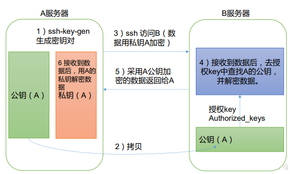
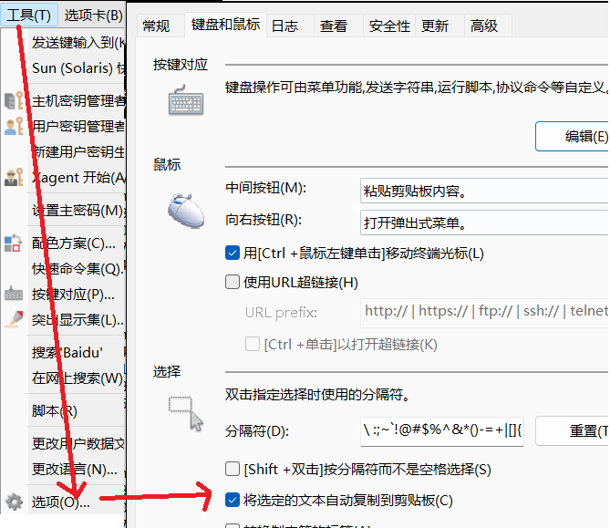
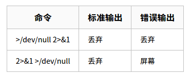

## 第一章 VMvare和Centos

#### 1、VMware

##### 1.1 下载安装

​		进入官网的 [VMware Workstation Pro 页面](https://www.vmware.com/cn/products/workstation-pro.html)，浏览功能特性、应用场景、系统要求等。下滑页面点击试用`Workstation 16 Pro` 下方的下载链接，跳转至[下载页面](https://www.vmware.com/products/workstation-pro/workstation-pro-evaluation.html)。

```bash
#激活密钥
VM16：ZF3R0-FHED2-M80TY-8QYGC-NPKYF
VM15：FC7D0-D1YDL-M8DXZ-CYPZE-P2AY6
VM12：ZC3TK-63GE6-481JY-WWW5T-Z7ATA
VM10：1Z0G9-67285-FZG78-ZL3Q2-234JG
```


##### 1.2 VMware 三种网络模式

​		**网卡**是电脑内置的硬件，一般的笔记本会有两个网卡：以太网网卡，有线上网用。Wi-Fi网卡，无线上网使用。一个机器可以同时使用多种网络模式，也就是使用多个虚拟网卡。比如一台虚拟机，同时需要有内网IP和外网IP，就可以添加两个网络适配器。

​		**路由器**一般有几个功能，第一个是网关，控制下行网络。第二个是扩展有线网络端口，比如家里有四个房间，每个房间都要有一个网口。第三个是WiFi功能，可以接入无线设备。路由通常与桥接来对比，基本功能一致，区别在于桥接发生在OSI参考模型的第二层（数据链路层），而路由发生在第三层（网络层）。

​		**交换机**一般只有扩展有线网络端口一个功能，也就是说可以把局域网的电脑组建成一个网络。交换机是用来**扩展接口**，或者把局域网的电脑连接到一个网络环境用的。路由器帮我们连接到互联网。


###### 1.2.1 虚拟交换机和虚拟网卡

| 虚拟交换机 | 网络模式   |
| ---------- | ---------- |
| VMnet0     | 桥接模式   |
| VMnet1     | 仅主机模式 |
| VMnet8     | NAT模式    |

> **提示：**这三种交换机都是由`VMWare`自动配置生成的，可以根据需求自行设置。VMnet8和VMnet1提供DHCP服务，VMnet0虚拟网络则不提供。

​		另外，安装Vmware软件的时候，它还在我们的物理机里面安装了两个虚拟网卡。

| 网卡名称                      | 网络模式   |
| ----------------------------- | ---------- |
| VMware Network Adapter VMnet1 | 仅主机模式 |
| VMware Network Adapter VMnet8 | NAT模式    |


###### 1.2.2 Bridged桥接模式


​		桥接把两个原本隔离的环境连接起来，共享同一个网段。VM提供的虚拟桥接，像座桥把虚拟机的网络环境和物理机的网络环境连在了一起。所以桥接之后虚拟机就是物理机网络环境的一部分，此时虚拟机就像和局域网中其他机器一样，可以与网络中的任何机器相互通信。但此模式下，虚拟机ip地址与主机在**占用同一个网段**，占用局域网`IP`和`MAC`地址资源；且若联接外网，则网关的`DNS`需要与主机网卡一致。

| 通讯方式                                                     | 特点                                                         | 连通情况                                                     | 使用场景                         |
| ------------------------------------------------------------ | ------------------------------------------------------------ | ------------------------------------------------------------ | -------------------------------- |
| （1）虚拟机通过连接到虚拟机交换机，利用虚拟网桥连接到主机的真实物理网卡。<br />（2）不需要用到虚拟网卡，所以没有VMware Network Adapter VMnet0。 | （1）物理机和虚拟机地位平等<br />（2）虚拟机占用一个独立IP，虚拟机IP网段和主机一致<br />（3）使用物理机的网卡访问互联网 | （1）主机和虚拟机可以访问<br />（2）虚拟机之间可以相互访问<br />（3）可以访问互联网 | 创建一个虚拟服务器在内网提供服务 |

> **特殊配置：复制物理网络连接状态，即是否固定IP**


​		在移动设备上使用虚拟机，尽量选择复制物理网络连接状态，因为在有线或无线网络之间进行移动时，该设置可以保证==IP地址续订==。比如最开始主机用有线连接的局域网，开启虚拟机（使用桥接），虚拟机系统获取的局域网地址为192.168.1.4。然后把主机的把连接换为Wifi时，若选择了复制物理网络连接状态选项，那虚拟机系统的IP不会变化(192.168.1.4)；若没有，则虚拟机系统的IP会由`DHCP`随机分配。


###### 1.2.3 NAT模式


​		NAT模式借助虚拟NAT设备和交换机，可以与外网通信。**宿主机有两块网卡**：真实物理网卡，与网络路由通信；`VMware Network Adapter VMnet8`虚拟网卡，与虚拟交换机`VMnet8`（VMware维护）与虚拟机网卡进行通信，所以虚拟机和宿主机不在同一网段。但`VMnet8`虚拟网卡仅仅用于与`VMnet8`网段通信，并不为`VMnet8`网段提供路由功能，`NAT`网络下的虚拟机是使用虚拟的NAT服务器与外网通信。


​		NAT模式下的虚拟系统的`TCP/IP`配置信息是由`VMnet8`虚拟交换机所提供，所以若宿主机与虚拟机要想相互通信，需要将`VMware Network Adapter VMnet8`的`IP`地址需要处于虚拟交换机的网段，配置完成后，虚拟机可以访问宿主机和局域网中其他主机，但局域网里其他主机不能直接访问虚拟机，需要完成<a href="#translation1">**端口映射**</a>。

> 网络地址转换（映射）模式`Network Address Translation`：		
>
> ​		虚拟机对外访问的时先映射到宿主物理机，物理机再对外进行转发，反过来也是如此。若需要虚拟机和外网物理机的互联互通就需要配置相应的网关代理或端口转发。

| 通讯方式                                                     | 特点                                                         | 连通情况                                                     | 使用场景                                                    |
| ------------------------------------------------------------ | ------------------------------------------------------------ | ------------------------------------------------------------ | ----------------------------------------------------------- |
| （1）虚拟NAT设备（虚拟路由）连接到真实物理显卡——访问外网<br />（2）主机通过VMware Network Adapter VMnet8虚拟网卡连接到VMnet8虚拟交换机——宿主机和虚拟机通信 | （1）虚拟机在外部网络中没有自己的IP地址<br />（2）虚拟NAT设备会把专用网络中的 IP 地址转换为主机系统的 IP 地址——网络地址转换<br />（3）主机可以联网，虚拟机就可以联网 | （1）主机和虚拟机可以访问，虚拟机之间可以相互访问<br />（2）可以访问外网<br />（3）外网主机不能访问虚拟机，必须进行**主机转发**：共享网络、端口映射 | 若`IP`资源紧缺，但又希望虚拟机能联网，NAT模式是最好的选择。 |

> **特殊配置：虚拟机与局域网其他主机通信**

​		需要进行<span id="translation1">端口映射的</span>，编辑=>虚拟网络编辑器，完成物理端口到虚拟机端口的映射处理，并开启`VMware`服务：`NAT`和`DHCP`（默认开启）：


​		在防火墙中开放端口，让宿主主机的防火墙允许映射的端口：按引导操作，选择`TCP`，然后设置需要开放的端口(如：9995)，也可以指定端口范围，其余采用默认配置。至此，配置完成，可以远程操作虚拟机内的系统。


###### 1.2.4 仅主机模式Host-Only


​		`Host-Only`仅主机模式本质是`NAT`去除虚拟NAT设备，然后使用`VMware Network Adapter VMnet1`虚拟网卡连接`VMnet1`虚拟交换机来与虚拟机通信的，`Host-Only`模式将虚拟机与真实网络隔开，使得虚拟机成为一个独立的系统，只与宿主机和其他虚拟机相互通信。在`host-only`模式下，虚拟系统的`TCP/IP`配置信息(如IP地址、网关地址、DNS服务器等)，都是由`VMnet1`虚拟网络的DHCP服务器来动态分配的。

| 通信方式                                                     | 特点                            | 连通情况                                                     | 使用场景                 |
| ------------------------------------------------------------ | ------------------------------- | ------------------------------------------------------------ | ------------------------ |
| 主机使用VMware Network Adapter VMnet1虚拟网卡连接到VMnet1虚拟交换机 | 没有了虚拟NAT设备，所以不能上网 | （1）宿主机和虚拟机可以通信，但不能与其他局域网主机通信<br />（2）虚拟机之间可以相互访问<br />（3）不能访问互联网，解决办法：主机网卡共享给VMware Network Adapter VMnet1网卡<br /> | 创建与真实网络隔离的网络 |


#### 2、Centos

[下载地址]( http://mirrors.aliyun.com/centos/)，各个版本的ISO镜像文件的区别：

```bash
CentOS-7-x86_64-DVD-2009.iso                04-Nov-2020 19:37      4G   #标准安装版，一般下载这个就可以了（推荐）
CentOS-7-x86_64-DVD-2009.torrent            06-Nov-2020 22:44    176K
CentOS-7-x86_64-DVD-2207-02.iso             26-Jul-2022 23:10      4G
CentOS-7-x86_64-Everything-2009.iso         02-Nov-2020 23:18     10G   #对完整版安装盘的软件进行补充，集成所有软件
CentOS-7-x86_64-Everything-2009.torrent     06-Nov-2020 22:44    381K
CentOS-7-x86_64-Everything-2207-02.iso      27-Jul-2022 02:09     10G
CentOS-7-x86_64-Minimal-2009.iso            03-Nov-2020 22:55    973M   #精简版，自带的软件最少
CentOS-7-x86_64-Minimal-2009.torrent        06-Nov-2020 22:44     39K
CentOS-7-x86_64-Minimal-2207-02.iso         26-Jul-2022 23:10    988M
CentOS-7-x86_64-NetInstall-2009.iso         27-Oct-2020 00:26    575M   #网络安装镜像
```

#####  2.1 安装过程


##### 2.2 配置

###### 2.2.1 设置静态ip

（1）修改配置文件`vim /etc/sysconfig/network-scripts/ifcfg-ens33`

```bash
PROXY_METHOD="none"
BROWSER_ONLY="no"
#IP 的配置方法[none|static|bootp|dhcp]
BOOTPROTO="static"
DEFROUTE="yes"
IPV4_FAILURE_FATAL="no"
IPV6INIT="yes"
IPV6_AUTOCONF="yes"
IPV6_DEFROUTE="yes"
IPV6_FAILURE_FATAL="no"
IPV6_ADDR_GEN_MODE="stable-privacy"
NAME="ens33"
#随机id
UUID="694ed51c-def7-4b8d-b2cc-164e66d39214"
#接口名（设备,网卡）
DEVICE="ens33"
#系统启动的时候网络接口是否有效（yes/no）
ONBOOT="yes"
#IP 地址
IPADDR=192.168.119.100
#网关
GATEWAY=192.168.119.2
#域名解析器
DNS1=192.168.119.2
```

（2）重启网络服务，进行刷新

```bash
service network restart

#若要使用NetworkManager来重启，需要关闭network.service
systemctl restart network.ervice
systemctl restart NetworkManager

#查看当前IP
hostname -I
192.168.10.103

[root@redis6381 ~]# ip addr
1: lo: <LOOPBACK,UP,LOWER_UP> mtu 65536 qdisc noqueue state UNKNOWN group default qlen 1000
    link/loopback 00:00:00:00:00:00 brd 00:00:00:00:00:00
    inet 127.0.0.1/8 scope host lo
       valid_lft forever preferred_lft forever
    inet6 ::1/128 scope host 
       valid_lft forever preferred_lft forever
2: ens33: <BROADCAST,MULTICAST,UP,LOWER_UP> mtu 1500 qdisc pfifo_fast state UP group default qlen 1000
    link/ether 00:0c:29:ab:66:91 brd ff:ff:ff:ff:ff:ff
    inet 192.168.10.103/24 brd 192.168.10.255 scope global noprefixroute ens33
       valid_lft forever preferred_lft forever
    inet6 fe80::fc:39e4:127f:cbc7/64 scope link tentative noprefixroute dadfailed 
       valid_lft forever preferred_lft forever
    inet6 fe80::a43:23a3:361f:bfcd/64 scope link noprefixroute 
       valid_lft forever preferred_lft forever
```

> 修改`IP`地址后可能会遇到的问题：

- 其他物理机能`ping`通虚拟机，但是虚拟机`ping`不通物理机，可能是宿主机的防火墙问题，开放端口即可 
- 能`Ping`通物理机，但是虚拟机`Ping`不通外网，可能是`DNS`的设置问题。 
- `Ping www.baidu.com`显示域名未知等信息，一般查看`GATEWAY`和`DNS`设置是否正确。


###### 2.2.2 修改主机名

```bash
#查看主机名
hostname 【参数 -I获取ip】

#重启服务器生效
vim /etc/hostname   

#如果需要立即生效的操作，同时会修改配置文件
hostnamectl set-hostname mybase100
```

> 配置`host`映射文件：

```bash
#  vim /ect/hosts
127.0.0.1   localhost localhost.localdomain localhost4 localhost4.localdomain4
::1         localhost localhost.localdomain localhost6 localhost6.localdomain6
192.168.119.100 Centos100
192.168.119.101 Centos101
192.168.119.102 Centos102
192.168.119.103 Centos103
192.168.119.104 Centos104
192.168.119.105 Centos105
#window的host在C:\Windows\System32\drivers\etc
```


###### 2.2.3  配置ssh免密



- 本地生成公钥和私钥

​		执行命令`ssh-keygen -t rsa`（Windows使用`Git Bash`），执行后会提示输入文件保存路径，直接回车即可，生成的两个文件`id_rsa`和`id_rsa.pub`，默认在用户`home`目录的`.ssh`文件夹下。

```bash
-b: 指定密钥长度；
-e: 读取openssh的私钥或者公钥⽂件；
-C: 添加注释（不加的话，默认注释为主机名和用户名信息）
-f: 指定⽤来保存密钥的⽂件名；
-i: 读取未加密的ssh-v2兼容的私钥/公钥⽂件，然后在标准输出设备上显⽰openssh兼容的私钥/公钥；
-l: 显⽰公钥⽂件的指纹数据；
-N: 提供⼀个新密语；
-P: 提供（旧）密语；
-q: 静默模式；
-t: 指定要创建的密钥类型。
```

- 将公钥上传到目标服务器

​		执行`ssh-copy-id -i ~/.ssh/id_rsa.pub root@192.168.157.110`，按提示输入服务器`root`用户密码。此时目标主机`.ssh`文件夹会生成一个`authorized_keys`文件（可以访问的名单），而本机的`konwn_host`是可以去免密访问的主机名称。

> **注意：**`-i`参数是指定公钥文件的路径，如果公钥文件在当前用户的`.ssh`文件夹下，可以不使用该参数。

- 测试免密登录：执行`ssh root@192.168.157.110`，如果不用输入密码就表示免密配置成功
- 删除免密：上传公钥后，目标服务器对应用户下的`.ssh/authorized_keys`文件会添加一行内容，也就是本地生成的公钥。因此编辑该文件，将对应的公钥内容删掉，就禁用了免密。


##### 2.3 目录结构

整体结构如下：

```bash
[root@CentosBase /]# ll -a
总用量 20
dr-xr-xr-x.  17 root root  224 5月  25 22:20 .
dr-xr-xr-x.  17 root root  224 5月  25 22:20 ..
lrwxrwxrwx.   1 root root    7 5月  25 22:15 bin -> usr/bin
dr-xr-xr-x.   5 root root 4096 5月  25 22:21 boot
drwxr-xr-x.  19 root root 3180 5月  29 11:50 dev
drwxr-xr-x.  74 root root 8192 5月  29 18:03 etc
drwxr-xr-x.   3 root root   19 5月  25 22:20 home
lrwxrwxrwx.   1 root root    7 5月  25 22:15 lib -> usr/lib
lrwxrwxrwx.   1 root root    9 5月  25 22:15 lib64 -> usr/lib64
drwxr-xr-x.   2 root root    6 4月  11 2018 media
drwxr-xr-x.   3 root root   19 5月  26 21:07 mnt
drwxr-xr-x.   2 root root    6 4月  11 2018 opt
dr-xr-xr-x. 105 root root    0 5月  29 11:50 proc
dr-xr-x---.   2 root root  186 5月  29 17:15 root
drwxr-xr-x.  24 root root  640 5月  29 18:03 run
lrwxrwxrwx.   1 root root    8 5月  25 22:15 sbin -> usr/sbin
drwxr-xr-x.   2 root root    6 4月  11 2018 srv
dr-xr-xr-x.  13 root root    0 5月  29 11:50 sys
drwxrwxrwt.  13 root root 4096 5月  29 18:03 tmp
drwxr-xr-x.  13 root root  155 5月  25 22:15 usr
drwxr-xr-x.  19 root root  267 5月  25 22:21 var
```


CentOS的目录大体上可分为四类：管理类、用户类、应用程序类、信息类文件目录。

**管理类目录：**

/boot：这里存放的是启动 Linux 时使用的一些核心文件，放置linux系统启动时用到的一些文件。/boot/vmlinuz为linux的内核文件，以及/boot/gurb。建议单独分区，分区大小100M即可。

/bin： bin 是 Binaries (二进制文件) 的缩写, 这个目录存放着最经常使用的命令。如常用的命令ls、tar、mv、cat等。

/sbin:/usr/sbin:/usr/local/sbin：s 就是 Super User 的意思，是 Superuser Binaries (超级用户的二进制文件) 的缩写，这里存放的是系统管理员使用的系统管理程序。放置系统管理员使用的可执行命令，如fdisk、shutdown、mount等。与/bin不同的是，这几个目录是给系统管理员root使用的命令，一般用户只能"查看"而不能设置和使用。

/var：var 是 variable(变量) 的缩写，这个目录中存放着在不断扩充着的东西，我们习惯将那些经常被修改的目录放在这个目录下。包括各种日志文件。如随时更改的日志文件 /var/log，/var/log/message： 所有的登录文件存放目录，/var/spool/mail： 邮件存放的目录， /var/run: 程序或服务启动后，其PID存放在该目录下。建议单独分区，设置较大的磁盘空间。

/etc：是 Etcetera 的缩写，系统配置文件存放的目录，不建议在此目录下存放可执行文件，重要的配置文件有/etc/inittab、/etc/fstab、/etc/init.d、/etc/X11、/etc/sysconfig、/etc/xinetd.d修改配置文件之前记得备份。注：/etc/X11存放与x windows有关的设置。**该目录下的profile是配置环境变量的。但是一般不在profile文件中修改，而是通过profile代码规定的profile.d目录新建一个自己的.sh来添加环境变量**

/dev ：dev 是 Device(设备) 的缩写, 该目录下存放的是 Linux 的外部设备，在 Linux 中访问设备的方式和访问文件的方式是相同的。存放linux系统下的设备文件，访问该目录下某个文件，相当于访问某个设备，常用的是挂载光驱mount /dev/cdrom /mnt。

/mnt：系统提供该目录是为了让用户临时挂载别的文件系统的，我们可以将光驱挂载在 /mnt/ 上，然后进入该目录就可以查看光驱里的内容了。通常光盘挂载于/mnt/cdrom下，也不一定，可以选择任意位置进行挂载。

/media：linux 系统会自动识别一些设备，例如U盘、光驱等等，当识别后，Linux 会把识别的设备挂载到这个目录下。

**用户类目录：**

/root：该目录为系统管理员，也称作超级权限者的用户主目录。

/home：系统默认的用户家目录，新增用户账号时，用户的家目录都存放在此目录下，~表示当前用户的家目录。建议单独分区，并设置较大的磁盘空间，方便用户存放数据

**应用程序类目录：**

/lib:/usr/lib：lib 是 Library(库) 的缩写这个目录里存放着系统最基本的动态连接共享库，其作用类似于 Windows 里的 DLL 文件。几乎所有的应用程序都需要用到这些共享库。系统使用的函数库的目录，程序在执行过程中，需要调用一些额外的参数时需要函数库的协助，比较重要的目录为/lib/modules。

/tmp：tmp 是 temporary(临时) 的缩写。一般用户或正在执行的程序临时存放文件的目录,任何人都可以访问,重要数据不可放置在此目录下。

/usr：usr 是 unix shared resources(共享资源) 的缩写，这是一个非常重要的目录，用户的很多应用程序和文件都放在这个目录下，类似于 windows 下的 program files 目录。应用程序存放目录，

​		/usr/bin 存放应用程序， 

​		/usr/share 存放共享数据，

​		/usr/lib 存放不能直接运行的，却是许多程序运行所必需的一些函数库文件。

​		/usr/local:主要存放那些手动安装的软件。

​		/usr/share/doc: 系统说明文件存放目录。

​		/usr/share/man: 程序说明文件存放目录，使用 man ls时会查询/usr/share/man/man1/ls.1.gz的内容。建议单独分区，设置较大的磁盘空间。

/opt：opt 是 optional(可选) 的缩写，给主机额外安装软件所摆放的目录。以前的 Linux 系统中，习惯放置在 /usr/local 目录下。比如你安装一个ORACLE数据库则就可以放到这个目录下。默认是空的。

/sys：这是 Linux2.6 内核的一个很大的变化。该目录下安装了 2.6 内核中新出现的一个文件系统 sysfs 。sysfs 文件系统集成了下面3种文件系统的信息：针对进程信息的 proc 文件系统、针对设备的 devfs 文件系统以及针对伪终端的 devpts 文件系统。该文件系统是内核设备树的一个直观反映。当一个内核对象被创建的时候，对应的文件和目录也在内核对象子系统中被创建。

/run：是一个临时文件系统，存储系统启动以来的信息。当系统重启时，这个目录下的文件应该被删掉或清除。如果你的系统上有 /var/run 目录，应该让它指向 run。

**信息类目录：**

/srv：该目录存放一些服务启动之后需要提取的数据。如www服务需要访问的网页数据存放在/srv/www内。

/lost+found： 当系统意外崩溃或机器意外关机，而产生一些文件碎片放在这里。但当突然停电、或者非正常关机后，有些文件就临时存放在这里。通常这个目录会自动出现在装置目录下。如加载硬盘于/disk 中，此目录下就会自动产生目录/disk/lost+found。这个目录一般情况下是空的，当系统非法关机后，这里就存放了一些文件。

/proc： proc 是 Processes(进程) 的缩写，/proc 是一种伪文件系统（也即虚拟文件系统），存储的是当前内核运行状态的一系列特殊文件，这个目录是一个虚拟的目录，它是系统内存的映射，我们可以通过直接访问这个目录来获取系统信息。操作系统运行时，进程信息及内核信息（比如cpu、硬盘分区、内存信息等）存放在这里。这个目录的内容不在硬盘上而是在内存里，我们也可以直接修改里面的某些文件，比如可以通过下面的命令来屏蔽主机的ping命令，使别人无法ping你的机器。

```bash
#icmp_echo_ignore_all 不是真实文件，因此不能通过 vim 来编辑修改。
#临时设置 PING 操作
#禁止/开启
echo 1/0 > /proc/sys/net/ipv4/icmp_echo_ignore_all
#永久设置 PING 操作
#在 /etc/sysctl.conf 文件中增加一行：
# 禁止/开启
net.ipv4.icmp_echo_ignore_all = 1/0
```

**其他重要目录：**

/usr/bin：系统用户使用的应用程序。

/usr/sbin：超级用户使用的比较高级的管理程序和系统守护程序。

/usr/src：内核源代码默认的放置目录。

/etc/rc.d       放置开机和关机的脚本。

/etc/rc.d/init.d   放置启动脚本

/etc/xinetd.d    配置xinetd.conf可以配置启动其他额外服务

/usr/include     一些distribution套件的头文件放置目录，安装程序时可能会用到。

/usr/local      默认的软件安装目录。

/usr/share/doc  系统说明文件的放置目录

/usr/share/man  程序说明文件放置目录

/usr/X11R6    X的存放目录


##### 2.4 scp / rsync 集群分发

- `scp`：`secure copy`缩写，基于`SSH`协议远程拷贝文件。scp命令可以在多台Linux系统之间复制文件或目录。全部数据都是加密的，因此会比HTTP和FTP更加安全。且占用资源少，不会提高多少系统负荷，`rsync`就远远不及它了。虽然`rsync`比`scp`会快些，但当小文件众多的情况下，`rsync`会导致硬盘`I/O`非常高，而`scp`基本不影响系统正常使用。

```bash
$ scp [可选参数] user@host:file_source user@host:file_target 

#常用参数
-1	使用ssh协议版本1-2
-2	使用ssh协议版本2
-4	使用ipv4
-6	使用ipv6
-B	以批处理模式运行,传输过程中不询问传输口令或短语
-C	使用压缩,将-C标志传递给ssh，从而打开压缩功能
-F	指定一个替代的ssh配置文件，此参数直接传递给ssh
-i identity_file  从指定文件中读取传输时使用的密钥文件，此参数直接传递给ssh
-l	指定宽带限制,以Kbit/s为单位
-o	指定使用的ssh选项
-P	指定远程主机的端口号
-p	保留文件的修改时间，访问时间和权限模式
-q	不显示复制进度
-r	递归复制整个目录
-v  详细方式显示输出。scp和ssh(1)会显示出整个过程的调试信息。这些信息用于调试连接，验证和配置问题。
-S  指定加密传输时所使用的程序


#将某个本地文件复制到指定的远程主机的指定目录中
[root@linuxcool ~]$ scp anaconda-ks.cfg 192.168.10.10:/root  

#将指定远程主机中的某个文件复制到本地家目录中
[root@linuxcool ~]$ scp 192.168.10.10:/root/anaconda-ks.cfg /root

#将某个本地目录复制到指定的远程主机的指定目录中
[root@linuxcool ~]$ scp -r Documents 192.168.10.10:/root

#将指定远程主机中的某个目录复制到本地家目录中
[root@linuxcool ~]$ scp -r 192.168.10.10:/root/Documents /root

#将某个本地文件复制到指定的远程主机的指定目录中，指定要使用的传输用户身份，并保留原始文件的权限属性
[root@linuxcool ~]$ scp -p anaconda-ks.cfg linuxprobe@192.168.10.10:/root
```

- `rsync`： 使用`rsync`算法来使本地和远程两个主机之间的文件达到同步，这个算法只传送两个文件的不同部分，而不是每次都整份传送，因此速度相当快。主要用于备份和镜像，具有速度快、避免复制相同内容和支持符号链接的优点。`rsync`和`scp`区别：用`rsyc`做文件的复制要比`scp`的速度快，`rsync`只对差异文件做更新。`scp`是把所有文件都复制过去。

```bash
$ rsync -[选项] user@host:filename user@host:filename

#常用参数
-a  以递归方式传输文件，并保持所有文件属性*
-v	详细模式输出*
-q	精简输出模式，安静模式
-e, --rsh=command 指定使用rsh、ssh方式进行数据同步*
-z, --compress 对备份的文件在传输时进行压缩处理*
-t, --times 保持文件时间信息*
-p, --perms 保持文件权限*
-o, --owner 保持文件属主信*
-g, --group 保持文件属组信息*
--progress 显示备份过程*
-h	显示帮助信息
-c, --checksum 打开校验开关，强制对文件传输进行校验
-r, --recursive 对子目录以递归模式处理
-R, --relative 使用相对路径信息


-b, --backup 创建备份，也就是对于目的已经存在有同样的文件名时，将老的文件重新命名为~filename。可以使用--suffix选项来指定不同的备份文件前缀。
--backup-dir 将备份文件(如~filename)存放在在目录下。
-suffix=SUFFIX 定义备份文件前缀。
-u, --update 仅仅进行更新，也就是跳过所有已经存在于DST，并且文件时间晚于要备份的文件，不覆盖更新的文件。
-l, --links 保留软链结。
-L, --copy-links 想对待常规文件一样处理软链结。
--copy-unsafe-links 仅仅拷贝指向SRC路径目录树以外的链结。
--safe-links 忽略指向SRC路径目录树以外的链结。
-H, --hard-links 保留硬链结。
-D, --devices 保持设备文件信息。
-S, --sparse 对稀疏文件进行特殊处理以节省DST的空间。
-n, --dry-run现实哪些文件将被传输。
-w, --whole-file 拷贝文件，不进行增量检测。
-x, --one-file-system 不要跨越文件系统边界。
-B, --block-size=SIZE 检验算法使用的块尺寸，默认是700字节。
--rsync-path=PATH 指定远程服务器上的rsync命令所在路径信息。
-C, --cvs-exclude 使用和CVS一样的方法自动忽略文件，用来排除那些不希望传输的文件。
--existing 仅仅更新那些已经存在于DST的文件，而不备份那些新创建的文件。
--delete 删除那些DST中SRC没有的文件。
--delete-excluded 同样删除接收端那些被该选项指定排除的文件。
--delete-after 传输结束以后再删除。
--ignore-errors 及时出现IO错误也进行删除。
--max-delete=NUM 最多删除NUM个文件。
-P --partial 保留那些因故没有完全传输的文件，以是加快随后的再次传输。
--force 强制删除目录，即使不为空。
--numeric-ids 不将数字的用户和组id匹配为用户名和组名。
--timeout=time ip超时时间，单位为秒。
-I, --ignore-times 不跳过那些有同样的时间和长度的文件。
--size-only 当决定是否要备份文件时，仅仅察看文件大小而不考虑文件时间。
--modify-window=NUM 决定文件是否时间相同时使用的时间戳窗口，默认为0。
-T --temp-dir=DIR 在DIR中创建临时文件。
--compare-dest=DIR 同样比较DIR中的文件来决定是否需要备份。
--exclude=PATTERN 指定排除不需要传输的文件模式
--include=PATTERN 指定不排除而需要传输的文件模式
--exclude-from=FILE 排除FILE中指定模式的文件
--include-from=FILE 不排除FILE指定模式匹配的文件
--version 打印版本信息
--address 绑定到特定的地址
--config=FILE 指定其他的配置文件，不使用默认的rsyncd.conf文件
--port=PORT 指定其他的rsync服务端口
--blocking-io 对远程shell使用阻塞IO
-stats 给出某些文件的传输状态
--progress 在传输时现实传输过程
--log-format=formAT 指定日志文件格式
--password-file=FILE 从FILE中得到密码
--bwlimit=KBPS 限制I/O带宽，KBytes per second

#启动ssh服务
[root@linuxcool ~]$ service sshd start
启动 sshd： [确定]

#使用rsync命令来备份服务端上的数据
[root@linuxcool ~]$ rsync -vzrtopg --progress -e ssh --delete 
```

- `xsync`集群分发脚本，循环复制文件到所有节点的相同目录下，**注意：**同步与被同步的服务器都需要安装`rsync`。

```bash
[zxy@hadoop102 bin]$ touch xsync
[zxy@hadoop102 bin]$ vim xsync

#在该文件中编写如下shell脚本：
#!/bin/bash
#1 获取输入参数个数，如果没有参数，直接退出
pcount=$#
if [ $pcount -lt 1 ]
then
    echo Not Enough Arguement!
    exit;
fi

#2. 遍历集群所有机器
# 也可以采用：
# for host in hadoop{102..104};
for host in hadoop102 hadoop103 hadoop104
do
    echo ====================    $host    ====================
    #3. 遍历所有目录，挨个发送
    for file in $@
    do
        #4 判断文件是否存在
        if [ -e $file ]
        then
            #5. 获取父目录
            pdir=$(cd -P $(dirname $file); pwd)
            echo pdir=$pdir
            
            #6. 获取当前文件的名称
            fname=$(basename $file)
            echo fname=$fname
            
            #7. 通过ssh执行命令：在$host主机上递归创建文件夹（如果存在该文件夹）
            ssh $host "mkdir -p $pdir"
            
			#8. 远程同步文件至$host主机的$USER用户的$pdir文件夹下
            rsync -av $pdir/$fname $USER@$host:$pdir
        else
            echo $file does not exists!
        fi
    done
done


#修改脚本 xsync 具有执行权限

[zxy@hadoop102 bin]$ chmod 777 xsync
#调用脚本形式：xsync 文件名称

[zxy@hadoop102 bin]$ xsync /home/zxy/bin
```


#### 3、Xshell

##### 3.1 自动复制配置




## 第二章 Linux 控制命令

#### 1、VIM编辑器和快捷键


##### 1.1 vim一般模式的常见命令

| 语法                              | 描述                                            |
| --------------------------------- | ----------------------------------------------- |
| 【number】yy  或y【number】y      | 复制从光标开始数到【number】的那几行            |
| 【number】p                       | 在光标处粘贴【number】行                        |
| u                                 | 撤销上一步操作                                  |
| 【number】dd 或d【number】d       | 删除光标（含）后行                              |
| y$【即y+shift+4】                 | 从光标处复制到行尾                              |
| y^【即y+shift+6】                 | 从光标【不包含光标】到行头                      |
| w/b                               | 跳转到下/上一个单词【词头】                     |
| e                                 | 跳转到当前单词或下一个单词的词尾                |
| yw                                | 复制一个从光标开始到当前单词结尾的截断          |
| dw                                | 删除一个从光标开始到当前单词结尾的截断          |
| ^【shift+6】                      | 移动到行头                                      |
| $【shift+4】                      | 移动到行末                                      |
| 小写x                             | 剪切光标处的一个字符【相当于del】               |
| 大写X【也可以是shift+x】          | 剪切光标前一个字符【相当于background】          |
| 小写r【字符】                     | 替换光标处的一个字符                            |
| 大写R【也可以是shift+r】          | 从光标处开始替换模式【特殊的编辑模式，esc退出】 |
| 小写gg 或大写H【也可以是shift+h】 | 文章的开头                                      |
| 【number】大写G 或大写的L         | 文章末尾的行头【跳转到number行的行头】          |

##### 1.2 vim编辑模式的常见命令

| 命令 | 说明                                    |
| ---- | --------------------------------------- |
| i    | 在光标之前的位置进行插入                |
| I    | 在光标所在行最前进行插入                |
| a    | 在光标之后进行插入                      |
| A    | 在光标所在行最后进行插入                |
| o    | 当前光标行的下一行【自动enter一个新行】 |
| O    | 当前光标行的上一行【自动enter一个新行】 |

##### 1.3 vim命令模式的常见命令

| 命令          | 说明                                      |
| ------------- | ----------------------------------------- |
| :w            | 保存                                      |
| :wq           | 保存并退还 （**末尾加上！就是强制执行**） |
| :q            | 退出                                      |
| :q!           | 不保存强制退出                            |
| /要查找的词   | n查找下一个 N查找上一个                   |
| :noh          | 取消高亮显示                              |
| :set nu       | 显示行号                                  |
| :set nonu     | 取消显示行号                              |
| :s/old/new    | 替换当前行匹配到的第一个old为new          |
| :s/old/new/g  | 替换当前行匹配到所有的old为new            |
| :%s/old/new   | 替换文档中每一行第一个old为new            |
| :%s/old/new/g | 替换文档中匹配到的所有old为new            |

##### 1.4 快捷键

| 快捷键   | 说明                                                         |
| -------- | ------------------------------------------------------------ |
| ctrl+c   | 停止进程                                                     |
| ctrl+i   | 等同于clear；彻底清屏reset                                   |
| tab      | 自动补全和提示                                               |
| 上下键   | 历史命令                                                     |
| ctrl+b/f | 左右移动光标，改为alt则是单词为单位（有冲突）                |
| ctrl+a/e | 移动光标到行首和行尾                                         |
| ctrl+d   | 相当于del键，删除当前光标所在位置的字符，而且ctrl+d还是linux下的文件结束符，用来结束输入 |
| ctrl+l   | 相当于clear命令                                              |
| ctrl+s/q | 停止/开启命令窗口的回显                                      |
| ！！     | 执行上次的命令                                               |
| ctrl+r   | 筛选历史命令 enter选择 table进行修改 esc退出                 |


#### 2、Linux系统管理

##### 1.1 uname系统版本信息

`uname`(`unix name`)：显示操作系统信息，例如内核版本、主机名、处理器类型等。

```bash
$ uname [-amnrsv][--help][--version]

#常用参数
-a 或--all 　显示全部的信息，包括内核名称、主机名、操作系统版本、处理器类型和硬件架构等。。
-m 或--machine、-p 　显示处理器类型。
-n 或--nodename 　显示主机名。
-r 或--release 　显示内核版本号。
-s 或--sysname 　显示操作系统名称。
-v 或--version 　显示操作系统的版本。
--help 　显示帮助。

[root@lightrain /]# uname
Linux
[root@lightrain /]# uname -a
Linux lightrain 3.10.0-1160.62.1.el7.x86_64 #1 SMP Tue Apr 5 16:57:59 UTC 2022 x86_64 x86_64 x86_64 GNU/Linux
```


##### 1.2 Linux 中的进程和服务

​		计算机中，一个正在执行的程序或命令，被叫做进程(`process`)，启动之后一个常驻内存的进程，一般被称作服务(`service`)。


###### 1.2.1 service 服务管理(CentOS 6)

​		基本语法：`service ServiceName start | stop | restart | status ` ，查看服务的方法：`/etc/init.d/`中发现只有两个服务保留：

```bash
 #在sbin里可以找到service系统命令
 ls /usr/sbin/ | grep service
 
 #查看保留的旧service
 cd /ect/init.d
 #functions  netconsole  network  README
```

> **注意：**
>
> ​		可以通过`ll`命令查看`/etc/init.d`是`/etc/rc.d/init.d`的软链接(soft link)，用来存放服务脚本，当Linux启动时，会寻找这些目录中的服务脚本，并根据脚本的`run level`确定不同的启动级别。软连接是为了保持同一种服务在`CentOS`和`Ubuntu`使用的统一性，`Ubuntu`没有`/etc/rc.d/init.d`这个目录。然而服务脚本的编写及服务配置都是不同的，比如`CentOS`的`Chkconfig`对应`Ubuntu`的`ysv-rc-conf`。


###### 1.2.2 systemctl 服务管理(CentOS 7） 

​		基本语法：`systemctl start | stop | restart | status | enable ServiceName `，查看所有服务状态：`systemctl list-unit-files`，可以在`/usr/lib/systemd/system`和`.../user`中查找服务。

```bash
#查看network服务状态
systemctl status network

#优先选择NetworkManger来替代Network
#首先关闭Network 在重启NetworkManger
systemctl stop network
systemctl status network
#此时发现网络不可用了，这时候需要重启NetworkMager
#Active: inactive (dead) since 一 2022-05-16 21:55:19 CST; 14s ago
systemcl restart NetworkManger
```


###### 1.2.3 firewalld 防火墙控制端口与服务

​		基本语法：`firewall-cmd [OPTIONS...] [--permanent]`，其常用参数配置如下：

```bash
--list-ports/services #查看开放的服务、端口
--add-service/port    #开放端口、服务
--remove-port/service #移除开放的端口、服务
--query-port/service  #查询开放的端口、服务
--permanent           #永久生效,不加这个参数的话只会针对本次执行完命令生效,重启后失效
--add-masquerade      #允许防火墙伪装IP
--remove-masquerade   #禁止防火墙伪装IP
--add-forward-port=port=80:proto=tcp:toport=8080          #在开起ip伪装的基础上，将80端口转发至8080
--add-forward-port=port=80:proto=tcp:toaddr=192.168.1.0.1 #将80端口转发至192.168.1.0.1的80端口
--add-forward-port=port=80:proto=tcp:toaddr=192.168.0.1:toport=8080 #将80端口转发至192.168.0.1的8080端口
--zone #firewalld相比iptables的特性，不同的zone对应不同类型的网络，不同的网络也对应着不同的包过滤规则集。
```

​		常用指令如下：

```bash
#设置开放的端口号/服务
[root@mrain02 log]$ firewall-cmd  --zone=public --add-port=3306/tcp --permanent
$firewall-cmd --add-service=http --permanent   
success
#重启防火墙	
[root@mrain02 log]$ firewall-cmd --reload
success

#查看开启的服务和端口
[root@lightrain ~]# firewall-cmd --list-all
public (active)
  target: default
  icmp-block-inversion: no
  interfaces: eth0
  sources: 
  services: dhcpv6-client ssh  #开放的服务
  ports: 6599/tcp 80/tcp 3306/tcp 2181/tcp 8081/tcp 8080/tcp 8161/tcp 61616/tcp #开放的端口
  protocols: 
  masquerade: no
  forward-ports: 
  source-ports: 
  icmp-blocks: 
  rich rules:

#查询3306端口是否开起
[root@mrain02 log]# firewall-cmd --query-port=3306/tcp
yes
```


###### 1.2.4 服务自启管理

- ==Centos6的操作模式==：`chkconfig`查看所有服务器在各个运行级别的自启配置：

```bash
chkconfig 服务名 off    #关掉指定服务的自动启动
chkconfig 服务名 on     #开启指定服务的自动启动
chkconfig 服务名 --list #查看服务开机启动状态
chkconfig --level 指定级别 network on/off # 开启关闭指定运行级别的network服务自启
```

- ==Centos7的操作模式==：`disable`、`enable`明确是否自启，`static`未配置，不明确的，可能别的服务启动时会带动它启动

```bash
systemctl list-unit-files      #查看服务开机启动状态
systemctl disable service_name #关掉指定服务的自动启动
systemctl enable service_name  #开启指定服务的自动启动


#关闭开启防火墙
systemctl stop/start firewalld
systemctl disable/enable firewalld
```

- ==图形化配置==：


```bash
#可以进入setup图形化界面进行配置
setup (需要退出时，按tab选择命令框)
```


###### 1.2.5 自定义服务配置

​		Centos 7中服务分为`system`和`user`级别，分别到存在`usr/lib/systemd/`目录下，`system`级别会在开机且没有登陆情况下就能运行，`user`级别是用户登录后才能运行的程序。

- ==配置`system`级自启动服务==

```bash
#创建服务项
cd /usr/lib/systemd/system
vim redis.service

#配置服务

[Unit]
#服务描述
Description=redis-server
#当前服务在某个服务启动之后启动
After=syslog.target network.target

[Service]#服务运行参数的设置
#systemctl进程运行的类型，有多种类型，默认为simple通过主进程启动，
#forking后台启动也就是systemctl主进程启动后会再生成一个子进程执行当前服务
Type=forking
#存放应用进程号的文件路径为绝对路径
PIDFile=/var/run/redis_6379.pid
#配置应用启动命令，应用的启动脚本路径必须为绝对路径
ExecStart=/home/service/startup.sh start
#配置应用的重启命令
ExecReload=/home/service/startup.sh restart
#配置应用的停止命令
ExecStop=/home/digital/service/startup.sh stop
#表示给应用分配独立的临时空间
PrivateTmp=true
#指定启动应用的用户
User=root
#指定用户的用户组
Group=root   
#等待应用的启动时间，单位为秒，0表示禁用，如果在配置的时间内收到启动完成的信号，服务被认为执行失败然后自动退出
TimeoutStartSec=0
# 杀掉指定进程，none表示没有进程会被杀掉，只执行stop操作
KillMode=none

#install:运行级别下服务安装的相关设置，可设置为多用户，即系统运行级别为3
[Install]
WantedBy=multi-user.target
```

- ==生效配置==

```bash
#执行reload命令，使服务配置生效
sudo systemctl daemon-reload
```

- ==自启动设置==

```bash
# 设置开机启动
[root@lightrain system]$ systemctl enabled test.service
# 设置开机不启动
[root@lightrain system]$ systemctl disabled test.service
# 查看自启动是否配置成功
[root@lightrain system]$ systemctl list-unit-files | grep redis
redis.service                                 enabled 
```


##### 1.3 运行级别


- `Centos6`查看设置级别

```bash
vim /etc/inittab
#切换运行级别
init 3/5
#图形化界面快捷键
ctrl+alt+f2 切换到运行级别三
ctrl+alt+f1 切换到运行级别五
```

- `Centos7`查看设置级别

```bash
multi-user.target #等价于原运行级别 3 多用户级别，无图形界面 
graphical.target  #等价于原运行级别 5 多用户级别，有图形界面


#查看修改当前运行级别 
systemctl get-default
systemctl set-default 目标.target
```


##### 1.4 开关机重启

```bash
sync     #将数据由内存同步到硬盘中
halt     #停机，关闭系统，但不断电
poweroff #关机，断电 
reboot   #重启，等同于 shutdown -r now
shutdown # [选项] 时间
   -c    #取消关机操作
   -H    #相当于halt 停机
   -r    #=reboot 重启
   -now  #立即关机
   -时间 #多久以后关机(min)
```

> **注意：**		
>
> ​		Linux 系统中为了提高磁盘的读写效率，对磁盘采取了 “预读迟写”操作方式。当用户 保存文件时，Linux 核心并不一定立即将保存数据写入物理磁盘中，而是将数据保存在缓冲区中，等缓冲区满时再写入磁盘，这种方式可以极大的提高磁盘写入数据的效率。但是，也带来了安全隐患，如果数据还未写入磁盘时，系统掉电或者其他严重问题出现，则将导致数据丢失。**使用 sync 指令可以立即将缓冲区的数据写入磁盘。**


##### 1.5 查看登陆日志

​	last：`last [-adRx][-f ][-n ][帐号名称...][终端机编号...]`，用于显示用户错误的登录列表，此指令可以发现系统的登录异常。单独执行lastb命令，会读取位于`/var/log/btmp`文件，并把该文件记录**登入系统失败**的用户名单全部显示出来。

```bash
 -a   #把从何处登入系统的主机名称或ip地址显示在最后一行 
 -d   #将IP地址转换成主机名称              
 -f   #指定记录文件                    
 -n   #设置列出名单的要显示的行数               
 -R   #不显示登入系统的主机名称或IP地址         
 -x   #显示系统关机，重新开机，以及执行等级的改变等信息 
```


## 第三章 常用命令

#### 1、帮助和常规命令

##### 1.1 man / help / info  命令帮助

​		`help`只能显示`shell`内部的命令（可通过`type`判断）帮助信息。对于外部命令的帮助信息只能使用`man`或者`info`命令，通过man指令可以查看Linux中的指令帮助、配置文件帮助和编程帮助等信息。

- `man`：快捷键`b`，向上翻页；`/string`查找指定的字符串；`q`退出

```bash
$ man [参数][命令]  #获得帮助信息

#常用参数：
-a	在所有的man帮助手册中搜索
-d	检查新加入的文件是否有错误
-f	显示给定关键字的简短描述信息
-p	指定内容时使用分页程序
-M	指定man手册搜索的路径
-w	显示文件所在位置

$ man -f cd
cd (1)               - bash built-in commands, see bash(1)
cd (n)               - Change working directory
```

- `help`：Shell内部命令的帮助内容，但对于外部命令则无法使用

```bash
$ help [参数] 命令名称

#常用参数
-d	输出每个命令的简短描述
-s	输出短格式的帮助信息
-m	以man手册的格式显示帮助信息

#判断是否为shell内置命令
[root@lightrain ~]# type cd
cd is a shell builtin

$ help -s cd
cd: cd [-L|[-P [-e]]] [dir]
```

- `info`：可以阅读info格式的文件，用来查看帮助信息，支持链接跳转功能。info文档都存放在`/usr/share/info`目录中，包含软件包的帮助文档。快捷键同`man`。

```bash
$ info [参数] [菜单项目]

#常用参数：
-w	显示info文档的物理位置
-f	指定要访问的info文件
-n	在首个浏览过info文件中指定节点
-O	跳转至命令行选项节点
```


##### 1.2 which / whereis 命令定位

​		which命令的功能是用于查找命令文件，能够快速搜索二进制程序所对应的位置。若既不关心同名文件(`find`与`locate`)，也不关心命令所对应的源代码和帮助文件(`whereis`)，仅仅是想找到命令本身所在的路径，优先使用`which`，在环境变量`$PATH`设置的目录里查找符合条件的文件。

```bash
$ which [参数] 文件
$ whereis [参数] [命令名]

#常用参数
-n	指定文件名长度（不含路径）                 -b	查找二进制程序或命令    
-p	指定文件名长度（含路径）                   -B	 从指定目录下 查找二进制程序或命令
-w 	指定输出时栏位的宽度					   -m	 查找man手册文件
-V	显示版本信息                              -M	  从指定目录下 查找man手册文件
                                             -s	   只查找源代码文件
                                             -S	   从指定目录下 查找源代码文件
                                             
                                             
#查看 cd 命令在哪里
[root@centos100 etc]# which cd
/usr/bin/cd
#查看 locate 命令源码和帮助文件位置
[root@centos100 etc]# whereis locate
locate: /usr/bin/locate /usr/share/man/man1/locate.1.gz
```


##### 1.3 find / locate / tree 文件搜索

> [FIND](#find1)、[LOCATE](#locate1)、[TREE](#tree1)

- <span id="find1">`find`</span>：根据给定的路径和条件查找相关文件或目录，默认从当前所在目录递归查找，可以使用的参数很多，并且支持正则表达式。

```bash
$ find [路径] [参数]

#常用参数：
-name	匹配名称
-iname  名称不缺分大小写
-perm	匹配权限（mode为完全匹配，-mode为包含即可）
-user	匹配所有者
-group	匹配所有组
-mtime -n +n	匹配修改内容的时间（-n指n天以内，+n指n天以前）
-atime -n +n	匹配访问文件的时间（-n指n天以内，+n指n天以前）
-ctime -n +n	匹配修改文件权限的时间（-n指n天以内，+n指n天以前）
-nouser	匹配无所有者的文件
-nogroup	匹配无所有组的文件
-newer f1 !f2	匹配比文件f1新但比f2旧的文件
-type b/d/c/p/l/f	匹配文件类型（后面的字幕字母依次表示块设备、目录、字符设备、管道、链接文件、文本文件）
-size	匹配文件的大小（+50KB为查找超过50KB的文件，而-50KB为查找小于50KB的文件）
		b ->块（512 字节） c ->字节 w ->字（2 字节） k ->千字节 M ->兆字节 G -->吉字
-prune	忽略某个目录
-exec …… {}\;	后面可跟用于进一步处理搜索结果的命令


#全盘搜索系统中所有以.conf结尾的文件：                   #在/var/log目录下搜索所有后缀不是.log的文件
[root@linuxcool ~]$ find / -name *.conf                [root@linuxcool ~]$ find /var/log ! -name "*.log"
/run/tmpfiles.d/kmod.conf                              /var/log
/etc/resolv.conf..                                     /var/log/lastlog....

#在/var/log目录下搜索所有指定后缀的文件，后缀不需要大小写。#在/etc目录中搜索所有大约1M大小的文件：
[root@linuxcool ~]$ find /var/log -iname "*.log"       [root@linuxcool ~]$ find /etc -size +1M
/var/log/audit/audit.log                               /etc/selinux/targeted/policy/policy.31
/var/log/rhsm/rhsmcertd.LOG..                          /etc/udev/hwdb.bin..

#在/home目录中搜索所有属于指定用户的文件：                #全盘搜索系统中所有类型为目录，且权限为1777的目录文件：
[root@linuxcool ~]$ find /home -user linuxprobe        [root@linuxcool ~]$ find / -type d -perm 1777
/home/linuxprobe                                        /dev/mqueue
/home/linuxprobe/.mozilla...                            /dev/shm

#列出当前工作目录中的所有文件、目录以及子文件信息：        #搜索当前工作目录中的所有近7天被修改过的文件：
[root@linuxcool ~]$ find .                             [root@linuxcool ~]$ find . -mtime +7
.                                                      ./.bash_logout
./.bash_logout                                         ./.bash_profile
./.bash_profile
./anaconda-ks.cfg...

#全盘搜索系统中所有类型为普通文件，且可以执行的文件信息:    #全盘搜索系统中所有后缀为.mp4的文件，并删除所有查找到的文件：
[root@linuxcool ~]$ find / -type f -perm /a=x          [root@linuxcool ~]$ find / -name "*.mp4" -exec rm -rf {} \;
/boot/vmlinuz-4.18.0-80.el8.x86_64
/etc/X11/xinit/xinitrc....
```

- <span id="locate1">`locate`</span>：用于快速查找文件或目录，与find命令进行全局搜索不同，locate命令是基于数据文件`/var/lib/locatedb`进行的定点查找，由于缩小了搜索范围，因此快速快很多，第一次查询前最好更新数据`updatedb`。

```bash
$ locate [参数] 文件

#常用参数：
-d	        指定数据库所在的目录
--help	    显示帮助
--version   显示版本信息

#安装locate
[root@CentosBase ~]# yum install mlocate

#搜索带有指定关键词的文件：                         #在指定的目录下，搜索带有指定关键词的文件：
[root@linuxcool ~]$ updatedb                      [root@linuxcool ~]# locate /etc/network 
[root@linuxcool ~]$ locate network                 /etc/networks
/dev/network_latency
/dev/network_throughput
/etc/networks....
```

- <span id="tree1">`tree`</span>：将⽬录所有⽂件以树状的形式列出来

  ```bash
  #linux中的tree命令默认并不会安装，下⾯来先看看tree安装
  [root@centos100 info]# yum install tree
  [root@centos100 info]# tree 
  .
  ├── 1.txt
  ├── 2.txt
  ├── file
  │   ├── 1.txt
  │   ├── 1zip.txt
  ```


##### 1.4 set / printenv / env / echo 获取环境变量

> [SET](#set1)、[PRINTENV](#printenv1)、[ENV](#env1)、[ECHO](#echo1)

> **env、 printenv和set的区别？**
> 		set命令会显示出全局变量、局部变量以及用户定义变量。它还会按照字母顺序对结果进行排序。 env和printenv命令同set命令的区别在于前两个命令不会对变量排序，也不会输出局部变量和用户定义变量。在这种情况下， env和printenv的输出是重复的。

- <span id="set1">`set`</span>：设置所使用`shell`的==执行方式==和列出`shell`变量，可依照不同的需求来做设置；也可以显示**某进程**设置的所有环境变量：==局部==、==[全局](#global1)==以及==用户定义==变量。

```bash
$ set [-abefhkmnptuvxBCHP] [-o option-name] [--] [arg ...]

#常用参数：

-a	标示已修改的变量，以输出至环境变量
-b	使被中止的后台程序立刻回报执行状态
-C	转向所产生的文件无法覆盖已存在的文件
-d	Shell预设会用杂凑表记忆使用过的指令，以加速指令的执行。使用-d参数可取消
-e	若指令传回值不等于0，则立即退出shell
-f	取消使用通配符
-h	自动记录函数的所在位置
-H Shell   可利用"!"加<指令编号>的方式来执行history中记录的指令。
-k	指令所给的参数都会被视为此指令的环境变量
-l	记录for循环的变量名称
-m	使用监视模式
-n  只读取指令，而不实际执行。
-p  启动优先顺序模式。
-P  启动-P参数后，执行指令时，会以实际的文件或目录来取代符号连接。
-t  执行完随后的指令，即退出shell。
-u  当执行时使用到未定义过的变量，则显示错误信息。
    (默认不加 -u 参数的情况下，shell脚本遇到不存在的变量不会报错，会继续执行。)
-v  显示shell所读取的输入值。
-x  执行指令后，会先显示该指令及所下的参数。
+<参数>     取消某个set曾启动的参数。

#使用declare命令定义一个新的环境变量”mylove”，并且将其值设置为”Visual C++”
[root@linuxcool ~]$ declare mylove='Visual C++' 

#再使用set命令将新定义的变量输出为环境变量
#执行该命令后，将会新添加对应的环境变量
[root@linuxcool ~]$ set -a mylove  
[root@linuxcool ~]$ env | grep mylove
```

- <span id="printenv1">`printenv`</span>：和`env`一样显示指定的==[全局](#global1)==环境变量的值，如果没有指定变量，则打印出所有变量的名称和值。 通过`printenv`命令，可以查看到当前的shell、shell的环境变量以及一些常见的配置。

```bash
$ printenv [参数] [变量]

#常用参数：
--null	以空字符而非新行符结束每一输出行
--help	显示此帮助信息并退出
--version	显示版本信息并退出

#显示所有环境变量：                                     #显示环境变量 LANG 的值
[root@linuxcool ~]$ printenv                          [root@linuxcool ~]$ printenv LANG

#显示环境变量 LANG 的值,以空字符而非新行符结束每一输出行： #显示此帮助信息并退出：
[root@linuxcool ~]$ printenv --null LANG              [root@linuxcool ~]$ printenv --help

#显示版本信息并退出：
[root@linuxcool ~]$ printenv --version
```

- <span id="env1">`env`</span>：`environment`用于显示和定义==[全局](#global1)==环境变量，平时要想查看和修改则可以用env命令进行管理，但有些变量只由`printenv`显示。

```bash
$ env [参数]

#常用参数：
-i	开始一个新的空的环境
-u	从当前环境中删除指定的变量

#显示当前系统的全部环境变量信息：
[root@linuxcool ~]$ env

#查看指定变量
[root@linuxcool ~]$ env $PWD

#删除当前系统中的指定环境变量：
[root@linuxcool ~]$ env -u PWD

#设置当前系统中的指定环境变量值：
[root@linuxcool ~]$ env PWD=/root
```

- <span id="echo1">`echo`</span>：在终端设备上输出指定字符串或变量提取后值，给用户简单的提醒信息；也可以显示环境变量，须在变量前加`$`符。**注意：**不带""，默认只保留一个空格。

```bash
$ echo [参数] 字符串/变量

#常用参数：
-n      不输出结尾的换行符
-e      支持反斜线控制的字符转换
-e "\a"	发出警告音
-e "\b"	删除前面的一个字符
-e "\c"	结尾不加换行符
-e "\f"	换行，光标扔停留在原来的坐标位置
-e "\n"	换行，光标移至行首
-e "\r"	光标移至行首，但不换行
-E	禁止反斜杠转移，与-e参数功能相反
--version	查看版本信息
--help	查看帮助信息


#输出指定字符串到终端设备界面（默认为电脑屏幕）     #输出某个变量值内容：
[root@linuxcool ~]$ echo LinuxCool              [root@linuxcool ~]$ echo $PATH
LinuxCool                                       /usr/local/bin:/usr/local/sbin:/usr/bin:...
                     
#搭配转义符一起使用，输出纯字符串内容：            #搭配输出重定向符一起使用，将字符串内容直接写入文件中：
[root@linuxcool ~]$ echo \$PATH                 [root@linuxcool ~]$ echo "Hello World" > Document
$PATH

#搭配反引号执行命令，并将执行结果输出：            #输出带有换行符的内容：
[root@linuxcool ~]$ echo `uptime`               [root@linuxcool ~]$ echo -e "First\nSecond\nThird"
16:16:12 up 52 min, 1 user, load average: 0.00, 0.00, 0.00

#指定删除字符串中某些字符，随后将内容输出：
[root@linuxcool ~]# echo -e "123\b456" 
12456

#不带"",默认只保留一个空格
[root@centos100 ~]# echo "hello     world"
hello     world
[root@centos100 ~]# echo hello              world
```

> **环境变量配置：**
>
> ​		一般环境变量的配置不是直接对`/etc/profile`文件进行修改，而是在`/etc/profile.d/`中新建一个以`.sh`文件来配置我们想要的环境变量。设置/删除环境变量方法：`bash:export 量名=变量值`，删除：`unset 变量名`；csh：`setenv 变量名=变量值`，删除：`unsetenv 变量名`。


###### 1.4.1 系统变量

​		常用系统变量，`$HOME`、`$PWD`、`$SHELL`、`$USER`、`$SHELL`等， 可通过上面四种的方法查看：

```bash
#查看系统变量的值
[peter@CentosBase ~]$ echo $HOME
/home/peter
#显示当前 Shell 中所有变量：set
[root@CentosBase ~]# set
A=5
BASH=/bin/bash
BASHOPTS=checkwinsize:cmdhist:expand_aliases:extquote:fo
```


###### 1.4.2 特殊变量

> [$n]()、[$#]()、[$*]()、[$@]()、[$?]()、[$$]()、[$!]()、[$-]()

- `$n`：n 为数字，\$0 代表该脚本名称，$1-$9 代表第一到第九个参数，十以上的参数需要用大括号包含，如`${10}`

```bash
[root@CentosBase ~]# cat paramter.sh 
#!/bin/sh
echo '=======$n==========='
echo $0
echo $1
echo $2
echo $3
echo $4
echo $5
[root@CentosBase ~]# chmod u+x paramter.sh
[root@CentosBase ~]# ./paramter.sh num1 num2 num3 num4 num5
=======$n===========
./paramter.sh
num1
num2
num3
num4
num5
```

- `$#`：获取输入参数个数，常用于循环中判断参数的个数是否正确以及加强脚本的健壮性。

```bash
[root@CentosBase ~]# cat paramter.sh 
#!/bin/sh
echo '=======$n==========='
echo $0
echo $1
echo $2
echo $3
echo $4
echo '=======$#==========='
echo $# #获取参数个数
[root@CentosBase ~]# ./paramter.sh cat dog
=======$n===========
./paramter.sh
cat
dog


=======$#===========
2

```

-  `$*`、`$@`：代表命令行中所有的参数，`$*`把所有的参数看成一个整体；`$@`把每个参数区分对待。

```bash
[root@CentosBase ~]# cat paramter.sh 
#!/bin/sh
echo '=======$n==========='
echo $0
echo $1
echo $2
echo $3
echo $4
echo '=======$#==========='
echo $# 
echo '=========$*========='
echo $*
echo '=========$@========'
echo $@
[root@CentosBase ~]# ./paramter.sh a b c d e
=======$n===========
./paramter.sh
a
b
c
d
=======$#===========
5
=========$*=========
a b c d e
=========$@========
a b c d e
```

- `$?`：最后一次执行的命令的返回状态。如果这个变量的值为 0，证明上一 个命令正确执行；如果这个变量的值为非 0（具体是哪个数，由命令自己来决定），则证明 上一个命令执行不正确。

```bash
#判断 helloworld.sh 脚本是否正确执行
[root@CentosBase ~]# ./helloworld.sh 
hello world
[root@CentosBase ~]# echo $?
0
```

| 变量 | 说明                                         |
| ---- | -------------------------------------------- |
| `$$` | 脚本运行的当前进程ID号                       |
| `$!` | 后台运行的最后一个进程的ID号                 |
| `$-` | 显示Shell使用的当前选项，与set命令功能相同。 |


###### 1.4.3 自定义变量

​		Linux系统在你开始bash会话时就设置了一些全局环境变量。系统环境变量基本上都是使用全大写字母，以区别于普通用户的环境变量。==<span id="global1">全局环境变量</span>==对于**shell会话和所有生成的子shell**都是可见的；==局部变量==则只对创建它们的shell可见。

> **定义规则：**
>
> - 变量名称可以由字母、数字和下划线组成，但是不能以数字开头，环境变量名建议大写。
> - 等号两侧不能有空格
> - 在 bash 中，变量默认类型都是字符串类型，无法直接进行数值运算。
> - 变量的值如果有空格，需要使用双引号或单引号括起来

```bash
#定义用户变量，=号前后不能有空格
变量名=变量值

#撤销变量
unset 变量名

#声明静态变量，不能 unset
readonly 变量

#将变量提升为全局环境变量，可供子 Shell 程序使用
export 变量名
#可以利用set、env来区分局部和全局变量
#同时可以获取则代表为全局变量，只能有一个获取则为局部变量
[root@CentosBase ~]#env | grep my_var
[root@CentosBase ~]#set | grep my_var
```

```bash
#定义变量 A
[peter@CentosBase ~]$ A=5
[peter@CentosBase ~]$ echo $A
5
#给变量 A 重新赋值
[peter@CentosBase ~]$ A=8
[peter@CentosBase ~]$ echo $A
8
#撤销变量 A
[peter@CentosBase ~]$ unset A
[peter@CentosBase ~]$ echo $A

#明静态的变量 B=2，不能 unset
[peter@CentosBase ~]$ readonly B=6
[peter@CentosBase ~]$ echo $B
6
[peter@CentosBase ~]$ readonly B=3
[peter@CentosBase ~]$ B=3
-bash: B: readonly variable 

#在 bash 中，变量默认类型都是字符串类型，无法直接进行数值运算
[peter@CentosBase ~]$ C=1+2
[peter@CentosBase ~]$ echo $C
1+2

#变量的值如果有空格，需要使用双引号或单引号括起来
[peter@CentosBase ~]$ V=i love xiaoyu
-bash: love: 未找到命令command not found
[peter@CentosBase ~]$ V="i love xiaoyu"
[peter@CentosBase ~]$ echo $V
i love xiaoyu

#把变量提升为全局环境变量，可供子 Shell 程序使用
在 helloworld.sh 文件中增加 echo $B
[root@CentosBase ~]# cat helloworld.sh 
#!/bin/sh
echo "hello world"
echo $B
[root@CentosBase ~]# B=6
[root@CentosBase ~]# ./helloworld.sh 
hello world

#发现并没有打印输出变量 B 的值。
[root@CentosBase ~]# export B
[root@CentosBase ~]# ./helloworld.sh 
hello world
6
```


##### 1.5 history 历史指令

`history`：查看已经执行过历史命令，也可以对其记录进行修改和删除操作。也可通过快捷键`ctrl+r`快速搜索历史指令。

```bash
$ history [参数]

#常用参数：
-a	  写入命令记录
-c	  清空命令记录
-d	  删除指定序号的命令记录
-n	  读取命令记录
-r	  读取命令记录到缓冲区
-s	  将指定的命令添加到缓冲区
-w	  将缓冲区信息写入到历史文件
num   显示过去num条指令
!num  执行过去第num条指令 !!则执行上一次的指令

#获取过去所有指令                                              #显示执行过的最近5条命令：
[root@linuxcool ~]$ history                                   [root@linuxcool ~]$ history 5
    1  vim /etc/sysconfig/network-scripts/ifcfg-ens160          11  exit
    2  reboot...                                                12  ifconfig...

#将本次缓存区信息写入到历史文件中（~/.bash_history）             #将历史文件中的信息读入到当前缓冲区中
[root@linuxcool ~]$ history -w                                [root@linuxcool ~]$ history -r 

#将本次缓冲区信息追加写入到历史文件中（~/.bash_history）         #清空本次缓冲区及历史文件中的信息：
[root@linuxcool ~]$ history -a                                [root@linuxcool ~]$ history -c 
```


##### 1.6 alias 别名操作

​		设置指令的别名。使用该命令将较长的命令进行简化。使用alias时，必须使用单引号`''`将原来的命令引起来，防止特殊字符导致错误。作用只局限于本次登入。若要每次登入都能够使用这些命令别名，则可将相应的`alias`命令存放到`bash`的初始化文件`/etc/bashrc`中。

```bash
$ alias [参数]

#常用参数：
-p	打印已经设置的命令别名

#查看系统已经设置的别名：
[root@linuxcool ~]$ alias -p
 alias cp='cp -i'
 alias l.='ls -d .* --color=tty'
 alias ll='ls -l --color=tty'
 alias ls='ls --color=tty'
 alias mv='mv -i'
 alias rm='rm -i'
 alias which='alias | /usr/bin/which --tty-only --read-alias --show-dot --show-tilde

#给命令设置别名 :
[root@linuxcool ~]$ alias lx=ls
[root@linuxcool ~]$ lx
```


#### 2、路径、目录、文件命令

##### 2.1 pwd / cd / dirname / basename / ln 路径操作

> [PWD](#pwd1)、[CD](#cd1)、[DIRNAME](#dirname1)、[BASENAME](#basename1)、[LN](#ln1)

- <span id="pwd1">`pwd`</span>：`print working directory`缩写，用于显示当前工作目录的绝对路径。

```bash
$ pwd [参数]

#常用参数
-L	显示逻辑路径
-P  --physical 显示真实的物理地址,如是软连接则返回真实的物理地址


#显示真实的物理地址
[root@centos100 ~]# ln -s ./info/file/ MyInfo
[root@centos100 ~]# cd MyInfo/
[root@centos100 MyInfo]# pwd -P
/root/info/file
```

- <span id="cd1">`cd`</span>：`change directory`缩写，更改当前所处的工作目录，路径可以是绝对、相对路径，若省略不写则跳转`home`目录。

```bash
$ cd [参数] [目录名]

#常用参数：
-P	如果切换的目标目录是一个符号链接，则直接切换到符号链接指向的目标目录
-L	如果切换的目标目录是一个符号链接，则直接切换到符号链接名所在的目录
-	仅使用"-"选项时，当前目录将被切换到环境变量"OLDPWD"对应值的目录
~/为空	切换至当前用户目录
..	切换至当前目录位置的上一级目录

#通过软连接直接跳转到物理连接
[root@centos100 ~]# ln -s ./info/file/ MyInfo
[root@centos100 ~]# cd -P  ./MyInfo/
[root@centos100 file]#
```

- <span id="dirname1">`dirname`</span>：去除文件名中的==非目录==部分，仅显示与目录有关的内容。读取指定路径名保留最后一个/及其前面的字符，删除其他部分，若最后一个/后无字符，使用倒数第二个/，并忽略其后的所有字符。

```bash
$ dirname 名称 [参数]

#去除 // 的非目录部分结果为 /             #去除 /a/b/ 的非目录部分结果为 /a       
[root@linuxcool ~]$ dirname //          [root@linuxcool ~]$ dirname /a/b/
/                                       /a

#去除 a 的非目录部分结果为 .              #去除 a/b 的非目录部分结果为路径名 a 
[root@linuxcool ~]$ dirname a           [root@linuxcool ~]$ dirname a/b
.                                       a
```

- <span id="basename1">`basename`</span>：显示文件路径名剔除目录部分后的显示文件名。若指定了后缀参数`suffix`，同时也删除文件的后缀名。

```bash
$ basename 名称 [后缀]

#显示文件路径名/usr/bin/sort的基本文件名sort
[root@linuxcool ~]$ basename /usr/bin/sort

#并删除后缀.h
[root@linuxcool ~]$ bashname include/stdio.h .h
stdio
```

- <span id="ln1">`ln`</span>：`link`缩写，为某个文件在另外一个位置建立链接。链接文件有两种形式：硬链接`hard link`、软链接`symbolic link`。软连接相当于快捷方式，原始文件被移动或删除后，软连接文件也将无法使用，而硬链接则是通过将文件的inode属性块进行了复制 ，因此把原始文件移动或删除后，硬链接文件依然可以使用。

> **注意：**`rm 软链接名/ `：会把软链接对应的**真实目录在下一层的内容**删掉，而非删除软连接及其链接文件夹

```bash
$ ln [参数] 源文件 目标文件

#常用参数：
-b	为每个已存在的目标文件创建备份文件
-d	此选项允许“root”用户建立目录的硬链接
-f	强制创建链接，即使目标文件已经存在
-n  把指向目录的符号链接视为一个普通文件
-i	交互模式，若目标文件已经存在，则提示用户确认进行覆盖
-s	对源文件建立符号(软)链接，而非硬链接
-v	详细信息模式，输出指令的详细执行过程

#为指定的源文件创建快捷方式（默认为硬链接形式）
[root@linuxcool ~]$ ln anaconda-ks.cfg ana.cfg

#为指定的源文件创建快捷方式（设定为软连接形式）
[root@linuxcool ~]$ ln -s initial-setup-ks.cfg ini.cfg

#在指定的源文件创建快捷方式，并输出制作的过程信息：
[root@linuxcool ~]$ ln -v anaconda-ks.cfg ana.cfg
'ana.cfg' => 'anaconda-ks.cfg'

#删除软连接 rm 软链接名，而不是 rm 软链接名/ 
[root@centos100 ~]$ rm -r MyInfo/
rm：是否进入目录"MyInfo/"? y
rm：是否删除普通空文件 "MyInfo/hell2"？y
rm：是否删除目录 "MyInfo/"？y
rm: 无法删除"MyInfo/": 不是目录
```


##### 2.2 ls / mkdir / rmdir 目录操作

> [LS](#ls1)、[MKDIR](#mkdir1)、[RMDIR](#rmdir1)

- <span id="ls1">`ls`</span>：`list`缩写，列举指定目录（默认当前目录）下的文件名称及其属性。==输出格式==：文件类型与权限 | 链接数 | 文件属主 | 文件属组 | 文件大小 | 建立或最近修改的时间 | 名字。

```bash
$ ls [参数] [文件]

#常用参数：
-a	显示所有文件及目录 (包括以“.”开头的隐藏文件)
-l	使用长格式列出文件及目录的详细信息,等价于“ll”
-h  切换显示单位，为M（默认为字节Byte）
-r	将文件以相反次序显示(默认依英文字母次序)
-t	根据最后的修改时间排序
-A	同 -a ，但不列出 “.” (当前目录) 及 “..” (父目录)
-S	根据文件大小排序
-R	递归列出所有子目录
-d	查看目录的信息，而不是里面子文件的信息
-i	输出文件的inode节点信息
-m	水平列出文件，以逗号间隔
-X	按文件扩展名排序
--color	输出信息中带有着色效果


#输出指定目录中的文件列表：
[root@linuxcool ~]$ ls /etc
adjtime                     hosts                     pulse
aliases                     hosts.allow               qemu-ga
alsa                        hosts.deny                qemu-kvm
alternatives                hp                        radvd.conf
anacrontab                  idmapd.conf               ras
asound.conf                 init.d                    rc0.d
at.deny                     inittab                   rc1.d

#依据文件大小进行排序，输出指定目录中文件属性详情信息：
[root@linuxcool ~]$ ll -S /etc
total 1348
-rw-r--r--.  1 root root    692241 Sep 10  2018 services
-rw-r--r--.  1 root root     66482 Dec 14 08:34 ld.so.cache
-rw-r--r--.  1 root root     60352 May 11  2017 mime.types
-rw-r--r--.  1 root dnsmasq  26843 Aug 12  2018 dnsmasq.conf
-rw-r--r--.  1 root root     25696 Dec 12  2018 brltty.conf
-rw-r--r--.  1 root root      9450 Aug 12  2018 nanorc
-rw-r--r--.  1 root root      7265 Dec 14 08:03 kdump.conf
-rw-------.  1 tss  tss       7046 Aug 13  2018 tcsd.conf
```

- <span id="mkdir1">`mkdir`</span>：`make directories`缩写，创建目录文件。若要创建的目标目录已经存在，则会提示已存在而不继续创建，==不覆盖==已有文件。若具有嵌套的依赖关系(`a/b/c/d/e/f`)，且需一次性创建则加入`-p`参数，进行递归操作。

```bash
$ mkdir [参数] 目录

#常用参数：
-p	递归创建多级目录
-m	建立目录的同时设置目录的权限
-z	设置安全上下文
-v	显示目录的创建过程

#在当前工作目录中，建立一个目录文件
[root@linuxcool ~]$ mkdir dir1

#在当前工作目录中，创建一个目录文件并设置700权限
[root@linuxcool ~]$ mkdir -m 700 dir2

#在当前工作目录中，一次性创建多个目录文件：
[root@linuxcool ~]$ mkdir dir3 dir4 dir5

#在系统根目录中，一次性创建多个有嵌套关系的目录文件：
[root@linuxcool ~]$ mkdir -p /dir1/dir2/dir3/dir4/dir5
```

- <span id="rmdir1">`rmdir`</span>： `remove directory`缩写，删除==空==目录文件。若需删除非空目录时，则需要使用带有`-R`参数的`rm`命令进行操作。`-p`递归删除要求每个子目录都必须为==空==。

```bash
$ rmdir [参数] 目录

#常用参数：
-p	用递归的方式删除指定的目录路径中的所有父级目录，非空则报错
-v	显示命令的详细执行过程
--help	显示命令的帮助信息
--version	显示命令的版本信息


#删除指定的空目录：
[root@linuxcool ~]$ rmdir Documents

#删除指定的空目录，及其内的子空目录：
[root@linuxcool ~]$ rmdir -p Documents

#删除指定的空目录，并显示删除的过程：
[root@linuxcool ~]$ rmdir -v Documents
rmdir: removing directory, 'Documents'
```


##### 2.3 touch / cp / mv / rm 文件操作

> [TOUCH](#touch1)、[CP](#cp1)、[MV](#mv1)、[RM](#rm1)

- <span id="touch1">`touch`</span>：创建空文件与修改时间戳。文件不存在则会创建空文本文件；文件已存在则会对文件的`Atime`访问时间和`Ctime`修改时间进行修改操作。

```bash
$ touch [参数] 文件

#常用参数
-a	改变档案的读取时间记录
-m	改变档案的修改时间记录
-r	使用参考档的时间记录，与 --file 的效果一样
-c	不创建新文件
-d	设定时间与日期，可以使用各种不同的格式
-t	设定档案的时间记录，格式与 date 命令相同
--no-create	不创建新文件
--help	显示帮助信息
--version	列出版本讯息

#创建出一个指定名称的空文件：
[root@linuxcool ~]$ touch File.txt

#结合通配符，创建出多个指定名称的空文件：
[root@linuxcool ~]$ touch File{1..5}.txt

#修改指定文件的查看时间和修改时间：
[root@linuxcool ~]$ touch -d "2022-05-08 15:44" anaconda-ks.cfg 
[root@linuxcool ~]$ stat anaconda-ks.cfg 
  File: anaconda-ks.cfg
  Size: 1256      	Blocks: 8          IO Block: 4096   regular file
Device: fd00h/64768d	Inode: 35319937    Links: 1
Access: (0600/-rw-------)  Uid: (    0/    root)   Gid: (    0/    root)
Context: system_u:object_r:admin_home_t:s0
Access: 2022-05-08 15:44:00.000000000 +0800
Modify: 2022-05-08 15:44:00.000000000 +0800
Change: 2022-05-06 15:43:47.843170709 +0800
 Birth: -
```

- <span id="cp1">`cp`</span>：`copy`缩写，将一个或多个文件或目录复制到指定位置，常用于文件的备份工作。`-r`参数用于递归操作，复制目录时若忘记加则会直接报错，而`-f`当目标文件已存在时会直接覆盖不再询问，这两个参数尤为常用。

```bash
$ cp [参数] 源文件 目标文件

#常用参数
-f	若目标文件已存在，则会直接覆盖原文件*
-i	若目标文件已存在，则会询问是否覆盖
-p	保留源文件或目录的所有属性
-r	递归复制文件和目录
-d	当复制符号连接时，把目标文件或目录也建立为符号连接，并指向与源文件或目录连接的原始文件或目录
-l	对源文件建立硬连接，而非复制文件
-s	对源文件建立符号连接，而非复制文件
-b	覆盖已存在的文件目标前将目标文件备份
-v	详细显示cp命令执行的操作过程
-a	等价于"pdr"选项*
-u  若 destination 比 source 旧才升级 destination ！

#在当前工作目录中，将某个文件复制一份，并定义新文件名称
[root@linuxcool ~]$ cp anaconda-ks.cfg kickstart.cfg

#在当前工作目录中，将某个目录复制一份，并定义新目录名称
[root@linuxcool ~]$ cp -r Documents Doc

#复制某个文件时，保留其原始权限及用户归属信息
[root@linuxcool ~]$ cp -a kickstart.cfg ks.cfg

#将某个文件复制到/etc目录中，并覆盖已有文件，不进行询问
[root@linuxcool ~]$ cp -f ks.cfg /etc

#将多个文件一同复制到/etc目录中，如已有目标文件名称则默认询问是否覆盖
[root@linuxcool ~]$ cp anaconda-ks.cfg ks.cfg /etc
cp: overwrite '/etc/ks.cfg'? y
```

- <span id="rm1">`rm`</span>：`remove`缩写，删除文件或目录，一次可以删除多个文件，或递归删除目录及其内的所有子文件。**很危险的命令**，如执行`rm -rf /*`命令则会清空系统中所有的文件，甚至无法恢复回来。

```bash
$ rm [参数] 文件

#常用参数：
-f	强制删除（不二次询问）
-i	删除前会询问用户是否操作
-r/R	递归删除
-v	显示指令的详细执行过程

#删除某个文件，默认会进行二次确认，敲击y进行确认。
[root@linuxcool ~]$ rm anaconda-ks.cfg 
rm: remove regular file 'anaconda-ks.cfg'? y

#删除某个文件，强制操作不需要二次确认：
[root@linuxcool ~]$ rm -f initial-setup-ks.cfg 

#删除某个目录及其内的子文件或子目录，一并都强制删除：
[root@linuxcool ~]$ rm -rf Documents

#强制删除当前工作目录内的所有以.txt为后缀的文件
[root@linuxcool ~]$ rm -f *.txt

#【离职小妙招，谨慎！！！】强制清空服务器系统内的所有文件：
[root@linuxcool ~]$ rm -rf /*
```

- <span id="mv1">`mv`</span>： `move`缩写，用于对文件进行剪切和重命名。mv为剪切操作，也就是对文件进行移动搬家操作，文件位置发生变化，但总个数并无增加。在同一个目录内对文件进行剪切的操作，实际应理解成重命名操作。

```bash
$ mv [参数] 源文件 目标文件

#常用参数：
-i	若存在同名文件，则向用户询问是否覆盖
-f	覆盖已有文件时，不进行任何提示
-b	当文件存在时，覆盖前为其创建一个备份
-u  当源文件比目标文件新，或者目标文件不存在时，才执行移动此操作

#在当前工作目录中，对某个文件进行剪切后粘贴（重命名）操作：
[root@linuxcool ~]$ mv anaconda-ks.cfg ks.cfg

#将某个文件移动到/etc目录中，保留文件原始名称
[root@linuxcool ~]$ mv ks.cfg /etc

#将某个目录移动到/etc目录中，并定义新的目录名称
[root@linuxcool ~]$ mv Documents /etc/docs

#将/home目录中所有的文件都移动到当前工作目录中，遇到已存在文件则直接覆盖：
[root@linuxcool ~]$ mv -f /home/* .
```


##### 2.4 cat / more / less / head / tail 文档查看操作

> [CAT](#cat1)、[MORE](#more1)、[LESS](#less1)、[HEAD](#head1)、[TAIL](#tail1)

- <span id="cat1">`cat`</span>：`concatenate`缩写，查看文件内容。在Linux系统中有很多用于查看文件内容的命令`more、tail、head`……等等，每个命令都有各自的特点。cat命令适合查看内容较少的、纯文本的文件。对于内容较多的文件，使用cat命令查看后会在屏幕上快速滚屏，用户往往看不清所显示的具体内容，所以对于大文件，干脆用`more`。

```bash
$ cat [参数] 文件

#常用参数：
-n	显示行数（空行也编号）*
-s	显示行数（多个空行算一个编号）
-b	显示行数（空行不编号）
-E	每行结束处显示$符号
-T	将TAB字符显示为 ^I符号
-v	使用 ^ 和 M- 引用，除了 LFD 和 TAB 之外
-e	等价于"-vE"组合
-t  等价于"-vT"组合
-A	等价于"-vET"组合
--help	显示帮助信息
--version	显示版本信息


#查看某个文件的内容：                               #查看某个文件的内容，并显示行号
[root@linuxcool ~]$ cat anaconda-ks.cfg           [root@linuxcool ~]$ cat -n anaconda-ks.cfg
...                                               1	#version=RHEL8
                                                  2	ignoredisk --only-use=sda..
                                                        
#搭配空设备文件和输出重定向操作符，将某个文件内容清空：
[root@linuxcool ~]$ cat /dev/null > anaconda-ks.cfg 
[root@linuxcool ~]$ cat anaconda-ks.cfg 

 
#持续写入文件内容，直到碰到EOF符后才会结束并保存       #搭配输出重定向操作符，将光盘设备制作成镜像文件：
[root@linuxcool ~]$ cat > anaconda-ks.cfg << EOF   [root@linuxcool ~]# cat /dev/cdrom > rhel.iso
> Hello,World                                      [root@linuxcool ~]# ls rhel.iso  -lh
> Linux!~                                          -rw-r--r--. 1 root root 6.7G May  2 00:43 rhel.iso
> EOF                                              [root@linuxcool ~]# file rhel.iso 
[root@linuxcool ~]$ cat anaconda-ks.cfg            rhel.iso: DOS/MBR boot sector; partition 
Hello,World                                        2 : ID=0xef, start-CHS (0x3ff,254,63), end-CHS
Linux!~                                             (0x3ff,254,63), startsector 23128, 19888 sectors
```

- <span id="more1">`more`</span>：文件内容分屏查看器`more`，指令是一个基于 VI 编辑器的文本过滤器，它以全屏幕的方式按页显示文本文件的内容。内置了若干快捷键。 

```bash
$ more [参数] 文件

#常用参数：
-num	指定每屏显示的行数
-l	more在通常情况下把 ^L 当作特殊字符, 遇到这个字符就会暂停,-l选项可以阻止这种特性
-f 	计算实际的行数，而非自动换行的行数
-p	先清除屏幕再显示文本文件的剩余内容
-c	与-p相似，不滚屏，先显示内容再清除旧内容
-s	多个空行压缩成一行显示
-u	禁止下划线
+/pattern	在每个文档显示前搜寻该字(pattern)，然后从该字串之后开始显示
+num 	从第 num 行开始显示

#快捷键
-空白键 (space) 代表向下翻一页； 
-Enter       代表向下翻『一行』； 
-q           代表立刻离开 more ，不再显示该文件内容。
-=           显示当前所在行号 
-Ctrl+F或者f 向下滚动一屏  
-Ctrl+B或者b 返回上一屏
-:f          输出文件名和当前行的行号 


#分页显示指定的文本文件内容                 #先进行清屏操作，随后以每次10行内容的格式显示指定的文本文件内容：
[root@linuxcool ~]$ more anaconda-ks.cfg  [root@linuxcool ~]$ more -c -10 anaconda-ks.cfg
#version=RHEL8                            ...10行数据 
ignoredisk --only-use=sda                 --More--(20%)
autopart --type=lvm
# Partition clearing information...

#分页显示指定的文本文件内容，遇到连续两行以上空白行的情况，则以一行空白行显示：
[root@linuxcool ~]$ more -s anaconda-ks.cfg
………………省略输出信息………………

#从第10行开始，分页显示指定的文本文件内容：
[root@linuxcool ~]# more +10 anaconda-ks.cfg 
cdrom
# Keyboard layouts....
# Root password
```

- <span id="less1">`less`</span>：分屏查看文件内容，`more`命令只能从前向后浏览文件，而`less`可以双向浏览文件内容，其具备更多快捷键。`less`显示文件内容时，并不是一次将整个文件加载之后才显示，而是根据显示需要加载内容，对于显示大型文件具有较高的效率。

```bash
$ less [参数] 文件

#常用参数：

-b	设置缓冲区的大小
-e	当文件显示结束后自动退出
-f	强制打开文件
-g	只标志最后搜索的关键词
-i	忽略搜索时的大小写
-m	显示阅读进度百分比
-N	显示每行的行号
-o	将输出的内容在指定文件中保存起来
-Q	不使用警告音
-s	显示连续空行为一行
-S	在单行显示较长的内容，而不换行显示
-x	将TAB字符显示为指定个数的空格字符

#快捷键
-=           显示文件名、行数范围、总行数、字节、位置百分比 
-e/Enter     代表向下翻『一行』 
-空白键       向下翻动一页
-[pagedown]   向下翻动一页 [pageup] 向上翻动一页
-G/g          文件的末尾和开头 
-/字串        向下搜寻『字串』的功能；n：向下查找；N：向上查找 
-?字串        向上搜寻『字串』的功能；n：向上查找；N：向下查找 
-q            离开 less 这个程序；


#分页查看指定的文件内容：
[root@linuxcool ~]$ less anaconda-ks.cfg 

#分页查看指定的文件内容及行号：
[root@linuxcool ~]$ less -N anaconda-ks.cfg 

#分页显示指定命令的输出结果：
[root@linuxcool ~]$ history | less
```

- <span id="head1">`head`</span>：显示文件的开头部分内容，默认显示文件的前`10`行内容。 

```bash
$ head [参数] 文件

#常用参数：
-n <数字>	定义显示行数
-c <数字>	指定显示头部内容的字符数
-v	总是显示文件名的头信息
-q	不显示文件名的头信息

#默认显示文件的前10行内容：
[root@linuxcool ~]$ head -n 10 anaconda-ks.cfg 
....10行数据

#指定显示文件的前5行内容：
[root@linuxcool ~]$ head -n 5 anaconda-ks.cfg 
....5行数据

#指定显示文件的前20个字符
[root@linuxcool ~]$ head -c 20 anaconda-ks.cfg 
version123=RHEL8
```

- <span id="tail1">`tail`</span>： 查看文件尾部内容，默认在终端界面上显示出指定文件的末尾十行，如果指定了多个文件，则会在显示的每个文件内容前面加上文件名来加以区分。对阅读日志文件尤为适合，而不需要手动刷新。

> **注意：**
>
> ​		不可以利用`vim`[追加](#append1)，因为文件的索引号会在文件修改后发生变化，故无法追踪。`ls -i [文件]`可查询到索引号。

```bash
$ tail [参数] 文件

#常用参数：
-c	输出文件尾部的N（N为整数）个字节内容
-f	持续显示文件最新追加的内容，按下[ctrl]-c才会结束tail的侦测
-F <N>	与选项“-follow=name”和“--retry”连用时功能相同
-n <N>	输出文件的尾部N（N位数字）行内容
--retry	即是在tail命令启动时，文件不可访问或者文件稍后变得不可访问，都始终尝试打开文件。
--pid=<进程号>	与“-f”选项连用，当指定的进程号的进程终止后，自动退出tail命令
--help	显示指令的帮助信息
--version	显示指令的版本信息

#快捷键
ctrl+s 暂停监控  ctrl+q恢复  ctrl+c退出

#默认显示某个文件尾部的后10行内容
[root@linuxcool ~]$ tail initial-setup-ks.cfg 
%addon com_redhat_subscription_manager 
%end
%addon ADDON_placeholder --disable --reserve-mb=auto
%end

%anaconda
pwpolicy root --minlen=6 --minquality=1 --notstrict --nochanges --notempty
pwpolicy user --minlen=6 --minquality=1 --notstrict --nochanges --emptyok
pwpolicy luks --minlen=6 --minquality=1 --notstrict --nochanges --notempty
%end

#指定显示某个文件尾部的后5行内容
[root@linuxcool ~]$ tail -n 5 initial-setup-ks.cfg 
%anaconda
pwpolicy root --minlen=6 --minquality=1 --notstrict --nochanges --notempty
pwpolicy user --minlen=6 --minquality=1 --notstrict --nochanges --emptyok
pwpolicy luks --minlen=6 --minquality=1 --notstrict --nochanges --notempty
%end

#指定显示某个文件尾部的后15个字节
[root@linuxcool ~]$ tail -c 30 initial-setup-ks.cfg 
t --nochanges --notempty
%end

#实时且持续刷新显示某个文件尾部的后10行内容，按下[ctrl]-c才会结束tail的侦测
[root@linuxcool ~]# tail -f /var/log/messages
...
```


###### 2.4.1 cut / awk 文本处理工具

- `cut`：按==列==提取文件内容。`grep`仅能对关键词进行按行提取过滤，而`cut`则可以根据指定的关键词信息，针对特定的列内容进行过滤。

```bash
$ cut [选项参数] filename 

#常用参数
-c	以字符为单位进行分割
-b	以字节为单位进行分割，这些字节位置将忽略多字节字符边界，除非也指定了 -n 标志。
-d	自定义分隔符，默认为制表符"TAB"制表符
-f	显示指定字段的内容
-n	取消分割多字节字符
--complement	补足被选择的字节、字符或字段
--out-delimiter	指定输出内容是的字段分割符

#数据准备
[root@CentosBase ~]$ cat mycut.txt 
zhang san
li si
wang wu
luo xiang
wang xin ling
liu ye hong
men la li sha
rong yao

#切割mycut.txt的第一列的单词
[root@CentosBase ~]$ cut -d " " -f 1 mycut.txt 
zhang
li
wang
luo
wang
liu
men
rong

#切割mycut.txt第二、三列
[root@CentosBase ~]$ cut -d " " -f 2,3 mycut.txt 
san
si
wu
xiang
xin ling
ye hong
la li
yao

#在 mycut.txt 文件中切割出hong
[root@CentosBase ~]$ cat mycut.txt | grep hong |cut -d " "  -f 3
hong

#提取每一行的第1-3个字节
[root@CentosBase ~]$ cut -c 1-3  mycut.txt 
zha
li 
wan
luo
wan
liu
men
ron

#选取系统 PATH 变量值，第 2 个":"开始后的所有路径
[root@CentosBase ~]$ echo $PATH
/usr/local/sbin:/usr/local/bin:/usr/sbin:/usr/bin:/root/bin
[root@CentosBase ~]$ echo $PATH | cut -d ":" -f 3-
/usr/sbin:/usr/bin:/root/bin

#切割 ifconfig 后打印的 IP 地址
[root@CentosBase ~]$ ifconfig ens33 | grep netmask
        inet 192.168.119.100  netmask 255.255.255.0  broadcast 192.168.119.255
[root@CentosBase ~]$ ifconfig ens33 | grep netmask | cut -d " " -f 10
192.168.119.100
```

- `awk`(`gawk`)：用户可自定义函数或正则表达式对文本内容进行高效管理，与sed、grep并称为Linux系统中的文本三剑客。把文件逐行的读入，以空格为默认分隔符将每行切片，切开的部分再进行分析处理。

> **awk 的常用内置变量：**
>
> `FILENAME`： 文件名 (准确来说是全路径)；`NR`：已读记录数（行号）；`NF`：浏览记录的域的个数（切割后，列的个数）

```bash
#pattern  在数据中查找的内容，就是匹配模式 
#action   找到匹配内容时所执行的一系列命令
$ awk [选项参数] ‘/pattern1/{action1} /pattern2/{action2}...’ filename 

#常用参数
-F	指定输入时用到的字段分隔符，默认空格
-v	用户自定义变量
-f	从脚本中读取awk命令
-m	对val值设置内在限制
BEGIN 在所有数据读取行之前执行
END 在所有数据执行之后执行

[root@CentosBase bin]$ ll | grep awk
lrwxrwxrwx. 1 root root          4 5月  25 22:15 awk -> gawk

#数据准备
[root@CentosBase ~]$ cp /etc/passwd ./

#搜索 passwd 文件以 root 关键字开头的所有行，并输出该行的第 7 列。
[root@CentosBase ~]$ awk -F : '/^root/{print $7}' passwd
/bin/bash

#搜索 passwd 文件以 root 关键字开头的所有行，并输出该行的第 1 列和第 7 列，中间以","号分割。
[root@CentosBase ~]$ awk -F : '/^root/{print $1","$7}' passwd
root,/bin/bash

#只显示/etc/passwd 的第一列和第七列，以逗号分割，且在第一行添加"user，shell,在最后一行添加"dahaige，/bin/zuishuai"
#注意：BEGIN 在所有数据读取行之前执行；END 在所有数据执行之后执行。
[root@CentosBase ~]$ awk -F : 'BEGIN{print "user,shell"}{print $1","$7}END{print "nihaoa,xiaoming/xiaoyu"}' passwd
user,shell
root,/bin/bash
bin,/sbin/nologin
peter,/bin/bash
nihaoa,xiaoming/xiaoyu
#将 passwd 文件中的用户 id 增加数值 1 并输出
[root@CentosBase ~]$ awk -v i=1  -F : '{print $3+1}' passwd
1
2
3
75
90
999
1001

#统计 passwd 文件名，每行的行号，每行的列数
[ironman@centos100 ~]$ awk -F : '{print "filename: "FILENAME"  line: "NR"   col: "NF}' passwd 
filename: passwd  line: 1   col: 7
filename: passwd  line: 2   col: 7
filename: passwd  line: 3   col: 7
filename: passwd  line: 4   col: 7
#查询 ifconfig 命令输出结果中的空行所在的行号
[ironman@centos100 ~]$ ifconfig | grep -n ^$
9:
18:
26:
[ironman@centos100 ~]$ ifconfig | awk '/^$/{print "行号："NR}'
行号：9
行号：18
行号：26
#切割 IP
[ironman@centos100 ~]$ ifconfig | awk '/netmask/{print $2}'
192.168.119.100
127.0.0.1
192.168.122.1
```


###### 2.4.2 正则表达式

​		在很多文本编辑器里，正则表达式通常被用来检索、替换那些符合某个模式的文本。在 Linux 中，grep， sed，awk 等文本处理工具都支持通过正则表达式进行模式匹配。

|             符号              | 说明                                                         |
| :---------------------------: | ------------------------------------------------------------ |
|               ^               | ^ 匹配一行的开头 ^a:会匹配出所有以 a 开头的行                |
|               $               | `$` 匹配一行的结束 b`$`:会匹配出所有以 b 结尾的行 **^$配置的是空行** |
|               .               | . 匹配一个任意的字符                                         |
|               *               | \* 不单独使用，**他和上一个字符连用，表示匹配上一个字符 0 次或多次**，ro*t:会匹配 rt, rot, root, rooot, roooot....<br>**.\*匹配的则是任意多个字符** |
| [ ]                  字符区间 | 表示匹配某个范围内的一个字符，[6,8]------匹配 6 或者 8，[0-9]*------匹配任意长度的数字字符串，[a-z]------匹配一个 a-z 之间的字符，[a-z]\* ------匹配任意长度的字母字符串 |
|               \               | \ 表示转义，由于所有特殊字符都有其特定匹配模式，当想匹配某一特殊字符本身时（如找出所有包含 `$` 的行），就会碰到困难。如`'a\$b'`，就会匹配所有包含 `a$b` 的行。**注意需要使用单引号将表达式引起来**。 |
|              { }              | a{2},a出现两次 +一次或多次 ?零次或1一次<br>grep -E ^1[56789]\[0-9]{9}$ 默认不支持这种扩展的正则，需要加上-E |


##### 2.5 chmod / chown / chgrp 文件权限

​		为了保护系统的安全性，Linux系统对不同的用户访问同一文件（包括目录文件）的权限做不同限定。在Linux中我们可以使用`ll`或`ls -l`显示文件的属性以及文件所属的用户和组。从左到右的 10 个字符表示文件权限信息：


| 0位                                                          | 1-3位                           | 4-6位                                  | 7-9位                          |
| ------------------------------------------------------------ | ------------------------------- | -------------------------------------- | ------------------------------ |
| 表示文件类型：目录、文件或链接文件等等<br />（1）目录：`d`<br />（2）文件：`-`<br />（3）链接文档(link file)：`I`<br />（4）装置文件里面的可供储存的接口设备(可随机存取装置)：`b`<br /> （5）装置文件里面的串行端口设备，如键盘、鼠标(一次性读取装置)：`c` | 文件所有者对该文件的权限---User | 所有者的同组用户对该文件的权限---Group | 其他用户对该文件的权限---Other |

> **`rwx`权限对文件和目录的不同解释：**

==文件==： 


​		`[r]`代表可读(read)：可以读取；查看 `[w]`代表可写(write)：可以修改，**但是不代表可以删除该文件**，删除一个文件的前提条件是**对该文件所在的目录有写权限**，才能删除该文件；`[x]`代表可执行(execute)：可以被系统执行。 

==目录==： 

​		`[r]`代表可读(read)：可以读取，ls查看目录内容；`[w]`代表可写(write)：可以修改，目录内创建+删除+重命名目录；`[x]`代表可执行(execute)：可以进入该目录。

​		`[t]`==粘滞位==，该权限便是针对`/tmp`情况设置，当⽬录被设置了粘滞位权限以后，即便⽤户对该⽬录有写⼊权限，也不能删除该⽬录中其他⽤户的⽂件数据，⽽是只有该⽂件的所有者和root⽤户才有权将其删除。设置了粘滞位之后，正好可以保持⼀种动态的平衡：允许各⽤户在⽬录中任意写⼊、删除数据，但是禁⽌随意删除其他⽤户的数据。

> [CHMOD](#chmod1)、[CHOWN](#chown1)、[CHGRP](#chgrp1)

- <span id="chmod1">`chmod`</span>：`change mode`缩写，改变文件或目录权限的命令。默认文件所有者和管理员可以设置文件权限，普通用户只能管理自己文件的权限属性。设置权限时可用==数字==、==字母==表达式，对目录文件建议加入`-R`参数进行递归操作，即对目录本身、子文件、子目录都进行新权限设定。

```bash
$ chmod  参数 文件
chmod [{ugoa}{+-=}{rwx}] 文件或目录 $u:所有者 $g:所有组 $o:其他人 $a:所有人(u、g、o 的总和)
chmod [7654321]          文件或目录 r=4 w=2 x=1 rwx=4+2+1=7

#常用参数：
-c	若该文件权限确实已经更改，才显示其更改动作
-f	若该文件权限无法被更改也不显示错误讯息
-v	显示权限变更的详细资料
-R	对目前目录下的所有文件与子目录进行相同的权限变更(即以递回的方式逐个变更)

#设定某个文件的权限为775
[root@linuxcool ~]$ chmod 775 anaconda-ks.cfg

#设定某个文件让任何人都可以读取
[root@linuxcool ~]$ chmod a+r anaconda-ks.cfg

#设定某个目录及其内子文件任何人都可以读取
[root@linuxcool ~]$ chmod -R a+r Documents

#设定某个二进制命令文件SUID特殊权限位
[root@linuxcool ~]$ chmod u+s /sbin/reboot 
```

- <span id="chown1">`chown`</span>：`Change owner`缩写，改变文件或目录的用户、组信息。管理员可以改变一切文件的所属信息，而普通用户只能改变自己文件的所属信息。

```bash
$ chown [参数] 所属主[:所属组] 文件/目录

#常用参数：
-R	对目前目录下的所有文件与子目录进行相同的变更
-c	显示所属信息变更信息
-f	若该文件拥有者无法被更改也不要显示错误
-h	只对于链接文件进行变更，而非真正指向的文件
-v	显示拥有者变更的详细资料

#修改文件所有者
[root@centos100 file]$ chown Peter 1.txt 
[root@centos100 file]$ ll
--wx-wx-wx. 1 Peter root 0 5月  23 22:22 1.txt

#改变指定文件的所属主与所属组
[root@linuxcool ~]$ chown root:root /etc/fstab

#改变指定文件的所属主与所属组，并显示过程
[root@linuxcool ~]$ chown -c linuxprobe:linuxprobe /etc/fstab
changed ownership of '/etc/fstab' from root:root to linuxprobe:linuxprobe

#改变指定目录及其内所有子文件的所属主与所属组
[root@centos100 file]$ chown -R ironman:avenger /root/info/file
[root@centos100 file]$ ll
总用量 0
--wx-wx-wx. 1 ironman avenger 0 5月  23 22:22 1.txt
--wx-wx-wx. 1 ironman avenger 0 5月  23 22:30 2.txt
--wx-wx-wx. 1 ironman avenger 0 5月  23 22:31 3.txt
```

- <span id="chgrp1">`chgrp`</span>：`change group`缩写，变更文件或目录的所属群组。

```bash
$ chgrp [参数] [目录]

#常用参数
-c	效果类似"-v"参数，但仅回报更改的部分
-f	不显示错误信息
-h	对符号连接的文件作修改，而不更动其他任何相关文件
-R	递归处理，将指定目录下的所有文件及子目录一并处理
-v	显示指令执行过程
--reference	把指定文件或目录的所属群组全部设成和参考文件或目录的所属群组相同

#改变文件的群组属性
[root@linuxcool ~]$ chgrp -v linuxcool file

#根据指定文件改变文件的群组属性
[root@linuxcool ~]$ chgrp --reference=file_1 file_2

#将/usr/linuxcool及其子目录下的所有文件的用户组改为cool
[root@linuxcool ~]$ chgrp -R cool /usr/linuxcool
```


##### 2.6 tar / gzip / zip 文件解压缩、打解包

> [TAR](#tar1)、压缩/解压缩：[GZIP](#gzip1)/[GUNZIP](#gunzip1)、打包/解包/解压缩：[ZIP](#zip1)/[UNZIP](#unzip1)

- `gzip`：`gunzip`缩写，压缩和解压缩文件，将大的文件通过压缩算法，变成小的文件以`.gz`后缀结尾，与`tar`命令合用后即为`.tar.gz`后缀。对文本文件的压缩比率通常能达到60%~70%，提升存储空间的使用率，网络传输文件时减少等待时间。默认压缩或解压缩会**删除**对应文件，也不能指定保存位置。gzip文件不能直接压缩目录，先将目录打包成单个文件再压缩。

```bash
$ gzip [参数] 文件

#常用参数：
-k	保留原文件，centos7中无效
-数字（1-9）	指定压缩率，默认是6，值越大压缩率越高
-a或--ascii 　使用ASCII文字模式。 
-c或--stdout或--to-stdout 　把解压后的文件输出到标准输出设备。 
-d, --decompress 解压缩 
-f或-force 　强制覆盖输出文件并压缩链接 
-h或--help 　在线帮助。 
-l或--list 　列出压缩文件的相关信息。 
-L或--license 　显示版本与版权信息。 
-n或--no-name 　解压缩时，若压缩文件内含有远来的文件名称及时间戳记，则将其忽略不予处理。 
-N或--name 　解压缩时，若压缩文件内含有原来的文件名称及时间戳记，则将其回存到解开的文件上。 
-q或--quiet 　不显示警告信息。 
-r或--recursive 　递归处理，将指定目录下的所有文件及子目录一并处理。 
-S<压缩字尾字符串>或--suffix<压缩字尾字符串> 　更改压缩字尾字符串。 
-t或--test 　测试压缩文件是否正确无误。 
-v或--verbose 　显示指令执行过程。 
-V或--version 显示版本信息。


#将指定的文件进行压缩，压缩包默认会以"原文件名.gz"保存到当前工作目录下，原文件会被自动删除
[root@linuxcool ~]$ gzip anaconda-ks.cfg

#解压指定的压缩包文件，并显示解压过程。解压后的文件会保存在当前工作目录下，压缩包会被自动删除
[root@linuxcool ~]$ gzip -dv anaconda-ks.cfg.gz
anaconda-ks.cfg.gz: 44.3% -- replaced with anaconda-ks.cfg

#显示指定文件的压缩信息
[root@linuxcool ~]$ gzip -l initial-setup-ks.cfg.gz
compressed uncompressed ratio uncompressed_name
929 1585 43.8% initial-setup-ks.cfg

#将指定的文件进行压缩，但是不删除原文件（centos7中无效）
[root@linuxcool ~]$ gzip -k initial-setup-ks.cfg

#centos7替代方案
#将压缩后的文件输出到标准输出，然后再使用重定向符号>将其保存到一个新的文件中，这样可以保留源文件。
[root@linuxcool ~]$ gzip -c filename > filename.gz
```

- `gunzip`：`Gnu unzip`缩写，其功能是用于解压提取文件内容，解压那些被基于`gzip`格式压缩过的文件，也就是那些`.gz`结尾的压缩包。

```bash
$ gunzip [参数] 压缩包

#常用参数：
-a	使用ASCII文字模式
-c	把解压后的文件输出到标准输出设备
-f	强行解开压缩文件，不理会文件名称或硬连接是否存在以及该文件是否为符号连接
-h	在线帮助
-l	列出压缩文件的相关信息
-L	显示版本与版权信息
-n	解压缩时，若压缩文件内含有远来的文件名称及时间戳记，则将其忽略不予处理
-N	解压缩时，若压缩文件内含有原来的文件名称及时间戳记，则将其回存到解开的文件上
-q	不显示警告信息
-r	递归处理，将指定目录下的所有文件及子目录一并处理
-S<压缩字尾字符串>	更改压缩字尾字符串
-t	测试压缩文件是否正确无误
-v	显示指令执行过程
-V	显示版本信息

#解压指定的压缩包文件
[root@linuxcool ~]$ gunzip Filename.gz

#解压指定的压缩包文件，并输出解压过程
[root@linuxcool ~]$ gunzip -v Filename.gz

#测试指定的压缩包文件内容是否损坏，能够正常解压
[root@linuxcool ~]$ gunzip -t Filename.gz
```

- `zip`：`zip`打包并压缩文件。将文件打包成`.zip`格式压缩包，里面包含文件的名称、路径、创建时间、上次修改时间等等信息，与`tar`命令相似，都会保留源文件。

```bash
$ zip [options] XXX.zip file1 [file2 ...]

#常用参数                                              
-q	不显示指令执行过程
-r	递归处理，将指定目录下的所有文件和子目录一并处理*
-z	替压缩文件加上注释
-v	显示指令执行过程或显示版本信息
-d	更新压缩包内文件
-n<字尾字符串>	不压缩具有特定字尾字符串的文件

#将多个文件压缩并保存到指定路径
[root@linuxcool ~]$ zip /path/to/archive.zip /path/to/file1.txt /path/to/file2.txt /path/to/file3.txt

#将指定目录及其内全部文件都打包成zip格式压缩包文件
[root@linuxcool ~]$ zip -r backup1.zip /etc
adding: etc/fstab (deflated 45%)
adding: etc/crypttab (stored 0%)
adding: etc/dnf/modules.d/container-tools.module (deflated 17%)
adding: etc/dnf/modules.d/llvm-toolset.module (deflated 14%)

#将当前工作目录内所有以.cfg为后缀的文件打包
[root@linuxcool ~]$ zip -r backup2.zip *.cfg
adding: anaconda-ks.cfg (deflated 44%)
adding: initial-setup-ks.cfg (deflated 44%)

#更新压缩包文件中某个文件
[root@linuxcool ~]$ zip -dv backup2.zip anaconda-ks.cfg
1>1: updating: anaconda-ks.cfg (deflated 44%)
```

- `unzip`：解压缩zip格式文件，可处理来至Windows系统`.zip`和`.rar`格式的压缩包文件。直接使用unzip命令解压缩文件后，压缩包内原有的文件会被提取并默认输出保存到当前工作目录下。

```bash
$ unzip [参数] 压缩包

#常用参数：
-l	显示压缩文件内所包含的文件
-v	执行时显示详细的信息
-c	将解压缩的结果显示到屏幕上，并对字符做适当的转换
-n	解压缩时不要覆盖原有的文件
-j	不处理压缩文件中原有的目录路径
-d<目录> 指定文件解压缩后所要存储的目录*

#将压缩包文件解压到当前工作目录中
[root@linuxcool ~]$ unzip latest.zip
Archive: latest.zip
creating: wordpress/
inflating: wordpress/index.php

#将压缩包文件解压到指定的目录中
[root@linuxcool ~]$ unzip latest.zip -d /home
Archive: latest.zip
creating: /home/wordpressp
inflating: /home/wordpress/index.php

#测试压缩包文件是否完整，文件有无损坏
[root@linuxcool ~]$ unzip -t latest.zip
Archive: latest.zip
testing: wordpress/ OK
testing: wordpress/wp-signup.php OK
testing: wordpress/index.php OK
```

- `tar` ：打包并压缩或相反，可以理解成打包之后利用gzip进行压缩。支持`.tar、.tar.gz、.tar.bz2`等格式的压缩包文件。对于CentOS7版本以后的系统，解压时可以不加压缩格式参数，系统能自动进行分析并解压。

```bash
$ tar [参数] 文件或目录

#常用参数
-A	新增文件到以存在的备份文件
-B	设置区块大小
-c	建立新的备份文件
-C <目录>	解压缩到指定目录*
-d	检查归档文件和文件系统的差异
-delete 从已有tar归档文件中删除
-x	从归档文件中提取文件 *
-t	列出归档文件中的内容 *
-z	通过gzip指令压缩/解压缩文件，文件名最好为*.tar.gz *
-Z	通过compress指令处理备份文件
-f<备份文件>	指定归档文件 *
-v	显示指令执行过程 *
-r	添加文件到已经压缩的文件 *
-u	添加改变了和现有的文件到已经存在的压缩文件
-j	通过bzip2指令压缩/解压缩文件，文件名最好为*.tar.bz2*
-v	显示操作过程
-l	文件系统边界设置
-k	保留原有文件不覆盖
-m	保留文件不被覆盖
-w	确认压缩文件的正确性
-O  提取文件到标准输出
-p	保留原来的文件权限与属性
-P	使用文件名的绝对路径，不移除文件名称前的“/”号
-N <日期格式>	只将较指定日期更新的文件保存到备份文件里
-- -exclude=<范本样式>	排除符合范本样式的文件
-- -remove-files	归档/压缩之后删除源文件
--to-command=COMMAND管道提取文件到另一个程序

#使用gzip压缩格式对某个目录进行打包操作，显示压缩过程，压缩包规范后缀为.tar.gz：
[root@linuxcool ~]$ tar -zcvf backup1.tar.gz /etc 1.txt 2.txt 
tar: Removing leading `/' from member names
/etc/
/etc/mtab
1.txt 2.txt

#使用bzip2压缩格式对某个目录进行打包操作，显示压缩过程，压缩包规范后缀为.tar.bz2
[root@linuxcool ~]$ tar -jcvf backup2.tar.bz2 /etc
tar: Removing leading `/' from member names
/etc/
/etc/mtab
/etc/dnf/modules.d/container-tools

#将当前工作目录内所有以.cfg为后缀的文件打包，不进行压缩：
[root@linuxcool ~]$ tar -cvf backup3.tar *.cfg
anaconda-ks.cfg
initial-setup-ks.cfg

#将当前工作目录内的所有以.cfg为后缀的文件打包，不进行压缩，并删除原始文件
[root@linuxcool ~]$ tar -cvf backup4.tar *.cfg --remove-files
anaconda-ks.cfg
initial-setup-ks.cfg

#解压某个压缩包到当前工作目录
[root@linuxcool ~]$ tar -xvf backup4.tar
anaconda-ks.cfg
initial-setup-ks.cfg

#解压某个压缩包到/etc目录
[root@linuxcool ~]$ tar -xvf backup4.tar -C /etc
anaconda-ks.cfg
initial-setup-ks.cfg

#查看某个压缩包内文件信息（无需解压）
[root@linuxcool ~]$ tar -tvf backup4.tar
-rw------- root/root 1256 2022-05-18 08:42 anaconda-ks.cfg
-rw-r--r-- root/root 1585 2025-05-18 08:43 initial-setup-ks.cfg

#将file.xz文件类型解压，tar里面没有征对xz格式的参数
#创建tar.xz文件：只要先 tar cvf xxx.tar xxx/ 这样创建xxx.tar文件先，
#然后使用 xz -z xxx.tar 来将 xxx.tar压缩成为 xxx.tar.xz
#解压tar.xz文件：先 xz -d xxx.tar.xz 将 xxx.tar.xz解压成 xxx.tar 然后，再用 tar xvf xxx.tar来解包。
[root@lightrain package]# tar -xf node-v16.16.0-linux-x64.tar.xz -C ../software/
```


##### 2.7 grep / > / >> / < / << / | / tee /  xargs命令

> [GREP](#grep1)、[>](#through1)、[>>](#through2)、[<](#through3)、[<<](#through4)、[|](#through5)、[TEE](#tee1)、[XARGS](#xargs1)

 `>`、`>>`：都属于输出重定向，`>`会覆盖目标的原有内容。当文件存在时会先删除原文件，再重新创建文件，然后把内容写入该文件；否则直接创建文件。`>>`会在目标原有内容后追加内容。当文件存在时直接在文件末尾进行内容追加，不会删除原文件；否则直接创建文件。

```bash
#将 ls 查看信息写入到文件中 
[root@centos100 ~]$ ll > info
[root@centos100 ~]$ ls
anaconda-ks.cfg  info

#将 ls 查看信息追加到文件中 
[root@centos100 ~]$ ll -a >> info

#采用 echo 将 hello 单词追加到文件中 
[root@centos100 ~]$ echo hello >> info

#>! 输出重定向到一个文件或设备 强制覆盖原来的文件
[root@centos100 ~]$ echo hello >! info

#过滤错误信息
#将显示的数据，正确的输出到 list.txt 错误的数据则予以丢弃！ /dev/null ，可以说成是黑洞装置。
[root@centos100 ~]$ ls -al 1> list.txt 2> /dev/null

#将正确或错误均输出到 list.txt 当中！错误与正确文件输出到同一个文件中
[root@centos100 ~]$ ls -al 1> list.txt 2> &1
```

> **Linux中的标准输入输出，以及利用重定向过滤错误信息：**
>
> ​		`0`是标准输入`/dev/stdin`，一般是从键盘获得输入；`1`是标准输出`/dev/stdout/`，一般是输出到屏幕；`2`是标准错误`dev/stderr`，有时候屏幕上可以看到。比如执行命令，已知可能的错误信息，故想以`2> /dev/null`将他丢掉；`/dev/null`是特殊设备文件，接收到任何数据都会被丢弃，俗称**黑洞**。注意：`2>&1`，将标准错误输出重定向到标准输出。
>
> 
>
> ​		`>/dev/null 2>&1` 先将标准输出重定向到 `/dev/null`，再将标准错误重定向到与标准输出相同的位置，即 `/dev/null`，将标准输出和标准错误都重定向到 `/dev/null`；`2>&1 >/dev/null` 先将标准错误重定向到标准输出的位置，即绑定到标准输出，然后再将标准输出重定向到 `/dev/null`，标准输出会被丢弃，而标准错误则会输出到与标准输出相同的位置。

- `<`、`<<`：都是用于重定向输入的符号，输入重定向到一个程序，`<`后面跟的文件取代键盘作为新的输入设备，`<<`是从标准输入中读取一定量的数据。`<<`符号后面可以指定任何结束标记但必须放在开头结尾，且不能有空格或制表符。如果需要在结束标记中包含空格或制表符，可以使用引号将结束标记括起来。

```bash
#< 符号表示将一个文件的内容作为命令的输入
#在这个命令中，< 符号将 input_file 文件的内容作为 command 命令的输入
$ command < input_file


#<< 符号也用于重定向输入，但它可以从命令行读取多行输入，直到遇到一个特定的结束标记为止
#在这个命令中，<< 符号指定了结束标记为END表示输入的结束。所有行都将作为 command 命令的输入，直到遇到结束标记为止。
$ command << END
>This is line 1.
>This is line 2.
>END

This is line 1.
This is line 2.

#编写脚本
#!/bin/bash
echo "Enter your greeting message:"
read -r -d '' MESSAGE << EOF
Hello, world!
This is a greeting message.
EOF
echo "Your message is: $MESSAGE"
```

- `|`：管道的意思，表示**将上一条命令的输出，作为下一条命令参数**，仅能处理经由前面一个指令传来的标准输出，对标准错误信息没有直接处理的能力。

- `grep`：`global search regular expression and print out the line`缩写，全面搜索的正则表达式，并将结果输出。`grep`命令当作标准搜索命令，`egrep`则是扩展搜索命令，等价于`grep -E`命令，支持扩展的正则表达式。而`fgrep`则是快速搜索命令，等价于`grep -F`命令，不支持正则表达式，直接按照字符串内容进行匹配。

```bash
$ grep [参数] 文件

#常用参数
-i	忽略大小写*
-c	只输出匹配行的数量*
-l	只列出符合匹配的文件名，不列出具体的匹配行*
-n	列出所有的匹配行，显示行号*
-h	查询多文件时不显示文件名
-s	不显示不存在、没有匹配文本的错误信息
-v	显示不包含匹配文本的所有行*
-w	匹配整词*
-x	匹配整行*
-r	递归搜索
-q	禁止输出任何结果，已退出状态表示搜索是否成功
-b	打印匹配行距文件头部的偏移量，以字节为单位
-o	与-b结合使用，打印匹配的词据文件头部的偏移量，以字节为单位
-F	匹配固定字符串的内容
-E	支持扩展的正则表达式
-m 数字N：最多匹配N个后停止

#筛选并屏蔽掉grep项
[root@linuxcool ~]$ ps -ef | grep activemq | grep -v grep

#搜索某个文件中，包含某个关键词的内容
[root@linuxcool ~]$ grep root /etc/passwd
root:x:0:0:root:/root:/bin/bash
operator:x:11:0:operator:/root:/sbin/nologin

#搜索某个文件中，以某个关键词开头的内容
[root@linuxcool ~]$ grep ^root /etc/passwd
root:x:0:0:root:/root:/bin/bash

#搜索多个文件中，包含某个关键词的内容
[root@linuxcool ~]$ grep linuxprobe /etc/passwd /etc/shadow
/etc/passwd:linuxprobe:x:1000:1000:linuxprobe:/home/linuxprobe:/bin/bash
/etc/shadow:linuxprobe:$6$9Av/41hCM17T2PrT$hoggWJ3J/j6IqEOSp62elhdOYPLhQ1qDho7hANcm5fQkPCQdib8KCWGdvxbRvDmqyOarKpWGxd8NAmp3j2Ln00::0:99999:7:::

#搜索多个文件中，包含某个关键词的内容，不显示文件名称
[root@linuxcool ~]$ grep -h linuxprobe /etc/passwd /etc/shadow
linuxprobe:x:1000:1000:linuxprobe:/home/linuxprobe:/bin/bash
linuxprobe:$6$9Av/41hCM17T2PrT$hoggWJ3J/j6IqEOSp62elhdOYPLhQ1qDho7hANcm5fQkPCQdib8KCWGdvxbRvDmqyOarKpWGxd8NAmp3j2Ln00::0:99999:7:::

#输出在某个文件中，包含某个关键词行的数量
[root@linuxcool ~]$ grep -c root /etc/passwd /etc/shadow
/etc/passwd:2
/etc/shadow:1

#搜索某个文件中，包含某个关键词位置的行号及内容
[root@linuxcool ~]$ grep -n network anaconda-ks.cfg 
17:network  --bootproto=static --device=ens160 --ip=192.168.10.10 --netmask=255.255.255.0 --onboot=off --ipv6=auto --activate
18:network  --hostname=linuxcool.com

#搜索某个文件中，不包含某个关键词的内容
[root@linuxcool ~]$ grep -v nologin /etc/passwd
root:x:0:0:root:/root:/bin/bash
sync:x:5:0:sync:/sbin:/bin/sync
shutdown:x:6:0:shutdown:/sbin:/sbin/shutdown
halt:x:7:0:halt:/sbin:/sbin/halt
linuxprobe:x:1000:1000:linuxprobe:/home/linuxprobe:/bin/bash

#搜索当前工作目录中，包含某个关键词内容的文件，未找到则提示
[root@linuxcool ~]$ grep -l root *
anaconda-ks.cfg
grep: Desktop: Is a directory
grep: Documents: Is a directory
grep: Downloads: Is a directory
initial-setup-ks.cfg
grep: Music: Is a directory
grep: Pictures: Is a directory
grep: Public: Is a directory
grep: Templates: Is a directory
grep: Videos: Is a directory

#搜索当前工作目录中，包含某个关键词内容的文件，未找到不提示
[root@linuxcool ~]$ grep -sl root *
anaconda-ks.cfg
initial-setup-ks.cfg

#递归搜索，不仅搜索指定目录，还搜索其内子目录内是否有关键词文件
[root@linuxcool ~]$ grep -srl root /etc
/etc/fstab
/etc/X11/xinit/Xclients
/etc/X11/xinit/xinitrc
/etc/libreport/events.d/collect_dnf.conf
/etc/libreport/events.d/bugzilla_anaconda_event.conf
/etc/libreport/forbidden_words.conf
………………省略部分输出信息………………

#搜索某个文件中，精准匹配到某个关键词的内容（搜索词应与整行内容完全一样才会显示，有别于一般搜索）
[root@linuxcool ~]$ grep -x cd anaconda-ks.cfg 
[root@linuxcool ~]$ grep -x cdrom anaconda-ks.cfg 
cdrom

#判断某个文件中，是否包含某个关键词，通过返回状态值输出结果（0为包含，1为不包含），方便在Shell脚本中判断和调用：
[root@linuxcool ~]$ grep -q linuxprobe anaconda-ks.cfg 
[root@linuxcool ~]$ echo $?
0

#搜索某个文件中，空行的数量
[root@linuxcool ~]$ grep -c ^$ anaconda-ks.cfg 
6
```

- `tee`：用于读取标准输入的数据，将其内容转交到标准输出设备中，同时保存成文件。

```bash
$ tee [参数] 文件

#常用参数
-a	追加写入操作
-i	忽略中断信号


#将用户输入的数据同时写入到两个文件中
[root@linuxcool ~]$ tee file1 file2
linuxcool.com
linuxcool.com

#执行某个指定的命令，并将其执行结果即输出到屏幕，又写入到文件中
[root@linuxcool ~]$ uptime | tee system.txt
 16:13:43 up  1:38,  1 user,  load average: 0.00, 0.00, 0.00
```

- `xargs`：`extended arguments`缩写，用于给其他命令传参数的过滤器。`xargs`将管道或标准输入数据转换成命令行参数，也能够从文件的输出中读取数据，也可以将单行或多行文本输入转换为其他格式，例如多行变单行，单行变多行。`xargs`命令默认接收的信息中，==空格==是默认定界符，所以可以接收包含换行和空白的内容并自动转换为空格。

```bash
$ xargs [参数]
#捕获一个命令的输出传递给另外一个命令。很多命令不支持|管道来传递参数
somecommand |xargs -item  command
find /sbin -perm +700 |xargs ls -l


#常用参数
-n	多行输出
-d	自定义一个定界符
-I	指定一个替换字符串{}
-t	打印出 xargs 执行的命令
-p	执行每一个命令时弹出确认

 

#默认以空格为定界符，以多行形式输出文件内容，每行显示三段内容值
[root@linuxcool ~]# cat anaconda-ks.cfg | xargs -n 3
#version=RHEL8 ignoredisk --only-use=sda
autopart --type=lvm #
Partition clearing information
clearpart --all --initlabel
--drives=sda # Use
graphical install graphical

#指定字符X为定界符，默认以单行的形式输出字符串内容
[root@linuxcool ~]# echo "FirstXSecondXThirdXFourthXFifth" | xargs -dX
First Second Third Fourth Fifth

#指定字符X为定界符，以多行形式输出文本内容，每行显示两段内容值
[root@linuxcool ~]$ echo "FirstXSecondXThirdXFourthXFifth" | xargs -dX -n 2
First Second
Third Fourth
Fifth

#设定每一次输出信息时，都需要用户手动确认后再显示到终端界面：
[root@linuxprobe ~]$ echo "FirstXSecondXThirdXFourthXFifth" | xargs -dX -n 2 -p
echo First Second ?...y
First Second
echo Third Fourth ?...y
Third Fourth
echo Fifth
 ?...y
Fifth

#由xargs调用执行执行的命令，并将结果输出到终端界面：
[root@linuxcool ~]$ ls | xargs -t -I{} echo {}
echo anaconda-ks.cfg 
anaconda-ks.cfg
Videos
```


##### 2.8 read / printf 控制台操作

- `read `：用于读取单行数据内容，一般是从标准输入中读取数值，用于给变量赋值。

```bash
$ read [选项] 变量名

#常用参数
-a	定义一个数组，以空格为间隔符进行赋值
-d	定义一个结束标志
-p	设置提示信息
-e	在输入的时候可以使用命令补全功能
-n	定义输入文本的长度
-r	禁用转义符（\）
-s	输入字符不在屏幕显示*
-t	限定最长等待时间,没配置则一直等待
-u	从文件描述符中读入信息

#通过用户的输入操作，给指定的变量赋值
[root@linuxcool ~]$ read website 
www.linuxprobe.com

#给出一些提示信息，让用户进行输入操作，给指定的变量赋值
[root@linuxcool ~]$ read -p "INPUT: "  website
INPUT: www.linuxprobe.com

#限定10秒钟内，让用户进行输入操作，给指定的变量赋值
[root@linuxcool ~]$ read -p "INPUT: " -t 10 website
INPUT: www.linuxprobe.com

#限定最大输入字符数量，让用户进行输入操作，给指定的变量赋值：
[root@linuxcool ~]$ read -p "INPUT: " -n 7 website
INPUT: 1234567

#隐藏字符内容，让用户进行输入操作，给指定的变量赋值
[root@linuxcool ~]$ read -s -p "INPUT: " website
INPUT: 
```

- `printf`：模仿`C`程序库里的`printf`程序。printf 使用引用文本或空格分隔的参数，外面可以在printf中使用格式化字符串，还可以制定字符串的宽度、左右对齐方式等。默认printf不会像`echo`自动添加换行符，需要手动添加`\n`。

```bash
$ printf [格式控制字符串] [参数]

#常用参数
\a	警告字符，通常为ASCII的BEL字符
\n	换行
\r	回车
\0ddd	表示1到3位的八进制值字符
\ddd	表示1到3位数八进制值的字符。仅在格式字符串中有效

%s %c %d %f 都是格式替代符：％s 输出一个字符串，％d 整型输出，％c 输出一个字符，％f 输出实数，以小数形式输出
%-10s     指一个宽度为 10 个字符（- 表示左对齐，没有则表示右对齐）
          任何字符都会被显示在 10 个字符宽的字符内，如果不足则自动以空格填充，超过也会将内容全部显示出来。
%-4.2f    指格式化为小数，其中 .2 指保留2位小数。

#字符串输出
[root@linuxcool ~]# printf "Hello, Shell\n" 
Hello, Shell 

#接下来,我来用一个脚本来体现printf的强大功能
#!/bin/bash/
printf "%-10s %-8s %-4s\n" 姓名 性别 体重kg
printf "%-10s %-8s %-4.2f\n" 郭靖 男 66.1234  
printf "%-10s %-8s %-4.2f\n" 杨过 男 48.6543  
printf "%-10s %-8s %-4.2f\n" 郭芙 女 47.9876 

#执行脚本，输出结果如下所示
[root@linuxcool ~]# my_printf.sh
姓名     性别   体重kg 
郭靖     男      66.12 
杨过     男      48.65 
郭芙     女      47.99 
```


#### 3、时间日期

##### 3.1 date 时间查询设置

​		用于显示或设置系统日期与时间信息。可以根据想要的格式来输出系统时间信息，时间格式MMDDhhmm\[CC]\[YY][.ss]，其中 MM 为月份，DD 为日，hh 为小时，mm 为分钟，CC 为年份前两位数字，YY 为年份后两位数字，ss 为秒数。

```bash
$ date [选项] [+输出形式]

#常用参数
-d datestr	显示 datestr 中所设定的时间 (非系统当前时间)
-s datestr	设置系统日期时间,将系统时间设为 datestr 中所设定的时间
-u	显示目前的格林时间
```

- 查询当前时间

```bash
date     #显示当前时间
date +%s #当前时间的时间戳1970-1-1至今
date +%Y #显示当前年份
date +%m #显示当前月份
date +%d #显示当前是哪一天
date +"%Y-%m-%d %H:%M:%S" #显示年月日时分秒 

#显示当前时间信息 
[root@centos100 ~]$ date
2022年 05月 21日 星期六 11:45:34 CST
#显示当前时间年月日 
[root@centos100 ~]$ date +%Y%m%d
20220521
#显示当前时间年月日时分秒 
[root@centos100 ~]$ date +"%Y-%m-%d %H:%M:%S"
2022-05-21 11:47:58
#当前时间戳
[root@centos100 ~]$ date +%s
1653197397
```

- 显示非当前时间 

```bash
date -d '1 days ago'  #显示前一天时间
date -d '-1 days ago' #显示明天时间

#显示前一天  
[root@centos100 ~]$ date -d "1 day ago"
2022年 05月 20日 星期五 11:51:34 CST

#显示明天时间 
[root@centos100 ~]$ date -d "-1 days ago"
2022年 05月 22日 星期日 11:53:22 CST
```

- 设置系统时间

```bash
date -s 字符串时间  #设置时间

#设置系统当前时间 
[root@centos100 ~]$ date -s "2022-5-22 12:00:00"
2022年 05月 22日 星期日 12:00:00 CST

#可以用 hwclock -s 通过硬件时钟配置系统时间
[root@centos100 ~]$ hwclock -s

#或者通过时间网站来设置同步时间
#使用 ntpq 命令查找 NTP 服务器
ntpq -p
# 使用 dig 命令查找 NTP 服务器
dig cn.pool.ntp.org
[root@centos100 ~]$ ntpdate cn.pool.ntp.org
11 Apr 15:46:41 ntpdate[7410]: the NTP socket is in use, exiting
```


##### 3.2 cal 日历操作

​		`Calendar`，用来显示当前日历，或者指定日期的公历（又称格列历，通称阳历）。只有一个参数，则表示年份(1-9999)，如有两个参数，则表示月份和年份 。

```bash
$ cal [参数] [月份] [年份]

#常用参数
-l	单月分输出日历
-3	显示最近三个月的日历
-s	将星期天作为月的第一天
-m	将星期一作为月的第一天
-j	显示在当年中的第几天（儒略日）
-y	显示当年的日历

#显示当前月份的日历
[root@linuxcool ~]$ cal
       四月 2019     
 日 一 二 三 四 五 六
     1  2  3  4  5  6
  7  8  9 10 11 12 13
  
#显示近期三个月的日历(当前月，上一个月和下一个月)
[root@linuxcool ~]$ cal -3
       三月 2019             四月 2019             五月 2019     
 日 一 二 三 四 五 六  日 一 二 三 四 五 六  日 一 二 三 四 五 六
                 1  2      1  2  3  4  5  6            1  2  3     

#显示指定年月的日历，如显示2020年2月的日历
[root@linuxcool ~]$ cal 2 2020
       二月 2020     
 日 一 二 三 四 五 六
                    1
  2  3  4  5  6  7  8
 
 #查看2524年的日历 
[root@lightrain ~]$ cal 2524
                               2524                               

       January       ....         March       
Su Mo Tu We Th Fr Sa .... Su Mo Tu We Th Fr Sa
                   1 ....           1  2  3  4
 2  3  4  5  6  7  8 ....  5  6  7  8  9 10 11
30 31...
       October       ....       December      
Su Mo Tu We Th Fr Sa .... Su Mo Tu We Th Fr Sa
 1  2  3  4  5  6  7 ....                 1  2
29 30 31             .... 24 25 26 27 28 29 30
```


#### 4、用户及组管理

##### 4.1 useradd / userdel / usermod / passwd 用户增删改

> [USERADD](#useradd1)、[USERDEL](#userdel1)、[USERMOD](#usermod1)、[PASSWD](#passwd1)

- <span id="useradd1">`useradd`</span>：`User add`全拼，创建并设置用户信息，可以自动的完成创建用户的信息、基本组、家目录等工作，并在创建的过程中对用户初始信息进行定制。已创建的用户则需使用`chmod`修改账户信息，`passwd`修改密码信息。

```bash
$ useradd [参数] 用户名

#常用参数：
-D	改变新建用户的预设值
-c	添加备注文字
-d	新用户每次登陆时所使用的家目录，指定用户主目录，如果此目录不存在，则同时使用-m选项，可以创建主目录。*
-e	用户终止日期，日期的格式为YYYY-MM-DD
-f	用户过期几日后永久停权。当值为0时用户立即被停权，而值为-1时则关闭此功能，预设值为-1
-g	指定用户对应的用户组*
-G	指定用户所属的附加组*
-m	用户目录不存在时则自动创建*
-M	不建立用户家目录，优先于/etc/login.defs文件设定（一般用于创建系统用户）*
-n	取消建立以用户名称为名的群组
-r	建立系统帐号
-u	指定用户id，如果同时有-o选项，则可以重复使用其他用户的标识号。*
-s  Shell文件：指定用户的登录Shell，/sbin/nologin则不可登录

#创建指定的用户信息
[root@linuxcool ~]$ useradd user1

#创建指定的用户信息，但不创建家目录，亦不让登录系统
[root@linuxcool ~]$ useradd -M -s /sbin/nologin user2

#创建指定的用户信息，并自定义UID值
[root@linuxcool ~]$ useradd -u 6688 user3

#创建指定的用户信息，并追加指定组为该账户的扩展组
[root@linuxcool ~]$ useradd -G root user4

#创建指定的用户信息，并指定过期时间
[root@linuxcool ~]$ useradd -e "2023/01/01" user5

#批量导入用户
#先编辑一个文本用户文件。每一列按照/etc/passwd密码文件的格式书写，
#要注意每个用户的用户名、UID、宿主目录都不可以相同，其中密码栏可以留做空白或输入x号。
user001::600:100:user:/home/user001:/bin/bash
user002::601:100:user:/home/user002:/bin/bash
user003::602:100:user:/home/user003:/bin/bash
#以root身份执行命令 /usr/sbin/newusers，从刚创建的用户文件user.txt中导入数据，创建用户
[root@centos100 ~]# newusers < user.txt
#通过vim 或 vi /etc/passwd 检查 /etc/passwd 文件是否包含这些用户的数据并且用户的宿主目录是否已经创建。
#执行命令/usr/sbin/pwunconv。
[root@centos100 ~]$ pwunconv
#将 /etc/shadow 产生的 shadow 密码解码，然后回写到 /etc/passwd 中，并将/etc/shadow的shadow密码栏删掉。
#这是为了方便下一步的密码转换工作，即先取消 shadow password 功能。编辑每个用户的密码对照文件。
#用户名:密码
user001:123456
user002:123456
user003:123456
#以 root 身份执行命令 /usr/sbin/chpasswd
[root@centos100 ~]$ chpasswd < passwd.txt
#创建用户密码，chpasswd 会将经过 /usr/bin/passwd 命令编码过的密码写入 /etc/passwd 的密码栏。
#确定密码经编码写入/etc/passwd的密码栏后。
#执行命令 /usr/sbin/pwconv 将密码编码为 shadow password，并将结果写入 /etc/shadow。
[root@centos100 ~]$ pwconv
```

- <span id="userdel1">`userdel`</span>：`user delete`缩写，删除用户账户。用户信息被保存到了[/etc/passwd](#passwd2)、[/etc/shadow](#passwd2)以及`/etc/group`文件中，因此使用userdel命令实际就是删除了指定用户在上述三个文件中的对应信息。

```bash
$ userdel [参数] 用户名

#常用参数：
-f	强制删除用户账号
-r	删除用户主目录及其中的任何文件
-h	显示命令的帮助信息

#删除指定的用户账户信息,但保留home目录
[root@linuxcool ~]$ userdel linuxcool

#删除指定的用户账户信息及家目录
[root@linuxcool ~]$ userdel -r linuxcool
```

- <span id="usermod1">`usermod`</span>：`user modify`缩写，其功能是用于修改用户账号中的各项参数。

```bash
$ usermod [参数] 用户名

#常用参数：
-c<备注>	用户账号的备注文字
-d<登入目录>	用户登入时的家目录
-e<有效期限>	账号的有效期限
-f<缓冲天数>	在密码过期后多少天即关闭该账号
-g<群组>	用户所属的群组，给定的组必须存在。默认组 id 是 1。 
-G<群组>	用户所属的附加群组
-l<账号名称>	用户账号名称
-L	锁定用户密码，使密码无效
-s<shell>	修改用户登入后所使用的shell
-u<uid>	修改用户ID
-U	解除密码锁定

#修改指定用户的家目录路径
[root@linuxcool ~]$ usermod -d /home linuxprobe

#修改指定用户的UID号码
[root@linuxcool ~]$ usermod -u 6688 linuxprobe

#修改指定用户的名称为linuxcool
[root@linuxcool ~]$ usermod -l linuxcool linuxprobe

#锁定指定用户的账户，临时不允许登录系统
[root@linuxcool ~]$ usermod -L linuxcool

#解锁指定用户的账户，再次允许登录系统
[root@linuxcool ~]$ usermod -U linuxcool		
```

- <span id="passwd1">`passwd`</span>：`password`缩写，修改用户的密码值，同时也可以对用户进行锁定等操作，但需要管理员身份才可以执行。用户账号刚创建时没有指定密码，会被系统锁定无法使用，必须为其指定密码后才可以使用。若想将密码设置为空，则在提示输入新密码时直接按 Enter 键两次。

> **shadow文件与<span  id="passwd2">passwd</span>文件区别与联系：**		
>
> ​		Linux系统中的每个用户都在`/etc/passwd`记录了一些基本属性。这个文件对所有用户都是可读的。由于`/etc/passwd`所有用户都可读，若用户的密码太简单或规律比较明显的话，很容易地将它破解，因此Linux系统都把加密后的密码字分离出来，单独存放在`/etc/shadow`文件。`/etc/shadow`中的记录行与`/etc/passwd`一一对应，由`pwconv`命令根据`/etc/passwd`中的数据自动生成。
>
> ​		`passwd`文件格式：用户名:密码（x为占位符）:用户标识号:组标识号:注释性描述:主目录:登录Shell。

```bash
$ passwd [参数] 用户名

#常用参数：
-d	删除已有密码
-l	锁定用户的密码值，不允许修改和登录*
-u	解锁用户的密码值，允许修改和登录*
-e	让密码过期，下次登陆强制修改密码*
-k	用户在期满后能仍能使用
-S	查询密码状态
-f  强迫用户下次登录时修改口令*


#修改当前登录用户的密码值
[root@linuxcool ~]$ passwd
Changing password for user root.
New password: 输入密码
Retype new password: 再次输入密码
passwd: all authentication tokens updated successfully.

#修改指定用户的密码值
[root@linuxcool ~]$ passwd linuxprobe
Changing password for user linuxprobe.
New password: 输入密码
Retype new password: 再次输入密码
passwd: all authentication tokens updated successfully.

#锁定指定用户的密码值，不允许其进行修改
[root@linuxcool ~]$ passwd -l linuxprobe
Locking password for user linuxprobe.
passwd: Success

#解锁指定用户的密码值，允许其进行修改
[root@linuxcool ~]$ passwd -u linuxprobe
Unlocking password for user linuxprobe.
passwd: Success

#让密码过期，强制指定的用户在下次登陆时必须重置其密码
[root@linuxcool ~]$ passwd -e linuxprobe
Expiring password for user linuxprobe.
passwd: Success

#删除指定用户的密码值
[root@linuxcool ~]$ passwd -d linuxprobe
Removing password for user linuxprobe.
passwd: Success

#查看指定用户的密码状态
[root@lightrain software]$ passwd -S root
root PS 2022-06-16 0 99999 7 -1 (Password set, MD5 crypt.)
```


##### 4.2 id / who / su / sudo / 用户查询与切换

> [ID](#id1)、[WHO](#who1)、[SU](#su1)、[SUDO](#sudo1)

- <span id="id1">`id`</span> ：显示用户与用户组信息。UID是指用户身份的唯一识别号码，相当于人类社会的身份证号码，而GID则指用户组的唯一识别号码，用户仅有一个基本组，但可以有多个扩展组。 

```bash
$ id [参数] [用户名]

#常用参数：
-g	显示用户所属群组的ID
-G	显示用户扩展群组的ID
-n	显示用户所属群组或扩展群组的名称
-r	显示实际ID
-u	显示用户ID

#显示当前用户的身份信息
[root@linuxcool ~]$ id
uid=0(root) gid=0(root) groups=0(root) context=unconfined_u:unconfined_r:unconfined_t:s0-s0:c0.c1023

#显示当前用户的所属群组GID
[root@linuxcool ~]$ id -g
0

#显示当前用户的身份码UID
[root@linuxcool ~]$ id -u
0

#查询指定用户的身份信息
[root@linuxcool ~]$ id linuxprobe
uid=1000(linuxprobe) gid=1000(linuxprobe) groups=1000(linuxprobe)
```

- <span id="who1">`who`</span>：显示当前登录用户信息，包含登录的用户名、id、终端、上线时间、滞留时间、cpu使用量、进程等信息情况。 `whoami`和`who am i`打印与当前用户名。

```bash
$ who [参数]

#常用参数：
-a	全面信息
-b	系统最近启动时间
-d	死掉的进程
-l	系统登录进程
-H	带有列标题打印：用户名，终端和时间等
-t	系统上次锁定时间
-u	已登录用户列表
-m  效果和指定"am i"字符串相同
-q 或--count 只显示登入系统的帐号名称和总人数
-w 或-T或--mesg或--message或--writable：显示用户的信息状态栏

#查看当前登录用户信息
[root@linuxcool ~]$ who
root tty2 2022-05-19 02:12 (tty2)

#查看当前登录用户信息，并加上标题
[root@linuxcool ~]$ who -H
NAME LINE TIME COMMENT
root tty2 2022-05-19 02:12 (tty2)

#查看当前全部的登录全部用户信息
[root@linuxcool ~]$ who -H -a
NAME LINE TIME IDLE PID COMMENT EXIT
system boot 2022-05-19 02:12
run-level 5 2022-05-19 02:12
root + tty2 2022-05-19 02:12 old 2164 (tty2)

#查看系统的最近启动时间
[root@linuxcool ~]$ who -b
system boot 2022-05-19 02:12

#whoami打印当前用户名，who am i打印更多信息
[root@lightrain home]$ who am i
root     pts/1        2023-04-10 16:44 (182.148.37.4)
```

-  <span id="su1">`su`</span>：`switch user`缩写，切换用户身份。管理员切换至任意用户身份而无需密码验证，而普通用户切换至任意用户身份均需密码验证。另外添加单个减号（-）参数为完全的身份变更，不保留任何之前用户的环境变量信息并获取新的环境变量。

```bash
$ su [参数] 用户名

#常用参数：

单个减号"-"	完全身份变更，获取新的环境变量
-c	执行完指定的指令后，即恢复原来的身份
-f	适用于csh与tsch，使shell不用去读取启动文件
-l	改变身份时，也同时变更工作目录
-m	变更身份时，不要变更环境变量
-s	指定要执行的shell

#变更至指定用户身份，只能获得用户的执行权限，不能获取其环境变量
[root@centos100 ~]# su xioayu
[xioayu@centos100 root]$ echo $PATH
/usr/local/sbin:/usr/local/bin:/usr/sbin:/usr/bin:/root/bin

#完全变更至指定用户身份获得其环境及其权限
[root@centos100 ~]# su - xioayu
上一次登录：日 5月 22 12:21:32 CST 2022pts/0 上
[xioayu@centos100 ~]$ echo $PATH
/usr/local/bin:/bin:/usr/bin:/usr/local/sbin:/usr/sbin:/home/xioayu/.local/bin:/home/xioayu/bin
```

- <span id="sudo1">`sudo`</span>：`super user do`缩写，授权普通用户执行管理员命令。使用su命令变更用户身份虽然好用，但是需要将管理员的账户密码告诉他人，所以诞生了[sudo](#sudo2)。使用sudo服务可以授权某个指定的用户去执行某些指定的命令。

```bash
$ sudo [参数] 命令

#常用参数：
-a type       使用指定的 BSD 认证类型
-b            在后台运行命令
-C fd         关闭所有 >= fd 的文件描述符
-E            在执行命令时保留用户环境
-e            编辑文件而非执行命令
-g group      以指定的用户组执行命令
-H            将 HOME 变量设为目标用户的主目录。
-h            显示帮助消息并退出
-i [command]  以目标用户身份运行一个登录 shell
-K            完全移除时间戳文件
-k            无效的时间戳文件
-l[l] command 列出用户能执行的命令*
-n            非交互模式，将不提示用户
-P            保留组向量，而非设置为目标的组向量
-p prompt     使用指定的密码提示
-S            从标准输入读取密码
-s [command]  以目标用户身份运行 shell
-U user       在列表时，列出指定用户的权限
-u user       以指定用户身份运行命令(或编辑文件)*
-V            显示版本信息并退出
-v            更新用户的时间戳而不执行命令

#查看当前用户有哪些被sudo服务授权的命令
[linuxprobe@linuxcool ~]$ sudo -l
We trust you have received the usual lecture from the local System
Administrator. It usually boils down to these three things:
#1) Respect the privacy of others.
#2) Think before you type.
#3) With great power comes great responsibility.
[sudo] password for linuxprobe: 此处输入当前用户的密码

Matching Defaults entries for linuxprobe on localhost:
!visiblepw, always_set_home, match_group_by_gid, always_query_group_plugin,
env_reset, env_keep="COLORS DISPLAY HOSTNAME HISTSIZE KDEDIR LS_COLORS",
env_keep+="MAIL PS1 PS2 QTDIR USERNAME LANG LC_ADDRESS LC_CTYPE",
env_keep+="LC_COLLATE LC_IDENTIFICATION LC_MEASUREMENT LC_MESSAGES",
env_keep+="LC_MONETARY LC_NAME LC_NUMERIC LC_PAPER LC_TELEPHONE",
env_keep+="LC_TIME LC_ALL LANGUAGE LINGUAS _XKB_CHARSET XAUTHORITY",
secure_path=/sbin:/bin:/usr/sbin:/usr/bin

User "root" may run the following commands on localhost:
(ALL) ALL
(ALL) NOPASSWD: ALL

#使用某个被sudo服务允许的用户身份来执行管理员的重启命令
[root@linuxcool ~]# sudo -u linuxprobe "reboot"

#使用当前用户身份，基于sudo命令来执行管理员的重启命令
[root@linuxcool ~]# sudo reboot
```


##### 4.3 groupadd / groupdel / groupmod / newgrp 组操作

​		每个用户都有一个用户组，系统可以对一个用户组中的所有用户进行集中管理。不同 Linux 系统对用户组的规定有所不同， 如Linux下的用户属于与它同名的用户组，这个用户组在创建用户时同时创建。组的增加、删除和修改实际上就是对`/etc/group`文件的更新。


- `groupadd`：创建新的用户组。每个用户在创建时都有一个与其同名的基本组，后期可用`groupadd`创建新的用户组，让多个用户加入到指定的扩展组中。

```bash
$ groupadd [参数] 用户组

#常用参数
-g	指定新建工作组的id
-r	创建系统工作组
-K	覆盖配置文件"/ect/login.defs"
-o	允许添加组ID号不唯一的工作组，与-o使用则新用户组的GID可以与系统已有用户组的GID相同

#创建一个新的用户组
[root@linuxcool ~]$ groupadd linuxcool

#创建一个新的用户组，并指定GID号码
[root@linuxcool ~]$ groupadd -g 6688 linuxcool

#创建一个新的用户组，设定为系统工作组
[root@linuxcool ~]$ groupadd -r linuxcool
```

- `groupdel`：删除指定的工作组，本命令要修改的系统文件包括`/ect/group`和`/ect/gshadow`。给出的组名必须存在。若该群组中仍包括某些用户，则必须先删除这些用户后，方能删除群组。

```bash
$ groupdel [参数] 群组名称

#常用参数：
-h	显示帮助信息
-R	在chroot_dir目录中应用更改并使用chroot_dir目录中的配置文件

#使用groupdel命令删除linuxcool工作组
[root@linuxcool ~]$ groupdel linuxcool

#查看linuxcool组是否删除成功
#通过查看/etc/group配置文件里面不存在linuxcool组，说明已经被删除了。
[root@linuxcool ~]$ cat /etc/group | grep linuxcool
```

- `groupmod`： 更改群组的组`ID`或名称时。不过要注意，用户名、组名和GID不要随意修改，因为非常容易导致管理员逻辑混乱。如果非要修改用户名或组名，则建议先删除旧的，再建立新的。

```bash
$ groupmod [参数]

#常用参数：
-g	设置欲使用的群组识别码
-o 	重复使用群组识别码
-n	设置欲使用的群组名称

#更改linuxcool用户组为root
[root@linuxcool ~]$ groupmod -n root linuxcool
```

- `newgrp`：`new group`，类似`login`指令，使用`newgrp`切换群组，前提是必须为该组的用户，否则无法登入指定的群组。单一用户要同时隶属多个群组，需利用交替用户的设置。若不指定群组名称，则`newgrp`指令会登入该用户名称的预设群组。

```bash
$ newgrp [参数]

#常用参数
--help	在线帮助
--vesion	显示版本信息

#将群组切换到linuxcool组
[root@linuxcool ~]$ newgrp linuxcool
```


##### 4.4 配置sudo / etc/gshadow 组口令查看 / etc/group 组信息查看

​		配置`sudo`服务可以直接编辑配置文件`/etc/sudoers`，亦可以执行`visudo`命令进行设置，一切妥当后普通用户便能够使用`sudo`命令进行操作。`wheel`组员有一些特殊的权限，把普通用户加入wheel组可用`su`命令来切换到`root`用户。为了加强系统的安全性，可以配置一些文件使得非wheel组的成员无法用`su`命令切换的`root`用户。`suoders`配置文件中的`%wheel`代表该组所有成员。

```bash
#修改 /etc/sudoers 文件，找到下面一行(91 行)，在 root 下面添加一行，如下所示：
## Allow root to run any commands anywhere 
#一般按如下配置，切换时需要密码
root    ALL=(ALL)       ALL
Peter	ALL=(ALL)	    ALL
#若不想密码，按如下配置
root    ALL=(ALL)       ALL
Peter	ALL=(ALL)	    NOPASSWORD:ALL
#%组名代表改组中所有的成员
%wheel  ALL=(ALL)       ALL
```

​		`/etc/group`文件格式如下：==组名：口令：组标识号：组内用户列表==，一般Linux 系统的用户组都没有口令，即这个字段一般为空，或者是*。密码会默认加密存放到`/etc/gshadow`中。

```bash
[Peter@centos100 ~]$ cat /etc/group
...
Peter:x:1000:Peter
avenger:x:1001:
skeleston1:x:1002:

[root@lightrain ~]# cat /etc/gshadow
root:::
bin:::
daemon:::
sys:::....
peter:!::
```


#### 5、磁盘查看和分区类

##### 5.1 du / df / fdisk 查看磁盘操作

- `du`：`Disk Usage`缩写，查看文件或目录的磁盘使用情况。`df`查看磁盘或分区使用情况的命令，`du`按照指定容量单位来查看文件或目录在磁盘中的占用情况。 

```bash
$ du [选项] 目录/文件 

#常用参数
-a	显示目录中所有文件大小
-c  显示所有的文件和子目录大小后，显示总和
-s	仅显示总计
-S  不包括子目录下的总计，与 -s 有点差别。
-k	以KB为单位显示文件大小
-m	以MB为单位显示文件大小
-g	以GB为单位显示文件大小
-h	以人们较易阅读的 GBytes, MBytes, KBytes 等格式自行显示； 
--max-depth=n 指定显示统计到第 n 层 子目录/文件

#以易读的容量格式显示指定目录内各个文件的大小信息：
[root@linuxcool ~]$ du -h /etc
28K	/etc/dnf/modules.d
20K	/etc/dnf/plugins..

#以易读的容量格式显示指定目录内总文件的大小信息
[root@linuxcool ~]# du -sh /etc 
29M	/etc

#显示指定文件的大小信息（默认单位为K）
[root@linuxcool ~]# du anaconda-ks.cfg 
4	anaconda-ks.cfg

#du并不能完整的统计磁盘使用量，所以不能知道剩余到底多少
[root@lightrain ~]# du -sh /
du: cannot access ‘/proc/4854/task/4854/fd/4’: No such file or directory
du: cannot access ‘/proc/4854/task/4854/fdinfo/4’: No such file or directory
du: cannot access ‘/proc/4854/fd/3’: No such file or directory
du: cannot access ‘/proc/4854/fdinfo/3’: No such file or directory
7.4G	/
```

- `df`：`Disk Free`缩写，列出文件系统的整体磁盘使用量，检查文件系统的磁盘空间占用情况。包含可用、已有及使用率等信息，默认单位为Kb，建议使用`-h`参数进行单位换算。

```bash
$ df [参数] [对象磁盘/分区]

#常用参数：
-a	显示所有系统文件,包括系统特有的 /proc 等文件系统；
-B <块大小>	指定显示时的块大小
-h	以容易阅读的方式显示
-H	以 M=1000K 取代 M=1024K 的进位方式
-i	显示索引字节信息
-k/m	指定块大小为1KB/1M
-l	只显示本地文件系统
-t <文件系统类型>	只显示指定类型的文件系统
-T	输出时显示文件系统类型
-- -sync	在取得磁盘使用信息前，先执行sync命令

#带有容量单位的显示系统全部磁盘使用量情况
[root@linuxcool ~]$ df -h
Filesystem             Size  Used Avail Use% Mounted on
devtmpfs               969M     0  969M   0% /dev
tmpfs                  984M     0  984M   0% /dev/shm
tmpfs                  984M  9.6M  974M   1% /run
tmpfs                  984M     0  984M   0% /sys/fs/cgroup
/dev/mapper/rhel-root   17G  3.9G   14G  23% /
/dev/sr0               6.7G  6.7G     0 100% /media/cdrom
/dev/sda1             1014M  152M  863M  15% /boot
tmpfs                  197M   16K  197M   1% /run/user/42
tmpfs                  197M  3.5M  194M   2% /run/user/0

#带有容量单位的显示指定磁盘分区使用量情况
[root@linuxcool ~]$ df -h /boot
Filesystem      Size  Used Avail Use% Mounted on
/dev/sda1      1014M  152M  863M  15% /boot

#显示系统中所有文件系统格式为xfs的磁盘分区使用量情况
[root@linuxcool ~]$ df -t xfs
Filesystem            1K-blocks    Used Available Use% Mounted on
/dev/mapper/rhel-root  17811456 4041320  13770136  23% /
/dev/sda1               1038336  155556    882780  15% /boot

#查看内存使用情况
[root@centos100 ironman]# free -h
              total        used        free      shared  buff/cache   available
Mem:           972M        531M         66M         10M        374M        251M
Swap:          2.0G        264K        2.0G
```

- `fdisk`：`Partition table manipulator for Linux`缩写，管理磁盘的分区信息。`fdisk`可对磁盘进行分区操作，用户可以根据实际情况进行合理划分，后期挂载和使用时会方便很多。

```bash
$ fdisk [参数] [设备]

#常用参数
-b	指定每个分区的大小
-l	列出指定的外围设备的分区表状况
-s	将指定的分区大小输出到标准输出上，单位为区块
-u	搭配"-l"参数列表，会用分区数目取代柱面数目，来表示每个分区的起始地址
-v	显示版本信息

#查看当前系统的分区情况
[root@linuxcool ~]$ fdisk -l
Disk /dev/sda: 20 GiB, 21474836480 bytes, 41943040 sectors
Units: sectors of 1 * 512 = 512 bytes
Sector size (logical/physical): 512 bytes / 512 bytes
I/O size (minimum/optimal): 512 bytes / 512 bytes
Disklabel type: dos
Disk identifier: 0x5f1d8ee5

#分区序列   引导   从X磁柱开始 到Y磁柱结束   容量大小  分区类型ID 分区类型
Device     Boot   Start      End  Sectors Size Id Type
/dev/sda1  *启动分区 2048  2099199  2097152   1G 83 Linux
/dev/sda2       2099200 41943039 39843840  19G 8e Linux LVM
………………省略部分输出信息………………

#管理指定硬盘的分区
#按键    说明
 m    显示命令列表,帮助命令           
 p    显示当前磁盘分区       
 n    新增分区             
 w    写入分区信息并退出     
 q    不保存分区信息直接退出 
 
[root@linuxcool ~]$ fdisk /dev/sda
Welcome to fdisk (util-linux 2.32.1).
Changes will remain in memory only, until you decide to write them.
Be careful before using the write command.

Command (m for help): n 
All space for primary partitions is in use.
Command (m for help): m 
```


##### 5.2 lsblk / mount / umount 挂载点操作

- `lsblk`：`list block`缩写，用于查看系统的磁盘使用情况及设备挂载情况。

```bash
$ lsblk [参数]

#常用参数
-a	显示所有设备
-b	以字节单位显示设备大小
-d	不显示 slaves 或 holders
-e	排除设备
-f	查看详细的设备挂载情况，显示文件系统信息
-h	显示帮助信息
-i	仅使用字符
-m	显示权限信息
-l	使用列表格式显示
-n	不显示标题
-o	输出列
-P	使用key=”value”格式显示
-r	使用原始格式显示
-t	显示拓扑结构信息

#显示系统中所有磁盘设备的使用情况信息：
[root@linuxcool ~]$ lsblk -a
NAME          MAJ:MIN RM  SIZE RO TYPE MOUNTPOINT
sda             8:0    0   20G  0 disk 
├─sda1          8:1    0    1G  0 part /boot
└─sda2          8:2    0   19G  0 part 
  ├─rhel-root 253:0    0   17G  0 lvm  /
  └─rhel-swap 253:1    0    2G  0 lvm  [SWAP]
sr0            11:0    1  6.6G  0 rom  /media/cdrom

#显示系统中磁盘设备的归属及权限信息
[root@linuxcool ~]$ lsblk -m
NAME           SIZE OWNER GROUP MODE
sda             20G root  disk  brw-rw----
├─sda1           1G root  disk  brw-rw----
└─sda2          19G root  disk  brw-rw----
  ├─rhel-root   17G root  disk  brw-rw----
  └─rhel-swap    2G root  disk  brw-rw----
sr0            6.6G root  cdrom brw-rw----

#显示系统中所有SCSI类型的磁盘设备信息
[root@linuxcool ~]$ lsblk -S
NAME HCTL       TYPE VENDOR   MODEL             REV TRAN
sda  2:0:0:0    disk ATA      VMware Virtual S 0001 sata
sr0  3:0:0:0    rom  NECVMWar VMware SATA CD01 1.00 sata

#使用-f查看详细挂载情况
[root@CentosBase ~]# lsblk -f
NAME   FSTYPE  LABEL           UUID                                 MOUNTPOINT
sda                                                                 
├─sda1 xfs                     7a2fd51b-b382-4b9e-8b4d-ec579034c1ee /boot
├─sda2 swap                    d2250f14-81b2-4a14-8563-4ef4182f815d [SWAP]
└─sda3 xfs                     db860b50-318a-435c-adf1-fb4ecf929f8f /
sr0    iso9660 CentOS 7 x86_64 2020-11-04-11-36-43-00

#硬盘的命名
IDE类型的硬盘  --->hda、hdb...
SCSI(速度更快)和SATA(容量更大)    ---->sda(分区sda1、sda2...)、sdb...
虚拟化设备     ---->vda、vdb...
sr0代表的是光驱

[root@CentosBase ~]# ll /dev/ |grep sr0
lrwxrwxrwx. 1 root root           3 5月  25 22:21 cdrom -> sr0 #软连接
brw-rw----. 1 root cdrom    11,   0 5月  25 22:21 sr0
```

- `mount`：用于把文件系统挂载到目录，文件系统指的是被格式化过的硬盘或分区设备，进行挂载操作后，用户便可以在挂载目录中使用硬盘资源。必须要有光盘或者已经连接镜像文件。

```bash
$ mount [参数] [设备device] [挂载点dir]

#常用参数
-t	指定挂载类型,一般不需要指定会自行判断
	光盘或光盘镜像：iso9660             DOS fat16 文件系统：msdos  
	Windows 9x fat32 文件系统：vfat     Windows NT ntfs 文件系统：ntfs 
	Mount Windows 文件网络共享：smbfs   UNIX(LINUX) 文件网络共享：nfs
-l	显示已加载的文件系统列表
-h	显示帮助信息并退出
-V	显示程序版本
-n	加载没有写入文件"/etc/mtab"中的文件系统
-r	将文件系统加载为只读模式
-a	加载文件"/etc/fstab"中描述的所有文件系统
-o  描述设备或档案的挂接方式
    loop：用来把一个文件当成硬盘分区挂接上系统  iocharset：指定访问文件系统所用字符集
    ro：采用只读方式挂接设备                   rw：采用读写方式挂接设备 
	

#查看当前系统中已有的文件系统信息（可结合管道符与grep命令进行过滤）
[root@linuxcool ~]$ mount 
sysfs on /sys type sysfs (rw,nosuid,nodev,noexec,relatime,seclabel)
proc on /proc type proc (rw,nosuid,nodev,noexec,relatime)
devtmpfs on /dev type devtmpfs (rw,nosuid,seclabel,size=99130k,nr_inodes=27835,mode=755)
securityfs on /sys/kernel/security type securityfs (rw,nosuid,nodev,noexec,relatime)
………………省略部分输出信息………………

#挂载/etc/fstab文件中所有已定义的设备文件
[root@linuxcool ~]$ mount -a

#将光盘设备挂载到指定目录
[root@linuxcool ~]$ mount /dev/cdrom /media/cdrom
mount: /media/cdrom: WARNING: device write-protected, mounted read-only.

#强制以xfs文件系统挂载硬盘设备到指定目录
[root@linuxcool ~]$ mount -t xfs /dev/sdb /disk

#设置开机自动挂载，通过配置/etc/fstab文件来实现
#fstab是file system table的意思，即文件系统表
[root@hadoop101 ~]# vi /etc/fstab
#
# /etc/fstab
# Created by anaconda on Wed May 25 22:15:38 2022
#
# Accessible filesystems, by reference, are maintained under '/dev/disk'
# See man pages fstab(5), findfs(8), mount(8) and/or blkid(8) for more info
#
UUID=db860b50-318a-435c-adf1-fb4ecf929f8f /                       xfs     defaults        0 0
UUID=7a2fd51b-b382-4b9e-8b4d-ec579034c1ee /boot                   xfs     defaults        0 0
UUID=d2250f14-81b2-4a14-8563-4ef4182f815d swap                    swap    defaults        0 0
/dev/cdrom							    /mnt/cdrom			   iso9660 defaults		  0 0
```

- `umount`：用于卸载文件系统。与mount挂载命令需要同时提供设备名与挂载目录不同，umount卸载命令只需要提供设备名或挂载目录之一即可。

```bash
$ umount [参数] [设备/挂载目录]

#常用参数
-a	卸载/etc/mtab中记录的所有文件系统
-h	显示帮助
-n	卸载时不要将信息存入/etc/mtab文件中
-r	尝试以只读的方式重新挂入文件系统
-t	仅卸载选项中所指定的文件系统
-v	执行时显示详细的信息
-V	显示版本信息

#卸载指定的文件系统
[root@linuxcool ~]$ umount /dev/sdb

#卸载指定的文件系统并显示过程
[root@linuxcool ~]$ umount -v /dev/cdrom
umount: /media/cdrom (/dev/sr0) unmounted
```


##### 5.3 mkfs 磁盘格式化

- `mkfs`：`make file system`缩写，用于对设备进行格式化文件操作。在挂载使用硬盘空间前的最后一步，运维人员需要对整块硬盘或指定分区进行格式化文件系统操作，Linux系统支持的文件系统包含ext2、ext3、ext4、xfs、fat、msdos、vfat、minix等多种格式。

```bash
$ mkfs [参数] 设备名

#常用参数
-V	详细显示模式
-t	给定档案系统的型式,例如 ext3, ext2, vfat 等(系统有支持才会生效)
-c	检查该设备是否有损坏

#对指定的硬盘进行格式化文件系统操作
[root@linuxcool ~]$ mkfs -t ext4 /dev/sdb
mke2fs 1.44.3 (10-July-2018)
Creating filesystem with 5242880 4k blocks and 1310720 inodes
Filesystem UUID: 84e96bc0-42bf-4531-9554-97fb04c9b47b
Superblock backups stored on blocks: 
	32768, 98304, 163840, 229376, 294912, 819200, 884736, 1605632, 2654208, 
	4096000

Allocating group tables: done                            
Writing inode tables: done                            
Creating journal (32768 blocks): done
Writing superblocks and filesystem accounting information: done   

#对指定的硬盘进行格式化文件系统操作，并输出详细过程信息
[root@linuxcool ~]$ mkfs -V -t xfs /dev/sdb
mkfs from util-linux 2.32.1
mkfs.xfs /dev/sdb 
meta-data=/dev/sdb               isize=512    agcount=4, agsize=1310720 blks
         =                       sectsz=512   attr=2, projid32bit=1
         =                       crc=1        finobt=1, sparse=1, rmapbt=0
         =                       reflink=1
data     =                       bsize=4096   blocks=5242880, imaxpct=25
         =                       sunit=0      swidth=0 blks
naming   =version 2              bsize=4096   ascii-ci=0, ftype=1
log      =internal log           bsize=4096   blocks=2560, version=2
         =                       sectsz=512   sunit=0 blks, lazy-count=1
realtime =none                   extsz=4096   blocks=0, rtextents=0
```


#### 6、进程管理类

##### 6.1 jobs 任务操作

​		jobs命令主要用于显示系统中的任务列表及其运行状态。该命令可以显示任务号及其对应的进程号，其中，任务号是以普通用户的角度进行的，而进程号则是从系统管理员的角度来看的。一个任务可以对应一个或者多个进程号。

```bash
$ jobs [参数] [目录]

#常用参数
-l	显示作业列表时包括进程号
-n	显示上次使用jobs后状态发生变化的作业
-p	显示作业列表时仅显示其对应的进程号
-r	仅显示运行的（running）作业
-s	仅显示暂停的（stopped）作业

#显示当前的作业列表：
[root@linuxcool ~]$ jobs

#显示当前的作业号以及对应的进程号
[root@linuxcool ~]$ jobs -l

#仅显示运行的作业
[root@linuxcool ~]$ jobs -r

#仅显示暂停的作业
[root@linuxcool ~]$ jobs -s
```


##### 6.2 ps / pstree / top / losf 查看进程

- `ps`：`process status`缩写，显示当前系统的进程状态。可以查看到进程的所有信息，如进程号、发起者、系统资源使用占比（处理器与内存）、运行状态等等。发现进程出现”僵死“或”不可中断“等异常情况。

```bash
ps [参数]

#常用参数
#aux 查看进程的 CPU 占用率和内存占用率
#查看进程的父进程 ID 等信息可使用 -ef
a    列出带有终端的所有用户的进程
x    列出当前用户的所有进程，包括没有终端的进程 ax合用即可显示所有进程；显示所有程序，不区分终端机
u    面向用户友好的显示风格  
-e   列出所有进程       
-u   列出某个用户关联的所有进程
-f   显示完整格式的进程列表  


#显示系统中全部的进程信息，含详细信息
[root@linuxcool ~]$ ps aux 
#MEM 进程占用物理内存的百分比  VSZ 该进程占用虚拟内存的大小，单位 KB
#RSS 该进程占用实际物理内存的大小，单位 KB
#TTY 那个终端运行
#STAT 进程状态。R：运行、S：睡眠、T：暂停、 Z：僵尸、s：包含子进程、
#              l：多线程、+：前台显示 <:当前进程优先级很高 N：比较低的优先级
#COMMAND 产生此进程的命令名
USER        PID %CPU %MEM    VSZ   RSS TTY      STAT START   TIME COMMAND
root          2  0.0  0.0      0     0 ?        S    20:05   0:00 [kthreadd]
root          3  0.0  0.0      0     0 ?        I<   20:05   0:00 [rcu_gp]
root          4  0.0  0.0      0     0 ?        I<   20:05   0:00 [rcu_par_gp]

#结合输出重定向，将当前进程信息保留备份至指定文件：
[root@linuxcool ~]$ ps aux > backup.txt

#结合管道操作符，将当前系统运行状态中指定进程信息过滤出来
[root@linuxcool ~]$ ps -ef | grep ssh

#结合管道操作符，将当前系统运行状态中指定用户的进程信息过滤出来
#ppid 父进程id 进程启动的时间 tty 那个终端运行 cmd 启动进程所用的命令和参数 
[root@CentosBase ~]# ps -ef | grep 
UID        PID  PPID  C STIME TTY          TIME CMD
root        917      1  0 5月26 ?       00:00:00 /usr/sbin/sshd -D
root      11153    917  0 5月26 ?       00:00:00 sshd: root@pts/0
root      11323    917  2 00:30 ?        00:00:00 sshd: peter [priv]
peter     11327  11323  0 00:30 ?        00:00:00 sshd: peter@pts/1
root      11351  11157  0 00:30 pts/0    00:00:00 grep --color=auto sshd

#结合管道操作符与sort命令，依据处理器使用量（第三列）情况降序排序：
[root@linuxcool ~]# ps aux | sort -rnk 3
USER        PID %CPU %MEM    VSZ   RSS TTY      STAT START   TIME COMMAND
root       2341  0.4  8.1 4504040 164896 tty2   Sl+  20:05   0:24 /usr/bin/gnome-shell
root       4534  0.3  0.4 220064  8520 ?        Ssl  21:37   0:00 /usr/libexec/nm-dispatcher
gdm        1541  0.1  7.3 4211428 147400 tty1   Sl+  20:05   0:06 /usr/bin/gnome-shell

#结合管道操作符与sort命令，依据内存使用量（第四列）情况降序排序：
[root@linuxcool ~]# ps aux | sort -rnk 4
USER        PID %CPU %MEM    VSZ   RSS TTY      STAT START   TIME COMMAND
root       2341  0.4  8.1 4503976 164828 tty2   Sl+  20:05   0:27 /usr/bin/gnome-shell
gdm        1541  0.1  7.3 4211428 147556 tty1   Sl+  20:05   0:08 /usr/bin/gnome-shell
root       2661  0.0  3.1 1271636 63004 tty2    Sl+  20:05   0:01 /usr/bin/gnome-soft...
```

- `pstree`：`process tree`将所有进程以树状图显示。树状图将会以指定的`pid`或以`init`基本进程为根，若指定使用者`uid`，则树状图会只显示该使用者所拥有的进程。

```bash
$ pstree [参数]

#常用参数：
-a	显示每个程序的完整指令，包含路径，参数或是常驻服务的标示
-c	不使用精简标示法
-G	使用VT100终端机的列绘图字符
-h	列出树状图时，特别标明现在执行的程序
-u  显示进程的所属用户 

 #安装pstree
[root@CentosBase ~]# yum install psmisc


#显示所有进程的所有详细信息，遇到相同的进程名可以压缩显示
[root@CentosBase ~]# pstree -a

#显示当前所有进程的进程号和进程pid
[root@CentosBase ~]# pstree -p
systemd(1)─┬─NetworkManager(576)─┬─{NetworkManager}(582)
           │                     └─{NetworkManager}(585)
           ├─sshd(882)───sshd(1131)───bash(1135)───pstree(1159)
           └─vmtoolsd(543)───{vmtoolsd}(572)
           
#显示进程所属用户
[root@CentosBase ~]# pstree -u
systemd─┬─NetworkManager───2*[{NetworkManager}]
        ├─sshd─┬─sshd───bash───pstree
        │      └─sshd───sshd(peter)───bash
        └─vmtoolsd───{vmtoolsd}
```

- `top`：实时显示系统运行状态，包含处理器、内存、服务、进程等重要资源信息，实时感知系统全局的运行状态。

```bash
$ top [参数]

#常用参数
-d <秒>	改变显示的更新速度
-c 	切换显示模式
-s	安全模式，不允许交互式指令
-i	不显示任何闲置或僵死的行程
-n	设定显示的总次数，完成后将会自动退出
-b	批处理模式，不进行交互式显示
-p  通过指定监控进程 ID 来仅仅监控某个进程的状态*

#按键
操作  说明
 P    以 CPU 使用率排序，默认就是此项                            
 M    以内存的使用率排序                                     
 N    以 PID 排序                                      
 q    退出                                            
 u    Which user (blank for all) 选择和该用户相关的进程        
 k    PID to signal/kill [default pid = 543] 选择要杀死的进程
 	  Send pid 1514 signal [15/sigterm] 选择发送的信息 9代表杀死 ,见下面的示例

#以默认格式显示系统运行信息
[root@linuxcool ~]$ top
top - 02:48:56 up 20 min,  1 user,  load average: 0.00, 0.00, 0.04
Tasks: 432 total,   1 running, 431 sleeping,   0 stopped,   0 zombie
%Cpu(s):  0.0 us,  0.0 sy,  0.0 ni, 99.9 id,  0.0 wa,  0.0 hi,  0.0 si,  0.0 s
MiB Mem :   1966.1 total,    172.1 free,   1339.3 used,    454.7 buff/cache
MiB Swap:   2048.0 total,   2033.5 free,     14.5 used.    443.4 avail Mem 

   PID USER      PR  NI    VIRT    RES    SHR S  %CPU  %MEM     TIME+ COMMAND                    
  2341 root      20   0 4512280 166396  89992 S  12.5   8.3   0:05.15 gnome-shell                
  2848 root      20   0  177712  28820   7700 S   6.2   1.4   0:01.31 sssd_kcm                   
     1 root      20   0  244748  14180   9052 S   0.0   0.7   0:01.10 systemd                    
     2 root      20   0       0      0      0 S   0.0   0.0   0:00.01 kthreadd  

#以默认格式显示系统运行信息，但提供完整的进程路径及名称
[root@linuxcool ~]# top -c    

#以批处理模式显示程序信息
[root@linuxcool ~]# top -b

#设定每隔5秒刷新一次信息
[root@linuxcool ~]# top -d 5

#设定总显示次数为3回，随后自动退出命令
[root@linuxcool ~]# top -n 5

#只监控pid为9的进程
[root@CentosBase ~]# top -p 9
top - 18:40:41 up 50 min,  2 users,  load average: 0.00, 0.01, 0.0
   PID USER      PR  NI    VIRT    RES    SHR S %CPU %MEM     TIME+ COMMAND   
     9 root      20   0       0      0      0 S  0.0  0.0   0:00.55 rcu_sched 
     
#在top中选择和peter相关的进程
top - 18:43:38 up 52 min,  2 users,  load average: 0.00, 0.01, 0.05
Which user (blank for all) peter
   PID USER      PR  NI    VIRT    RES    SHR S %CPU %MEM     TIME+ COMMAND  
  1165 peter     20   0  158904   2484   1144 S  0.0  0.2   0:00.01 sshd   
  1166 peter     20   0  115668   2044   1644 S  0.0  0.2   0:00.00 bash 
  
#按键k杀死进程
top - 18:49:27 up 58 min,  2 users,  load average: 0.00, 0.01, 0.05
PID to signal/kill [default pid = 1538] 1542
   PID USER      PR  NI    VIRT    RES    SHR S %CPU %MEM     TIME+ COMMAND
  1542 peter     20   0  158904   2480   1140 S  0.0  0.2   0:00.00 sshd
  1543 peter     20   0  115668   2044   1644 S  0.0  0.2   0:00.00 bash
  
Send pid 1542 signal [15/sigterm] 9
   PID USER      PR  NI    VIRT    RES    SHR S %CPU %MEM     TIME+ COMMAND
```

- `lsof`：`list opened files`缩写，用于查看文件的进程信息的系统监视工具。使用lsof命令查看进程打开的文件或查看文件的进程信息。

```bash
$ lsof [参数] [文件]

#常用参数
-a	列出打开文件存在的进程
-c <进程名>	列出指定进程所打开的文件
-g	列出GID号进程详情
-d <文件号>	列出占用该文件号的进程
+d <目录>	列出目录下被打开的文件
+D <目录>	递归列出目录下被打开的文件
-n <目录>	列出使用NFS的文件
-i <:条件>	列出符合条件的进程
-p <进程号>	列出指定进程号所打开的文件
-u	列出UID号进程详情
-h	显示帮助信息
-v	显示版本信息

#查看当前系统中全部文件与进程对应信息
[root@linuxcool ~]$ lsof | less
COMMAND     PID   TID  USER   FD  TYPE    DEVICE  SIZE/OFF  NODE NAME
systemd       1        root  cwd   DIR     253,1      4096     2 /
systemd       1        root  rtd   DIR     253,1      4096     2 /
systemd       1        root  txt   REG     253,1   1632960 12006 /usr/lib/systemd/systemd
systemd       1        root  mem   REG     253,1     20064  5029 /usr/lib64/libuuid.so.1.3.0
systemd       1        root  mem   REG     253,1    265576  4980 /usr/lib64/libblkid.so.1.1.0
systemd       1        root  mem   REG     253,1     90160  4180 /usr/lib64/libz.so.1.2.7
systemd       1        root  mem   REG     253,1    157440  4185 /usr/lib64/liblzma.so.5.2.2

#显示指定目录中被调用的文件信息
[root@linuxcool ~]$ lsof +d /root
COMMAND    PID USER   FD   TYPE DEVICE SIZE/OFF     NODE NAME
dbus-daem 2158 root  cwd    DIR  253,0     4096 33575041 /root
gdm-wayla 2161 root  cwd    DIR  253,0     4096 33575041 /root
gnome-ses 2164 root  cwd    DIR  253,0     4096 33575041 /root
gnome-she 2223 root  cwd    DIR  253,0     4096 33575041 /root
gvfsd     2240 root  cwd    DIR  253,0     4096 33575041 /root

#递归显示指定目录中全部被调用的文件信息
[root@linuxcool ~]$ lsof +D /root
COMMAND    PID USER   FD   TYPE DEVICE SIZE/OFF     NODE NAME
pulseaudi 2147 root  mem    REG  253,0      696   781661 /root/.config/pulse/d03085f3f0-card-database.tdb
pulseaudi 2147 root  mem    REG  253,0    12288   781660 /root/.config/pulse/51190f0-stream-volumes.tdb
pulseaudi 2147 root  mem    REG  253,0     8192   781659 /root/.config/pulse/d85f3f0-device-volumes.tdb

#查询6379端口的进程
[root@lightrain ~]$ lsof -i:6388
COMMAND    PID USER   FD   TYPE DEVICE SIZE/OFF NODE NAME
redis-ser 1095 root    6u  IPv4  15323      0t0  TCP *:6388 (LISTEN)
```


##### 6.3 netstat 网络信息

​		`network statistics`缩写，其功能是用于显示各种==网络==和==端口占用==相关信息，如网络连接状态、路由表信息、接口状态、NAT、多播成员等等。在Windows 已默认支持，并且可用参数也相同。

```bash
$ netstat [参数]
netstat -anp | grep 进程号 #查看该进程网络信息
netstat –nlp | grep 端口号 #查看网络端口号占用情况 

常用参数：

-a	显示所有连线中的Socket*
-p	显示正在使用Socket的程序识别码和程序名称，显示哪个进程在调用*
-l	仅列出在监听的服务状态*
-t	显示TCP传输协议的连线状况
-u	显示UDP传输协议的连线状况
-i  显示网络界面信息表单
-r	显示路由表信息
-n	直接使用IP地址，不通过域名服务器*

#显示系统网络状态中的所有连接信息
[root@linuxcool ~]$ netstat -a
Active Internet connections (servers and established)
Proto Recv-Q Send-Q Local Address           Foreign Address         State      
tcp        0      0 0.0.0.0:http            0.0.0.0:*               LISTEN     
tcp        0      0 0.0.0.0:https           0.0.0.0:*               LISTEN     
tcp        0      0 0.0.0.0:ms-wbt-server   0.0.0.0:*               LISTEN     

#显示系统网络状态中的UDP连接信息
[root@linuxcool ~]# netstat -nu
Active Internet connections (w/o servers)
Proto Recv-Q Send-Q Local Address           Foreign Address         State      
udp        0      0 172.19.226.238:68       172.19.239.253:67       ESTABLISHED

#显示系统网络状态中的UDP连接端口号使用信息
[root@linuxcool ~]# netstat -apu 
Active Internet connections (servers and established)
Proto Recv-Q Send-Q Local Address    Foreign Address       State    PID/Program name    
udp        0      0 linuxcool:bootpc _gateway:bootps  ESTABLISHED   1024/NetworkManager 
udp        0      0 localhost:323           0.0.0.0:*               875/chronyd         
udp6       0      0 localhost:323           [::]:*                  875/chronyd 

#显示网卡当前状态信息
[root@linuxcool~]# netstat -i 
Kernel Interface table
Iface             MTU    RX-OK RX-ERR RX-DRP RX-OVR    TX-OK TX-ERR TX-DRP TX-OVR Flg
eth0             1500    31945      0      0 0         39499      0      0      0 BMRU
lo              65536        0      0      0 0             0      0      0      0 LRU

#显示网络路由表状态信息
[root@linuxcool ~]# netstat -r
Kernel IP routing table
Destination     Gateway         Genmask         Flags   MSS Window  irtt Iface
default         _gateway        0.0.0.0         UG        0 0          0 eth0
172.19.224.0    0.0.0.0         255.255.240.0   U         0 0          0 eth0

#找到某个服务所对应的连接信息
[root@linuxcool ~]# netstat -ap | grep ssh
unix  2      [ ]         STREAM     CONNECTED     89121805 203890/sshd: root [  
unix  3      [ ]         STREAM     CONNECTED     27396    1754/sshd            
unix  3      [ ]         STREAM     CONNECTED     89120965 203890/sshd: root [  
unix  2      [ ]         STREAM     CONNECTED     89116510 203903/sshd: root@p  
unix  2      [ ]         STREAM     CONNECTED     89121803 203890/sshd: root [  
unix  2      [ ]         STREAM     CONNECTED     29959    1754/sshd            
unix  2      [ ]         DGRAM                    89111175 203890/sshd: root [  
unix  3      [ ]         STREAM     CONNECTED     89120964 203903/sshd: root@p  
```

> **信息说明和进程状态说明：**

| 信息             | 说明                                                         |
| ---------------- | ------------------------------------------------------------ |
| Proto            | 协议名（tcp协议还是udp协议)                                  |
| Recv-Q           | 网络接收队列<br/>表示收到的数据已经在本地接收缓冲，但是还有多少没有被进程取走，recv()<br/>如果接收队列Recv-Q一直处于阻塞状态，可能是遭受了拒绝服务 denial-of-service 攻击。 |
| Send-Q           | 网路发送队列<br/>对方没有收到的数据或者说没有Ack的,还是本地缓冲区.<br/>如果发送队列Send-Q不能很快的清零，可能是有应用向外发送数据包过快，或者是对方接收数据包不够快。 |
|                  | 这两个值通常应该为0，如果不为0可能是有问题的。packets在两个队列里都不应该有堆积状态。可接受短暂的非0情况。 |
| Local Address    | 1)Local Address 部分的0.0.0.0:22 表示监听服务器上所有ip地址的所有(0.0.0.0表示本地所有ip)，比如你的服务器是有172.172.230.210和172.172.230.11两个ip地址，那0.0.0.0:22此时表示监听172.172.230.210,172.172.230.211,127.0.0.1三个地址的22端口<br/>2):::22 这个也表示监听本地所有ip的22端口，跟上面的区别是这里表示的是IPv6地址，上面的0.0.0.0表示的是本地所有IPv4地址。“:::” 这三个: 的前两个"::"，是"0:0:0:0:0:0:0:0"的缩写，相当于IPv6的"0.0.0.0"，就是本机的所有IPv6地址，第三个:是IP和端口的分隔符<br/>3)127.0.0.1:631 这个表示监听本机的loopback地址的631端口(如果某个服务只监听了回环地址，那么只能在本机进行访问，无法通过tcp/ip 协议进行远程访问)<br/>4)::1:631 这个表示监听IPv6的回环地址的631端口,::1这个表示IPv6的loopback地址<br/>5)172.172.230.211:3306 这里我们看到我们的mysqld进程监听的是172.172.230.211的3306端口,这是因为我们在启动的时候指定了bind_address=172.172.230.211参数，如果不指定bind_address的话，mysqld默认监听:::3306(本机所有ip地址的3306端口 -IPv6)<br/> |
| Foreign Address  | 与本机端口通信的外部socket。显示规则与Local Address相同      |
| State            | 链路状态，共有11种<br/>state列共有12中可能的状态，前面11种是按照TCP连接建立的三次握手和TCP连接断开的四次挥手过程来描述的。 |
| PID/Program name | PID即进程id，Program即使用该socket的应用程序                 |

| 状态        | 说明                                                         |
| ----------- | ------------------------------------------------------------ |
| LISTEN      | 首先服务端需要打开一个socket进行监听，状态为LISTEN./* The socket is listening for incoming connections. 侦听来自远方TCP端口的连接请求  */ |
| SYN_SENT    | 客户端通过应用程序调用connect进行active open.于是客户端tcp发送一个SYN以请求建立一个连接.之后状态置为SYN_SENT./*The socket is actively attempting to establish a connection. 在发送连接请求后等待匹配的连接请求  */ |
| SYN_RECV    | 服务端应发出ACK确认客户端的 SYN,同时自己向客户端发送一个SYN. 之后状态置为SYN_RECV/* A connection request has been received from the network. 在收到和发送一个连接请求后等待对连接请求的确认  */ |
| ESTABLISHED | 代表一个打开的连接，双方可以进行或已经在数据交互了。/* The socket has an established connection. 代表一个打开的连接，数据可以传送给用户  */ |
| FIN_WAIT1   | 主动关闭(active close)端应用程序调用close，于是其TCP发出FIN请求主动关闭连接，之后进入FIN_WAIT1状态./* The socket is closed, and the connection is shutting down. 等待远程TCP的连接中断请求，或先前的连接中断请求的确认  */ |
| CLOSE_WAIT  | 被动关闭(passive close)端TCP接到FIN后，就发出ACK以回应FIN请求(它的接收也作为文件结束符传递给上层应用程序),并进入CLOSE_WAIT./* The remote end has shut down, waiting for the socket to close. 等待从本地用户发来的连接中断请求  */ |
| FIN_WAIT2   | 主动关闭端接到ACK后，就进入了 FIN-WAIT-2 ./* Connection is closed, and the socket is waiting for a shutdown from the remote end. 从远程TCP等待连接中断请求  */ |
| LAST_ACK    | 被动关闭端一段时间后，接收到文件结束符的应用程 序将调用CLOSE关闭连接。这导致它的TCP也发送一个 FIN,等待对方的ACK.就进入了LAST-ACK ./* The remote end has shut down, and the socket is closed. Waiting for acknowledgement. 等待原来发向远程TCP的连接中断请求的确认 */ |
| TIME_WAIT   | 在主动关闭端接收到FIN后，TCP 就发送ACK包，并进入TIME-WAIT状态。/* The socket is waiting after close to handle packets still in the network.等待足够的时间以确保远程TCP接收到连接中断请求的确认  */ |
| CLOSING     | 比较少见./* Both sockets are shut down but we still don’t have all our data sent. 等待远程TCP对连接中断的确认 */ |
| CLOSED      | 被动关闭端在接受到ACK包后，就进入了closed的状态。连接结束./* The socket is not being used. 没有任何连接状态  */ |
| UNKNOWN     | 未知的Socket状态。/* The state of the socket is unknown. */  |
| 备注        | SYN: (同步序列编号,Synchronize Sequence Numbers)该标志仅在三次握手建立TCP连接时有效。表示一个新的TCP连接请求。<br/>ACK: (确认编号,Acknowledgement Number)是对TCP请求的确认标志,同时提示对端系统已经成功接收所有数据。FIN: (结束标志,FINish)用来结束一个TCP回话.但对应端口仍处于开放状态,准备接收后续数据。 |


##### 6.4 kill / nohup 管理进程

- `kill`：用于杀死（结束）进程。既可以使用如`service`或`systemctl`的管理命令来结束服务，也可以使用`kill`直接结束进程信息。若`kill`后进程仍没有结束，则可用信号`9`进行强制杀死。

```bash
$ kill [参数] 进程号
#killall 进程名称  通过进程名称杀死进程，也支持通配符，在系统因负载过大而变得很慢时很有用

#常用参数
-l	列出系统支持的信号
-s<信号名>	指定向进程发送信号名的信号
-n<信号id> 指定向进程发送信号id的信号
-a	不限制命令名和进程号的对应关系
-p	不发送任何信号


#列出系统支持的全部信号列表：
[root@linuxcool ~]$ kill -l
 1) SIGHUP	 2) SIGINT	 3) SIGQUIT	 4) SIGILL	 5) SIGTRAP
 6) SIGABRT	 7) SIGBUS	 8) SIGFPE	 9) SIGKILL	10) SIGUSR1
11) SIGSEGV	12) SIGUSR2	13) SIGPIPE	14) SIGALRM	15) SIGTERM
16) SIGSTKFLT	17) SIGCHLD	18) SIGCONT	19) SIGSTOP	20) SIGTSTP
21) SIGTTIN	22) SIGTTOU	23) SIGURG	24) SIGXCPU	25) SIGXFSZ
26) SIGVTALRM	27) SIGPROF	28) SIGWINCH	29) SIGIO	30) SIGPWR
31) SIGSYS	34) SIGRTMIN	35) SIGRTMIN+1	36) SIGRTMIN+2	37) SIGRTMIN+3
38) SIGRTMIN+4	39) SIGRTMIN+5	40) SIGRTMIN+6	41) SIGRTMIN+7	42) SIGRTMIN+8
43) SIGRTMIN+9	44) SIGRTMIN+10	45) SIGRTMIN+11	46) SIGRTMIN+12	47) SIGRTMIN+13
48) SIGRTMIN+14	49) SIGRTMIN+15	50) SIGRTMAX-14	51) SIGRTMAX-13	52) SIGRTMAX-12
53) SIGRTMAX-11	54) SIGRTMAX-10	55) SIGRTMAX-9	56) SIGRTMAX-8	57) SIGRTMAX-7
58) SIGRTMAX-6	59) SIGRTMAX-5	60) SIGRTMAX-4	61) SIGRTMAX-3	62) SIGRTMAX-2
63) SIGRTMAX-1	64) SIGRTMAX	

#结束某个指定的进程（数字为对应的PID值）
[root@linuxcool ~]$ kill 1518

#强制结束某个指定的进程（数字为对应的PID值）
[root@linuxcool ~]$ kill -9 1518
```

- `nohup`：`no hang up`缩写，用于后台运行程序。将程序以忽略（不）挂起信号的方式运行起来，可以在退出账户或者关闭终端后继续运行相应的进程，而被运行程序的输出信息不会显示到屏幕。

```bash
$ nohup Command [ Arg … ] [&]
#Command：要执行的命令。Arg：一些参数，可以指定输出文件。&：命令在后台执行，终端退出后命令仍旧执行
#安装命令
yum install coreutils

#常用参数
--help	在线帮助
--version	显示版本信息

#以后端模式运行指定脚本程序
[root@linuxcool ~]$ nohup java -jar code.java &

#以后端模式执行指定命令，并将输出结果写入到文件
[root@linuxcool ~]$ nohup uptime &> system.txt
```

 

#### 7、crontab 系统定时任务

​		`cron table`缩写，管理定时计划任务，`crontab`的守护进程是`crond`。在Linux系统中的`crond`是一个定时计划任务服务，用户按照正确的格式（分、时、日、月、星期、命令）写入到配置文件中，系统会按照预定的周期时间自动的执行下去，而`crontab`命令则是用于配置的工具名称。

```bash
#查看是否安装启动crond
[root@centos100 ironman]# systemctl status crond
● crond.service - Command Scheduler
   Loaded: loaded (/usr/lib/systemd/system/crond.service; enabled; vendor preset: enabled)
   Active: active (running) since 六 2022-05-28 23:43:12 CST; 55min ago
 Main PID: 1071 (crond)
    Tasks: 1
   CGroup: /system.slice/crond.service
           └─1071 /usr/sbin/crond -n...
```

> **注意：**一般都是在`Jenkins`做定时发布的，不会直接在系统做定时任务。

```bash
$ crontab [参数]

#常用参数
-e	编辑任务
-l	列出任务
-r	删除任务
-u	指定用户名字
--help	显示帮助信息

#编辑管理当前用户的计划任务
#每隔 1 分钟，向/root/bailongma.txt 文件中添加一个 11 的数
[root@linuxcool ~]$ crontab -e  
*/1 * * * * /bin/echo "11" >> /root/hello.txt

#管理指定用户的计划任务
[root@linuxcool ~]$ crontab -e -u linuxprobe

#查看当前用户的已有计划任务列表
[root@lightrain ~]$ crontab -l
# secu-tcs-agent monitor, install at Sun Apr 24 14:16:52 CST 2022
* * * * * /usr/local/sa/agent/secu-tcs-agent-mon-safe.sh > /dev/null 2>&1
*/5 * * * * flock -xn /tmp/stargate.lock -c '/usr/local/qcloud/stargate/admin/start.sh > /dev/null 2>&1 &' 
```

- 占位1：一小时当中的第几分钟，0-59
- 占位2：一天当中的第几小时，0-23
- 占位3：一个月当中的第几天，1-31
- 占位4：一年当中的第几月，1-12
- 占位5：一周当中的星期几，0-7（0、7都代表星期日），星期和几号最好不要同时出现，定义的都是天。非常容易混乱。
- 占位6：要执行的命令

> **时间定义特殊符号：**
>
> ​		`*`代表任何时间，比如第占位1的`*`就代表一小时中每分钟都执行一次；`,`代表不连续的时间。比如`0 8,12,16 * * *`，就代表在每天的8、12、16点的0分都执行一次命令；`*/n`，代表每隔多久执行一次。比如`*/10 * * * *`，代表每隔10 分钟就执行一遍命令；`-`：代表连续的时间范围。比如`0 5 * * 1-6`，代表在周一到周六的凌晨5点0分执行命令。


#### 8、软件包管理

##### 8.1 wget 文件下载 / sz 文件下载本地

- `wget`：`web get`缩写，从指定网址下载网络文件，支持后台下载。即便网络波动也不会导致下载失败，而是不断的尝试重连，直至整个文件下载完毕。`wget`命令支持如`HTTP`、`HTTPS`、`FTP`等常见协议，可以在命令行中直接下载网络文件。

```bash
$ wget [参数] 网址

#常用参数
-V	显示版本信息
-i  下载多个文件
-h	显示帮助信息
-b	启动后转入后台执行
-c	支持断点续传，当下载失败可以从断点开始下载，而非从头下载
-O	指定文件名，并指定文件保存位置
-e <命令>	执行指定的命令
--limit-rate=<速率>	限制下载速度
-U  设定模拟下载，若远程服务器阻止wget下载资源，可以通过-U选项模拟浏览器进行下载
--tries 增加重试次数，默认重试20次，可以使用-tries选项来增加重试次数。
--content-disposition 按照远程文件名下载

#下载指定的网络文件
[root@linuxprobe ~]$ wget https://www.linuxprobe.com/docs/LinuxProbe.pdf
--2022-05-11 18:36:42-- https://www.linuxprobe.com/docs/LinuxProbe.pdf
Resolving www.linuxprobe.com (www.linuxprobe.com)... 58.218.215.124
Connecting to www.linuxprobe.com (www.linuxprobe.com)|58.218.215.124|:443... connected.
HTTP request sent, awaiting response... 200 OK
Length: 17676281 (17M) [application/pdf]
Saving to: ‘LinuxProbe.pdf’
LinuxProbe.pdf 100%[=================================>] 16.86M 30.0MB/s in 0.6s
2022-05-11 18:36:42 (30.0 MB/s) - ‘LinuxProbe.pdf’ saved [17676281/17676281]

#下载指定的网络文件，并定义保存在本地的文件名称
[root@linuxcool ~]$ wget  https://repo./Linux-x86_64.sh -O ./tmp/miniconda3.sh

#下载指定的网络文件，限速最高每秒300k
[root@linuxcool ~]$ wget --limit-rate=300k https://www.linuxprobe.com/docs/LinuxProbe.pdf

#启用断点续传技术下载指定的网络文件
[root@linuxcool ~]$ wget -c https://www.linuxprobe.com/docs/LinuxProbe.pdf

#下载指定的网络文件，将任务放至后台执行
[root@linuxcool ~]$ wget -b https://www.linuxprobe.com/docs/LinuxProbe.pdf
Continuing in background, pid 237616.
Output will be written to ‘wget-log’.	 
```

> **配置镜像网络：**YUM 源默认的需要连接国外 apache 网站，网速比较慢，可修改为国内镜像的网站，如网易163，aliyun 等 

```bash
#安装wget并下载镜像
[root@hadoop101 ~]$ yum install wget
[root@hadoop101 yum.repos.d]$ wget http://mirrors.aliyun.com/repo/Centos-7.repo //阿里云 
[root@hadoop101 yum.repos.d]$ wget http://mirrors.163.com/.help/CentOS7-Base-163.repo //网易 163

#备份系统镜像配置
[root@hadoop101 yum.repos.d]$ pwd 
/etc/yum.repos.d 
[root@hadoop101 yum.repos.d]$ cp CentOS-Base.repo CentOS-Base.repo.backup 

#用 CentOS7-Base-163.repo 替换 CentOS-Base.repo 
[root@hadoop101 yum.repos.d]$ mv CentOS7-Base-163.repo CentOS-Base.repo

#清理旧缓存数据，缓存新数据 
#yum makecache 就是把服务器的包信息下载到本地电脑缓存起来
[root@hadoop101 yum.repos.d]$ yum clean all 
[root@hadoop101 yum.repos.d]$ yum makecache 

#测试
[root@hadoop101 yum.repos.d]$ yum list | grep firefox 
[root@hadoop101 ~]$ yum -y install firefox
```

- `sz`：`send ZMODEM`缩写，基于ZModem协议从远程服务器下载文件到本地。当我们在使用例如Xshell、SecureCRT、PuTTY等虚拟终端软件时，可以使用sz命令将远程文件直接下载到本地，在软件弹出的窗口选择本地保存路径即可。

```bash
#安装sz
$ yum install lszrz
$ sz [参数] 文件

#常用参数
-a	以文本方式传输
-b	以二进制方式传输
-e	对控制字符转义
-i	在接收端执行命令

#下载指定的某个文件
[root@linuxcool ~]$ sz anaconda-ks.cfg
…………弹出窗口中选择本地保存路径即可…………

#以文本方式批量下载指定的多个文件
[root@linuxcool ~]$ sz -a /etc/*
…………弹出窗口中选择本地保存路径即可…………

#以二进制方式下载指定的某个文件
[root@linuxcool ~]$ sz -b File.tar.gz
…………弹出窗口中选择本地保存路径即可…………
```


##### 8.2 rpm、yum 软件包管理

​		`RPM`包的名称格式`Apache-1.3.23-11.i386.rpm`：`apache`软件名称，`1.3.23-11`软件的版本号，主版本和次版本，`i386`软件所运行的硬件平台，Intel 32位处理器的统称，`rpm`文件扩展名，代表RPM包。默认安装目录如下：

| 安装路径        | 含义                       |
| --------------- | -------------------------- |
| /etc/           | 配置文件安装目录           |
| /usr/bin/       | 可执行的命令文件安装目录   |
| /usr/lib/       | 程序所使用的函数库保存位置 |
| /usr/share/doc/ | 基本的软件使用手册保存位置 |
| /usr/share/man/ | 帮助文件保存位置           |

- `RPM`：`RedHat Package Manager`缩写，在Linux系统下对软件包进行安装、卸载、查询、验证、升级等工作。 `ubuntu`使用的是`apt`管理；`rpm`只能安装已经下载到本地机器上的`rpm`包；`yum`能在线下载并安装`rpm`包。

```bash
$ rpm [参数] 软件包

#常用参数：
-a	查询所有的软件包
-b或-t	设置包装套件的完成阶段，并指定套件档的文件名称；
-c	只列出组态配置文件，需配合"-l"参数使用
-d	只列出文本文件，本参数需配合"l"参数使用
-e	卸载软件包，会检查是否被依赖，否则发出警告
--nodeps 卸载软件时，不检查依赖。这样的话，那些使用该软件包的软件在此之后可能就不能正常工作了。
-f	查询文件或命令属于哪个软件包
-h --hash，进度条
-i	安装软件包
--relocate 为软件包指定安装目录，原目录=修改后的目录
--force 强制执行
--test 测试，配合"i"代表不是真的安装
-l	显示软件包的文件列表
-p	查询指定的rpm软件包
-q	查询软件包
-R	显示软件包的依赖关系
-s	显示文件状态，本参数需配合”-l”参数使用
-U	升级软件包
-v	显示命令执行过程
-vv	详细显示指令执行过程

#正常安装软件包
[root@linuxcool ~]$ rpm -ivh cockpit-185-2.el8.x86_64.rpm

Verifying... ################################# [100%]
Preparing... ################################# [100%]
package cockpit-185-2.el8.x86_64 is already installed

#显示系统已安装过的全部RPM软件包
[root@linuxcool ~]$ rpm -qa
qemu-kvm-block-gluster-2.12.0-63.module+el8+2833+c7d6d092.x86_64
boost-atomic-1.66.0-6.el8.x86_64
gnome-session-wayland-session-3.28.1-6.el8.x86_64
grub2-tools-2.02-66.el8.x86_64...

#查询某个软件的安装路径
[root@linuxcool ~]$ rpm -ql cockpit
/usr/share/cockpit
/usr/share/doc/cockpit/AUTHORS
/usr/share/doc/cockpit/COPYING
/usr/share/doc/cockpit/README.md
/usr/share/man/man1/cockpit.1.gz
/usr/share/metainfo/cockpit.appdata.xml
/usr/share/pixmaps/cockpit.png

#卸载某个通过RPM软件包安装的服务
[root@linuxcool ~]$ rpm -evh cockpit
Preparing... ################################# [100%]
Cleaning up / removing...
1:cockpit-185-2.el8 ################################# [100%]

#升级某个软件包
[root@linuxcool ~]$ rpm -Uvh cockpit-185-2.el8.x86_64.rpm
Verifying... ################################# [100%]
Preparing... ################################# [100%]
Updating / installing...
1:cockpit-185-2.el8 ################################# [100%]

#如果有依赖关系的，需解决依赖关系。
#如果找不到依赖关系的包，可以用下面的命令强制安装：
[root@centos100 ~]$ rpm -ivh --nodeps --force file.rpm 
[root@centos100 ~]$ rpm -Uvh --nodeps --force file.rpm

#更改安装目录
[root@centos100 ~]$ rpm -i --relocate /usr/bin=/home/easwy/bin 
                           --relocate /usr/share/doc=/home/easwy/doc ext3grep-0.10.0-rpm
```

- `YUM`：`Yellowdog Updater Modified`缩写，在Linux系统中基于`RPM`技术进行软件包的管理工作，yum软件仓库及命令能够自动处理软件依赖关系，一次性安装所需全部软件，无需繁琐的操作。由`/etc/yum.conf`中的`cachedir`控制软件包下载后保存的目录。默认不保存，因为`keepcache=0`，设置`keepcache=1`才可以。


```bash
$ yum [选项参数] [操作参数] [package ...]

#常用参数
-h	显示帮助信息
-y	对所有的提问都回答“yes”
-c	指定配置文件
-q	安静模式，不显示安装细节
-v	详细模式
-t	检查外部错误
-d	设置调试等级（0-10）
-e	设置错误等级（0-10）
-R	设置yum处理一个命令的最大等待时间
-C	完全从缓存中运行，而不去下载或者更新任何头文件

#指令
install	安装rpm软件包
update	更新rpm软件包
check-update	检查是否有可用的更新rpm软件包
remove	删除指定的rpm软件包
list	显示软件包的信息，@代表以安装
deplist 显示 yum 软件包的所有依赖关
search	检查软件包的信息
info	显示指定的rpm软件包的描述信息和概要信息
clean	清理yum过期的缓存
shell	进入yum的shell提示符
resolvedep	显示rpm软件包的依赖关系
localinstall	安装本地的rpm软件包
localupdate	显示本地rpm软件包进行更新
deplist	显示rpm软件包的所有依赖关系

#清理原有的软件仓库信息缓存
[root@linuxcool ~]$ yum clean all
Updating Subscription Management repositories.
Unable to read consumer identity
This system is not registered to Red Hat Subscription Management. You can use subscription-manager to register.
12 files removed

#将软件包信息提前在本地缓存一份yum软件包索引，用来提高搜索安装软件的速度
[root@linuxcool ~]$ yum makecache fast
Loaded plugins: fastestmirror, langpacks
Loading mirror speeds from cached hostfile
docker-ce-stable                       | 3.5 kB  00:00:00     
epel                                   | 4.7 kB  00:00:00     
extras                                 | 2.9 kB  00:00:00     
os                                     | 3.6 kB  00:00:00     
updates                                | 2.9 kB  00:00:00

#建立最新的软件仓库信息缓存
[root@linuxcool ~]$ yum makecache
Updating Subscription Management repositories.
Unable to read consumer identity
This system is not registered to Red Hat Subscription Management. You can use subscription-manager to register.
AppStream                                        83 MB/s | 5.3 MB     00:00    
BaseOS                                           28 MB/s | 2.2 MB     00:00    
Last metadata expiration check: 0:00:01 ago on Mon 09 May 2022 11:43:41 PM CST.
Metadata cache created.

#安装指定的服务及相关软件包
[root@linuxcool ~]$ yum install httpd
………………省略输出信息………………

#更新指定的服务及相关软件包
[root@linuxcool ~]$ yum update httpd
………………省略输出信息………………

#卸载指定的服务及相关软件包
[root@linuxcool ~]$ yum remove httpd
………………省略输出信息………………

#显示可安装的软件包组列表
[root@linuxcool ~]$ yum grouplist 
Updating Subscription Management repositories.
Unable to read consumer identity
Last metadata expiration check: 0:03:02 ago on Mon 09 May 2022 11:43:41 PM CST.
Available Environment Groups:
   Server
   Minimal Install
   Workstation
   Virtualization Host
   Custom Operating System
Installed Environment Groups:
   Server with GUI
Installed Groups:
   Container Management
   Headless Management
Available Groups:
   .NET Core Development...

#显示指定服务的软件信息
[root@linuxcool ~]$ yum info httpd
Updating Subscription Management repositories.
Unable to read consumer identity
Last metadata expiration check: 0:07:21 ago on Mon 09 May 2022 11:43:41 PM CST.
Installed Packages
Name         : httpd
Version      : 2.4.37
Release      : 10.module+el8+2764+7127e69e
Arch         : x86_64
Size         : 4.3 M
Source       : httpd-2.4.37-10.module+el8+2764+7127e69e.src.rpm
Repo         : @System
From repo    : AppStream
Summary      : Apache HTTP Server
URL          : https://httpd.apache.org/
License      : ASL 2.0
Description  : The Apache HTTP Server is a powerful, efficient, and extensible
             : web server.
```


#### 9、其他

`shopt`：设置哪些控制着Shell行为特性的变量的开关值，以达到控制Shell行为的目的。当执行命令shopt不带任何参数时，将列出由shopt控制的那些特性及其状态。

```bash
$ shopt	[选项] [参数]

#常用参数
-s：激活指定的shell行为选项
-u：关闭指定的shell行为选项
-o：用来查看或修改原本用 set 控制的那套选项

[root@centos100 ~]# shopt -o emacs
emacs          	on
[root@centos100 ~]# shopt
autocd         	off
cdable_vars    	off...
```


## 第四章 Shell脚本


​		Centos 7提供的 Shell 解析器如下，bash 和 sh 的关系，默认使用bash：

```bash
[root@CentosBase ~]$ cat /etc/shells
/bin/sh
/bin/bash
/usr/bin/sh
/usr/bin/bash

[root@CentosBase bin]$ ll | grep bash
lrwxrwxrwx. 1 root root          4 5月  25 22:15 sh -> bash

[root@CentosBase bin]$ echo $SHELL
/bin/bash
```

##### 1、脚本运行

​		脚本以#!/bin/bash 开头（指定解析器）

```bash
#创建一个 Shell 脚本，输出 helloworld
[root@CentosBase ~]# touch helloworld.sh
[root@CentosBase ~]# vim helloworld.sh 
在 helloworld.sh 中输入如下内容
#!/bin/sh 或 #!/bin/bash
echo "helloworld"            
```

- 采用 bash 或 sh+脚本的相对路径或绝对路径（不用赋予脚本+x 权限） 

```bash
#sh/bash+脚本的相对路径 
[root@CentosBase ~]# sh/bash ./helloworld.sh 
helloworld
#sh/bash+脚本的绝对路径 
[root@CentosBase ~]# sh/bash /root/helloworld.sh 
helloworld
```

- 采用输入脚本的绝对路径或相对路径执行脚本（必须具有可执行权限+x）

```bash
#首先要赋予 helloworld.sh 脚本的+x 权限 
[root@CentosBase ~]# chmod +x helloworld.sh 
[root@CentosBase ~]# ll
-rwxr-xr-x. 1 root root   28 5月  29 21:19 helloworld.sh
#执行脚本相对路径 
[root@CentosBase ~]# ./helloworld.sh 
helloworld
#执行脚本绝对路径 
[root@CentosBase ~]# /root/helloworld.sh 
helloworld
#如果想要直接输入sh文件名称完成执行，需要将文件放到PATH所包含的路径中，但是为了安全是不能放在/bin等系统路径下，但是可以放在local/bin下，比如root用户，/root/bin路径下。
[root@CentosBase ~]#echo $PATH
```

> **注意：**
>
> ​		第一种执行方法，本质是 bash 解析器帮你执行脚本，所以脚本本身不需要执行权限。第二种执行方法，本质是脚本需要自己执行，所以需要执行权限。

【了解】第三种：在脚本的路径前加上“.”或者 source 

```bash
#有以下脚本
[root@CentosBase ~]# cat helloworld.sh 
#!/bin/sh
A=5
echo $A
#分别使用 sh，bash，./ 和 . 的方式来执行，结果如
[root@CentosBase ~]# ./helloworld.sh 
[root@CentosBase ~]# echo $A 输出空白
[root@CentosBase ~]# sh/bash ./helloworld.sh 
[root@CentosBase ~]# echo $A 输出空白
[root@CentosBase ~]# source helloworld.sh 
[root@CentosBase ~]# echo $A 输出5
```

原因： 前两种方式都是在当前 shell 中打开一个子 shell 来执行脚本内容，当脚本内容结束，则 子 shell 关闭，回到父 shell 中。 

第三种，也就是使用在脚本路径前加“.”或者 source 的方式，可以使脚本内容在当前 shell 里执行，而无需打开子 shell！这也是为什么我们每次要修改完/etc/profile 文件以后，需要 source 一下的原因，source /etc/profile使其生效。 **开子 shell 与不开子 shell 的区别就在于，环境变量的继承关系，如在子 shell 中设置的当前变量，父 shell 是不可见的，子shell会继承来自父shell的环境变量（注意必须用export声明，否则无法传递）,而且在子shell修改不会影响父shell的值，即使在子shell中使用export也没用**。

```bash
#开启子shell
[root@CentosBase ~]# bash
[root@CentosBase ~]# ps -f
#关闭子shell
[root@CentosBase ~]# exit
```

> - &放在启动参数后面表示设置此进程为后台进程 方式：command1 &
> - “;”分号：command1 ; command2：用;号隔开每个命令, 每个命令按照从左到右的顺序,顺序执行， 彼此之间不关心是否失败， 所有命令都会执行。
> - &&：shell 在执行某个命令的时候，会返回一个返回值，该返回值保存在 shell 变量 \$? 中。当 \$? == 0 时，表示执行成功；当 \$? == 1 时（我认为是非0的数，返回值在0-255间），表示执行失败。有时候，下一条命令依赖前一条命令是否执行成功。如：在成功地执行一条命令之后再执行另一条命令，或者在一条命令执行失败后再执行另一条命令等。shell 提供了 && 和 || 来实现命令执行控制的功能，shell 将根据 && 或 || 前面命令的返回值来控制其后面命令的执行。
> - || ：命令之间使用 || 连接，实现逻辑或的功能。

##### 4、Shell 文件包含

​		和其他语言一样，Shell 也可以包含外部脚本。这样可以很方便的封装一些公用的代码作为一个独立的文件。

1）基本语法

​		. filename   # 注意点号(.)和文件名中间有一空格

​		source filename

2）案例实操

```bash
test1.sh 代码如下：

#!/bin/bash
# author:菜鸟教程
# url:www.runoob.com

url="http://www.helloworld.com"


#!/bin/bash
# author:菜鸟教程
# url:www.runoob.com

#使用 . 号来引用test1.sh 文件
. ./test1.sh

# 或者使用以下包含文件代码
# source ./test1.sh

echo "helloworld：$url"
```

#### 三、变量		

##### 4、字符串

​		字符串是shell编程中最常用最有用的数据类型（除了数字和字符串，也没啥其它类型好用了），字符串可以用单引号，也可以用双引号，也可以不用引号。

​		**单引号字符串的限制：**

​				单引号里的任何字符都会原样输出，单引号字符串中的变量是无效的；

​				单引号字串中不能出现单独一个的单引号（对单引号使用转义符后也不行），但可成对出现，作为字符串拼接使用。

​		**双引号的优点：**

​				双引号里可以有变量

​				双引号里可以出现转义字符

```bash
#获取字符串长度
#变量为数组时，${#string} 等价于 ${#string[0]}
string="abcd"
echo ${#string}   # 输出 4
#提取子字符串
#以下实例从字符串第 2 个字符开始截取 4 个字符：
string="runoob is a great site"
echo ${string:1:4} # 输出 unoo
#查找子字符串
#查找字符 i 或 o 的位置(哪个字母先出现就计算哪个)
string="runoob is a great site"
echo `expr index "$string" io`  # 输出 4
```

##### 5、数组

​		数组中可以存放多个值。Bash Shell 只支持一维数组（不支持多维数组），初始化时不需要定义数组大小（与 PHP 类似）。与大部分编程语言类似，数组元素的下标由 0 开始。Shell 数组用括号来表示，元素用"空格"符号分割开。

1）基本语法

​		array_name=(value1 value2 ... valuen)

2）案例实操

```bash
my_array=(A B "C" D)
#也可以使用下标来定义数组:
array_name[0]=value0
array_name[1]=value1
array_name[2]=value2
#读取数组
${array_name[index]}
#获取数组中的所有元素
echo "数组的元素为: ${my_array[*]}"
echo "数组的元素为: ${my_array[@]}"
#获取数组的长度
echo "数组元素个数为: ${#my_array[*]}"
echo "数组元素个数为: ${#my_array[@]}"
```

#### 四、运算符

##### 1、基本语法

​		expr 运算  数值与运算符需要相隔一个空格

​		$(命令)	命令替换  比如：$(date +%s)  相当于调用其他函数获得结果值

​		“\$((运算式))” 或 “$[运算式]”   双圆括号提供更多的数学符号，而且在双圆括号里面的’>’,’<'号不需要转意。

##### 2、expr扩展说明

​		原生bash不支持简单的数学运算，但是可以通过其他命令来实现，例如 awk 和 expr，expr 最常用。expr 是一款表达式计算工具，使用它能完成表达式的求值操作。

注意：		

​		表达式和运算符之间要有空格，例如 2+2 是不对的，必须写成 2 + 2，这与我们熟悉的大多数编程语言不一样。

​		完整的表达式要被`包含，注意这个字符不是常用的单引号，在 Esc 键下边。

##### 3、案例实操

```bash
#计算2*3
[root@CentosBase ~]# expr 2 \* 3
6
[root@CentosBase ~]# B=$(expr 2 \* 3)或者B=`expr 2 \* 3`
[root@CentosBase ~]# echo $B
6
#计算2*3+1的值 
[root@CentosBase ~]# B=$((2*3+1))
[root@CentosBase ~]# echo $B
7
```

#### 五、条件判断

##### 1、基本语法

​		test condition

​		[ condition ]（注意 condition 前后要有空格） 

​		注意：

​		条件非空即为 true，[ atguigu ]返回 true，[ ] 返回 false，返回结果0为true，1为false。判断符号两侧的必须空格，不然会是识别成一个整体。从而一直为true。

​		[[ ... ]]进行算术扩展，而[ ... ]不做。"[["，是关键字，许多shell(如ash bsh)并不支持这种方式。

​		**test和[]中可用的比较运算符只有==和!=，两者都是用于字符串比较的，不可用于整数比较**。

##### 2、常用判断条件

| 分类                 | 说明                                                         |
| -------------------- | ------------------------------------------------------------ |
| 两个整数之间比较     | -eq 等于（equal） -ne 不等于（not equal） -lt 小于（less than） -le 小于等于（less equal） -gt 大于（greater than） -ge 大于等于（greater equal） |
| 按照文件权限进行判断 | -r 有读的权限（read） -w 有写的权限（write） -x 有执行的权限（execute） |
| 按照文件类型进行判断 | -e 文件存在（existence） -f 文件存在并且是一个常规的文件（file） -d 文件存在并且是一个目录（directory） |
| 字符串判断           | -z 如果str的长度为零则返回为真，即空是真； -n 如果str的长度非零则返回为真，即非空是真；[ str ]如果字符串不为空则返回为真,与-n类似，$str同样如此；[ str1 == str2 ] 如果两个字符串相同则返回为真；[ str1 != str2 ] 如果字符串不相同则返回为真；[ str1 < str2 ] 如果 “str1”字典排序在“str2”前面则返回为真； [ str1 > str2 ] 如果 “str1”字典排序在“str2”后面则返回为真。 |
| 逻辑判断             | \|\| [ ] 用OR来合并两个条件  && [ ] 用AND来合并两个条件；<br>expr1 -a  expr2 and 逻辑与  	expr1  -o  expr2 or逻辑或    ! expr 逻辑非 |

##### 3、经验

```bash
#在实际中会遇到空值的情况，可能出现报错，所以采用方法规避
if [ "$1"x = "peter"x ] then .......
```

##### 4、案例实操

```bash
#23 是否大于等于 22
[root@CentosBase ~]# test 23 -gt 22
[root@CentosBase ~]#  [ 23 -ge 22 ]
[root@CentosBase ~]# echo $?
0
#helloworld.sh 是否具有写权限
[root@CentosBase ~]# [ -w helloworld.sh ]
[root@CentosBase ~]# test -w helloworld.sh 
[root@CentosBase ~]# echo $?
0
#/home/atguigu/cls.txt 目录中的文件是否存在
[root@CentosBase ~]# [ -e /home/peter ]
[root@CentosBase ~]# echo $?
0
#多条件判断（&& 表示前一条命令执行成功时，才执行后一条命令，|| 表示上一条命令执行失败后，才执行下一条命令）
#类似三目运算符
[root@CentosBase ~]# [ peter ] &&  echo ok  || echo 'not ok' 
ok
[root@CentosBase ~]# [ ] &&  echo ok || echo 'not ok' 
not ok
```

#### 六、流程控制

##### 1、if 判断 

1）基本语法

注意：if是可以嵌套使用的

```bash
#单分支
if [ 条件判断式 ];then
	程序
fi
或者
if [ 条件判断式 -o/-a 条件逻辑式]
then
	程序
fi
#多分支
if [ 条件判断式 ]
then
	程序
elif [ 条件判断式 ]
then
	程序
else
	程序
fi
#注意事项：
#[ 条件判断式 ]，中括号和条件判断式之间必须有空格
#if 后要有空格
```

2）案例实操

```bash
#输入一个数字，如果是 1，则输出 banzhang zhen shuai，如果是 2，则输出 cls zhen mei， 如果是其它，什么也不输出
[root@CentosBase ~]# cat myif.sh 
#!/bin/sh
if [ $1 -eq 1 ]
then 
	echo 'nihao xioau'
elif [ $1 -eq 2 ]
then
	echo 'zhizhihaukai'
fi 
[root@CentosBase ~]# ./myif.sh 1
nihao xioau
```

##### 2、case

1）基本语法

```bash
case $变量名 in
"值 1"）
	如果变量的值等于值 1，则执行程序 1;;
"值 2"）
	如果变量的值等于值 2，则执行程序 2;;
…省略其他分支…
*）
	如果变量的值都不是以上的值，则执行此程序;;
esac
```

注意事项：

- case 行尾必须为单词“in”，每一个模式匹配必须以右括号“）”结束。 
- 双分号“;;”表示命令序列结束，相当于 java 中的 break。 
- 最后的“*）”表示默认模式，相当于 java 中的 default。

2）案例实操

```bash
#输入一个数字，如果是 1，则输出 banzhang，如果是 2，则输出 cls，如果是其它，输出 renyao。
[root@CentosBase ~]# cat mycase.sh 
#!/bin/sh
case $1 in
"$2")
	echo "equal";;
"nihao")
	echo "nihap";;
*)
	echo "**";;
esac
[root@CentosBase ~]# ./mycase.sh 2 2
equal
```

##### 3、for循环

1）基本语法

```bash
#语法一
for (( 初始值;循环控制条件;变量变化 ))
do
	程序
done
#语法二
for 变量 in 值 1 值 2 值 3…
do
	程序
done
```

2）案例实操

```bash
#从 1 加到 100
[root@CentosBase ~]# cat myfor.sh 
#!/bin/sh
sum=0
for((i=1;i<=100;i++))
do
	sum=$[$sum+$i]
done
echo $sum
[root@CentosBase ~]# ./myfor.sh 
5050
#打印所有输入参数
[root@CentosBase ~]# cat myfor.sh 
#!/bin/sh
for i in iphone computer ipad 
do
echo "xiaou like  $i"
done
for i in {1..100} 
#{}代表一个序列 {1..100} 1到100的序列
do
	sum=$[$sum+$i]
done
echo $sum
[root@CentosBase ~]# ./myfor.sh 
xiaou like  iphone
xiaou like  computer
xiaou like  ipad
5050
#比较$*和$@区别
#$*和$@都表示传递给函数或脚本的所有参数，不被双引号“”包含时，都以$1 $2 …$n的形式输出所有参数。
[root@CentosBase ~]# cat myfor.sh 
#!/bin/sh
for i in $*
do 
	echo "xiaou like $i"
done
for i in $@
do 
	echo "xiaou like $i"
done
[root@CentosBase ~]# ./myfor.sh a b c
xiaou like a
xiaou like b
xiaou like c
xiaou like a
xiaou like b
xiaou like c
#当它们被双引号“”包含时，$*会将所有的参数作为一个整体，以“$1 $2 …$n”的形式输出所有参数；$@会将各个参数分开，以“$1” #“$2”…“$n”的形式输出所有参数。
[root@CentosBase ~]# cat myfor.sh 
#!/bin/sh
#$*中的所有参数看成是一个整体，所以这个 for 循环只会循环一次
for i in "$*"
do 
	echo "xiaou like $i"
done
#$@中的每个参数都看成是独立的，所以“$@”中有几个参数，就会循环几次
for i in "$@"
do 
	echo "xiaou like $i"
done
[root@CentosBase ~]# ./myfor.sh a b c
xiaou like a b c
xiaou like a
xiaou like b
xiaou like c
```

##### 4、while

1）基本语法

```bash
#while与[]之间有空格
while [ 条件判断式 ]
do
	程序
done
```

2）案例实操

```bash
#从1加到100
[root@CentosBase ~]# cat mywhile.sh
#!/bin/sh
sum=0
i=1
while [ $i -le 100 ]
do
	sum=$[$i+$sum]
	i=$[$i+1]
done
echo $sum
#let写法
#!/bin/sh
sum=0
i=1
while [ $i -le 100 ]
do
	let sum+=i
	let i++
done
echo $sum
[root@CentosBase ~]# ./mywhile.sh 
5050
```


#### 八、自定义函数

1）基本语法 

[ function ] funname[()] {

​	Action; 

​	[return int;] 

}

**注意：[ ]表示可以省略。**

2）经验技巧

- 必须在调用函数地方之前，先声明函数，shell 脚本是逐行运行。不会像其它语言一 样先编译。 
- 函数返回值，只能通过$?系统变量获得，可以显示加：return 返回，如果不加，将以最后一条命令运行结果，作为返回值。return 后跟数值 n(0-255）

3）案例实操

```bash
#计算两个输入参数的和
[root@CentosBase ~]# cat myfun.sh 
#!/bin/sh
function mysum()
{
	s=0
	s=$[$1+$2]
	return $s
}
read -p "Please input the number1:" n1;
read -p "Please input the number2:" n2;
mysum $n1 $n2;
echo $? 
[root@CentosBase ~]# ./myfun.sh 
Please input the number1:3
Please input the number2:3
6
#如何处理return不能返回大于255的计算结果呢？通过echo
[root@CentosBase ~]# cat myfun.sh 
#!/bin/sh
function mysum()
{
	s=0
	s=$[$1+$2]
	echo $s #通过$()+echo 实现结果的输出和获取
}
read -p "Please input the number1:" n1;
read -p "Please input the number2:" n2;
sum=$(mysum $n1 $n2);
echo $sum
[root@CentosBase ~]# ./myfun.sh 
Please input the number1:122
Please input the number2:312
436
```


#### 十一、综合应用案例

##### 1、归档文件

​		实际生产应用中，往往需要对重要数据进行归档备份。 

​		需求：实现一个每天对指定目录归档备份的脚本，输入一个目录名称（末尾不带/）， 将目录下所有文件按天归档保存，并将归档日期附加在归档文件名上，放在/root/archive 下。 

​		这里用到了归档命令：tar 后面可以加上-c 选项表示归档，加上-z 选项表示同时进行压缩，得到的文件后缀名 为.tar.gz。 脚本实现如下：

```bash
#!/bin/sh
#判断输入参数是否为1
if [ $# -ne 1 ]
then
        echo "参数个数错误，应该输入一个参数作为要归档的目录！！"
        exit
fi
#判断输入的参数是否是真的目录
if [ -d $1 ]
then
        echo
else
        echo "不存在该目录"
        exit
fi
#定义位置、文件名、日期局部变量
#这里将目录拆分是为了保证目录一致，避免相对路径产生错误操作
DIR_NAME=$(basename $1)#取最后一级目录作为文件名的一部分
DIR_PATH=$(cd $(dirname $1);pwd)
DATE=$(date +%Y%m%d)
#定义回档文件名称和目标目录
FILE=archive_${DIR_NAME}_$DATE.tar.gz
DEST=/root/archive/$FILE
#开始归档
echo "开始归档....."
tar -zcvf $DEST $DIR_PATH/$DIR_NAME
if [ $? -eq 0 ]
then
        echo "归档成功！"
        echo "归档文件名：$FILE"
        echo "归档所在目录："$(dirname $DEST)
else
        echo "归档失败"
        exit
fi
exit
```

##### 2、发送消息

​		我们可以利用 Linux 自带的 mesg 和 write 工具，向其它用户发送消息。 

```bash
#检查是否开启消息功能
[root@centos100 ~]# mesg
is y
#关闭消息功能
[root@centos100 ~]# mesg n
[root@centos100 ~]# who -T -m
root     - pts/3        2022-05-31 17:10 (192.168.119.1)
#开启消息功能
[root@centos100 ~]# who -T -m
root     + pts/3        2022-05-31 17:10 (192.168.119.1)
```

​		需求：实现一个向某个用户快速发送消息的脚本，输入用户名作为第一个参数，后面直接跟要发送的消息。脚本需要检测用户是否登录在系统中、是否打开消息功能，以及当前发送消息是否为空。 脚本实现如下：

```bash
#/bin/sh
if [ $# -lt 2 ]
then
        echo "参数个数不对，请输入一个发送对象和一个信息"
        exit
fi
#检查用户是否在线
#login_user=$(who | grep -i -m 1 $1 | awk '{print $1}')
login_user=$(who | grep -i -m 1 $1 | cut -d " " -f 1)
if [ -z $login_user ]
then
        echo "$1 不在线！"
        echo "退出窗口"
        exit
fi
#检查该用户的权限是否开启消息功能
is_allowed=$(who -T | grep -i -m 1 $1 | awk '{print $2}')
if [ $is_allowed != "+" ]
then
        echo "$1 没有授权开启消息功能"
        echo "退出通讯"
        exit
fi
#获取要发送的信息
whole_mesg=$(echo $* | cut -d " " -f 2-)
#获取消息发送线路
mesg_route=$(who | grep -i -m 1 $1 | awk '{print $2}')
#发送消息
echo $whole_mesg | write $login_user $mesg_route
if [ $? -eq 0 ]
then
        echo "发送成功！"
else
        echo "发送失败！"
fi
exit
```

