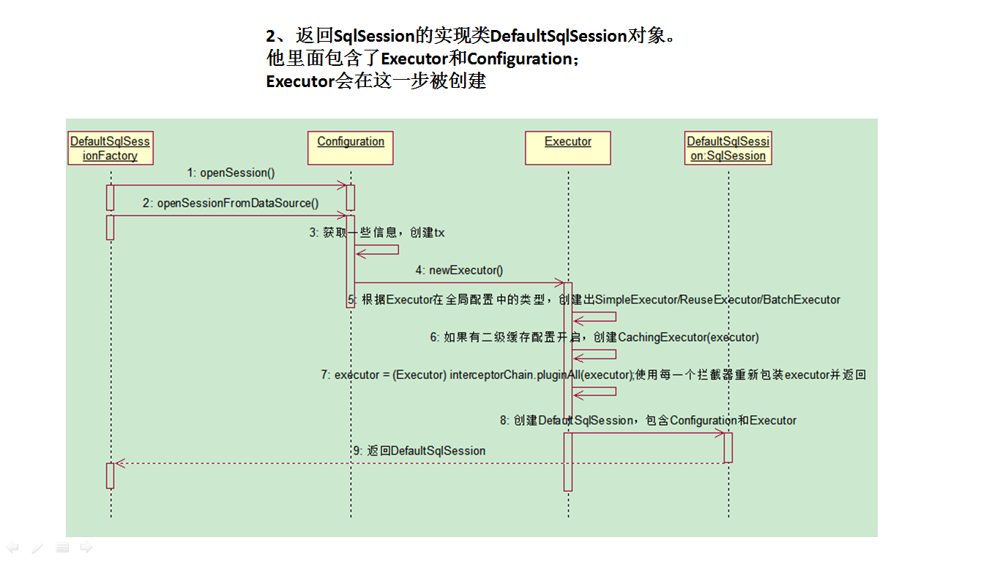
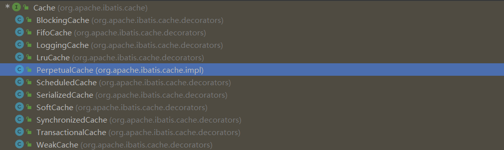

# Mybatis


## 简介

​		MyBatis 是一款优秀的持久层框架，它支持==自定义 SQL、存储过程以及高级映射==。MyBatis 免除了几乎所有的==JDBC 代码以及设置参数和获取结果集==的工作。MyBatis 可以通过简单的 XML 或注解来配置和映射原始类型、接口和 POJO 为数据库中的记录。

```xml
<!-- https://mvnrepository.com/artifact/org.mybatis/mybatis -->
<dependency>
    <groupId>org.mybatis</groupId>
    <artifactId>mybatis</artifactId>
    <version>3.5.13</version>
</dependency>
```

#### 1、特性

- MyBatis 是支持定制化 SQL、存储过程以及高级映射的优秀的持久层框架
- MyBatis 避免了几乎所有的 JDBC 代码和手动设置参数以及获取结果集
- MyBatis可以使用简单的XML或注解用于配置和原始映射，将接口和Java的POJO映射成数据库中的记录
- MyBatis 是一个 半自动的ORM（Object Relation Mapping）框架

#### 2、和其它持久化层技术对比 

##### 2.1 JDBC

​		SQL 夹杂在Java代码中耦合度高，导致硬编码内伤维护不易且实际开发需求中 SQL 有变化，频繁修改的情况多见代码冗长，开发效率低 

##### 2.2 Hibernate 和 JPA

​		操作简便，开发效率高 程序中的长难复杂 SQL 需要绕过框架 内部自动生产的 SQL，不容易做特殊优化 基于全映射的全自动框架，大量字段的 POJO 进行部分映射时比较困难。 反射操作太多，导致数据库性能下降。

##### 2.3 MyBatis

​		轻量级，性能出色 SQL 和 Java 编码分开，功能边界清晰。Java代码专注业务、SQL语句专注数据开发效率稍逊于HIbernate，但是完全能够接受。

#### 3、简单配置

##### 3.1 SqlSession配置文件

​		每个基于 MyBatis 的应用都是以一个`SqlSessionFactory` 的实例为核心的。`SqlSessionFactoryBuilder`通过 XML 配置文件或注解+配置类来构建出 SqlSessionFactory 实例。XML 配置文件建议使用类路径下的资源文件进行配置。 MyBatis 包含一个名叫 Resources 的工具类，它包含一些实用方法，使得从类路径或其它位置加载资源文件更加容易。

​		SqlSessionFactory，顾名思义，我们可以从中获得`SqlSession`的实例。SqlSession 提供了在数据库执行 SQL 命令所需的所有方法。你可以通过 SqlSession 实例来直接执行已映射的 SQL 语句。sqlSession代表和**数据库**的一次**会话**，用完必须关闭。SqlSession本质上相当于Connection，也是线程不安全，所以每次都需要获取新对象。

```java
@Test
public void test() throws IOException {
    //以类路径为相对位置
    String resource = "mybatisConfig.xml";
    InputStream inputStream = Resources.getResourceAsStream(resource);
    SqlSessionFactory sessionFactory = new SqlSessionFactoryBuilder().build(inputStream);
    // 带上true会默认自动提交，不带参数或false不会自动提交
    SqlSession sqlSession = sessionFactory.openSession(true);
    Connection connection = sqlSession.getConnection();
    System.out.println(connection);
}
```

###### 3.1.1 XML配置

​		xml配置文件中包含了对 MyBatis 系统的核心设置，包括获取数据库连接实例的数据源（DataSource）以及决定事务作用域和控制方式的事务管理器（TransactionManager）。下面的示例仅罗列了最关键的部分：

```xml
<?xml version="1.0" encoding="UTF-8" ?>
// 验证 XML 文档的正确性
<!DOCTYPE configuration
                    PUBLIC "-//mybatis.org//DTD Config 3.0//EN"
                    "http://mybatis.org/dtd/mybatis-3-config.dtd">
<configuration>
    <properties resource="jdbc.properties"></properties>
    
    <environments default="development">
        <environment id="development">
            <transactionManager type="JDBC"/>
            <dataSource type="POOLED">
            <property name="driver" value="${driver}"/>
            <property name="url" value="${url}"/>
            <property name="username" value="${username}"/>
            <property name="password" value="${password}"/>
        </dataSource>
    </environment>
    </environments>
    <mappers>
    	<mapper resource="org/mybatis/example/BlogMapper.xml"/>
    </mappers>
</configuration>
```

```properties
jdbc.url=jdbc:mysql://81.68.255.125:3306/mybatis_demo?characterEncoding=utf-8
jdbc.username=root
jdbc.password=abc123
jdbc.driverName=com.mysql.cj.jdbc.Driver
```

###### 3.1.2 java代码配置

​		MyBatis 提供了完整的配置类，提供了所有与 XML 文件等价的配置项：

```java
public void test2() throws Exception {
    Properties properties = new Properties();
    // properties属性名和createDataSource默认参数名一致
    InputStream inputStream = Resources.getResourceAsStream("jdbc.properties");
    properties.load(inputStream);
    DataSource dataSource = DruidDataSourceFactory.createDataSource(properties);
    TransactionFactory transactionFactory = new JdbcTransactionFactory();
    Environment environment = new Environment("development", transactionFactory, dataSource);
    Configuration configuration = new Configuration(environment);
    SqlSessionFactory sqlSessionFactory = new SqlSessionFactoryBuilder().build(configuration);
    SqlSession sqlSession = sqlSessionFactory.openSession();
    System.out.println(sqlSession.getConnection());
}
```

###### 3.1.3 作用域和生命周期

​		依赖注入框架可以创建线程安全的、基于事务的 SqlSession 和映射器，并将它们直接注入到你的 bean 中，因此可以直接忽略它们的生命周期。比如 MyBatis-Spring 整合框架。

​		`SqlSessionFactoryBuilder`：一旦创建了 SqlSessionFactory，就不再需要它了。 因此 SqlSessionFactoryBuilder 实例的最佳作用域是**方法作用域**（也就是局部方法变量）。 你可以重用 SqlSessionFactoryBuilder 来创建多个 SqlSessionFactory 实例。

​		`SqlSessionFactory`：一旦被创建就应该在应用的运行期间**一直存在**，没有任何理由丢弃它或重新创建另一个实例。 因此 SqlSessionFactory 的最佳作用域是应用作用域。 有很多方法可以做到，最简单的就是使用单例模式或者静态单例模式。

​		`SqlSession`：不是线程安全的，所以每个线程都应该有它自己的 SqlSession 实例。所以它的最佳的作用域是**请求或方法作用域**。 绝不能将 SqlSession 实例的引用放在任何类型的托管作用域中，比如 Servlet 框架中的 HttpSession。 如果你现在正在使用一种 Web 框架，考虑将 SqlSession 放在一个和 HTTP 请求相似的作用域中。 换句话说，每次收到 HTTP 请求，就可以打开一个 SqlSession，返回一个响应后，就关闭它。 这个关闭操作很重要，为了确保每次都能执行关闭操作，你应该把这个关闭操作放到 finally 块中。 

​		`映射器实例`：映射器接口的实例是从 SqlSession 中获取的代理类。该实例应该在调用它的方法中被获取，使用完毕之后即可丢弃。 因此，最好将映射器放在**方法作用域内**。

##### 3.2 Sql语句映射配置文件

​		MyBatis中可以面向接口操作数据，要保证两个一致：①mapper接口的全类名和映射文件的命名空间（namespace）保持一致 ②mapper接口中方法的方法名和映射文件中编写SQL的标签的id属性保持一致。

```xml
<?xml version="1.0" encoding="UTF-8" ?>
<!DOCTYPE mapper
              PUBLIC "-//mybatis.org//DTD Mapper 3.0//EN"
              "http://mybatis.org/dtd/mybatis-3-mapper.dtd">
<!--namespace:命名空间指定为接口全类名 id:sql唯一标识符指定为方法名 组合使用完成接口调用-->
<mapper namespace="com.xmj.UserDao">
    <select id="selectUser" resultType="User">
        select * from t_user where id = #{id}
    </select>
</mapper>
```

```java
Blog blog = (Blog) session.selectOne("com.xmj.UserDao.selectOne", 101);
//或接口式编程，推荐
UserDao userDao = session.getMapper(UserDao.class);
User user = userDao.selectUser(101);
```

##### 3.3 log4j2日志

引入依赖

```xml
<!--log4j2的依赖-->
<dependency>
    <groupId>org.apache.logging.log4j</groupId>
    <artifactId>log4j-core</artifactId>
    <version>2.19.0</version>
</dependency>
<dependency>
    <groupId>org.apache.logging.log4j</groupId>
    <artifactId>log4j-slf4j2-impl</artifactId>
    <version>2.19.0</version>
</dependency>
```

配置文件

```xml
<?xml version="1.0" encoding="UTF-8"?>
<configuration>
    <loggers>
        <root level="DEBUG">
            <appender-ref ref="console"/>
        </root>
        <logger name="java.sql" level="DEBUG"></logger>
        <logger name="org.apache.ibatis" level="INFO"></logger>
    </loggers>
    
    <appenders>
        <!--输出日志信息到控制台-->
        <console name="console" target="SYSTEM_OUT">
            <!--控制日志输出的格式-->
            <PatternLayout pattern="%d{yyyy-MM-dd HH:mm:ss SSS} [%t] %-3level %logger{1024} - %msg%n"/>
        </console>
    </appenders>
</configuration>
```

```xml
<!--
	在mybatis-config.xml中配置在settings中添加setting
-->
<settings>  
        <setting name="logImpl" value="LOG4J2" />  
</settings>
```

#### 4、简单源码分析





**总结：**


- `SqlSessionFactoryBulider`根据配置文件（全局，sql映射）初始化出`Configuration`对象。创建一个`DefaultSqlSession`对象，包含`Configuration`以及`Executor`（根据全局配置的defaultExecutorType创建对应Executor）
- `DefaultSqlSession.getMapper()`：拿到Mapper接口对应的`MapperProxy`，并将**自己**包装到`MapperProxy`里面。
- 执行增删改查方法：
  - 调用`DefaultSqlSession`的增删改查，（`Executor->SimpleExecutor#doQuery`）；
  - 会创建一个`StatementHandler`对象。同时也会创建出`ParameterHandler`和`ResultSetHandler`
  - 调用`StatementHandler`预编译参数以及设置参数值，使用`ParameterHandler`来给sql设置参数
  - 调用`StatementHandler`的增删改查方法；
  - `ResultSetHandler`封装结果


## 全局配置文件

​		MyBatis 的配置文件包含了会深深影响 MyBatis 行为的设置和属性信息。 配置文档的顶层结构如下：

- [properties（属性）](#properties)
- [settings（设置）](#settings)
- [typeAliases（类型别名）](#typeAliases)
- [typeHandlers（类型处理器）](#typeHandlers)
- [objectFactory（对象工厂）](#objectFactory)
- [plugins（插件）](#plugins)
- [environments（环境配置）](#environments)
  - environment（环境变量）
    - transactionManager（事务管理器）
    - dataSource（数据源）
- [databaseIdProvider（数据库厂商标识）](#databaseIdProvider)
- [mappers（映射器）](#mappers)

#### 1、properties

##### 1.1 引入properties文件

​		<span id="properties">这</span>些属性可以在外部进行配置，并可以进行动态替换。你既可以在典型的 Java 属性文件中配置这些属性，也可以在 properties 元素的子元素中设置。参数可以通过`${}`**动态赋值**：

```xml
<!--
    resource：用来指定类路径下的资源文件
    url：用来指定网络路径或磁盘路径下资源文件
-->
<properties resource="jdbc.properties" url="">
    <property name="mysql.username" value="dev_user"/>
    <property name="mysql.password" value="F2Fa3!33TYyg"/>
</properties>

<dataSource type="POOLED">
    <property name="driver" value="${driver}"/>
    <property name="url" value="${url}"/>
    <property name="username" value="${username}"/>
    <property name="password" value="${password}"/>
</dataSource>
```

​		这个例子中的 username 和 password 将会由 properties 元素中设置的相应值来替换。 driver 和 url 属性将会由 config.properties 文件中对应的值来替换。这样就为配置提供了诸多灵活选择。也可以在 SqlSessionFactoryBuilder.build() 方法中传入属性值。例如：

```java
SqlSessionFactory factory = new SqlSessionFactoryBuilder().build(reader, props);
// ... 或者 ...
SqlSessionFactory factory = new SqlSessionFactoryBuilder().build(reader, environment, props);
```

##### 1.2 加载顺序

​		如果一个属性在不只一个地方进行了配置，那么，MyBatis 将按照下面的顺序来加载：

（1）首先读取在 properties 元素体内指定的属性`<property>`。

（2）然后根据 properties 元素中的 resource 或 url 属性指定的路径读取属性文件，并覆盖之前读取过的同名属性。

（3）最后读取作为方法参数传递的属性，并覆盖之前读取过的同名属性。

> **note：顺序总结**
>
> ​		因此，通过方法参数传递的属性具有最高优先级，resource/url 属性中指定的配置文件次之，最低优先级的则是 properties 元素中指定的属性。

##### 1.3 默认值

​		从 MyBatis 3.4.2 开始，可以为占位符指定一个默认值。这一属性默认是关闭的，需要添加一个特定的属性来开启这个特性：

```xml
<dataSource type="POOLED">
	<!-- 如果属性 'username' 没有被配置，'username' 属性的值将为 'ut_user' -->
	<property name="username" value="${username:ut_user}"/>
	<!-- 启用默认值特性 -->
	<property name="org.apache.ibatis.parsing.PropertyParser.enable-default-value" value="true"/> 
</dataSource>
```

> **note：注意使用三元或自己的属性名包含':'，为避免冲突需要修改分隔符**
>
> ```xml
> <properties resource="org/mybatis/example/config.properties">
> 	<!-- 修改默认值的分隔符 -->
> 	<property name="org.apache.ibatis.parsing.PropertyParser.default-value-separator" value="?:"/>
> </properties>
> <dataSource type="POOLED">
> 	<!-- 使用自定义分隔符 -->
> 	<property name="username" value="${db:username?:ut_user}"/>
> </dataSource>
> ```

#### 2、settings

​		<span id="settings">这</span>是 MyBatis 中极为重要的调整设置，它们会改变 MyBatis 的运行时行为。 下表描述了设置中各项设置的含义、默认值等：

| 设置名                             | 描述                                                         | 有效值                                                       | 默认值                                                |
| :--------------------------------- | :----------------------------------------------------------- | :----------------------------------------------------------- | :---------------------------------------------------- |
| **cacheEnabled**                   | 二级缓存开关，全局性地开启或关闭所有映射器配置文件中已配置的任何缓存。 | true \| false                                                | true                                                  |
| **lazyLoadingEnabled**             | 延迟加载的全局开关。当开启时，所有关联对象都会延迟加载。 特定关联关系中可通过设置 `fetchType` 属性来覆盖该项的开关状态。 | true \| false                                                | false                                                 |
| **aggressiveLazyLoading**          | 开启时，任一方法的调用都会加载该对象的所有延迟加载属性。 否则，每个延迟加载属性会按需加载（参考 `lazyLoadTriggerMethods`)。 | true \| false                                                | false （在 3.4.1 及之前的版本中默认为 true）          |
| multipleResultSetsEnabled          | 是否允许单个语句返回多结果集（需要数据库驱动支持）。         | true \| false                                                | true                                                  |
| **useColumnLabel**                 | 使用列标签代替列名。实际表现依赖于数据库驱动，具体可参考数据库驱动的相关文档，或通过对比测试来观察。 | true \| false                                                | true                                                  |
| useGeneratedKeys                   | 允许 JDBC 支持自动生成主键，需要数据库驱动支持。如果设置为 true，将强制使用自动生成主键。尽管一些数据库驱动不支持此特性，但仍可正常工作（如 Derby）。 | true \| false                                                | False                                                 |
| **autoMappingBehavior**            | 指定是否开启自动映射功能，**要求字段名与属性名一致**。 NONE 表示关闭自动映射；PARTIAL 只会自动映射没有定义嵌套结果映射的字段。 FULL 会自动映射任何复杂的结果集（无论是否嵌套）。 | NONE, PARTIAL, FULL                                          | PARTIAL                                               |
| autoMappingUnknownColumnBehavior   | 指定发现自动映射目标未知列（或未知属性类型）的行为。`NONE`: 不做任何反应`WARNING`: 输出警告日志（`'org.apache.ibatis.session.AutoMappingUnknownColumnBehavior'` 的日志等级必须设置为 `WARN`）`FAILING`: 映射失败 (抛出 `SqlSessionException`) | NONE, WARNING, FAILING                                       | NONE                                                  |
| **defaultExecutorType**            | 配置默认的执行器。`SIMPLE`就是普通的执行器；`REUSE`执行器会重用预处理语句（PreparedStatement）；`BATCH`执行器不仅重用语句还会执行批量更新。 | SIMPLE REUSE BATCH                                           | SIMPLE                                                |
| defaultStatementTimeout            | 设置超时时间，它决定数据库驱动等待数据库响应的秒数。         | 任意正整数                                                   | 未设置 (null)                                         |
| defaultFetchSize                   | 为驱动的结果集获取数量（fetchSize）设置一个建议值。此参数只可以在查询设置中被覆盖。 | 任意正整数                                                   | 未设置 (null)                                         |
| defaultResultSetType               | 指定语句默认的滚动策略。（新增于 3.5.2）                     | FORWARD_ONLY \| SCROLL_SENSITIVE \| SCROLL_INSENSITIVE \| DEFAULT（等同于未设置） | 未设置 (null)                                         |
| safeRowBoundsEnabled               | 是否允许在嵌套语句中使用分页（RowBounds）。如果允许使用则设置为 false。 | true \| false                                                | False                                                 |
| safeResultHandlerEnabled           | 是否允许在嵌套语句中使用结果处理器（ResultHandler）。如果允许使用则设置为 false。 | true \| false                                                | True                                                  |
| **mapUnderscoreToCamelCase**       | 是否开启驼峰命名自动映射，即从经典数据库列名 A_COLUMN 映射到经典 Java 属性名 aColumn。 | true \| false                                                | False                                                 |
| **localCacheScope**                | 本地缓存作用域，`SqlSession`作用域为每个 SqlSession。意味着在同一个 SqlSession 中，执行相同的`SQL`语句时，首次会去查询数据库，并写入缓存中，下次会直接从缓存中取。当执行增删改操作，或关闭、提交 SqlSession 时，一级缓存才会被清空。`STATEMENT`用来设置一级缓存的作用域为每个 SQL 语句。意味着每次执行任意`SQL`语句，一级缓存就会被清空，相当于禁用了一级缓存。 | SESSION \| STATEMENT                                         | SESSION                                               |
| **jdbcTypeForNull**                | 空值时默认的`JDBC`常量类型。 多数数据库直接用一般类型，比如`NULL`（mysql和oracle都支持）、`VARCHAR`或 `OTHER`（Oracle不支持）。 | JdbcType 常量，常用值：NULL、VARCHAR 或 OTHER。              | OTHER                                                 |
| lazyLoadTriggerMethods             | 指定对象的哪些方法触发一次延迟加载。                         | 用逗号分隔的方法列表。                                       | equals,clone,hashCode,toString                        |
| defaultScriptingLanguage           | 指定动态 SQL 生成使用的默认脚本语言。                        | 一个类型别名或全限定类名。                                   | org.apache.ibatis.scripting.xmltags.XMLLanguageDriver |
| defaultEnumTypeHandler             | 指定 Enum 使用的默认 `TypeHandler` 。（新增于 3.4.5）        | 一个类型别名或全限定类名。                                   | org.apache.ibatis.type.EnumTypeHandler                |
| callSettersOnNulls                 | 指定当结果集中值为 null 的时候是否调用映射对象的 setter（map 对象时为 put）方法，这在依赖于 Map.keySet() 或 null 值进行初始化时比较有用。注意基本类型（int、boolean 等）是不能设置成 null 的。 | true \| false                                                | false                                                 |
| returnInstanceForEmptyRow          | 当返回行的所有列都是空时，MyBatis默认返回 `null`。 当开启这个设置时，MyBatis会返回一个空实例。 请注意，它也适用于嵌套的结果集（如集合或关联）。（新增于 3.4.2） | true \| false                                                | false                                                 |
| logPrefix                          | 指定 MyBatis 增加到日志名称的前缀。                          | 任何字符串                                                   | 未设置                                                |
| **logImpl**                        | 指定 MyBatis 所用日志的具体实现，未指定时将自动查找。        | SLF4J \| LOG4J（3.5.9 起废弃） \| LOG4J2 \| JDK_LOGGING \| COMMONS_LOGGING \| STDOUT_LOGGING \| NO_LOGGING | 未设置                                                |
| proxyFactory                       | 指定 Mybatis 创建可延迟加载对象所用到的代理工具。            | CGLIB （3.5.10 起废弃） \| JAVASSIST                         | JAVASSIST （MyBatis 3.3 以上）                        |
| vfsImpl                            | 指定 VFS 的实现                                              | 自定义 VFS 的实现的类全限定名，以逗号分隔。                  | 未设置                                                |
| useActualParamName                 | 允许使用方法签名中的名称作为语句参数名称。 为了使用该特性，你的项目必须采用 Java 8 编译，并且加上 `-parameters` 选项。（新增于 3.4.1） | true \| false                                                | true                                                  |
| configurationFactory               | 指定一个提供 `Configuration` 实例的类。 这个被返回的 Configuration 实例用来加载被反序列化对象的延迟加载属性值。 这个类必须包含一个签名为`static Configuration getConfiguration()` 的方法。（新增于 3.2.3） | 一个类型别名或完全限定类名。                                 | 未设置                                                |
| shrinkWhitespacesInSql             | 从SQL中删除多余的空格字符。请注意，这也会影响SQL中的文字字符串。 (新增于 3.5.5) | true \| false                                                | false                                                 |
| defaultSqlProviderType             | 指定一个拥有 provider 方法的 sql provider 类 （新增于 3.5.6）. 这个类适用于指定 sql provider 注解上的`type`（或 `value`） 属性（当这些属性在注解中被忽略时）。 (e.g. `@SelectProvider`) | 类型别名或者全限定名                                         | 未设置                                                |
| nullableOnForEach                  | 为 'foreach' 标签的 'nullable' 属性指定默认值。（新增于 3.5.9） | true \| false                                                | false                                                 |
| argNameBasedConstructorAutoMapping | 当应用构造器自动映射时，参数名称被用来搜索要映射的列，而不再依赖列的顺序。（新增于 3.5.10） |                                                              |                                                       |

一般常用的设置选项：驼峰命名、延迟加载：

```xml
<settings>
    <!--将表中字段的下划线自动转换为驼峰-->
    <setting name="mapUnderscoreToCamelCase" value="true"/>
    <!--开启延迟加载-->
    <setting name="lazyLoadingEnabled" value="true"/>
</settings>
```

#### 3、typeAliases

##### 3.1 别名配置

​		类型别名可为 Java 类型设置一个缩写名字，降低冗余的全限定类名书写，但还是**推荐**使用全类名。Xml中可以通过`typeAlias`和`package`来针对单个或包名完成别名定义：

```xml
<typeAliases>
    <!--
        typeAlias：设置某个具体的类型的别名属性：
            -> type：需要设置别名的类型的全类名
            -> alias：设置此类型的别名，若不设置此属性，该类型拥有默认的别名，即类名且大小写不敏感
    -->
    <typeAlias alias="Author" type="domain.blog.Author"/>
    <typeAlias alias="Blog" type="domain.blog.Blog"/>
    <typeAlias alias="Comment" type="domain.blog.Comment"/>
    <typeAlias alias="Post" type="domain.blog.Post"/>
    <typeAlias alias="Section" type="domain.blog.Section"/>
    <typeAlias alias="Tag" type="domain.blog.Tag"/>
    
    <!--以包为单位，设置改包下所有的类型都拥有默认的别名，即类名且不区分大小写-->
    <package name="com.xmj.entity"/>
</typeAliases>

```

> **note：批量别名冲突**
>
> ​		若子包中存在同名类，则可以通过`@Aliase`来设置自定义别名，否则会运行报错：
>
> ```java
> @Documented
> @Retention(RetentionPolicy.RUNTIME)
> @Target(ElementType.TYPE)
> public @interface Alias {
>   String value();
> }
> 
> @Alias("user_demo")
> public class User {
> }
> ```

##### 3.2 内建别名

​		下面是常见的内建的类型别名，**不区分大小写**，注意，为了应对原始类型的命名重复，采取了特殊的命名风格。

| 别名                                                         | 映射的类型                                                   |
| :----------------------------------------------------------- | :----------------------------------------------------------- |
| \_byte、\_long、\_short、_int、\_integer<br/>\_double、\_float<br />\_char (since 3.5.10)、\_character (since 3.5.10) | byte、long、short、int、int、double、float<br />char、char   |
| string、byte、long、short、int<br />integer、double、float、biginteger、<br />char (since 3.5.10)、character (since 3.5.10) | String、Byte、Long、Short、Integer、Integer<br />、Double、Float、BigInteger、Character、Character |
| map、hashmap、list、arraylist、collection、iterator          | Map、HashMap、List、ArrayList、Collection、Iterator          |
| date、date[]                                                 | Date、Date[]                                                 |
| decimal、bigdecimal、decimal[]、bigdecimal[]                 | BigDecimal、decimal[]                                        |
| object、object[]、boolean                                    | Object、Object[]、Boolean                                    |

#### 4、TypeHandler(类型处理器)

​		<span id="typeHandlers">M</span>yBatis 在设置预处理语句（PreparedStatement）中的参数或从`ResultSet`结果集中取出一个值时， 都会用`TypeHandler`类型处理器将获取到的值以合适的方式转换成 Java 类型。MyBatis 通过内置的 `jdbcType` **枚举类型**支持下面的 JDBC 类型：

```java
JDBC Type                Java Type  
01 CHAR                    String  
02 VARCHAR                 String  
03 LONGVARCHAR             String  
04 NUMERIC                 java.math.BigDecimal  
05 DECIMAL                 java.math.BigDecimal  
06 BIT                     boolean  
07 BOOLEAN                 boolean  
08 TINYINT                 byte  
09 SMALLINT                short  
10 INTEGER                 INTEGER  
11 BIGINT                  long  
12 REAL                    float  
13 FLOAT                   double  
14 DOUBLE                  double  
15 BINARY                  byte[]  
16 VARBINARY               byte[]  
17 LONGVARBINARY           byte[]  
18 DATE                    java.sql.Date  
19 TIME                    java.sql.Time  
20 TIMESTAMP               java.sql.Timestamp  
21 CLOB                    Clob  
22 BLOB                    Blob  
23 ARRAY                   Array  
24 DISTINCT                mapping of underlying type  
25 STRUCT                  Struct  
26 REF                     Ref  
27 DATALINK                java.net.URL[color=red][/color] 
28 NULL/OTHER              null
29 NCHAR/NVARCHAR/NCLOB    String
```

##### 4.1 默认类型处理器

| 类型处理器                   | Java 类型                       | JDBC 类型                                                    |
| :--------------------------- | :------------------------------ | :----------------------------------------------------------- |
| `BooleanTypeHandler`         | `java.lang.Boolean`, `boolean`  | 数据库兼容的 `BOOLEAN`                                       |
| `ByteTypeHandler`            | `java.lang.Byte`, `byte`        | 数据库兼容的 `NUMERIC` 或 `BYTE`                             |
| `ShortTypeHandler`           | `java.lang.Short`, `short`      | 数据库兼容的 `NUMERIC` 或 `SMALLINT`                         |
| `IntegerTypeHandler`         | `java.lang.Integer`, `int`      | 数据库兼容的 `NUMERIC` 或 `INTEGER`                          |
| `LongTypeHandler`            | `java.lang.Long`, `long`        | 数据库兼容的 `NUMERIC` 或 `BIGINT`                           |
| `FloatTypeHandler`           | `java.lang.Float`, `float`      | 数据库兼容的 `NUMERIC` 或 `FLOAT`                            |
| `DoubleTypeHandler`          | `java.lang.Double`, `double`    | 数据库兼容的 `NUMERIC` 或 `DOUBLE`                           |
| `BigDecimalTypeHandler`      | `java.math.BigDecimal`          | 数据库兼容的 `NUMERIC` 或 `DECIMAL`                          |
| `StringTypeHandler`          | `java.lang.String`              | `CHAR`, `VARCHAR`                                            |
| `ClobReaderTypeHandler`      | `java.io.Reader`                | -                                                            |
| `ClobTypeHandler`            | `java.lang.String`              | `CLOB`, `LONGVARCHAR`                                        |
| `NStringTypeHandler`         | `java.lang.String`              | `NVARCHAR`, `NCHAR`                                          |
| `NClobTypeHandler`           | `java.lang.String`              | `NCLOB`                                                      |
| `BlobInputStreamTypeHandler` | `java.io.InputStream`           | -                                                            |
| `ByteArrayTypeHandler`       | `byte[]`                        | 数据库兼容的字节流类型                                       |
| `BlobTypeHandler`            | `byte[]`                        | `BLOB`, `LONGVARBINARY`                                      |
| `DateTypeHandler`            | `java.util.Date`                | `TIMESTAMP`                                                  |
| `DateOnlyTypeHandler`        | `java.util.Date`                | `DATE`                                                       |
| `TimeOnlyTypeHandler`        | `java.util.Date`                | `TIME`                                                       |
| `SqlTimestampTypeHandler`    | `java.sql.Timestamp`            | `TIMESTAMP`                                                  |
| `SqlDateTypeHandler`         | `java.sql.Date`                 | `DATE`                                                       |
| `SqlTimeTypeHandler`         | `java.sql.Time`                 | `TIME`                                                       |
| `ObjectTypeHandler`          | Any                             | `OTHER` 或未指定类型                                         |
| `EnumTypeHandler`            | Enumeration Type                | VARCHAR 或任何兼容的字符串类型，用来存储枚举的名称（而不是索引序数值） |
| `EnumOrdinalTypeHandler`     | Enumeration Type                | 任何兼容的 `NUMERIC` 或 `DOUBLE` 类型，用来存储枚举的序数值（而不是名称）。 |
| `SqlxmlTypeHandler`          | `java.lang.String`              | `SQLXML`                                                     |
| `InstantTypeHandler`         | `java.time.Instant`             | `TIMESTAMP`                                                  |
| `LocalDateTimeTypeHandler`   | `java.time.LocalDateTime`       | `TIMESTAMP`                                                  |
| `LocalDateTypeHandler`       | `java.time.LocalDate`           | `DATE`                                                       |
| `LocalTimeTypeHandler`       | `java.time.LocalTime`           | `TIME`                                                       |
| `OffsetDateTimeTypeHandler`  | `java.time.OffsetDateTime`      | `TIMESTAMP`                                                  |
| `OffsetTimeTypeHandler`      | `java.time.OffsetTime`          | `TIME`                                                       |
| `ZonedDateTimeTypeHandler`   | `java.time.ZonedDateTime`       | `TIMESTAMP`                                                  |
| `YearTypeHandler`            | `java.time.Year`                | `INTEGER`                                                    |
| `MonthTypeHandler`           | `java.time.Month`               | `INTEGER`                                                    |
| `YearMonthTypeHandler`       | `java.time.YearMonth`           | `VARCHAR` 或 `LONGVARCHAR`                                   |
| `JapaneseDateTypeHandler`    | `java.time.chrono.JapaneseDate` | `DATE`                                                       |

##### 4.2 日期类型的处理

​		日期和时间的处理， JDK1.8以前通常使用JSR310规范领导者Stephen Colebourne创建的`Joda-Time`来操作。 1.8已经实现全部的`JSR310`规范了。日期时间处理上，可以使用MyBatis基于JSR310（ Date and Time API）编写的各种日期时间类型处理器。`MyBatis3.4`之后的版本都是==自动注册==，以前的版本需要我们手动注册这些处理器：

```xml
<!--手动注册如下-->
<typeHandlers>
    <typeHandler handler="org.apache.ibatis.type.InstantTypeHandler" />
    <typeHandler handler="...LocalDateTimeTypeHandler" />
    <typeHandler handler="...LocalDateTypeHandler" />
    <typeHandler handler="...LocalTimeTypeHandler" />
    <typeHandler handler="...OffsetDateTimeTypeHandler" />
    <typeHandler handler="...OffsetTimeTypeHandler" />
    <typeHandler handler="...ZonedDateTimeTypeHandler" />
    <typeHandler handler="...YearTypeHandler" />
    <typeHandler handler="...MonthTypeHandler" />
    <typeHandler handler="...YearMonthTypeHandler" />
    <typeHandler handler="...JapaneseDateTypeHandler" />
</typeHandlers>
```

##### 4.3 自定义类型处理器

​		可以重写已有的类型处理器或创建自己的类型处理器来处理不支持类型。实现 `org.apache.ibatis.type.TypeHandler` 接口， 或继承一个很便利的类 `org.apache.ibatis.type.BaseTypeHandler`， 并且可以（可选地）将它映射到一个 JDBC 类型。

​		下面自定义的处理器将覆盖原本处理 String <=> VARCHAR 类型的类型处理器。注意 MyBatis 不会通过检测数据库元信息来决定使用哪种类型，所以必须在参数和结果映射中指明字段是 VARCHAR 类型， 以使其能够绑定到正确的类型处理器上。这是因为 MyBatis 直到语句被执行时才清楚数据类型。

（1）定位处理的Java类型：

- 通过类型处理器的**泛型**，MyBatis 可以得知该类型处理器处理的 Java 类型，会被后两种覆盖
- 处理类加上 `@MappedTypes` 注解指定与其关联的 Java 类型列表，会被后后一种覆盖
- 在类型处理器注册标签增加 `javaType` 属性（比如：`javaType="String"`）

（2）定位处理关联 JDBC 类型：

- 处理类加上`@MappedJdbcTypes` 注解指定与其关联的 JDBC 类型列表。 会被后一种覆盖
- 在类型处理器注册标签增加 `jdbcType` 属性（比如：`jdbcType="VARCHAR"`）

> **notes：总结**
>
> ​		类型匹配配置优先级顺序都是在注册标签中配置的优先级最高，但是如果是通过包扫描注册，那么只能通过**注解方式**来指定 `JDBC`的类型。		

```java
@MappedTypes(String.class)
@MappedJdbcTypes(JdbcType.VARCHAR)
public class ExampleTypeHandler extends BaseTypeHandler<String> {

    @Override
    public void setNonNullParameter(PreparedStatement ps, int i, String parameter, JdbcType jdbcType)...{
	    ps.setString(i, parameter);
    }

    @Override
    public String getNullableResult(ResultSet rs, String columnName) throws SQLException {
        return rs.getString(columnName);
    }

    @Override
    public String getNullableResult(ResultSet rs, int columnIndex) throws SQLException {
    	return rs.getString(columnIndex);
    }

    @Override
    public String getNullableResult(CallableStatement cs, int columnIndex) throws SQLException {
    	return cs.getString(columnIndex);
    }
}
```

```xml
<typeHandlers>
    <!--注册-->
    <typeHandler handler="org.mybatis.example.ExampleTypeHandler" javaType="java.lang.String" jdbcType="VARCHAR"/>
    
    <!--可以通过包扫描完成注册，但是只能通过注解方式来指定 JDBC 的类型-->
    <package name="org.mybatis.example"/>
</typeHandlers>
```

###### 4.3.1 includeNullJdbcType

​		当在 `ResultMap` 中决定使用哪种类型处理器时，此时 Java 类型是已知的（从结果类型中获得），但是 JDBC 类型是未知的。 因此 Mybatis 会根据 `javaType=[类型], jdbcType=null` 来选择一个类型处理器。 这意味着使用 `@MappedJdbcTypes` 注解可以限制类型处理器的作用范围，并且可以确保非显式设置，类型处理器在 `ResultMap` 中不会生效。 

​		如果希望能在 `ResultMap` 中隐式地使用类型处理器，那么设置 `@MappedJdbcTypes` 注解的 `includeNullJdbcType=true` 即可。 注意从 Mybatis 3.4.0 开始，如果某Java 类型只注册了**一个**类型处理器，即使没有`includeNullJdbcType=true`，该类型处理器也会是 `ResultMap` 使用 Java 类型时的默认处理器。

###### 4.3.2 枚举类型处理器

​		可以创建能够处理多个类的泛型类型处理器。为了使用泛型类型处理器， 需要将`类.class` 作为参数的构造器，这样 MyBatis 会在构造一个类型处理器实例的时候传入一个具体的类。比如：`EnumTypeHandler` 和 `EnumOrdinalTypeHandler` 

```java
//GenericTypeHandler.java
public class GenericTypeHandler<E extends MyObject> extends BaseTypeHandler<E> {

  private Class<E> type;

  public GenericTypeHandler(Class<E> type) {
    if (type == null) throw new IllegalArgumentException("Type argument cannot be null");
    this.type = type;
  }
  ...
```

​		使用映射枚举类型 `Enum`（比如：`RoundingMode`），有 `EnumTypeHandler` 或者 `EnumOrdinalTypeHandler` 两种选择。**默认**使用 `EnumTypeHandler` 来把 `Enum` 值转换成对应`name`，而`EnumOrdinalTypeHandler`则是转换为`Enmu`的索引值。和其它的处理器只针对某个特定的类不同的是，枚举类型处理器会处理任意继承了 `Enum` 的类。如果想要修改全局的枚举类型处理，则可通过如下配置：

```xml
<!-- mybatis-config.xml -->
<typeHandlers>
  	<typeHandler handler="org.apache.ibatis.type.EnumOrdinalTypeHandler" javaType="java.math.RoundingMode"/>
</typeHandlers>
```

#### 5、plugin

##### 5.1 四大对象


​		MyBatis 允许你在映射语句执行过程中的某一点进行拦截调用。`plugin`插件通过动态代理机制，可以拦截四大对象（**数据处理层**）的执行，因为四大对象(Executor、ParameterHandler、ResultSetHandler)每个创建的时候都有一个`interceptorChain.pluginAll(parameterHandler)`：

- `Executor` (update, query, flushStatements, commit, rollback, getTransaction, close, isClosed)，调用`StatementHandler`。
- `ParameterHandler` (getParameterObject, setParameters)，借助`TypeHandler`设置预编译参数。
- `ResultSetHandler` (handleResultSets, handleOutputParameters)，借助`TypeHandler`完成结果映射并获取。
- `StatementHandler` (prepare, parameterize, batch, update, query)，处理sql语句预编译，使用`ParameterHandler`设置预编译参数，使用`ResultSetHandler`处理结果。 

```java
// 四大对象创建的时候，都会调用插件的plugin方法来完成自定义插件包装。
// 会通过Plugin.wrap来检查该该对象是否在签名中，否则直接返回原对象
public Object pluginAll(Object target) {
    for (Interceptor interceptor : interceptors) {
    	target = interceptor.plugin(target);
    }
    return target;
}
```

##### 5.2 自定义插件

​		自定义插件首先实现`Interceptor`接口，使用`@Intercepts`指定拦截的方法签名，然后注册全局配置文件中：该插件将会拦截在 Executor 实例中所有的 “update” 方法调用。配置多个插件时，就会产生**多层代理**，按配置顺序设置参数和包装，然后倒叙执行`intercept`。

```java
@Intercepts({@Signature(
        type= Executor.class,//拦截的位置，即四大组件
        method = "update",  //组件中具体的方法
        args = {MappedStatement.class,Object.class})}//标识具体的update方法，因为有重载方法
)
public class ExamplePlugin implements Interceptor {
    private Properties properties = new Properties();

    // 通过Plugin.invoke完成调用
    @Override
    public Object intercept(Invocation invocation) throws Throwable {
        Object target = invocation.getTarget();
        System.out.println("当前拦截到的对象："+target);
        MetaObject metaObject = SystemMetaObject.forObject(target);
        Object value = metaObject.getValue("parameterHandler.parameterObject");
        System.out.println("sql语句中的参数是："+value);
        metaObject.setValue("parameterHandler.parameterObject", 3);
        // implement pre processing if need
        // 放行，执行目标方法
        Object returnObject = invocation.proceed();
        // implement post processing if need
        return returnObject;
    }
    // 包装目标对象：为目标对象创建一个代理对象
    // Mybatis提供了Plugin.wrap(target,intercepter)方法来完成包装
    @Override
    public Object plugin(Object target) {
        return Plugin.wrap(target, this);
    }
    
    @Override
    public void setProperties(Properties properties) {
        // 将插件注册时的property属性设置进来
        this.properties = properties;
    }
}
```

```xml
<!-- mybatis-config.xml 完成插件注册-->
<plugins>
    <plugin interceptor="org.mybatis.example.ExamplePlugin">
    	<property name="username" value="root"/>
    </plugin>
</plugins>
```

##### 5.3 PageHelper

​		[`PageHelper`](https://pagehelper.github.io/docs/howtouse/) 方法使用了静态的 `ThreadLocal` 参数，分页参数和线程是绑定的。只要保证在 `PageHelper` 方法调用后紧跟 MyBatis 查询方法，这就是安全的。因为 `PageHelper` 在 `finally` 代码段中自动清除了 `ThreadLocal` 存储的对象。如果代码在进入 `Executor` 前发生异常，就会导致线程不可用，这属于人为的 Bug（例如接口方法和 XML 中的不匹配，导致找不到 `MappedStatement` 时）， 这种情况由于线程不可用，也不会导致 `ThreadLocal` 参数被错误的使用。

​		但是当`PageHelper`生产了一个分页参数，但是没有被消费，这个参数就会一直保留在这个线程上。当这个线程再次被使用时，就可能导致不该分页的方法去消费这个分页参数，这就产生了莫名其妙的分页。比如下面这种：

```java
PageHelper.startPage(1, 10);
List<Country> list;
if(param1 != null){
    list = countryMapper.selectIf(param1);
} else {
    list = new ArrayList<Country>();
}
```

​		解决方法：

```java
List<Country> list;
if(param1 != null){
    PageHelper.startPage(1, 10);
    list = countryMapper.selectIf(param1);
} else {
    list = new ArrayList<Country>();
}

List<Country> list;
if(param1 != null){
    PageHelper.startPage(1, 10);
    try{
        list = countryMapper.selectAll();
    } finally {
        PageHelper.clearPage();
    }
} else {
    list = new ArrayList<Country>();
}
```

###### 5.3.1 配置方式

​		配置拦截器插件，特别注意，新版拦截器是 `com.github.pagehelper.PageInterceptor`。 `com.github.pagehelper.PageHelper` 现在是一个特殊的 `dialect` 实现类，是分页插件的默认实现类，也就是说它可以根据不同的数据库类型来生成不同的分页语句，提供了和以前相同的用法。引入依赖：

```xml
<dependency>
    <groupId>com.github.pagehelper</groupId>
    <artifactId>pagehelper</artifactId>
    <version>5.3.2</version>
</dependency>
```

- MyBatis 配置 xml 中配置拦截器插件

```xml
<plugins>
    <!-- com.github.pagehelper为PageHelper类所在包名 -->
    <plugin interceptor="com.github.pagehelper.PageInterceptor">
        <!-- 使用下面的方式配置参数，后面会有所有的参数介绍 -->
        <property name="param1" value="value1"/>
	</plugin>
</plugins>
```

- 在 Spring 配置文件中配置拦截器插件

```xml
<bean id="sqlSessionFactory" class="org.mybatis.spring.SqlSessionFactoryBean">
  <!-- 注意其他配置 -->
  <property name="plugins">
    <array>
      <bean class="com.github.pagehelper.PageInterceptor">
        <property name="properties">
          <!--使用下面的方式配置参数，一行配置一个 -->
          <value>params=value1</value>
        </property>
      </bean>
    </array>
  </property>
</bean>
```

###### 5.3.2 配置参数

分页插件可选参数如下：

- `dialect`：默认情况下会使用`PageHelper`方式进行分页，如果需要自定义分页逻辑，需实现 `Dialect`(`com.github.pagehelper.Dialect`) 接口，然后配置该属性为实现类的全类名。**当使用自定义逻辑时，下面的参数都将失效**

- `helperDialect`：分页插件会自动检测当前的数据库链接并选择分页方式。 也可以配置`helperDialect`属性来指定分页插件使用哪种方言：`oracle`,`mysql`,`mariadb`,`sqlite`,`hsqldb`,`postgresql`,`db2`,`sqlserver`,`informix`,`h2`,`sqlserver2012`,`derby`。也可以实现 `AbstractHelperDialect`，然后配置为实现类的全类名完成自定义。**特别注意：**使用 SqlServer2012 时，需要手动指定为 `sqlserver2012`，否则会使用 SqlServer2005 的方式进行分页。
- `offsetAsPageNum`：默认值为 `false`，该参数对使用 `RowBounds` 作为分页参数时有效。 当该参数设置为 `true` 时，会将 `RowBounds` 中的 `offset` 参数当成 `pageNum` 使用，可以用页码和页面大小两个参数进行分页。
- `rowBoundsWithCount`：默认值为`false`，该参数对使用 `RowBounds` 作为分页参数时有效。 当该参数设置为`true`时，使用 `RowBounds` 分页会进行 count 查询。
- **pageSizeZero**：默认值为 `false`，当该参数设置为 `true` 时，如果 `pageSize=0` 或者 `RowBounds.limit = 0` 就会查询出全部的结果（相当于没有执行分页查询，但是返回结果仍然是 `Page` 类型）。
- **reasonable**：分页合理化参数，默认值为`false`。当该参数设置为 `true` 时，`pageNum<=0` 时会查询第一页， `pageNum>pages`（超过总数时），会查询最后一页。默认`false` 时，直接根据参数进行查询。
- **params**：用来支持`startPage(Object params)`方法，从**对象中根据属性名**取值并配置参数映射， 可以配置 `pageNum,pageSize,count,pageSizeZero,reasonable`，默认值为`pageNum=pageNum;pageSize=pageSize;count=countSql;reasonable=reasonable;pageSizeZero=pageSizeZero`。
- **supportMethodsArguments**：支持通过 Mapper 接口参数来传递分页参数，默认值`false`，分页插件会从查询方法的参数值中，自动根据上面 `params` 配置的字段中取值，查找到合适的值时就会自动分页。 
- `autoRuntimeDialect`：默认值为 `false`。设置为 `true` 时，允许在运行时根据多数据源自动识别对应方言的分页 （不支持自动选择`sqlserver2012`，只能使用`sqlserver`）
- **closeConn**：默认值为 `true`。当使用运行时动态数据源或没有设置 `helperDialect` 属性自动获取数据库类型时，会自动获取一个数据库连接。通过该属性来设置是否关闭获取的这个连接，默认`true`关闭，设置为 `false` 后，不会关闭获取的连接，这个参数的设置要根据自己选择的数据源来决定。

###### 5.3.3 使用方法

​		除了 `PageHelper.startPage` 方法外，还提供了类似用法的 `PageHelper.offsetPage` 方法。在你需要进行分页的 MyBatis 查询方法前调用 `PageHelper.startPage` 静态方法即可，紧跟在这个方法后的第一个**MyBatis 查询方法**会被进行分页。

```java
//获取第1页，10条内容，默认查询总数count
PageHelper.startPage(1, 10);
//紧跟着的第一个select方法会被分页
List<Country> list = countryMapper.selectIf(1);
assertEquals(2, list.get(0).getId());
assertEquals(10, list.size());
//分页时，实际返回的结果list类型是Page<E>，如果想取出分页信息，需要强制转换为Page<E>
assertEquals(182, ((Page) list).getTotal());
```

​		使用`PageInfo`封装数据，可以获得更详细的分页数据：

```java
//获取第1页，10条内容，默认查询总数count
PageHelper.startPage(1, 10);
List<Country> list = countryMapper.selectAll();
//用PageInfo对结果进行包装
PageInfo page = new PageInfo(list);
//测试PageInfo全部属性
//PageInfo包含了非常全面的分页属性
assertEquals(1, page.getPageNum());
assertEquals(10, page.getPageSize());
assertEquals(1, page.getStartRow());
assertEquals(10, page.getEndRow());
assertEquals(183, page.getTotal());
assertEquals(19, page.getPages());
assertEquals(1, page.getFirstPage());
assertEquals(8, page.getLastPage());
assertEquals(true, page.isFirstPage());
assertEquals(false, page.isLastPage());
assertEquals(false, page.isHasPreviousPage());
assertEquals(true, page.isHasNextPage());
```

全部方法举例：

- 推荐方法：

```java
//第一种，RowBounds方式的调用
List<Country> list = sqlSession.selectList("x.y.selectIf", null, new RowBounds(0, 10));

//第二种，Mapper接口方式的调用，推荐这种使用方式。
PageHelper.startPage(1, 10);
List<Country> list = countryMapper.selectIf(1);

//第三种，Mapper接口方式的调用，推荐这种使用方式。
PageHelper.offsetPage(1, 10);
List<Country> list = countryMapper.selectIf(1);
```

- 需要设置supportMethodsArguments或params直接从方法参数获取值

```java
//第四种，参数方法调用
//存在以下 Mapper 接口方法，你不需要在 xml 处理后两个参数
public interface CountryMapper {
    List<Country> selectByPageNumSize(
            @Param("user") User user,
            @Param("pageNum") int pageNum,
            @Param("pageSize") int pageSize);
}
//配置supportMethodsArguments=true
//在代码中直接调用：
List<Country> list = countryMapper.selectByPageNumSize(user, 1, 10);

//第五种，参数对象
//如果 pageNum 和 pageSize 存在于 User 对象中，只要参数有值，也会被分页
//有如下 User 对象
public class User {
    //其他fields
    //下面两个参数名和 params 配置的名字一致
    private Integer pageNum;
    private Integer pageSize;
}
//存在以下 Mapper 接口方法，你不需要在 xml 处理后两个参数
public interface CountryMapper {
    List<Country> selectByPageNumSize(User user);
}
//当 user 中的 pageNum!= null && pageSize!= null 时，会自动分页
List<Country> list = countryMapper.selectByPageNumSize(user);
```

- 其他

```java
//第六种，ISelect 接口方式
//jdk6,7用法，创建接口
Page<Country> page = PageHelper.startPage(1, 10).doSelectPage(new ISelect() {
    @Override
    public void doSelect() {
        countryMapper.selectGroupBy();
    }
});
//jdk8 lambda用法
Page<Country> page = PageHelper.startPage(1, 10).doSelectPage(()-> countryMapper.selectGroupBy());

//也可以直接返回PageInfo，注意doSelectPageInfo方法和doSelectPage
pageInfo = PageHelper.startPage(1, 10).doSelectPageInfo(new ISelect() {
    @Override
    public void doSelect() {
        countryMapper.selectGroupBy();
    }
});
//对应的lambda用法
pageInfo = PageHelper.startPage(1, 10).doSelectPageInfo(() -> countryMapper.selectGroupBy());

//count查询，返回一个查询语句的count数
long total = PageHelper.count(new ISelect() {
    @Override
    public void doSelect() {
        countryMapper.selectLike(country);
    }
});
//lambda
total = PageHelper.count(()->countryMapper.selectLike(country));
```

#### 6、environments

> **notes：**与spring整合后，这一部分的配置将交由spring来管理，所以下面的配置了解就行

​		<span id="environments">在`environments`</span>中可以配置多种环境，比如开发、测试和生产环境需要有不同的配置。每种环境使用`environment`标签进行配置并需要指定其**唯一标识符**。Xml配置中environments标签中的`default`属性指定一个环境的id标识符来快速的切换环境。

```xml
<environments default="test">
    <environment id="test">
        <!--必须含有transactionManager、dataSource-->
        <transactionManager type="JDBC">
            <property name="..." value="..."/>
        </transactionManager>
        <dataSource type="POOLED">
            <property name="driver" value="${driver}"/>
            <property name="url" value="${url}"/>
            <property name="username" value="${username}"/>
            <property name="password" value="${password}"/>
        </dataSource>
    </environment>
    <environment id="development">
    	......
    </environment>
</environments>
```

​		每个数据库对应一个 SqlSessionFactory 实例，通过Java配置时，可以显示的将`environment`作为参数传递给 SqlSessionFactoryBuilder，如果不传，则默认使用`default`定义的环境：

```java
SqlSessionFactory factory = new SqlSessionFactoryBuilder().build(reader, environment);
SqlSessionFactory factory = new SqlSessionFactoryBuilder().build(reader, environment, properties);

SqlSessionFactory factory = new SqlSessionFactoryBuilder().build(reader);
SqlSessionFactory factory = new SqlSessionFactoryBuilder().build(reader, properties);
```

##### 6.1 transactionManager

###### 6.1.1 transactionManager

​		在 MyBatis 中有两种类型的事务管理器（也就是 type="[`JDBC`|`MANAGED`]"），其实都是`Configuration`类中的别名，分别对应`JdbcTransactionFactory`和`ManagedTransactionFactory`。

- `JDBC`：直接使用`JDBC`的提交和回滚功能，依赖从数据源获得的连接来管理事务作用域。默认为了与某些驱动程序兼容，在关闭连接时将启用自动提交。然而，对有些驱动来说，启用自动提交一个代价高昂的操作。从 3.5.10 版本开始，可以通过将`skipSetAutoCommitOnClose`属性设置为 true 来跳过这个步骤。例如：

  ```XML
  <transactionManager type="JDBC">
  	<property name="skipSetAutoCommitOnClose" value="true"/>
  </transactionManager>
  ```

- `MANAGED`：几乎不做什么，从不提交或回滚一个连接，而是让容器来管理事务的整个生命周期。 默认情况下它会关闭连接。然而一些容器并不希望连接被关闭，因此需要将 closeConnection 属性设置为 false 来阻止默认的关闭行为。例如:

  ```xml
  <transactionManager type="MANAGED">
      <property name="closeConnection" value="false"/>
  </transactionManager>
  ```

> **notes：与spring整合，不需要配置事务管理器**
>
> ​		如果使用`Spring`+`MyBatis` 进行整合，则不必配置事务管理器，因为 Spring 模块会使用自带的管理器来覆盖前面的配置。

###### 6.1.2 自定义事务管理器

​		实现`TransactionFactory`和`Transaction`接口，并在设置`type = `工厂实现类的全类名/别名，完全自定义事务处理。

```java
public interface TransactionFactory {
    // 传入xml文件配置信息
    default void setProperties(Properties props) { // 从 3.5.2 开始，该方法为默认方法
    	// 空实现
    }
    Transaction newTransaction(Connection conn);
    Transaction newTransaction(DataSource dataSource, TransactionIsolationLevel level, boolean autoCommit);
}
```

```java
public interface Transaction {
    Connection getConnection() throws SQLException;
    void commit() throws SQLException;
    void rollback() throws SQLException;
    void close() throws SQLException;
    Integer getTimeout() throws SQLException;
}
```

###### 6.1.2 dataSource 

​		dataSource 元素使用标准的 JDBC 数据源接口来配置 JDBC 连接对象的资源。大多数 MyBatis 应用程序会按示例中的例子来配置数据源。虽然数据源配置是可选的，但如果要启用==延迟加载==特性，就必须配置数据源。有三种内建的数据源类型（也就是 type="[`UNPOOLED`|`POOLED`|`JNDI`]"）：

（1）`UNPOOLED`：不使用连接池的数据源类型，优点是简单，缺点是速度慢。它适合对数据库连接可用性要求不高或者数据库本身不需要连接池的应用程序，它仅包含5种属性：

- `driver`、`url`、`username`、`password` 
- `defaultTransactionIsolationLevel`：默认的连接事务隔离级别
- `defaultNetworkTimeout`：等待数据库操作完成的默认网络超时时间（毫秒）
- `driver.encoding=UTF8`（可选项）只需在属性名加上“driver.”前缀，即可数据库驱动设定属性。DriverManager.getConnection(url, driverProperties) 方法将把 `UTF8` 的 `encoding` 属性给数据库驱动。

（2）`POOLED`：利用“池”的概念将 JDBC 连接对象组织起来，避免了创建新的连接实例时所必需的初始化和认证时间，使并发 Web 应用快速响应请求。除了上述提到 UNPOOLED 的属性外，还有更多属性用来配置 POOLED 的数据源：

- `poolMaximumActiveConnections`：在任意时间可存在的活动（正在使用）连接数量，默认值：10
- `poolMaximumIdleConnections`：任意时间可能存在的空闲连接数。
- `poolMaximumCheckoutTime`：表示连接可从连接池中“借出”的时间，超过时间会被强制归还。默认值是 20000 （毫秒）
- `poolTimeToWait`：如果获取连接花费了相当长的时间，连接池会打印状态日志并重新尝试获取一个连接（避免在误配置的情况下一直失败且不打印日志），默认值：20000 毫秒（即 20 秒）。
- `poolMaximumLocalBadConnectionTolerance`：在检测到一个坏连接后，允许从连接池中获取的最大坏连接数。默认值是 3 （新增于 3.4.5）。这提高了连接池的容错能力，当遇到一个坏连接时，不会立即抛出异常，而是尝试再次从连接池中获取一个新的连接。重新尝试的次数不应该超过 `poolMaximumIdleConnections` 与 `poolMaximumLocalBadConnectionTolerance` 之和。
- `poolPingQuery`：探测查询语句，配合`poolPingEnabled`使用，检验连接是否正常并准备接受请求。默认值是`NO PING QUERY SET`。设置探测sql语句，检测连接失效后尝试重新获取一个新的连接，避免因坏连接而导致的错误。
- `poolPingEnabled`：是否启用侦测查询。若开启，需要设置 `poolPingQuery` 为可执行的 SQL 语句（速度极快的SQL），默认值：false。
- `poolPingConnectionsNotUsedFor`：配置侦测频率。可以被设置为和数据库连接超时时间一样，来避免不必要的侦测，默认为0。

（3）`JNDI`：EJB 或应用服务器这类容器中使用，容器可以集中或在外部配置数据源，然后放置一个 JNDI 上下文的数据源引用。这种数据源配置只需要两个属性：

- `initial_context`：这个属性用来在 InitialContext 中寻找上下文（即，initialContext.lookup(initial_context)）。忽略该选项，将会直接从 InitialContext 中寻找 data_source 属性。
- `data_source`：引用数据源实例位置的上下文路径。没有提供 initial_context 配置时则直接在 InitialContext 中查找。

- `env.encoding=UTF8`：通过添加前缀“env.”直接把属性传递给 InitialContext

>  **notes：引用第三方数据源**
>
> ​		你可以通过实现接口 `DataSourceFactory`或继承其实现类`UnpooledDataSourceFactory`来使用第三方数据源，type指定为实现类的全类名。


#### 7、databaseIdProvider

​		MyBatis 会根据数据库厂商执行不同的语句，这种支持是基于映射语句中的 `databaseId` 属性。 MyBatis 会加载带有匹配当前数据库 `databaseId` 属性和所有不带 `databaseId` 属性的语句。当存在相同语句，则后者会被舍弃。为支持多厂商特性，需要配置入 `databaseIdProvider`其对应的`VENDOR_ONLY`直接将驱动`DatabaseMetaData#getDatabaseProductName()` 返回值作为databaseId，而`DB_VENDOR`则可以自定义别名：

```xml
<databaseIdProvider type="DB_VENDOR">
    <property name="SQL Server" value="sqlserver"/>
    <property name="DB2" value="db2"/>
    <property name="Oracle" value="oracle" />
</databaseIdProvider>
```

#### 8、映射器（mappers）

​		既然 MyBatis 的行为已经由上述元素配置完了，我们现在就要来定义 SQL 映射语句了。 但首先，我们需要告诉 MyBatis 到哪里去找到这些语句。可以使用相对于类路径的资源引用，或完全限定资源定位符（包括 `file:///` 形式的 URL），或类名和包名等。例如：

```xml
<!-- 使用相对于类路径的资源引用 -->
<mappers>
    <mapper resource="org/mybatis/builder/AuthorMapper.xml"/>
    <mapper resource="org/mybatis/builder/BlogMapper.xml"/>
    <mapper resource="org/mybatis/builder/PostMapper.xml"/>
</mappers>
<!-- 引用磁盘路径或者网络路径下的sql映射文件 -->
<mappers>
    <mapper url="file:///var/mappers/AuthorMapper.xml"/>
    <mapper url="file:///var/mappers/BlogMapper.xml"/>
    <mapper url="file:///var/mappers/PostMapper.xml"/>
</mappers>
<!-- 使用映射器接口实现类的完全限定类名 -->
<!--
	1、有sql映射文件，映射文件名必须和接口同名，并且放在与接口同一目录下；
	2、没有sql映射文件，所有的sql都是利用注解写在接口上,如@Seelct("sql")
-->
<mappers>
    <mapper class="org.mybatis.builder.AuthorMapper"/>
    <mapper class="org.mybatis.builder.BlogMapper"/>
    <mapper class="org.mybatis.builder.PostMapper"/>
</mappers>
<!-- 
    批量注册：将包内的映射器接口全部注册为映射器，规则同上
 -->
<mappers>
	<package name="org.mybatis.builder"/>
</mappers>
```

> **note：如何即使用批注册也可以将配置文件和java程序分开**
>
> ​		因为源码文件和配置文件都会最终放在类路径下，所以可以在resource文件定义与接口相同层级的文件目录，实现最后接口和配置文件在同一目录下。

#### 9、对象工厂

​		<span id="objectFactory">每次</span> MyBatis 创建结果对象的新实例时，都使用对象工厂（ObjectFactory）实例来完成实例化。 默认的对象工厂需要做的仅仅是实例化目标类，要么通过默认无参构造方法，要么通过存在的参数映射来调用带有参数的构造方法。 如果想覆盖对象工厂的默认行为，可以通过创建自己的对象工厂来实现。比如：

```java
// ExampleObjectFactory.java
public class ExampleObjectFactory extends DefaultObjectFactory {
    @Override
    public <T> T create(Class<T> type) {
    	return super.create(type);
    }

    @Override
    public <T> T create(Class<T> type, List<Class<?>> constructorArgTypes, List<Object> constructorArgs) {
    	return super.create(type, constructorArgTypes, constructorArgs);
    }

    @Override
    public void setProperties(Properties properties) {
    	super.setProperties(properties);
    }

    @Override
    public <T> boolean isCollection(Class<T> type) {
    	return Collection.class.isAssignableFrom(type);
    }
}
```

```xml
<!-- mybatis-config.xml -->
<objectFactory type="org.mybatis.example.ExampleObjectFactory">
	<property name="someProperty" value="100"/>
</objectFactory>
```

​		ObjectFactory 接口很简单，它包含两个创建实例用的方法，一个是处理默认无参构造方法的，另外一个是处理带参数的构造方法的。 另外，setProperties 方法可以被用来配置 ObjectFactory，在初始化你的 ObjectFactory 实例后， objectFactory 元素体中定义的属性会被传递给 setProperties 方法。


## XML 映射器

​		SQL 映射文件只有很少的几个顶级元素（按照应被定义的顺序列出）：

- `cache` – 该命名空间的缓存配置。
- `cache-ref` – 引用其它命名空间的缓存配置。
- `resultMap` – 描述如何从数据库结果集中加载对象，是最复杂也是最强大的元素。（单独讲）
- <span style="text-decoration:line-through red 1.5px">`parameterMap`</span> – 老式风格的参数映射。此元素已被废弃，请使用行内参数映射和`parameterType`属性。
- `sql` – 可被其它语句引用的可重用语句块。
- `insert` – 映射插入语句。
- `update` – 映射更新语句。
- `delete` – 映射删除语句。
- `select` – 映射查询语句。


#### 1、select

​		多数应用都是查询比修改要频繁。 MyBatis 的基本原则之一是：在每个插入、更新或删除操作之间，通常会执行多个查询操作。其参数属性如下：

```xml
<select
  id="selectPerson"
  parameterType="int"
  parameterMap="deprecated"
  resultType="hashmap"
  resultMap="personResultMap"
  flushCache="false"
  useCache="true"
  timeout="10"
  fetchSize="256"
  statementType="PREPARED"
  resultSetType="FORWARD_ONLY">
```

| 属性            | 描述                                                         |
| :-------------- | :----------------------------------------------------------- |
| `id`            | 在命名空间中唯一的标识符，用于定位这条语句。                 |
| `parameterType` | 设置传入参数的类全限定名或别名。可选的，会根据语句中实际传入的参数推断类型处理器`TypeHandler`，默认为未设置（unset）。 |
| **resultType**  | <span id="resultType1">返</span>回结果的全类名或别名。 **如果返回的是集合，那应该设置为集合里包含的类型**，而不是集合本身的类型。resultType 和 resultMap 之间只能同时使用一个。 |
| **resultMap**   | 对外部 resultMap 的命名引用。自定义映射，用于一对多或多对一或字段名和属性名不一致的情况。 |
| `flushCache`    | 将其设置为 true 后，当语句被调用，都会导致本地缓存和二级缓存被清空，默认值：false。 |
| **useCache**    | 将其设置为 true 后，本条语句的结果是否被**二级缓存**缓存并被使用，默认值：对 select 元素为 true。 |
| **timeout**     | 在抛出异常之前，**驱动程序等待数据库返回请求结果的秒数**。默认值为未设置（unset）（依赖数据库驱动）。 |
| **fetchSize**   | 影响驱动程序**每次批量返回的结果行数**。 默认unset（依赖驱动）。 |
| `statementType` | 可选`STATEMENT`，`PREPARED`或`CALLABLE`。默认值：`PREPARED`。 |
| `resultSetType` | 结果集游标滚动设置：`FORWARD_ONLY`只能向下滚动，`SCROLL_SENSITIVE`可上下滚动，期间会同步数据库变化，` SCROLL_INSENSITIVE`不会同步数据库变化 或 `DEFAULT= unset`（依赖数据库驱动） |
| **databaseId**  | 如果配置了数据库厂商标识（databaseIdProvider）               |
| `resultOrdered` | 针对包含了子查询的设置，控制返回的结果集是否按照SQL语句中的order by子句排序。`true`：将保证结果集按照order by子句排序，当返回新的主结果行时，将不对以前结果行引用。`false`（默认值）：不会保证结果集按照order by子句排序，会出现乱序情况。该属性一般用于处理嵌套结果或分组时的内存问题。 |
| `resultSets`    | 用来指定一个或多个结果集的名称，以便在存储过程中返回多个结果集。resultSets属性一般用于调用存储过程时，需要映射到不同的resultMap的情况。 |
| `lang`          | 指定 select 标签中使用的语言驱动的别名或者全限定名。默认情况下，使用 XMLLanguageDriver 来处理 XML 中的 SQL 语句，RawLanguageDriver（不能用 MyBatis 动态 SQL 特性）来处理注解中的 SQL 语句。 |
| `affectData`    | 在编写返回数据的`INSERT`、`UPDATE`或`DELETE`语句时，将此设置为true，以便正确控制事务。默认为 `false` (since 3.5.12) |

```xml
<select id="getBlogsAndAuthors" resultSets="blogs,authors" resultMap="blogResultMap,authorResultMap">
  	{call getBlogsAndAuthors(#{id,jdbcType=INTEGER})}
</select>
```

​		这个示例中，存储过程getBlogsAndAuthors返回了两个结果集，分别对应到`blogs`和`authors`的名称，然后分别映射到`blogResultMap`和`authorResultMap`中。

#### 2、insert, update 和 delete

​		mybatis允许增删改直接定义以下类型返回值：`Integer`、`Long`、`Boolean`、`void`，而且他们属性定义很接近：

```xml
<insert
  id="insertUser"
  parameterType="com.xmj.User"
  flushCache="true"
  statementType="PREPARED"
  keyProperty=""
  keyColumn=""
  useGeneratedKeys=""
  timeout="20">

<update
  id="updateUser"
  parameterType="com.xmj.User"
  flushCache="true"
  statementType="PREPARED"
  timeout="20">

<delete
  id="deleteUser"
  parameterType="com.xmj.User"
  flushCache="true"
  statementType="PREPARED"
  timeout="20">
```

##### 2.1 属性定义

| 属性                                                         | 描述                                                         |
| :----------------------------------------------------------- | :----------------------------------------------------------- |
| `id`                                                         | 在命名空间中唯一的标识符，用来定位语句。                     |
| `parameterType`                                              | 指定mapper接口方法参数的类型，可以是基本数据类型、复杂数据类型或者别名。这个属性是可选的，可以实际传入的参数计算出应该使用的类型处理器（TypeHandler），默认值为未设置（unset）。 |
| <span style="text-decoration:line-through red 1.5px">`parameterMap`</span> | 用于引用外部 parameterMap 的属性，目前已被废弃。请使用行内参数映射和 parameterType 属性。 |
| `flushCache`                                                 | 将其设置为 true 后，只要语句被调用，都会导致本地、二级缓存被清空，默认值：true（select为false）。 |
| `timeout`                                                    | 这个设置是在抛出异常之前，驱动程序等待数据库返回请求结果的秒数。默认值为未设置（unset）（依赖数据库驱动）。 |
| `statementType`                                              | 用于指定MyBatis执行SQL语句的方式：`STATEMENT`、`PREPARED(default)`或`CALLABLE`。对应使用 Statement，PreparedStatement 或 CallableStatement。 |
| **useGeneratedKeys**                                         | （仅适用于 insert 和 update）让 MyBatis 使用`JDBC`的`getGeneratedKeys`方法来取出由数据库内部生成的主键（比如：像 MySQL 和 SQL Server 这样的关系型数据库管理系统的自动递增字段），默认值：false。 |
| **keyProperty**                                              | （仅适用于 insert 和 update）指定对应的主键属性，也就是获取到主键值以后，将这个值封装给javaBean的哪个属性。会使用`getGeneratedKeys`的**返回值**或 `insert` 语句的`selectKey`子元素设置它的值，默认值：未设置（`unset`）。如果生成列不止一个，可以用**逗号**分隔多个属性名称。 |
| `keyColumn`                                                  | （仅适用于 insert 和 update）指定数据库表中的**主键字段**，通常和`useGeneratedKeys`和`keyProperty`一起使用，用于获取插入操作后的自增主键值。如果主键字段不止一个，可以用逗号分隔多个属性名称。 |
| `databaseId`                                                 | 如果配置了数据库厂商标识（databaseIdProvider），MyBatis 会加载所有不带 databaseId 或匹配当前 databaseId 的语句；如果带和不带的语句都有，则不带的会被忽略。 |

##### 2.2 主键获取

​		如果数据库支持自动生成主键的字段（MySQL、SQL Server），那么你可以设置`useGeneratedKeys="true"`，并设置`keyProperty`为目标属性，来获取自增主键的值。例如，t_user 表在 id 列上使用了自动生成，若支持多行插入, 可传 `User` 数组或集合，具有同样的效果：

```xml
<insert id="insertUser" useGeneratedKeys="true" keyProperty="id">
    insert into User (username,password,email)
    values (#{username},#{password},#{email})
</insert>

<insert id="insertAuthor" useGeneratedKeys="true" keyProperty="id">
    insert into User (username, password, email) values
    <foreach item="item" collection="list" separator=",">
    	(#{item.username}, #{item.password}, #{item.email})
    </foreach>
</insert>
```

​		对于不支持自动生成主键列数据库`Oracle`，Oracle使用序列来模拟自增，每次插入的数据的主键是从序列中拿到的值。可以通过以下方式获取和设置主键，但这会存在**并发**问题：

```xml
<insert id="addEmp" databaseId="oracle">
	<!--
        BEFORE运行顺序：
            先运行selectKey，查出下一个序列值封装给javaBean的id属性并执行插入操作
        AFTER运行顺序：
            先运行插入的sql，再运行selectKey查询插入后的当前序列值，并赋给javaBean的id
	 -->
	<selectKey keyProperty="id" order="BEFORE" resultType="Integer">
		<!-- 编写查询主键的sql语句 -->
		<!-- BEFORE-->
		select EMPLOYEES_SEQ.nextval from dual 
		<!-- AFTER：
		 select EMPLOYEES_SEQ.currval from dual -->
	</selectKey>
	insert into employees(EMPLOYEE_ID,LAST_NAME,EMAIL) 
	values(#{id},#{lastName},#{email}) 

	<!-- AFTER：
	insert into employees(EMPLOYEE_ID,LAST_NAME,EMAIL) 
	values(employees_seq.nextval,#{lastName},#{email}) -->
</insert>
```

###### 2.2.1 selectKey

`selectKey`元素属性介绍：

| 属性            | 描述                                                         |
| :-------------- | :----------------------------------------------------------- |
| `keyProperty`   | 指定语句结果用来设置JavaBean的属性。多个用逗号分隔属性名称。 |
| `keyColumn`     | 指定返回结果集中的字段，用于给`keyProperty`指定属性赋值。多个用逗号分隔字段名称。 |
| `resultType`    | 结果的类型。通常 MyBatis 可以推断出来，但是为了更加准确，写上也不会有什么问题。MyBatis 允许将任何简单类型用作主键的类型，包括字符串。如果生成列不止一个，则可以使用包含期望属性的 Object 或 Map。 |
| `order`         | 执行顺序： `BEFORE` 或 `AFTER`。 `BEFORE`：先查询要生成的主键值，设置 `keyProperty` 再执行插入语句。 `AFTER`：那么先执行插入语句，然后是 `selectKey` 中的语句。 |
| `statementType` | `STATEMENT`，`PREPARED` 和 `CALLABLE` 类型的映射语句         |

#### 3、sql

​		定义**可重用**的 SQL 代码片段，以便在其它语句中使用。 参数可以静态地（在加载的时候）确定下来，并且可以在不同的`include`元素中==定义==不同的==参数变量==。比如：

```xml
<sql id="userColumns">
    ${alias}.id,${alias}.username,${alias}.password
</sql>
```

```xml
<select id="selectUsers" resultType="map">
  select
        <include refid="userColumns">
            <property name="alias" value="t1"/>
        </include>
  from some_table t1
    	cross join some_table t2
</select>
```

​		可以在内部语句中或在 include 元素的`refid`属性使用属性值，**注意**：只能通过`${ }`取值：

```xml
<sql id="sometable">
  ${prefix}Table
</sql>

<sql id="someinclude">
  from
    <include refid="${include_target}"/>
</sql>

<select id="select" resultType="map">
  select
    field1, field2, field3
	<include refid="someinclude">
        <property name="prefix" value="Some"/>
        <property name="include_target" value="sometable"/>
    </include>
</select>
```

#### 4、参数

​		由`MapperProxy#invoke -> MapperMethod#execute -> ParamNameResolver#getNamedParams`解析参数，并封装为Map，先通过构造器尝试获取参数的@Param注解值，并将其保存到names中，其源码分析如下：

```java
public ParamNameResolver(Configuration config, Method method) {
    final Class<?>[] paramTypes = method.getParameterTypes();
    final Annotation[][] paramAnnotations = method.getParameterAnnotations();
    final SortedMap<Integer, String> map = new TreeMap<>();
    int paramCount = paramAnnotations.length;
    for(...){
        ...
        // 扫描是否含有@Param注解
        for (Annotation annotation : paramAnnotations[paramIndex]) {
            if (annotation instanceof Param) {
                // 标记使用了@Param注解
                hasParamAnnotation = true;
                // 将注解值放入name
                name = ((Param) annotation).value();
                break;
            }
        }
        if (name == null) {
            // @Param was not specified.未定值参数
            // 是否使用实际参数名称
            // jdk1.8之前或没配置-parameters参数
            // java文件编译成class文件时并不会将参数名字也一起编译进去,
            // 而是以arg0,arg1这种模糊名字来替代
            if (config.isUseActualParamName()) {
                name = getActualParamName(method, paramIndex);
            }
            if (name == null) {
                // 如果还没有值，则将参数的index作为name
                name = String.valueOf(map.size());
            }
        }      
        map.put(paramIndex, name);
    }
    // @Param(“id”)Integer id,@Param(“lastName”)String lastName
    // names：{0=id, 1=lastName}
    names = Collections.unmodifiableSortedMap(map);
}
```

​		再由`getNamedParams`方法完成参数的封装到Map

```java
public Object getNamedParams(Object[] args) {
    final int paramCount = names.size();
    // 无参数则直接返回，不需要封装
    if (args == null || paramCount == 0) {
		return null;
    // 如果没使用注解，且只有一个参数，则直接返回map中的第一个值
    } else if (!hasParamAnnotation && paramCount == 1) {
		return args[names.firstKey()];
    } else {
        final Map<String, Object> param = new ParamMap<>();
        int i = 0;
        for (Map.Entry<Integer, String> entry : names.entrySet()) {
            // 取出names中的值作为key，通过name的键指定对应的参数
            param.put(entry.getValue(), args[entry.getKey()]);
            // add generic param names (param1, param2, ...)
            final String genericParamName = GENERIC_NAME_PREFIX + String.valueOf(i + 1);
            // ensure not to overwrite parameter named with @Param
            // 如果names不包含paramN，该参数还额外保存一份键为paramN到Map中
            if (!names.containsValue(genericParamName)) {
            	param.put(genericParamName, args[entry.getKey()]);
            }
            i++;
        }
		// 返回map，作为参数值
		return param;
    }
}
```

##### 4.1 单个参数

​		对于单个参数，mybatis不会做特殊处理，可以通过`#{参数名/任意名}`取的参数。原始类型或简单数据类型（Integer、String等）因为没有其它属性，会用它们的值来作为参数。

```xml
<select id="selectUsers" resultType="User">
    select id, username, password
    from t_user
    where id = #{id}
</select>
```

##### 4.2 多个参数、集合参数

​		如果传入了多个参数，mybatis会做特殊处理，默认将这些参数封装到一个`Map`中，且`key`值默认为`arg0...argN-1, param1...paramN`，这种默认方式可读性很差，一般采用下面的几种方式：

```xml
<select id="selectUsers" resultType="User">
    select id, username, password
    from t_user
    where id = #{0} and username = #{param2} and password = #{param3}
</select>
```

​		如果是集合(List、Set)类型或者是数组，也会被封装在map中。他们的`key`都被指定：集合用`collection`。对于list还可使用`list`，数组使用`array`，**源码如下**。如果是`Map`，则他的key就是原本的键，如果使用了`@Param`，则可以使用`myKey.key`来指定。

```java
//在defaultSqlsession中
private Object wrapCollection(final Object object) {
    if (object instanceof Collection) {
        StrictMap<Object> map = new StrictMap<>();
        map.put("collection", object);
        if (object instanceof List) {
        	map.put("list", object);
        }
        return map;
    } else if (object != null && object.getClass().isArray()) {
        StrictMap<Object> map = new StrictMap<>();
        map.put("array", object);
        return map;
    }
    return object;
}
```

```java
public Employee getEmpById(List<Integer> ids);
//取值：取出第一个id的值： #{list[0]}

<select id="getEmpById" resultType="User">
    select id, username, password
    from t_user
    where id = #{list[0]} 
</select>
```

###### 4.2.1 @Param

​		可以在参数上用`@Param`显示的指定放入Map的`key`值，可以为普通参数、对象参数起别名，如果不指定且不做其他处理，则会报以下错误：`org.apache.ibatis.binding.BindingException: Parameter 'id' not found. Available parameters are [arg1, arg0, param1, param2]`

> **notes：jdk1.8以上配置-parameters，可以直接使用方法参数**
>
> ​		如果采用`jdk1.8`，且配置了`-parameters`，会直接以**方法参数名**作为key，取代`arg0...argN-1`

- 用@Param注解基本类型的参数：

```java
public User selectUser (@Param("userName") String name,@Param("password") String pwd);

<select id="selectUser" resultMap="User">
	select * from user where user_name = #{userName} and user_password=#{password}
</select>
```

- 用@Param注解JavaBean对象：

```java
public List<User> getAllUser (@Param("user") User u);

<select id="getAllUser" parameterType="com.xmj.User" resultMap="com.xmj.User">
	select from user t where 1=1 and t.user_name = #{user.userName} and t.user_age = #{user.userAge}
</select>
```

###### 4.2.2 JavaBean

​		如果多个参数正好是我们业务逻辑的数据模型，我们就可以直接传入pojo。比如将 User 类型的参数对象传递到了语句中，会查找 username 和 password 属性，然后将它们的值传入预处理语句的参数中。

```java
public User getUserByIdAndLastName (User u);

<select id="getUserByIdAndLastName" parameterTpe="com.xmj.User" resultType="com.xmj.User">
	select * from t_user where id = #{id} and last_name=#{lastName}
</select>
```
###### 4.2.3 DTO

​		如果多个参数不是业务模型中的数据，但是经常要使用，推荐来编写一个TO（Transfer Object）数据传输对象，如：

```java
Page{
	int index;
	int size;
}
```

###### 4.2.4 Map

​		map的键值对是字符串类型，不能体现参数的数据类型和约束，不利于维护。所以**强烈不推荐，推荐上面的处理方式**。如果多个参数不是业务模型中的数据，没有对应的pojo，为了方便可传入Map

```java
public Employee getEmpByMap(Map<String, Object> map);

//map 作参输入
<select id="getEmpByMap" parameterType="map" resultType="com.xmj.Employee">
    select * from employee where id = #{id} and last_name=#{lastName}
</select>
```

##### 4.3 #{ }与${ }

###### 4.3.1 #{ }与${ }区别

​		字符串替换有\${ }和#{ }两种方式。默认**首选**使用`#{}`，会将SQL中的#{ }替换为`?`占位符，调用`PreparedStatement`的set方法来赋值，通过占位符安全且迅速的设置参数。类似下面的jdbc处理过程：

```java
// 近似的 JDBC 代码，非 MyBatis 代码...
String selectPerson = "SELECT * FROM PERSON WHERE ID=?";
PreparedStatement ps = conn.prepareStatement(selectPerson);
ps.setInt(1,id);
```

​		`${}`直接在 SQL 语句中直接插入一个不转义的字符串，值会被直接拼接到Sql（**注入风险，避免用户直接输入**）。原生JDBC不支持占位符的地方（即不支持预编译）下只能用\${ }，比如实现动态表名或列名、分表、排序、按照年份分表查询：使用排序时`ORDER BY ${id}` ，如果使用#{id} ，则会被解析成`ORDER BY "id"` , 这显然是一种错误的写法。

```mysql
select * from ${year}_salary where xxx;
select * from tbl_employee order by ${f_name} ${order}
```

###### 4.3.2 #{ }内部属性定义

> ​		尽管这些选项很强大，但大多时候，最多可能为空的字段指定`jdbcType`，其他的事情交给 MyBatis 自己去推断就行了。

- `javaType`：指定参数的属性类型。一般会根据参数对象的类型推断javaType信息，但传入参数为 `HashMap`时，需要显式指定每个字段的 `javaType` 来确保被正确的类型处理器（`TypeHandler`）使用，因为HashMap可以存储任意类型的数据。

  ```xml
  <insert id="addUser" parameterType="map">
      INSERT INTO user (name, age, gender)
      VALUES (#{name,jdbcType=VARCHAR,javaType=String},
              #{age,jdbcType=INTEGER,javaType=Integer},
              #{gender,jdbcType=CHAR,javaType=String})
  </insert>
  ```

- `jdbcType`：指定数据库中对应的字段类型。JDBC 要求，如果使用值为`null`的参数，且数据库该字段允许`null`值，就必须要指定 `jdbcType`。有些数据库可能不能识别mybatis对`null`的默认映射为Jdbc的`JdbcType.OTHER`类型。比如Oracle DB报错：无效的类型。但是Oracle和Mysql都支持`JdbcType.NULL`类型，有两种方式处理：

  - 在mapper文件中写`#{email,jdbcType=NULL}`
  - 在全局配置文件`<setting name="jdbcTypeForNull" value="NULL"/>`

- `mode`：指定存储过程参数的模式 `IN`，`OUT` 或 `INOUT` 。如果参数的 `mode` 为 `OUT` 或 `INOUT`，将会修改参数对象的属性值，以便作为输出参数返回。

- `numericScale`：指定小数点后保留的位数

  ```java
  #{height,javaType=double,jdbcType=NUMERIC,numericScale=2}
  ```

- `resultMap`：指定结果映射集，只有在返回结果为复杂对象时才需要指定。如果 `mode` 为 `OUT` 或 `INOUT`，而且 `jdbcType` 为 `CURSOR`（Oracle 的 `REFCURSOR`），则必须指定 `resultMap` 来将结果集 `ResultSet` 映射到参数的类型上。要注意这里的 `javaType` 属性是可选的，如果留空并且 jdbcType 是 `CURSOR`，它会被自动地设为 `ResultSet`。

  ```java
  #{department, mode=OUT, jdbcType=CURSOR, javaType=ResultSet, resultMap=departmentResultMap}
  ```

- `typeHandler`：指定类型处理器类。只有在处理特殊类型时才需要指定，否则可以省略。指定特殊的类型处理器类（或别名）。

  ```java
  #{age,javaType=int,jdbcType=NUMERIC,typeHandler=MyTypeHandler}
  ```

- `jdbcTypeName`：用于指定存储过程参数的类型名的。它只有在调用存储过程时才需要使用，否则可以省略。为了正确地注册输出参数，以便获取存储过程返回的结果。

- `expression`：用于指定OGNL表达式的，可以用来访问参数对象中的属性或方法。在mybatis 3中不是必须的，因为可以直接使用属性名或方法名代替。#{name,expression="\_parameter.name"}中`_parameter`是mybatis内置变量参数。


##### 4.4 变量

###### 4.4.1 内置变量

​		不只是传递过来的参数可以用来取值或判断，mybatis内部还提供了两个内置变量参数：

- `_parameters`：代表整个参数。单个参数时，它就是这个参数；多个参数会封装为Map，它就是这个Map
- `databaseId`：如果配置了databaseId，那么`databaseId`就是当前数据库的别名

```xml
<!--public List<Employee> getEmpsTestInnerParameter(Employee employee);  -->
<select id="getEmpsTestInnerParameter" resultType="com.bean.Employee">

    <if test="_databaseId=='mysql'">
        select * from tbl_employee
        <if test="_parameter!=null">
            where last_name like #{_parameter.lastName}
        </if>
    </if>

    <if test="_databaseId=='oracle'">
        select * from employees
        <if test="_parameter!=null">
            where last_name like #{_parameter.lastName}
        </if>
    </if>
</select>
```

###### 4.4.2 自定义变量

（1）**bind**

​		`bind` 元素允许你在`OGNL`表达式以外创建一个变量，并将其绑定到当前的上下文，方便后来引用这个变量的值。下例中还是推荐在Java代码中指定模糊查询条件，这样更灵活：

```xml
<!--public List<Employee> getEmpsTestInnerParameter(Employee employee);  -->
<select id="getEmpsTestInnerParameter" resultType="com.atguigu.mybatis.bean.Employee">
    
    <!-- bind：可以将OGNL表达式的值绑定到一个变量中，方便后来引用这个变量的值 -->
    <bind name="lastName" value="'%'+_parameter.getLastName+'%'"/>

    <if test="_databaseId=='mysql'">
        select * from tbl_employee
        <if test="_parameter!=null">
            where last_name like #{lastName}<!-- 这里使用到lastName -->
        </if>
    </if>
    <if test="_databaseId=='oracle'">
        select * from employees
        <if test="_parameter!=null">
            where last_name like #{_parameter.lastName}
        </if>
    </if>
</select>
```

（2）include

​		include用来引用抽取的sql，而且可以自定义一些property，sql标签内部就能使用自定义的属性`property`，取值的正确方式`${prop}`，不能使用`#{}`。

```xml
<sql id="userColumns"> ${alias}.id,${alias}.username,${alias}.password </sql>

<select id="selectUsers" resultType="map">
	select
        <include refid="userColumns">
            <property name="alias" value="t1"/>
        </include>,
        <include refid="userColumns">
            <property name="alias" value="t2"/>
        </include>
	from some_table t1
		cross join some_table t2
</select>
<sql id="insertColumn">
	<if test="_databaseId=='oracle'">
		employee_id,last_name,email
	</if>
	<if test="_databaseId=='mysql'">
		last_name,email,gender,d_id
	</if>
</sql>

...

<insert id="addEmps">
	insert into tbl_employee(
    	<!-- 使用地方 -->
		<include refid="insertColumn"></include>
	) 
	values
	<foreach collection="emps" item="emp" separator=",">
		(#{emp.lastName},#{emp.email},#{emp.gender},#{emp.dept.id})
	</foreach>
 </insert>
```

​		


## 结果映射

> **notes：**resultType和resultMap都是针对对数据库一条记录的封装规则，而非所有记录的封装，别搞混了，把自己搞晕了。

#### 1、resultType

​		用于指定`select`等元素返回的结果类型。可以是一个简单类型，如int、String等，也可以是一个JavaBean类型，如User、Order等，或者是一个Map类型，如HashMap、LinkedHashMap等。如果指定了resultType属性，那么mybatis会根据列名和属性名的匹配规则进行自动映射。

- 普通javaBean和Map

```java
public Student queryOneStu(Integer id, String name);

//返回多条记录的map；key就是字段名，值就是对应的值
public List<Map<String, Object>> getEmpByIdReturnMap(Integer id);
```

```xml
<select id="queryOneStu" resultType="com.xmj.Student">
    select *
    from t_stu
    where stu_id = #{id}
      and stu_name = #{name}
</select>

<select id="queryStusMap" resultType="map">
    select * from t_stu 
</select>
```

- 处理该较复杂集合类型

​		如果返回的是集合，那应该设置为集合里**包含的类型**，而不是集合本身的类型。其中使用Map封装堕胎数据时，用`@MapKey(AttName)`指定封装Map时使用对象那个属性作为key。

```java
//list 返回多个Student
public List<Student> queryStuLike(String name);

//Map
@MapKey("stuId")
Map<Integer,Student> queryStus();
```

```xml
<select id="queryStuLike" resultType="com.xmj.Student">
    select *
    from t_stu
    where stu_name like #{name}
</select>

<select id="queryStus" resultType="com.xmj.Student">
    select * from t_stu
</select>
```

#### 2、resultMap

​		`resultMap`是用来**自定义**描述如何从数据库结果集`ResultSets`中加载对象的元素。它可以处理简单的属性映射，也可以处理复杂的关联和集合映射。如果使用resultType也会默认幕后自动创建一个 `ResultMap`。ResultMap 的属性列表：

| 属性          | 描述                                                         |
| :------------ | :----------------------------------------------------------- |
| `id`          | 当前命名空间中的一个唯一标识，用于标识一个结果映射           |
| `type`        | 全类名或者别名，指定结果集将封装的对象类型                   |
| `autoMapping` | 本结果映射开启或者关闭自动映射，会覆盖全局的属性 autoMappingBehavior。默认值：unset |

##### 2.1 简单映射

###### 2.1.1 构造方法

​		通过修改对象属性的方式，可以满足大多数的数据传输对象（Data Transfer Object, DTO）以及绝大部分领域模型的要求。但有些情况下你想使用不可变类。 一般来说，很少改变或基本不变的包含引用或数据的表，很适合使用不可变类。 MyBatis 也支持私有属性和私有 JavaBean 属性来完成注入，但有一些人更青睐于通过构造方法进行注入。`constructor` 元素就是为此而生，用于在实例化类时，将结果注入到构造方法中：

- `idArg`： ID 参数，一般用来作为对象的标识符，以便提高整体性能
- `arg`： 注入到构造方法的一个普通参数

这两个子元素都有如下的属性值：

| 属性           | 描述                                                         |
| :------------- | :----------------------------------------------------------- |
| `column`       | 数据库中的列名，或者是列的别名。该值和传递给 `resultSet.getString(columnName)` 方法的参数一样。 |
| `javaType`     | 全类名或一个类型别名。 若映射的是JavaBean，通常可以推断类型。但如果映射到 HashMap，则需要明确地指定 javaType 来保证正确的类型处理器调用。 |
| `jdbcType`     | 只需要在可能执行插入、更新和删除的且允许**空值的列**上指定 JDBC 类型，这是 JDBC 的要求。 |
| `typeHandler`  | 指定类型处理器全类名或别名，来覆盖默认的类型处理器。         |
| `select`       | 用于加载复杂类型属性的映射语句的 ID，它会从 column 属性中指定的列检索数据，作为参数传递给此 select 语句。具体请参考关联元素。 |
| `resultMap`    | 结果映射的 ID，可以将嵌套的结果集映射到一个合适的对象树中。 它可以作为使用额外 select 语句的替代方案。它可以将多表连接操作的结果映射成一个单一的 `ResultSet`。这样的 `ResultSet` 将会将包含重复或部分数据重复的结果集。为了将结果集正确地映射到嵌套的对象树中，MyBatis 允许你 “串联”结果映射，以便解决嵌套结果集的问题。想了解更多内容，请参考下面的关联元素。 |
| `name`         | 指定构造方法形参的名字。3.4.3 版本开始，指定具体的参数名，则可以任意顺序写入 arg 元素 |
| `columnPrefix` |                                                              |

```java
public class Employee {
   //...
   public User(Integer id, String empName, Integer empAge) {
     //...
  }
}
```

​		为了将结果注入构造方法，Mybatis会搜索匹配参数类型必须按 `java.lang.Integer`、`int`、`java.lang.String`  的顺序的构造器，显然和上面的构造器不匹配。为了解决这个问题，从3.4.3版本，可以指定参数名称`name`来匹配构造方法参数，可以在构造器参数上使用`@Param` 注解，或者设置 `-parameters`编译选项并启用 `useActualParamName` 选项（默认开启）来编译项目：

```xml
<resultMap id="empResultMap" type="Employee">
<!-- 会自动匹配实体类中的构造方法 -->
    <constructor>
        <idArg column="id" javaType="int" name="id"/>
        <arg column="emp_age" javaType="_int" name="empAge"/>
        <arg column="emp_name" javaType="String" name="empName"/>
    </constructor>
</resultMap>
```

> **notes：**如果存在名称和类型相同的可写属性，那么可以省略 `javaType`，剩余的属性和规则和普通的 id 和 result 元素是一样的。

###### 2.1.2 id & result

​		`id`和`result`元素都将字段映射到简单数据类型（String, int, double, Date 等）的属性。两者唯一不同：`id`元素对应的属性会被标记为对象的**标识符**，在比较对象实例时使用。 这样可以提高整体的性能，尤其是进行缓存和嵌套结果映射的时候。两个元素属性：

```xml
<resultMap id="empResultMap" type="Employee">
    <id property="id" column="id"/>
    <result property="empName" column="emp_name"/>
</resultMap>
```

| 属性                                            | 描述                                                         |
| :---------------------------------------------- | :----------------------------------------------------------- |
| `property`                                      | 指定映射到javaBean的属性。若JavaBean 存在该属性，会先使用该属性。否则 MyBatis 将会寻找给定名称的字段（field）。 支持级联赋值，比如：`"address.street.number"` |
| `column`、`javaType`、`jdbcType`、`typeHandler` | 和上表一致                                                   |

##### 2.3 association

​		在resultMap中，当映射type为Java包装类时，可能会遇到包装类中含有其他Java包装类的属性，这里resultMap提供了`association`标签来定义结果集中包含的其他结果集。它的普通属性如下：

| 普通属性                              | 描述                   |
| :------------------------------------ | :--------------------- |
| `typeHandler`、`javaType`、`jdbcType` | 和上表一致             |
| `property`                            | 指定结果映射的属性对象 |

###### 2.3.1 嵌套结果映射

​		使用关联的嵌套结果集映射是，存在如下可用的参数选项：

| 属性            | 描述                                                         |
| :-------------- | :----------------------------------------------------------- |
| `resultMap`     | 引用外部的关联映射，为 `select` 语句的替代方案。             |
| `columnPrefix`  | 指定**字段前缀**，允许你将带有这些前缀的列映射到一个外部的结果映射中。 比如：多表连接时，需要为字段起别名。 |
| `notNullColumn` | 默认(unset)，至少存在一个被映射到属性的字段不为空时，子对象才会被创建。可以指定非空的列来改变默认行为`notNullColumn="column1,column2..."`，之后只有所有指定得到的字段为非空时才创建子对象。 |
| `autoMapping`   | 为本结果映射开启或者关闭自动映射。会覆盖全局的属性`autoMappingBehavior`。**注意**，本属性对外部的结果映射无效，所以不能搭配 `select` 或 `resultMap` 元素使用。默认值：unset。 |

​		未使用`association`的嵌套结果集映射时，可以通过级联属性进行结果映射：

```xml
<resultMap type="com.lun.c01.helloworld.bean.Employee" id="MyDifEmp">
    <id column="id" property="id"/>
    <result column="last_name" property="lastName"/>
    <result column="gender" property="gender"/>
    <result column="department_id" property="department.id"/>
    <result column="department_name" property="department.departmentName"/>
</resultMap>
```

​		使用`association`嵌套映射结果集有两种方式：内部关联和外部关联：

（1）引用外部的结果映射元素来映射关联，**好处：**使得 Author 的结果映射可以被重用

```xml
<resultMap id="blogResult" type="Blog">	
    <id property="id" column="blog_id" />
    <result property="title" column="blog_title"/>
    <association property="author" resultMap="authorResult"/>
</resultMap>

<resultMap id="authorResult" type="Author">
    <id property="id" column="author_id"/>
    <result property="username" column="author_username"/>
    <result property="password" column="author_password"/>
    <result property="email" column="author_email"/>
    <result property="bio" column="author_bio"/>
</resultMap>
```

（2）直接将结果映射作为子元素嵌套在内，进行内部关联。

> **notes：内联映射需要指定javaType**
>
> ​		采用`association`的内联方式，必须指定`javaType`属性。如果不指定 javaType 属性，MyBatis 可能无法从参数对象中推断出正确的类型，导致结果值无法映射到 Java 实体类的属性上。指定 javaType 属性可以覆盖 MyBatis 的自动识别行为，确保结果值和 Java 类型匹配。
>
> ​		相反，外部映射可以省略`javaType`属性，因为指定了`resultMap`属性来引用authorResult这个resultMap。MyBatis会根据resultMap的`type`属性来确定集合元素的类型。同理嵌套`select`中也可以省略。

```xml
<resultMap id="blogResult" type="Blog">
    <id property="id" column="blog_id" />
    <result property="title" column="blog_title"/>
    <!--javaType 指定这个属性对象的类型[不能省略]-->
    <association property="author" javaType="Author">
        <id property="id" column="author_id"/>
        <result property="username" column="author_username"/>
        <result property="password" column="author_password"/>
        <result property="email" column="author_email"/>
        <result property="bio" column="author_bio"/>
    </association>
</resultMap>
```

**扩展**：在引用外部结果映射时，传入的字段名与外部映射中的字段不一致，比如：多了前缀则可利用`columnPrefix`为他们建立起联系

```xml
<resultMap id="blogResult" type="Blog">
    <id property="id" column="blog_id" />
    <result property="title" column="blog_title"/>
    <!-- 比如这里封装两个作者，而且采用同一个结果映射 -->
    <association property="author" resultMap="authorResult" />
    <!-- 两个之间必有一个起了别名 co_ -->
    <association property="coAuthor" resultMap="authorResult" columnPrefix="co_" />
</resultMap>

<resultMap id="authorResult" type="Author">
    <id property="id" column="author_id"/>
    <result property="username" column="author_username"/>
    <result property="password" column="author_password"/>
    <result property="email" column="author_email"/>
    <result property="bio" column="author_bio"/>
</resultMap>
```

###### 2.3.2 嵌套 Select 查询

​		嵌套 Select 查询，也叫**分步查询**，就是通过执行另外一个 SQL 映射语句来加载期望的复杂类型。

| 属性        | 描述                                                         |
| ----------- | ------------------------------------------------------------ |
| `column`    | 字段名或别名作为参数传递给目标`select`语句。  **注意：**若需要使用<a id="muchWord1" href="#muchWord2">多字段</a>时，可以使用`column="{prop1=col1,prop2=col2}"`来指定多个传递给嵌套 Select 查询语句的列名。使得`prop1`和`prop2`作为参数对象，被设置到嵌套 Select 参数。 |
| `select`    | 指定复杂类型属性的`select`映射语句，将从`column`属性指定的字段作为参数传递给目标 select 语句。 |
| `fetchType` | `lazy` 和 `eager`。 指定属性后，将在映射中忽略全局配置参数 `lazyLoadingEnabled` |

```xml
<resultMap id="blogResult" type="Blog">
    <!--根据查询员工信息中的author_id值去author表查出作者信息，并完成结果映射 -->
	<association property="author" column="author_id" javaType="Author" select="selectAuthor"/>
</resultMap>

<select id="selectBlog" resultMap="blogResult">
  SELECT * FROM BLOG WHERE ID = #{id}
</select>

<select id="selectAuthor" resultType="Author">
  SELECT * FROM AUTHOR WHERE ID = #{id}
</select>
```

​		两个 select 查询语句：一个加载Blog，一个加载Author，且博客的结果映射使用 `selectAuthor` 语句加载它的 author 属性。其它所有的属性将会被自动加载，只要它们的**字段名**和**属性名**相匹配。通过设置`fetchType`可以实现懒加载，只有当方法的调用对应的属性时，该属性才会按需进行加载。

```xml
<settings>
    ...
    <!--显示的指定每个我们需要更改的配置的值，即使他是默认的。防止版本更新带来的问题  -->
    <setting name="lazyLoadingEnabled" value="true"/>
    <setting name="aggressiveLazyLoading" value="false"/>
</settings>
```

> **notes：1 + N 查询问题**
>
> ​		这种方式存在“N+1” 查询问题，这个问题会导致成百上千的 SQL 语句被执行。但可以进行==延迟加载==，将大量语句同时运行的开销分散开来。 然而，如果你加载记录列表之后立刻就遍历列表以获取嵌套的数据，就会触发所有的延迟加载查询，性能可能会变得很糟糕。
>
> ​		执行了一个单独的 SQL 语句来获取结果的一个列表（就是“+1”）。对列表返回的每条记录，你执行一个 select 查询语句来为每条记录加载详细信息（就是“N”），下面的方式可解决这个问题。

###### 2.3.3 多结果集（ResultSet）

| 属性            | 描述                                                         |
| :-------------- | :----------------------------------------------------------- |
| `column`        | column指定主键列，也就是主表中的列，比如：Blog表有一个author_id列作为主键 |
| `foreignColumn` | 指定了外键列，也就是关联表中的列，多个使用逗号进行分隔。`column` 指定的字段将与`foreignColumn`指定父类型中字段进行匹配。比如：Author表有一个id列作为外键 |
| `resultSet`     | 指定多个结果集的名称，当使用存储过程或者联合查询时，可能会返回多个结果集。可以使用resultSets属性来给每个结果集起一个名字，然后在resultMap中使用resultSet属性来引用这些名字。 |

​		从版本 3.2.3 开始，MyBatis 提供了另一种解决 N+1 查询问题的方法。利用存储过程返回多个结果集，或一次性执行多个语句得到多结果集，完成只访问数据库一次就能获得相关数据。假定存储过程执行下面的查询并返回两个结果集。一个结果集代表博客，一个代表作者结果集。在映射语句中，必须通过 `resultSets` 属性为每个结果集指定一个名字，多个名字使用逗号隔开。

```xml
SELECT * FROM BLOG WHERE ID = #{id}
SELECT * FROM AUTHOR WHERE ID = #{id}

<select id="selectBlog" resultSets="blogs,authors" resultMap="blogResult" statementType="CALLABLE">
  {call getBlogsAndAuthors(#{id,jdbcType=INTEGER,mode=IN})}
</select>

<!--现在我们可以指定使用 “authors” 结果集的数据来填充 “author” 关联-->

<resultMap id="blogResult" type="Blog">
    <id property="id" column="id" />
    <result property="title" column="title"/>
    <association property="author" javaType="Author" resultSet="authors" column="author_id" foreignColumn="id">
        <id property="id" column="id"/>
        <result property="username" column="username"/>
        <result property="password" column="password"/>
        <result property="email" column="email"/>
        <result property="bio" column="bio"/>
    </association>
</resultMap>
```

> **notes：存储过程** 见mysql

##### 2.4 collection

​		在一些查询结果包装类中，包含一些List集合属性，使用collection标签可以声明该List集合中属性的封装规则，便于MyBatis对包装类中的集合类型属性进行映射。集合`collection`的属性除了新增的 `ofType` 属性，其他和`association`的完全相同。

​	`ofType`：指定集合里面元素的类型，和resultMap是互斥的，只需要指定其中一个即可。

###### 2.4.1 嵌套结果映射	

​		和`association`一样，`collection`，使用`collection`嵌套映射结果集有两种方式：内部关联和外部关联：

（1）直接将结果映射作为子元素嵌套在内，进行内部关联。

```xml
<resultMap id="blogResult" type="Blog">
    <id property="id" column="blog_id" />
    <result property="title" column="blog_title"/>
    <collection property="posts" ofType="Post">
        <id property="id" column="post_id"/>
        <result property="subject" column="post_subject"/>
        <result property="body" column="post_body"/>
    </collection>
</resultMap>
```

（2）引用外部的结果映射元素来映射关联，**好处：**结果映射可以被重用，而且耦合度更低

> **notes：内联映射需要指定ofType**
>
> ​		采用`collection`的内联方式，必须指定`ofType`属性。如果不指定 ofType属性，MyBatis 可能无法从参数对象中推断出正确的类型，导致结果值无法映射到 Java 实体类的属性上。指定 ofType 属性可以覆盖 MyBatis 的自动识别行为，确保结果值和 Java 类型匹配。
>
> ​		相反，外部映射可以省略`ofType`属性，因为指定了`resultMap`属性来引用blogPostResult这个resultMap。MyBatis会根据resultMap的`type`属性来确定集合元素的类型。同理嵌套`select`中也可以省略。

```xml
<resultMap id="blogResult" type="Blog">
    <id property="id" column="blog_id" />
    <result property="title" column="blog_title"/>
    <collection property="posts" ofType="Post" resultMap="blogPostResult" columnPrefix="post_"/>
</resultMap>

<resultMap id="blogPostResult" type="Post">
    <id property="id" column="id"/>
    <result property="subject" column="subject"/>
    <result property="body" column="body"/>
</resultMap>
```

###### 2.4.2 嵌套 Select 查询

​		嵌套 Select 查询，也叫**分步查询**，就是通过执行另外一个 SQL 映射语句来加载期望的复杂类型。如果`column`需要传输<a id="muchWord2" href="#muchWord1">多字段</a>到嵌套`select`，则可以通过`column="{key1=column1,key2=column2}"`这种方式。

```xml
<resultMap id="blogResult" type="Blog">
    <!--读作： “posts 是一个存储 Post 的 ArrayList 集合”-->
	<collection property="posts" javaType="ArrayList" column="id" ofType="Post" select="selectPostsForBlog"/>
</resultMap>

<select id="selectBlog" resultMap="blogResult">
	SELECT * FROM BLOG WHERE ID = #{id}
</select>

<select id="selectPostsForBlog" resultType="Post">
	SELECT * FROM POST WHERE BLOG_ID = #{id}
</select>
```

> **notes：可以省略`ofType`，但不建议省略javaType**
>
> ​		因为可能会导致类型不匹配的问题。在Java代码中声明了一个LinkedList类型的posts属性，若指定javaType属性，那么MyBatis会使用默认的ArrayList类型来创建posts集合，这样就会导致类型不匹配的异常。

​		通过设置`fetchType`，集合`collection`也可以实现懒加载：

```xml
<resultMap type="com.lun.c01.helloworld.bean.Department" id="MyDeptStep">
    <id column="id" property="id"/>
    <id column="department_name" property="departmentName"/>
    <collection property="emps" 
        select="com.lun.c03.mapper.dao.EmployeeMapper.getEmpsByDeptId"
        column="{deptId=id}" fetchType="lazy"></collection>
</resultMap>
<!-- public Department getDeptByIdStep(Integer id); -->
<select id="getDeptByIdStep" resultMap="MyDeptStep">
	select id,department_name from department where id=#{id}
</select>
```

###### 2.4.3 集合的多结果集（ResultSet）

​		和关联`association`元素一样，我们可以通过执行存储过程实现，它会执行两个查询并返回两个结果集，一个是博客的结果集，另一个是文章的结果集，在映射语句中，必须通过 `resultSets` 属性为每个结果集指定一个名字，多个名字使用逗号隔开。指定 “posts” 集合将会使用存储在 “posts” 结果集中的数据进行填充：

```xml
SELECT * FROM BLOG WHERE ID = #{id}
SELECT * FROM POST WHERE BLOG_ID = #{id}

<select id="selectBlog" resultSets="blogs,posts" resultMap="blogResult">
	{call getBlogsAndPosts(#{id,jdbcType=INTEGER,mode=IN})}
</select>

<resultMap id="blogResult" type="Blog">
    <id property="id" column="id" />
    <result property="title" column="title"/>
    <!--指定 “posts” 集合将会使用存储在 “posts” 结果集中的数据进行填充-->
    <collection property="posts" ofType="Post" resultSet="posts" column="post_id" foreignColumn="id">
        <id property="id" column="id"/>
        <result property="subject" column="subject"/>
        <result property="body" column="body"/>
    </collection>
</resultMap>
```

> **notes：性能问题** 
>
> ​		对关联或集合的映射，并没有深度、广度或组合上的要求。但在映射时要留意性能问题。 在探索最佳实践的过程中，应用的单元测试和性能测试会是你的好帮手。 而 MyBatis 的好处在于，可以在不对你的代码引入重大变更（如果有）的情况下，允许你之后改变你的想法。

##### 2.5 映射处理

​		使用association，不嵌套collection只能实现一对一的映射。也就是一个实体类中有一个属性是另一个实体类的对象，而不是集合。如果想要实现一对多或者多对多的映射，就需要使用collection标签来指定集合类型和元素类型。

###### 2.5.1 一对一映射

​		可以通过使用`association`，或者级联映射，来完成一对一的映射：

```xml
<!-- 定义student的resultMap -->
<resultMap id="studentMap" type="Student">
    <id property="id" column="id"/>
    <result property="name" column="name"/>
    <result property="age" column ="age"/>
    <!-- 使用association标签来映射class对象 -->
    <association property = "class" javaType = "Class">
        <id property = "id" column = "cid"/>
        <result property = "name" column = "cname"/>
    </association>
</resultMap>

<!-- 查询所有学生及其班级信息 -->
<select id = "findAllStudentsWithClass" resultMap = "studentMap">
  select s.id, s.name, s.age,
         c.id as cid, c.name as cname
  from student s left join class c on s.class_id = c.id
</select>
```

###### 2.5.2 一对多映射

​		假设有两个表，一个是班级表class，一个是学生表student，每个班级有多个学生，每个学生只属于一个班级。那么我们可以使用association标签（这里通过**嵌套**`Collection`）来实现一对多的映射关系，如下：

```xml
<!-- 定义class的resultMap -->
<resultMap id="classMap" type="Class">
    <id property="id" column="id"/>
    <result property="name" column="name"/>
    <!-- 使用association标签来映射student集合 -->
    <association property="students" javaType="List">
        <!-- 使用collection标签来指定集合元素的类型和映射关系 -->
        <collection ofType="Student">
            <id property="id" column="sid"/>
            <result property="name" column="sname"/>
            <result property="age" column="age"/>
        </collection>
    </association>
</resultMap>

<!-- 查询所有班级及其学生信息 -->
<select id="findAllClassesWithStudents" resultMap="classMap">
    select c.id, c.name, s.id as sid, s.name as sname, s.age
    from class c left join student s on c.id = s.class_id
</select>
```

​		当然，上面嵌套是多余的，以直接使用`collection`标签来实现一对多的映射，不需要嵌套association标签：

```xml
public    findAllClassesWithStudents();

<!-- 查询所有班级及其学生信息 -->
<select id = "findAllClassesWithStudents" resultMap = "classMap">
  select c.id, c.name, s.id as sid, s.name as sname, s.age
  from class c left join student s on c.id = s.class_id
</select>

<!-- 定义class的resultMap -->
<resultMap id="classMap" type="Class">
    <id property="id" column="id"/>
    <result property="name" column="name"/>
    <!-- 使用collection标签来映射student集合 -->
    <collection property="students" ofType="Student">
        <id property="id" column="sid"/>
        <result property="name" column="sname"/>
        <result property="age" column ="age"/>
    </collection>
</resultMap>
```

###### 2.5.3 多对多映射

​		比如查询每个课程的所有学生的**平均分**，那么我们可以使用association标签来映射student对象。下例中`student_course`是中间表，存放学生和课程之间的关系，`course`、`student`是主表，记录课程、学生信息：

```xml
<!-- 定义course的resultMap -->
<resultMap id="courseMap" type="Course">
    <id property="id" column="id"/>
    <result property="name" column="name"/>
    <!-- 使用association标签来映射student对象 -->
    <association property = "student" javaType = "Student">
        <id property = "id" column = "sid"/>
        <result property = "name" column = "sname"/>
        <result property = "age" column ="age"/>
        <result property = "score" column ="score"/>
    </association>
</resultMap>

<!-- 查询所有课程及其学生的平均分 -->
<select id = "findAllCoursesWithStudentsAverageScore" resultMap = "courseMap">
    select  c.id, c.name,
            s.id as sid, s.name as sname, s.age,
            avg(sc.score) as score
	from course c left join student_course sc on c.id = sc.course_id
                   left join student s on sc.student_id = s.id
  group by c.id
</select>
```

#### 3、鉴别器

​		`discriminator`是用来实现继承映射的，也就是根据数据库中某**字段值**来决定使用哪种`resultMap`来映射结果集。`discriminator`类似于`switch`语句，它有一个`column`和`javaType`属性来指定要比较的列和类型，然后有多个case子元素来指定不同的值对应的resultMap。

> **notes**：`case`中的`ResultType`/`resultMap`不能省略，指定封装的结果类型。

```xml
<resultMap id="vehicleResult" type="Vehicle">
    <id property="id" column="id" />
    <result property="vin" column="vin"/>
    <result property="year" column="year"/>
    <result property="make" column="make"/>
    <result property="model" column="model"/>
    <result property="color" column="color"/>
    <discriminator javaType="int" column="vehicle_type">
        <case value="1" resultMap="carResult"/>
        <case value="2" resultMap="truckResult"/>
        <case value="3" resultMap="vanResult"/>
        <case value="4" resultMap="suvResult"/>
    </discriminator>
</resultMap>
```

​		示例中，MyBatis 会从结果集中得到每条记录，然后比较它的 `vehicle_type`值。 若匹配到鉴别器的`case`，就会对应的结果映射，但剩余的结果映射将被忽略，除非它是扩展的，而这只需要一个小修改：现在 vehicleResult 和 carResult 的属性都会被加载了。

```xml
<resultMap id="carResult" type="Car" extends="vehicleResult">
	<result property="doorCount" column="door_count" />
</resultMap>
```

​		映射的外部定义有点太冗长了，因此，对于那些更喜欢简洁的映射风格的人来说，可以使用内嵌：

```xml
<resultMap id="vehicleResult" type="Vehicle">
    <id property="id" column="id" />
    <result property="vin" column="vin"/>
    <result property="year" column="year"/>
    <result property="make" column="make"/>
    <result property="model" column="model"/>
    <result property="color" column="color"/>
    <discriminator javaType="int" column="vehicle_type">
        <case value="1" resultType="car">
        	<result property="doorCount" column="door_count" />
        </case>
        <case value="2" resultType="truck">
        	<result property="boxSize" column="box_size" />
        	<result property="extendedCab" column="extended_cab" />
        </case>
        <case value="3" resultType="van">
       	 <result property="powerSlidingDoor" column="power_sliding_door" />
        </case>
        <case value="4" resultType="suv">
        	<result property="allWheelDrive" column="all_wheel_drive" />
        </case>
    </discriminator>
</resultMap>
```

#### 4、自动映射

​		当自动映射查询结果时，MyBatis 会获取结果集中的字段名并在 Java 类中查找相同名字的属性（忽略大小写）。这意味着如果发现了 `ID` 字段和 `id` 属性，MyBatis 会将列 `ID` 的值赋给 `id` 属性。提供了结果映射`ResultMap`后，自动映射也能工作。在这种情况下，对于每一个结果映射，在`ResultSet`中的字段，如果没有手动设置映射，将被自动映射。在自动映射处理完毕后，再处理手动映射。 在下面的例子中，`id` 和 `userName` 列将被自动映射，`hashed_password` 字段将根据配置进行映射。

```xml
<select id="selectUsers" resultMap="userResultMap">
    select
        user_id             as "id",
        user_name           as "userName",
        hashed_password
    from some_table
    where id = #{id}
</select>
<resultMap id="userResultMap" type="User">
	<result property="password" column="hashed_password"/>
</resultMap>
```

​		有三种自动映射等级：这三种模式也可以通过在结果映射上设置`autoMapping = "false"`来覆盖

- `NONE`：禁止自动映射，只有在resultMap中显式指定了映射关系的字段才会被赋值。
- `PARTIAL(default)`：开启自动映射，会自动匹配数据库中的字段名和实体类中的属性名，如果一致就能匹配上，否则不进行匹配。但是对于有内部嵌套（association、collection）的情况，不会进行自动匹配。
- `FULL`：完全开启自动映射，和`PARTIAL`，还会对内部嵌套的情况进行自动映射。

​		如果使用`FULL`，连接查询不同实体时，会出现字段名和实体类属性名一致，但他们不是对应关系，因此可能导致**非预期的映射**。而如果使用NONE，那么就需要在`resultMap`中手动指定所有的映射关系，增加配置的工作量和出错的风险。所以`PARTIAL`可能是一个比较合理和安全的默认选项。比如下列开启了`FULL`模式：

```XML
<select id="selectBlog" resultMap="blogResult">
  select
    B.id,
    B.title,
    A.username,
  from Blog B left outer join Author A on B.author_id = A.id
  where B.id = #{id}
</select>
<resultMap id="blogResult" type="Blog">
	<association property="author" resultMap="authorResult"/>
</resultMap>

<resultMap id="authorResult" type="Author">
	<result property="username" column="author_username"/>
</resultMap>
```

​		在该结果映射中，Blog 和 Author 均将被自动映射。但是注意`Blog`和`Author`都有一个`id`属性，在ResultSet中有个名为`id`的字段，使得 Author 的 id 将填入 Blog 的 id，这可不是你期望的行为。 所以，要谨慎使用 `FULL`。


## 动态SQL

​		动态 SQL 是 MyBatis 的强大特性之一。使用纯`JDBC`根据不同条件拼接 SQL 语句是很繁琐的，例如拼接时要确保不能忘记添加必要的空格，还要注意去掉列表最后一个列名的逗号。

​		动态SQL元素和使用 JSTL 相似。MyBatis基于`OGNL`来简化操作，`OGNL`(Object Graph Navigation Language)对象图导航表达式语言，通过它可以非常方便的来操作对象属性。 

- 访问对象属性： person.name
- 调用方法： person.getName()
- 调用静态属性/方法： @java.lang.Math@PI、@java.util.UUID @randomUUID()
- 调用构造方法： new com.lun.Person(‘admin’).name
- 运算符： +,-,*, /,%  and or 
- 逻辑运算符： in, not in, >, >=, <, <=, ==, !=

访问集合伪属性：

| 类型             | 伪属性         | 伪属性对应的 Java 方法                      |
| ---------------- | -------------- | ------------------------------------------- |
| List、 Set、 Map | size、 isEmpty | List/Set/Map.size()、List/Set/Map.isEmpty() |
| List、 Set       | iterator       | List.iterator()、 Set.iterator()            |
| Map              | keys、 values  | Map.keySet()、 Map.values()                 |
| Iterator         | next、 hasNext | Iterator.next()、 Iterator.hasNext()        |

#### 1、if

​		`if`标签可通过test属性的表达式进行判断，若表达式的结果为true，则标签中的内容会执行；反之标签中的内容不会执行。使用动态 SQL 最常见情景是根据条件包含 where 子句的一部分。比如：

```xml
<!-- 查询员工，要求，携带了哪个字段查询条件就带上这个字段的值 -->
<!-- public List<Employee> getEmpsByConditionIf(Employee employee); -->
<select id="getEmpsByConditionIf" resultType="com.lun.c01.helloworld.bean.Employee">
    select * from employee where
    <if test="id!=null">
        id=#{id}
    </if>
    <if test="lastName!=null &amp;&amp; lastName!=&quot;&quot;">
        and last_name like #{lastName}
    </if>
    <if test="email!=null and email.trim()!=&quot;&quot;">
        and email=#{email}
    </if> 
    <!-- ognl会进行字符串与数字的转换判断  "0"==0   &&未特殊字符 需要转义建议使用 and -->
    <if test="gender==0 or gender==1">
        and gender=#{gender}
    </if>
</select>
```

​		有个很明显的问题，当未传入第一个判断时，会明显多一个`and`，而且一个查询条件都没有时，还会多一个`where`，所以一般采用下面的动态标签设计where查询。

#### 2、trim、where、set

##### 2.1 where

​		对于上面的问题，可以通过 MyBatis 的 where 标签解决：

```xml
<select id="getEmpsByConditionIfWithWhere" resultType="com.lun.c01.helloworld.bean.Employee">
    select * from employee
    <where>
        <if test="id!=null">
            id=#{id}
        </if>
        <if test="lastName!=null &amp;&amp; lastName!=&quot;&quot;">
            and last_name like #{lastName}
        </if>
        <if test="email!=null and email.trim()!=&quot;&quot;">
            and email=#{email}
        </if> 
        <!-- ognl会进行字符串与数字的转换判断  "0"==0 -->
        <if test="gender==0 or gender==1">
            and gender=#{gender}
        </if>
    </where>
</select>
```

​		`where`元素只会在子元素返回任何内容的情况下才插入"WHERE”子句。而且，若子句的**开头**为 and 或 or，where元素也会将它们去除。但是**注意** and 或 or 放在子语句最后，也会出现多余。

##### 2.2 trim

​		可以通过`trim`自定义字符串截取：

- prefix：前缀，给拼串后的整个非空字符串加一个前缀
- prefixOverrides：前缀覆盖，去掉整个字符串前面多余的字符
  - `suffixOverrides="and |or"`，那么 trim 标签内 sql 语句多余的后缀 "and " 或者 "or " 会被去掉，注意有空格。
  - `suffixOverrides="and|or"`，那么 trim 标签内 sql 语句多余的后缀 “and” 或者 “or” 会被去掉，注意没有空格。
- suffix：后缀，suffix给拼串后的整个字符串加一个后缀
- suffixOverrides：后缀覆盖，去掉整个字符串后面多余的字符

```xml
<!--public List<Employee> getEmpsByConditionTrim(Employee employee);  -->
<select id="getEmpsByConditionTrim" resultType="com.lun.c01.helloworld.bean.Employee">
    select * from employee
    <!-- 自定义字符串的截取规则 -->
    <trim prefix="where" suffixOverrides="and |or">
        <if test="id!=null">
            id=#{id} and
        </if>
        <if test="lastName!=null &amp;&amp; lastName!=&quot;&quot;">
            last_name like #{lastName} and
        </if>
        <if test="email!=null and email.trim()!=&quot;&quot;">
            email=#{email} and
        </if> 
        <!-- ognl会进行字符串与数字的转换判断  "0"==0 -->
        <if test="gender==0 or gender==1">
            gender=#{gender}
        </if>
	</trim>
</select>
```

##### 2.3 set

​		`set`用于动态更新语句且可以解决类似问题。`set` 元素可以用于动态包含需要更新的列，忽略其它不更新的列。`set`元素会动态地在行首插入`SET`关键字，并会删掉额外的逗号。

```xml
<update id="updateAuthorIfNecessary">
  update Author
    <set>
      <if test="username != null">username=#{username},</if>
      <if test="password != null">password=#{password},</if>
      <if test="email != null">email=#{email},</if>
      <if test="bio != null">bio=#{bio}</if>
    </set>
  where id=#{id}
</update>
```

​		或者，你可以通过使用`trim`元素来达到同样的效果，注意，我们覆盖了后缀值设置，并且自定义了前缀值。

```xml
<trim prefix="SET" suffixOverrides=",">
  ...
</trim>
```

#### 3、choose、when、otherwise

​		有时候不想查所有条件，而只是想从多个条件中选择一个。针对这种情况，MyBatis 提供了`choose`元素，类似`switch`语句。

```xml
<select id="findActiveBlogLike" resultType="Blog">
    SELECT * FROM BLOG WHERE state = ‘ACTIVE’
    <choose>
        <!-- 如果带了id就用id查，如果带了lastName就用lastName查;只会进入其中一个 -->
        <when test="title != null">
        	AND title like #{title}
        </when>
        <when test="author != null and author.name != null">
        	AND author_name like #{author.name}
        </when>
        <otherwise>
        	AND featured = 1
        </otherwise>
    </choose>
</select>
```

#### 4、foreach

- `collection`：指定要遍历的集合
  - list类型的参数会特殊处理封装在map中，map的key就叫list
- `item`：将当前遍历出的元素赋值给指定的变量
- `separator`：每个元素之间的分隔符
- `open`：遍历出所有结果拼接一个开始的字符
- `close`：遍历出所有结果拼接一个结束的字符
- `index`：索引
  - 遍历`List`的时候是index就是索引，item就是当前值
  - 遍历`Map`或或者`Map.Entry`的时候index表示的就是Map的`key`，item就是值

​		`foreach`元素的功能非常强大，它允许你指定一个集合，声明可以在元素体内使用的集合项（item）和索引（index）变量。动态 SQL 的另一个常见使用场景是对集合进行遍历（尤其是在构建 IN 条件语句的时候）：

```xml
<select id="selectPostIn" resultType="domain.blog.Post">
    SELECT *
    FROM POST P
    <where>
        <!--#{变量名}就能取出变量的值也就是当前遍历出的元素-->
        <foreach item="item" index="index" collection="list" 
                 open="ID in (" separator="," close=")" nullable="true">
            #{item}
        </foreach>
    </where>
</select>
```

​		可以利用`foreach`实现[批量保存](#batch2)，有以下两种方式，第二种需要设置连接参数`?allowMultiQueries=true`：

```xml
<!-- 批量保存 -->
<!--public void addEmps(@Param("emps")List<Employee> emps);  -->
<!--MySQL下批量保存：可以foreach遍历   mysql支持values(),(),()语法-->
<insert id="addEmps">
    insert into employee(last_name,email,gender,department_id) 
    values
    <foreach collection="emps" item="emp" separator=",">
        (#{emp.lastName},#{emp.email},#{emp.gender},#{emp.department.id})
    </foreach>
</insert>

<!-- 分号分隔多个sql也可以用于其他的批量操作（删除，修改） -->
<insert id="addEmps2">
    <foreach collection="emps" item="emp" separator=";">
        insert into employee(last_name,email,gender,department_id)
        values(#{emp.lastName},#{emp.email},#{emp.gender},#{emp.department.id})
    </foreach>
</insert>
```

#### 5、script

​		要在带注解的映射器接口类中使用动态 SQL，可以使用`script`元素。比如:

```java
    @Update({"<script>",
      "update Author",
      "  <set>",
      "    <if test='username != null'>username=#{username},</if>",
      "    <if test='password != null'>password=#{password},</if>",
      "    <if test='email != null'>email=#{email},</if>",
      "    <if test='bio != null'>bio=#{bio}</if>",
      "  </set>",
      "where id=#{id}",
      "</script>"})
    void updateAuthorValues(Author author);
```

####  6、多数据库支持

​		如果配置了`databaseIdProvider`，你就可以在动态代码中使用名为`_databaseId`的变量来为不同的数据库构建特定的语句。比如下面的例子：

```xml
<insert id="insert">
    <selectKey keyProperty="id" resultType="int" order="BEFORE">
        <if test="_databaseId == 'oracle'">
        	select seq_users.nextval from dual
        </if>
        <if test="_databaseId == 'db2'">
        	select nextval for seq_users from sysibm.sysdummy1"
        </if>
    </selectKey>
    insert into users values (#{id}, #{name})
</insert>
```

#### 7、插入脚本语言

​		MyBatis 从 3.2 版本开始支持插入脚本语言，这允许你插入一种语言驱动，并基于这种语言来编写动态 SQL 查询语句。可以通过实现以下接口来插入一种语言：

```java
public interface LanguageDriver {
    ParameterHandler createParameterHandler(MappedStatement mst, Object parameterObject, BoundSql boundSql);
    SqlSource createSqlSource(Configuration configuration, XNode script, Class<?> parameterType);
    SqlSource createSqlSource(Configuration configuration, String script, Class<?> parameterType);
}
```

​		实现自定义语言驱动后，你就可以在 mybatis-config.xml 文件中将它设置为默认语言或在标签中指定`lang`：

```xml
<typeAliases>
	<typeAlias type="org.sample.MyLanguageDriver" alias="myLanguage"/>
</typeAliases>
<settings>
	<setting name="defaultScriptingLanguage" value="myLanguage"/>
</settings>

<!--或-->
<select id="selectBlog" lang="myLanguage">
  SELECT * FROM BLOG
</select>
```

​		或者，在 `mapper` 接口上添加 `@Lang` 注解：

```java
public interface Mapper {
    @Lang(MyLanguageDriver.class)
    @Select("SELECT * FROM BLOG")
    List<Blog> selectBlog();
}
```

> **notes：默认动态语言驱动** 
>
> ​		可以使用 Apache Velocity 作为动态语言，参考 MyBatis-Velocity 项目。前面所有 xml 标签都由默认由 MyBatis 的语言驱动提供`org.apache.ibatis.scripting.xmltags.XmlLanguageDriver`（别名为`xml`）


## 缓存


​		Mybatis的缓存和Redis的缓存有一些区别，主要是在作用域、数据结构、性能、持久化等方面。Mybatis的缓存分为一级缓存和二级缓存，一级缓存是`SqlSession`会话级别，只能在同一个SqlSession中共享数据；二级缓存是`mapper`级别的，可以跨不同的SqlSession共享数据。但是Mybatis的缓存只能针对同样的SQL语句和参数，而且容易出现脏数据的问题。Mybatis的缓存也不支持数据的持久化和备份，如果服务器重启或者宕机，缓存就会丢失。Mybatis的缓存也只能使用单线程，性能受限于CPU。

​		Redis是一个内存数据库，它支持多种数据结构和高并发访问。它可以将内存中的数据保存到磁盘中实现持久化，也可以使用主从模式实现数据备份。Redis还支持事务和分布式锁等功能。Redis可以用来做分布式缓存系统，可以应对复杂和动态的查询场景。所以一般来说，在实际开发中，不建议使用Mybatis自带的缓存功能，而是**使用Redis作为统一的缓存解决方案**。

#### 1、一二级缓存

​		**查询顺序**：先查询二级缓存，因为二级缓存中可能会有其他程序已经查出来的数据，可以拿来直接使用。 如果二级缓存没有命中，再查询一级缓存 如果一级缓存也没有命中，则查询数据库 SqlSession关闭之后，一级缓存中的数据会写入二级缓存


##### 1.1 一级缓存

​		一级缓存(local cache)，即本地缓存，作用域默认为`sqlSession`，它仅仅对一个**会话**中的数据进行缓存。当`Session flush`或`close`后，该Session 中的所有 Cache 将被**清空**。本地缓存不能被关闭，但可以调用`sqlSession.clearCache()`来**只**清空本地缓存，或者改变缓存的作用域。在mybatis3.1之后，可以配置本地缓存的作用域，在 mybatis.xml 中配置：

```xml
<settings>
    ..SESSION/STATEMENT
    <setting name="localCacheScope" value="..."/>
</settings>
```

​		同一次会话期间只要查询过的数据都会保存在当前`SqlSession`的一个`Map`中，其中`key`等于==hashCode + 查询的SqlId + 编写的sql查询语句 + 参数==。一级缓存**失效**的四种情况：

- 不同的SqlSession对应不同的一级缓存
- 同一个SqlSession但是查询条件不同
- 同一个SqlSession两次查询期间执行了任何一次**增删改**，即属性`flushCache="true"`，一二级缓存都将失效

  ```xml
  <select ... flushCache="false" useCache="true"/>
  <insert ... flushCache="true"/>
  <update ... flushCache="true"/>
  <delete ... flushCache="true"/>
  ```
- 同一个SqlSession两次查询期间手动清空了缓存，只会清除一级缓存

##### 1.2 二级缓存

​		默认情况下，只有一级缓存。一级缓存存在**高并发**数据不一致问题，两次查询之间存在了另一个会话==修改==了数据，会导致查询的数据与数据库最新数据不一致，所以需要二级缓存。 二级缓存需要手动开启和配置，它是基于`namespace`级别的缓存，二级缓存在 SqlSession **关闭或提交**之后才会生效，要求`POJO`实现`Serializable`接口，开启配置如下：

```xml
<!--用来设置全局的二级缓存开关,会影响所有的映射文件,若为false，即使配置了cache也不会生效-->
<setting name="cacheEnabled" value="true"/>
<!--<cache> 标签是用来开启和配置二级缓存的，它只对当前的映射文件mapper有效-->
<cache
  eviction="FIFO"
  flushInterval="60000"
  size="512"
  readOnly="true"/> 
```

> **notes：二级缓存作用域、事务同步**
>
> ​		二级缓存只作用于`cache`标签所在的映射文件中的 select 语句，当映射语句中增删改语句执行后会刷新。如果你混合使用 Java (注解)和 XML 映射文件，在共用接口中的语句将不会被默认缓存。你需要使用`@CacheNamespaceRef(UserMapper.class)`注解指定缓存作用域。
>
> ​		二级缓存是和数据库事务同步的，这意味着，当你使用 SqlSession 执行一些查询或修改操作，并且成功提交或回滚事务时，二级缓存会根据数据库的最新状态进行更新。

- `eviction`：清除策略有：

  - `LRU`(default)：最近最少使用，移除最长时间不被使用的对象。

  - `FIFO`：先进先出，按对象进入缓存的顺序来移除它们。

  - `SOFT`：软引用，基于垃圾回收器状态和软引用规则移除对象。

  - `WEAK`：弱引用，更积极地基于垃圾收集器状态和弱引用规则移除对象。

- `flushInterval`：刷新间隔，为任意的正整数，以毫秒为单位的合理时间量。 默认不设置，也就是没有刷新间隔，仅会在调用语句时刷新。

- `size`：引用数目，为任意正整数，缓存最多可以存储多少个对象，太大容易导致内存溢出。默认值是 1024。

- `readOnly`：只读 true 或 false。只读的缓存会给所有调用者返回缓存对象的相同实例。 因此这些对象不能被修改。这就提供了可观的性能提升。而可读写的缓存会（通过序列化）返回缓存对象的拷贝`clone`。 速度上会慢一些，但是更安全，因此默认值是 false。

#### 2、使用第三方缓存

​		Mybatis自带的`Cache`实现有以下几个，其中Mybatis 默认使用的缓存实现机制是：`PerpetualCache`

```java
public interface Cache {
    String getId();
    int getSize();
    void putObject(Object key, Object value);
    Object getObject(Object key);
    boolean hasKey(Object key);
    Object removeObject(Object key);
    void clear();
}
```



​		通过实现`Cache`接口方便引入第三方缓存方案，来完全覆盖缓存行为。通过`type`属性指定的类必须实现`org.apache.ibatis.cache.Cache`接口，且提供一个接受 String 参数作为 id 的构造器。 还可以在`Cache`标签中定义属性，会在实现类调用`setCacheFile(String file)`完成属性的注入：

```xml
<cache type="com.domain.something.MyCustomCache">
	<property name="cacheFile" value="/tmp/my-custom-cache.tmp"/>
</cache>
```

​		从版本 3.4.2 开始，MyBatis 已经支持在所有属性设置完毕之后，调用一个初始化方法。 如果想要使用这个特性，请在你的自定义缓存类里实现 `org.apache.ibatis.builder.InitializingObject` 接口。

```java
public interface InitializingObject {
  void initialize() throws Exception;
}
```

##### 2.1 引入第三方

​		这里使用`ehcache`作为缓存方案，EhCache 是一个纯Java的进程内缓存框架，具有快速、精干等特点，是Hibernate中默认的CacheProvider。

- 加入mybatis-ehcache依赖

```xml
<dependency>
    <groupId>org.mybatis.caches</groupId>
    <artifactId>mybatis-ehcache</artifactId>
    <version>1.2.1</version>
</dependency>
```

- 编写[ehcache.xml](https://gitee.com/jallenkwong/LearnMyBatis/blob/master/src/main/resources/ehcache.xml)配置文件

```xml
<?xml version="1.0" encoding="UTF-8"?>
<ehcache xmlns:xsi="http://www.w3.org/2001/XMLSchema-instance"
 xsi:noNamespaceSchemaLocation="../config/ehcache.xsd">
 <!-- 磁盘保存路径 -->
 <diskStore path="C:\\ehcache" />
 
 <defaultCache 
   maxElementsInMemory="10000" 
   maxElementsOnDisk="10000000"
   eternal="false" 
   overflowToDisk="true" 
   timeToIdleSeconds="120"
   timeToLiveSeconds="120" 
   diskExpiryThreadIntervalSeconds="120"
   memoryStoreEvictionPolicy="LRU">
 </defaultCache>
</ehcache>
 
<!-- 
    属性说明：
     diskStore：指定数据在磁盘中的存储位置。
     defaultCache：当借助CacheManager.add("demoCache")创建Cache时，EhCache便会采用<defalutCache/>指定的的管理策略

    以下属性是必须的：
     maxElementsInMemory - 在内存中缓存的element的最大数目 
     maxElementsOnDisk - 在磁盘上缓存的element的最大数目，若是0表示无穷大
     eternal - 设定缓存的elements是否永远不过期。如果为true，则缓存的数据始终有效，如果为false那么还要根据timeToIdleSeconds，timeToLiveSeconds判断
     overflowToDisk - 设定当内存缓存溢出的时候是否将过期的element缓存到磁盘上

    以下属性是可选的：
      timeToIdleSeconds - 当缓存在EhCache中的数据前后两次访问的时间超过timeToIdleSeconds的属性取值时，这些数据便会删除，默认值是0,也就是可闲置时间无穷大
      timeToLiveSeconds - 缓存element的有效生命期，默认是0.,也就是element存活时间无穷大
     diskSpoolBufferSizeMB 这个参数设置DiskStore(磁盘缓存)的缓存区大小.默认是30MB.每个Cache都应该有自己的一个缓冲区.
      diskPersistent - 在VM重启的时候是否启用磁盘保存EhCache中的数据，默认是false。
      diskExpiryThreadIntervalSeconds - 磁盘缓存的清理线程运行间隔，默认是120秒。每个120s，相应的线程会进行一次EhCache中数据的清理工作
      memoryStoreEvictionPolicy - 当内存缓存达到最大，有新的element加入的时候， 移除缓存中element的策略。默认是LRU（最近最少使用），可选的有LFU（最不常使用）和FIFO（先进先出）
 -->
```

- 配置cache标签`<cache type="org.mybatis.caches.ehcache.EhcacheCache"></cache>`

##### 2.2 cache-ref

​		同一命名空间中的所有语句和缓存将通过命名空间绑定在一起。对某一命名空间的语句，只会使用该命名空间的缓存进行缓存或刷新。 但你可能会想要在多个命名空间中共享相同的缓存配置和实例。要实现这种需求，你可以使用 cache-ref 元素来引用另一个缓存。

```xml
<cache-ref namespace="com.someone.application.data.SomeMapper"/>
```


## Spring、SpringMVC、Mybatis整合

​		MyBatis-Spring 会帮助你将 MyBatis 代码无缝地整合到 Spring 中。它将允许 MyBatis 参与到 Spring 的事务管理之中，创建映射器 mapper 和 `SqlSession` 并注入到 bean 中，以及将 Mybatis 的异常转换为 Spring 的 `DataAccessException`。

- MyBatis-Spring 需要以下版本：


- 引入依赖：

```xml
<dependency>
  <groupId>org.mybatis</groupId>
  <artifactId>mybatis-spring</artifactId>
  <version>3.0.1</version>
</dependency>
```

#### 1、springMVC配置

##### 1.1 web.xml

```xml
<?xml version="1.0" encoding="UTF-8"?>
<web-app>
    <!--Spring配置： needed for ContextLoaderListener -->
	<context-param>
		<param-name>contextConfigLocation</param-name>
		<param-value>classpath:applicationContext.xml</param-value>
	</context-param>

	<!-- Bootstraps the root web application context before servlet initialization -->
	<listener>
		<listener-class>org.springframework.web.context.ContextLoaderListener</listener-class>
	</listener>
	
	<!-- SpringMVC配置 -->
	<!-- The front controller of this Spring Web application, responsible for handling all application requests -->
	<servlet>
		<servlet-name>dispatcherServlet</servlet-name>
		<servlet-class>org.springframework.web.servlet.DispatcherServlet</servlet-class>
		<load-on-startup>1</load-on-startup>
	</servlet>

	<!-- Map all requests to the DispatcherServlet for handling -->
	<servlet-mapping>
		<servlet-name>dispatcherServlet</servlet-name>
		<url-pattern>/</url-pattern>
	</servlet-mapping>
  
</web-app>
```

##### 1.2 spring-mvc.xml

```xml
<beans>
	<!--  SpringMVC只是控制网站跳转逻辑  -->
	<!-- 只扫描控制器 -->
	<context:component-scan base-package="com.lun.c06" use-default-filters="false">
		<context:include-filter type="annotation" expression="org.springframework.stereotype.Controller"/>
	</context:component-scan>
	
	<!-- 视图解析器 -->
	<bean class="org.springframework.web.servlet.DispatcherServlet">
        ....
	</bean>
	
	<mvc:annotation-driven></mvc:annotation-driven>
	<mvc:default-servlet-handler/>
</beans>
```

#### 2、Spring配置

##### 2.1 配置Mybatis

​		为整合时通过 `SqlSessionFactoryBuilder` 来创建 `SqlSessionFactory` 。而在 MyBatis-Spring 中，则使用 `SqlSessionFactoryBean` 来创建。

```xml
<bean id="sqlSessionFactory" class="org.mybatis.spring.SqlSessionFactoryBean">
    <property name="dataSource" ref="dataSource" />
    <!--也可以在配置文件中指定<mappers>-->
    <!-- 
		接受多个多个资源位置。用来指定 MyBatis 的mappr.xml 配置文件的位置。支持Ant风格
    -->
    <property name="mapperLocations" value="classpath*:sample/config/mappers/**/*.xml" />
    <!--有mybatis.xml配置文件-->
    <property name="configLocation" value="classpath:mybatis-config.xml"></property>
    <!--无mybatis.xml配置文件-->
    <property name="configuration">
    	<bean class="org.apache.ibatis.session.Configuration">
    		<property name="mapUnderscoreToCamelCase" value="true"/>
    	</bean>
    </property>
    <!--配置插件-->
    <property name="plugins">
        <array>
            <bean class="com.github.pagehelper.PageInterceptor">
                <property name="properties">
                	<value>params1=value1</value>
                     ...
                </property>
            </bean>
        </array>
    </property>
    <!--如果使用了多个数据库，需要配置databaseIdProvider-->
    <property name="databaseIdProvider" ref="databaseIdProvider"/>
</bean>

<bean id="databaseIdProvider" class="org.apache.ibatis.mapping.VendorDatabaseIdProvider">
  <property name="properties">
    <props>
      <prop key="SQL Server">sqlserver</prop>
      <prop key="DB2">db2</prop>
      <prop key="Oracle">oracle</prop>
      <prop key="MySQL">mysql</prop>
    </props>
  </property>
</bean>

<!--
	自动扫描Mapper接口，并将其注册到Spring的上下文中，使用Mapper接口来进行数据库操作
        1.自动扫描指定包路径下的Mapper接口，为Mapper接口生成代理类，实现数据访问的具体操作。
        2.并将其注册为Spring的Bean。
        3.自动注入SqlSessionTemplate对象，提供数据库操作的实现。
-->
<bean class="org.mybatis.spring.mapper.MapperScannerConfigurer">
	<property name="basePackage" value="org.mybatis.spring.sample.mapper" />
	<property name="sqlSessionFactoryBeanName" value="sqlSessionFactory" />
</bean>
```

```java
@Configuration
public class MyBatisConfig {
    @Bean
    public SqlSessionFactory sqlSessionFactory() {
        SqlSessionFactoryBean factoryBean = new SqlSessionFactoryBean();
        factoryBean.setDataSource(dataSource());
        return factoryBean.getObject();
    }
}		
```

​		需要注意的是 `SqlSessionFactoryBean` 实现了 Spring 的 `FactoryBean` 接口，完成[自定义实例化逻辑](https://docs.spring.io/spring/docs/current/spring-framework-reference/core.html#beans-factory-extension-factorybean)。Spring通过这个工厂类完成配置文件的读取解析完成`SqlSessionFactory`的创建，并通过`getObject()`方法的返回结果。`SqlSessionFactory`将会被注入到 `MapperFactoryBean` 或继承了 `SqlSessionDaoSupport` 的DAO中。

##### 2.2 事务

###### 2.2.1 Spring管理事务

​		MyBatis-Spring 借助了 Spring 中的 `DataSourceTransactionManager` 来实现事务管理。支持 `@Transactional` 注解和 AOP 风格的配置。在事务处理期间，一个单独的 `SqlSession` 对象将会被创建和使用。当事务完成时，这个 session 会以合适的方式提交或回滚。

```xml
<!--要开启 Spring 的事务处理功能，在 Spring 的配置文件中创建一个 DataSourceTransactionManager 对象-->
<bean id="transactionManager" class="org.springframework.jdbc.datasource.DataSourceTransactionManager">
	<constructor-arg ref="dataSource" />
</bean>
```

```java
@Configuration
public class DataSourceConfig {
    @Bean
    public DataSourceTransactionManager transactionManager() {
    	return new DataSourceTransactionManager(dataSource());
    }
}
```

###### 2.2.2 编程式事务

​		如果你想[编程式](https://docs.spring.io/spring/docs/current/spring-framework-reference/data-access.html#transaction-programmatic)地控制事务，下面的代码展示了如何使用`PlatformTransactionManager`手动管理事务。

```java
public class UserService {
    private final PlatformTransactionManager transactionManager;
    public UserService(PlatformTransactionManager transactionManager) {
    	this.transactionManager = transactionManager;
    }
    public void createUser() {
        TransactionStatus txStatus =
        transactionManager.getTransaction(new DefaultTransactionDefinition());
    try {
    	userMapper.insertUser(user);
    } catch (Exception e) {
    	transactionManager.rollback(txStatus);
    	throw e;
    }
    	transactionManager.commit(txStatus);
    }
}
```

​		使用`TransactionTemplate`，可以省略对 `commit` 和 `rollback` 方法的调用。

```java
public class UserService {
    private final PlatformTransactionManager transactionManager;
    public UserService(PlatformTransactionManager transactionManager) {
    	this.transactionManager = transactionManager;
    }
    public void createUser() {
    	TransactionTemplate transactionTemplate = new TransactionTemplate(transactionManager);
    	transactionTemplate.execute(txStatus -> {
    	userMapper.insertUser(user);
    	return null;});
    }
}
```

##### 2.3 完整配置

```xml
<beans >

	<!-- Spring希望管理所有的业务逻辑组件，等。。。 -->
	<context:component-scan base-package="com.xmj">
		<context:exclude-filter type="annotation"
			expression="org.springframework.stereotype.Controller" />
	</context:component-scan>

	<!-- 引入数据库的配置文件 -->
	<context:property-placeholder location="classpath:jdbcconfig.properties" />
	<!-- Spring用来控制业务逻辑。数据源、事务控制、aop -->
	<bean id="dataSource" class="DruidDataSource">
		<property name="jdbcUrl" value="${mysql.url}"></property>
		<property name="driverClass" value="${mysql.driver}"></property>
		<property name="user" value="${mysql.username}"></property>
		<property name="password" value="${mysql.password}"></property>
	</bean>
	<!-- spring事务管理 -->
	<bean id="dataSourceTransactionManager" class="org.springframework.jdbc.datasource.DataSourceTransactionManager">
		<property name="dataSource" ref="dataSource"></property>
	</bean>

	<!-- 开启基于注解的事务 -->
	<tx:annotation-driven transaction-manager="dataSourceTransactionManager"/>

	<!--创建出SqlSessionFactory对象  -->
	<bean id="sqlSessionFactoryBean" class="org.mybatis.spring.SqlSessionFactoryBean">
		<property name="dataSource" ref="dataSource"></property>
		<!-- configLocation指定全局配置文件的位置 -->
		<property name="configLocation" value="classpath:c06/mybatis-config.xml"></property>
		<!--mapperLocations: 指定mapper文件的位置-->
		<property name="mapperLocations" value="classpath:c06/*Mapper.xml"></property>
	</bean>
		
	<!-- 根据包扫描所有的mapper接口，让这些mapper能够自动注入-->
	<mybatis-spring:scan base-package="com.xmj.dao"/>
	<!-- 
        <bean class="org.mybatis.spring.mapper.MapperScannerConfigurer">
            <property name="basePackage" value="com.xmj.dao"></property>
        </bean> 
	-->
	
</beans>
```

#### 3、使用

​		使用 MyBatis-Spring 之后，可以被注入一个**线程安全**的`SqlSession`，它能基于 Spring 的事务配置来自动提交、回滚、关闭`session`。


##### 3.1 SqlSessionTemplate

​		`SqlSessionTemplate` 是 MyBatis-Spring 的核心。实现了`SqlSession`、`DisposableBean` 接口。`SqlSessionTemplate` 是**线程安全**的，也就是说可以在多个线程中==共享使用==同一个SqlSessionTemplate实例。`SqlSessionTemplate`可以创建和管理mapper映射器的代理对象`getMapper()`，并且根据Spring事务配置自动提交、回滚和关闭SqlSession。另外，它也负责将 MyBatis 的异常翻译成 Spring 中的 `DataAccessExceptions`。所以使用 `SqlSessionTemplate` 来替换 MyBatis 默认的`DefaultSqlSession`。

```xml
<bean id="sqlSession" class="org.mybatis.spring.SqlSessionTemplate">
    <!--使用 SqlSessionFactory 作为构造方法的参数来创建 -->
	<constructor-arg index="0" ref="sqlSessionFactory" />
</bean>
```

```java
@Configuration
public class MyBatisConfig {
    @Bean
    public SqlSessionTemplate sqlSession() throws Exception {
    	return new SqlSessionTemplate(sqlSessionFactory());
    }
}
```

业务中注入`SqlSessionTemplate`：

```java
public class UserDaoImpl implements UserDao {

    private SqlSession sqlSession;
    //自动注入
    public void setSqlSession(SqlSession sqlSession) {
    	this.sqlSession = sqlSession;
    }

    public User getUser(String userId) {
    	return sqlSession.selectOne("org.mybatis.spring.sample.mapper.UserMapper.getUser", userId);
    }
}
```

```xml
<bean id="userDao" class="org.mybatis.spring.sample.dao.UserDaoImpl">
	<property name="sqlSession" ref="sqlSession" />
</bean>
```


###### 3.1.1 批量操作

​		`SqlSessionTemplate`有一个<span id="batch2">接收</span>`ExecutorType.BATCH`参数的构造方法，默认为`SIMPLE`，还可以是`REUSE`、`BATCH`。比如配置**批量执行**的SqlSession：

```xml
<!--配置一个可以进行批量执行的sqlSession  -->
<bean id="sqlSessionBatch" class="org.mybatis.spring.SqlSessionTemplate">
	<constructor-arg name="sqlSessionFactory" ref="sqlSessionFactoryBean"></constructor-arg>
	<constructor-arg name="executorType" value="BATCH"></constructor-arg>
</bean>
```

```java
@Configuration
public class MyBatisConfig {
    @Bean
    public SqlSessionTemplate sqlSession() throws Exception {
    	return new SqlSessionTemplate(sqlSessionFactory(), ExecutorType.BATCH);
    }
}
```

```java
public class UserService {
    
  private final SqlSession sqlSessionBatch;
    
  public UserService(SqlSession sqlSession) {
    this.sqlSession = sqlSession;
  }
  public void insertUsers(List<User> users) {
    for (User user : users) {
      sqlSessionBatch.insert("org.mybatis.spring.sample.mapper.UserMapper.insertUser", user);
    }
  }
}
```

> **notes：使用不同类型的SqlSessionTemplate时，不能在已有的事务（不同执行类型）中运行**
>
> ​		不能在一个已经存在的事务中使用不同的执行方式，否则会出错。你需要在一个新的事务中`PROPAGATION_REQUIRES_NEW`或者没有事务的情况下使用不同的执行方式。


##### 3.2 SqlSessionDaoSupport

​		`SqlSessionDaoSupport` 是一个抽象的支持类，用来提供 `SqlSession`。调用 `getSqlSession()` 方法你会得到一个 `SqlSessionTemplate`，之后可以用于执行 SQL 方法，就像下面这样:

```java
public class UserDaoImpl extends SqlSessionDaoSupport implements UserDao {
  public User getUser(String userId) {
    return getSqlSession().selectOne("org.mybatis.spring.sample.mapper.UserMapper.getUser", userId);
  }
}
```

​		`SqlSessionDaoSupport` 需要通过属性设置一个 `sqlSessionFactory` 或 `SqlSessionTemplate`。如果两个属性都被设置了，那么 `SqlSessionFactory` 将被忽略。假设类 `UserMapperImpl` 是 `SqlSessionDaoSupport` 的子类，可以编写如下的 Spring 配置来执行设置：

```xml
<bean id="userDao" class="org.mybatis.spring.sample.dao.UserDaoImpl">
  <property name="sqlSessionFactory" ref="sqlSessionFactory" />
</bean>
```


##### 3.3 注入映射器(XxxMapper)

​		Mybatis-Spring 可以创建一个**线程安全**的映射器，这样就可以直接注入到其它的 bean 中，这样就不需要引用任意 `SqlSession`，也不需要担心创建、打开、关闭`session`，MyBatis-Spring 将打理好一切。 

```xml
<!--注入已注册的映射器-->
<bean id="fooService" class="org.mybatis.spring.sample.service.FooServiceImpl">
	<constructor-arg ref="userMapper" />
</bean>
```

```java
public class FooServiceImpl implements FooService {

  private final UserMapper userMapper;

  public FooServiceImpl(UserMapper userMapper) {
    this.userMapper = userMapper;
  }

  public User doSomeBusinessStuff(String userId) {
    return this.userMapper.getUser(userId);
  }
}
```

###### 3.3.1 手动注册映射器

​		使用`MapperFactoryBean` 完成注册，需要配置Mapper接口、`SqlSessionFactory`或`SqlSessionTemplate`。如果同时设置，`SqlSessionFactory`将被忽略，因为`SqlSessionTemplate`包含了一个内部的 `SqlSessionFactory`，所以不需要再使用另外一个。

- 在 XML 中加入 `MapperFactoryBean` 以便将映射器注册到 Spring 中：

```xml
<bean id="userMapper" class="org.mybatis.spring.mapper.MapperFactoryBean">
	<property name="mapperInterface" value="org.mybatis.spring.sample.mapper.UserMapper" />
	<property name="sqlSessionFactory" ref="sqlSessionFactory" />
    <!--将取代上面的sqlSessionFactory配置-->
	<property name="sqlSessionTemplate" ref="sqlSessionTemplate"/>
</bean>
```

- 注解+配置类

```java
@Configuration
public class MyBatisConfig {
	@Bean
    public MapperFactoryBean<UserMapper> userMapper() throws Exception {
        MapperFactoryBean<UserMapper> factoryBean = new MapperFactoryBean<>(UserMapper.class);
        factoryBean.setSqlSessionFactory(sqlSessionFactory());
        return factoryBean;
    }
}
```

###### 3.3.2 扫描注解映射器

​		不需要一个个地注册你的所有映射器。可以让 MyBatis-Spring 对类路径进行扫描来发现。有几种办法来发现映射器：`<mybatis:scan/>` 标签、`@MapperScan` 注解、注册`MapperScannerConfigurer`这三种方法。2.0.6 起可以通过 mapper 扫描的特性，使用`default-scope`的选项和作用域注解`@Scope`、 `@RefreshScope`来用来指定==映射器接口==的作用域。默认为空，即`singleton`。虽然使用的是单实例，但使用了MyBatis-Spring提供的SqlSessionTemplate，那么它们仍然是**线程安全**的。

> **notes：若Mapper文件和接口在类路径下同一位置且同名，则不再需要显示的配置位置**
>
> ​		如果映射器接口`UserMapper`在相同的类路径下有同名的Mapper的xml配置文件，那么`MapperFactoryBean`会自动解析它，并且不需要在MyBatis的配置文件中指定这个映射器。这样可以简化配置和注册映射器的过程。

（1）**\<mybatis:scan>**

​		`<mybatis:scan/>`元素可以在指定的包下扫描Mapper接口，并自动注册为Spring Bean。`MapperFactoryBean`是一个用于创建和配置Mapper接口代理对象的工厂类，它可以注入到其他Bean中使用。如果没有指定`SqlSessionFactory`或`SqlSessionTemplate`属性，那么`<mybatis:scan/>`会自动查找Spring容器中可用的SqlSessionFactory或SqlSessionTemplate，并使用它们来创建MapperFactoryBean。如果有多个`DataSource`或`SqlSessionFactory`或`SqlSessionTemplate`存在，那么需要通过`factory-ref`或`template-ref`属性来指定具体使用哪一个。mybatis:scan的属性有以下几种：

- `base-package`：最重要的属性，指定Spring在哪个包下扫描Mapper组件，通过使用逗号分隔多个包

- `lazy-initialization`：执行Mapper组件是否要延迟加载。

  > **notes：懒加载具有局限性。 如下列情况，懒加载将在你的应用中不起作用：**
  >
  > - `<association>`(`@One`) 与 `<collection>`(`@Many`) 指向**其它的 mapper** 时
  > - `<include>` 将**其它的 mapper** 的一部分包含进来时
  > - `<cache-ref>`(`@CacheNamespaceRef`) 指向**其它的 mapper** 的缓存时
  > - `<select resultMap="...">`(`@ResultMap`) 指向**其它的 mapper** 的结果集时
  >
  > **NOTE** 然而，通过使用 `@DependsOn`（Spring 的特性）在初始化依赖 bean 的同时，可以使用懒加载，如下所示：
  >
  > ```java
  > @DependsOn("vendorMapper")
  > public interface GoodsMapper {
  >   // ...
  > }
  > ```

- `annotation`：只匹配base-package包下的使用指定注解的Mapper接口。

- `factory-ref`：指定为Mapper组件注入哪一个SqlSessionFactory，通常只有在需要使用多个DataSource时才使用，当容器中只有一个SqlSessionFactory时不需要指定，Spring会默认为它。

- `marker-interface`：只匹配base-package包下继承了指定接口的Mapper接口。

- `mapper-factory-bean-class`：指定自定义的MapperFactoryBean的全限定类名，只有打算使用自定义的MapperFactoryBean子类时才使用。

- `name-generator`：负责为Mapper组件生成id，默认是Mapper接口名首字母小写，也可以通过@Named注解来自定义id值。

  > **notes：扫描后默认组件名**
  >
  > ​		没有使用`@Component`或 JSR-330 标准中 `@Named` 注解或没有注解值，将会使用映射器的首字母小写非全限定类名作为名称。也可以继承这两种之一注解，实现自定义注解。

- `template-ref`：当Spring上下文中有多个SqlSessionTemplate实例时，需要指定某一特定的SqlSessionTemplate来创建映射器 Mapper 接口。 正常情况下，只有应用程序中有一个以上的数据源才会使用。

```xml
<beans xmlns="http://www.springframework.org/schema/beans"
  xmlns:xsi="http://www.w3.org/2001/XMLSchema-instance"
  xmlns:mybatis="http://mybatis.org/schema/mybatis-spring"
  xsi:schemaLocation="
  http://www.springframework.org/schema/beans http://www.springframework.org/schema/beans/spring-beans.xsd
  http://mybatis.org/schema/mybatis-spring http://mybatis.org/schema/mybatis-spring.xsd">

  <mybatis:scan base-package="com.xmj.mapper" 
                annotation=".." marker-interface=""
                factory-ref="" template-ref="" .../>
  <!-- ... -->
</beans>
```

（2）**@MapperScan**

​		当使用注解`@Configuration`+配置类时，相比于使用 `<mybatis:scan/>`，你会更喜欢用 `@MapperScan`。它也可以通过 `markerInterface` 和 `annotationClass` 属性设置标记接口或注解类。还可以配置 `sqlSessionFactory` 和 `sqlSessionTemplate` 属性。从 2.0.4 起，如果 `basePackageClasses` 或 `basePackages` 没有定义， **将默认扫描基于声明注解的类所在的包**。

```java
@Retention(RetentionPolicy.RUNTIME)
@Target(ElementType.TYPE)
@Documented
@Import(MapperScannerRegistrar.class)//导入一个MapperScannerRegistrar类，用于注册BeanDefinition
@Repeatable(MapperScans.class)//表示注解可重复使用，多个@MapperScan可放在一个MapperScans容器中
public @interface MapperScan {
  @AliasFor("basePackages")
  String[] value() default {};

  @AliasFor("value")
  String[] basePackages() default {};//用于指定要扫描的包路径
  //用于指定要扫描的包路径对应的类对象。  
  Class<?>[] basePackageClasses() default {};
  //为BeanNameGenerator类或其子类，默认为BeanNameGenerator.class，用于指定生成Bean名称的策略类。
  Class<? extends BeanNameGenerator> nameGenerator() default BeanNameGenerator.class;
  //指定只扫描带有该注解的Mapper接口。
  Class<? extends Annotation> annotationClass() default Annotation.class;
  //指定只扫描继承了该接口的Mapper接口。
  Class<?> markerInterface() default Class.class;
  //用于指定创建映射器时使用的SqlSessionTemplate Bean名称。
  String sqlSessionTemplateRef() default "";
  //用于指定创建映射器时使用的SqlSessionFactory Bean名称。
  String sqlSessionFactoryRef() default "";
  //MapperFactoryBean类或其子类，默认为MapperFactoryBean.class, 用于指定创建和配置映射器代理对象的工厂类。
  Class<? extends MapperFactoryBean> factoryBean() default MapperFactoryBean.class;
  //默认为空, 用于控制映射器是否要延迟加载。
  String lazyInitialization() default "";
  //指定创建映射器时使用的Spring Bean作用域。容器默认的作用域一般是singleton
  String defaultScope() default AbstractBeanDefinition.SCOPE_DEFAULT;
}
```

```java
@Configuration
@MapperScan("org.xmj.mapper")
public class AppConfig {
  // ...
}
```

- MapperScannerConfigurer

​		`MapperScannerConfigurer` 是一个 `BeanDefinitionRegistryPostProcessor`，完成bean的定义并注入容器。为了配置 `MapperScannerConfigurer`，使用下面的 Spring 配置：

```xml
<bean class="org.mybatis.spring.mapper.MapperScannerConfigurer">
	<property name="basePackage" value="org.mybatis.spring.sample.mapper" />
	<property name="sqlSessionFactoryBeanName" value="sqlSessionFactory" />
</bean>
```

> **notes：为什么sqlSessionFactoryBeanName使用value（bean名）而不是ref（bean引用）**
>
> ​		在 MyBatis-Spring 1.0.2 之前，你只能通过 `sqlSessionFactoryBean` 和 `sqlSessionTemplateBean` 属性来配置 MyBatis 的工厂类和模板类。但 `MapperScannerConfigurer` 这个类会在 Spring 的配置文件解析之前就运行，导致一些属性值还没有被替换，从而出错。为了解决这个问题，MyBatis-Spring 弃用了上述的属性，推荐使用 `sqlSessionFactoryBeanName` 和 `sqlSessionTemplateBeanName` 属性来指定工厂类和模板类的 bean 名称。

## MyBatis-代码生成器

​		MyBatis Generator：简称MBG，是一个专门为MyBatis框架使用者定制的代码生成器，可以快速的根据表生成对应的映射文件，接口，以及bean类。支持基本的增删改查，以及QBC风格的条件查询。但是表连接、存储过程等这些复杂sql的定义需要我们手工编写。

[官方文档地址](http://www.mybatis.org/generator/)、[官方工程地址](https://github.com/mybatis/generator/releases)

#### 1、运行Generator

##### 1.1 Maven+xml

​		如果使用`Maven`的插件`mybatis-generator-maven-plugin 1.4.0`版本，那么**不需要**手动引入`mybatis-generator-core`，但是需要配置数据库比如`mysql`驱动依赖：

```xml
<plugins>
    <plugin>
        <groupId>org.mybatis.generator</groupId>
        <artifactId>mybatis-generator-maven-plugin</artifactId>
        <version>1.4.0</version>
        <executions>
            <execution>
                <id>Generate MyBatis Artifacts</id>
                <goals>
                    <goal>generate</goal>
                </goals>
            </execution>
        </executions>
        <configuration>
            <!-- 输出详细信息 -->
            <verbose>true</verbose>
            <!-- 覆盖生成文件 -->
            <overwrite>true</overwrite>
            <!-- 定义配置文件 -->
            <!--
				${basedir}是一个Maven项目的可用属性，代表pom.xml文件位置，即当前项目所在的目
		    -->
            <configurationFile>${basedir}/src/main/resources/generator-configuration.xml</configurationFile>
        </configuration>
        <!-- 插件的依赖 -->
        <dependencies>
            <!-- MySQL驱动 -->
            <dependency>
                <groupId>mysql</groupId>
                <artifactId>mysql-connector-java</artifactId>
                <version>8.0.28</version>
            </dependency>
        </dependencies>
    </plugin>
</plugins>
```

​		所有配置参数都是可选的，大多数参数都有合适的默认值。

| 参数                       | 说明                                                         |
| :------------------------- | :----------------------------------------------------------- |
| **configurationFile**      | XML 配置文件的位置。默认为：`${basedir}/src/main/resources/generatorConfig.xml` |
| contexts                   | 要在当前运行中使用的上下文的逗号分隔列表。列表中指定的任何id都必须与\<context>配置元素的id属性的值完全匹配。只有在此列表中指定的ID才会在此运行中处于活动状态。如果未指定此参数，则所有上下文都将处于活动状态。 |
| jdbcDriver                 | 如果指定了`sqlScript`，那么这是连接到数据库时要使用的完全限定JDBC驱动程序类名。 |
| jdbcPassword               | 如果指定了`sqlScript`，那么这就是连接到数据库时要使用的密码。 |
| jdbcURL                    | 如果指定了`sqlScript`， 那么这就是连接到数据库时要使用的JDBC URL。 |
| jdbcUserId                 | 如果指定了`sqlScript`，那么这就是连接到数据库时要使用的user ID。 |
| outputDirectory            | 将放置MBG生成的文件的目录。只要配置文件中的`targetProject`设置为特殊值`MAVEN`（区分大小写），就会使用此目录。默认值：`${project.build.directory}/regenerated-sources/mybatis generator` |
| **overwrite**              | 是否覆盖与生成的文件同名的现有Java文件。如未指定，当生成文件和已存在的Java文件同名时，MBG会给生成的Java文件加上后缀（如MyClass.java.1, MyClass.java.2等）**注意：MBG将始终合并并覆盖XML文件。** |
| sqlScript                  | 生成代码之前要运行的SQL脚本文件位置。如果为null，则不会运行任何脚本。如果不为null，则还必须提供`jdbcDriver`、`jdbcURL`。此外，如果数据库需要身份验证，则可以提供`jdbcUserId`和`jdbcPassword`。如果前缀为`classpath`，则可以指定类路径上的位置。 |
| tableNames                 | 如果指定，则这是一个以逗号分隔的表列表，用于当前运行。列表中指定的任何表都必须与\<table>配置元素中指定的完全限定表名完全匹配。如果未指定任何参数，则所有表都将处于活动状态。指定后只有指定的表才会在此运行中处于活动状态。 |
| **verbose**                | 如果为 true，则 MBG 会将进度消息写入构建日志。               |
| includeCompileDependencies | 如果为 true，则具有范围“编译”、“提供”和“系统”的依赖项将添加到生成器的类路径中。 |
| includeAllDependencies     | 如果为 true，则具有任何作用域的依赖项将是添加到生成器的类路径中。 |

##### 1.2 Java+xml

​		假设编写好的`XML`配置文件是`ClassPath`下的`generator-configuration.xml`，那么使用代码生成器的编码方式大致如下：

```xml
<dependency>
    <groupId>org.mybatis.generator</groupId>
    <artifactId>mybatis-generator-core</artifactId>
    <version>1.3.7</version>
</dependency>
```

```java
List<String> warnings = new ArrayList<>();
// 如果已经存在生成过的文件是否进行覆盖
boolean overwrite = true;
File configFile = new File("ClassPath路径/generator-configuration.xml");
ConfigurationParser cp = new ConfigurationParser(warnings);
Configuration config = cp.parseConfiguration(configFile);
DefaultShellCallback callback = new DefaultShellCallback(overwrite);
MyBatisGenerator generator = new MyBatisGenerator(config, callback, warnings);
generator.generate(null);
```

##### 1.3 QBC拼装查询

```java
    @Test
    public void testMBG() throws IOException {
        InputStream is = Resources.getResourceAsStream("mybatis-config.xml");
        SqlSession sqlSession = new
                SqlSessionFactoryBuilder().build(is).openSession(true);
        EmpMapper mapper = sqlSession.getMapper(EmpMapper.class);
        EmpExample empExample = new EmpExample();
		//创建条件对象，通过andXXX方法为SQL添加查询添加，每个条件之间是and关系
        empExample.createCriteria().andEnameLike("a").andAgeGreaterThan(20).andDidIsNotNull();
		//将之前添加的条件通过or拼接其他条件
        empExample.or().andSexEqualTo("男");
        List<Emp> list = mapper.selectByExample(empExample);
        for (Emp emp : list) {
            System.out.println(emp);
        }
    }
```


#### 2、配置文件

​		**配置文件告诉 MBG**：如何连接到数据库、要生成哪些对象以及如何生成它们、对象生成应使用哪些表

##### 2.1 完整配置文件

```xml

<?xml version="1.0" encoding="UTF-8"?>
<!DOCTYPE generatorConfiguration
PUBLIC "-//mybatis.org//DTD MyBatis Generator Configuration 1.0//EN"
"http://mybatis.org/dtd/mybatis-generator-config_1_0.dtd">
<generatorConfiguration>
    <!--
        引入依赖，这里不太需要
        <classPathEntry location="/Program Files/IBM/SQLLIB/java/db2java.zip" />
    -->
    <!-- 
        targetRuntime="MyBatis3Simple":生成简单版的CRUD
        "MyBatis3":豪华版
    -->
    <properties resource="c04/dbconfig.properties"/>
    <context id="DB2Tables" targetRuntime="MyBatis3" >
        <!-- jdbcConnection：指定如何连接到目标数据库 -->
        <jdbcConnection driverClass="${jdbc.driver}"
            connectionURL="${jdbc.url}"
            userId="${jdbc.username}"
            password="${jdbc.password}">
        </jdbcConnection>

        <!--  -->
        <javaTypeResolver >
        	<property name="forceBigDecimals" value="false" />
        </javaTypeResolver>

        <!-- javaModelGenerator：指定数据库表对应模型生成 
            targetPackage="test.model"：目标包名
            targetProject="\MBGTestProject\src"：目标工程
        -->
        <javaModelGenerator targetPackage="com.xmj.model" targetProject=".\src\main\java">
            <!--控制是否根据表的目录和模式生成不同的子包的-->
            <property name="enableSubPackages" value="true" />
            <property name="trimStrings" value="true" />
        </javaModelGenerator>

        <!--
 			sqlMapGenerator：指定生成的SQL映射文件的存放目录和包名的 
			使用MyBatis3DynamicSQL运行时，那么不会生成SQL映射文件，这个元素会被忽略
		-->
        <sqlMapGenerator targetPackage="com.xmj.dao" targetProject=".\src\main\resources">
            <property name="enableSubPackages" value="true" />
        </sqlMapGenerator>

        <!-- javaClientGenerator:指定mapper接口所在的位置 type :指定生成的类型-->
        <javaClientGenerator type="XMLMAPPER" targetPackage="com.xmj.dao" targetProject=".\src\main\java">
        	<property name="enableSubPackages" value="true" />
        </javaClientGenerator>

        <!-- 指定要逆向分析哪些表：根据表要创建javaBean -->
        <table tableName="department" domainObjectName="Department"></table>
        <table tableName="employee" domainObjectName="Employee">
            <property name="useActualColumnNames" value="true"/>
            <generatedKey column="ID" sqlStatement="DB2" identity="true" />
            <columnOverride column="DATE_FIELD" property="startDate" />
            <ignoreColumn column="FRED" />
            <columnOverride column="LONG_VARCHAR_FIELD" jdbcType="VARCHAR" />
        </table>
    </context>
</generatorConfiguration>
```

##### 2.2 配置元素

​		`generatorConfiguration`元素的有三个子元素，第一个便是：`properties`元素用于指定一个需要在配置中解析使用的外部属性文件，引入属性文件后，可以在配置中使用 `${property}`这种形式的引用，通过这种方式引用属性文件中的属性值。可以通过`resources`指定classpath路径下的文件，或`url`指定磁盘路径的文件。

​		第二个便是`classPathEntry`属性，classPathEntry元素是用来向MBG的运行时类路径中添加位置的。MBG在下面这两种情况下会从这些位置加载类：当加载JDBC驱动连接数据库时，当加载JavaModelGenerator中的根类检查是否有重写的方法时。最常见的用法是通过这个属性指定驱动的路径：

```xml
<classPathEntry location="E:\mysql\mysql-connector-java-5.1.29.jar"/>
```

​		第三个就是`context`标签，指定数据库要连接到的对象类型以及要自检的表等配置。有三个属性`defaultModelType`、`introspectedColumnImpl`和`targetRuntime`:

| 属性                   | 描述                                                         |
| ---------------------- | ------------------------------------------------------------ |
| id                     | 用于输出错误信息时候作为唯一标记。                           |
| defaultModelType       | 控制`Domain`类的生成行为。执行引擎为`MyBatis3DynamicSql`或者`MyBatis3Kotlin`时忽略此配置，可选值：  <br />`conditional`：默认值，类似`hierarchical`，但是只有一个主键的时候会合并所有属性生成在同一个类。 <br />`flat`：所有内容全部生成在一个对象中。<br />`hierarchical`：键生成一个XXKey对象，Blob等单独生成一个对象，其他简单属性在一个对象中。 |
| targetRuntime          | 指定生成的代码的运行时环境。`MyBatis3Simple`、`MyBatis3`**推荐**、`MyBatis3DynamicSql` 默认 |
| introspectedColumnImpl | 使用此值指定 扩展的类。 如果要更改代码生成器的行为，则使用此方法。 |


###### 2.2.1 property

​		`property`用于指定许多其他元素，比如设置当表中的字段使用到了关键字，需要使用分隔符来区分，而`beginningDelimiter`和`endingDelimiter`的默认值为双引号(`"`)，在Mysql中不能这么写，所以还要将这两个默认值改为**反单引号(`)**，配置如下：

```xml
<property name="autoDelimitKeywords" value="true"/>
<property name="beginningDelimiter" value="`"/>
<property name="endingDelimiter" value="`"/>
```

还支持其他属性配置：


###### 2.2.2 plugin

​		`plugin`用于引入一些插件对代码生成的一些特性进行扩展，该标签只包含一个`type`属性，用于指定`org.mybatis.generator.api.Plugin`接口的实现类。该类必须有公共默认构造函数。推荐扩展适配器类`org.mybati.generator.api.PluginAdapter`.

```xml
<plugin type="" ></plugin>
```

###### 2.2.3 commentGenerator

​		`commentGenerator`用于定义注释生成器的属性。`type`指向`org.mybatis.generator.api.CommentGenerator`接口实现类，这个属性接收默认的特殊值`DEFAULT`，就是`org.mybati.generator.internal.DefaultCommentGenerator`，它为可扩展性而设计的。

```xml
<commentGenerator type="com.xmj.utils.CommentConfig.java">
    <!--阻止生成的注释包含时间戳。默认false-->
	<property name="suppressDate" value="true" />
    <!--阻止生成注释。默认false-->
    <property name="suppressAllComments" value="true" />
</commentGenerator>
```


###### 2.2.4 jdbcConnection

​		`jdbcConnection`指定数据源的连接信息，它在`mybatis-generator-core`中对应的实现类为`org.mybatis.generator.config.JDBCConnectionConfiguration`，主要属性包括：


###### 2.2.5 javaTypeResolver

​		`<javaTypeResolver>`标签是`<context>`的子标签，用于解析和计算数据库列类型和`Java`类型的映射关系，`type`属性用于指定`org.mybatis.generator.api.JavaTypeResolver`接口的实现类，其默认实现为`JavaTypeResolverDefaultImpl`。

> **notes：自定义的配置类放置位置**
>
> ​		这种自定义实现`JavaTypeResolver`接口的方式使用编程式运行`MBG`会相对方便，如果需要使用`Maven`插件运行，那么需要把上面的`DefaultJavaTypeResolver`类打包到插件中。

- `forceBigDecimals`：是否强制把所有的数字类型强制使用java.math.BigDecimal类型表示，默认false，其类型转换：


- `useJSR310Types`：是否支持JSR310，主要是JSR310的新日期类型，默认false，若为true，类型映射关系：


###### 2.2.6 javaModelGenerator

​		`javaModelGenerator`元素用来控制生成的实体类生成行为，它必须配置的属性如下：

- `targetPackage`：生成的实体类的包名，com.xmj....
- `targetProject`：生成的实体类文件相对于项目（根目录）的位置，如src\main\java或.src\main\java

​		内部可配参数如下：


###### 2.2.7 javaClientGenerator

​		javaClientGenerator主要用于控制`Mapper`接口的代码生成行为。如果不配置该元素，就不会生成Mapper接口。该元素有3个必选属性：

- `type`：Mapper接口生成策略，context标签的targetRuntime属性为MyBatis3DynamicSql或者MyBatis3Kotlin时此属性配置忽略
  - `ANNOTATEDMAPPER`：`Mapper`接口生成的时候依赖于注解和`SqlProviders`（纯注解），不会生成`XML`映射文件。
  - `XMLMAPPER`：`Mapper`接口生成接口方法，对应的实现代码生成在`XML`映射文件中（也就是纯映射文件实现）。
  - `MIXEDMAPPER`：复杂的生成在`XML`映射文件中，而简单的通过注解和`SqlProviders`实现，`MyBatis3Simple`不能取该值
- `targetPackage`：生成的Mapper接口的包名，如com.xmj.dao
- `targetProject`：生成的Mapper接口文件相对于项目（根目录）的位置，如src/main/java


###### 2.2.8 sqlMapGenerator

​		`sqlMapGenerator`用于控制`XML`映射文件的代码生成行为。标签配置属性如下：

- `targetPackage`：生成的XML映射文件的包名
- `targetProject`：生成的XML映射文件相对于项目（根目录）的位置

​		内部属性：

- `enableSubPackages`：是否允许通过Schema生成子包，默认false


###### 2.2.9 table

​		`table`配置要生成代码的数据库表格，定制一些代码生成行为等等。只有配置的才会生成实体类和其他文件。其标签属性：

|                             属性                             | 功能描述                                                     |
| :----------------------------------------------------------: | :----------------------------------------------------------- |
|                    **tableName，必须的**                     | 数据库表名称，例如`t_order`                                  |
|                           `schema`                           | 数据库`Schema`                                               |
|                          `catalog`                           | 数据库`Catalog`                                              |
|                           `alias`                            | 表名称标签，如果指定了此值，则查询列的时候结果格式为`alias_column` |
|                     **domainObjectName**                     | 表对应的实体类名称，可以通过`.`指定包路径。如果指定了`bar.User`，则包名为`bar`，实体类名称为`User` |
|                         `mapperName`                         | 表对应的`Mapper`接口类名称，可以通过`.`指定包路径。如果指定了`bar.UserMapper`，则包名为`bar`，`Mapper`接口类名称为`UserMapper` |
|                      `sqlProviderName`                       | 动态`SQL`提供类`SqlProvider`的类名称                         |
|                        `enableInsert`                        | 是否允许生成`insert`方法，默认值为`true`，执行引擎为`MyBatis3DynamicSql`或者`MyBatis3Kotlin`时忽略此配置 |
| `enableSelectByPrimaryKey`、`enableSelectByExample`、`enableUpdateByPrimaryKey`、`enableDeleteByPrimaryKey`、`enableDeleteByExample`、`enableCountByExample`、`enableUpdateByExample` | 是否允许生成`selectByPrimaryKey`、`selectByExample`、`updateByPrimaryKey`、`deleteByPrimaryKey`、`deleteByExample`、`countByExample`、`updateByExample`方法，同上 |
|                 `selectByPrimaryKeyQueryId`                  | `value`指定对应的主键列提供列表查询功能，同上                |
|                   `selectByExampleQueryId`                   | `value`指定对应的查询`ID`提供列表查询功能，同上              |
|                         `modelType`                          | 覆盖`<context>`的`defaultModelType`属性                      |
|                      `escapeWildcards`                       | 是否对通配符进行转义                                         |
|                     `delimitIdentifiers`                     | 标记匹配表名称的时候是否需要使用分隔符去标记生成的SQL        |
|                     `delimitAllColumns`                      | 是否所有的列都添加分隔符，默认值为`false`，如果设置为`true`，所有列名会添加起始和结束分隔符 |

内部属性参数：

|        property属性         |                           功能描述                           |                             备注                             |
| :-------------------------: | :----------------------------------------------------------: | :----------------------------------------------------------: |
|     `constructorBased`      |  是否为实体类生成一个带有所有字段的构造函数，默认值`false`   |          执行引擎为`MyBatis3Kotlin`的时候此属性忽略          |
| `ignoreQualifiersAtRuntime` |             是否在运行时忽略别名，默认值`false`              | 如果为`true`，则不会在生成表的时候把`schema`和`catalog`作为表的前缀 |
|         `immutable`         |               实体类是否不可变，默认值`false`                |          执行引擎为`MyBatis3Kotlin`的时候此属性忽略          |
|         `modelOnly`         |              是否仅仅生成实体类，默认值`false`               |                              -                               |
|         `rootClass`         |          如果配置此属性，则实体类会继承此指定的超类          |             如果有主键属性会把主键属性在超类生成             |
|       `rootInterface`       |          如果配置此属性，则实体类会实现此指定的接口          | 执行引擎为`MyBatis3Kotlin`或者`MyBatis3DynamicSql`的时候此属性忽略 |
|      `runtimeCatalog`       |                    指定运行时的`Catalog`                     | 当生成表和运行时的表的`Catalog`不一样的时候可以使用该属性进行配置 |
|       `runtimeSchema`       |                     指定运行时的`Schema`                     | 当生成表和运行时的表的`Schema`不一样的时候可以使用该属性进行配置 |
|     `runtimeTableName`      |                      指定运行时的表名称                      | 当生成表和运行时的表的表名称不一样的时候可以使用该属性进行配置 |
|  `selectAllOrderByClause`   |   指定字句内容添加到`selectAll()`方法的`order by`子句之中    |         执行引擎为`MyBatis3Simple`的时候此属性才适用         |
|        `trimStrings`        |             实体类的字符串类型属性会做`trim`处理             |          执行引擎为`MyBatis3Kotlin`的时候此属性忽略          |
|   `useActualColumnNames`    |        是否使用列名作为实体类的属性名，默认值`false`         |                              -                               |
|     `useColumnIndexes`      | `XML`映射文件中生成的`ResultMap`使用列索引定义而不是列名称，默认值`false` | 执行引擎为`MyBatis3Kotlin`或者`MyBatis3DynamicSql`的时候此属性忽略 |
| `useCompoundPropertyNames`  |  是否把列名和列备注拼接起来生成实体类属性名，默认值`false`   |                                                              |

`table`标签还支持众多的非property的**子标签**：

- 0或1个`<generatedKey>`用于指定主键生成的规则，指定此标签后会生成一个`<selectKey>`标签：

```xml
<!-- column：指定主键列 -->
<!-- sqlStatement：查询主键的SQL语句，例如填写了MySql，则使用SELECT LAST_INSERT_ID() -->
<!-- type：可选值为pre或者post，pre指定selectKey标签的order为BEFORE，post指定selectKey标签的order为AFTER -->
<!-- identity：true的时候，指定selectKey标签的order为AFTER -->
<generatedKey column="id" sqlStatement="MySql" type="post" identity="true" />
```

- 0或1个`<domainObjectRenamingRule>`用于指定实体类重命名规则：

```xml
<!-- searchString中正则命中的实体类名部分会替换为replaceString -->
<domainObjectRenamingRule searchString="^Sys" replaceString=""/>
<!-- 例如 SysUser会变成User -->
<!-- 例如 SysUserMapper会变成UserMapper -->
```

- 0或1个`<columnRenamingRule>`用于指定列重命名规则：

```xml
<!-- searchString中正则命中的列名部分会替换为replaceString -->
<columnRenamingRule searchString="^CUST_" replaceString=""/>
<!-- 例如 CUST_BUSINESS_NAME会变成BUSINESS_NAME（useActualColumnNames=true） -->
<!-- 例如 CUST_BUSINESS_NAME会变成businessName（useActualColumnNames=false） -->

```

- 0或N个`<columnOverride>`用于指定具体列的覆盖映射规则：

```xml
<!-- column：指定要覆盖配置的列 -->
<!-- property：指定要覆盖配置的属性 -->
<!-- delimitedColumnName：是否为列名添加定界符，例如`{column}` -->
<!-- isGeneratedAlways：是否一定生成此列 -->
<columnOverride column="customer_name" property="customerName" javaType="" jdbcType="" typeHandler="" delimitedColumnName="" isGeneratedAlways="">
   <!-- 覆盖table或者javaModelGenerator级别的trimStrings属性配置 -->
   <property name="trimStrings" value="true"/>
<columnOverride/>
```

- 0或N个`<ignoreColumn>`用于指定忽略生成的列：

```xml
<ignoreColumn column="version" delimitedColumnName="false"/>
```

