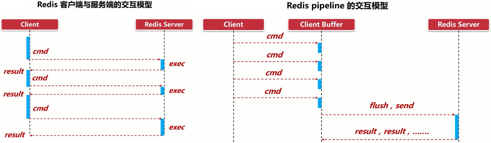

# Redis 7.0.0

## 简介及安装

#### 1、简介


​		Redis是一个开源（BSD许可）**内存数据结构存储**，用作数据库、缓存、消息代理和流引擎。Redis提供**键值对**数据结构，如字符串`strings`，哈希`hashes`，列表`lists`，集合`sets`，有序集合`sortedsets`与位图`bitmaps`、统计`hyperloglogs`和地理空间索引查询`geospatialindex`和流`steams`。可以对这些类型进行**原子操作**，比如增添字符串；递增散列中的值；将元素推送到列表中；计算集交集、并集和差集；或者获得排序集合中排名最高的成员等。

​		Redis内置了复制`replication`，LUA脚本`Luascripting`，LRU驱动事件`LRUeviction`，事务`transactions`和不同级别的磁盘持久化`persistence`，并通过Redis哨兵`Sentinel`和自动分区`Cluster`提供高可用性`highavailability`。

​		Redis可以通过定期将数据集转储到磁盘或将每个命令追加到基于磁盘的日志来完成数据**持久化**，也可以禁用持久性。Redis支持**异步复制**，具有快速的**非阻塞同步**和自动重新连接，并在网络拆分时进行部分重新同步。

​		Redis从发布至今，已经有十余年的时光了，一直遵循着自己的命名规则：版本号第二位如果是奇数，则为非稳定版本 如2.7；版本号第二位如果是偶数，则为稳定版本 如2.6。当前奇数版本就是下一个稳定版本的开发版本，如2.9版本是3.0版本的开发版本。

```xml
<dependency>
    <groupId>redis.clients</groupId>
    <artifactId>jedis</artifactId>
    <version>4.3.0</version>
</dependency>
```

#### 2、安装

##### 2.1 前置设置

```bash
# 查询系统CPU一次处理的二进制位数
[lighthouse@lightrain ~]$ getconf LONG_BIT
64

#安装并检查gcc版本>=4.8.5
[lighthouse@lightrain ~]$ yum install gcc-c++

[lighthouse@lightrain ~]$ gcc -v
Using built-in specs.
COLLECT_GCC=gcc
COLLECT_LTO_WRAPPER=/usr/libexec/gcc/x86_64-redhat-linux/4.8.5/lto-wrapper
Target: x86_64-redhat-linux...
gcc version 4.8.5 20150623 (Red Hat 4.8.5-44) (GCC) 

#下载安装包 并解压
[root@lightrain package]#
wget https://codeload.github.com/redis/redis/tar.gz/refs/tags/7.0.10 -O redis-7.0.10.tar.gz

[root@lightrain software]# tar -zxvf  redis-7.0.10.tar.gz -C /opt/software

```

##### 2.2 安装

###### 2.2.1 编译安装

- 编译和安装：

```bash
#编译和安装，在解压的文件夹中执行
#默认安装到了/usr/local/bin/目录
[root@lightrain redis-7.0.10]# make && make install
Hint: It's a good idea to run 'make test' ;)
#自定义安装路径
[root@lightrain redis-7.0.10]# make PREFIX=/opt/software/redis-7.0.10 install
cd src && make install
make[1]: Entering directory `/opt/package/redis-7.0.10/src'

Hint: It's a good idea to run 'make test' ;)

    INSTALL redis-server
    INSTALL redis-benchmark
    INSTALL redis-cli
make[1]: Leaving directory `/opt/package/redis-7.0.10/src'
```

> **报错问题：**编译安装redis时出现报错`zmalloc.h`，解决方法：`make MALLOC=libc`

```bash
zmalloc.h:50:31: error: jemalloc/jemalloc.h: No such file or directory
zmalloc.h:55:2: error: #error "Newer version of jemalloc required"
make[1]: *** [adlist.o] Error 1
#说关于分配器allocator， 如果有MALLOC环境变量， 会有用这个环境变量的去建立Redis。
#而且libc 并不是默认的， 默认的是 jemalloc, 因为 jemalloc 被证明有更少的 fragmentation problems 比libc。
#但是如果没有jemalloc 而只有 libc 当然 make 出错。 所以加这么一个参数
```

- 安装文件介绍

```bash
[root@lightrain bin]# pwd
/opt/software/redis-7.0.10/bin
[root@lightrain bin]# ll
#性能测试工具，服务启动后，可以用于测试，比如进行pipe管道测试
-rwxr-xr-x 1 root root  5197816 Mar 27 16:05 redis-benchmark
#修复有问题的AOF文件
lrwxrwxrwx 1 root root       12 Mar 27 16:05 redis-check-aof -> redis-server
#修复有问题的RDB文件
lrwxrwxrwx 1 root root       12 Mar 27 16:05 redis-check-rdb -> redis-server
#客户端连接入口
-rwxr-xr-x 1 root root  5415248 Mar 27 16:05 redis-cli
#redis集群
lrwxrwxrwx 1 root root       12 Mar 27 16:05 redis-sentinel -> redis-server
#服务启动命令
-rwxr-xr-x 1 root root 11430312 Mar 27 16:05 redis-server
```


###### 2.2.2 添加环境变量

```bash
#添加环境变量，通过在/etc/profile.d/中设置一个以.sh结尾的脚本文件(myenv.sh)
touch myenv.sh
chmod 644 myenv.sh

#set java environment
JAVA_HOME=/opt/software/jdk1.8.0_333
JRE_HOME=$JAVA_HOME/jre
....
#redis
REDIS=/opt/software/redis-7.0.10
PATH=$PATH:$JAVA_HOME/bin:$JRE_HOME/bin:$REDIS/bin
export JAVA_HOME JRE_HOME CATALINA_BASE PATH

#生效配置
[root@lightrain profile.d]# source /etc/profile
[root@lightrain profile.d]# echo $PATH
/usr/local/sbin:/usr/local/bin:/usr/sbin:/usr/bin:/opt/software/jdk1.8.0_333/bin:/opt/software/jdk1.8.0_333/jre/bin:/opt/software/tomcat-9.0.64/bin:/opt/software/maven-3.8.6/bin:/opt/software/redis-7.0.10/bin:/root/bin
```

​		可以通过`include /path/to/local.conf`（需要放在文件头部）引入Redis的标准模板，然后再配置自定义设置，可使用`*`通过符指定多个文件（`include /path/to/fragments/*.conf`）。

###### 2.2.3 修改配置文件

​		默认配置文件在解压包中`redis.conf`，一般不修改这里的配置文件，而是**复制一份到安装目录**，主要修改一下默认配置：

```bash
#设置后台启动，如果不是后台启动，每次推出redis就关闭了
daemonize yes
#开启密码保护，注释则不需要密码
requirepass abc123
#配置日志文件
logfile "/var/log/redis7.0.10.log"
#设置端口号，默认端口6379
port 6388
#允许访问的ip，改为0.0.0.0就是所有ip均可
bind 127.0.0.1 -::1
bind 0.0.0.0

#通过客户端修改密码
redis > CONFIG SET requirepass "abc123"
OK
```


###### 2.2.4 启动和停止

```bash
[root@lightrain redis-7.0.10]# redis-server ./redis.conf 
# redis-cli -h 110.184.59.105 -p 6388
#需要先登录 先后关闭
[root@lightrain redis-7.0.10]# redis-cli -p 6388
redis> auth abc123
OK
redis> shutdown
not connected> 
```


###### 2.2.5 设置开机自启

- 创建启动配置文件：

```bash
#进入到系统的/usr/lib/systemd/system(用户级别是user)目录下
#system是需要开机没有登陆情况下就能运行的程序，user是用户登录后才能运行的程序。
#创建启动文件
touch redis.service
vi redis.service
chmod 754 redis.service 
```

- 配置文件内容：

```bash
[Unit]
Description=redis-server
After=network.target

[Service]
Type=forking

ExecStart=/opt/software/redis-7.0.10/bin/redis-server /opt/software/redis-7.0.10/redis.conf
PrivateTmp=true

[Install]
#表明当系统以多用户方式（默认的运行级别）启动时，这个服务需要被自动运行。
WantedBy=multi-user.target
```

- 开启自启：

```bash
#重载系统服务
systemctl daemon-reload
#设置开机自启
systemctl enable redis.service
#取消开机自启
systemctl disable redis.service
#启动服务
systemctl start redis.service
#停止服务
systemctl stop redis.service
#查看服务状态
systemctl status redis.service
```


##### 2.3 卸载

```bash
#停止服务
[root@lightrain redis-7.0.10]# redis-cli -p 6388 -a abc123 shutdown
[root@lightrain redis-7.0.10]# ps -ef | grep redis

#删除安装文件
[root@lightrain package]# rm -rf /usr/local/bin/redis-*
```

## 数据类型


#### 1、Generic Commands

- `keys *`：查看当前库所有key  (匹配：keys *1)，生产环境不推荐使用
- `exists key`：判断某个key是否存在
- `type key`：查看你的key是什么类型
- `del key`：删除指定的key数据
- `unlink key`：根据value选择非阻塞删除，仅将keys从keyspace元数据中删除，真正的删除会在后续异步操作。
- `expire key 10`：为给定的key设置过期时间，默认-1表示永不过期，-2表示已过期
- `ttl key`：查看还有多少秒过期
- `select`：命令切换数据库，可以修改配置文件中`databases 16`完成默认数据库的数量配置
- `dbsize`：查看当前数据库的key的数量
- `flushdb`：清空当前库
- `flushall`：通杀全部库
- `help (@)命令`：帮助命令，查询命令的使用方式

```bash
redis > help
redis-cli 7.0.10
To get help about Redis commands type:
      "help @<group>" to get a list of commands in <group>
      "help <command>" for help on <command>
      "help <tab>" to get a list of possible help topics
```

- `copy`：
- `del key`：删除指定key
- `move`：
- `sort`：
- `touch key [key...]`：修改键的最后一次访问时间。返回指定的现有键的数目。

> **notes：大小写问题**	命令不区分大小写，但是key是区分大小写的


#### 2、十大类型


##### 2.1 String

​		Redis字符串存储字节序列，包括文本、序列化对象和二进制数组。String的数据结构为**动态字符串**，支持实现计数器和执行按位操作；而且它是**二进制安全**的，所以string可以包含任何数据，比如jpg图片或者序列化的对象。默认单个字符串value最多可以是**512M**。


###### 2.1.1 获取/设置单/多个值、范围值

> 获取和设置单个值：[SET](#set)、[GET](#get)、[GETDEL](#getdel)；设置获取多个值：[MSET](#msetmgetmsetnx)、[MGET](#msetmgetmsetnx)、[MSETNX](#msetmgetmsetnx)；获取范围值：[GETRANGE](#getrangesetrange)、[SETRANGE](getrangesetrange)

<span id="set" style="color:red">**（1）SET**</span>

`SET`：**注意：**SET的选项可以替代`SETNX, SETEX, PSETEX(ms), GETSET`，所以在未来版本中，这些命令可能会被弃用并最终删除。

```c
SET key value [NX | XX] [GET] [EX seconds | PX milliseconds | EXAT unix-time-seconds | PXAT unix-time-milliseconds | KEEPTTL]
```

- `NX/XX`：仅在该键不存在时设置该键，只在已经存在的情况下设置键值

```bash
#nx
redis> set k1 v1 nx
OK
redis> set k1 v2 nx
(nil)
redis> get k1
"v1"
#xx
redis> set k1 v2 xx
OK
redis> set k2 v2 xx
(nil)
redis> get k1
"v2"
redis> get k2
(nil)
```

- `GET`：返回存储在key的旧值，如果key不存在，则返回nil。如果key存储的值不是字符串，则返回错误并中止SET，等同于`GETSET`命令

```bash
redis> set k1 v3 GET
"v2"
```

- `EX/PX`：设置指定的过期时间，以秒/毫秒为单位。

```bash
redis> set k1 v1 ex 8
OK
redis> ttl k1
(integer) 5

redis> set k1 v1 px 8000
OK
redis> ttl k1
(integer) 6
```

- `EXAT/PXAT`：设置密钥过期的指定Unix时间（时间戳），单位为秒。

```bash
#System.currentTimeMillis()/1000L
redis> set k1 v1 exat 1679933690
OK
redis> ttl k1
(integer) 19

#System.currentTimeMillis()
redis> set k2 v1 PXAT 1679933767463
OK
redis> ttl k2
(integer) 2
```

- `KKEPTTL`：保留之前的key配置的生存时间，不覆盖。

```bash
redis> set k1 v1 ex 50
OK
redis> ttl k1
(integer) 46
redis> set k1 v2 keepttl
OK
redis> ttl k1
(integer) 30
```

<span id="get" style="color:red">**（2）GET**</span>：语法`GET key`

```bash
redis> GET nonexisting
(nil)
redis> SET mykey "Hello"
"OK"
redis> GET mykey
"Hello"
```

<span id="getdel" style="color:red">**（3）GETDEL**</span>

​		语法：`GETDEL key`，获取key的值并删除key，若不存在，则返回nil
```bash
redis> SET mykey "Hello"
"OK"
redis> GETDEL mykey
"Hello"
redis> GET mykey
(nil)
```

<span id="msetmgetmsetnx" style="color:red">**（4）mset / mget / msetnx**</span>

同时获取、设置多个值：

```c
MSET key value [key value ...]
MGET key [key ...]
#只要存在有一个键已经存在，则返回0，且值全部不会被设置，相反返回1。
MSETNX key value [key value ...]
```

使用举例：

```bash
redis> mset k1 v1 k2 v2 k3 v3
OK
redis> mget k1 k2 k3
1) "v1"
2) "v2"
3) "v3"
redis> msetnx k3 va3 k4 v4 k5 v5
(integer) 0
redis> mget k3 k4 k5
1) "v3"
2) (nil)
3) (nil)

```

<span id="getrangesetrange" style="color:red">**（5）getrange / setrange**</span>

- `getrange`：语法`GETRANGE key start end`，获取指定区间范围内的值，类似between......and的关系，从零到负一表示全部。**注意：**`start` <`end`

```bash
redis> set k1 abc123cdef
OK
redis> getrange k1 1 5
"bc123"
```

- `setrange`：语法`SETRANGE key offset value`，设置指定区间范围内的值，是==覆盖==而非增加，格式：`setrange key offset value`，如果设置的坐标之前没有值，将自动填充十六进制的0（\x00）

```bash
redis > set mystring abc
OK
redis > setrange mystring 1 de
(integer) 3
redis > get mystring
"ade"
redis > setrange mystring 5 test
(integer) 9
redis > get mystring
"ade\x00\x00test"
```


###### 2.1.2 获取字符串长度/添加字符/截取字符串

> 获取字符串长度：[STRLEN](#strlen)；添加字符：[APPEND](#append)；截取字符串：[SUBSTR](#substr)

- <span id="strlen">`strlen`</span>：返回存储在key的字符串值的长度（**字节数**），当key不存在时为0。当key包含非字符串值时返回错误。

```bash
redis> set v2 ajsdjanda
OK
redis> strlen v2
(integer) 9

redis> strlen k2
(integer) 0
```

- <span id="append">`append`</span>：将值追加到字符串的末尾。如果key不存在，先创建并将设置值，这种情况下，APPEND将类似于set。

```bash
redis> append v3 hello
(integer) 10
redis> get v3
"asdadhello"
```

- <span id="substr">`substr`</span>：语法：`SUBSTR key start end`，返回key中指定范围的字符串值，由偏移量start和end决定，-1表示最后一个字符，-2表示倒数第二个字符，以此类推。

```bash
redis> get k1
"12312asdasdasd"
redis> substr k1 -2 2
""
redis> substr k1 -2 -1
"sd"
```


###### 2.1.3 公共子串

​		`LCS`命令实现了最长公共子序列算法，可用于评估字符串的相似程度。**注意**：匹配字符串中的字符不需要连续的。例如："foa"，"foo"的LCS为"fo"。该算法在`O(N*M)`时间内运行，其中N/M是第二个字符串的长度。

```c
LCS key1 key2 [LEN] [IDX] [MINMATCHLEN min-match-len] [WITHMATCHLEN]
```

- `LEN`：获取两字符串的匹配长度

```bash
redis > MSET key1 ohmytext key2 mynewtext
OK
redis > LCS key1 key2 LEN
(integer) 6
```

- `IDX`：获取配置字符串的字符坐标，先按==从尾到头==匹配片段、片段中的起始字符坐标分开返回。

```bash
redis > LCS key1 key2 IDX
1) "matches"
2) 1) 1) 1) (integer) 4 
         2) (integer) 7 
      2) 1) (integer) 5
         2) (integer) 8
   2) 1) 1) (integer) 2
         2) (integer) 3
      2) 1) (integer) 0
         2) (integer) 1
3) "len"
4) (integer) 6
```

- `MINMATCHLEN`：指定只返回长度大于或等于这个值的子序列

```bash
> LCS key1 key2 IDX MINMATCHLEN 4
1) "matches"
2) 1) 1) 1) (integer) 4
         2) (integer) 7
      2) 1) (integer) 5
         2) (integer) 8
3) "len"
4) (integer) 6
```

- `WITHMATCHLEN`：用于在返回结果中包含每个匹配子序列的长度

```bash
> LCS key1 key2 IDX MINMATCHLEN 4 WITHMATCHLEN
1) "matches"
2) 1) 1) 1) (integer) 4
         2) (integer) 7
      2) 1) (integer) 5
         2) (integer) 8
      3) (integer) 4
3) "len"
4) (integer) 6
```


###### 2.1.4 计数器、自增

> **注意：**必须是数值才能进行加减，自增：[INCR](#incr)、[INCRBY](#incrby)、[INCRBYFLOAT](#incrbyfloat)；递减：[DECR](#decr)、[DECRBY](#decrby)

- <span id="incr">`INCR`</span>：将存储在键上的数字增加一，返回自增后的值，`INCR key`。如果key不存在，则在执行操作前先置0。如果键包含错误类型的值或包含不能表示为整数的字符串，则返回错误。此操作仅限于以10为基数的64位有符号整数。实现网页访问限制：

```bash
#计数器模式，网页访问限制
FUNCTION LIMIT_API_CALL(ip):
current = GET(ip)
IF current != NULL AND current > 10 THEN
    ERROR "too many requests per second"
ELSE
    value = INCR(ip)
    IF value == 1 THEN
        EXPIRE(ip,1)
    END
    PERFORM_API_CALL()
END
```

​		在上面的代码中有一个**并发问题**。如果出于某种原因，客户端执行了INCR命令，但没有执行EXPIRE，key将被泄露，直到我们再次看到相同的IP地址。这个问题可以通过把带有可选的EXPIRE参数的INCR命令转换成一个`Lua`脚本，然后用`EVAL`命令发送给Redis来解决。

```bash
local current
current = redis.call("incr",KEYS[1])
if current == 1 then
    redis.call("expire",KEYS[1],1)
end
```

- <span id="incrby">`INCRBY / INCRBYFLOAT `</span>：语法`INCRBY / INCRBYFLOAT key increment`，按增量递增存储在键上的数字，不存在同上，返回自增后的值。

```bash
redis> INCRby k1 2
(integer) 5

redis> INCRBYFLOAT mykey 0.1
"10.6"
redis> INCRBYFLOAT mykey -5
"5.6"
```

- <span id="decr">`DECR`</span>：语法`DECR key`，将存储在键上的数字减1。不存在同上。

```bash
redis> decr k1
(integer) 4
```

- <span id="decrby">`DECRBY`</span>：语法`DECRBY key decrement`，以递减的方式递减存储在键上的数字。不存在同上。

```bash
redis> decrby k1 2
(integer) 2
```


###### 2.1.5 数据结构

​		String的数据结构为简单动态字符串(Simple Dynamic String,缩写SDS)，是可以修改的字符串，内部结构实现上类似于Java的ArrayList，采用预分配冗余空间的方式来减少内存的频繁分配。


​		如图中所示，内部为当前字符串实际分配的空间capacity一般要高于实际字符串长度len。当字符串长度小于1M时，扩容都是加倍现有的空间，如果超过1M，扩容时一次只会多扩1M的空间。需要注意的是字符串最大长度为512M。


##### 2.2 List

​		List是字符串**双向链表**结构，对==双端操作性能很高==，但是通过下标索引操作中间节点性能很差。常用于：实现堆栈和队列、为后台工作程序系统构建队列管理。最大长度为 2^32^ - 1(42,9496,7295)个元素。

​		访问头部或尾部的列表操作是O(1)，这意味着它们是高效的。但是，操作列表中元素的命令通常是O(n)。这些例子包括LINDEX、LINSERT和LSET。运行这些命令时要小心，主要是在大列表上操作时。


###### 2.2.1 左右插入值、获取范围值、获取索引位置值、修改索引位的值

> 左右插入值：[LPUSH](#lpush)、[RPUSH](#rpush)；获取范围值：[LRANGE](#lrange)；获取索引位置值：[LINDEX](#lindex) ；修改指定索引为的值：[LSET](#lset)

- <span id="lpush ">`lpush / rpush`</span>：将所有指定的值依次插入到列表的开头或结尾，返回插入的List的总长度。若key不存在，则在插入之前先创建。当key包含的不是列表类型的值时，会返回一个错误。

```bash
redis> lpush k1 v1 v2
(integer) 2
redis> lpush k1 v3 v4 v5 v6
(integer) 6
```

- <span id="lrange">`lrange`</span>：返回`List`中指定坐标范围的值，当指定的坐标超过了索引范围，将视为列表的最后一个元素。

```bash
redis > lpush k3 v1 v2 v3 v4 v5 v6
(integer) 6
redis > lrange k3 0 0
1) "v6"
redis > lrange k3 0 -1
1) "v6"
2) "v5"
3) "v4"
4) "v3"
5) "v2"
6) "v1"
```

- <span id="lindex">`lindex`</span>：语法`LINDEX key index`：返回list中指定索引位置的值，若坐标超过范围或不存在key，则返回nil

```bash
redis > lrange k8 0 -1
1) "v1"
2) "v2"
3) "v3"
4) "v4"
5) "v5"
redis > lindex k8 3
"v4"
redis > LINDEX v8 -1
"v5"
redis > LINDEX v8 10
(nil)
```

- <span id="lset">`lset`</span>：语法`LSET key index element`，将索引处的list元素修改为指定值，超出范围的索引返回错误。

```bash
redis > lset k8 2 v88
OK
redis > lrange k8 0 -1
1) "v2"
2) "v3"
3) "v88"
4) "v5"
5) "v2"
redis > lset k8 20 v66
(error) ERR index out of range
```


###### 2.2.2 左右弹出值（或阻塞）

> 左右弹出值：[LPOP](#lpop)、[RPOP](#rpop)；阻塞左右弹出值：[BRPOP](#brpop)、[BLPOP](#blpop)

- <span id="lpop">`lpop / rpop`</span>：语法：`LPOP / RPOP key [count]`，当`lpop / rpop`未指定count时：从`List`中返回并删除左边/右边的第一个元素，当指定了`count`，则返回并删除count数量的元素

```bash
redis > LPUSH k6 "v1" "v2" "v3" "v4" "v5" "v6"
(integer) 6
redis > lpop k6 3
1) "v6"
2) "v5"
3) "v4"
redis > lrange k6 0 -1
1) "v3"
2) "v2"
3) "v1"

redis > rpop k6 2
1) "v1"
2) "v2"
redis > lrange k6 0 -1
1) "v3"
```

- <span id="blpop">`blpop / brpop`</span>：语法`BRPOP key [key ...] timeout`，多个key都不存在时，将阻塞到其中一个key得到创建或到达超时时间。返回弹出的键值对，超时返回nil。

```bash
redis > brpop k3 k4 30
1) "k3"
2) "v1"
(3.75s)
```


###### 2.2.3 获取list长度、删除指定元素、截取list、插入值

> 获取list长度：[LLEN](#llen)；删除指定元素：[LREM](#lrem)；截取list：[LTRIM](#ltrim)；插入值：[LINSERT](#linsert)

- <span id="llen">`llen`</span>：返回list的长度，若list不存在则**返回0**，而key不是list类型，则返回错误，o(1)。

```bash
redis > llen k8
(integer) 5
```

- <span id="lrem">`lrem`</span>：语法`LREM key count element`。count > 0 时删除list中从头到尾与element相同指定个数的元素，count < 0 时，则是从尾到头的删除指定个数的相同元素，当count = 0 则是删除其中所有的相同元素。当list为空，则直接返回0。

```bash
redis > lrange k8 0 -1
1) "v1"  5) "v5"
2) "v2"  6) "v1"
3) "v3"  7) "v1"
4) "v4"  8) "v2"
redis > lrem k8 0  v1
(integer) 3
redis > lrange k8 0 -1
1) "v2"
2) "v3"
3) "v4"
4) "v5"
5) "v2"
```

- <span id="ltrim">`ltrim`</span>：语法`LTRIM key start stop`，截取list中指定范围的值作为新的list，若start > end 则相当于删除了该list，若end超过索引，默认视为到最后一个元素。

```bash
redis > ltrim k8 0 2
OK
redis > lrange k8 0 -1
1) "v2"
2) "v3"
3) "v88"
```

​		结合`lpush`使用，可以限制list的长度，比如下面限制了list只有100个元素长度。

```bash
redis > lpush k9 v99
(integer) 1
redis > ltrim k9 0 99
OK
```

- <span id="linsert">`linsert`</span>：语法`LINSERT key <BEFORE | AFTER> pivot element`，在指定**已有元素（不是坐标）**之前或之后插入元素，插入成功返回总长度，若key不存在返回0，若不存在指定元素，则返回-1。

```bash
redis > linsert k1 before v2 v22
(integer) 5
redis > lrange k1 0 -1
 1) "v4"
 2) "v3"
 3) "v22"
 4) "v2"
 5) "v1"
```


###### 2.2.4 自定义弹出添加、右弹出左添加

> 自定义弹出添加：[LMOVE](#lmove)、[BLMOVE](#blmove)(阻塞)；右弹出左添加：[RPOPLPUSH](#rpoplpush)、[BRPOPLPUSH](#brpoplpush)

- <span id="lmove">`lmove`</span>：语法`LMOVE source destination <LEFT | RIGHT> <LEFT | RIGHT>`，原子式地返回并删除源位置的列表的头部/尾部一个元素（取决于第一个where参数），并将该元素推送到存储在目标位置的列表中的头部或尾部元素（取决于第二个where）。若源不存在，返回nil，其他同`rpoplpush`。
- <span id="blmove">`blmove`</span>：语法`BLMOVE source destination <LEFT | RIGHT> <LEFT | RIGHT> timeout`，阻塞式的Lmove，同`BRPOPLPUSH`

```bash
redis > lmove k1 k2 left left
"v7"
redis > lrange k1 0 -1
1) "v6"
2) "v5"
redis > lrange k2 0 -1
1) "v7"
2) "v11"

redis > blmove k5 k6 left left 30
"v1"
(6.71s)
```

- <span id="rpoplpush">`rpoplpush`</span>：语法`RPOPLPUSH source destination`。原子化地返回并删除存储在源列表的尾部的一个元素，并将该元素推送到目的列表头部的第一个元素。从Redis版本6.2.0开始，此命令被视为已弃用。可以用带有RIGHT和LEFT参数的`LMOVE`来替换。若源和目的相同，则相当于将list的尾部元素放到头部，若源不存在返回nil。
- <span id="brpoplpush">`BRPOPLPUSH`</span>：语法`BRPOPLPUSH source destination timeout`，BRPOPLPUSH是RPOPLPUSH的**阻塞**变体。当源为空时，Redis将阻塞当前连接，直到达到超时或另一个连接创建该源。超时为0，则将无限期地阻塞。

```bash
redis > lpush k1 v1 v2 v3
(integer) 3
redis > lpush k2 v11 v22 v33
(integer) 3
redis > rpoplpush k1 k2
"v1"
redis > lrange k1 0 -1 
5) "v3"
6) "v2"
redis > lrange k2 0 -1 
1) "v1"
2) "v33"
3) "v22"
4) "v11"

redis > brpoplpush  k3 k4 30
"v1"
(24.98s)
```


###### 2.2.5 使用案例

**可实现可靠队列模式和循环列表模式：**

可靠队列模式：可保证消息不会丢失，即使消费者出现问题也可以恢复。

- 生产者将消息作为队列的源`list`。消费者使用`RPOPLPUSH`或`BRPOPLPUSH`命令从源列表中弹出一个消息，并同时将它推入另一个列表中，作为处理列表。
- 消费者在处理完消息后，使用LREM命令从处理列表中删除该消息。如果消费者在处理消息的过程中发生故障或网络问题，那么消息会留在处理列表中。另一个客户端可以监控处理列表中的元素，如果发现某个元素停留的时间过长，则认为其超时，然后将它重新推入源列表中，等待其他消费者重新处理。

循环列表模式：可以实现一组元素需要被多个工作线程不断地尽快地处理。比如多网站监控系统，检查多个网站是否可达，使用多个并行的工作线程来检查。

- 客户端使用`RPOPLPUSH`命令从一个列表中弹出一个元素，并同时将它推入同一个列表的头部。这样可访问所有元素，且不需要一次性获取整个列表。
- 这个模式可以支持多个客户端同时旋转列表，它们会获取不同的元素，直到所有元素都被访问过，然后过程重新开始。这个模式也可以支持其他客户端在列表的尾部添加新的元素，它们会被旋转到头部，并被访问到。


###### 2.2.6 数据结构

​		List的数据结构为快速链表`quickList`。首先在列表元素较少的情况下会使用一块==连续==的内存存储，这个结构是`ziplist`，也即是==压缩列表==。它将所有的元素紧挨着一起存储，分配的是一块连续的内存。当数据量比较多的时候才会改成`quicklist`。因为普通的链表需要的附加指针空间太大，会比较浪费空间。比如这个列表里存的只是int类型的数据，结构上还需要两个额外的指针prev和next。


​		Redis将链表和ziplist结合起来组成了quicklist。也就是将多个ziplist使用双向指针串起来使用。这样既满足了快速的插入删除性能，又不会出现太大的空间冗余。


##### 2.3 hash

​		`hash`哈希数据类型是一种表示字符串字段和字符串值之间映射关系的数据结构。可以存储多个字段-值对，并且不占用太多空间，因此非常适合用于表示数据对象。例如，一个哈希可以表示一个客户，包括字段如name, address, email, 或 customer_id。每个散列最多可以存储2^32^-1个字段值对，其结构类似Map<String,Object>。

​		大多数Redis散列命令都是O(1)。一些命令（如HKEYS、HVALS和HGETALL）是O(n)，其中n是字段值对的数量。


###### 2.3.1 设置单/多值、删除值、获取单/多值、随机取值

> 设置单/多字段：[HSET](#hset)、[HSETNX](#hsetnx)（单）；获取多字段值：[HMGET](#hmget)、[HGETALL](#hgetall)；删除字段：[HDEL](#hdel)；
>
> 获取单字段值：[HGET](#hget)；随机字段取值：[HRANDFIELD](#hrandfield);

- <span id="hset">`hset`</span>：语法`HSET key field value [field value ...]`，若该`hash`表不存在，则先创建并设置字段值，若存在覆盖已有的字段和添加新字段值。hset可以同时设置多个字段，这样它使得取代`hmset`。

```bash
redis > hset k1 name jack age 12 address shuangliu location chengdu 
(integer) 1
redis > HGETall k1 
1) "name"
2) "jack"
3) "age"
4) "12"
5) "address"
6) "shuangliu"
7) "location"
8) "chengdu"
```

- <span id="hsetnx">`hsetnx`</span>：语法`HSETNX key field value`，仅当字段还不存在时，才创建字段并设置值，成功则返回1。若密钥不存在，则先创建hash；如果字段已经存在，则此操作无效，返回0。

```bash
redis > hsetnx k1 name jack2
(integer) 0
redis > hsetnx k1 fruit  watermelon
(integer) 1
```

- <span id="hget">`hget`</span>：语法`HGET key field`，返回hash中的一个指定字段，当字段或hash不存在，则返回nil。

```bash
redis > hget k1 name
"jack"
```

- <span id="hmget">`hmget`</span>：语法`HMGET key field [field ...]`，同时获取hash中的多个字段，不存在的字段返回nil，不存在的hash返回nil值列表

```bash
redis > hmget k1 name age asdad
1) "jack"
2) "12"
3) (nil)
#不存在的hash，返回nil列表
redis > hmget k3 name age asdad
1) (nil)
2) (nil)
3) (nil)
```

- <span id="hgetall">`hgetall`</span>：语法`HGETALL key`，返回hash中的所有字段名和值的数组，当不存在则返回`empty array`

```bash
redis > HGETall k1 
1) "name"
2) "jack"
3) "age"
4) "12"
5) "address"
6) "shuangliu"
7) "location"
8) "chengdu"
redis > hgetall k6
(empty array)
```

- <span id="hdel">`hdel`</span>：语法`HDEL key field [field ...]`，删除hash中指定的字段，会忽略不存在的字段，若hash不存在，则返回**0**，正常返回删除的字段数（不包括不存在的字段）。

```bash
redis > hdel k1 fruit country
(integer) 1
```

- <span id="hrandfield">`hrandfield`</span>：语法`HRANDFIELD key [count [WITHVALUES]]`，当只有key时，从key对应的hash中取个随机字段。使用count > 0，返回count个不同字段的数组；count < 0，返回count个可能重复字段的数组。使用`WITHVALUES`则返回包含字段和值的数组。

```bash
redis> HRANDFIELD coin -5 WITHVALUES
1) "edge"
2) "null"
3) "edge"
4) "null"
5) "heads"
6) "obverse"
```


###### 2.3.2 获取字段数量、所有字段名、所有字段值、判断字段存在、获取字段值长度

>  获取字段数量：[HLEN](#hlen)；所有字段名：[HKEYS](#hkeys)；所有字段值：[HVALS](#hvals)；判断字段存在：[HEXISTS](#hexists)；获取字段值长度：[HSTRLEN](#hstrlen)

- <span id="hlen">`hlen`</span>：语法`HLEN key`返回hash中的字段数量，hash为空则返回0。

```bash
redis > hlen k1
(integer) 4
```

- <span id="hkeys">`hkeys`</span>：语法`HKEYS key`，返回hash中所有的字段名，当字段为空或hash为空，返回空列表

```bash
redis > hkeys k1
1) "name"
2) "age"
3) "address"
4) "location"
5) "city"
redis > hkeys k2
(empty array)
```

- <span id="hvals">`hvals`</span>：语法`HVALS key`，返回hash中的所有字段值，当键不存在时为空列表。

```bash
redis > hvals k1
1) "jack"
2) "143"
3) "shuangliu"
...
```

- <span id="hexists">`hexists`</span>：语法`HEXISTS key field`，判断hash中是否包含指定的字段，若包含则返回**1**，否则若不存在hash或字段，返回**0**

```bash
redis > HEXISTS k1 name
(integer) 1
redis > HEXISTS k1 good
(integer) 0
```

- <span id="hstrlen">`hstrlen`</span>：语法`HSTRLEN key field`，返回hash中相关字段的字符长度，若hash或字段不存在，返回**0**。

```bash
redis > hstrlen k1 name
(integer) 4
redis > hstrlen k1 fruit
(integer) 0
```


###### 2.3.3 字段值自增

> 整形自增：[HINCRBY](#hincrby)；浮点自增：[HINCRBYFLOAT](#hincrbyfloat)；

- <span id="hincrby">`hincrby`</span>：语法`HINCRBY key field increment`，将指定的hash中的指定字段自增自定义数量。若不存在该字段，先创建初始为0并自增。返回自增后的数值。

```bash
redis > hincrby k1 age 20
(integer) 143

redis > hincrby k1 firends  1000
(integer) 1000
redis > hkeys k1
...
5) "city"
6) "firends"
```

- <span id="hincrbyfloat">`hincrbyfloat`</span>：语法`HINCRBYFLOAT key field increment`，同上，不同的是自增量为浮点类型

```bash
redis > hincrbyfloat k1 money 10000000000000.00
"10000000000000"
redis > hincrbyfloat k1 money 10009919.123
"10000010009919.12300014495849609"
```

> **notes：浮点数精度问题**
>
> ​		可以发现这里存在浮点数精度问题，可以使用一些方法来避免或减少这种误差，例如：使用固定小数点的方式来表示浮点数，例如将10009919.123表示为10009919123。使用字符串或其他数据类型来存储浮点数，而不是直接使用HINCRBYFLOAT命令。使用一些第三方的库或工具来处理浮点数的运算，例如decimal或bigdecimal。


###### 2.3.4 使用案例

​		实现购物车功能的主流方案通常使用Redis的有序集合数据类型。在有序集合中，每个成员都有一个关联的分数，可以使用分数来存储购物车商品的数量。将商品ID作为有序集合的成员，将商品数量作为成员的分数。这使得对购物车中的商品数量进行自增或自减变得非常容易。

有序集合相对于使用Redis哈希数据类型来实现购物车的优点是：

- 更好的性能：使用有序集合可以快速获取购物车中所有商品的总数，因为它只需要计算所有成员的分数之和。而在使用哈希数据类型时，需要**遍历所有字段**才能计算总数。
- 更容易进行扩展和维护：有序集合可以轻松地添加或删除商品，而不必担心冲突或数据不一致的问题。另外，使用有序集合也更容易与其他Redis功能（如Lua脚本和Redis事务）集成。
- 更好的可读性和可维护性：使用有序集合可以更好地表示购物车中每个商品的数量，因为分数是一种自描述的方式，而哈希数据类型需要使用特殊的命令来增加或减少字段的数量。

​		因此，尽管哈希数据类型仍然可以用于实现购物车功能，但有序集合已成为更常用的解决方案，因为它具有更好的性能和可扩展性，并且更容易维护和扩展。

```bash
新增商品 → hset shopcar:uid1024 334488 1
新增商品 → hset shopcar:uid1024 334477 1
增加商品数量 → hincrby shopcar:uid1024 334477 1
商品总数 → hlen shopcar:uid1024
全部选择 → hgetall shopcar:uid1024
```


###### 2.3.5 数据结构

​		Hash类型对应的数据结构是两种：ziplist（压缩列表），hashtable（哈希表）。当field-value长度较短且个数较少时，使用ziplist，否则使用hashtable。


##### 2.4 set

​		`set`集合是唯一字符串（成员）的无序集合。使用场景：跟踪唯一性项目（例如，跟踪访问给定博客文章的所有唯一IP地址）；表示关系（例如，具有给定角色的所有用户的集合）；执行常见的集合操作，如交集、并集和差集。集合的最大大小为2^32^-1个成员。

​		大多数集合操作，包括==添加==、==删除==和==查找==集合成员，**都是O(1)**。这意味着它们的效率很高。但是，对于具有数十万或更多成员的大型集合，在运行`SMEMBERS`命令时应格外小心。此命令为O(n)，并在单个响应中返回整个集合。另一种选择是考虑`SSCAN`，它允许您迭代地检索集合的所有成员。

###### 2.4.1 集合添加成员、删除成员、读取所有成员、返回成员个数

> 集合添加成员：[SADD](#sadd)；删除成员：[SREM](#srem)；读取所有成员：[SMEMBERS](#smembers)； 返回成员个数：[SCARD](#scard)；

- <span id="sadd">`SADD`</span>：语法`SADD key member [member ...]`，将指定的元素添加到set集合，返回添加到集合的元素数（不包含忽略的）。若set中存在指定的成员将被忽略。如果键不存在，则在添加指定的成员之前会创建一个新的集合。当key不是一个set时，返回错误。

```bash
redis > sadd myset v1 v2 v3 v4 v5
(integer) 5
redis > sadd myset v3 v6
(integer) 1
```

- <span id="srem">`srem`</span>：语法`SREM key member [member ...]`，删除key绑定集合中指定的成员，若key不存在，则返回0，不存在的将忽略，否则返回删除的成员数（不包含忽略的）。

```bash
redis > srem myset v1 v2 v11 v22
(integer) 2
```

- <span id="smembers">`smembers`</span>：语法`SMEMBERS key`，返回集合中的所有成员元素。这与使用一个参数键运行SINTER具有相同的效果。

```bash
redis > smembers myset
1) "v3"  4) "v4"
2) "v6"  5) "v1"
3) "v2"  6) "v5"
```

- <span id="scard">`scard`</span>：语法`SCARD key`，返回集合元素的个数，若key不存在，则返回0

```BASH
redis > scard myset
(integer) 4
redis > scard myset2
(integer) 0
```


###### 2.4.2 判断单(多)成员存在、随机弹出/读取单(多)成员、移动成员

> 判断单成员是否存在：[SISMEMBER](#sismember)；判断多成员是否存在：[SMISMEMBER](#smismember)；随机弹出多个值：[SPOP](#spop)；
>
> 随机读取多个值：[SRANDMEMBER](#srandmember)；移动成员到指定集合：[SMOVE](#smove)

- <span id="sismember">`sismember`</span>：语法`SISMEMBER key member`，如果成员是指定集合的成员，则返回1。如果元素不是集合的成员，或者键不存在，则为0。

```bash
redis > SADD myset "one"
(integer) 1
redis > SISMEMBER myset "one"
(integer) 1
redis > SISMEMBER myset "two"
(integer) 0
```

- <span id="smismember">`smismember`</span>：语法`SMISMEMBER key member [member ...]`，同上，不同的是指定多个元素，并返回结果列表。

```bash
redis> SADD myset "one"
(integer) 1
redis> SMISMEMBER myset "one" "notamember"
1) (integer) 1
2) (integer) 0
```

- <span id="spop">`spop`</span>：语法`SPOP key [count]`，从集合中**删除**并返回一个或多个**随机**元素的。类似于`srandmember`，但会从集合中删除元素，且count必须为正。默认只弹出一个元素，指定count参数来弹出多个元素。若count参数大于集合的元素个数，那么返回整个集合。当不带count且key不存在，那么返回nil，带了count且key不存在，则返回空数组。**注意**，当需要保证返回元素的均匀分布时，此命令不适用。

```bash
redis > sadd k1 v1 v2 v3 v4 v5 v6 v7 v8 v9
(integer) 9
redis > spop k1
"v4"
redis > spop k1 3
1) "v6"
2) "v9"
3) "v7"
redis > smembers k1
1) "v2"
2) "v1"
3) "v8"
4) "v3"
5) "v5"
```

- <span id="srandmember">`srandmember `</span>：语法`SRANDMEMBER key [count]`，从集合随机返回一个或多个元素，指定了count > 0，返回count个不同的元素，当count超过索引也会被限定到索引范围；如果count < 0，那么允许返回相同的元素多次，且允许count超过范围。如果key不存在，那么返回nil或空数组。

```bash
redis > sadd k1 v1 v2 v3
(integer) 3
redis > srandmember k1 -4
1) "v2"
2) "v3"
3) "v3"
4) "v1"
redis > srandmember k1 4
1) "v2"
2) "v1"
3) "v3"
```

- <span id="smove">`smove`</span>：语法`SMOVE source destination member`，该元素将从源集中删除并添加到目标集中，成功返回1。当指定的元素已经存在于目标集中时，它只会从源集中删除。如果源集不存在或不包含指定的元素，则不执行任何操作并返回0。

```bash
redis > sadd myset1 v1 v2 v3 v4 v5 v6 
(integer) 6
redis > smove myset1 myset2 v1
(integer) 1
redis > smembers myset1
1) "v3"
2) "v6"
3) "v2"
4) "v4"
5) "v5"
redis > smembers myset2
1) "v1"

redis > smove myset3 myset2 v1
(integer) 0
```


###### 2.4.3 集合运算

> 差集运算：[SDIFF](#sdiff)、[SDIFFSTORE](#sdiffstore)；交集：[SINTER](#sinter)、[SINTERCARD](#sintercard)、[SINTERSTORE](#sinterstore)；并集：[SUNION](#sunion)、[SUNIONSTORE](#sunionstore)；

- <span id="sdiff">`sdiff`</span>：语法`SDIFF key [key ...]`，计算多个集合之间的**差集**，返回第一个集合中存在而其他集合中不存在的元素。如果键不存在，就当作空集处理。这个命令的时间复杂度是O(N)，其中N是所有给定集合的元素总数。

```bash
redis > smembers myset
1) "v3"  4) "v4"
2) "v6"  5) "v1" 
3) "v2"  6) "v5"
redis > sadd myset2 v1 v2 v55 v3
(integer) 4
redis > sadd myset2 v4 v55 v3
(integer) 3
redis > sdiff myset myset1 myset2
1) "v5"
2) "v6"
```

- <span id="sdiffstore">`sdiffstore`</span>：语法`SDIFFSTORE destination key [key ...]`，等同于SDIFF，但它不返回结果集，返回保存到目标集合的元素数，而是存储在目标集合中。如果目的集合已经存在，它将被**全部覆盖**。

```bash
redis > sadd myset6 v1  v2 v4 v5 v6 
(integer) 5
redis > sdiffstore myset6 myset myset1 myset2
(integer) 2
redis > smembers myset6
1) "v6"
2) "v5"

redis > sdiffstore myset6 myset11 myset123
(integer) 0
redis > smembers myset6
(empty array)
```

- <span id="sinter">`sinter`</span>：语法`SINTER key [key ...]`，返回所有集合的交集，即所有给定集合中共有的元素。如果存在某个集合为空集，那么交集也是空集（因为任何集合和空集的交集都是空集），返回值是一个包含交集元素的列表。

```bash
redis > sinter myset myset2
1) "v4"
2) "v3"
```

- <span id="sintercard">`sintercard`</span>：**7.0.0新增**，语法`SINTERCARD numkeys key [key ...] [LIMIT limit]`，返回多个集合之间的交集的元素个数，而不返回交集的元素。如果键不存在，就当作空集处理，那么交集也是空集，返回**0**。`numKeys`指定要求交集的个数，`LIMIT`参数（默认为0，表示无限制）指定求交集过程中结果达到了`LIMIT`，就会提前退出，并返回LIMIT作为结果。

```bash
redis > SINTER key1 key2
1) "c"
2) "d"
redis > SINTERCARD 2 key1 key2
(integer) 2
redis > SINTERCARD 2 key1 key2 LIMIT 1
(integer) 1
```

- <span id="sinterstore">`sinterstore`</span>：语法`SINTERSTORE destination key [key ...]`，等同SINTER，但不是返回结果集，而是存储在目的集合。若目的集合已经存在，它将被覆盖。返回目的集合中的元素数。

```bash
redis > sadd key1 v1 v2 v3 v4
(integer) 4
redis > sadd key2 v2 v4 v5 v7
(integer) 4
redis > sinterstore key3 key1 key2
(integer) 2
redis > smembers key3
1) "v2"
2) "v4"
```

- <span id="sunion">`sunion`</span>：语法`SUNION key [key ...]`，获取所有给定集合的并集的。不存在的键被视为是空集合。这个命令返回一个集合，包含所有给定集合中的不同元素。

```bash
redis > sadd k1 v1 v2 v3 v4
(integer) 4
redis > sadd k2 v2 v4 v5 v6
(integer) 4
redis > sunion k1 k2
1) "v4"
2) "v2"
3) "v6"
4) "v1"
5) "v3"
6) "v5"
```

- <span id="sunionstore">`sunionstore`</span>：语法`SUNIONSTORE destination key [key ...]`，等同SUNION，但不是返回结果集，而是存储在目标集合中。如果目标集合已经存在，它将被覆盖。返回目标集合的元素数。

```bash
redis > sunionstore k3  k1 k2
(integer) 6
redis > smembers k3
1) "v4"
2) "v2"
3) "v6"
4) "v1"
5) "v3"
6) "v5"
```


###### 2.4.4 案例使用

- 抽奖

```bash
用户ID，立即参与按钮  sadd key 用户ID
显示已经有多少人参与了  SCARD key
抽奖(从set中任意选取N个中奖人)  SRANDMEMBER key 2   随机抽奖2个人，元素不删除
                              SPOP  key 3         随机抽奖3个人，元素会删除
```

- 朋友圈点赞

```bash
新增点赞  sadd pub:msgID  点赞用户ID1  点赞用户ID2
取消点赞  srem pub:msgID  点赞用户ID
展现所有点赞过的用户 SMEMBERS  pub:msgID
点赞用户数统计，就是常见的点赞红色数字 scard  pub:msgID
判断某个朋友是否对楼主点赞过 SISMEMBER pub:msgID 用户ID
```

- 可能认识的人

```bash
redis > sadd user:id1 f1 f2 f3 f4
(integer) 4
redis > sadd user:id2 f5 f6 f2 f4
(integer) 4
redis > sdiff user:id1 user:id2
1) "f1"
2) "f3"
redis > sdiff user:id2 user:id1
1) "f5"
2) "f6"

#共同好友
redis > sinter user:id1 user:id2
1) "f4"
2) "f2"
```


###### 2.4.5 数据结构

​		Set数据结构是dict字典，字典是用哈希表实现的。Java中HashSet的内部实现使用的是HashMap，只不过所有的value都指向同一个对象。Redis的set结构也是一样，它的内部也使用hash结构，所有的value都指向同一个内部值。


##### 2.5 Sorted Set

​		类似于set，都是由不重复的字符串组成的集合。不同的是，每个元素都关联了一个==双精度浮点数==，称为**分数**，+inf和-inf是双精度浮点数的特殊值，分别表示正无穷和负无穷。redis通过分数来对集合中的元素进行**从小到大**的排序。当多个元素有相同的分数时，按照**字典序**排序。sorted set可以用来实现一些场景，例如==排行榜、限速器==（使用排序集来构建滑动窗口速率限制器，以防止过多的API请求）等。

​		能包括的==整数范围==是-(2^53^) 到 +(2^53^)。大多数排序集操作都是O（log(n)），其中n是成员数。在运行具有较大返回值（例如，数万或更多）的`ZRANGE`命令时要格外小心。此命令的时间复杂度为O((logn)+m)，其中m是返回的结果数。


###### 2.5.1 zadd  / zrange / zrangestore

**（1）zadd：**

```c
ZADD key [NX | XX] [GT | LT] [CH] [INCR] score member [score member...]
```

​		将具有指定分数的所有指定成员添加到排序集合中。可以指定多个分数/成员对。如果指定的成员已经是排序集合的成员，则会更新分数，并将元素重新插入到正确的位置，以确保排序正确。

- `NX/XX`：`NX`：仅添加新元素。不更新已经存在的元素。；`XX`： 仅更新已存在的元素。不添加新元素，若不使用`CH`，则都会返回0。
- `LT/GT`：仅当新分数小于/大于当前分数时才更新现有元素，没有则添加新元素
- `CH`：将返回值修改为发生更改的元素总数（默认返回**新添加**成员的总数） (CH=>**changed** )，配合`XX`使用。更改的元素是**新增的元素**或更新存在元素**分数**， 间接说明指定的元素有相同的分数将被忽略。
- `INCR`：类似于`ZINCRBY`，对元素的分数进行递增操作，注意只能指定一对分数元素，且配置的分数为自增量，且无论是否配置了`CH`，都只会返回自增后的分数。

```bash
redis > zadd myzset 90 user1 100 user2 99 user3 66 user5 78 user4 89 user6
(integer) 6
redis > zrange myzset 0 -1
1) "user5"
2) "user4"
3) "user6"
4) "user1"
5) "user3"
6) "user2"
redis > zadd myzset nx 10 user1
(integer) 0
redis > zadd myzset xx ch  12 user1
(integer) 1
redis > zadd myzset incr 10 user1
"22"
```

**（2）zrange：**

```BASH
ZRANGE key start stop [BYSCORE | BYLEX] [REV] [LIMIT offset count] [WITHSCORES]
```

​		不存在其他选项时，返回有序集合`key`中的指定**索引范围**的元素。并按从最低到最高排列，若分数相同，则再按字典排序。

> **notes：注意zrange可以替代其余命令**
>
> ​		从Redis 6.2.0开始，此命令可以替换以下命令：`ZREVRANGE、ZRANGEBYSCORE、ZREVRANGEBYSCORE、ZRANGEPYLEX和ZREVRANAGEBYLEX`。

- `start、stop`：指定索引范围，支持负数，当stop超过了索引范围，则默认取到最后一个索引。使用`BYSCORE`或`BYLEX`选项，则`start`是要考虑的最高分数，`stop`是需要考虑的最低分数。
- `rev`：反转排序，从最高分数到最低分数排序，同分数关系通过反向字典排序来解决。
- `limit offset count`：获取“匹配到的元素”中的某部分（比如`SELECT * FROM table LIMIT 10 OFFSET 5`从表中跳过一些行，然后返回一些行）。负的`count`表示从`offset`开始返回所有的元素。注意：若`offset`太大，在获取要返回的元素之前，需要遍历`offset`个元素，会增加O(N)的时间复杂度。
- `BYSCORE`：类似于`ZRANGEBYSCORE`，返回排序集中得分等于或介于`start`和`stop`之间范围的元素。`start`可以使用`(`实现==左开右闭==，还可以使用 -inf +inf 来代表正负无穷。

```bash
# 返回   54 < score <=99的元素
redis > zrange myzset  (54 99  byscore withscores
1) "user5"
2) "66"...
7) "user3"
8) "99"
redis > zrange myzset -inf +inf byscore withscores
 1) "user10"
 2) "10"
 3) "user1"
 4) "54"
 5) "user5"
 6) "66"...
```

- `BYLEX`：类似于`ZRANGEBYLEX`，返回`start`和`stop`（由字母和数字组成）字典式**闭区间**之间的排序集合中范围的元素，使用` - + `会返回所有的元素。注意：它用于执行具有**相同分数的元素**，用于==分数不同==的元素返回结果是==不明确==的。注意：这种情况下不支持使用`withscores`。

```bash
#会返回排序集合中所有元素，按照字典序排序。
ZRANGE zset 0 -1 BYLEX
#会返回排序集合中以a开头和以z开头的元素。
ZRANGE zset [a [z BYLEX
#会返回排序集合中介于a和z之间的元素，不包括a和z本身。
ZRANGE zset (a (z BYLEX

redis > zrange myzset3 (a [jsa bylex
1) "ab"
2) "abx"...
5) "ca"
6) "jas"
redis > zrange myzset3 - (n bylex
1) "a"
2) "ab"...
6) "ca"
7) "jas"
8) "mn"
```

**过时项：**

- `ZRANGEBYLEX`：语法`ZRANGEBYLEX key min max [LIMIT offset count]`
- `ZRANGEBYSCORE`：语法`ZRANGEBYSCORE key min max [WITHSCORES] [LIMIT offset count]`
- `ZREVRANGEBYLEX`：语法`ZREVRANGEBYLEX key max min [LIMIT offset count]`
- `ZREVRANGEBYSCORE `：语法`ZREVRANGEBYSCORE key max min [WITHSCORES] [LIMIT offset count]`

**（3）zrangestore：**

```c
ZRANGESTORE dst src min max [BYSCORE | BYLEX] [REV] [LIMIT offset count]
```

​		类似`zrange`，不同的是将将结果保存到目标集合中，返回保存到目标集合中的元素个数。


###### 2.5.2 zrem / zremrangbylex / zremrangbyscore / zrembyrank

- `ZREM`：语法`ZREM key member [member ...]`，从存储在键处的已排序集合中删除指定的成员，返回集合中删除的成员数。将忽略不存在的成员。当键不是排序集时，返回错误。

```bash
redis > ZADD myzset 1 "one" 2 "two"  "three"
(integer) 3
redis> ZREM myzset "two"
(integer) 1
redis> ZRANGE myzset 0 -1 WITHSCORES
1) "one"
2) "1"
3) "three"
4) "3"
```

- `zremrangbylex `：语法`ZREMRANGEBYLEX key min max`，删除存储在min和max指定的字典范围之间排序集合的所有元素，注意需要是**相同分数**，否则删除是不明确的。

```bash
redis> ZADD myzset 0 aaaa 0 b 0 c 0 d 0 e
(integer) 5
redis> ZADD myzset 0 foo 0 zap 0 zip 0 ALPHA 0 alpha
(integer) 5
redis> ZREMRANGEBYLEX myzset [alpha [omega
(integer) 6
redis> ZRANGE myzset 0 -1
1) "ALPHA"
2) "aaaa"
3) "zap"
4) "zip"
```

- `ZREMRANGEBYSCORE `：语法`ZREMRANGEBYSCORE key min max`，删除排序集合中指定分数范围的所有元素，返回删除的元素数。

```bash
redis> ZADD myzset 1 "one" 2 "two" 3 "three"
(integer) 3
redis> ZREMRANGEBYSCORE myzset -inf (2
(integer) 1
redis> ZRANGE myzset 0 -1 WITHSCORES
1) "two"
2) "2"
3) "three"
4) "3"
```

- `ZREMRANGEBYRANK`：语法`ZREMRANGEBYRANK key start stop`，删除按指定范围从高到低排名的元素，返回删除的元素数。0是得分最低的元素，负数表示从得分最高的元素开始的偏移量，-1是得分最高的元素。

```bash
redis> ZADD myzset 1 "one" 2 "two" 3 "three"
(integer) 3
redis> ZREMRANGEBYRANK myzset 0 1
(integer) 2
redis> ZRANGE myzset 0 -1 WITHSCORES
1) "three"
2) "3"
```


###### 2.5.3  zscore / zcard / zcount / zrank /zrevrank / zincrby / zlexcount

- `zscore `：语法`ZSCORE key member`，以字符串返回有序集合中指定成员的score值。若有序集合key不存在该成员或key不存在，返回nil。

```bash
redis > zscore myzset user1
"54"
```

- `zcard`：语法`ZCARD key`，返回key的有序集元素个数，key不存在返回0。

```bash
#O(1)
redis > zcard myzset
(integer) 6
```

- `zcount`：语法`ZCOUNT key min max`，返回排序集合中得分在min和max之间的元素个数，可使用 -inf +inf代表正负无穷。

```bash
#O(logn)
redis > zcount myzset -inf +inf
(integer) 6
redis > zcount myzset 90 100
(integer) 2
```

- `zrank / zrevrank`：语法`ZRANK/ZREVRANK key member`，返回排序集合中指定成员的排名，分数从低到高/高到低依次排列，最低分为0。不存在成员或键不存在，则返回nil。

```bash
redis > zrank myzset3 a
(integer) 0
redis > zrank myzset3 ad
(integer) 3

redis > zrevrank myzset3 a
(integer) 7
redis > zrevrank myzset3 ad
(integer) 4
```

- `zincrby `：语法`ZINCRBY key increment member`，按增量递增（减少）排序集合中成员的分数。若不存在该成员，则会以增量作为其分数添加该成员。如果键不存在，则会创建一个以指定成员为唯一成员的新排序集。

```bash
redis > zincrby myzset 10 user1
"54"
redis > zincrby myzset 10 user10
"10"
```

- `zlexcount`：语法`ZLEXCOUNT key min max`，返回按字典序范围的元素个数。

```bash
redis> ZADD myzset 0 a 0 b 0 c 0 d 0 e 0 f 0 g
(integer) 7
redis> ZLEXCOUNT myzset - +
(integer) 7
redis> ZLEXCOUNT myzset [b [f
(integer) 5
```


###### 2.5.4 zrandmember / zmpop / bzmpop /zpopmax / zpopmin / bzpopmax / bzpopmin / zmscore

- `ZRANDMEMBER `：**6.2.0 版本**，语法`ZRANDMEMBER key [count [WITHSCORES]]`，默认从排序集值中返回一个随机元素。当count > 0 则返回 count 个不重复元素数组或全部集合元素；当count < 0，则会返回可能重复count个元素数组。

```bash
redis> ZADD myzset 1 uno 2 due 3 tre 4 quattro 5 cinque 6 sei
(integer) 6
redis> ZRANDMEMBER myzset
"quattro"
redis> ZRANDMEMBER myzset
"due"
redis> ZRANDMEMBER myzset -5 WITHSCORES
1) "sei"  "6"
3) "uno"  "1"
5) "quattro"  "4"
7) "uno"  "1"
9) "sei"  "6"
```

- `ZMPOP`：**7.0.0 版本**，语法`ZMPOP numkeys key [key ...] <MIN | MAX> [COUNT count]`，MIN：弹出第一个非空排序集中得分最低的元素。MAX：则会弹出得分最高的元素。`COUNT`用于指定要弹出的元素数量，默认为1，弹出数量是排序集元素总数和COUNT的最小值。当无法弹出任何元素则返回nil，否则返回一个二元数组，第一个数组代表排序集的key，第二个数组是弹出的元素和分数。
- `BZMPOP`：`BZMPOP timeout numkeys key [key ...] <MIN | MAX> [COUNT count]`则为阻塞版，当所有排序的集合都为空时，Redis将阻塞当前连接，直到另一个客户端向其中一个键添加成员，或者到达超时（指定阻塞的最大秒数的两倍值）过去，**0**会无限期地阻止。

```bash
#myzset为第一个不为空的排序集 myzset2不为空
redis > zmpop 2 myzset myzset2 MIN COUNT 2
1) "myzset"
2) 1) 1) "user5"
      2) "66"
   2) 1) "user4"
      2) "78"
```

- `zpopmax / zpopmin`：`ZPOPMAX/ZPOPMIN key [count]`，删除并返回排序集中得分最高/低的成员和其分数列表。默认count为 1，当指定count > 1，则返回多个元素，得分最高的元素将是第/最后一个，其次是得分较低/高的元素。
- `BZPOPMAX/BZPOPMIN`：语法`BZPOPMAX/BZPOPMIN key [key ...] timeout`，按给定键的顺序检查，直到弹出一个当前非空集中最大最小分数的元素，一次返回弹出的排序集的key、元素、分数。当任何给定的排序集无法弹出时，会阻塞当前连接，到达超时返回nil。

```bash
redis> ZADD myzset 1 "one" 2 "two" 3 "three"
(integer) 3
redis> ZPOPMAX myzset 2
1) "three"
2) "3"
3) "two"
4) "2"

redis> ZPOPmin myzset 2
1) "one"
2) "1"
3) "two"
4) "2"
#阻塞 知道有一个存在非空集合或超时
redis > bzpopmax myzset myzset2 10
1) "myzset2"
2) "user1"
3) "100"
```

- `ZMSCORE`：**6.2.0 版本**，语法`ZMSCORE key member [member ...]`，返回排序集中多个指定元素的分数，不存在的成员返回nil。

```bash
redis> ZADD myzset 1 "one" 2 "two"
(integer) 2
redis> ZMSCORE myzset "one" "two" "nofield"
1) "1"
2) "2"
3) (nil)
```


###### 2.5.5集合运算

> 有序集合中大部分命令是6.2.0 新增的，少部分是7.0.0 新增的，还有2.0.0 的版本。

- `zunion`：语法`ZUNION numkeys key [key ...] [WEIGHTS weight [weight ...]] [AGGREGATE <SUM | MIN | MAX>] [WITHSCORES]`，返回给定的numkeys个有序集合的并集。在给定要计算的key和其它参数之前，必须先给定key个数(numberkeys)。 默认情况下，结果集中成员的score由所有给定集下该成员score值之和。
  - `WEIGHTS`：默认为1，可以为每个给定的有序集指定一个乘法因子，即每个集合成员的score值在传递给聚合函数之前要先乘该因子。
  - `AGGREGATE`：指定并集的结果集的聚合方式。默认使用的参数SUM，结果是求和，若为MIN或者MAX，结果集就是所有集合中元素最小或最大的元素。

```bash
redis> ZADD zset1 1 "one"  2 "two"
(integer) 2
redis> ZADD zset2 1 "one"  2 "two" 3 "three"
(integer) 3
redis> ZUNION 2 zset1 zset2
1) "one"
2) "three"
3) "two"
redis > zunion 2 zset1 zset2 weights 2 3  aggregate max  withscores
1) "one"
2) "3"
3) "two"
4) "6"
5) "three"
6) "9"
```

- `zunionstore`：**2.0.0 版本**，语法`ZUNIONSTORE destination numkeys key [key ...] [WEIGHTS weight [weight ...]] [AGGREGATE <SUM | MIN | MAX>]`，同上，但是把结果放到destination中。

```bash
redis> ZUNIONSTORE out 2 zset1 zset2 WEIGHTS 2 3
(integer) 3
redis> ZRANGE out 0 -1 WITHSCORES
1) "one"
2) "5"
3) "three"
4) "9"
5) "two"
6) "10"
```

- `zdiff`：语法`ZDIFF numkeys key [key ...] [WITHSCORES]`，返回第一个和所有连续输入排序集合之间的差集（==和分数无关==）。输入键的总数由numkeys指定。

```bash
redis > zdiff  2 myzset myzset2
1) "user10"
2) "user5"
3) "user4"
4) "user6"
5) "user3"
6) "user2"
```

- `zdiffstore`：语法`ZDIFFSTORE destination numkeys key [key ...]`，同上，但是将返回结果储存到指定集合中，该集合会被覆盖，返回差集数。

```bash
redis > zdiffstore myzout  2 myzset myzset2
(integer) 6
redis > zrange myzout  0 -1 withscores
 1) "user10"
 2) "10"
 3) "user5"
 4) "66"
 5) "user4"
 6) "78"
 7) "user6"
 8) "89"
 9) "user3"
10) "99"
11) "user2"
12) "100"
```

- `zinter`：语法`ZINTER numkeys key [key ...] [WEIGHTS weight [weight ...]][AGGREGATE <SUM | MIN | MAX>] [WITHSCORES]`，返回给定的numkeys个有序集合的交集，默认结果中每个元素的分数是多集合中的之和，但该元素在集合中必须都存在。

```bash
redis> ZADD zset1 1 "one"  2 "two"
(integer) 2
redis> ZADD zset2 1 "one"  2 "two" 3 "three"
(integer) 3
redis> ZINTER 2 zset1 zset2
1) "one"
2) "two"
redis> ZINTER 2 zset1 zset2 WITHSCORES
1) "one"
2) "2"
3) "two"
4) "4"
```

- `zinterstore`：**2.0.0 版本**，语法`ZINTERSTORE destination numkeys key [key ...] [WEIGHTS weight[weight ...]] [AGGREGATE <SUM | MIN | MAX>]`，同上，但是把结果放到destination中，返回结果集中元素的个数。

```bash
redis > ZINTERSTORE out 2 zset1 zset2 WEIGHTS 2 3
(integer) 2
redis > ZRANGE out 0 -1 WITHSCORES
1) "one"
2) "5"
3) "two"
4) "10"
```

- `zintercard`：**7.0.0 版本**，语法`ZINTERCARD numkeys key [key ...] [LIMIT limit]`，类似`zinter`，但是他不返回交集元素结果而是返回交集元素个数。limit默认为0，即无限制，设置了limit后，到达限制则返回limit，否则返回交集数。

```bash
redis> ZADD zset1 1 "one" 2 "two"
(integer) 2
redis> ZADD zset2 1 "one" 2 "two" 3 "three"
(integer) 3
redis> ZINTER 2 zset1 zset2
1) "one"
2) "two"
redis> ZINTERCARD 2 zset1 zset2
(integer) 2
redis> ZINTERCARD 2 zset1 zset2 LIMIT 1
(integer) 1
```


###### 2.5.6 案例使用

- 排行榜

```bash
#zadd 用于添加玩家和更新玩家分数
ZADD leaderboard:455 100 user:1 75 user:2  101 user:3  15 user:4 
ZADD leaderboard:455 275 user:2

#获取排行榜前三名
ZRANGE leaderboard:455 0 2 REV WITHSCORES
1. “user:2”
2. “275”
3. “user:3”
4. “101”
5. “user:1”
6. “100”

#用户获取排名信息
ZREVRANK leaderboard:455 user:2 (integer) 0

#修改玩家分数
ZINCRBY leaderboard:455 -100 “user:2” “175”
```

- 限速器

```bash
#使用ZADD命令向zset中添加或更新请求的时间戳和唯一标识符。
#使用ZREMRANGEBYSCORE命令删除zset中过期的请求。
#使用ZCARD命令获取zset中当前有效的请求数量。
#使用SETNX和EXPIRE命令设置一个锁，以防止并发请求超过限制。

#向ratelimit:ip:127.0.0.1这个zset中添加三个请求的时间戳和标识符
> ZADD ratelimit:ip:127.0.0.1 1638360000 req:1 
> ZADD ratelimit:ip:127.0.0.1 1638360001 req:2 
> ZADD ratelimit:ip:127.0.0.1 1638360002 req:3 
#删除10秒之前的请求
> ZREMRANGEBYSCORE ratelimit:ip:127.0.0.1 -inf (1638360002-10) 
#获取当前有效的请求数量
> ZCARD ratelimit:ip:127.0.0.1
#使用setnx上锁，以防止并发请求超过限制。
> SETNX lock:ip:127.0.0.1 1 
#设置限制时长
> EXPIRE lock:ip:127.0.0.1 10
```


###### 2.5.7 数据结构

​		SortedSet(zset)是Redis提供的一个非常特别的数据结构，一方面它等价于Java的数据结构Map<String, Double>，可以给每一个元素value赋予一个权重score，另一方面它又类似于TreeSet，内部的元素会按照权重score进行排序，可以得到每个元素的名次，还可以通过score的范围来获取元素的列表。zset底层使用了两个数据结构：

- hash，hash的作用就是关联元素value和权重score，保障元素value的唯一性，可以通过元素value找到相应的score值。
- 跳跃表，跳跃表的目的在于给元素value排序，根据score的范围获取元素列表。	


##### 2.6 bitmap

​		`bitmap`位图，本身不是一种数据类型，而是在字符串类型上一组面向位的操作的定义，本质可以理解为`bit`数组，每个bit只能表示0或1，代表某种状态，数组的下标在Bitmaps中叫做偏移量。bitmap的缺点是需要预先确定数组的大小，否则可能会浪费空间或产生冲突。bitmap常用于统计分析，比如用于：高效地表示集合，当集合的元素对应于0-N的整数时；对象权限，每个位表示一个特定的权限，类似于文件系统存储权限的方式；时间序列，可以使用bitmap来存储和查询基于时间戳的事件或数据。

​		Bitmap支持的最大位数是2^32^位，它可以极大的节约存储空间，使用512M内存就可以存储多达42.9亿的字节信息(2^32^ = 4294967296 = 512M)。`SETBIT` 和 `GETBIT` 是 O（1）。`BITOP` 是 O（n），其中 *n* 是比较中最长字符串的长度。


###### 2.6.1 设置/获取位值、获取位值1个数、获取首个指定位值的位

> 设置位值：[SETBIT](#setbit)；获取位值：[GETBIT](#getbit)；获取位值1个数：[GETCOUNT](#getcount)；获取首位指定位值的位：[BITPOS](#bitpos)；

- <span id="setbit">`SETBIT`</span>：语法`SETBIT key offset value`，设置或清除key中指定偏移量处的字符串值，可以是0或1，并返回偏移量处==原始的值==。注意：若偏移量之前的值未被设置，会被默认设置为0，所以当偏移量过大时，会有较大开销来分配这些默认值。注意：位图不是实际的数据类型，而是在String类型上定义的一组面向位的操作。

```bash
redis> SETBIT mykey 7 1
(integer) 0
redis> SETBIT mykey 7 0
(integer) 1
redis> GET mykey
""
redis> GETBIT mykey 7
(integer) 0
redis> GETBIT mykey 6 
(integer) 0
```

​		也可以使用`GETRANGE`和`SETRANGE`字符串命令来有效地访问位图中的一系列位偏移。

```bash
# 将二进制字符串字符串化为半二进制格式的辅助函数

#如果传入参数为二进制字符串 11000010 10110011，
#则该函数将返回一个字符串 1 1 0 0 0 0 1 0 1 0 1 1 0 0 1 1。
#注意，这里每个字节之间用空格分隔，以便更好地区分每个字节的位。这就是所谓的半二进制格式。
local function tobits(str)
  local r = ''
  for i = 1, string.len(str) do
    local c = string.byte(str, i)
    local b = ' '
    for j = 0, 7 do
      b = tostring(bit.band(c, 1)) .. b#将当前比特位的值转换为字符串并添加到字符中
      c = bit.rshift(c, 1)#将当前字符右移1位，以便处理下一个比特位
    end
    r = r .. b#将转换后的字符添加到结果字符串中
  end
  return r
end

-- Main
local k = KEYS[1]
local s, e, v = tonumber(ARGV[1]), tonumber(ARGV[2]), tonumber(ARGV[3])

-- First treat the dangling bits in the last byte
local ms, me = s % 8, (e + 1) % 8
if me > 0 then
  local t = math.max(e - me + 1, s)
  for i = e, t, -1 do
    redis.call('SETBIT', k, i, v)
  end
  e = t
end

-- Then the danglings in the first byte
if ms > 0 then
  local t = math.min(s - ms + 7, e)
  for i = s, t, 1 do
    redis.call('SETBIT', k, i, v)
  end
  s = t + 1
end

-- Set a range accordingly, if at all
local rs, re = s / 8, (e + 1) / 8
local rl = re - rs
if rl > 0 then
  local b = '\255'
  if 0 == v then
    b = '\0'
  end
  redis.call('SETRANGE', k, rs, string.rep(b, rl))
end
```

- <span id="getbit">`GETBIT`</span>：语法`GETBIT key offset`，返回字符串值中偏移量处的位值。当偏移量超过字符串长度时，假设字符串是一个具有0位的连续空间。当键不存在时，默认为一个空字符串，因此偏移量总是超出范围，并且该值也被假设为具有0位的连续空间。

```bash
redis> SETBIT mykey 7 1
(integer) 0
redis> GETBIT mykey 0
(integer) 0
redis> GETBIT mykey 7
(integer) 1
redis> GETBIT mykey 100
(integer) 0
```

- <span id="getcount">`getcount`</span>：语法`BITCOUNT key [start end [BYTE | BIT]]`，返回设置为1的位的数量，也称为“种群计数”（population counting）。默认会检查字符串中的所有字节，可以通过`start`和`end`指定只在某个区间内进行计数操作，其中负数 -1 代表最后一个字节。默认起始单位是字节索引，当使用`BIT`参数时，起始的单位是位索引。

```bash
redis> SET mykey "foobar"
"OK"
redis> BITCOUNT mykey
(integer) 26
#统计第2个字节中所有二进制位为 1 的个数
redis> BITCOUNT mykey 1 1
(integer) 6
redis> BITCOUNT mykey 1 1 BYTE
(integer) 6
#统计5-30位所有位值为1的个数
redis> BITCOUNT mykey 5 30 BIT
(integer) 17
```

- <span id="bitpos">`BITIPOS`</span>：语法`BITPOS key bit [start [end [BYTE | BIT]]]`，返回字符串中第一个被设置为1或0的bit位。当==bit设置为1==：键、字节、位不存在或没有指定位值的位，则返回-1；当==bit设置为0==，如果未指定范围，会默认查到到即便未初始化的位为止。`start`和`end`默认以位为单位，带上`byte`则以字节为单位。按照从左到右的位数组，其中第一个字节的最高位位于位置0，第二个字节的最高位位于位置8，依此类推。

```bash
redis > set my1 "\x00\x00\x00"
OK
#返回字符串里面第一个被设置为1的bit位
redis > bitpos my1 1
(integer) -1

#如果未指定范围，会直到找到为0的位，未初始化默认为0
redis > set my2 "\xff\xff\xff"
OK
redis > bitpos my2 0 
(integer) 24

redis > SET mykey "\x00\xff\xf0"
OK
#返回字符串从第三个字节开始第一个被设置为1的bit位
redis > BITPOS mykey 1 2 -1 BYTE
(integer) 16
```


###### 2.6.2  位运算

`BITOP`：语法`BITOP <AND | OR | XOR | NOT> destkey key [key ...]`，复杂度O(n)，在多个键之间执行位运算，并将结果保存到`destkey`中。支持四种位运算：`AND`、`OR`、`XOR`和`NOT`，注意`not`只能有一个输入键。当长度不一致时，所有比集合中最长字符串短的字符串都被视为零填充到最长字符串的长度，对于不存在的键也是如此。返回`destkey `中的字符串的大小，即最长输入字符串长度。

```bash
BITOP AND destkey srckey1 srckey2 srckey3 ... srckeyN
BITOP OR destkey srckey1 srckey2 srckey3 ... srckeyN
BITOP XOR destkey srckey1 srckey2 srckey3 ... srckeyN
#not 只能有一个输入量
BITOP NOT destkey srckey

redis> SET key1 "foobar"
"OK"
redis> SET key2 "abcdef"
"OK"
redis> BITOP AND dest key1 key2
(integer) 6
redis> GET dest
"`bc`ab"
```


###### 2.6.3 位域

> 任意偏移量设置获取值：[BITFIELD](#bitfield)；任意偏移量获取值：[BITFIELD_RO](#bitfield_ro)

​		将一个Redis字符串看作是一个由二进制位组成的数组，并能对变长位宽和任意没有字节对齐的指定整型位域进行寻址和修改。在实践中，可以使用该命令对一个有符号的5位整型数的1234位设置指定值，也可以对一个31位无符号整型数的4567位进行取值。类似地，在对指定的整数进行自增和自减操作，本命令可以提供有保证的、可配置的上溢和下溢处理操作。

```bash
redis > set fieldkey "abcdef"
OK
redis > bitfield fieldkey get i8 0 
1) (integer) 97
redis > bitfield fieldkey get i8 8
1) (integer) 98
redis > bitfield fieldkey get i8 16
1) (integer) 99
redis > bitfield fieldkey get i8 24
1) (integer) 100
```

- <span id="bitfield">`BITFIELD`</span>：语法`BITFIELD key [GET encoding offset | [OVERFLOW <WRAP | SAT | FAIL>] <SET encoding offset value | INCRBY encoding offset increment>...]`，将字符串看作位数组，并对数组以任意偏移量进行访问和初始化。
  - `GET type offset`：返回指定的位域，带`#`同下。
  - `SET type offset value`：设置指定位域的值并返回它的**原**值，如果偏移量带有`#`前缀，那么指定的偏移量需要乘以整型宽度，例如：`BITFIELD mystring SET i8 #0 100 SET i8 #1 200`，分别设置第一个字节和第二个字节为有符号8位整数100，200。`i`代表有符号数，支持64位有符号；`u`代表无符号数，支持**63**位无符号。

  - `INCRBY type offset increment`：自增或自减（increment为负数）指定位域的值并返回它的**新**值
  - `OVERFLOW <WRAP | SAT | FAIL>`：溢出控制，影响紧跟的`INCRBY`、`SET`指令，直到下一个`OVERFLOW`命令。
    - `FAIL`：失败算法，这种模式下，在检测到上溢或下溢时，不做任何操作。相应的返回值会设为NULL，并返回给调用者。
    - `SAT`：饱和算法，下溢之后设为最小的整型值，上溢之后设为最大的整数值。例如，i8整型的值从120开始加10后，结果是127，继续增加，结果还是保持为127。下溢也是同理，但量结果值将会保持在最负的负数值。
    - `WARP`：**默认**选项，回环算法，适用于有符号和无符号整型两种类型。无符号整型：回环计数将对整型最大值进行取模操作；有符号整型：上溢从==最负==的负数开始取数，下溢则从最大的正数开始取数，例如，如果i8整型的值设为127，自加1后的值变为-128。

```bash
#从第2个bit位开始，自增一个到2位有符号数，溢出控制位fail，则自增到3后，则不能在自增了
redis > BITFIELD mykey OVERFLOW FAIL incrby u2 2 1
1) (integer) 1
redis > BITFIELD mykey OVERFLOW FAIL incrby u2 2 1
1) (integer) 2
redis > BITFIELD mykey OVERFLOW FAIL incrby u2 2 1
1) (integer) 3
redis > BITFIELD mykey OVERFLOW FAIL incrby u2 2 1
1) (nil)

#使用warp和sat两种算法
> BITFIELD mykey incrby u2 100 1 OVERFLOW SAT incrby u2 102 1
1) (integer) 3
2) (integer) 3
> BITFIELD mykey incrby u2 100 1 OVERFLOW SAT incrby u2 102 1
1) (integer) 0
2) (integer) 3
```

- <span id="bitfield_ro">`BITFIELD_RO`</span>：语法`BITFIELD_RO key [GET encoding offset [GET encoding offset ...]]`，和原始的BITFIELD一样，但是只接受GET子命令，可以安全地在只读副本中使用。由于原始的`BITFIELD`有`SET`和`INCRBY`选项，在Redis命令表中被技术上标记为一个写入命令。因此，在Redis集群中，即使连接处于只读模式（`READONLY`），只读副本也会将它重定向到主实例。从**Redis 6.2**开始，引入了BITFIELD_RO变体，以便在不破坏命令标志的兼容性的情况下，允许在只读副本中使用BITFIELD行为。

```bash
redis > bitfield mykey set u8 3 100  set u8 11 321
1) (integer) 0
2) (integer) 0

redis > bitfield_ro mykey get u8 3  get u8 11
1) (integer) 100
2) (integer) 65
```


###### 2.6.4 使用案例

位图的常见用例包括：各种实时分析；存储与对象 ID 关联的空间高效但高性能的布尔信息。

​		例如，假设您想知道每日访问次数最长的连续性您的网站用户。你从零开始计算天数，那就是你公开你的网站，每次都用[`SETBIT`](https://redis.io/commands/setbit)设置一点用户访问网站。作为位索引，您只需采用当前的unix时间，减去初始偏移量，然后除以一天中的秒数（通常为3600*24）。

​		这样，对于每个用户，您都有一个包含访问的小字符串每天的信息。使用[`BITCOUNT`](https://redis.io/commands/bitcount)，可以轻松获得给定用户访问网站的天数，而几个[`BITPOS`](https://redis.io/commands/bitpos)调用，或者只是获取和分析位图客户端，可以轻松计算最长的连胜纪录。位图很容易拆分为多个键，例如为了对数据集进行分片，因为一般来说最好避免使用巨大的键。将位图拆分到不同的键与其将所有位设置为一个键，不如使用简单的策略存储每个密钥的M位，并使用和获取密钥名称使用在密钥内寻址的第 N 位。


##### 2.7 HyperLogLog

​		HyperLogLog是一种去重复统计的**估计算法**，底层采用`String`数据结构。作为一种概率数据结构，HyperLogLog以完美的准确性换取高效的空间利用率。Redis HyperLogLog实现最多使用12 KB，并只有==0.81%==的标准错误率，就可完成多达18446744073709551616（2^64^）个成员的集合的基数。但是，因为HyperLogLog只会根据输入元素来计算基数，而不会储存输入元素本身，所以HyperLogLog不能像集合那样，返回输入的各个元素。

​		向HyperLogLog写入（PFADD）和从HyperLogLog读取（PFCOUNT）的时间和空间复杂度都是常数。合并HLLs的时间复杂度是O(n)，其中n是sketches的数量。


###### 2.7.1 pfadd / pfcount / pfmerge 

- `PFADD`：语法`PFADD key [element [element ...]]`，将所有参数添加到指定的HyperLogLog数据结构中，至少有1个HyperLogLog内部寄存器被改变，返回1。否则返回0。该指令会导致HyperLogLog的内部可能会更新，以反映到目前为止添加的唯一项的数量（集合的基数）的不同估计。

```bash
redis> PFADD hll foo bar zap
(integer) 1
redis> PFADD hll zap zap zap
(integer) 0
redis> PFADD hll foo bar
(integer) 0
redis> PFCOUNT hll
(integer) 3
```

- `PFCOUNT`：语法`PFCOUNT key [key ...]`，返回唯一元素的估算值。单个键时，返回HyperLogLog数据结构计算的近似基数，如果变量不存在，则该基数为0；多个键时：通过HyperLogLogs内部合并到临时HyperLogLog中，返回所传递的HyperLogLog的并集的近似基数。执行该指令HyperLogLog可能会被修改，因为最后8个字节编码了最近计算的基数，用于缓存目的。所以PFCOUNT在技术上是一个写命令。

```bash
redis> PFADD some-other-hll 1 2 3
(integer) 1
redis> PFCOUNT hll some-other-hll
(integer) 6
```

- `PFMERGE`：语法`PFMERGE destkey [sourcekey [sourcekey ...]]`，将多个HyperLogLog值合并为一个唯一值，该值将近似于源HyperLogLog结构的观测集的并集的基数。如果`destkey `不存在，则创建默认为空HyperLogLog；若目标变量`destkey `存在，则将其视为源集之一，并且其基数将包含在计算的HyperLogLog的基数中。

```bash
redis> PFADD hll1 foo bar zap a
(integer) 1
redis> PFADD hll2 a b c foo
(integer) 1
redis> PFMERGE hll3 hll1 hll2
"OK"
redis> PFCOUNT hll3
(integer) 6
```


###### 2.7.2 测试命令

- `PFDEBUG`：语法`PFDEBUG subcommand key`，PFDEBUG命令是一个内部命令。它旨在用于开发和测试Redis。
- `PFSELFTEST`：语法`PFSELFTEST`，PFSELFTEST命令是一个内部命令。它旨在用于开发和测试Redis。


###### 2.7.3 使用案例

​		NV：淘宝、天猫首页的UV,平均每天是1~1.5个亿左右，每天存1.5个亿的IP，访问者来了后先去查是否存在，不存在加入，一个用户一天内的多次访问只能算作一次。


##### 2.8 geospatial

​		Redis地理空间索引允许存储坐标并进行搜索，底层数据类型就是`Sorted set`，在客户端连接时指定`--raw`，可以解决中文乱码。此数据结构对于查找给定半径或边界框内的附近点非常有用。

```bash
redis > GEOADD mycountry 13.361389 38.115556 "成都" 15.087269 37.502669 "北京"
2
redis > zrange mycountry 0 -1
1) "\xe6\x88\x90\xe9\x83\xbd"
2) "\xe5\x8c\x97\xe4\xba\xac"

#得到的分数是地理位置的分数，与withhash的值一致
redis > zrange mycountry 0 -1 withscores
成都
3479099956230698 
北京
3479447370796909
```


###### 2.8.1 添加地理位置、获取两地距离、获取geohash、获取地理位置信息

> 添加地理位置：[GEOADD](#geoadd)；获取两地距离：[GEODIST](#geodist)；获取geohash：[GEOHASH](#geohash)；获取地理位置信息：[GEOPOS](#geopos)

- <span id="geoadd ">`GEOADD`</span>：语法`GEOADD key [NX | XX] [CH] longitude latitude member [longitude latitude member ...]`，该命令采用标准格式x，y的参数，因此经度必须在纬度之前指定。可以索引的坐标是有限的：非常靠近极点的区域是不可索引的。有效的经度为-180到180度。有效纬度为-85.05111878度至85.05112878度。当用户试图索引指定范围之外的坐标时，该命令将报告错误。**注意**：没有GEODEL命令，因为可以使用`ZREM`删除图元，地理索引结构只是一个经过排序的集合。
  - `NX/XX`：仅更新已存在的元素，不要添加元素。不要更新已经存在的元素，只添加新元素。
  - `CH`：将默认为返回值：添加的新元素数量修改为更改的元素总数。更改的元素是添加的新元素和已存在的元素但坐标（分数）被更新。
  - `longitude latitude`：经度纬度。

```bash
redis> GEOADD Sicily 13.361389 38.115556 "Palermo" 15.087269 37.502669 "Catania"
(integer) 2
redis> GEODIST Sicily Palermo Catania
"166274.1516"
redis> GEORADIUS Sicily 15 37 100 km
1) "Catania"
redis> GEORADIUS Sicily 15 37 200 km
1) "Palermo"
2) "Catania"
```

- <span id="geodist">`GEODIST`</span>：语法`GEODIST key member1 member2 [M | KM | FT | MI]`，返回由排序集表示的地理空间索引中两个成员之间的距离。如果缺少一个或两个成员，则该命令将返回NULL。单位默认为米：FT/MI代表英尺和英里。该距离是在假设地球是一个完美球体的情况下计算的，因此在边缘情况下可能会出现高达0.5%的误差。

```bash
redis> GEOADD Sicily 13.361389 38.115556 "Palermo" 15.087269 37.502669 "Catania"
(integer) 2
redis> GEODIST Sicily Palermo Catania
"166274.1516"
redis> GEODIST Sicily Palermo Catania km
"166.2742"
redis> GEODIST Sicily Palermo Catania mi
"103.3182"
redis> GEODIST Sicily Foo Bar
(nil)
```

- <span id="geohash">`GEOHASH`</span>：语法`GEOHASH key [member [member ...]]`，用于获取多个元素的geohash，通过将经纬度的二进制表示交错合并，然后每5位一组转换成一个base32字符，这样就可用短字符串表示地理位置。Geohash的优点是可以方便地在文本中存储和传输地理位置，也可以根据字符串的相似程度判断位置的邻近关系。

```bash
redis> GEOADD Sicily 13.361389 38.115556 "Palermo" 15.087269 37.502669 "Catania"
(integer) 2
redis> GEOHASH Sicily Palermo Catania
1) "sqc8b49rny0"
2) "sqdtr74hyu0"
```

- <span id="geopos">`GEOPOS`</span>：语法`GEOPOS key [member [member ...]]`，返回排序集表示的地理空间索引的所有指定成员的位置（经度、纬度），不存在的元素返回为数组的NULL元素。

```bash
redis> GEOADD Sicily 13.361389 38.115556 "Palermo" 15.087269 37.502669 "Catania"
(integer) 2
redis> GEOPOS Sicily Palermo Catania NonExisting
1) 1) "13.36138933897018433"
   2) "38.11555639549629859"
2) 1) "15.08726745843887329"
   2) "37.50266842333162032"
3) (nil)
```


###### 2.8.2 位置搜索

> 位置搜素：[GEOSEARCH](#geosearch)、[GEOSEARCHSTORE](#geosearchstore)

**（1）geosearch** <span id="geosearch"> </span>

```c
GEOSEARCH key <FROMMEMBER member | FROMLONLAT longitude latitude>
  <BYRADIUS radius <M | KM | FT | MI> | BYBOX width height <M | KM |  FT | MI>>
  [ASC | DESC] [COUNT count [ANY]] [WITHCOORD] [WITHDIST]
  [WITHHASH]
```

​		返回使用GEOADD填充地理空间信息的排序集的成员，这些成员位于给定形状指定的区域的边界内。此命令扩展了GEORADIUS命令，因此除了在圆形区域内搜索外，它还支持在矩形区域内搜索。

> **notes：**应该使用此命令来代替不推荐使用的`GEORADIUS`和`GEORADIUSBYMEMBER`、`GEORADIUSC`和`GEORADIUSBYMEMBER_RO`命令。

- `FROMMEMBER member`：使用排序集中给定的现有＜成员＞的位置。
- `FROMLONLAT`：使用给定的<经度>和<纬度>位置。
- `BYRADIUS`：类似于GEORADIUS，根据给定的\<radius>在圆形区域内搜索。
- `BYBOX`：在轴对齐的矩形内搜索，由＜height＞和＜width＞确定。

该命令可选择使用以下选项返回附加信息：

- `WITHDIST`：还返回项目与指定中心点的距离。返回的距离单位与为半径或高度和宽度参数指定的单位相同。
- `WITHCOORD`：同时返回匹配项目的经度和纬度。
- `WITHHASH`：返回geohash编码后的分数，是一个52位的无符号整数，表示地理位置在有序集合中的排名。`geohash`是一种编码方式，将地理位置转换成一个字符串；而`withhash`是一个参数，返回这个字符串对应的分数。

默认情况下，匹配项未排序返回。要对它们进行排序，请使用以下两个选项之一：

- `ASC`：相对于中心点，从最近到最远进行排序。
- `DESC`：相对于中心点，从最远到最近进行排序。
- `COUNT`：默认情况下，将返回所有匹配项。该选项将结果限制为前N个匹配项。当使用ANY选项时，一旦找到足够的匹配项，该命令就会立即返回。这意味着返回的结果可能不是最接近指定点的结果，但服务器为生成这些结果所投入的精力要少得多。当不提供ANY时，该命令将执行与指定区域匹配的项目数量成比例的工作，并对它们进行排序，因此，使用非常小的COUNT选项查询非常大的区域可能会很慢，即使只返回几个结果。

​		在没有指定任何WITH选项的情况下，该命令只返回一个线性数组，如[“New York”、“Milan”、“Paris”]。如果指定了WITHCOORD、WITHDIST或WITHHASH选项，则该命令将返回一个二元数组，其中每个子数组表示一个项目。当附加信息作为每个项目的数组返回时，子数组中的第一个项目始终是返回项目的名称。其他信息按以下顺序返回，作为子阵列的连续元素。

- 以浮点数表示的距中心的距离，单位与形状中指定的单位相同。
- geohash整数。
- 坐标为两项x，y数组（经度，纬度）。

```bash
redis> GEOADD Sicily 13.361389 38.115556 "Palermo" 15.087269 37.502669 "Catania"  12.758489 38.788135 "edge1"   17.241510 38.788135 "edge2"
(integer) 4
redis> GEOSEARCH Sicily FROMLONLAT 15 37 BYRADIUS 200 km ASC
1) "Catania"
2) "Palermo"
redis> GEOSEARCH Sicily FROMLONLAT 15 37 BYBOX 400 400 km ASC WITHCOORD WITHDIST
1) 1) "Catania"
   2) "56.4413"
   3) 1) "15.08726745843887329"
      2) "37.50266842333162032"
2) 1) "Palermo"
   2) "190.4424"
   3) 1) "13.36138933897018433"
      2) "38.11555639549629859"...
```

**（2）geosearchstore** <span id="geosearchstore"> </span>

```c
GEOSEARCHSTORE destination source <FROMMEMBER member |   FROMLONLAT longitude latitude> 
  <BYRADIUS radius <M | KM | FT | MI> | BYBOX width height <M | KM | FT | MI>> 
  [ASC | DESC] [COUNT count
  [ANY]] [STOREDIST]
```

​		和`geosearch`不同之处就是将结果存储到目标中，返回目标结果集中元素数。

```bash
redis> GEOADD Sicily 13.361389 38.115556 "Palermo" 15.087269 37.502669 "Catania" 12.758489 38.788135 "edge1"   17.241510 38.788135 "edge2"
(integer) 4
redis> GEOSEARCHSTORE key1 Sicily FROMLONLAT 15 37 BYBOX 400 400 km ASC COUNT 3
(integer) 3
redis> GEOSEARCH key1 FROMLONLAT 15 37 BYBOX 400 400 km ASC WITHCOORD WITHDIST WITHHASH
1) 1) "Catania"
   2) "56.4413"
   3) (integer) 3479447370796909
   4) 1) "15.08726745843887329"
      2) "37.50266842333162032"
2) 1) "Palermo"
   2) "190.4424"
   3) (integer) 3479099956230698
   4) 1) "13.36138933897018433"
      2) "38.11555639549629859"
3) 1) "edge2"
   2) "279.7403"
   3) (integer) 3481342659049484
   4) 1) "17.24151045083999634"
      2) "38.78813451624225195"
redis> ZRANGE key1 0 -1 WITHSCORES
1) "Palermo"
2) "3479099956230698"
3) "Catania"
4) "3479447370796909"
5) "edge2"
6) "3481342659049484"
```


##### 2.9 stream


- [点对点方式](#sub1)：`List`实现点对点的模式，常用做异步队列使用，将需要延后处理的任务结构体序列化成字符串塞进 Redis 的列表头尾部，另一个线程从这个列表中轮询数据进行处理。


- [发布与订阅](#sub2)：Redis 发布订阅 (pub/sub) 有个缺点就是消息无法持久化，如果出现网络断开、Redis 宕机等，消息就会被丢弃。而且也没有 Ack 机制来保证数据的可靠性，假设一个消费者都没有，那消息就直接被丢弃了。

​		在redis5.0 之前提供了上面两种消息队列的解决方式，为了解决上面两种的缺点，在Redis5.0引入了`Stream`数据类型，实现Redis版的消息中间件和阻塞队列。实现消息队列，它支持消息的持久化、支持自动生成全局唯一 ID、支持ack确认消息的模式、支持消费组模式等，让消息队列更加的稳定和可靠。其结构如下：


| 标记              | 作用                                                         |
| ----------------- | ------------------------------------------------------------ |
| Message Content   | 消息内容                                                     |
| Consumer group    | 消费组，通过`XGROUP CREATE`命令创建，同一个消费组可以有多个消费者 |
| Last_delivered_id | 游标，每个消费组会有个游标`last_delivered_id`，任意一个消费者读取了消息都会使游标`last_delivered_id`往前移动。 |
| Consumer          | 消费者，消费组中的消费者                                     |
| Pending_ids       | 消费者会有一个状态变量，用于记录被当前消费已读取但未ack的消息Id，如果客户端没有ack，这个变量里面的消息ID会越来越多，一旦某个消息被ack它就开始减少。这个pending_ids变量在Redis官方被称之为 PEL(Pending Entries List)，记录了当前已经被客户端读取的消息，但是还没有 ack (Acknowledge character：确认字符），它用来确保客户端至少消费了消息一次，而不会在网络传输的中途丢失了没处理。 |


###### 2.9.1 四个特殊符号

- `- +`：最小和最大可能出现的Id
- `$`：$ 表示当前流中最大的 id，可用于表示将要到来的信息
- `*`：用于XADD命令中，让系统自动生成 id
- <span id="special">`>`</span>：用于[XREADGROUP](#xreadgroup)命令，表示迄今还没有发送给组中使用者的信息，会更新消费者组的最后 ID


###### 2.9.2 队列相关

​		<span id="streams1">Stream</span>的基础方法，使用xadd存入消息和xread循环阻塞读取消息的方式可以实现简易版的消息队列，交互流程如下：


> 添加消息到流尾：[XADD](#xadd)；限制Stream长度，并截取：[XTRIM](#xtrim)；删除消息：[XDEL](#xdel)；
>
> 获取消息数：[XLEN](#xlen)；获取消息列表：[XRANGE](#xrange)、[XREVRANGE](#xrevrange)；获取大于指定id的消息：[XREAD](#xread)
>
> 其他内部命令：XSETID：Redis主节点用于复制流的最后传递的ID


**（1）XADD**

<span id="xadd">	</span>	添加消息到流末尾。若流不存在，则会创建流，返回添加信息的ID。也可以使用`NOMKSTREAM`选项来禁用流的新建。消息由字段值对的列表组成，且字段值对的存储顺序与初始化顺序一致。

```c
XADD key [NOMKSTREAM] [<MAXLEN | MINID> [= | ~] threshold [LIMIT count]] <* | id> field value [field value ...]
```

- `NOMKSTREAM`：当与`NOMKSTREAM`选项一起使用并且key（流）不存在时，该命令将返回nil，而不是创建流。

- `MAXLEN`和`MINID`：指定stream的最大长度或最小ID。如果stream的长度超过了阈值，或者stream中的最小ID小于了阈值，XADD会自动删除一些旧的条目，以保持stream的大小或ID范围。可以用`=`或`~`来指定是否使用精确或近似的删除策略。可以用`LIMIT count`来指定每次删除的最大消息数，如果不指定，XADD会尽可能多地删除旧条目，直到满足MAXLEN或MINID的条件。

```bash
#如果我们想向mystream中添加一个新条目，但是限制mystream的最大长度为1000，如果超过了就删除最旧的条目，我们可以加上MAXLEN参数：
#threshold根据MAXLEN | MINID来判断
redis > XADD mystream MAXLEN 1000 * sensor-id 3456 temperature 22.1 
1518951480108-0

#如果我们想向mystream中添加一个新条目，但是限制mystream的最小ID为1518951480000-0，如果小于了就删除最旧的条目，我们可以加上MINID参数：
redis > XADD mystream MINID 1518951480000-0 * sensor-id 7890 temperature 23.4 
1518951480109-

#如果指定了limit，XADD可能需要多次删除才能达到目标长度或ID范围。
#如果我们想向mystream中添加新消息，但限制mystream的最大长度为1000，超过了就每次删除10个最旧的条目，我们可以加上LIMIT 10参数：

redis > XADD mystream MAXLEN 1000 LIMIT 10 * sensor-id 4321 temperature 24.7 
1518951480110-0
```

- `id`：若id指定为`*`，`XADD`命令将自动生成一个唯一的ID。比如`1526919030474-55`，前半部分为时间戳，后半部分为序列号，用于区分同一时间戳生成的id，总是保证递增的，始终大于过去的id。
- `field value`：指定消息的内容。每个消息至少要有一个字段-值对，没有限制数量。

```bash
redis > XADD mystream 1526919030474-55 message "Hello,"
"1526919030474-55"
#redis 7.0 以上支持确定时间戳-*的创建id的方式
redis > XADD mystream 1526919030474-* message " World!"
"1526919030474-56"
```


**(2) XTRIM**

​		通过驱逐较旧的消息（ID较低）来修剪流，返回删除的消息数。有两种策略：`MAXLEN`：只要流的长度超过指定的阈值（其中阈值是正整数），就会驱逐消息；`MINID`：驱逐ID低于阈值的消息，其中阈值是流ID。

```c
XTRIM key <MAXLEN | MINID> [= | ~] threshold [LIMIT count]
```

​		注意：`=`会精确删除到指定的限制条件，所有会消耗较高资源。而`~`不会精确的删除到限制条件，流可能会超过阈值几十个消息，但是这更高效。`LIMIT`也可以控制命令执行量，它指定将被驱逐的最大消息数，为0则==没有限制==；当未指定`LIMIT count`时，会使用默认值，即100个宏节点中的消息数，这个默认值是为了==避免删除过多==的数据而影响性能。

```bash
redis > xadd mystream1 * field1 val1 field2 val2 field3 val3 
"1680365919556-0"
redis > xadd mystream1 * field11 val1 field22 val2 field33 val3 
"1680365941297-0"
redis > xadd mystream1 * field111 val1 field222 val2 field333 val3 
"1680365961968-0"
redis > xtrim mystream1 maxlen ~ 2
(integer) 0
redis > xrange mystream1 - +
1) 1) "1680365919556-0"
   2) 1) "field1"
      2) "val1"...
      6) "val3"
2) 1) "1680365941297-0"
   2) 1) "field11"...
      5) "field33"
      6) "val3"
3) 1) "1680365961968-0"
   2) 1) "field111"...
      5) "field333"
      6) "val3"
redis > xtrim mystream1 maxlen  2
(integer) 1
redis > xrange mystream1 - +
1) 1) "1680365941297-0"
   2) 1) "field11"
      2) "val1"...
      6) "val3"
2) 1) "1680365961968-0"
   2) 1) "field111"
      2) "val1"...
      5) "field333"
      6) "val3"
```


**（3）XDEL**

<SPAN id="xdel">	</span>	从流中删除指定的消息，并返回实际删除的消息数。通常情况下，当您从流中删除条目时，条目并没有真正被驱逐，而只是被标记为已删除。如果宏节点中的所有条目都被标记为已删除，那么整个节点将被销毁并回收内存。

```c
XDEL key id [id ...]
```

```bash
redis > XADD mystream * a 1
1538561698944-0
redis > XADD mystream * b 2
1538561700640-0
redis > XADD mystream * c 3
1538561701743-0
redis > XDEL mystream 1538561700640-0
(integer) 1
redis > XRANGE mystream - +
1) 1) 1538561698944-0
   2) 1) "a"
      2) "1"
2) 1) 1538561701743-0
   2) 1) "c"
      2) "3"
```

> **notes：删除流：**`DEL streamKey`
>
> ```bash
> redis > keys *
> 1) "mystream"
> redis > del mystream
> (integer) 1
> redis > keys *
> (empty array)
> ```


**（4）XLEN**

<span id="xlen">	</span>	返回流中的消息总数。如果指定的键不存在，则看作零长度流，返回零。注意，零长度流是可能存在的，因此需要调用TYPE或EXISTS来检查键是否真的存在。流空了后不会被自动删除，因为流可能有与其相关联的消费者组。

```c
XLEN key
```

```bash
redis> XADD mystream * item 1
"1680368035137-0"
redis> XADD mystream * item 2
"1680368035137-1"
redis> XADD mystream * item 3
"1680368035138-0"
redis> XLEN mystream
(integer) 3
```


**（5）XRANGE / XREVRANGE**

<span id="xrange">	</span><span id="xrevrange">	</span>该命令返回与给定ID范围匹配的流条目。范围由最小和最大ID指定。所有ID介于指定的两个ID之间==（闭区间）==的消息都将返回。也可以指定`- +`来表示最大和最小id。指定`start end`可以是不完整的id，只需要包含unix时间戳，同一个时间戳的不同序列号也会被包含进。可以在`start end`前加上`(`将闭区间改成==开区间==。

```c
XRANGE key start end [COUNT count]
#反向
XREVRANGE key end start [COUNT count]
```

- `count`：指定获取多少消息，可以限制报告的消息数。

```bash
redis> XADD writers * name Virginia surname Woolf
"1680368296348-0"
redis> XADD writers * name Jane surname Austen
"1680368296348-1"
redis> XADD writers * name Toni surname Morrison
"1680368296348-2"
redis> XADD writers * name Agatha surname Christie
"1680368296349-0"
redis> XADD writers * name Ngozi surname Adichie
"1680368296349-1"
redis> XLEN writers
(integer) 5
redis> XRANGE writers - + COUNT 2
1) 1) "1680368296348-0"
   2) 1) "name"
      2) "Virginia"
      3) "surname"
      4) "Woolf"
2) 1) "1680368296348-1"
   2) 1) "name"
      2) "Jane"
      3) "surname"
      4) "Austen"
      
redis> XRANGE writers (1680368296348-1 + COUNT 2
1) 1) "1680368296348-2"
   2) 1) "name"
      2) "Toni"
      3) "surname"
      4) "Morrison"
2) 1) "1680368296349-0"
   2) 1) "name"
      2) "Agatha"
      3) "surname"
      4) "Christie"
      
redis> XREVRANGE writers + - COUNT 1
1) 1) "1680368296349-1"
   2) 1) "name"
      2) "Ngozi"
      3) "surname"
      4) "Adichie"
```


**（6）XREAD**

<span id="xread">	</span>	从一个或多个流中读取数据，只返回ID大于指定ID的消息，流中消息不会被删除。如果设置了阻塞，且达到超时，会返回nil。

```c
XREAD [COUNT count] [BLOCK milliseconds] STREAMS key [key ...] id [id ...]
```

- `COUNT count`：指定返回的消息数
- `BLOCK milliseconds`：设置是否阻塞，且阻塞多少毫秒
- `id`：当id为不完整的id，只包含unix时间戳时，默认序列号是0，比如0对应0-0，代表从最小的id开始获取消息。`$`代表特殊ID，表示以当前Stream已经存储的最大的ID作为最后一个ID，若Stream中不存在大于当前最大ID的消息且阻塞到达超时，则返回nil。

```bash
> XREAD COUNT 2 STREAMS mystream writers 1526999352406-0 1526985685298-0
1) 1) "mystream"
   2) 1) 1) 1526999626221-0
         2) 1) "duration"
            2) "911"
            3) "event-id"
            4) "7"
            5) "user-id"
            6) "9488232"
2) 1) "writers"
   2) 1) 1) 1526985691746-0
         2) 1) "name"
            2) "Toni"
            3) "surname"
            4) "Morrison"
      2) 1) 1526985712947-0
         2) 1) "name"
            2) "Agatha"
            3) "surname"
            4) "Christie"
            
redis > XREAD BLOCK 5000 COUNT 100 STREAMS mystream $
```


###### 2.9.3 消费组相关

​		如果有一个流和多个客户端，并且希望所有客户端都能获得所有消息，那么就不需要消费者组。如果有一个流和多个客户端，并且希望在客户端之间对流进行分区或分片，以便每个客户端都能获得一个子消息集，那么需要一个消费者组，实现消息读取负载在多个消费者间是均衡分布的。

> 创建/销毁消费组：[XGROUP CREATE](#xgroup)、[XGROUP DESTORY](#xgroupdestory)；
>
> 创建/删除消费者组的消费者：[XGROUP CREATECONSUMER](#xgroupcreateconsumer)、[XGROUP DELCONSUMER](#xgroupdelconsumer)；
>
> 消费者读取消息：[XREADGROUP GROUP](#xreadgroup)；ACK消息，标记消息已被处理：[XACK](#xack)；
>
> 设置消费者组最后递送的ID：[XGROUP SETID](#xgroupsetid)；读取待处理消息信息：[XPENDING](#xpending)
>
> 转移消息归属权：[XCLAIM](#xclaim)、[XAUTOCLAIM](#xautoclaim)；

**（1）XGROUP CREATE / DESTORY**

<span id="xgroup">`XGROUP CREATE`</span>：创建消费者组，成功返回”ok“。必须指定 `ID`, ID 为 0 表示==从`STREAM`头开始消费==，为 $ 表示从`STREAM`尾开始消费，即==消费新的消息==。

```c
XGROUP CREATE streamkey group <id | $> [MKSTREAM] [ENTRIESREAD entries-read]
```

- `MKSTREAM`：默认`XGROUP CREATE`命令期望目标流存在，不存在时返回错误。可以使用`MKSTREAM`子命令作为`id`后的最后一个参数，自动创建长度为0的流。
- `ENTRIESREAD entries-read`：表示在创建消费者组时，会将`id`之后指定消息数标记为已读，所以不会再获取它们，只会获取之后到达流的新条目。这样避免重复消费旧消息。不指定该参数，默认值是0，表示不标记任何消息为已读。

```bash
#创建mygroup消费者组，并且将Stream中$之前的5个消息标记为已读，然后从$这个特殊的ID开始消费未读的条目。
redis > XGROUP CREATE mystream mygroup $ ENTRIESREAD 5
OK
```

<span id="xgroupdestory">`XGROUP DESTORY`</span>：完全销毁消费者组，已销毁的使用者组的数量（0或1）。即使有活动的消费者和挂起的消息，也会被销毁，所以需要谨慎执行。

```c
XGROUP DESTROY streamKey group
```


**（2）XGROUP CREATECONSUMER / DELCONSUMER**

- <span id="xgroupcreateconsumer">`XGROUP CREATECONSUMER`</span>：语法`XGROUP CREATECONSUMER streamKey group consumer`，在指定流的消费者组中创建名为`consumername`的消费者。当调用其他命令使用了不存在消费者时（如XREADGROUP），消费者也会自动创建，但是流中有数据才有效。

```bash
redis > XGROUP CREATECONSUMER mystream mygroup consumer-1
```

- `XGROUP DELCONSUMER`：语法`XGROUP DELCONSUMER streamKey group consumer`，<span id="xgroupdelconsumer">从</span>消费者组中删除一个消费者，返回消费者在删除之前已挂起的消息数。注意：消费者拥有的任何挂起的消息在被删除后都将变得==不可认领==。因此，强烈建议在从组中删除使用者之前，声明或确认任何挂起的消息。

```bash
#假设"mygroup"的消费者组，注册了2消费者："consumer1"和"consumer2",从该组中删除"consumer2"
redis > XGROUP DELCONSUMER mystream mygroup consumer2
```


**（3）XREADGROUP GROUP**

<span id="xreadgroup">	</span>	`XREADGRUP`命令是`XREAD`命令的一个特殊版本，消费者级别调用，`XREADGROUP`需要指定`GROUP group consumer`消费者组名和消费者名。

​		**同一**消费组中消费者只能看到传递给它的消息的历史记录，且消息==只有一个==所有者，但是**不同**消费组可以消费同一个信息。使用`XREADGROUP`读取消息，服务器将记住已向消费者发送了给定的消息：该消息将存储在消费者组中（“挂起条目列表”`PEL`），即已发送但尚未确认的消息ID列表。客户端必须使用`XACK`确认消息处理，以便从`PEL`中删除挂起的条目。可以使用`XPENDING`命令检查PEL。

```c
XREADGROUP GROUP group consumer [COUNT count] [BLOCK milliseconds] [NOACK] STREAMS key [key ...] id [id ...]
```

- `NOACK`：可用于可靠性要求不高并且允许偶尔的消息丢失将消息添加到PEL，相当于在阅读消息时确认消息。
- `id`：使用`XREADGROUP`时，要在STREAMS选项中指定的ID可以是以下两种之一：
  - [>](#special)：表示消费者只希望接收从未发送给**任何**消费者的消息，只能通过这个来获取新消息，游标移动。
  - 其他`ID`：即0或任何其他有效ID或unix时间戳，返回挂起的消息，消费者将获得所有大于指定`ID`的消息。**注意**：这种`id`情况下，`BLOCK`和`NOACK`都会被忽略，因为消费者只能访问其挂起的消息，即传递给消费者但尚未确认的消息。

```bash
#stream中的消息—旦被消费组里的一个消费者读取了，就不能再被该消费组内的其他消费者读取了，
#即同一个消费组里的消费者不能消费同一条消息
redis > XREADGROUP GROUP mygroup2 consumer1 count 2 streams mystream >
1) 1) "mystream"
   2) 1) 1) "1680444905237-0"
         2) 1) "name1"
            2) "jack1"
            3) "id1"
            4) "1001"
2) 1) "mystream"
   2) 1) 1) "1680445099306-0"
         2) 1) "name2"
            2) "jack2"
            3) "id2"
            4) "1002"
redis > XREADGROUP GROUP mygroup2 consumer1 count 1 streams mystream >
(nil)
#读取挂起的消息
redis > XREADGROUP GROUP mygroup2 consumer1 count 2 streams mystream 0
1) 1) "mystream"
   2) 1) 1) "1680444905237-0"
         2) 1) "name1"
            2) "jack1"
            3) "id1"
            4) "1001"
      2) 1) "1680445099306-0"
         2) 1) "name2"
            2) "jack2"
            3) "id2"
            4) "1002"
```

> 当消息传递给消费者时做两件事：

- 如果消息从未传递给任何人，即新消息，那么就会添加到挂起消息列表`PEL`。
- 如果消息已经传递给该消费者，并且它只是再次重新获取相同的消息，那么`last delivery counter`将更新为当前时间，并且[传递次数](#counter1)将加一。您可以使用XPENDING命令访问这些消息字段。


```bash
#获取新消息并对其进行处理
WHILE true
    entries = XREADGROUP GROUP $GroupName $ConsumerName BLOCK 2000 COUNT 10 STREAMS mystream >
    if entries == nil
        puts "Timeout... try again"
        CONTINUE
    end

    FOREACH entries AS stream_entries
        FOREACH stream_entries as message
            process_message(message.id,message.fields)

            # ACK the message as processed
            XACK mystream $GroupName message.id
        END
    END
END
#上面的示例代码不处理崩溃后的恢复。
#若处理消息的过程中崩溃，消息将保留在挂起消息列表中，可以通过为XREADGROUP提供ID 0并执行相同的循环来访问历史记录。
#当提供了ID 0，得到一组空消息，则已经处理并确认了所有挂起的消息：
#使用>作为ID，以便获得新消息并重新加入正在处理新消息的消费者。
```

> 删除挂起的邮件时会发生什么？

​		由于随时使用XDEL或间接调用，消息可能会从流中删除。Redis不会阻止删除`PEL`在流中存在的消息，`PEL`会保留已删除消息的`ID`，但实际这条id的消息已经不可用。所以，当读取这些`PEL`消息时，将返回一个null值来代替消息数据。

```bash
redis > XADD mystream 1 myfield mydata
"1-0"
redis > XGROUP CREATE mystream mygroup 0
OK
redis > XREADGROUP GROUP mygroup myconsumer STREAMS mystream >
1) 1) "mystream"
   2) 1) 1) "1-0"
         2) 1) "myfield"
            2) "mydata"
redis > XDEL mystream 1-0
(integer) 1
redis > XREADGROUP GROUP mygroup myconsumer STREAMS mystream 0
1) 1) "mystream"
   2) 1) 1) "1-0"
         2) (nil)#消息为null
```


**（4）XACK**

<span id="xack">	</span>	当调用`XREADGROUP`将消息被传递给某个消费者或者当消费者拥有调用`XCLAIM`的消息时，消息将被挂起并存储在`PEL`中。这时消息已传递给某个使用者，但服务器尚不确定其是否被至少处理过一次。可以通过`XREADGROUP`指定`ID 0`或其他来获取消费者的消息历史记录；也可以通过`XPENDING`列出挂起的消息。

```c
XACK key group id [id ...]
```

​		`XACK`通过`id`从流消费者组的挂起消息列表`PEL`中删除一条或多条消息，返回已成功确认的消息数（不包括不存在的id或已确认的id)。一旦消费者成功处理了一条消息，就应该调用XACK，这样就不会再次处理此消息，并且在PEL中删除挂起的消息，==消费者组就不再需要跟踪它并记住消息的当前所有者==。

```bash
redis> XACK mystream mygroup 1526569495631-0
(integer) 1
```


> 基于 Stream 实现的消息队列，如何保证消费者在发生故障或宕机再次重启后，仍然可以读取未处理完的消息？
>
> ​		Streams 会自动使用内部队列（也称为 PENDING List）留存消费组里每个消费者读取的消息保底措施，直到消费者使用 XACK 命令通知 Streams“消息已经处理完成”。消费确认增加了消息的可靠性，一般在业务处理完成之后，需要执行 XACK 命令确认消息已经被消费完成。

**（5）XGROUP SETID**

<span id="xgroupsetid">	</span>	`XGROUP SETID`设置消费者组的最后传递ID`last_delivered_id`，而无需删除和重新创建组，成功则返回”ok“。当使用`XGROUP CREATE`创建消费组时，会设置该组的`last_delivered_id`。若希望消费者组中的消费者重新处理流中的所有消息，则可能需要将`last_delivered_id`设置为0。

```c
XGROUP SETID streamkey group <id | $> [ENTRIESREAD entries-read]
```

- `ENTRIESREAD entries-read`：用于指定消费者组已读取流中从`id`开始的指定个数消息，标记为已读，且只会获取之后的新消息。

```bash
#消费者组已经读取了流中从5-0开始的5个条目，所以不会再获取它们，只会获取之后到达流的新条目。
redis > XGROUP SETID mystream mygroup 5-0 ENTRIESREAD 5
OK

#将ygroup消费者组的last_delivered_id设置为0，关联到名为mystream的流。
#消费者组就会从流中的第一个条目开始读取，获取流中的所有条目。
redis > XGROUP SETID mystream mygroup 0
OK
```


**（6）XPENDING**

```c
XPENDING key group [[IDLE min-idle-time] start end count [consumer]]
```

<span id="xpending">	</span>	消费者组从流中获取数据，而不确认这些数据，会产生创建挂起的消息` pending entries`。当`XPENDING`只使用流名和消费者组名进行调用时，它只输出给定消费者组中挂起消息的摘要：消费者组的挂起消息总数，挂起消息中最小和最大的ID，然后列出使用者组中有挂起消息的消费者及其数量。

```bash
#创建了一个消费者组，并通过使用`XREADGROUP`从该组中读取消息来立即创建一条挂起的消息。
redis > XGROUP CREATE mystream group55 0-0
OK
redis > XREADGROUP GROUP group55 consumer-123 COUNT 1 STREAMS mystream >
1) 1) "mystream"
   2) 1) 1) 1526984818136-0
         2) 1) "duration"
            2) "1532"
            3) "event-id"
            4) "5"
            5) "user-id"
            6) "7782813"
#消息没被ack，将会获得一下信息
redis > XPENDING mystream group55
1) (integer) 1                #消费者组的挂起消息总数
2) 1526984818136-0            #挂起消息中最小和最大的ID
3) 1526984818136-0
4) 1) 1) "consumer-123"       #消费者组中有挂起消息的消费者及其数量。
      2) "1"
      ...
```

- `start end count`：使用这个可选项后，将不再是获取摘要信息，而是获取`PEL`中有每条消息的详细信息。对于每条消息，将返回四个属性：
  - `id`：消息的ID。
  - `consumer`：获取消息但未ack的消费者名，也称为消息的当前所有者。
  - 自上次将此消息传递到此使用者以来经过的毫秒数，即==空闲时间==。
  - 此消息传递的<span id="counter1">次数</span>。当==其他消费者==使用`XCLAIM`声明消息时、通过`XREADGROUP`再次获得消息或访问消费者组中消费者的历史记录时，该值会递增。

```bash
redis > XPENDING mystream group55 - + 10
1) 1) 1526984818136-0
   2) "consumer-123"
   3) (integer) 196415
   4) (integer) 1
```

- `consumer`：仅显示指定消费者的挂起消息的信息。

```bash
redis > XPENDING mystream group55 - + 10 consumer-123
```

- `IDLE`：空闲时间过滤器，通过空闲时间（毫秒）过滤挂起的流消息（对于一段时间未处理的XCLAIMing条目很有用）

```bash
#将返回整个组中空闲超过9秒的前10个（或更少）PEL消息，
redis > XPENDING mystream group55 IDLE 9000 - + 10

##仅返回消费者-123的PEL消息,且空闲时间在9秒以上，不包括9秒
redis > XPENDING mystream group55 IDLE (9000 - + 10 consumer-123
```


**（7）XCLAIM / XAUTOCLAIM**

```c
XCLAIM key group consumer min-idle-time id [id ...] [IDLE ms]
  [TIME unix-time-milliseconds] [RETRYCOUNT count] [FORCE] [JUSTID]
  [LASTID lastid]
```

​		在流消费者组的上下文中，更改挂起消息的所有权为指定的消费者。有些消息在`PEL`已经过时了很长时间，为了继续处理这些消息，可使用<span id="xclaim">`XCLAIM`</span>来更改消息的所有权并处理，还可以使用`XAUTOCLAIM`自动扫描并获取过时的待处理消息。该命令以与`XRANGE`相同的格式返回所有成功声明的消息。但若指定了`JUSTID`选项，则只返回消息ID，而不包括实际消息。

​		两种**特殊**情况：消息不存在于组PEL中（即从未被任何消费者读取），会在`XCLAIM`调用之后不包含进结果；消息存在于组PEL中，但不存在于流本身中（即消息被读取但从未被确认，然后通过修剪或XDEL从流中删除），则不会声明该消息，并将其从发现该消息的`PEL`中删除。

- `min-idle-time`：当消息的空闲时间大于调用`XCLAIM`时指定的最小空闲时间时，才会对该消息有效，而且还会重置空闲时间。
- `JUSTID`：更改返回值，只返回成功声明的消息的ID数组，而不返回实际消息，否则`XCLAIM`将增加尝试传递消息的次数。
- `IDLE ms`：设置消息的空闲时间（上次传递消息的时间），默认为0，即时间计数被重置。
- `TIME ms-unix-TIME`：与IDLE相同，但它将空闲时间设置为特定的unix时间（毫秒），而不是相对的毫秒数。对于重写生成`XCLAIM`命令的AOF文件非常有用。
- `RETRYCOUNT count`：将重试计数器设置为指定的值。每次再次传递消息时，此计数器都会递增。
- `FORCE`：即使某些指定的ID消息尚未分配给任何消费者的PEL，也会在指定消费者的`PEL`中创建待处理的消息。但是，该消息必须存在于流中，否则将忽略不存在的消息的ID。
- `LASTID`：用来指定一个ID，如果在消费者组中有比这个ID更大的未确认消息，那么这些消息也会被一起转移给指定的消费者

```bash
#仅当消息空闲至少一个小时而原始消费者
#或其他消费者没有进行进展（确认或声明）时，并将所有权分配给消费者Alice。
redis > XCLAIM mystream mygroup Alice 3600000 1526569498055-0
1) 1) 1526569498055-0
   2) 1) "message"
      2) "orange"
```

> ​		<span id="xautoclaim">`XAUTOCLAIM`</span>：语法`XAUTOCLAIM key group consumer min-idle-time start [COUNT count] [JUSTID]`，从概念上讲，`XAUTOLAIM`相当于调用`XPENDING`，然后调用`XCLAIM`，但通过类似`SCAN`的语义提供了一种更直接的方法来处理消息传递失败。`COUNT `默认值为100，尝试获取的消息数的上限，扫描的最大待处理条目数是count值乘以10的乘积。


###### 2.9.4 XINFO STREAM/CONSUMER/GROUP详细信息

- `XINFO GROUPS`：语法`XINFO GROUPS key`，返回流的所有消费者组的列表，默认情况下，仅为每个组提供以下信息：
  - `name`：使用者组的名称
  - `conusmers`：组中的消费者数量
  - `pending`：消费者==组==的待处理消息列表`PEL`的长度，即已经被发送到消费者组但尚未确认的消息数目。
  - `last_delivered_id`：最近一次被消费者组消费的消息的ID。
  - `entries read`：消费者组消费的消息的逻辑“读计数器”，即消费者组已经消费了多少条消息。
  - `lag`：流中还有多少条消息等待被消费者组消费。如果无法确定这个数字，则返回NULL

```bash
redis > XINFO GROUPS mystream
1)  1) "name"
    2) "mygroup"
    3) "consumers"
    4) (integer) 2
    5) "pending"
    6) (integer) 2
    7) "last-delivered-id"
    8) "1638126030001-0"
    9) "entries-read"
   10) (integer) 2
   11) "lag"
   12) (integer) 0
2)  1) "name"
    2) "some-other-group"
    3) "consumers"
    4) (integer) 1
    5) "pending"
    6) (integer) 0
    7) "last-delivered-id"
    8) "1638126028070-0"
    9) "entries-read"
   10) (integer) 1
   11) "lag"
   12) (integer) 1
```

- `XINFO CONSUMERS`：语法`XINFO CONSUMERS key group`，返回流的`groupname`消费者组的消费者列表，包含消费者以下信息：
  - `name`：消费者的姓名
  - `pending`：消费者的待处理消息列表`PEL`的长度，即已经被发送到消费者组但尚未确认的消息数。
  - `idle`：自消费者上次尝试交互以来经过的毫秒数，即消费者空闲时间（例如：XREADGROUP、XCLAIM、XAUTOCAIM）
  - `inactive`：自消费者上次成功交互以来经过的毫秒数（例如：实际将消息读取到PEL中的XREADGROUP，实际声明消息的XCLAIM/XAUTOCLAIM）

```bash
redis > XINFO CONSUMERS mystream mygroup
1) 1) name
   2) "Alice"
   3) pending
   4) (integer) 1
   5) idle
   6) (integer) 9104628
   7) inactive
   8) (integer) 18104698
2) 1) name
   2) "Bob"
   3) pending
   4) (integer) 1
   5) idle
   6) (integer) 83841983
   7) inactive
   8) (integer) 993841998
```

- `XINFO STREAMS`：语法`XINFO STREAM key [FULL [COUNT count]]`，返回流的信息，提供的详细信息如下：
  - `length`：流中的消息数
  - `radix-tree-keys`：底层基数数据结构中的键数
  - `radix-tree-nodes`：底层基数数据结构中的节点数
  - `groups`：为流定义的消费者组的数量
  - `last-generated-id`：最近添加到流中的消息的id
  - `max-deleted-entry-id`：从流中删除的最大消息id
  - `entries-added`：流生存期内添加到流中的所有消息的计数
  - `first-entry`：流中第一个消息的ID和字段值元组
  - `last-entry`：流中最后一个消息的ID和字段值元组

> `FULL`：更详细的回复。回复包括一个`entries`数组，其中按升序排列的是流消息（ID和字段值元组）。此外，groups 也是一个数组，对于每个消费者组，它包含由 XINFO GROUPS 和 XINFO CONSUMERS 报告的信息。
>
> `COUNT`：限制返回的流和 PEL 消息数。默认为10，`COUNT`为0意味着返回所有消息（如果流中有大量消息，则执行时间会很长）

```bash
redis > XADD mystream * foo bar
"1638125133432-0"
redis > XADD mystream * foo bar2
"1638125141232-0"
redis > XGROUP CREATE mystream mygroup 0-0
OK
redis > XREADGROUP GROUP mygroup Alice COUNT 1 STREAMS mystream >
1) 1) "mystream"
   2) 1) 1) "1638125133432-0"
         2) 1) "foo"
            2) "bar"
redis > XINFO STREAM mystream FULL
 1) "length"
 2) (integer) 2
 3) "radix-tree-keys"
 4) (integer) 1
 5) "radix-tree-nodes"
 6) (integer) 2
 7) "last-generated-id"
 8) "1638125141232-0"
 9) "max-deleted-entry-id"
10) "0-0"
11) "entries-added"
12) (integer) 2
13) "entries"
14) 1) 1) "1638125133432-0"
       2) 1) "foo"
          2) "bar"
    2) 1) "1638125141232-0"
       2) 1) "foo"
          2) "bar2"
15) "groups"
16) 1)  1) "name"
        2) "mygroup"
        3) "last-delivered-id"
        4) "1638125133432-0"
        5) "entries-read"
        6) (integer) 1
        7) "lag"
        8) (integer) 1
        9) "pel-count"
       10) (integer) 1
       11) "pending"
       12) 1) 1) "1638125133432-0"
              2) "Alice"
              3) (integer) 1638125153423
              4) (integer) 1
       13) "consumers"
       14) 1) 1) "name"
              2) "Alice"
              3) "seen-time"
              4) (integer) 1638125133422
              5) "active-time"
              6) (integer) 1638125133432
              7) "pel-count"
              8) (integer) 1
              9) "pending"
              10) 1) 1) "1638125133432-0"
                     2) (integer) 1638125133432
                     3) (integer) 1
```


## 持久化


​		持久性是指将数据写入持久存储器，如固态硬盘（SSD）。Redis提供了一系列持久性选项。其中包括：

- `RDB`：RDB持久性以指定的时间间隔执行数据集的时间点快照。
- `AOF`（仅附加文件）：AOF持久性记录服务器接收到的每个写入操作。然后，可以在服务器启动时再次重播这些操作，从而重建原始数据集。使用与Redis协议本身相同的格式记录命令。
- `No persistence`：可以完全禁用持久性。
- `RDB+AOF`：也可以将AOF和RDB组合在同一个实例中。如果不想考虑这些不同的持久性策略之间的权衡，你可能想考虑`Redis Enterprise`的持久性选项，它可以使用UI预先配置。

#### 1、RDB

​                                             

​		RDB持久性以指定的时间间隔执行数据集的时间点快照。在指定的时间间隔内将内存中的所有数据集**全量快照**`Snapshot`写入磁盘`dump.rdb`文件，它恢复时再将硬盘快照文件直接读回到内存里。

​		每当Redis需要将数据集`dump`到磁盘时，Redis 会[fork](#bgsave1)一个子进程，子进程将数据集写入一个临时的`RDB`文件。当子进程完成新的RDB文件的编写后，它会替换旧的RDB，所以RDB持久化方式可以最大化redis的性能。整个过程中，主进程是不进行任何IO操作的，这就确保了极高的性能。

> **注意：**生产环境中不可以把备份文件`dump.rdb.bak`和Reids 服务器放在同一台机器，必须分开各自存储，以防生产机物理损坏后备份文件也挂了。


##### 1.1 触发配置

​		在Redis.conf 配置文件中的`SNAPSHOTTING`下配置`save`参数，来实现自动触发Redis的`RDB`持久化条件。比如“save m n”：==表示m秒内数据集存在n次修改时==，自动触发`bgsave`。


###### 1.1.1 触发条件

​		可以通过`config get save`获取当前自动触发快照的配置，**注意**：save配置项中的时间指的是多久检查一次，即上一次执行`bgsave`命令到现在的时间间隔，而非多少时间之内完成多少key变化。

```bash
$ redis > config get save
1) "save"
2) "5 2"

$ redis > config set save "" #启动期间开启关闭rdb
```

- Redis 6.0.19 以下

`save 900 1`：每隔900s(15min)检查一次，如果有超过1个key 发生了变化，就写一份新的RDB文件

`save 300 10`：每隔300s(5min)检查一次，如果有超过10 个key 发生了变化，就写一份新的RDB文件

`save 60 10000`：每隔60s(1min)检查一次，如果有超过10000个key 发生了变化，就写一份新的RDB文件

- Redis 6.2 及Redis 7

​		redis6.2开始，默认配置：`save 3600 1 300 100 60 10000`：每隔3600s(1h)，如果有超过1个key 变化，就写一份新的RDB文件；每隔300s(5min)，如果有超过100个key 变化，就写一份新的RDB文件；每隔60s(1min)，如果有超过10000个key 变化，就写一份新的RDB文件。若增添自定义规则，将覆盖默认的规则。

```bash
#6.0.18
################################ SNAPSHOTTING  ################################
#
# Save the DB on disk:
#
#   save <seconds> <changes>
#
#   Will save the DB if both the given number of seconds and the given
#   number of write operations against the DB occurred.
#
#   In the example below the behavior will be to save:
#   after 900 sec (15 min) if at least 1 key changed
#   after 300 sec (5 min) if at least 10 keys changed
#   after 60 sec if at least 10000 keys changed
#
#   Note: you can disable saving completely by commenting out all "save" lines.
#
#   It is also possible to remove all the previously configured save
#   points by adding a save directive with a single empty string argument
#   like in the following example:
#
#   save ""

save 900 1
save 300 10
save 60 10000


#6.2.11
################################ SNAPSHOTTING  ################################

# Save the DB to disk.
#
# save <seconds> <changes>
#
# Redis will save the DB if both the given number of seconds and the given
# number of write operations against the DB occurred.
#
# Snapshotting can be completely disabled with a single empty string argument
# as in following example:
#
# save ""
#
# Unless specified otherwise, by default Redis will save the DB:
#   * After 3600 seconds (an hour) if at least 1 key changed
#   * After 300 seconds (5 minutes) if at least 100 keys changed
#   * After 60 seconds if at least 10000 keys changed
#
# You can set these explicitly by uncommenting the three following lines.
#
# save 3600 1
# save 300 100
# save 60 10000

#7.0.10
################################ SNAPSHOTTING  ################################

# Save the DB to disk.
#
# save <seconds> <changes> [<seconds> <changes> ...]
#
# Redis will save the DB if the given number of seconds elapsed and it
# surpassed the given number of write operations against the DB.
#
# Snapshotting can be completely disabled with a single empty string argument
#
# save "" #完全禁用快照
#
# Unless specified otherwise, by default Redis will save the DB:
#   * After 3600 seconds (an hour) if at least 1 change was performed
#   * After 300 seconds (5 minutes) if at least 100 changes were performed
#   * After 60 seconds if at least 10000 changes were performed
#
# You can set these explicitly by uncommenting the following line.
#
# save 3600 1 300 100 60 10000
```


###### 1.1.2 禁用快照功能

- 动态停止RDB保存规则：`redis-cli config set save ""`
- 修改配置文件：在`SNAPSHOTING`中设置`save ""`

```bash
################################ SNAPSHOTTING  ################################
...
# Snapshotting can be completely disabled with a single empty string argument
#使用单个空字符串参数可以完全禁用快照
save ""
```


###### 1.1.3 dump文件位置

​		可以使用`CONFIG GET dir`指令获取快照保存目录，**注意**：一般需要指定绝对路径，默认`./`那么文件地址为启动命令行所在的目录，比如配置了自启动，那么快照将保存到`/`路径下。

```bash
# The working directory.
#
# The DB will be written inside this directory, with the filename specified
# above using the 'dbfilename' configuration directive.
#
# The Append Only File will also be created inside this directory.
#
# Note that you must specify a directory here, not a file name.
#指定文件夹而非文件名
dir ./
```


###### 1.1.4 dump文件名

​		为了后面的集群配置方便，一般需要自定义配置，如：`dump6379.rdb`

```bash
# The filename where to dump the DB
dbfilename dump.rdb
```


###### 1.1.5 其他配置项

-  `stop-write-on-bgsave-error`：推荐默认yes，当Redis无法写入磁盘的话，直接关掉Redis的写操作。如果配置成no，表示不在乎数据不一致或者有其他的手段发现和控制这种不一致，那么在快照写入失败时，也能确保redis继续接受新的写请求。
- `rdbcompression`：默认yes，对于存储到磁盘中的快照，可以设置是否进行压缩存储。如果是的话，redis会采用`LZF`算法进行压缩。 如果你不想消耗CPU来进行压缩的话，可以设置为关闭此功能。
- `rdbchecksum`：默认yes，在存储快照后，还可以让redis使用`CRC64`算法来进行数据校验，但是这样做会增加大约10%的性能消耗，如果希望获取到最大的性能提升，可以关闭此功能。
- `rdb-del-sync-files`：用于控制在执行 RDB 持久化时是否同时删除旧的 RDB 快照文件，以便于在需要时可以回滚到旧的数据。默认情况下no，此选项是禁用的。


##### 1.2 快照指令

- **执行快照指令**

​		Redis提供了触发生成快照的两个指令：`save`和<span id="bgsave1">`bgsave`</span>。但是在主程序中执⾏时，`save`会**阻塞**当前redis服务器，直到持久化工作完成，执行save命令期间，Redis不能处理其他命令，所以线上**禁止使用SAVE**。

​		`BGSAVE`正常情况下，会立即返回OK代码：“Background saving started”，**不阻塞**响应客户端请求并完成快照。用`fork`复制一个与当前进程==完全相同==的子进程，子进程数据（变量、环境变量、程序计数器等） 都和父进程一致。父级继续对外提供服务，子级将DB保存在磁盘上，**一般情况父进程和子进程会共用同一段物理内存**，但这期间若有数据更新，就会触发==写时复制==，来保证快照数据的一致性（`RDB`快照数据对应fork时刻）。当有后台或非后台保存进程在运行，特别是AOF重写，则可能会返回错误；可以使用`bgsave schedule`命令来延迟`bgsave`，等待AOF重写完成后再执行。


> <span id="writecopy" style="color:red">**写时复制机制：**</span>
>
> ​		`fork()`之后，`kernel`把父进程中所有的内存页的权限都设为`read-only`，然后子进程的地址空间指向父进程，而不是直接复制内存中的数据。当父子进程都只读内存时，相安无事。当父进程进行写操作时，且CPU硬件检测到内存页是`read-only`的，于是触发页异常中断(`page-fault`)，陷入kernel的一个中断例程。中断例程中，父进程通过`kernel`把触发的异常的页复制得到一份新的内存页，并从原内存页`copy`所有数据，之后父进程就在新的内存页上进行操作。而原内存页就变成了子进程的专属内存页。因此，写时复制技术确保了快照的一致性，并且保证了Redis在持久化数据时不会影响到其他客户端对内存数据的访问。

使用`LASTSAVE`命令来检查上次执行快照保存的时间戳，来判断快照执行是否成功。

```bash
redis > lastsave
(integer) 1680541205

#linux时间戳转换
[root@lightrain /]# date -d @1680541205
Tue Apr  4 01:00:05 CST 2023
```

- **修复快照**

​		通过`redis-check-rdb dump.rdb`完成对快照简单修复，避免因小问题导致整个kau'zikauzi好不可用。

```bash
[root@lightrain /]# redis-check-rdb /opt/software/redis-7.0.10/dump.rdb 
[offset 0] Checking RDB file /opt/software/redis-7.0.10/dump.rdb
[offset 27] AUX FIELD redis-ver = '7.0.10'
[offset 41] AUX FIELD redis-bits = '64'
[offset 53] AUX FIELD ctime = '1680541205'
[offset 68] AUX FIELD used-mem = '931472'
[offset 80] AUX FIELD aof-base = '0'
[offset 82] Selecting DB ID 0
[offset 122] Checksum OK
[offset 122] \o/ RDB looks OK! \o/
[info] 4 keys read
[info] 0 expires
[info] 0 already expired
```


##### 1.3 触发快照指令

- `flushall`/`flushdb`命令也会产生快照文件，但是这个快照没有意义，因为是空数据，这可能是Redis的设计缺陷或者为了保持一致性。
- 执行`shutdown`且没有设置开启AOF持久化，也会自动触发`bgsave`。
- 主从复制时，主节点自动触发


##### 1.4 优劣势

==优势==：

- 按照业务定时备份：RDB是一种非常紧凑的单文件时间点表示Redis数据的方式，非常适合备份。将RDB文件存档，例如每小时存档最近24小时的数据，每天存档30天的数据。这样，可以在灾难发生时轻松恢复不同版本的数据集，并传输到远程数据中心或Amazon S3。
- 持久化性能高：RDB还可以优化Redis性能，因为Redis父进程所需的唯一工作是fork出一个子进程来完成所有工作，父进程不会执行任何磁盘I/O等操作，且支持<a href="#writecopy" style="color:red;">写时复制</a>提高了效率并节省了空间。
- 适合大规模数据恢复，加载速度快：相对于AOF，RDB允许使用大数据集进行更快速的重启，重启时会默认使用指定保存位置的快照文件。
- 支持部分同步：在副本中，RDB支持重启和故障转移后的部分重新同步。

==劣势==：

- **数据丢失**、安全性不高：Redis因任何原因停止工作而非正常关闭，就会损失当前时间到最近一次快照的数据。
- 内存和IO压力高：RDB需要经常fork子进程来进行==全量快照==保存到硬盘上，当数据集比较大的时，fork的过程是非常耗时的，可能会导致Redis在一些毫秒级不能相应客户端请求。AOF也需要fork，但频率较低，可以调整要重写日志的频率，而不需要对持久性进行任何权衡。


#### 2、AOF

​		快照功能并不是完全持久化的`durable`： 若因某些原因而造成故障停机(`kill -9`模拟)， 那么服务器将丢失最近写入且未保存到快照中的数据。 从 1.1 版本增加了 AOF 持久化，其默认不开启。开启后，以日志的形式来记录每个写操作，将Redis执行过的所有写指令记录下来(读操作不记录)，并被追加到 AOF(`appendonly.aof`)文件的末尾而不可以改写文件，redis启动之初会读取该文件重新构建数据，换言之，redis重启的话就根据日志文件的内容将写指令从前到后执行一次以完成数据的恢复工作。


​		写命令到达Redis Server 以后并不是直接写入AOF文件，而是先放入==AOF缓存区==进行保存（实际上是内存中的一片区域），目的是当这些命令达到一定量以后再写入磁盘，避免频繁的磁盘IO操作。AOF缓冲会根据AOF缓冲区==写回策略==将命令写入磁盘上的AOF文件。

##### 2.1 同步策略

- `appendfsync always`：写操作立即被追加到 AOF 文件中，这种写回策略能够保证最高的数据安全性，数据基本不丢失。由于fsync(`file synchronize`)可能会**阻塞主线程**，所以会对 Redis 的性能和可用性产生影响。
- `appendfsync everysec`：每秒钟将 AOF 缓存中的所有写操作都写入 AOF 文件中。可以减少写入 AOF 文件的次数，从而提高 Redis 的性能，同上也可能出现阻塞问题。
- `appendfsync no`：写命令执行完，只是先把日志写到AOF文件的内存缓冲区，由==操作系统==决定何时将缓冲区内容写回磁盘。这种性能最好，但是因宕机等原因损失的数据最多。

```bash
# The fsync() call tells the Operating System to actually write data on disk
# instead of waiting for more data in the output buffer. Some OS will really flush
# data on disk, some other OS will just try to do it ASAP.

# Redis supports three different modes:

# no: don't fsync, just let the OS flush the data when it wants. Faster.
# always: fsync after every write to the append only log. Slow, Safest.
# everysec: fsync only one time every second. Compromise.

# The default is "everysec", as that's usually the right compromise between
# speed and data safety. It's up to you to understand if you can relax this to
# "no" that will let the operating system flush the output buffer when
# it wants, for better performances (but if you can live with the idea of
# some data loss consider the default persistence mode that's snapshotting),
# or on the contrary, use "always" that's very slow but a bit safer than
# everysec.

# More details please check the following article:
# http://antirez.com/post/redis-persistence-demystified.html

# If unsure, use "everysec".

# appendfsync always
appendfsync everysec
# appendfsync no
```


##### 2.2 AOF重写

​		由于AOF会以追加的方式记录每一条redis的写命令，因此随着Redis处理的写命令增多，AOF文件也会变得越来越大，命令回放的时间也会增多，为了解决这个问题，Redis引入了`AOF rewrite`机制（简称`AOFRW`）。将AOF不是对源文件进行内容整理，而是直接读取服务器现有键值，只保留可以恢复数据的最小指令集。可以手动执行`bgrewirteaof`来重写或生成`AOF`，也可以通过配置完成自动触发：

```bash
# Automatic rewrite of the append only file.
# Redis is able to automatically rewrite the log file implicitly calling
# BGREWRITEAOF when the AOF log size grows by the specified percentage.
#
# This is how it works: Redis remembers the size of the AOF file after the
# latest rewrite (if no rewrite has happened since the restart, the size of
# the AOF at startup is used).
#
# This base size is compared to the current size. If the current size is
# bigger than the specified percentage, the rewrite is triggered. Also
# you need to specify a minimal size for the AOF file to be rewritten, this
# is useful to avoid rewriting the AOF file even if the percentage increase
# is reached but it is still pretty small.
#
# Specify a percentage of zero in order to disable the automatic AOF
# rewrite feature.

#注意 ，同时满足才会触发,
#根据上次重写后的aof大小，判断当前aof大小是不是增长了1倍，
#重写时满足的最小文件大小
auto-aof-rewrite-percentage 100
auto-aof-rewrite-min-size 64mb
```


###### 2.2.1 Redis 6/7 策略

- **Redis 6及以前**

​		当AOFRW被触发执行时，Redis首先会fork一个子进程进行后台重写操作，该操作会将执行fork那一刻Redis的==数据快照==全部重写到一个名为`temp-rewriteaof-bg-pid.aof`的临时AOF文件中。 由于重写操作为子进程后台执行，主进程在AOF重写期间依然可以正常响应用户命令。因此，为了让子进程最终也能获取重写期间主进程产生的增量变化，主进程除了会将执行的写命令写入`aof_buf`（保证原有的AOF可用性，避免重写出现问题），还会写一份到`aof_rewrite_buf`中进行缓存。在子进程重写的后期阶段，通知主进程将`aof_rewrite_buf`中累积的数据使用`pipeline`发送给子进程，子进程会将这些数据追加到临时AOF文件中。

​		当主进程承接了较大的写入流量时，`aof_rewrite_buf`中可能会堆积非常多的数据，导致在重写期间子进程无法将aof_rewrite_buf中的数据全部消费完。此时，aof_rewrite_buf剩余的数据将在重写结束时由主进程进行处理。当子进程完成重写操作并退出后，主进程会在backgroundRewriteDoneHandler 中处理后续的事情。首先，将重写期间aof_rewrite_buf中未消费完的数据追加到临时AOF文件中。其次，当一切准备就绪时，Redis会使用`rename`操作将临时AOF文件原子的重命名为`server.aof_filename`（AOF文件名），此时原来的AOF文件会被覆盖。至此，整个AOFRW流程结束。


> AOFRW缺点：
>
> ​		在AOFRW期间，主进程会将fork之后的数据变化写进aof_rewrite_buf中，aof_rewrite_buf和aof_buf中的内容绝大部分都是重复的，因此这将带来额外的==内存冗余==开销。aof_buf中的数据最终会被写入到当前使用的旧AOF文件中，产生磁盘IO。同时，aof_rewrite_buf中的数据也会被写入重写生成的新AOF文件中，产生磁盘IO。因此，同一份数据会产生==两次磁盘IO==。

- **Redis 7以后**

​		引入`MP-AOF`(`multi part AOF`)：将原来的单个AOF拆分成多个AOF文件，并分为三种类型，分别为：`BASE`：基础AOF，一般由**子进程**通过重写产生，最多只有一个；`INCR`：增量AOF，一般会在AOFRW开始执行时被创建，该文件可能存在多个；`HISTORY`：每次AOFRW成功完成时，本次重写之前对应的BASE和INCR AOF都将变为HISTORY，之后被自动删除。引入了一个`manifest`（清单）文件来跟踪、管理这些AOF。同时，为了便于AOF备份和拷贝，我们将所有的AOF文件和manifest文件放入一个单独的文件夹中，文件夹名由`appenddirname`配置（Redis 7.0新增配置项）决定。

​		MP-AOF版AOFRW的大致流程：在开始时依然fork一个子进程进行重写操作，在主进程中，我们会同时打开一个新的`INCR`类型的AOF文件，在子进程重写操作期间，所有的数据变化都会被写入到这个新打开的`INCR AOF`中。子进程的重写操作完全是独立的，重写期间不会与主进程进行任何的数据和控制交互，最终重写操作会产生一个`BASE AOF`。新生成的`BASE AOF`和新打开的`INCR AOF`就代表了当前时刻Redis的全部数据。AOFRW结束时，主进程会负责更新`manifest`文件，并完成新的`BASE AOF`和`INCR AOF`信息添加，将过去的`BASE AOF`和`INCR AOF`标记为`HISTORY`（会被Redis异步删除）。当`manifest`文件更新完毕，就标志整个AOFRW流程结束。


​		所以在AOFRW期间不再需要`aof_rewrite_buf`，因此去掉了对应的内存消耗。同时，主进程和子进程之间也不再有数据传输和控制交互，因此对应的CPU开销也全部去掉。六个pipe对应的代码也全部删除，使得AOFRW逻辑更加简单清晰。	


###### 2.2.2 Redis 6/7 AOF文件位置、文件名

- Redis 6及以前，AOF保存文件的位置和RDB保存文件的位置一样，都是通过redis.conf配置文件的`dir`配置，并通过`appendfilename`配置项指定文件名。

```bash
# The working directory.
#
# The DB will be written inside this directory, with the filename specified
# above using the 'dbfilename' configuration directive.
$aof文件也会被创建到这个文件夹中
# The Append Only File will also be created inside this directory.
#
# Note that you must specify a directory here, not a file name.
dir ./


# The name of the append only file (default: "appendonly.aof")
appendfilename "appendonly.aof"
```

- 在MP-AOF中，文件夹地址由`appenddirname`+`dir`两个配置项决定；使用`basename.suffix`的方式命名多个AOF文件，basename部分也由`appendfilename`配置决定，suffix则由三个部分组成，格式为seq.type.format ，其中：`seq`为文件的序号，由1开始单调递增，BASE和INCR拥有独立的文件序号；`type`为AOF的类型，表示这个AOF文件是BASE还是INCR；`format`表示AOF的编码方式，由于Redis支持 RDB preamble(`aof-use-rdb-preamble`)机制，所以`BASE AOF`可能是`RDB`格式编码也可能是`AOF`格式编码。

```bash
#指定sof文件目录由appenddirname和dir配置项共同决定
#/opt/software/redis 7.0.10/myredis/appendonlydir
dir /opt/software/redis 7.0.10/myredis
appenddirname "appendonlydir"
```

```bash
# For example, if appendfilename is set to appendonly.aof, the following file
# names could be derived:
#
# - appendonly.aof.1.base.rdb as a base file.
# - appendonly.aof.1.incr.aof, appendonly.aof.2.incr.aof as incremental files.
# - appendonly.aof.manifest as a manifest file.
appendfilename "appendonly.aof"

#当使用appendfilename默认配置时(默认为appendonly.aof)，BASE、INCR和manifest文件的可能命名如下：
appendonly.aof.1.base.rdb // 开启RDB preamble
appendonly.aof.1.base.aof // 关闭RDB preamble
appendonly.aof.1.incr.aof
appendonly.aof.2.incr.aof
appendonly.aof.manifest #清单文件
```


###### 2.2.3 重写阻塞问题

​		AOF重写时是否会阻塞线程取决于AOF的`fsync`策略和`no-appendfsync-on-rewrite`配置项：如果AOF的fsync策略是always或者everysec，那么AOF重写时可能会阻塞主线程，因为主线程会监控fsync的执行进度，如果发现上一次的fsync操作还没有返回，那么主线程就会阻塞。

​		如果[no-appendfsync-on-rewrite](#appendfsync)配置项是yes，那么AOF重写时不会阻塞主线程。但是这样做有一个潜在的风险，就是如果在AOF重写期间Redis宕机了，那么AOF的数据便会丢失，可靠性下降。如果no-appendfsync-on-rewrite配置项是no，那么AOF重写时可能会阻塞主线程，因为主线程会继续执行fsync操作，这个时候就会产生IO竞争，有可能阻塞主线程。


##### 2.3 配置项

- `appendonly`：用来开启或关闭AOF持久化的，设置为no禁用模式下，仍可以通过`bgrewriteaof`来生成aof文件。

```bash
#在redis启动期间可以通过指令来临时修改
$ redis > config set appendonly yes/no #开启关闭aof
$ redis > config set save ""           #开启关闭rdb
```

- `aof-timestamp-enabled`：支持在AOF中记录时间戳注释，以支持从特定时间点恢复数据。但会改变AOF的格式，可能与现有的AOF解析器不兼容。

```bash
# Redis supports recording timestamp annotations in the AOF to support restoring
# the data from a specific point-in-time. However, using this capability changes
# the AOF format in a way that may not be compatible with existing AOF parsers.
aof-timestamp-enabled no
```

- `aof-use-rdb-preamble`：开启AOF模式混合持久化，no表示禁用。在Redis 6及以前，`aof-use-rdb-preamble`默认值是yes，控制AOF文件的前缀部分使用RDB格式，而后为AOF格式，这样做的好处是可以加快AOF文件的重写和加载速度，以及节省磁盘空间。而在<span id="redis7preamble">Redis 7</span> 中引入MP AOF机制后，它用于表示`base aof`的采用的格式(`RDB`或`AOF`)，而不再是作为AOF文件的前缀。

```bash
# Redis can create append-only base files in either RDB or AOF formats. Using
# the RDB format is always faster and more efficient, and disabling it is only
# supported for backward compatibility purposes.
aof-use-rdb-preamble yes
```

- <span id="appendfsync">`no-appendfsync-on-rewrite`</span>：默认yes，进行`BGSAVE`/`BGREWRITEAOF`时，执行AOF重写操作时==主进程==将不会进行fsync()刷新内存新命令到==旧==AOF文件，而是将其暂存于重写缓冲区中，等待`BGSAVE`或`BGREWRITEAOF`结束后进行fsync刷盘到==新==AOF文件，避免重写时因为磁盘IO造成阻塞；如果应用对**安全**要求比较高，建议设置为no， 防止数据丢失。

```bash
# Note that if the AOF file will be found to be corrupted in the middle
# the server will still exit with an error. This option only applies when
# Redis will try to read more data from the AOF file but not enough bytes
# will be found.
aof-load-truncated yes
```

- `auto-aof-rewrite-percentage`、`auto-aof-rewrite-min-size`：开启重写和触发AOF重写机制体条件。

```bash
auto-aof-rewrite-percentage 100 # 触发重写百分比 （如果设置为0，将禁用AOF自动重写功能）
auto-aof-rewrite-min-size 64mb  # 触发自动重写的最低文件体积（小于64MB不自动重写）
```

- `aof-load-truncated`：当Redis启动时，发现AOF文件出现末尾截断，这时是继续加载文件还是报错退出。若是中间部分出现错误，则无论配置了yes，也会直接报错退出。

```BASH
# Note that if the AOF file will be found to be corrupted in the middle
# the server will still exit with an error. This option only applies when
# Redis will try to read more data from the AOF file but not enough bytes
# will be found.
aof-load-truncated yes
```


##### 2.4 恢复与RDB混合配合使用

```bash
# AOF and RDB persistence can be enabled at the same time without problems.
# If the AOF is enabled on startup Redis will load the AOF, that is the file
# with the better durability guarantees.
appendonly no
```

​		重启时同时存在rdb和aof文件时，redis会==优先使用aof文件==来恢复启动，因为aof文件记录了每一个写操作，能够重建原始的数据集。如果aof文件损坏或者不存在，那么可以使用rdb文件来恢复启动，因为rdb文件是数据集的定时快照。恢复启动的步骤如下：

- 如果只有rdb文件，那么直接启动redis，它会自动加载rdb文件。
- 如果只有aof文件，那么需要在配置文件中开启aof功能，然后启动redis，它会自动加载aof文件。
- 如果有rdb和aof文件，那么需要在配置文件中开启aof功能，然后启动redis，它会忽略rdb文件，只加载aof文件。
- 如果aof受损，可以通过`redis-check-aof --fix <filename>`进行修复

> **AOF与RDB混合使用**：
>
> ​		RDB镜像做全量持久化，AOF做增量持久化。因为RDB文件只用作后备用途，建议只在`Slave`上持久化RDB文件，而且只要15分钟备份一次就够了，只保留`save 900 1`这条规则。只要硬盘许可，应该尽量减少`AOF rewrite`的频率，AOF重写的基础大小默认值64M太小了，可以设到5G以上。


##### 2.5 优劣势

==优势：==

- AOF比RDB更持久：可以通过不同的fsync写回策略来提供更好的持久性保障，包括不进行fsync、每秒进行fsync、每次查询都进行fsync。默认情况下，AOF使用每秒fsync策略，仍然能保持很好的写入性能。fsync是使用后台线程执行的，当没有进行fsync时，主线程会努力执行写入操作，因此只会损失一秒钟的写入操作。
- 仅追加型日志，可以快速修复：AOF日志是一个仅追加的日志，因此不会出现寻道问题，也不会在停电时不会出损坏问题。即使由于某种原因（磁盘已满或其他原因），日志以半写命令结束，`redis-check-aof`工具也能很容易地修复它。
- 自动重写压缩：Redis能够在AOF文件过大时自动在后台重写它。重写是完全安全的，因为当Redis继续追加到旧文件时，会用创建当前数据集所需的最小操作集生成一个全新的文件，一旦第二个文件准备好，Redis就会切换这两个文件并开始追加到新文件。
- 文件语法易于维护：AOF包含一个易于理解和解析的格式，记录了一个接一个的所有操作的日志。可以轻松导出AOF文件。即使您意外地使用FLUSHALL命令刷新了所有内容，只要在此期间没有执行日志重写，仍然可以通过停止服务器、删除最新命令并重新启动Redis来保存数据集。

==劣势：==

- 数据量较大，恢复速度较慢：对于同一数据集，AOF文件通常比等效的RDB文件大，恢复速度也相对较慢。
- 写回速度较慢：根据所使用的 fsync 写回策略，AOF 的速度可能会慢于 RDB 。 在一般情况下， 每秒 fsync 的性能依然非常高， 而关闭 fsync 可以让 AOF 的速度和 RDB 一样快， 即使在高负荷之下也是如此。 不过在处理巨大的写入载入时，RDB 可以提供更有保证的最大延迟时间（latency）。
- 出现内存冗余：在Redis 7.0以下版本，如果一个写入命令在重写过程中被执行，它会被缓存到内存中（可能会使用大量内存），并写入新的AOF文件。当重写完成后，Redis会将内存中的缓存数据再写入旧的AOF文件，这样就可以保证新旧两个AOF文件中的数据都包含这个写入命令。因此，每个写入命令都会被写入磁盘两次，一次写入新的AOF文件，一次写入旧的AOF文件。
- 在Redis 7.0以下版本，重写结束后，Redis会冻结对新AOF文件的写入和fsyncing这些写入命令。


## 事务

#### 1、简介

​		Redis事务是一个单独的隔离操作：主要作用就是串联多个命令防止别的命令插队，事务中的所有命令都会序列化、按顺序地执行。在事务创建期间，其他客户端发送的请求仍然会被正常处理；但当事务处于执行的过程时，不会被其他客户端发送来的命令请求所打断，并暂停对其提供服务，直到事务执行结束。

- ==单独的隔离操作==：Redis的事务仅仅是保证事务里的操作会被连续独占的执行，redis命令执行是单线程架构，在执行完事务内所有指令前是不可能再去同时执行其他客户端的请求的。
- ==没有隔离级别的概念==：因为事务提交前任何指令都不会被实际执行，也就不存在”事务内的查询要看到事务里的更新，在事务外查询不能看到”这种问题。
- ==不保证原子性==：Redis的事务不保证原子性，也就是不保证所有指令同时成功或同时失败，只有决定是否开始执行全部指令的能力，没有执行到一半进行回滚的能力。
- ==排它性==：Redis会保证一个事务内的命令依次执行，而不会被其它命令插入。

> **Redis 脚本和事务**
>
> ​		在 Redis 中，还有一个需要考虑的事务类操作是 Redis 脚本，它们是具有事务性的。你可以用 Redis 事务做的任何事情，也可以用脚本来实现，通常脚本会更简单、更快。因为脚本功能是 Redis 2.6 才引入的，而事务功能则更早之前就存在了，所以 Redis 才会同时存在两种处理事务的方法。但是事务提供了一种即使不使用脚本，也可以避免竞争条件的方法，而且事务本身的实现并不复杂。不过在不远的将来，可能所有用户都会只使用脚本来实现事务也说不定。如果真的发生这种情况的话，那么我们将废弃并最终移除事务功能。


#### 2、指令

- `MULTI`：标记一个事务块的开始，输入的命令都会依次进入命令队列中，但不会执行，直到输入Exec后会将队列中的命令依次执行。
- `DISCARD`：取消事务，放弃事务块中的所有指令
- `EXEC`：执行事务块中的所有指令
- `WATCH KEY...`：监控一个或多个key，如果指定的key在事务执行前被其他命令所修改，那么事务将被打断。
- `UNWATCH`：取消WATCH命令对**所有**key的监控


##### 2.1 错误处理

​		组队阶段某个命令出现了报告错误，执行时整个的所有队列都会被取消。如果执行阶段某个命令报出了错误，则只有报错的命令不会被执行，而其他的命令都会执行，不会回滚。


##### 2.2 WATCH

###### 2.2.1 悲观锁


​		每次去拿数据的时候都认为别人会修改，所以每次在拿数据的时候都会上锁，这样别人想拿这个数据就会block直到它拿到锁。传统的关系型数据库里边就用到了很多这种锁机制，比如行锁，表锁等，读锁，写锁等，都是在做操作之前先上锁。	

###### 2.2.2 乐观锁


​		每次去拿数据的时候都认为别人不会修改，所以不会上锁，但是在更新的时候会判断一下在此期间别人有没有去更新这个数据，可以使用版本号等机制。**乐观锁适用于多读的应用类型，这样可以提高吞吐量**。Redis通过`WATCH`来提供`check-and-set`机制实现事务。被 WATCH 的键将被监视以检测是否有变化，如果在 EXEC 命令之前至少有一个被监视的键被修改，则整个事务会中止，并且 EXEC 返回 `Null` 响应以通知事务失败。

​		对键的监视从 WATCH 执行之后开始生效，当 EXEC 被调用时，不管事务是否成功执行，对所有键的监视都会被取消。另外， 当客户端断开连接时，该客户端对键的监视也会被取消。使用无参数的 UNWATCH 命令可以手动取消对所有键的监视。

​		对于一些需要改动多个键的事务，有时候程序需要同时对多个键进行加锁，然后检查这些键的当前值是否符合程序的要求。当值达不到要求时，就可以使用`UNWATCH`命令来取消目前对键的监视，中途放弃这个事务，并等待事务的下次尝试。


###### 2.2.3 场景演示

​		如多人参加双秒杀活动，如果不对商品进行上锁很有可能出现超超卖问题，可以通过乐观锁来淘汰用户，解决超卖问题：


```java
//增加乐观锁
jedis.watch(qtkey);

//3.判断库存
String qtkeystr = jedis.get(qtkey);
    if(qtkeystr==null || "".equals(qtkeystr.trim())) {
    System.out.println("未初始化库存");
    jedis.close();
    return false ;
}

int qt = Integer.parseInt(qtkeystr);
    if(qt <= 0) {
    System.err.println("已经秒光");
    jedis.close();
    return false;
}

//增加事务
Transaction multi = jedis.multi();

//4.减少库存
//jedis.decr(qtkey);
multi.decr(qtkey);

//5.加人
//jedis.sadd(usrkey, uid);
multi.sadd(usrkey, uid);

//执行事务
List<Object> list = multi.exec();

//判断事务提交是否失败
if(list==null || list.size()==0) {
    System.out.println("秒杀失败");
    jedis.close();
    return false;
}
System.err.println("秒杀成功");
jedis.close();
```


## 管道Pipeline

​		Redis 管道技术是一种通过一次性发送多个命令，而不等待每个命令的单独响应来提高性能的技术。大多数 Redis 客户端都支持管道技术。

#### 1、RTT时间

​		Redis 是使用客户端-服务器模型和TCP请求/响应协议的服务器，这意味着通常请求的完成需要以下步骤：客户端向服务器发送查询，并以阻塞方式从套接字读取服务器响应；服务器处理命令并将响应发送回客户端。这期间客户端和服务器数据包网络往返的时间称为`round-trip time` (RTT)。可能非常快（回环接口）或非常慢（在两个主机之间进行多次跳跃的互联网连接）。当客户端需要连续执行许多请求时，很容易看出b不管以何种网络连接方式都会出现成倍的RRT来影响性能。 



​		管道(pipeline)通过将**多条命令打包**发送给服务端，服务端依次处理完完毕后，通过一次响应将结果返回，通过减少客户端与redis的通信次数来实现降低RTT，提高了==批处理==性能。pipeline实现的原理是队列，先进先出特性就保证数据的顺序性。

> **其他问题：**
>
> ​		流水线不仅仅是一种减少与往返时间相关的延迟成本的方法，它实际上极大地提高了在给定的Redis服务器上每秒可以执行的操作数量。如果不使用`pipe`，从访问数据结构和生成应答的角度来看，为每个命令提供服务非常便宜，但从执行套接字I/O的角度来看，它的成本非常高。这涉及到调用read()和write()系统调用，这意味着从用户域到内核域。上下文切换是一个巨大的速度损失。

#### 2、pipe使用及其场景


##### 2.1 使用方式

```bash
[root@lightrain ~]# cat test.txt 
set k101 v101
set k102 v102
set k103 v103
hset kuser username hxxh
hset kuser age 1000
hset kuser happy yes
hset kuser gender male

[root@lightrain ~]# cat test.txt | redis-cli -p 6388 -a abc123  --pipe
Warning: Using a password with '-a' or '-u' option on the command line interface may not be safe.
All data transferred. Waiting for the last reply...
Last reply received from server.
errors: 0, replies: 7
```

Jedis中的调用实现：

```java
Pipeline pipeline =jedis.pipelined();
// 循环添加 1000个元素
for(int i = 0; i < 1000; i++){
    pipeline.rpush("rediskey", i + "");
        }
//执行 
pipeline.sync()
```


##### 2.2 场景

​		有些系统可能对可靠性要求很高，每次操作都需要立马知道这次操作是否成功，是否数据已经写进redis了，那这种场景就不适合。有的系统，可能是批量的将数据写入redis，允许一定比例的写入失败，那么这种场景就可以使用了，比如10000条一下进入redis，可能失败了2条无所谓，后期有补偿机制就行了：比如短信群发这种场景，如果一下群发10000条，按照第一种模式去实现，那这个请求过来，要很久才能给客户端响应，这个延迟就太长了，如果客户端请求设置了超时时间5秒，那肯定就抛出异常了，而且本身群发短信要求实时性也没那么高，这时候用pipeline最好了。

> **使用建议**：
>
> ​		当客户端使用流水线发送命令时，服务器将被迫使用内存对回复进行排队。因此，需要使用流水线发送大量命令时，最好将其分批发送，每个命令都包含合理的数量，官方==推荐 10k 个命令每批==，读取回复，然后再次发送另外 10k 个命令，依此类推。速度几乎相同，但使用的额外内存最多是排队这 10k 个命令的回复所需的内存量。否则一次组装Pipeline数据量过大，一方面会增加客户端的等待时间，另一方面会造成一定的网络阻塞。


##### 2.3 压力测试

​		Redis 自带了一个压力测试工具 redis-benchmark，使用这个工具就可以进行管道测试。`redis-benchmark`配置参数如下：

```properties
Usage: redis-benchmark [-h <host>] [-p <port>] [-c <clients>] [-n <requests]> [-k <boolean>]

 -h <hostname>      Server hostname (default 127.0.0.1)
 -p <port>          Server port (default 6379)
 -s <socket>        服务器套接字 (覆盖主机和端口)
 -a <password>      Password for Redis Auth
 -c <clients>       Number of parallel connections (default 50)并行连接数量 (默认为 50)
 -n <requests>      Total number of requests (default 100000)总请求次数 (默认为 100000)
 -d <size>          SET/GET 值的数据大小（以字节为单位）（默认为 3）
 --dbnum <db>       SELECT the specified db number (default 0)
 -k <boolean>       1=保持连接 0=重新连接 (默认为 1)
 -r <keyspacelen>   为 SET/GET/INCR 使用随机键，为 SADD 使用随机值使用此选项，
 					基准测试将在指定范围内从 0 到 keyspacelen-1 的 12 位数字的参数中扩展字符串 __rand_int__。 
 					每次执行命令时替换都会更改。 默认测试使用它来命中指定范围内的随机键。
 -P <numreq>        管道 <numreq> 请求。 默认 1（无管道）。
 -q                 Quiet. Just show query/sec values仅显示查询/秒值
 --csv              Output in CSV format 以 CSV 格式输出
 -l                 Loop. Run the tests forever 循环，永远运行测试
 -t <tests>         只运行逗号分隔的测试列表。 测试名称与作为输出生成的名称相同。
 -I                 Idle mode. Just open N idle connections and wait.
 				    空闲模式。只需打开 N 个空闲连接并等待。
```

首先我们对一个普通的 set 指令进行压测，`requests per second`大约 5w/s。

```bash
$ redis > redis-benchmark -t set -q
SET: 51975.05 requests per second
```

我们加入管道选项-P 参数，它表示单个管道内并行的请求数量，看下面 P=2，QPS 达到 了 9w/s。

```bash
$ redis > redis-benchmark -t set -P 2 -q
SET: 91240.88 requests per second
#p=3 QPS 达到了 10w/s。
SET: 102354.15 requests per second
```

​		但如果再继续提升 P 参数到一定限度，会发现 QPS 已经上不去了。因为 CPU 处理能力已经达到了瓶颈，Redis 的单线程 CPU 已经飙到了 100%，故无法再继续提升。


#### 3、与其他操作的区别联系

##### 3.1 mset等批量

​		mget，mset也是类似 pipeline，将多个命令一次执行，一次发送出去，节省网络时间。但是mset，mget等操作在Redis队列中是==原子操作==，pipeline不是原子操作；mset，mget等操作是一个命令对应多个键值对，而pipeline是多条命令；mset，mget等操作是服务端实现，而pipeline是服务端和客户端共同完成。

##### 3.2 事务

​		pipeline关注的是==RTT时间==，而事务关注的是==一致性==。pipeline是一次请求，服务端顺序执行；事务多次请求（MULTI命令＋其他n个命令＋EXEC命令，所以至少是2次请求），服务端顺序执行，但他们都是一次返回。


#### 4、优缺点

==优点：==

- pipeline 通过打包命令，一次性执行，可以节省连接->发送命令->返回结果这个过程所产生的往返时间，减少的**I/O的调用**（用户态到内核态之间的切换）次数。
- Redis 采用多路I/O复用模型，非阻塞IO，所以Pipeline批量写入的时候，一定范围内不影响其他的读操作。

==缺点：==

- pipeline 每批打包的命令不能过多，因为 pipeline 方式打包命令再发送，那么 redis 必须在处理完所有命令前先缓存起所有命令的处理结果。这样就有一个内存的消耗。
- pipeline不保证原子性，执行命令过程中，如果单命令出现异常，也会继续执行其他命令；且可能会出现被其他客户端指令插队情况，因为命令是一条一条执行的，所以若要求原子性的，不推荐使用。
- pipeline每次只能作用在一个Redis节点上，所以不可以用于==集群模式==，同样事务也是如此。

> **为什么不可用于集群模式：**
>
> ​		Redis 集群的键空间被分割为 16384 个槽（slot），每个主节点都负责处理 16384 个哈希槽的其中一部分。具体的redis命令，会根据key计算出一个槽位（slot）,然后根据槽位去特定的节点redis上执行操作。如下所示：
>
> ```properties
> master1（slave1）: 0~5460
> master2（slave2）: 5461~10922
> master3（slave3）: 10923~16383
> ```
>
> ​		集群有三个master节点组成，其中master1分配了 0~5460的槽位，master2分配了 5461~10922的槽位，master3分配了 10923~16383的槽位。一次pipeline会批量执行多个命令，那么每个命令都需要根据key运算一个槽位`CRC16.getSlot(key)`，然后根据槽位去特定的节点上执行命令，也就是说一次pipeline操作会使用多个节点的redis连接，而目前是无法支持的。


## 发布/订阅（了解）

#### 1、简介

##### 1.1 List消息队列

​		`redis` 的 <span id="sub1">`List` </span>数据类型结构提供了` blpop 、brpop` 命令结合 `rpush、lpush` 命令可以实现消息队列机制，基于==双端链表==模式的发布与订阅功能。


> **存在两个局限性：**
>
> - 不能支持一对多的消息分发，只能有一个或多个消费者轮着去消费，却不能将消息同时发给其他消费者。
> - 如果生产者生成的速度远远大于消费者消费的速度，易堆积大量未消费的消息

##### 1.2 发布订阅


​		`SUBSCRIBE`，`UNSUBSCRIBE`和`PUBLISH`实现了<span id="sub2">发布/订阅</span>消息规范，Redis的发布与订阅功能可以让客户端通过广播方式，将消息`message`同时发送给可能存在的多个客户端，并且发送消息的客户端不需要知道接收消息的客户端的具体信息。换句话说，发布消息的客户端与接收消息的客户端两者之间没有直接联系。在Redis中，客户端可以通过订阅特定的频道`channel`来接收发送至该频道的消息，把订阅频道的客户端称为订阅者`subscriber`。一个频道可以有多个订阅者，而一个订阅者也可订阅任意多个频道。除此之外，客户端还可以通过向频道发送消息的方式，将消息发送给频道的所有订阅者，我们把这些发送消息的客户端称为发布者`publisher`。

​		但是，Redis的Pub/Sub展示了==最多一次==消息传递语义，即消息最多只会传递一次。一旦消息由Redis服务器发送，就没有再次发送的机会。如果订阅者无法处理消息（例如，由于错误或网络断开连接），则消息将永远丢失。需要更强的交付保证，可以使用 [Streams](#streams1)。

> **发布订阅的实现场景：**一般使用消息中间件来做，kafka、RabbitMQ、ActiveMQ、RocketMQ …等
>
> - 实时沟通消息系统
> - 微信公众号（点击关注，后台发送一篇博客，订阅的用户就可以监听到）粉丝关注功能、文章推送
> - 电商中，用户下单成功之后向指定频道发送消息，下游业务订阅支付结果这个频道处理自己相关业务逻辑


#### 2、订阅

##### 2.1 基于频道订阅

- `subscribe channel [channel … ]`：订阅给定的一个或多个频道

```bash
$ redis > SUBSCRIBE channel1 channel2
redis > SUBSCRIBE channel1 channel2
Reading messages... (press Ctrl-C to quit)
1) "subscribe" #返回值类型：表示订阅成功！
2) "channel1"  #订阅频道的名称
3) (integer) 1 #当前客户端已订阅频道的数量
1) "subscribe"
2) "channel2"
3) (integer) 2

1) "message"  #消息表示
2) "channel1"
3) "helloxie"
```

​		订阅成功后，会一直阻塞监听来获取订阅通道的信息，==客户端==不能再发送任何除了`SUBSCRIBE、SSUBSCRIBE、PSUBSCRIBE、UNSUBSCRIBE、SUNSUBSCRIBE、PUNSUBSCRIBE、PING、RESET`和`QUIT`命令以外的其他命令。Redis 客户端会不断地接收来自 Redis 服务器的发布消息，并且不会处理其他命令。但若使用RESP3(Redis Serialization Protocol)，客户端可以在订阅状态下发出任何命令。版本大于6.2.0，可以调用`RESET`退出订阅状态。

> 客户端指的是` jedis、lettuce` 的客户端，`redis-cli` 是无法退出订阅状态的！只能通过Ctrl+c强制退出！

- `unsubscribe channel [channel … ]`：退订给定的频道，若没有指定channel，则默认退订所有频道

- `publish channel message`：将消息发送给指定频道 channel ，返回结果：接收到信息的订阅者数量，无订阅者返回0；也可以使用`*`、`?`指定多个频道。

```bash
redis > PUBLISH channel1 "fristMessage"
(integer) 1  #接受者数量
```

- `PUBSUB CHANNELS [pattern]`：查看订阅与发布系统的状态，说明：返回所有活跃频道列表（即至少有一个订阅者的频道）

```bash
redis > PUBSUB CHANNELS *
1) "channel1"
```

- `PUBSUB NUMSUB [channel [channel ...]]`：返回指定频道的订阅者数量（不包括模式订阅）。若不指定频道，将只返回一个空列表。

```bash
redis > pubsub numsub channel1
1) "channel1"
2) (integer) 2
```

- `PUBSUB SHARDCHANNELS [pattern]`：**7.0.0版本**，列出当前活跃的分片频道。活跃的分片频道是指至少有一个订阅者的 Pub/Sub 分片频道。如果没有指定模式，则列出所有频道；如果指定了模式`pattren`，则只列出与指定的 glob 样式模式匹配的频道。

```bash
redis > PUBSUB SHARDCHANNELS
1) "orders"
redis >PUBSUB SHARDCHANNELS o*
1) "orders
```

- `PUBSUB SHARDNUMSUB [shardchannel [shardchannel ...]]`：**7.0.0版本**，返回指定分片频道的订阅者数量。

```bash
redis > PUBSUB SHARDNUMSUB orders
1) "orders"
2) (integer) 1
```

> **集群注意事项：**
>
> ​		在 Redis 集群中，客户端可以订阅每个节点，并且还可以发布到每个其他节点。集群将确保将所需的发布消息转发出去。尽管如此，集群中`PUBSUB`的响应仅报告节点的 Pub/Sub 上下文中的信息，而不是整个集群的信息。
>
> ​		Redis 7.0引入了分片发布订阅(sharded Pub/Sub)。在分片发布订阅中，通过与键分片算法相同的算法，将分片频道分配给槽(slot)。分片消息必须发送到拥有哈希到的分片频道的槽的节点上。集群确保将已发布的分片消息转发到分片中的所有节点，因此客户端可以通过连接到负责槽的主节点或任何副本来订阅分片频道。`SSUBSCRIBE`、`SUNSUBSCRIBE`和`SPUBLISH`用于实现分片发布订阅。


##### 2.2 基于模式订阅

- `psubscribe pattern1 [pattern…]`：订阅一个或多个符合给定模式的频道，`*`作为通配符、`?`表示一个占位符（cn* 匹配所有以cn开头的频道）

```bash
redis > psubscribe channel*
Reading messages... (press Ctrl-C to quit)
1) "psubscribe"
2) "channel*"
3) (integer) 1

1) "pmessage"  #返回值的类型：信息
2) "channel*"  #信息匹配的模式：a?
3) "channel1"  #信息本身的目标频道：aa
4) "hello"     #信息的内容："hello world"
```

- `punsubscribe [pattern [pattern …] ]`：退订所有给定模式的频道，说明：pattern 未指定，则订阅的所有模式都会被退订，否则只退订指定的订阅的模式。

```bash
127.0.0.1:6379> punsubscribe pattern [pattern ...]
# 返回值为当前客户端订阅的频道和模式的数量
```

- `PUBSUB NUMPAT`：只统计使用`PSUBSCRIBE`命令执行的，返回客户端订阅的唯一==模式==的数量。

```bash
redis > psubscribe a* b? c123
Reading messages... (press Ctrl-C to quit)
1) "psubscribe"
2) "a*"
3) (integer) 1
1) "psubscribe"
2) "b?"
3) (integer) 2
1) "psubscribe"
2) "c123"
3) (integer) 3

redis > PUBSUB NUMPAT
(integer) 3 
```


#### 3、缺点

​		发布的消息在Redis系统中==不能持久化==，因此，必须先执行订阅，再等待消息发布。如果先发布了消息，那么该消息由于没有订阅者，消息将被直接丢弃。消息只管发送对于发布者而言消息是即发即失的，不管接收，也没有==ACK机制==，无法保证消息的消费成功。以上的缺点导致Redis的Pub/Sub模式就像个小玩具，在生产环境中几乎无用武之地，为此Redis5.0版本新增了Stream数据结构，不但支持多播，还支持数据持久化，相比Pub/Sub更加的强大。


## 主从复制

#### 1、主从复制机制


> **通过info replication获取的主从信息：**

- master_link_status:up：表示从节点与主节点的连接状态，可以是up或down。
- master_last_io_seconds_ago:4： 表示从节点最后一次与主节点通信的时间，单位是秒。
- master_sync_in_progress:0： 表示从节点是否正在与主节点进行同步，可以是0或1。
- slave_read_repl_offset:46567： 从节点读取的复制偏移量，即从节点已经接收了主节点发送的多少字节的命令。
- slave_repl_offset:46567： 从节点复制的偏移量，即从节点实际执行了主节点发送的多少字节的命令，若与slave_read_repl_offset相差太大，则说明从机有很多数据还未处理。
- slave_priority:100：表示从节点的优先级，用于在主节点故障时选择新的主节点，数值越小优先级越高。
- slave_read_only:1：表示从节点是否只读，可以是0或1。
- replica_announced:1：表示从节点是否向主节点报告自己的IP地址和端口号，可以是0或1。
- connected_slaves:0： 当前节点连接的从节点数量。
- master_failover_state： 当前是否有故障转移发生，no-failover或其他状态。
- master_replid： 表示主节点的复制ID，用于标识一个复制流程。
- master_replid2：表示主节点的第二个复制ID，用于在故障转移后进行部分重同步。
- master_repl_offset：46567： 主节点复制的偏移量，即主节点已经发送了多少字节的命令给从节点。
- second_repl_offset:40478： 从机在切换主机前原主机的复制偏移量master_repl_offset，用于故障切换时支持增量同步。
- repl_backlog_active:1： 从机是否启用了复制积压缓冲区，可以是0或1。
- repl_backlog_size:1048576： 配置复制积压缓冲区的大小默认1048576字节，即1M。
- repl_backlog_first_byte_offset:39162： 从机复制积压缓冲区中第一个字节对应的偏移量。
- repl_backlog_histlen:7406： 从机的复制积压缓冲区中实际存储的字节数。

> **主从复制系统使用三种主要机制工作：**

- 当Master、Slave连接良好时，Master通过向Slave发送==命令流==来保持Slave更新，以复制由于在Master对数据集产生的影响：客户端写入、Key过期或逐出、任何其他更改主数据集的操作。
- 当Master、Slave由于网络问题或由于主从心跳检测超时等原因导致连接中断时，Slave将重新连接并尝试继续==增量同步==，尝试获取在断开连接期间丢失的命令流部分。
- 当偏移量之后的数据已挤出挤压缓冲区或初次连接，则副本将要求==全量同步==。Master将创建其数据的快照并发送到Slave，然后在数据集更改时继续发送==命令流==。

##### 1.1 全量复制

​		Slave首次连接或执行过`SLAVEOF no one`则会向主服务器发送`PSYNC ? -1`(在2.8版本之前是`SYNC`)，主动请求主服务器进行完整重同步。`master`收到后，会立即响应`FULLRESYNC runid offset`，从机保存Master的`runid`并将`offset`作为初始偏移量，之后Master会`fork`后台子线程执行`bgsave`命令并使用复制缓存区`client-output-buffer(replication buffer)`记录此后执行的写命令，`bgsave`执行完成后将生成的`RDB`文件发送给`slave`节点，然后`master`节点再将复制缓冲区内容以redis协议格式全部发送给`slave`节点。`slave`节点先删除旧数据，再将收到的`RDB`文件载入自己的内存，再加载所有收到缓冲区的内容，从而这样一次完整的数据同步。

> **若从机开启了AOF，则在全量复制阶段会触发重写机制**

​		若从节点开启了`AOF`，则触发`bgrewriteaof`，保证AOF文件更新至最新状态。如果主节点接收到多个并发的全量同步请求，则只会执行单个后台保存以服务于所有从机。

> **通过全量复制的过程可以看出，全量复制是非常重型的操作：**

- 主节点通过bgsave命令fork子进程进行RDB持久化，该过程是非常消耗CPU、内存(页表复制)、硬盘IO的；
- 主节点通过网络将RDB文件发送给从节点，对主从节点的带宽都会带来很大的消耗
- 从节点清空老数据、载入新RDB文件的过程是阻塞的，无法响应客户端的命令；且若执行bgrewriteaof，还将有额外的消耗。


##### 1.2 增量复制

​		如果从服务器已经复制过某个主服务器，那么从服务器在开始复制时将向主服务器发送`PSYNC <rep_id> <offset>`命令：其中`rep_id`是上次获取的Master的`master_replid`，而`offset`则是从服务器当前的复制偏移量+1。Master会通过这两个参数来判断应该对Slave执行哪种同步操作：`Slave`上报的`master_replid`与`Master`的`master_replid1`或[replid2](#replid2)其中一个是否相等，判断主从是否发生改变；`offset+1`来判断偏移量之后的数据是否还存在于积压缓冲区中。

> **当主机版本过低，收到`psync`如何处理？**

​		主服务器的版本低于`Redis 2.8`，识别不了`PSYNC`命令并返回`-ERR`回复，随后从服务器将向主服务器发送`SYNC`命令，并与主服务器执行全量同步。

###### 1.2.1 复制偏移量

​		主库和从库分别各自维护一个复制偏移量(`info replication`查看)，在`Master`中`master_repl_offset`代表服务器的当前复制偏移量（总字节数），也代表Master通过==命令流==向从节点传递的字节数；`slave_repl_offset`代表从库完成同步的字节数。`Slave`会定期向`Master`报告已经处理了多少偏移量的数据，这样master就可以知道哪些`Master`已经同步了哪些命令。

​		如果`Master`和`Slave`之间的连接出现网络抖动，`Slave`会尝试增量同步，获取断开期间错过的==命令流部分==。否则，会请求进行全量同步，然后继续发送命令流同步。

###### 1.2.2 积压缓冲区


​		`Master`中维护着一个复制积压缓冲区[replication buffer](#buffer12)，一个固定长度的FIFO队列，保存最近redis执行的命令和对应字节的复制偏移量`offset`，大小由配置参数`repl-backlog-size`指定（默认1MB），所有Slave共享此缓冲区，==备份==最近通过命令流同步给从库的数据（在主从命令传播阶段，Master不仅将写命令发送给Slave，还会备份一份到复制积压缓冲区）。当在命令传播阶段，主从断联恢复后，主库就会在`repl_backlog_buffer`中找到`offset`对应位置，并把之后的写命令写`replication buffer`同步给从库。

​		**〖推荐大小〗**：比如若网络中断的平均时间是60s，而主节点平均每秒产生的写命令字节数为100KB，则复制积压缓冲区的平均需求为6MB，保险起见可以设置为12MB，来保证绝大多数断线情况都可以使用部分复制。

> **`client-output-buffer-limit slave`复制缓冲区和`repl-backlog-size`积压缓冲区**：

​		复制缓冲区只在全量复制时使用，而复制积压缓冲区只在增量复制时使用。复制缓冲区是为了保证RDB文件传输期间的数据一致性，而复制积压缓冲区是为了保证网络断连期间的数据一致性。复制缓冲区是客户端输出缓冲区的一种，主节点会为每一个从节点分别分配复制缓冲区；而复制积压缓冲区则是一个主节点只有一个，无论它有多少个从节点。


###### 1.2.3 Replication ID

​		通过`info replication`、`info server`可以查看主从机的信息和`runid`。每个redis实例在启动时候，都会随机生成一个长度为40唯一随机字符串来标识当前redis节点[复制id](#replid123)`repl_id`。当主从复制在初次复制时，Slave接收来自Master的`FULLRESYNC`并将`repl_id`保存下来；当断线重连时，从节点会将这个`repl_id`发送给主节点，主节会判断能否进行部分复制。

> **注意：**
>
> ​		redis4.0之后，`replication ID`取代了`runid`，作为redis服务器的复制标识，连接到master的slave会在握手后继承其复制ID`replication ID`而不再需要提供运行ID`runid`。


###### 1.2.4 源码分析

​		`Master`的`replication ID`与`Slave`通过`PSYNC`请求中的是否一致，如果复制 ID 更改，则此主服务器具有不同的复制历史，并且无法继续增量同步，必须全量同步。`Master`包含两个有效的复制ID`master_replid`和`master_replid2`，但是对于`master_replid2`仅在特定偏移量`second_replid_offset`之前有效。
```c++
//replication.c:syncCommand->masterTryPartialResynchronization()
int masterTryPartialResynchronization(client *c, long long psync_offset) {
    long long psync_len;
    char *master_replid = c->argv[1]->ptr;
    char buf[128];
    int buflen;
    //满足这个条件，将进行全量同步
    if (strcasecmp(master_replid, server.replid) &&//当前server的ID不是master的ID
       //并且，主机旧的master不是从机的master 或 是同一个master但从机要求的偏移比自己接收的数据还大
       (strcasecmp(master_replid, server.replid2) || psync_offset > server.second_replid_offset)) {
        //携带的复制id为?，则意味着从机想强制进行全量同步
        /* Replid "?" is used by slaves that want to force a full resync. */
        if (master_replid[0] != '?') {
            if (strcasecmp(master_replid, server.replid) &&
                strcasecmp(master_replid, server.replid2))
            {
                serverLog(LL_NOTICE,"Partial resynchronization not accepted: "
                    "Replication ID mismatch (Replica asked for '%s', my "
                    "replication IDs are '%s' and '%s')",
                    master_replid, server.replid, server.replid2);
            } else {
                serverLog(LL_NOTICE,"Partial resynchronization not accepted: "
                    "Requested offset for second ID was %lld, but I can reply "
                    "up to %lld", psync_offset, server.second_replid_offset);
            }
        } else {
            serverLog(LL_NOTICE,"Full resync requested by replica %s",replicationGetSlaveName(c));
        }
        goto need_full_resync;
    }

    /* We still have the data our slave is asking for? */
    if (!server.repl_backlog || //主机是否开启了积压缓冲区
        psync_offset < server.repl_backlog->offset || //请求的offset小于了积压缓冲区起始的offset
        //或请求的offset大于积压缓冲区最新的offset，即超过已有数据范围将开启全量复制
        psync_offset > (server.repl_backlog->offset + server.repl_backlog->histlen)) {
        serverLog(LL_NOTICE,"Unable to partial resync with replica %s for lack of backlog" +
                  "(Replica request was: %lld).", replicationGetSlaveName(c), psync_offset);
        if (psync_offset > server.master_repl_offset) {
            serverLog(LL_WARNING,"Warning: replica %s tried to PSYNC with an offset that is " + 
                   "greater than the master replication offset.", replicationGetSlaveName(c));
        }
        goto need_full_resync;
    }

    //至此开始启动增量复制响应
    /* If we reached this point, we are able to perform a partial resync:
     * 1) Set client state to make it a slave.
     * 2) Inform the client we can continue with +CONTINUE
     * 3) Send the backlog data (from the offset to the end) to the slave. */
    c->flags |= CLIENT_SLAVE;//设置客户端状态使其成为slave
    c->replstate = SLAVE_STATE_ONLINE;//通知Slave：+CONTINUE
    c->repl_ack_time = server.unixtime;
    c->repl_start_cmd_stream_on_ack = 0;
    listAddNodeTail(server.slaves,c);
    /* We can't use the connection buffers since they are used to accumulate
     * new commands at this stage. But we are sure the socket send buffer is
     * empty so this write will never fail actually. */
    if (c->slave_capa & SLAVE_CAPA_PSYNC2) {
        buflen = snprintf(buf,sizeof(buf),"+CONTINUE %s\r\n", server.replid);
    } else {
        buflen = snprintf(buf,sizeof(buf),"+CONTINUE\r\n");
    }
    if (connWrite(c->conn,buf,buflen) != buflen) {
        freeClientAsync(c);
        return C_OK;
    }
    psync_len = addReplyReplicationBacklog(c,psync_offset);
    serverLog(LL_NOTICE,"Partial resynchronization request from %s accepted. " + 
              "Sending %lld bytes of backlog starting from offset %lld.",
              replicationGetSlaveName(c),psync_len, psync_offset);
    /* Note that we don't need to set the selected DB at server.slaveseldb
     * to -1 to force the master to emit SELECT, since the slave already
     * has this state from the previous connection with the master. */

    refreshGoodSlavesCount();

    /* Fire the replica change modules event. */
    moduleFireServerEvent(REDISMODULE_EVENT_REPLICA_CHANGE,
                          REDISMODULE_SUBEVENT_REPLICA_CHANGE_ONLINE,
                          NULL);

    return C_OK; /* The caller can return, no full resync needed. */

need_full_resync:
    /* We need a full resync for some reason... Note that we can't
     * reply to PSYNC right now if a full SYNC is needed. The reply
     * must include the master offset at the time the RDB file we transfer
     * is generated, so we need to delay the reply to that moment. */
    //如果需要完全同步，不能立即回复PSYNC请求，还必须包含RDB文件生成时的master偏移量
    return C_ERR;
}
```


##### 1.3 命令传播阶段

​		数据同步阶段完成后，主从节点进入命令传播阶段；在这个阶段主节点将自己执行的写命令通过==复制流==发送给从节点，从节点接收命令并执行，从而保证主从节点数据的一致性。在命令传播阶段，除了发送写命令，主从节点还维持着==心跳机制==：`PING`和[REPLCONF ACK](#replack1)。

> **延迟与不一致：**
>
> ​		命令传播是异步的过程，即主节点发送写命令后并不会等待从节点的回复；因此实际上主从节点之间很难保持实时的一致性，延迟在所难免。数据不一致的程度，与主从节点之间的网络状况、主节点写命令的执行频率、以及主节点中的`repl-disable-tcp-nodelay`配置等有关。

​		<span id="delay123">`repl-disable-tcp-nodelay no`</span>：作用于命令传播阶段，控制Master是否禁止与Slave的`TCP_NODELAY`。默认no，TCP将主节点的数据立即发送给从节点，带宽增加但延迟变小。。为yes时，会使用`Nagle`算法对TCP包进行合并从而减少带宽，将发送频率降低，会使得`Slave`数据延迟增加和一致性变差。具体发送频率与Linux内核的配置有关，默认配置为40ms。一般来说，只有当应用对Redis数据不一致的容忍度较高，且主从节点之间网络状况不好时，才会设置为yes；多数情况使用默认值no。


#### 2、配置及使用

##### 2.1 Master配置

- 开启`Master`防火墙端口：` firewall-cmd --add-port=6379/tcp --permanent`随后重启防火墙`firewall-cmd --reload``
- ``repl-diskless-sync no`：作用于全量复制阶段，控制主节点是否使用`diskless`复制（无盘复制）。所谓diskless复制，是指在全量复制时，主节点不再先把数据写入RDB文件，而是直接写入slave的socket中，整个过程中不涉及硬盘；diskless复制在磁盘IO很慢而网速很快时更有优势。
- `repl-diskless-sync-delay 5`：作用于全量复制阶段且`diskless`配置为yes时，当主节点使用diskless复制时，该配置决定主节点向从节点发送之前停顿的时间，单位秒，默认5s。之所以设置停顿时间，是基于以下两个考虑：①向slave的socket的传输一旦开始，新连接的slave只能等待当前数据传输结束，才能开始新的数据传输； ②多个从节点有较大的概率在短时间内建立主从复制。
- `client-output-buffer-limit slave 256MB 64MB 60`：在全量复制阶段，限制主节点为每个从节点分配的复制缓冲区的大小：若复制缓冲区`buffer`大于256MB，或者60s内大于64M，则主节点会断开与该从节点的连接。全量复制期间主节点将`bgsave`生成`RDB`文件、主节点发往从节点`RDB`和从节点载入`RDB`期间执行的写命令存储在复制缓冲区中。如果主节点数据量大（`Slave`还没装载完`rdb`）或网络延迟高，可能导致缓冲区超限，==引起全量复制和连接中断的循环==。
- `repl-backlog-size 1mb`：<span id="buffer12">设置复制积压缓冲区</span>的大小，一个环形缓冲区，主节点只有一个，所有从节点共享。复制积压缓冲区用来保存主节点最近的写命令，当主从连接断开后，重新建立连接，从节点可以通过复制积压缓冲区进行部分复制，而不需要进行全量同步。当复制积压缓冲区不足时，缓冲区发生覆写，导致重连的从机进行==全量复制==。
- `repl-backlog-ttl 3600`：当主节点没有从节点时，复制积压缓冲区保留的时间，这样当断开的从节点重新连进来时，可以进行部分复制；默认3600s。如果设置为0，则永远不会释放复制积压缓冲区。

- `repl-ping-slave-period 10`与<span id="replack1">`REPLCONF ACK <offset>`</span>：当数据同步完成以后，在此主从维护着==心跳检查==来确认对方是否在线，每隔一段时间（默认10秒，`repl-ping-slave-period`）主节点向从节点发送PING命令判断从节点是否在线；而从节点每秒1次向主节点发送`REPLCONF ACK <offset>`，其中offset指从节点保存的复制偏移量，汇报自己复制偏移量并判断判断主节点是否在线，主节点会对比复制偏移量并向从节点发起增量同步，最终实现与主库数据相同。
- `repl-timeout`：设置超时时间默认60秒，通过上两个参数判断。有两个作用：在全量复制过程中，若从节点在`repl-timeout`内未接收到主节点的数据，那么从节点会关闭连接并重新尝试复制；在主从节点正常通信时，若从节点在`repl-timeout`内未向主节点发送任何数据，那么主节点会认为从节点已经下线，并在`INFO replication`中显示该从节点的`lag=-1`。
- [repl-disable-tcp-nodelay no](#delay123)：是否禁用`TCP_NODELAY`，控制主节点在命令传播阶段是否使用`Nagle`算法，以减少网络包的数量和带宽消耗，但是可能增加数据在从节点出现的延迟。
- `min-slaves-to-write 3`与`min-slaves-max-lag 10`：保证主节点在不安全的情况下不会执行写命令。规定了主节点在执行写命令时，最小从节点数目，及对应的最大延迟（Master接收[REPLCONF ACK](#replack1)时间间隔），提高数据的可靠性和数据的一致性。

##### 2.2 Slave配置

- `replicaof 192.168.1.1 6379`：配置Master地址和端口，其中`192.168.1.1 6379`为主机IP地址（或主机名）和端口。也可调用 `REPLICAOF/SLAVEOF ip port`指定Master，`slaveof no one`表示恢复自己主机身份。
- `masterauth<password>`：设置要向主机进行身份验证的从机，若主机配置了`requirepass`，那需要在从机中配置主机的密码来实现连接：运行中在命令行要使用`redis cli`并键入：`config set masterauth <password>``
- `slave-read-only yes`：从节点是否只读；默认是只读的。由于从节点开启写操作容易导致主从节点的数据不一致，因此该配置尽量不要修改。
- <span id="olddata1">`slave-serve-stale-data yes`</span>：控制从服务器在失去主服务器连接或复制进行中时是否响应旧数据，默认yes。如果对数据一致性要求很高则设置为no，从服务器会返回一个错误`SYNC with master in progress`给除了`INFO`和`SLAVEOF`之外的所有请求。


#### 3、主从复制问题

##### 3.1 从机宕机恢复

​		在Redis4.0 之前`psync`有不足之处，当从库重启之后会丢失Master的`runid`，则从库将进行全量复制。在实际生产中时常需要对从库的维护并进行重启，所以应避免执行全量复制。因此`redis 4.0`优化了`psync`实现重启的情况下也能实现增量同步：新增两个复制`ID`，通过`repl_id`取代`runid`：

- <span id="replid123">`master_replid`</span>: 每个redis启动时，都会为其生成40个字节的随机字符串，和`runid`没有直接关联，但生成规则相同。当变为从机后，`master_replid`会被Master的`master_replid`覆盖。
- `master_replid2`：默认初始化为全0，默认初始化为全0，用于存储上次主实例的`master_replid`。

​		redis通过`shutdown save`关闭，会调用`rdbSaveInfoAuxFields`函数，把当前`repl-id`和`repl-offset`保存到RDB文件中，当前的RDB存储的数据内容和复制信息可通过`redis-check-rdb`查看。当从机宕机重启后，redis加载`RDB`文件并处理其中的辅助字段`AUX fields`，把其中`repl_id`和`repl_offset`加载到实例并赋给`master_replid`和`master_repl_offset`。

> **当从库开启了AOF，则会失去部分复制机制**

​		当从库开启了AOF持久化，redis加载顺序发生变化优先加载AOF文件，但是由于aof文件中没有复制信息，所以导致重启后从实例依旧使用全量复制。


##### 3.2 数据过期

​		在单机版Redis中，存在两种删除策略：惰性删除，服务器不会主动删除数据，只有当客户端查询某个数据时，服务器判断该数据是否过期，如果过期则删除；定期删除，服务器执行定时任务删除过期数据，但是考虑到内存和CPU的折中（删除会释放内存，但是频繁的删除操作对CPU不友好），该删除的频率和执行时间都受到了限制。

​		在主从复制场景下不能依赖主从同步时间，为了主从节点的数据一致性，从节点不会主动删除数据，而是由主节点通过`DEL`控制从节点中过期数据的删除。由于主节点的惰性删除和定期删除策略，都不能保证主节点及时对过期数据执行删除操作，因此，当客户端通过Redis从节点读取数据时，很容易读取到已经过期的数据。

​	`Redis 3.2`中可以解决数据过期问题，从节点在读取数据时，增加了对数据是否过期的判断：如果该数据已过期，则返回给客户端空值nil，避免了数据的脏读。`Redis 3.2`之后还引入了`replica-ignore-maxmemory`配置项（默认yes），从节点不会根据`maxmemory`设置进行内存淘汰，而是等待主节点发送`DEL`命令来删除过期的键，保证主从节点的数据一致性；若为no，则从节点会进行内存淘汰，可能导致主从节点的数据不一致。


##### 3.3 主机宕机处理

​		Redis4.0 之后，主机宕机重启之后，仍能与从机进行增量复制而非全量复制（前提是开启了RDB）。但实际上在主节点宕机的情况下，会利用哨兵自动进行故障转移处理，将其中的一个从节点升级为主节点，其他从节点从新的主节点进行复制。通过新增的两个复制`ID`和复制偏移量`OFFSET`来确保故障转移后增量复制的正常进行。

> **为什么需要两个复制 ID 和 OFFSET 呢?**<span id="replid2"> </span>

​		当故障切换后，`slave`被提升为`Master`，会将==前任主节点复制ID==作为其次要复制ID`master_replid2`，并记录ID切换时的偏移量`master_repl_offset+1`并保存到`second_repl_offset`。这样，当其他`slave`将与新`master`同步时，将尝试使用旧主节点复制ID执行部分重新同步。但是当从机通过`psync`请求提供的`master_repl_offset`大于`second_repl_offset`，则从机将丢弃所有数据并做全量同步来确保数据的一致。


#### 4、特点

- 异步复制：使用异步复制，每次接收到写命令之后，先在内部写入数据，然后异步发送给slave服务器。且从Redis 2.8开始，从服务器通过`config ack offset`周期性的应答处理复制流中的数据量情况。
- 负载均衡：在主从复制的基础上，配合读写分离，主写从读，分担服务器负载；尤其是在写少读多的场景下，通过多个从节点分担读负载，可以大大提高Redis服务器的并发量。
- 数据冗余，读写分离：使用从机取代Master进行数据备份持久化，实现数据热备份及持久化数据冗余处理，免除Master将数据写入磁盘的消耗。**注意：**若主机没有配置持久化，应该关闭其主机自动重启，因为可能直接跳过`Redis Sentinel`过程，致使副本数据也被销毁。
- 故障恢复：当主节点出现问题时，可以由从节点提供服务，实现快速的故障恢复；
- 高可用基石：除了上述作用以外，主从复制还是哨兵和集群能够实施的基础，因此说主从复制是Redis高可用的基础。
- 主从复制不阻塞slave服务器。当master服务器进行初始同步时，slave服务器返回的是以前旧版本的数据，可配置[slave-serve-stale-data](#olddata1)为`no`，则`Slave`在同步过程收到的查询请求将返回错误（在删除旧数据集和加载新的数据集，在这个短暂时间内，从服务器仍会阻塞连接进来的请求）


## 哨兵Sentinel

​		Redis 在 2.8 版本以后提供了哨兵机制`Sentinel`，实现主从节点故障转移，继续对外服务。它会监测主节点是否存活，如果发现主节点挂了，它就会选举一个从节点切换为主节点，并且把新主节点的相关信息通知给从节点和客户端。哨兵本质是一个运行在特殊模式下的 Redis 进程，相当于一个”观察者“节点，观察的对象是主从节点。观察到有异常的状况下，哨兵会做出一些“动作”：**监控**、**选主**、**通知**，来修复异常状态。 

#### 1、哨兵集群配置

​		哨兵集群会记住所有已知的主副本，以及所有的哨兵（步骤省略）。如果需要删除哨兵中旧的副本信息，则需要向所有`Sentinels`发送`SENTINEL RESET mastername`命令，它们将在接下来的`10`秒内刷新`slave`列表，仅添加从当前`master` 的`INFO`输出的副本信息。

##### 1.1 配置参数

​		配置文件名必须为：`sentinel.conf`，基础配置和redis服务配置参数一致，也可以在sentinel运行时进行配置修改：`SENTINEL MONITOR / REMOVE / SET / GET`。

```bash
bind 0.0.0.0
daemonize yes
protected-mode no
port 26379 #sentinel实例端口号
logfile "/myredis/sentinel26379.log"
pidfile "/var/run/redis-sentinel26379.pid"
dir "/myredis"  #工作目录
sentinel monitor mymaster 127.0.0.1 6379 2
sentinel auth-pass mymaster abc123 #master密钥


#当前Sentinel节点监控指定ip port的主节点并设置quorum
sentinel monitor <master-name> <ip> <port> <quorum>

#设置指定时间内，若master没有回复或回复无效信息，则判定为主观下线
sentinel down-after-milliseconds <master-name> <milliseconds>

#设置在故障转移后同时可以并行同步主服务器的副本数量
sentinel parallel-syncs <master-name> <nums>

#故障转移超时重试的时间间隔，超过设置的毫秒，表示故障转移失败进行重试
sentinel failover-timeout <master-name> <milliseconds>

#配置当某一事件发生时所需要执行的脚本
sentinel notification-script <master-name> <script-path>

#客户端重新配置主节点参数脚本    
sentinel client-reconfig-script <master-name> <script-path>
```

##### 1.2 哨兵启动

​		可通过：`redis-sentinel /path/to/sentinel.conf`或`redis-server /path/to/sentinel.conf --sentinel`两种方式来启动`sentinel`。默认情况下，哨兵通过`26379`端口与哨兵集群及主从服务器`tcp`通信，可在配置中指定的`port`。


#### 2、哨兵集群运行

##### 2.1 监控

###### 2.1.1 故障判断

​		哨兵会每隔`1`秒给所有主从节点发送`PING`命令，当主从节点收到`PING`命令后，会发送一个有效响应命令给哨兵，监控并判断它们是否在正常运行。其中有效响应包括：`PONG`、`LOADING`、`MASTERDOWN`。其余的或指定时间内`down-after-milliseconds`（默认30秒）未收到则认定为无效回复，哨兵就会将其标记为`SRI_S_DOWN`「**主观下线**」。

​		如果是单个哨兵，很可能出现误判，比如说网络拥塞、master实例假死、请求延迟，导致实例在某个短暂时间段不可用，后续又快速恢复了。所以需要哨兵集群来判断，当某哨兵判断主节点为主观下线后，就会向其他哨兵发起` sentinel is-master-down-by-addr`命令，其他哨兵收到这个命令后，就会根据自身和主节点的网络状况，做出赞成投票或者拒绝投票的响应，当的赞同票数达到配置文件中的`quorum`配置项设定的值后（一般设置为哨兵数/2+1），则将Master被标记为`SRI_O_DOWN`「**客观下线**」。

```c++
//sentinelHandleRedisInstance->sentinelCheckObjectivelyDown
void sentinelCheckObjectivelyDown(sentinelRedisInstance *master) {
    ...
    unsigned int quorum = 0, odown = 0;
    if (master->flags & SRI_S_DOWN) {
        quorum = 1; /* the current sentinel. */
        /* Count all the other sentinels. */
        di = dictGetIterator(master->sentinels);
        while((de = dictNext(di)) != NULL) {
            sentinelRedisInstance *ri = dictGetVal(de);

            if (ri->flags & SRI_MASTER_DOWN) quorum++;
        }
        dictReleaseIterator(di);
        //sentinel集群中判定为主观下线的数量是否达到quorum
        if (quorum >= master->quorum) odown = 1;
    }

    /* Set the flag accordingly to the outcome. */
    if (odown) {...}
}
```

> <span id="ismasterdown1">`sentinel is-master-down-by-addr <ip> <port> <current_epoch> <runid>`</span>中的`runid`及返回参数意义：

​		`runid`：当处于主观下线状态时：`*`代表只检测主节点的客观下线状态。当处于哨兵leader选取状态时：代表当前哨兵节点的运行ID，用于选举领头哨兵。

​		有三个返回参数：`down_state`表示目标哨兵节点对主节点的检查结果，1代表已下线，0代表未下线；`leader_runid`目标哨兵节点的认定leader的运行ID，或者“.”表示不参与选举；`leader_epoch`：目标哨兵节点的局部领头哨兵的配置纪元。

###### 2.1.2 哨兵与副本自动发现


​		通过`redis`的`pub/sub`订阅发布实现哨兵间通信和`slave`发现。哨兵之间可以相互通信，主要归功于`pub/sub`发布/订阅机制。每个哨兵与`master`建立通信之后，通过`master`提供的`__sentinel__:hello`频道发布自己的`name`、`IP`、`port`等信息，同时订阅其他哨兵发布的`Name`、`IP`、`Port`消息。互相发现之后建立起连接。

​		主节点知道所有「从节点」的信息，所以哨兵会每`10`秒一次的频率向主节点发送`INFO`命令来获取所有「从节点」的信息。 如图，哨兵 B 给主节点发送 INFO 命令，主节点接受到这个命令后，就会把从节点列表返回给哨兵。接着，哨兵就可以根据从节点列表中的连接信息，和每个从节点建立连接，并在这个连接上持续地对从节点进行监控。哨兵 A 和 C 可以通过相同的方法和从节点建立连接。 

**『总结』**：通过发布者/订阅者机制，哨兵之间可以相互感知组建集群，同时，哨兵又通过`INFO`命令，从主节点里获取所有从节点连接信息，于是就能和从节点逐个建立起连接，开始进行监控。在一般情况下，`Sentinel`每隔`10s`向所有的主从发送`INFO`命令。当`Master`被`Sentinel`标记为「客观下线」时，频率会从`10s`一次改为每秒一次，用于发现最新的集群拓扑结构。


##### 2.2 选主

​		当确认Master客观下线后，需要进行故障转移，而哨兵是以集群存在的，故需要先在哨兵集群中选择哨兵`Leader`来执行主从的故障转移，随后进行其他操作。

###### 2.2.1 基于Raft算法选举sentinel leader

​		判断主观下线的哨兵收到赞成数达到配置文件中的`quorum`值后，就会将主节点标记为「客观下线」，此哨兵成为`Leader`候选者。候选者会再向其他哨兵发送[sentinel is-master-down-by-addr](#ismasterdown1)命令，其中`runid`为该哨兵节点自己的`runid`，其他哨兵根据==先到先得==原则回复投票信息，且除了候选者外不能为自己投票。由`sentinel.c->*sentinelGetLeader`部分源码可知哨兵`Leader`的票数确定满足两个条件：①超过当前所有`sentinel`节点数一半以上；②需要大于sentinel配置中的`quorum`值（一般也取条件①的值），[分析](#entinelTimer123)。

```c++
voters = dictSize(master->sentinels)+1; /* All the other sentinels and me.*/
...
voters_quorum = voters/2+1;
if (winner && (max_votes < voters_quorum || max_votes < master->quorum)) winner = NULL;
```

> **某时间点，有多个哨兵节点判断到主节点为客观下线，会出现竞选竞争，如何避免?**

​		实际使用中集群基本部署在局域网，当一个`master`下线，所有`sentinel`都能很快感知其主观下线。由于`sentinel`都是通过时钟定时工作，所以为时钟的频率会引入随机数，来让`sentinel`执行时间和投票时间差异化，有效避免了竞争；而且引入`epoch`，来避免了哨兵集群的重复投票。

```c++
int serverCron(struct aeEventLoop *eventLoop, long long id, void *clientData) {
    ...
    /* Run the Sentinel timer if we are in sentinel mode. */
    if (server.sentinel_mode) sentinelTimer();
    ...
}

void sentinelTimer(void) {
    ...
    server.hz = CONFIG_DEFAULT_HZ + rand() % CONFIG_DEFAULT_HZ;/* 定时器刷新频率添加随机数，添加投票的差异化。 */
}
```

​		当一个哨兵投票其他哨兵来执行故障转移，它还会在`failover-timeout*2`时间后再次尝试对master的状态转移。为了避免所有的哨兵在同一时刻进行重试，在其为别的`leader`投票时，会随机增加一个`1000`以内的时间因子来记录当前开始障碍转移的开始时间。

```c++
//sentinelVoteLeader(..)
master->failover_start_time = mstime() + rand() % SENTINEL_MAX_DESYNC;/* 故障转移开始时间添加一个随机时间因子*/


//将下次故障转移开始的时间随机化，从而可以减少冲突的发生
int sentinelStartFailoverIfNeeded(sentinelRedisInstance *master) {
    ...
    /* Last failover attempt started too little time ago? */
    if ((mstime() - master->failover_start_time) < master->failover_timeout*2) {
        if (master->failover_delay_logged != master->failover_start_time) {
            time_t clock = (master->failover_start_time + master->failover_timeout*2) / 1000;
           ...
        return 0;
    }...
}
```

> **为什么哨兵集群需要设置为3个以上，且最好为奇数？**

​		因为当哨兵节点数量为偶数时，容易发生“脑裂”`Split-Brain`：主节点和哨兵节点之间的网络通信出现故障，导致哨兵节点之间无法协商选举出新的主节点，之后两个候选者都会随机等待一定时间，再次发起选举。为了避免这种情况发生，需要将哨兵节点数量设置为奇数，这样在出现网络故障时，多数派的哨兵节点能够选举出一个唯一的主节点，并保证集群的高可用性。同时，将哨兵节点的数量设置为3个以上，可以在某一个哨兵节点发生故障时，仍然能够保持集群的正常运行。


###### 2.2.2 主从故障转移

**①选取新Master**：

​		有了`sentinel leader`之后，开始故障转移，首先选择slaver节点来作为新的master。选举的过程会比较严谨，需要通过筛选 + 三轮考察来选择从节点执行`slaveof no one`使其作为新主节点并删除配置文件中`salveof`配置项：

- 筛选：排除与master断联时间过长的从机。若该副本与主服务器断开的时间超过`(down-after-milliseconds * 10) + milliseconds_since_master_is_in_SDOWN_state`（十倍断联时间加上master被判定为主观下线以来的时间），就说明这个从节点的网络状况不好直接排除。
- 优先级：通过比较`redis.conf`配置文件中的`replica-priority`配置项，越小越优先，选择优先级最高的节点。可以给不同的从库设置不同优先级。
- 复制偏移量：如果优先级相同，则检查副本处理的复制偏移量并偏移量最大的，即`slave_repl_offset`与`master_repl_offset`差距数据偏移量差距最小的。
- `runid`：在优先级和复制进度都相同的情况下，则选择具有字典顺序(ascii)较小的`runid`的副本。

```bash
lateency-tracking-info-percentiles 50 99 99.9
#默认用户访问权限和密码
user default on #bcb16f821479b4d5772db0c866c00ad5f926e.... ~* &* +@all
```

**②slave复制新主**：Sentinel领导者节点会向剩余的从节点发送命令`slaveof ip port`，让它们成为新主节点的从节点并==更新其配置文件==，覆盖`slaveof`配置项，同时并发复制个数与`parallel-syncs`配置参数有关。

```bash
#Generated by CONFIG REWRITE
replication 192.168.10.102 6380
save 3600 1 300 100 60 10000
lateency-tracking-info-percentiles 50 99 99.9
user default on #bcb16f821479b4d5772db0c866c00ad5f926e.... ~* &* +@all
```

**③监控旧的Master**：继续监视旧主节点，当这个旧主节点重新上线时，将它设置为新主节点的从节点并更新配置文件，新增`slaveof`配置项。为了避免发生`master_link_status:down`报错需要为`master`配置密码。


##### 2.3 通知

​		当被监控的服务器出现问题时，向其他（哨兵间，客户端）发送通知，完成故障转移后通知其他`sentinel`新主并更改配置文件，然后将其他`slave`连接到新的`master`，并告知客户端新的服务器地址。

```bash
#Generated by CONFIG REWRITE
latency-tracking-info-percentiles 5o 99 99.9
user default on nopass ~*&*+@all
sentinel myid 67aba6b67cO7cf1757ed5469b686efcf5e9775be
sentinel config-epoch mymaster 1
sentinel leader-epoch mymaster 1
sentinel current-epoch 1
sentinel known-replica mymaster 192.168.111.185 6379
sentinel known-replica mymaster 192.168.111.172 6380
sentinel known-sentinel mymaster 192.168.111.185 26380 006af38b87b4aab62c3beo26b9a3549efcdocded
sentinel known-sentinel mymaster 192.168.111.185 26381 3936eb699b6e61437e84cbc7e29c6eOda7960343
```

​		客户端也是通过`pub/sub`订阅哨兵的`__sentinel__:hello`等频道，进行事件通知获取`sentinel`状态信息。若发生了障碍转移，则sentinel会报告新的主从地址。此外，Sentinel可以通过配置文件中`notify-script`，执行自定义的脚本来通知系统管理员或其他程序。

#### 4、优缺点

​		哨兵模式基于主从复制，因此主从复制的优点哨兵都具备、哨兵具备了主从切换和故障转移，因此集群有了==更高==的可用性。但哨兵集群+主从复制，每台机器都存储相同内容，很浪费内存且不能保证数据零丢失；`Redis`较难支持在线扩容，操作比较复杂。


## Redis集群

​		`redis cluster`实现了分布式存储。每台机器节点上存储不同的内容。

#### 1、slots槽位

**3.2 Redis Cluster 数据分片原理**
redis 数据分片使用的是hash slot， redis集群有16384个哈希槽，每个Key通过CRC16校验后对16384取模来决定放置哪一个槽。
当存取redis key时候，redis会根据CRC16算法得到一个结果，然后把结果和16384求余，通过这个值去对应得节点获取数据。
这个时候，应用客户端实际上只需要连接其中任意一个节点即可，然后Redis Cluster 中每个节点都保存了其他节点得槽信息。这样当存取key计算完槽之后，通过保存槽信息从配置中获取节点信息，然后再去对应得节点获取数据。

**3.3 Redis Cluster 复制原理**
redis-cluster集群引入了主从复制模型，一个主节点对应一个或者多个从节点，当主节点宕机的时候，就会启用从节点。当其它主节点 ping 一个主节点 A 时，如果半数以上的主节点与 A 通信超时，那么认为主节点 A 宕机了。如果主节点 A 和它的从节点 A1 都宕机了，那么该集群就无法再提供服务了

**3.4 redis Cluster 优缺点**
**优点：**
实现了分布式存储，节省了内存


## 源码分析

#### 哨兵leader

**①检测是否客观下线并开始处理**

<span id="entinelTimer123">		</span>首先由`entinelTimer`主程序进入`sentinelHandleDictOfRedisInstances`进入`sentinelHandleRedisInstance`开始判断是否出现了`Master`客观下线

```c++
void sentinelHandleRedisInstance(sentinelRedisInstance *ri) {
    /* ========== MONITORING HALF ============ */
    /* Every kind of instance */
    sentinelReconnectInstance(ri);
    sentinelSendPeriodicCommands(ri);

    /* ============== ACTING HALF ============= */
    /* We don't proceed with the acting half if we are in TILT mode.
     * TILT happens when we find something odd with the time, like a
     * sudden change in the clock. */
    if (sentinel.tilt) {
        if (mstime()-sentinel.tilt_start_time < sentinel_tilt_period) return;
        sentinel.tilt = 0;
        sentinelEvent(LL_WARNING,"-tilt",NULL,"#tilt mode exited");
    }

    /* Every kind of instance 是否出现主观下线 */
    sentinelCheckSubjectivelyDown(ri);

    /* Masters and slaves 从机不做处理*/
    if (ri->flags & (SRI_MASTER|SRI_SLAVE)) {
        /* Nothing so far. */
    }

    /* Only masters */
    if (ri->flags & SRI_MASTER) {
        sentinelCheckObjectivelyDown(ri);//判断是否出现客观下线
        if (sentinelStartFailoverIfNeeded(ri))//是否可启动故障转移
            //向其他 Sentinel 发送强制要求同步信息
            sentinelAskMasterStateToOtherSentinels(ri,SENTINEL_ASK_FORCED);
        sentinelFailoverStateMachine(ri);// 进行故障转移的状态机处理
        //向其他 Sentinel 发送要求同步信息
        sentinelAskMasterStateToOtherSentinels(ri,SENTINEL_NO_FLAGS); 
    }
}	
```

​		在哨兵的“主函数”`sentinelHandleRedisInstance`中，通过调用函数`sentinelAskMasterStateToOtherSentinels`当前哨兵认定Master为主观下线且满足故障转移条件后，将强制启动与集群中sentinel的同步信息，向其他哨兵发送`sentinel is-master-down-by-addr`命令获取其他哨兵对Master的判断，通过[sentinelReceiveIsMasterDownReply](#sentinelReceiveIsMasterDownReply)回调函数处理回复。

```c++
//sentinelHandleRedisInstance->sentinelAskMasterStateToOtherSentinels
void sentinelAskMasterStateToOtherSentinels(sentinelRedisInstance *master, int flags) {
    dictIterator *di;
    dictEntry *de;
    //从master信息中获取所有的sentinel，并开始遍历询问
    di = dictGetIterator(master->sentinels);
    while((de = dictNext(di)) != NULL) {
        sentinelRedisInstance *ri = dictGetVal(de);
        mstime_t elapsed = mstime() - ri->last_master_down_reply_time;
        char port[32];
        int retval;

        /* If the master state from other sentinel is too old, we clear it. */
        //超时则清除其对于master的过时的状态记录
        if (elapsed > sentinel_ask_period*5) {
            ri->flags &= ~SRI_MASTER_DOWN;
            sdsfree(ri->leader);
            ri->leader = NULL;
        }

        /* 当sentinel满足下面三个条件时，才会询问其他的sentinel与master的状态
          1) 当前哨兵认为主管下线，或者已经一个障碍转移进程
          2) 哨兵没有断开连接
          3) 未开启强制询问或在SENTINEL_ASK_PERIOD ms指定时间内未收到是否主观下线回复. */
        if ((master->flags & SRI_S_DOWN) == 0) continue;
        if (ri->link->disconnected) continue;
        if (!(flags & SENTINEL_ASK_FORCED) && //是否强制询问
                   mstime() - ri->last_master_down_reply_time < sentinel_ask_period)
            continue;

        //当sentinel侦测master主观下线，则参数发送'*',等待确认客观下线
        //当确认客观下线后，master->failover_state会被标记为故障转移阶段，则发送当前sentinel的runid拉票
        ll2string(port,sizeof(port),master->addr->port);
        retval = redisAsyncCommand(ri->link->cc, 
                    sentinelReceiveIsMasterDownReply, ri,//处理投票等回复
                    "%s is-master-down-by-addr %s %s %llu %s",
                    sentinelInstanceMapCommand(ri,"SENTINEL"),
                    announceSentinelAddr(master->addr), port,sentinel.current_epoch,
                    (master->failover_state > SENTINEL_FAILOVER_STATE_NONE) ? sentinel.myid : "*");
        if (retval == C_OK) ri->link->pending_commands++;
    }
    dictReleaseIterator(di);
}
```

**②被请求的sentinel接受到请求信息，开始投票处理**

​		哨兵集群中接到拉票请求，通过`sentinelCommand`调用`sentinelVoteLeader`，开始执行投票流程。如果不是为了选举故障转移的`leader`寻求哨兵投票，那么`runid`就是`*`。否则为哨兵拉票的`runid`，前提是当前`epoch`下该`entinel`还未投票。

```c++
void sentinelCommand(client *c) {
...
else if (!strcasecmp(c->argv[1]->ptr,"is-master-down-by-addr")) {
    sentinelRedisInstance *ri;
    long long req_epoch;
    uint64_t leader_epoch = 0;
    char *leader = NULL;
    long port;
    int isdown = 0;

    if (c->argc != 6) goto numargserr;
    
    if (getLongFromObjectOrReply(c,c->argv[3],&port,NULL) != C_OK ||
        getLongLongFromObjectOrReply(c,c->argv[4],&req_epoch,NULL) != C_OK)
        return;
    ri = getSentinelRedisInstanceByAddrAndRunID(sentinel.masters, c->argv[2]->ptr,port,NULL);

    //若处于titl模式，会一直返回默认值0，若runid为*，则直接进行后面的返回参数操作
    if (!sentinel.tilt && ri && (ri->flags & SRI_S_DOWN) && (ri->flags & SRI_MASTER))
        isdown = 1;

    //当请求的runid为sentinel的runid，而非*，则请求投票
    if (ri && ri->flags & SRI_MASTER && strcasecmp(c->argv[5]->ptr,"*")) {
        leader = sentinelVoteLeader(ri,(uint64_t)req_epoch,
                                        c->argv[5]->ptr,
                                        &leader_epoch);
    }

    /* 返回三个参数：down state, leader, vote epoch. */
    addReplyArrayLen(c,3);
    addReply(c, isdown ? shared.cone : shared.czero);
    addReplyBulkCString(c, leader ? leader : "*");
    addReplyLongLong(c, (long long)leader_epoch);
    if (leader) sdsfree(leader);
}... 
}
```

​		当请求的朝代`req_epoch`高于当前被请求的哨兵和master领导的朝代，则更新被请求哨兵和master的朝代，更新master中leader的runid，标记当前sentinel选择的哨兵leader。若`req_epoch`低于当前的`sentinel`，则返回旧的投票信息或`null`。

```c++
char *sentinelVoteLeader(
  sentinelRedisInstance *master, uint64_t req_epoch, char *req_runid, uint64_t *leader_epoch) {
    //更新当前sentinel的纪元，并发送一个+new-epoch事件同步epoch，保证多个 sentinel 数据一致性。
    if (req_epoch > sentinel.current_epoch) {
        sentinel.current_epoch = req_epoch;
        sentinelFlushConfig();
        sentinelEvent(LL_WARNING,"+new-epoch",master,"%llu",(unsigned long long) sentinel.current_epoch);
    }
    //master中的epoch、当前sentinel的纪元低于请求的sentinel，则进行投票等操作
    //有可能出现多次选举，投票给最大一轮选举的 sentinel
    if (master->leader_epoch < req_epoch && sentinel.current_epoch <= req_epoch)
    {
        sdsfree(master->leader);
        master->leader = sdsnew(req_runid);
        master->leader_epoch = sentinel.current_epoch;
        sentinelFlushConfig();
        sentinelEvent(LL_WARNING,"+vote-for-leader",master,"%s %llu",
            master->leader, (unsigned long long) master->leader_epoch);
        //若当前 Sentinel不作为leader，那么先设置故障转移开始时间为当前时间并增加一个随机时间因子，
        //以避免在之后同一时间可能重试故障转移带来冲突。
        if (strcasecmp(master->leader,sentinel.myid))
            master->failover_start_time = mstime()+rand()%SENTINEL_MAX_DESYNC;//当前时间+1000以内的数
    }
    //更新回复的投票朝代poech，若之前没有投票则返回旧的poech
    *leader_epoch = master->leader_epoch;
    return master->leader ? sdsnew(master->leader) : NULL;
}
```

**③接收投票信息，并校验，随后选出leader**

​		候选Leader开始通过<span id="sentinelReceiveIsMasterDownReply">`sentinelReceiveIsMasterDownReply`</span>处理回复的投票信息：

```c++
void sentinelReceiveIsMasterDownReply(redisAsyncContext *c, void *reply, void *privdata) {
    sentinelRedisInstance *ri = privdata;
    instanceLink *link = c->data;
    redisReply *r;

    if (!reply || !link) return;
    link->pending_commands--;
    r = reply;

    /* Ignore every error or unexpected reply.
     * Note that if the command returns an error for any reason we'll
     * end clearing the SRI_MASTER_DOWN flag for timeout anyway. */
    if (r->type == REDIS_REPLY_ARRAY && r->elements == 3 &&
        r->element[0]->type == REDIS_REPLY_INTEGER &&
        r->element[1]->type == REDIS_REPLY_STRING &&
        r->element[2]->type == REDIS_REPLY_INTEGER)
    {
        ri->last_master_down_reply_time = mstime();//设置回复时间
        //ri sentinel 回复：它也检测到该 master 节点已经主观下线。
        if (r->element[0]->integer == 1) {
            ri->flags |= SRI_MASTER_DOWN;
        } else {
            ri->flags &= ~SRI_MASTER_DOWN;
        }
        //若回复的runid不是*，则代表回复的是目标sentinel选择投票的leader
        if (strcmp(r->element[1]->str,"*")) {
            /*当前 sentinel 向 ri 拉选票，ri 回复：它所投票的 sentinel（runid）*/
            sdsfree(ri->leader);
            if ((long long)ri->leader_epoch != r->element[2]->integer)
                serverLog(LL_WARNING, "%s voted for %s %llu", ri->name, r->element[1]->str,
                    (unsigned long long) r->element[2]->integer);
            //分别将其选择的领导节点的运行ID和epoch记录到ri->leader和ri->leader_epoch中；
            ri->leader = sdsnew(r->element[1]->str);
            ri->leader_epoch = r->element[2]->integer;
        }
    }
}
```

​		之后执行`sentinelHandleRedisInstance`后续调用的方法`sentinelFailoverStateMachine`->`sentinelFailoverWaitStart`->`sentinelGetLeader`，投出自己的一票并选出最终的leader，随后通过向其他`Sentinel`发送要求同步信息。

```c++
char *sentinelGetLeader(sentinelRedisInstance *master, uint64_t epoch) {
    dict *counters;
    dictIterator *di;
    dictEntry *de;
    unsigned int voters = 0, voters_quorum;
    char *myvote;
    char *winner = NULL;
    uint64_t leader_epoch;
    uint64_t max_votes = 0;

    serverAssert(master->flags & (SRI_O_DOWN|SRI_FAILOVER_IN_PROGRESS));
    counters = dictCreate(&leaderVotesDictType);

    voters = dictSize(master->sentinels)+1; /* All the other sentinels and me.*/

    /* 统计其他sentinel的票数 */
    di = dictGetIterator(master->sentinels);
    while((de = dictNext(di)) != NULL) {
        sentinelRedisInstance *ri = dictGetVal(de);
        if (ri->leader != NULL && ri->leader_epoch == sentinel.current_epoch)
            sentinelLeaderIncr(counters,ri->leader);
    }
    dictReleaseIterator(di);

    /* Check what's the winner. For the winner to win, it needs two conditions:
     * 1) Absolute majority between voters (50% + 1).
     * 2) And anyway at least master->quorum votes. */
    di = dictGetIterator(counters);
    while((de = dictNext(di)) != NULL) {
        uint64_t votes = dictGetUnsignedIntegerVal(de);

        if (votes > max_votes) {
            max_votes = votes;
            winner = dictGetKey(de);
        }
    }
    dictReleaseIterator(di);

    /* 如果没人来拉票，我也没有投过票，那么可以投自己，否则自己投票数多的人。*/
    if (winner)
        myvote = sentinelVoteLeader(master,epoch,winner,&leader_epoch);
    else
        myvote = sentinelVoteLeader(master,epoch,sentinel.myid,&leader_epoch);

    if (myvote && leader_epoch == epoch) {
        uint64_t votes = sentinelLeaderIncr(counters,myvote);

        if (votes > max_votes) {
            max_votes = votes;
            winner = myvote;
        }
    }

    voters_quorum = voters/2+1;
    if (winner && (max_votes < voters_quorum || max_votes < master->quorum))
        winner = NULL;

    winner = winner ? sdsnew(winner) : NULL;
    sdsfree(myvote);
    dictRelease(counters);
    return winner;
}
```


